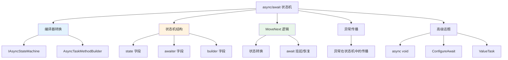
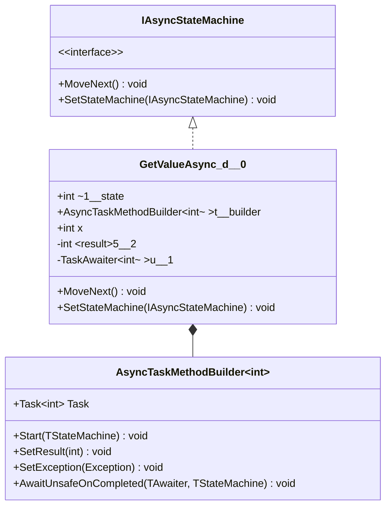
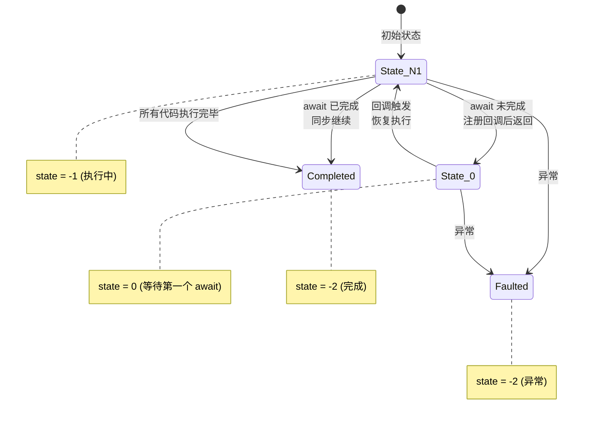
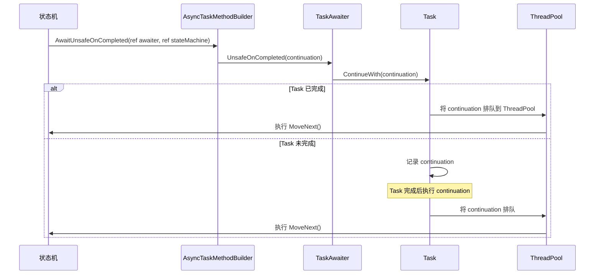
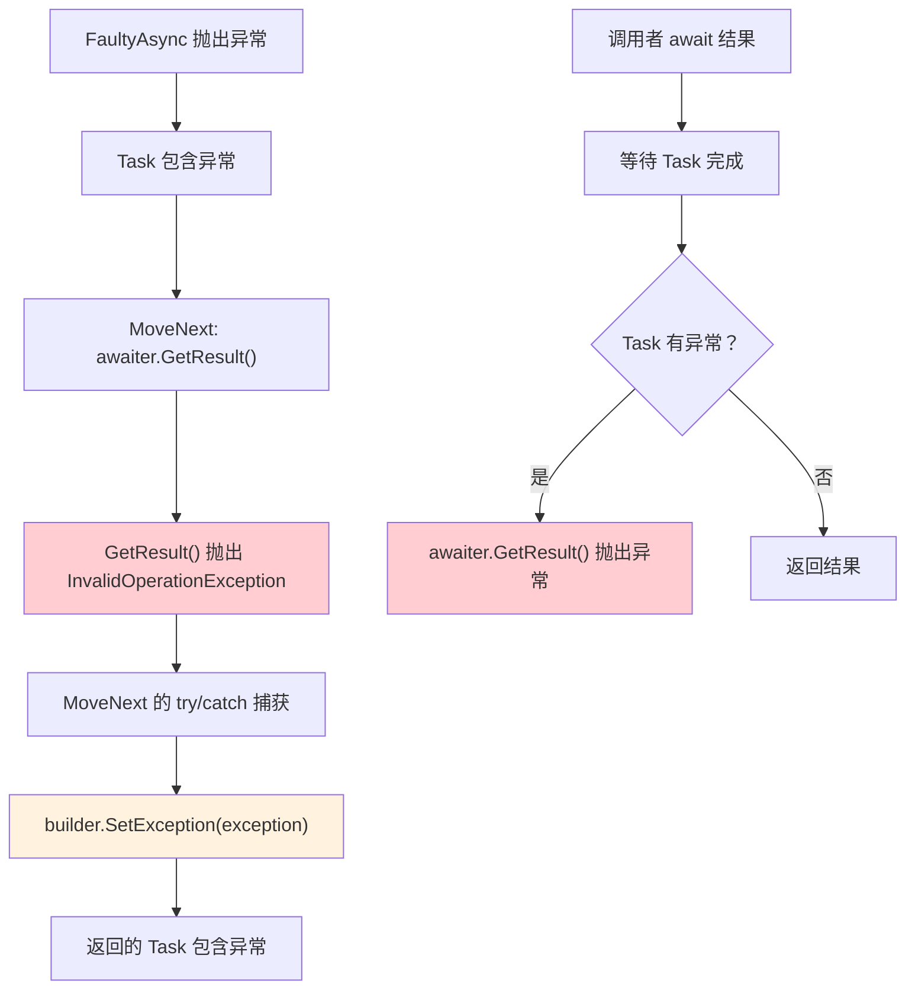
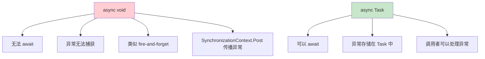
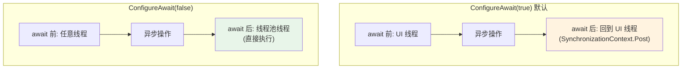
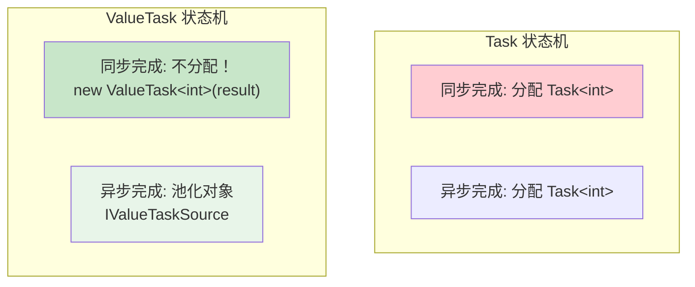
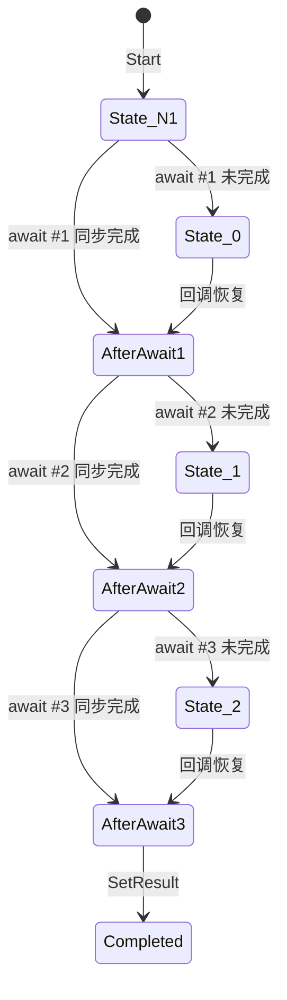
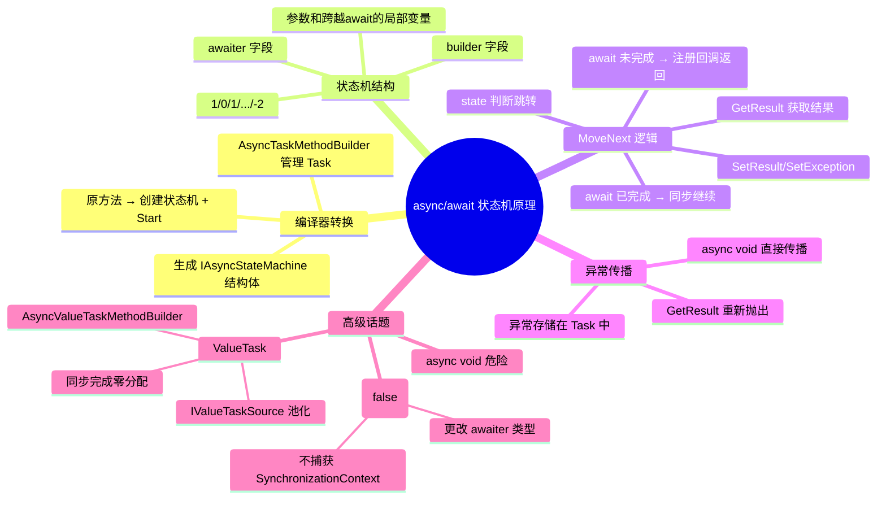

# async/await 状态机原理

> async/await 是 C# 最重要的语言特性之一。编译器将 async 方法转换为状态机，CLR 在 await 点挂起和恢复执行。理解状态机的生成代码和 IL，才能真正掌握异步编程的底层机制。



## 一、async 方法编译为状态机

### 1.1 原始 C# 代码

```csharp
public static async Task<int> GetValueAsync(int x)
{
    Console.WriteLine("开始");
    int result = await SomeAsync(x);
    Console.WriteLine($"结果: {result}");
    return result;
}

private static async Task<int> SomeAsync(int x)
{
    await Task.Delay(100);
    return x * 2;
}
```

### 1.2 编译器生成的状态机类

```csharp
// 编译器生成的代码（简化，还原原始逻辑）
[CompilerGenerated]
private sealed class <GetValueAsync>d__0 : IAsyncStateMachine
{
    public int <>1__state;                // 状态号
    public AsyncTaskMethodBuilder<int> <>t__builder;  // Task 构建器
    public int x;                         // 参数
    private int <result>5__2;             // 局部变量
    private TaskAwaiter<int> <>u__1;      // awaiter

    void IAsyncStateMachine.MoveNext()
    {
        int num = <>1__state;
        try
        {
            TaskAwaiter<int> awaiter;

            if (num != 0)
            {
                // State -1 (初始): 执行第一个 await 之前的代码
                Console.WriteLine("开始");
                awaiter = SomeAsync(x).GetAwaiter();

                if (!awaiter.IsCompleted)
                {
                    // 未完成：注册回调，挂起状态机
                    <>1__state = 0;
                    <>u__1 = awaiter;
                    <GetValueAsync>d__0 stateMachine = this;
                    <>t__builder.AwaitUnsafeOnCompleted(
                        ref awaiter, ref stateMachine);
                    return;  // 返回！不阻塞调用线程
                }
                // 已完成：直接继续
            }
            else
            {
                // State 0: 从 await 恢复
                awaiter = <>u__1;
                <>u__1 = default;
                <>1__state = -1;
            }

            // 获取 await 结果
            int result = awaiter.GetResult();
            <result>5__2 = result;

            Console.WriteLine($"结果: {result}");

            // 设置 Task 的结果
            <>t__builder.SetResult(<result>5__2);
        }
        catch (Exception exception)
        {
            // 捕获异常，设置 Task 的异常
            <>1__state = -2;
            <>t__builder.SetException(exception);
        }
    }

    void IAsyncStateMachine.SetStateMachine(IAsyncStateMachine stateMachine)
    {
        <>t__builder.SetStateMachine(stateMachine);
    }
}
```

### 1.3 状态机类图



### 1.4 入口方法

```csharp
// 编译器生成的入口方法
public static Task<int> GetValueAsync(int x)
{
    <GetValueAsync>d__0 stateMachine = new <GetValueAsync>d__0();
    stateMachine.x = x;
    stateMachine.<>t__builder = AsyncTaskMethodBuilder<int>.Create();
    stateMachine.<>1__state = -1;

    stateMachine.<>t__builder.Start(ref stateMachine);
    return stateMachine.<>t__builder.Task;
}
```

## 二、MoveNext 方法 IL 逻辑

### 2.1 状态转换图



### 2.2 MoveNext 的 IL（简化）

```il
.method private hidebysig newslot virtual final
    instance void MoveNext() cil managed
{
    .locals init (
        [0] int32 num,
        [1] valuetype [System.Runtime]System.Runtime.CompilerServices.TaskAwaiter`1<int32> awaiter,
        [2] class <GetValueAsync>d__0 stateMachine
    )

    IL_0000: ldarg.0
    IL_0001: ldfld int32 <GetValueAsync>d__0::<>1__state
    IL_0006: stloc.0              // num = state

    .try
    {
        IL_0007: ldloc.0
        IL_0008: brfalse.s IL_0020   // if (num == 0) goto resume

        // state == -1: 初始执行
        IL_000a: ldstr "开始"
        IL_000f: call void [System.Runtime]System.Console::WriteLine(string)

        // 调用 SomeAsync(x).GetAwaiter()
        IL_0014: ldarg.0
        IL_0015: ldfld int32 <GetValueAsync>d__0::x
        IL_001a: call class [System.Runtime]System.Threading.Tasks.Task`1<int32> SomeAsync(int32)
        IL_001f: callvirt instance valuetype TaskAwaiter`1<int32> GetAwaiter()
        IL_0024: stloc.1

        // 检查 IsCompleted
        IL_0025: ldloca.s awaiter
        IL_0027: call instance bool get_IsCompleted()
        IL_002c: brtrue.s IL_0040  // if completed, skip registration

        // 未完成：保存 awaiter，设置 state=0，注册回调
        IL_002e: ldarg.0
        IL_002f: ldc.i4.0
        IL_0030: stfld int32 <GetValueAsync>d__0::<>1__state  // state = 0

        IL_0035: ldarg.0
        IL_0036: ldloc.1
        IL_0037: stfld valuetype TaskAwaiter`1<int32> <GetValueAsync>d__0::<>u__1

        IL_003c: br.s IL_0050   // goto AwaitUnsafeOnCompleted

        // state == 0: 从 await 恢复
        IL_0020: ldarg.0
        IL_0021: ldfld valuetype TaskAwaiter`1<int32> <GetValueAsync>d__0::<>u__1
        IL_0026: stloc.1

        IL_0027: ldarg.0
        IL_0028: initobj valuetype TaskAwaiter`1<int32>
        IL_002e: ldarg.0
        IL_002f: ldc.i4.m1
        IL_0030: stfld int32 <GetValueAsync>d__0::<>1__state  // state = -1

        // GetResult
        IL_0040: ldloca.s awaiter
        IL_0042: call instance int32 GetResult()
        IL_0047: stloc.2   // result = awaiter.GetResult()

        // Console.WriteLine($"结果: {result}")
        IL_0048: ldstr "结果: {0}"
        IL_004d: ldloc.2
        IL_004e: call void Console::WriteLine(string, object)

        // SetResult
        IL_0053: ldarg.0
        IL_0054: ldflda AsyncTaskMethodBuilder`1 <GetValueAsync>d__0::<>t__builder
        IL_0059: ldloc.2
        IL_005a: call instance void SetResult(int32)

        IL_005f: leave.s IL_0070
    }
    catch Exception
    {
        IL_0060: ldarg.0
        IL_0061: ldc.i4.s -2
        IL_0063: stfld int32 <GetValueAsync>d__0::<>1__state  // state = -2

        IL_0068: ldarg.0
        IL_0069: ldflda AsyncTaskMethodBuilder`1 <GetValueAsync>d__0::<>t__builder
        IL_006e: call instance void SetException(Exception)
        IL_0073: leave.s IL_0070
    }

    IL_0070: ret
}
```

## 三、TaskAwaiter 原理

### 3.1 GetAwaiter 的含义

```csharp
// await pattern: 对象必须有 GetAwaiter() 方法
// GetAwaiter() 返回的 awaiter 必须实现：
// 1. bool IsCompleted { get; }
// 2. void GetResult(); 或 T GetResult();
// 3. INotifyCompletion.OnCompleted(Action)

// Task.GetAwaiter()
Task<int> task = SomeAsync();
TaskAwaiter<int> awaiter = task.GetAwaiter();

if (awaiter.IsCompleted)
{
    // Task 已完成，同步获取结果
    int result = awaiter.GetResult();
}
else
{
    // Task 未完成，注册回调
    awaiter.OnCompleted(() =>
    {
        int result = awaiter.GetResult();
    });
}
```

### 3.2 AwaitUnsafeOnCompleted 的流程



## 四、异常在状态机中传播

### 4.1 异常传播流程

```csharp
public static async Task<int> ExceptionDemo()
{
    try
    {
        return await FaultyAsync();
    }
    catch (InvalidOperationException ex)
    {
        Console.WriteLine($"捕获: {ex.Message}");
        return -1;
    }
}

private static async Task<int> FaultyAsync()
{
    await Task.Delay(10);
    throw new InvalidOperationException("出错了");
}
```



### 4.2 异常在 MoveNext 中的处理

```csharp
// MoveNext 中的异常处理（编译器生成）
void IAsyncStateMachine.MoveNext()
{
    try
    {
        // ... 正常逻辑 ...

        // 如果 awaiter.GetResult() 抛出异常
        int result = awaiter.GetResult();  // 可能抛出
    }
    catch (Exception exception)
    {
        // 任何异常都进入这里
        <>1__state = -2;  // 标记为已完成（异常）
        <>t__builder.SetException(exception);
        return;
    }
}
```

::: important 异常不直接传播到调用者
async 方法中的异常不会直接传播到调用方法。它被捕获并存储在返回的 Task 对象中。只有当调用者 `await` 这个 Task 时，异常才会被重新抛出。
:::

## 五、async void vs async Task

### 5.1 async void 的危险

```csharp
// async void: 没有返回 Task
public static async void DoSomethingAsync()
{
    await Task.Delay(100);
    throw new Exception("错误！");  // 未观察到的异常
}

// 调用者无法 await
DoSomethingAsync();  // 无法等待完成
// 异常会导致 UnobservedTaskException 或进程崩溃
```



::: warning 只有事件处理器可以使用 async void
`async void` 的唯一合法使用场景是事件处理器（因为事件处理器必须返回 void）。其他任何场景都应使用 `async Task`。
:::

### 5.2 async void 的编译差异

```csharp
// async void 的状态机使用 AsyncVoidMethodBuilder
[CompilerGenerated]
private sealed class <DoSomethingAsync>d__1 : IAsyncStateMachine
{
    public AsyncVoidMethodBuilder <>t__builder;  // 不是 AsyncTaskMethodBuilder！
    // ...
}

// AsyncVoidMethodBuilder.SetException 的行为：
// 将异常传播到 SynchronizationContext.Post
// 如果没有 SynchronizationContext，异常会在线程池上抛出
```

## 六、ConfigureAwait(false) 对状态机的影响

### 6.1 ConfigureAwait 的作用

```csharp
public static async Task<int> WithConfigureAwait()
{
    // ConfigureAwait(false) 表示 await 后不需要回到原始上下文
    int result = await SomeAsync().ConfigureAwait(false);
    // 这里在线程池线程上继续执行，不回到调用线程
    return result;
}
```

### 6.2 IL 层面的差异

```csharp
// 没有 ConfigureAwait
TaskAwaiter<int> awaiter = SomeAsync().GetAwaiter();
builder.AwaitUnsafeOnCompleted(ref awaiter, ref stateMachine);
// AwaitUnsafeOnCompleted 内部会捕获 SynchronizationContext
// 回调在原始上下文上执行

// 有 ConfigureAwait(false)
ConfiguredTaskAwaitable<int>.ConfiguredTaskAwaiter awaiter =
    SomeAsync().ConfigureAwait(false).GetAwaiter();
builder.AwaitUnsafeOnCompleted(ref awaiter, ref stateMachine);
// ConfiguredTaskAwaiter 不捕获 SynchronizationContext
// 回调在线程池线程上执行
```



### 6.3 ConfigureAwait 在状态机中的影响

```csharp
// 状态机字段的变化：
// 无 ConfigureAwait:
private TaskAwaiter<int> <>u__1;

// 有 ConfigureAwait(false):
private ConfiguredTaskAwaitable<int>.ConfiguredTaskAwaiter <>u__1;
// ConfiguredTaskAwaiter 内部不捕获 SynchronizationContext
```

## 七、状态机字段详解

### 7.1 字段列表

```
┌──────────────────────────────────────────────────────────────┐
│  状态机字段详解                                               │
├──────────────────────────────────────────────────────────────┤
│                                                              │
│  <>1__state: int                                             │
│    -1 = 执行中/初始                                          │
│    0, 1, 2... = 等待第 N 个 await                           │
│    -2 = 已完成（正常或异常）                                  │
│                                                              │
│  <>t__builder: AsyncTaskMethodBuilder<int>                   │
│    创建和管理返回的 Task                                     │
│    SetResult / SetException / AwaitUnsafeOnCompleted          │
│                                                              │
│  <>u__1: TaskAwaiter<int>                                    │
│    保存 await 点的 awaiter                                   │
│    恢复时从字段取出 awaiter 调用 GetResult                    │
│                                                              │
│  x: int                                                      │
│    方法参数                                                  │
│                                                              │
│  <result>5__2: int                                           │
│    用户代码中的局部变量                                      │
│    跨越 await 点的局部变量必须保存为字段                     │
│                                                              │
└──────────────────────────────────────────────────────────────┘
```

### 7.2 哪些变量需要保存为字段

```csharp
public static async Task Demo()
{
    int a = 1;           // 跨越 await（在 await 后被使用）→ 必须保存为字段
    int b = 2;           // 跨越 await（在 await 后被使用）→ 必须保存为字段

    await Task.Delay(1);

    int c = a + b;       // c 跨越了第二个 await → 必须保存为字段
    int d = 3;           // 不跨越 await

    await Task.Delay(1);

    int e = c + d;       // e 跨越了 await → 必须保存为字段
}
```

::: important 跨越 await 的局部变量 = 状态机字段
只有跨越 await 点的局部变量才需要保存为状态机字段。未跨越 await 的变量可以在栈上分配。编译器会自动分析哪些变量需要提升为字段。
:::

## 八、ValueTask 状态机差异

### 8.1 ValueTask 的状态机

```csharp
public static async ValueTask<int> GetValueAsync()
{
    await Task.Delay(10);
    return 42;
}

// 编译器生成的状态机使用 AsyncValueTaskMethodBuilder<int>
[CompilerGenerated]
private sealed class <GetValueAsync>d__2 : IAsyncStateMachine
{
    public AsyncValueTaskMethodBuilder<int> <>t__builder;  // 不同！
    // ...
}
```

### 8.2 AsyncValueTaskMethodBuilder 的优化

```csharp
// AsyncValueTaskMethodBuilder 的关键差异：
// 1. 如果结果是同步可用的，不分配 Task 对象
// 2. 使用 IValueTaskSource 池化

public struct AsyncValueTaskMethodBuilder<T>
{
    // 同步完成：直接返回 ValueTask（不分配）
    public void SetResult(T result)
    {
        // 如果是同步完成（state == -1 且没有 await），
        // 直接返回 new ValueTask<int>(result)
        // 无堆分配！
    }

    // 异步完成：分配 Task 或使用对象池
    public void AwaitUnsafeOnCompleted(...)
    {
        // 如果需要异步等待，
        // 使用池化的 Task 对象
    }
}
```



## 九、编译器生成代码详解

### 9.1 多个 await 的状态机

```csharp
public static async Task<int> MultipleAwaits(int x)
{
    int a = await Step1Async(x);      // await #1 → state 0
    int b = await Step2Async(a);      // await #2 → state 1
    int c = await Step3Async(b);      // await #3 → state 2
    return a + b + c;
}
```



### 9.2 try/catch 中的 await

```csharp
public static async Task TryCatchAwait()
{
    try
    {
        await MaybeFaultyAsync();   // await 在 try 中
    }
    catch (Exception ex)
    {
        Console.WriteLine(ex.Message);
    }
}

// 编译器生成的状态机中：
// - try/catch 的边界被编码在 MoveNext 中
// - 每个 await 点可能跨越 try 边界
// - 状态机使用 goto 在不同 catch 处理间跳转
```

### 9.3 using/foreach 中的 await

```csharp
public static async Task UsingWithAwait()
{
    await using var resource = new AsyncResource();
    // 编译器在状态机中添加 IAsyncDisposable 的 DisposeAsync 调用
    // 在 finally 块中执行
}

public static async Task ForeachWithAwait()
{
    await foreach (var item in GetItemsAsync())
    {
        // 编译器生成 IAsyncEnumerator 的 MoveNextAsync/DisposeAsync
    }
}
```

## 十、实战：自定义 TaskLike 类型

```csharp
// 自定义可 await 类型
public readonly struct ConfiguredAwaitable<T>
{
    private readonly Task<T> _task;
    private readonly bool _continueOnCapturedContext;

    public ConfiguredAwaitable(Task<T> task, bool continueOnCapturedContext)
    {
        _task = task;
        _continueOnCapturedContext = continueOnCapturedContext;
    }

    // GetAwaiter 是 await 模式的关键方法
    public ConfiguredAwaiter GetAwaiter() => new(_task, _continueOnCapturedContext);

    public readonly struct ConfiguredAwaiter : ICriticalNotifyCompletion
    {
        private readonly Task<T> _task;
        private readonly bool _continueOnCapturedContext;

        public bool IsCompleted => _task.IsCompleted;

        public T GetResult() => _task.GetAwaiter().GetResult();

        public void OnCompleted(Action continuation)
        {
            _task.ConfigureAwait(_continueOnCapturedContext)
                .GetAwaiter().OnCompleted(continuation);
        }

        public void UnsafeOnCompleted(Action continuation)
        {
            _task.ConfigureAwait(_continueOnCapturedContext)
                .GetAwaiter().UnsafeOnCompleted(continuation);
        }
    }
}
```

## 十一、总结



::: tip 核心要点回顾
1. **async 方法编译为 IAsyncStateMachine** — 结构体 + MoveNext 方法
2. **state 字段控制执行位置** — -1 执行中，0/1/2 等待第 N 个 await，-2 完成
3. **await = GetAwaiter + IsCompleted + OnCompleted/GetResult** — 编译器生成状态转换
4. **异常存储在 Task 中** — 不直接传播，await 时重新抛出
5. **async void 只有事件处理器用** — 异常无法捕获
6. **ConfigureAwait(false) 更改 awaiter 类型** — 不捕获 SynchronizationContext
7. **ValueTask 状态机零分配优化** — 同步完成不创建 Task 对象
:::
