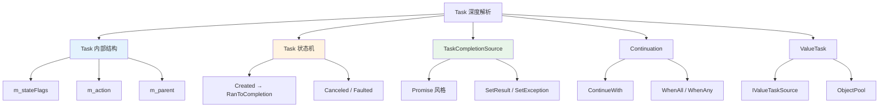
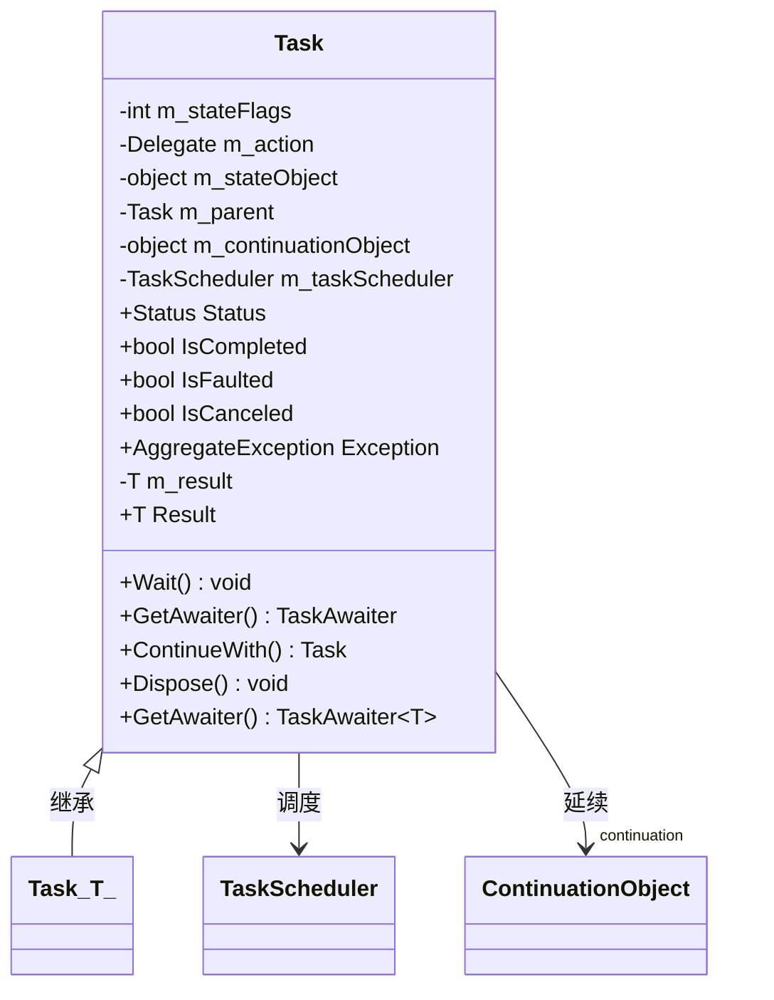
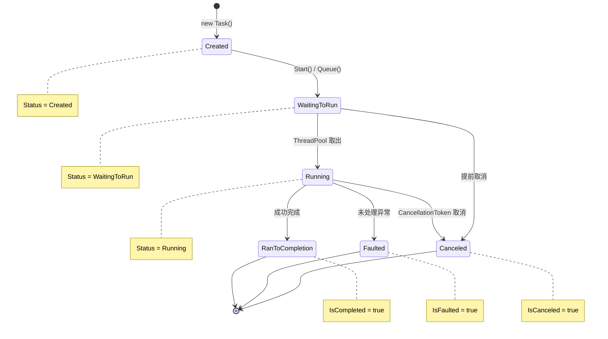
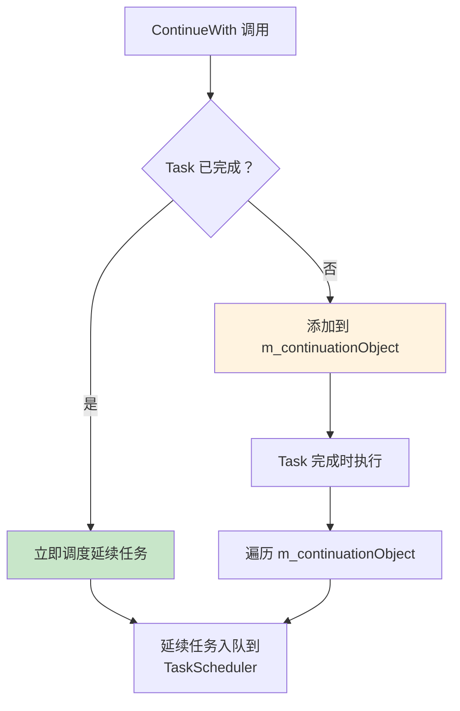
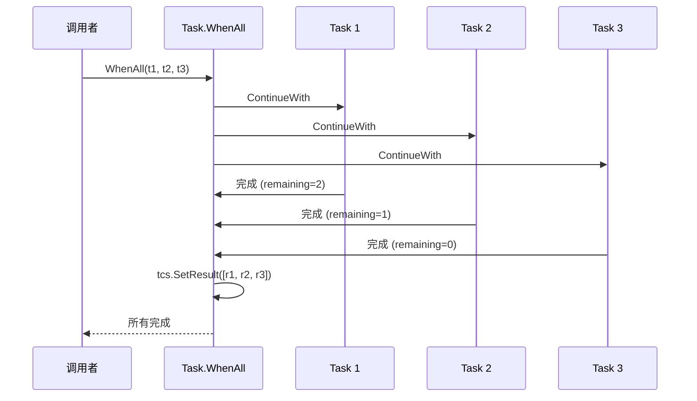
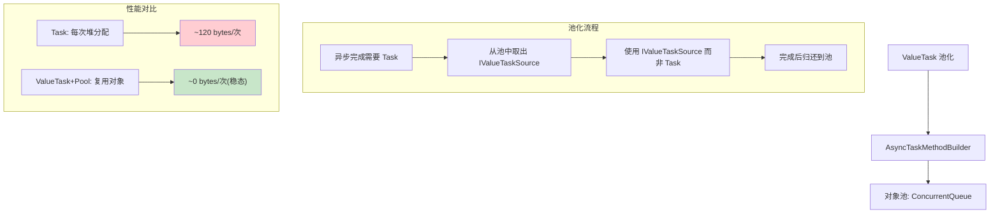
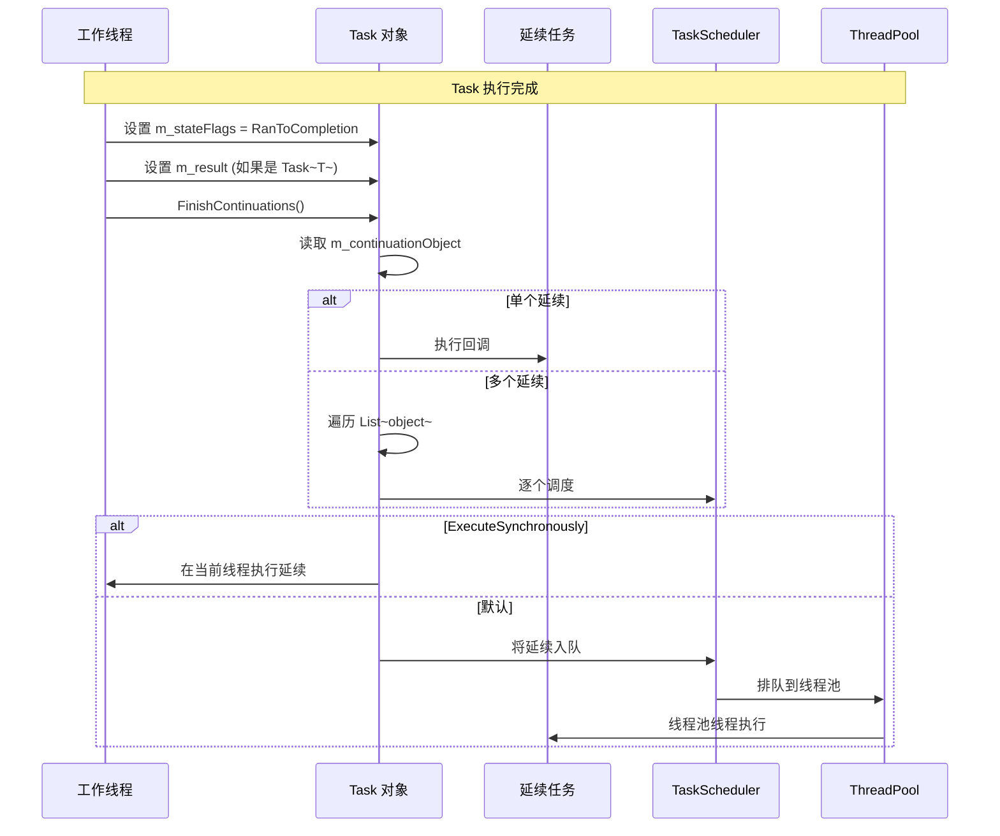
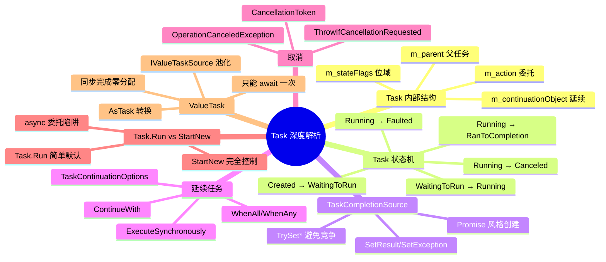

# Task 深度解析

> Task 是 .NET 异步编程的核心抽象。从内部的 m_stateFlags 到外部的 ContinueWith 链，从 Promise 风格的创建到 ValueTask 的池化优化——理解 Task 的每一个层面，才能写出高效的异步代码。



## 一、Task 对象模型

### 1.1 Task 的内部字段

```csharp
// Task 的核心内部字段（简化自 .NET Runtime 源码）
public class Task : IAsyncResult, IDisposable
{
    internal volatile int m_stateFlags;        // 状态标志（位域）
    internal Delegate? m_action;               // 委托（用户代码）
    internal object? m_stateObject;            // 状态对象
    internal Task? m_parent;                   // 父任务
    internal volatile int m_completionState;   // 完成状态
    internal volatile object? m_continuationObject;  // 延续任务
    internal TaskScheduler? m_taskScheduler;   // 调度器

    // m_stateFlags 的位域布局：
    // 注：以下位位置为简化示意，实际运行时中的标志值位于更高位（0x10000+）
    // Bits 0-7:    TaskStateFlags（状态）
    // Bits 8-15:   内部标志
    // Bits 16-23:  状态补充信息
    // Bits 24-31:  自定义状态
}
```

```
┌──────────────────────────────────────────────────────────────┐
│  m_stateFlags 位域布局 (32 bits)                             │
├──────────────────────────────────────────────────────────────┤
│                                                              │
│  Bit 0: TASK_STATE_STARTED                                  │
│  Bit 1: TASK_STATE_DELEGATE_INVOKED                         │
│  Bit 2: TASK_STATE_DISPOSED                                 │
│  Bit 3: TASK_STATE_CANCELED                                 │
│  Bit 4: TASK_STATE_FAULTED                                  │
│  Bit 5: TASK_STATE_COMPLETED_MASK                           │
│  Bit 6: TASK_STATE_WAIT_COMPLETION_NOTIFICATION             │
│  Bit 7: TASK_STATE_RAN_TO_COMPLETION                        │
│                                                              │
│  状态组合:                                                   │
│  ┌──────────────┬────────┬─────────┬──────────┐            │
│  │ 状态         │ Bit 7  │ Bit 4   │ Bit 3    │            │
│  │              │ RanToC │ Faulted │ Canceled │            │
│  ├──────────────┼────────┼─────────┼──────────┤            │
│  │ Created      │   0    │    0    │    0     │            │
│  │ WaitingToRun │   0    │    0    │    0     │            │
│  │ Running      │   0    │    0    │    0     │            │
│  │ RanToComp   │   1    │    0    │    0     │            │
│  │ Faulted     │   0    │    1    │    0     │            │
│  │ Canceled    │   0    │    0    │    1     │            │
│  └──────────────┴────────┴─────────┴──────────┘            │
│                                                              │
└──────────────────────────────────────────────────────────────┘
```

### 1.2 Task 内部结构图



### 1.3 m_continuationObject 的多态

```csharp
// m_continuationObject 可以是多种类型
// 1. null: 没有延续任务
// 2. Action: 单个延续回调
// 3. List<object>: 多个延续回调（ContinueWith 多次时）
// 4. Task: 嵌套的延续任务
// 5. IAsyncStateMachineBox: async 状态机的延续

// 当 Task 完成时，执行延续任务的流程：
// 1. 读取 m_continuationObject
// 2. 如果是 Action → 直接执行
// 3. 如果是 List<object> → 逐个执行
// 4. 如果是 IAsyncStateMachineBox → 调用 MoveNext
```

## 二、Task 状态机

### 2.1 Task 的状态转换



### 2.2 状态查询属性

```csharp
// Task 的状态查询
Task task = SomeOperation();

// Status 属性
Console.WriteLine(task.Status);  // TaskStatus 枚举

// 便捷属性
Console.WriteLine(task.IsCompleted);   // RanToCompletion | Faulted | Canceled
Console.WriteLine(task.IsFaulted);     // 异常完成
Console.WriteLine(task.IsCanceled);    // 取消完成

// 等待完成
task.Wait();                           // 阻塞等待
await task;                            // 异步等待

// 获取结果（Task<T>）
Task<int> intTask = SomeOperationInt();
int result = intTask.Result;           // 阻塞等待并获取结果
int result2 = await intTask;           // 异步等待并获取结果
```

## 三、TaskCompletionSource 原理

### 3.1 TaskCompletionSource 的作用

`TaskCompletionSource&lt;T&gt;` 是手动创建 Task 的标准方式——你控制 Task 何时完成、以什么结果完成。

```csharp
public class TaskCompletionSource<T>
{
    private readonly Task<T> _task;

    public TaskCompletionSource()
    {
        // 注：此处为简化伪代码，实际实现使用内部构造模式，
        // new Task<T>() 并非公开 API，TaskCompletionSource 内部通过
        // 内部方法创建未完成的 Task 实例
        _task = new Task<T>();
    }

    public Task<T> Task => _task;

    public void SetResult(T result)
    {
        // 将 Task 状态设为 RanToCompletion
        // 设置 m_result = result
        // 执行所有延续任务
    }

    public void SetException(Exception exception)
    {
        // 将 Task 状态设为 Faulted
        // 设置 m_exception = exception
        // 执行所有延续任务
    }

    public void SetCanceled()
    {
        // 将 Task 状态设为 Canceled
        // 执行所有延续任务
    }

    // Try 变体：如果 Task 已经完成，返回 false
    public bool TrySetResult(T result);
    public bool TrySetException(Exception exception);
    public bool TrySetCanceled();
}
```

### 3.2 Promise 风格 Task 创建

```csharp
// 使用 TaskCompletionSource 创建 Promise 风格的 Task
public static Task<string> DownloadAsync(string url)
{
    var tcs = new TaskCompletionSource<string>();

    var handler = new HttpClientHandler();
    var client = new HttpClient(handler);

    // 非回调模式的异步操作
    client.GetStringAsync(url).ContinueWith(t =>
    {
        if (t.IsFaulted)
            tcs.TrySetException(t.Exception!.InnerException!);
        else if (t.IsCanceled)
            tcs.TrySetCanceled();
        else
            tcs.TrySetResult(t.Result);
    });

    return tcs.Task;  // 立即返回，稍后完成
}
```

```mermaid
sequenceDiagram
    participant Caller as 调用者
    participant TCS as TaskCompletionSource
    participant Task as Task&lt;string&gt;
    participant Worker as 异步操作

    Caller->>TCS: new TaskCompletionSource&lt;string&gt;()
    TCS->>Task: 创建未完成的 Task
    TCS-->>Caller: 返回 tcs.Task

    Caller->>Worker: 启动异步操作
    Worker->>Worker: 执行中...

    Note over Caller: 可以 await tcs.Task

    Worker->>TCS: SetResult("数据")
    TCS->>Task: m_stateFlags = RanToCompletion
    TCS->>Task: m_result = "数据"
    TCS->>Task: 执行延续任务

    Caller->>Task: await 完成
    Task-->>Caller: 返回 "数据"
```

## 四、TaskContinuation（ContinueWith）

### 4.1 ContinueWith 的原理

```csharp
// ContinueWith 注册延续任务
Task<int> task = Task.Run(() => 42);

task.ContinueWith(t =>
{
    Console.WriteLine($"结果: {t.Result}");
    return t.Result * 2;
})
.ContinueWith(t =>
{
    Console.WriteLine($"翻倍: {t.Result}");
});
```

### 4.2 ContinueWith 的 IL

```il
// ContinueWith 的核心逻辑
.method public hidebysig instance class Task`1<int32> ContinueWith(
    class Func`2<class Task`1<int32>, int32> continuationFunction
) cil managed
{
    // 1. 创建 TaskContinuation 对象
    IL_0000: ldarg.1
    IL_0001: newobj instance void TaskContinuation::.ctor(...)

    // 2. 检查 Task 是否已完成
    IL_0006: ldarg.0
    IL_0007: call instance bool Task::get_IsCompleted()

    // 3. 如果已完成，直接调度延续任务
    IL_000c: brtrue.s IL_0018

    // 4. 如果未完成，添加到 m_continuationObject
    IL_000e: ldarg.0
    IL_000f: ldloc.0
    IL_0010: call instance void Task::AddContinuation(object)

    IL_0015: br.s IL_0020

    // 5. 已完成 → 立即执行
    IL_0018: ldloc.0
    IL_0019: callvirt instance void TaskContinuation::Run()

    IL_0020: ret
}
```



### 4.3 延续任务选项

```csharp
// TaskContinuationOptions 控制延续任务的执行条件
task.ContinueWith(t =>
{
    // 只在成功完成时执行
}, TaskContinuationOptions.OnlyOnRanToCompletion);

task.ContinueWith(t =>
{
    // 只在异常时执行
}, TaskContinuationOptions.OnlyOnFaulted);

task.ContinueWith(t =>
{
    // 只在取消时执行
}, TaskContinuationOptions.OnlyOnCanceled);

task.ContinueWith(t =>
{
    // 在调用线程上执行（不排队到线程池）
}, TaskContinuationOptions.ExecuteSynchronously);
```

::: important ExecuteSynchronously 的性能影响
`ExecuteSynchronously` 让延续任务在完成 Task 的同一线程上执行，避免了线程池调度。但如果延续任务耗时，会阻塞完成线程。适用于轻量级延续操作。
:::

## 五、Task.WhenAll / WhenAny

### 5.1 WhenAll 的原理

```csharp
// WhenAll: 等待所有 Task 完成
public static Task<T[]> WhenAll<T>(params Task<T>[] tasks)
{
    // 内部实现（简化）
    var tcs = new TaskCompletionSource<T[]>();

    int remaining = tasks.Length;
    T[] results = new T[tasks.Length];

    for (int i = 0; i < tasks.Length; i++)
    {
        int index = i;
        tasks[i].ContinueWith(t =>
        {
            if (t.IsFaulted)
                tcs.TrySetException(t.Exception!.InnerExceptions);
            else if (t.IsCanceled)
                tcs.TrySetCanceled();
            else
            {
                results[index] = t.Result;
                if (Interlocked.Decrement(ref remaining) == 0)
                    tcs.TrySetResult(results);
            }
        }, TaskContinuationOptions.ExecuteSynchronously);
    }

    return tcs.Task;
}
```



### 5.2 WhenAny 的原理

```csharp
// WhenAny: 等待任一 Task 完成
public static Task<Task<T>> WhenAny<T>(params Task<T>[] tasks)
{
    var tcs = new TaskCompletionSource<Task<T>>();

    foreach (var task in tasks)
    {
        task.ContinueWith(t =>
        {
            tcs.TrySetResult(t);  // 第一个完成的 Task 胜出
        }, TaskContinuationOptions.ExecuteSynchronously);
    }

    return tcs.Task;
}
```

## 六、CancellationToken 与 Task 取消

### 6.1 取消 Task

```csharp
// 方式 1: 在 Task 内部检查取消
public static async Task<int> CancellableOperation(CancellationToken ct)
{
    for (int i = 0; i < 1000; i++)
    {
        ct.ThrowIfCancellationRequested();  // 检查取消
        await DoStepAsync(i);
    }
    return 0;
}

// 方式 2: 在 Task.Run 中传递 CancellationToken
var cts = new CancellationTokenSource();
Task task = Task.Run(() =>
{
    // 长时间运行的操作
    Thread.Sleep(10000);
}, cts.Token);

cts.CancelAfter(TimeSpan.FromSeconds(5));  // 5秒后取消
```

### 6.2 取消的 IL

```il
// ThrowIfCancellationRequested 的 IL
.method public hidebysig instance void ThrowIfCancellationRequested() cil managed
{
    IL_0000: ldarg.0
    IL_0001: call instance bool get_IsCancellationRequested()
    IL_0006: brfalse.s IL_0013

    IL_0008: ldarg.0
    IL_0009: newobj instance void [System.Runtime]System.OperationCanceledException::.ctor(
        valuetype [System.Runtime]System.Threading.CancellationToken)
    IL_000e: throw

    IL_0013: ret
}
```

## 七、Task.Factory.StartNew vs Task.Run

### 7.1 两者的区别

```csharp
// Task.Run: 简单的默认选项
Task.Run(() => DoWork());
// 等价于:
Task.Factory.StartNew(() => DoWork(),
    CancellationToken.None,
    TaskCreationOptions.DenyChildAttach,
    TaskScheduler.Default);

// Task.Factory.StartNew: 完全控制
Task.Factory.StartNew(() => DoWork(),
    cancellationToken,
    TaskCreationOptions.LongRunning,
    TaskScheduler.Current);
```

| 特性 | Task.Run | Task.Factory.StartNew |
|------|---------|----------------------|
| 默认调度器 | TaskScheduler.Default | TaskScheduler.Current |
| 子任务附加 | DenyChildAttach | None（允许附加） |
| 长时间运行 | 不支持 | TaskCreationOptions.LongRunning |
| 简洁性 | 简单 | 复杂 |
| 推荐场景 | 大多数场景 | 需要精细控制 |

::: warning Task.Run vs StartNew 的常见陷阱
```csharp
// 陷阱：StartNew 的异步委托
Task.Factory.StartNew(async () =>
{
    await Task.Delay(100);
    // StartNew 返回 Task<Task>，但被隐式解包为 Task
    // 如果不解包，外层 Task 在委托返回时就完成了
});

// 正确方式
Task.Run(async () =>
{
    await Task.Delay(100);
    // Task.Run 正确处理 async 委托
});
```
:::

## 八、ValueTask 内部

### 8.1 ValueTask 的结构

```csharp
// ValueTask<T> 的内部结构
public readonly struct ValueTask<T>
{
    // 两种表示：
    // 1. T result — 同步完成，直接存储结果
    // 2. Task<T> task — 异步完成，存储 Task

    private readonly T _result;
    private readonly Task<T>? _task;
    private readonly IValueTaskSource<T>? _valueTaskSource;
    private readonly short _token;
}
```

```
┌──────────────────────────────────────────────────────────────┐
│  ValueTask<T> 的两种状态                                     │
├──────────────────────────────────────────────────────────────┤
│                                                              │
│  情况 1: 同步完成（_task = null）                            │
│  ┌──────────────────────────────────┐                       │
│  │ _result: T (直接存储值)           │                       │
│  │ _task: null                       │                       │
│  │ _valueTaskSource: null            │                       │
│  └──────────────────────────────────┘                       │
│  → 零堆分配！                                                │
│                                                              │
│  情况 2: 异步完成（_task != null）                           │
│  ┌──────────────────────────────────┐                       │
│  │ _result: default(T)              │                       │
│  │ _task: Task<T> (引用)             │                       │
│  │ _valueTaskSource: null            │                       │
│  └──────────────────────────────────┘                       │
│  → 一次堆分配（Task 对象）                                   │
│                                                              │
│  情况 3: 池化（_valueTaskSource != null）.NET 5+             │
│  ┌──────────────────────────────────┐                       │
│  │ _result: default(T)              │                       │
│  │ _task: null                       │                       │
│  │ _valueTaskSource: IValueTaskSource│ ← 池化对象            │
│  │ _token: short (版本号)            │                       │
│  └──────────────────────────────────┘                       │
│  → 池化复用，减少 GC 压力                                    │
│                                                              │
└──────────────────────────────────────────────────────────────┘
```

### 8.2 IValueTaskSource

```csharp
// IValueTaskSource: ValueTask 的可池化后端
public interface IValueTaskSource<out T>
{
    T GetResult(short token);
    ValueTaskSourceStatus GetStatus(short token);
    void OnCompleted(Action<object?> continuation, object? state,
        short token, ValueTaskSourceOnCompletedFlags flags);
}

// ManualResetValueTaskSourceCore: 帮助实现 IValueTaskSource
public class ManualResetValueTaskSource<T> : IValueTaskSource<T>
{
    private ManualResetValueTaskSourceCore<T> _core;

    public ValueTask<T> GetValueTask()
    {
        return new ValueTask<T>(this, _core.Version);
    }

    public void SetResult(T result)
    {
        _core.Reset();
        _core.SetResult(result);
    }

    T IValueTaskSource<T>.GetResult(short token) => _core.GetResult(token);
    ValueTaskSourceStatus IValueTaskSource<T>.GetStatus(short token) => _core.GetStatus(token);
    void IValueTaskSource<T>.OnCompleted(Action<object?> continuation, object? state,
        short token, ValueTaskSourceOnCompletedFlags flags) =>
        _core.OnCompleted(continuation, state, token, flags);
}
```

### 8.3 ObjectPool 与 ValueTask



### 8.4 ValueTask 的使用限制

```csharp
// ValueTask 的限制
public static async ValueTask<int> GetAsync()
{
    var valueTask = GetValue();
    // valueTask 可以 await 一次
    int result = await valueTask;

    // 错误：不能 await 两次
    // int result2 = await valueTask;  // 可能抛出 InvalidOperationException

    // 错误：不能在完成后获取 .Result
    // int result3 = valueTask.Result;  // 可能无效

    // 正确：如果需要多次使用，转换为 Task
    ValueTask<int> vt = GetValue();
    Task<int> task = vt.AsTask();  // 转换为 Task
    int r1 = await task;
    int r2 = await task;  // OK，Task 可以多次 await
}

private static ValueTask<int> GetValue() => ValueTask.FromResult(42);
```

::: warning ValueTask 使用铁律
1. **只能 await 一次** — ValueTask 可能使用池化对象，重复 await 不可预测
2. **不要直接访问 .Result** — 除非确认 IsCompleted
3. **需要多次使用时调用 .AsTask()** — 转换为 Task
4. **不要在并发上下文中共享** — ValueTask 不是线程安全的
:::

## 九、Task 的完成流程

### 9.1 Task 完成的完整流程



### 9.2 FinishContinuations 的实现

```csharp
// .NET Runtime 源码简化
internal void FinishContinuations()
{
    object? continuation = m_continuationObject;
    m_continuationObject = null;  // 清空，防止重复执行

    if (continuation == null)
        return;

    if (continuation is Action action)
    {
        // 单个回调：直接执行
        action();
    }
    else if (continuation is List<object> list)
    {
        // 多个回调：逐个处理
        foreach (var item in list)
        {
            if (item is Action a)
                a();
            else if (item is IAsyncStateMachineBox box)
                box.MoveNext();
            else if (item is TaskContinuation tc)
                tc.Run();
        }
    }
    else if (continuation is IAsyncStateMachineBox box)
    {
        box.MoveNext();
    }
}
```

## 十、实战：高性能异步管道

```csharp
public class AsyncPipeline<TInput, TOutput>
{
    private readonly Func<TInput, CancellationToken, ValueTask<TOutput>> _processor;
    private readonly SemaphoreSlim _concurrencyLimiter;
    private readonly Channel<TInput> _inputChannel;
    private readonly Channel<TOutput> _outputChannel;

    public AsyncPipeline(
        Func<TInput, CancellationToken, ValueTask<TOutput>> processor,
        int capacity = 100,
        int maxConcurrency = Environment.ProcessorCount)
    {
        _processor = processor;
        _concurrencyLimiter = new SemaphoreSlim(maxConcurrency);
        _inputChannel = Channel.CreateBounded<TInput>(new BoundedChannelOptions(capacity)
        {
            FullMode = BoundedChannelFullMode.Wait,
            SingleReader = false,
            SingleWriter = true
        });
        _outputChannel = Channel.CreateUnbounded<TOutput>();
    }

    public ChannelWriter<TInput> Input => _inputChannel.Writer;
    public ChannelReader<TOutput> Output => _outputChannel.Reader;

    public async Task RunAsync(CancellationToken ct = default)
    {
        await foreach (var input in _inputChannel.Reader.ReadAllAsync(ct))
        {
            await _concurrencyLimiter.WaitAsync(ct);
            _ = ProcessAsync(input, ct);  // fire and forget（有并发控制）
        }
    }

    private async Task ProcessAsync(TInput input, CancellationToken ct)
    {
        try
        {
            TOutput output = await _processor(input, ct);
            await _outputChannel.Writer.WriteAsync(output, ct);
        }
        finally
        {
            _concurrencyLimiter.Release();
        }
    }
}
```

## 十一、总结



::: tip 核心要点回顾
1. **m_stateFlags 位域编码状态** — 一个 int32 同时表示多种状态
2. **m_continuationObject 多态存储延续** — Action / List / IAsyncStateMachineBox
3. **TaskCompletionSource 手动创建 Task** — Promise 风格，完全控制完成时机
4. **ContinueWith 是低层 API** — 推荐使用 async/await 代替
5. **WhenAll 并行等待** — 用 Interlocked 计数，全部完成时 SetResult
6. **ValueTask 同步完成零分配** — 但只能 await 一次，需要多次使用时 AsTask
7. **IValueTaskSource 池化** — .NET 5+ 的 ValueTask 池化机制
8. **Task.Run 优先于 StartNew** — 除非需要精细控制
:::
