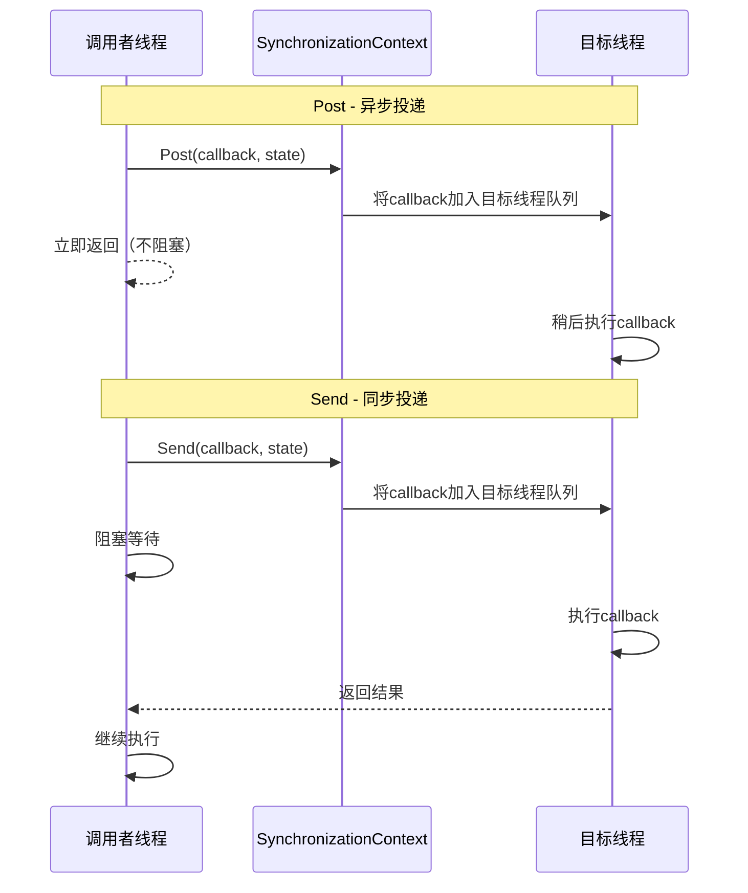
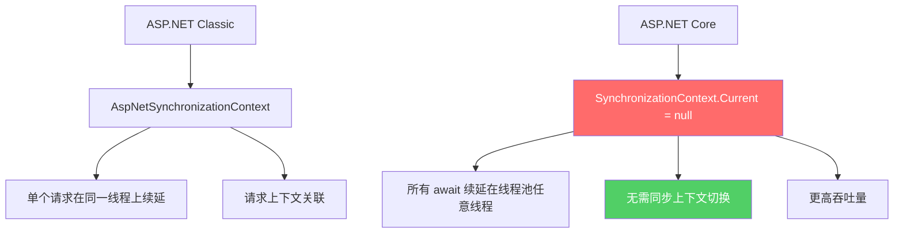
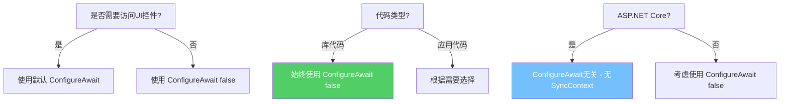
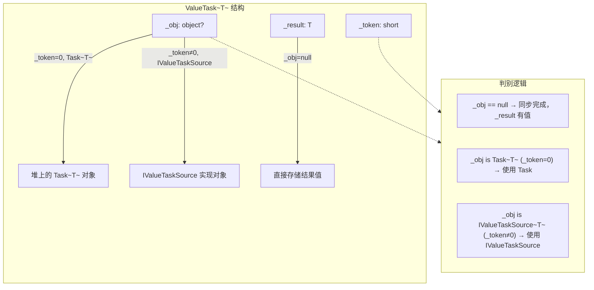
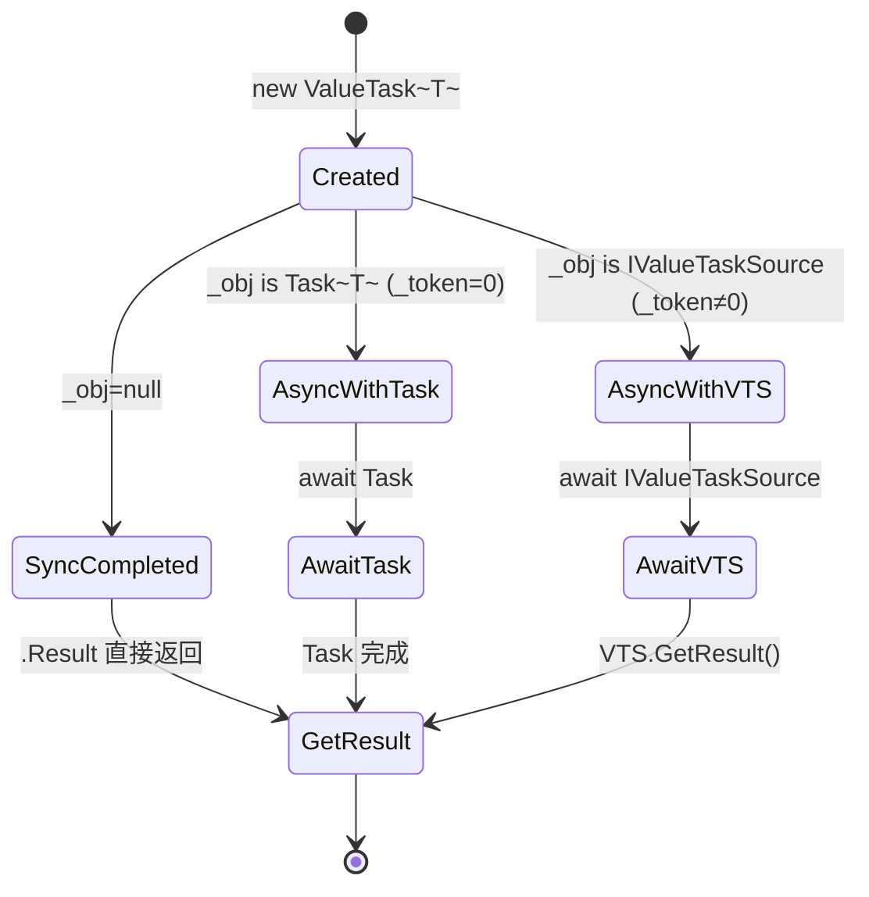
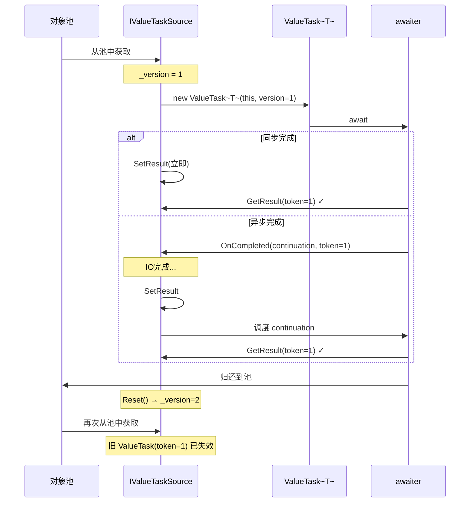
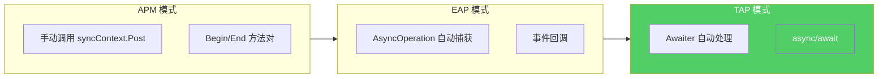
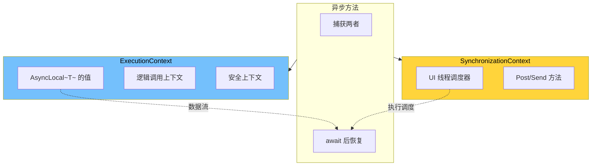
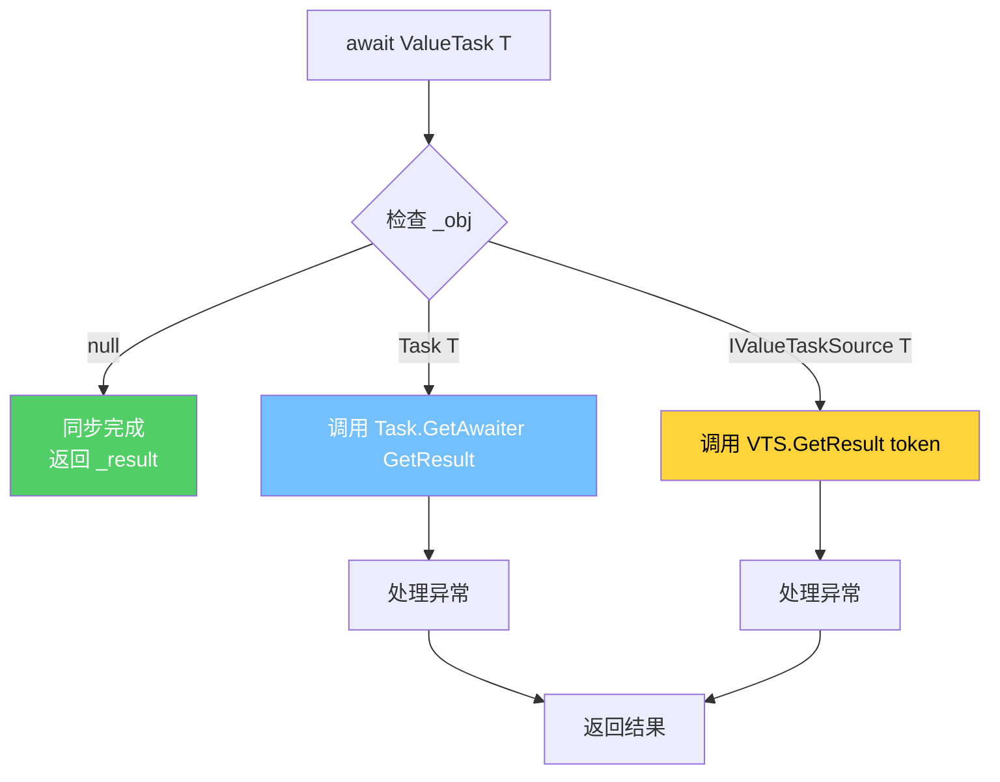
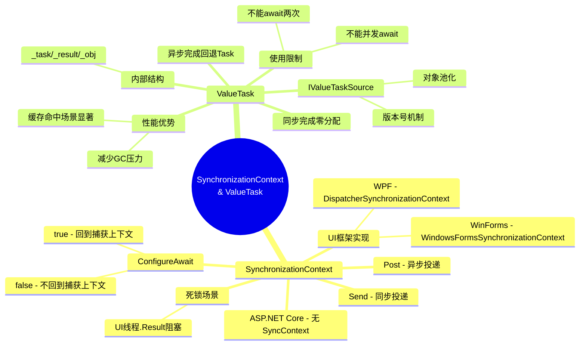

# SynchronizationContext 与 ValueTask

## 概述

在异步编程的深层世界中，`SynchronizationContext` 是连接异步操作与同步上下文的桥梁，而 `ValueTask` 则是对 `Task` 的性能优化利器。理解这两者的底层原理，是从"会用 async/await"迈向"精通异步编程"的关键一步。

本文将从 IL 层面深入剖析 `SynchronizationContext` 的 Post/Send 机制、`ConfigureAwait` 的编译器行为、`ValueTask` 的内部结构，以及它们在真实场景中的应用与陷阱。

---

## 一、SynchronizationContext 原理

### 1.1 什么是 SynchronizationContext

`SynchronizationContext` 是 .NET 提供的一个抽象基类，它定义了一个"调度模型"——将委托投递到特定上下文中执行的能力。不同的宿主环境（WPF、Windows Forms、ASP.NET 等）提供不同的实现。

```csharp
namespace System.Threading
{
    public class SynchronizationContext
    {
        // 将委托异步投递到同步上下文
        public virtual void Post(SendOrPostCallback d, object? state);

        // 将委托同步投递到同步上下文
        public virtual void Send(SendOrPostCallback d, object? state);

        // 创建当前同步上下文的副本
        public virtual SynchronizationContext CreateCopy();

        // 注册通知等待句柄的回调
        public virtual void Wait(IntPtr[] waitHandles,
            bool waitAll, int millisecondsTimeout);

        // 设置当前线程的同步上下文
        public static void SetSynchronizationContext(
            SynchronizationContext? syncContext);

        // 获取当前线程的同步上下文
        public static SynchronizationContext? Current { get; }
    }
}
```

### 1.2 Post 与 Send 的核心区别



::: important Post vs Send 的本质区别
- **Post**：异步投递，将委托排入目标线程的消息队列后立即返回，不阻塞调用线程
- **Send**：同步投递，将委托排入目标线程的消息队列后阻塞等待执行完成
- 默认实现：`Post` 使用 `ThreadPool.QueueUserWorkItem`，`Send` 直接在调用线程执行委托
:::

### 1.3 默认 SynchronizationContext 的行为

当没有自定义 `SynchronizationContext` 时（如控制台应用、ASP.NET Core），`Current` 返回 `null`，此时异步回调通过 `ThreadPool` 调度：

```csharp
// 默认实现 - 来自 .NET Runtime 源码
public virtual void Post(SendOrPostCallback d, object? state)
{
    ThreadPool.QueueUserWorkItem(static s =>
    {
        s.d(s.state);
    }, (d, state), preferLocal: false);
}

public virtual void Send(SendOrPostCallback d, object? state)
{
    // 默认直接在调用线程执行
    d(state);
}
```

### 1.4 SynchronizationContext 的捕获与恢复

编译器在生成异步状态机时，会在 `MoveNext()` 方法的开头捕获和恢复 `SynchronizationContext`：

```csharp
// C# 源码
async Task ButtonClickAsync()
{
    var data = await FetchDataAsync();
    UpdateUI(data); // 需要 UI 线程执行
}
```

对应的 IL 核心逻辑（简化）：

```il
.method private hidebysig instance void MoveNext() cil managed
{
    .maxstack 3
    .locals init (
        [0] int32 num,
        [1] class [System.Runtime]System.Threading.SynchronizationContext currentContext
    )

    // 捕获当前 SynchronizationContext
    IL_0000: call class [System.Runtime]System.Threading.SynchronizationContext
            [System.Runtime]System.Threading.SynchronizationContext::get_Current()
    IL_0005: stloc.1          // currentContext = SynchronizationContext.Current

    // ... await 后的续延逻辑 ...

    // 如果存在 SynchronizationContext 且需要回投
    IL_0050: ldloc.1          // 加载 currentContext
    IL_0051: brfalse.s IL_0060  // 如果为null，跳过

    IL_0053: ldloc.1
    IL_0054: ldftn void MyStateMachine::<Continuation>(object)
    IL_0059: newobj instance void [System.Runtime]System.Action::.ctor(object, native int)
    IL_005e: callvirt instance void [System.Runtime]System.Threading.SynchronizationContext::Post(
        class [System.Runtime]System.Threading.SendOrPostCallback, object)
    IL_0063: ret

    IL_0060: // 无 SyncContext，使用 TaskScheduler
    IL_0061: call class [System.Runtime]System.Threading.Tasks.TaskScheduler
            [System.Runtime]System.Threading.Tasks.TaskScheduler::get_Default()
    // ...
}
```

::: warning 编译器行为的版本差异
在 .NET Framework 时代，编译器会在 await 完成后自动调用 `SynchronizationContext.Post` 将续延投递回捕获的上下文。而在 .NET Core/5+ 中，编译器的行为有微调，但核心机制不变——`awaiter.UnsafeOnCompleted` 内部会检查 `SynchronizationContext.Current`。
:::

---

## 二、各框架的 SynchronizationContext 实现

### 2.1 Windows Forms 的 WindowsFormsSynchronizationContext

```csharp
// Windows Forms 实现 - 将回调投递到消息循环
internal class WindowsFormsSynchronizationContext : SynchronizationContext
{
    private readonly Control _controlToSendTo;

    public override void Post(SendOrPostCallback d, object? state)
    {
        // 使用 Control.BeginInvoke 投递到 UI 线程消息循环
        _controlToSendTo?.BeginInvoke(d, [state]);
    }

    public override void Send(SendOrPostCallback d, object? state)
    {
        // 使用 Control.Invoke 同步在 UI 线程执行
        _controlToSendTo?.Invoke(d, [state]);
    }
}
```

### 2.2 WPF 的 DispatcherSynchronizationContext

```csharp
// WPF 实现 - 使用 Dispatcher 投递
internal class DispatcherSynchronizationContext : SynchronizationContext
{
    private readonly Dispatcher _dispatcher;
    private readonly DispatcherPriority _priority;

    public override void Post(SendOrPostCallback d, object? state)
    {
        // 使用 Dispatcher.BeginInvoke 异步投递
        _dispatcher.BeginInvoke(_priority, d, state);
    }

    public override void Send(SendOrPostCallback d, object? state)
    {
        // 使用 Dispatcher.Invoke 同步执行
        _dispatcher.Invoke(_priority, d, state);
    }
}
```

### 2.3 ASP.NET Core 无 SynchronizationContext



::: important ASP.NET Core 为什么移除了 SynchronizationContext
1. **性能**：不再需要在线程之间切换上下文，减少了线程阻塞
2. **可扩展性**：请求可以在任意线程池线程上续延，提高吞吐量
3. **简化**：开发者不再需要到处写 `ConfigureAwait(false)`
4. **设计哲学**：ASP.NET Core 倾向于无状态、异步优先的设计

参考 .NET Runtime 源码中 `SynchronizationContext.cs` 的注释：
> "ASP.NET Core does not have a SynchronizationContext, so awaits resume on whatever thread the awaiter completes on."
:::

### 2.4 自定义 SynchronizationContext 示例

```csharp
// 单线程同步上下文 - 用于测试或特殊场景
public class SingleThreadSynchronizationContext : SynchronizationContext
{
    private readonly BlockingCollection<(SendOrPostCallback, object?)> _queue = new();
    private readonly Thread _thread;

    public SingleThreadSynchronizationContext()
    {
        _thread = new Thread(Run)
        {
            IsBackground = true
        };
        _thread.Start();
    }

    public override void Post(SendOrPostCallback d, object? state)
    {
        _queue.Add((d, state));
    }

    public override void Send(SendOrPostCallback d, object? state)
    {
        if (Thread.CurrentThread == _thread)
        {
            d(state); // 已经在目标线程，直接执行
            return;
        }

        using var mre = new ManualResetEventSlim(false);
        Exception? exception = null;
        _queue.Add((s =>
        {
            try { d(s); }
            catch (Exception ex) { exception = ex; }
            finally { mre.Set(); }
        }, state));
        mre.Wait();
        exception?.Throw();
    }

    private void Run()
    {
        SetSynchronizationContext(this);
        foreach (var (callback, state) in _queue.GetConsumingEnumerable())
        {
            callback(state);
        }
    }
}
```

---

## 三、ConfigureAwait 深度解析

### 3.1 ConfigureAwait 的本质

`ConfigureAwait(bool continueOnCapturedContext)` 并不是一个特殊的关键字——它只是返回一个自定义的 `TaskAwaiter`，该 Awaiter 在调度续延时会检查 `continueOnCapturedContext` 参数：

```csharp
// .NET Runtime 源码简化版
public struct ConfiguredTaskAwaitable
{
    private readonly ConfiguredTaskAwaiter _awaiter;

    internal ConfiguredTaskAwaitable(Task task, bool continueOnCapturedContext)
    {
        _awaiter = new ConfiguredTaskAwaiter(task, continueOnCapturedContext);
    }

    public ConfiguredTaskAwaiter GetAwaiter() => _awaiter;

    public struct ConfiguredTaskAwaiter : ICriticalNotifyCompletion
    {
        private readonly Task _task;
        private readonly bool _continueOnCapturedContext;

        public void UnsafeOnCompleted(Action continuation)
        {
            // 核心决策逻辑
            if (_continueOnCapturedContext)
            {
                // 检查 SynchronizationContext
                var syncContext = SynchronizationContext.Current;
                if (syncContext != null)
                {
                    syncContext.Post(state =>
                        ((Action)state!)(), continuation);
                    return;
                }

                // 检查 TaskScheduler
                var scheduler = TaskScheduler.Current;
                if (scheduler != TaskScheduler.Default)
                {
                    Task.Factory.StartNew(continuation,
                        CancellationToken.None,
                        TaskCreationOptions.DenyChildAttach,
                        scheduler);
                    return;
                }
            }

            // 直接在线程池执行（或 awaiter 完成的线程上）
            _task.UnsafeOnCompleted(continuation);
        }
    }
}
```

### 3.2 ConfigureAwait(false) 的 IL 影响

```csharp
// C# 代码
async Task WithConfigureAwaitAsync()
{
    await Task.Delay(100).ConfigureAwait(false);
    Console.WriteLine("不回到原始上下文");
}

async Task WithoutConfigureAwaitAsync()
{
    await Task.Delay(100);
    Console.WriteLine("可能回到原始上下文");
}
```

两个方法的 IL 核心差异在于 `GetAwaiter()` 调用：

```il
// WithoutConfigureAwaitAsync - MoveNext 中的 await 逻辑
IL_0020: callvirt instance class [System.Runtime]System.Threading.Tasks.Task
        [System.Runtime]System.Threading.Tasks.Task::Delay(int32)
IL_0025: callvirt instance valuetype [System.Runtime]System.Runtime.CompilerServices.TaskAwaiter
        [System.Runtime]System.Threading.Tasks.Task::GetAwaiter()
IL_002a: stloc.s awaiter

// WithConfigureAwaitAsync - MoveNext 中的 await 逻辑
IL_0020: callvirt instance class [System.Runtime]System.Threading.Tasks.Task
        [System.Runtime]System.Threading.Tasks.Task::Delay(int32)
IL_0025: callvirt instance valuetype [System.Runtime]System.Runtime.CompilerServices.ConfiguredTaskAwaitable
        [System.Runtime]System.Threading.Tasks.Task::ConfigureAwait(bool)
IL_002a: callvirt instance valuetype [System.Runtime]System.Runtime.CompilerServices.ConfiguredTaskAwaitable/ConfiguredTaskAwaiter
        [System.Runtime]System.Runtime.CompilerServices.ConfiguredTaskAwaitable::GetAwaiter()
IL_002f: stloc.s awaiter
```

::: info ConfigureAwait(false) 的性能收益
`ConfigureAwait(false)` 避免了 `SynchronizationContext.Post` 的开销：
1. **减少一次委托分配**：不需要创建 `SendOrPostCallback` 委托
2. **减少线程切换**：续延可以直接在完成 await 的线程上执行
3. **减少消息队列压力**：不向 UI 消息循环投递额外消息
:::

### 3.3 ConfigureAwait(true) 死锁场景

```mermaid
sequenceDiagram
    participant UI as UI线程
    participant TP as 线程池线程
    participant SC as SynchronizationContext

    UI->>UI: 调用 async 方法（阻塞等待）
    UI->>TP: await Task.Delay(1000)
    Note over UI: UI线程被 .Result 阻塞

    TP->>TP: Delay 完成
    TP->>SC: Post(continuation, null)
    SC->>UI: 将 continuation 放入消息队列
    Note over UI: UI线程被阻塞，无法处理消息
    Note over UI,SC: 💀 死锁！UI线程等Result，Result等UI线程处理续延

    style UI fill:#ff6b6b,color:#fff
    style SC fill:#ffd43b,color:#000
```

```csharp
// 经典死锁示例 - WPF/WinForms
private void Button_Click(object sender, EventArgs e)
{
    // 死锁！UI线程阻塞等待Result
    var data = GetDataAsync().Result;
}

private async Task<string> GetDataAsync()
{
    await Task.Delay(1000); // 默认 ConfigureAwait(true)
    // 此处续延需要回到UI线程，但UI线程被 .Result 阻塞
    return "data";
}
```

**解决方案**：

```csharp
// 方案1：全部使用 async/await（推荐）
private async void Button_Click(object sender, EventArgs e)
{
    var data = await GetDataAsync();
}

// 方案2：使用 ConfigureAwait(false)
private async Task<string> GetDataAsync()
{
    await Task.Delay(1000).ConfigureAwait(false);
    // 续延在线程池线程执行，不需要回到UI线程
    return "data";
}

// 方案3：使用 Task.Run 卸载到线程池
private void Button_Click(object sender, EventArgs e)
{
    var data = Task.Run(() => GetDataAsync()).Result;
}
```

### 3.4 ConfigureAwait 的最佳实践



::: warning 库代码必须使用 ConfigureAwait(false)
以下场景必须使用 `ConfigureAwait(false)`：
1. **类库代码**：不应假设宿主环境有 SynchronizationContext
2. **不依赖上下文的操作**：如纯计算、数据库访问、HTTP 调用
3. **性能敏感路径**：避免不必要的线程切换

以下场景不应使用 `ConfigureAwait(false)`：
1. **需要 UI 线程的操作**：如更新控件
2. **依赖 SynchronizationContext 的操作**：如依赖当前 HttpContext（ASP.NET Classic）
:::

---

## 四、ValueTask 深度解析

### 4.1 ValueTask 的诞生背景

`Task` 是一个引用类型，每次创建都会在堆上分配对象。对于同步完成的异步操作（如缓存命中），这种分配是不必要的开销。`ValueTask` 的设计目标是：

1. **减少堆分配**：同步完成时零分配
2. **保持异步语义**：异步完成时回退到 `Task`
3. **高性能场景**：热路径上减少 GC 压力

### 4.2 ValueTask 的内部结构



```csharp
// .NET Runtime 源码 - ValueTask<T> 核心结构
public readonly struct ValueTask<T>
{
    // 字段布局（实际字段为 _obj, _result, _token，无单独的 _task 字段）
    internal readonly object? _obj;    // Task<T> 或 IValueTaskSource<T>，null 表示同步完成
    internal readonly T _result;
    internal readonly short _token;    // 0 表示 _obj 是 Task<T>，非 0 表示 _obj 是 IValueTaskSource<T>

    // 同步完成构造
    public ValueTask(T result)
    {
        _obj = null;
        _result = result;
        _token = 0;
    }

    // 异步完成构造（使用 Task）
    public ValueTask(Task<T> task)
    {
        _obj = task ?? throw new ArgumentNullException(nameof(task));
        _result = default!;
        _token = 0;
    }

    // 使用 IValueTaskSource 构造
    public ValueTask(IValueTaskSource<T> source, short token)
    {
        _obj = source;
        _result = default!;
        _token = token;
    }

    // 判断是否同步完成
    public bool IsCompleted
    {
        get
        {
            if (_obj == null)
                return true; // 同步完成
            if (_token == 0)
                return ((Task<T>)_obj).IsCompleted; // Task
            return ((IValueTaskSource<T>)_obj).GetStatus(_token) == ValueTaskSourceStatus.Completed;
        }
    }
}
```

### 4.3 ValueTask（非泛型）的结构

```csharp
// ValueTask（非泛型）使用不同的判别策略
public readonly struct ValueTask
{
    // _obj 的三种状态：
    // null → 同步完成成功
    // Task → 异步完成
    // IValueTaskSource → 使用 IValueTaskSource

    internal readonly object? _obj;
    internal readonly short _token;  // 0 表示 _obj 是 Task，非 0 表示 _obj 是 IValueTaskSource

    public ValueTask()
    {
        _obj = null;   // 同步完成
        _token = 0;
    }

    public ValueTask(Task task)
    {
        _obj = task ?? throw new ArgumentNullException(nameof(task));
        _token = 0;
    }

    public ValueTask(IValueTaskSource source, short token)
    {
        _obj = source;
        _token = token;
    }
}
```

### 4.4 ValueTask 的状态机交互



### 4.5 ValueTask 使用限制

::: danger ValueTask 的关键限制
`ValueTask` 有几个严格的使用限制，违反可能导致未定义行为：

1. **不能 await 两次**：`ValueTask` 可能表示可重用的 `IValueTaskSource`
2. **不能并发 await**：同一 `ValueTask` 不能同时被多个消费者 await
3. **不能在完成后再访问 `.Result`**：完成后结果可能被回收
4. **不应使用 `.GetAwaiter().GetResult()` 多次**
:::

```csharp
// 错误用法 - 多次 await
async Task BadUsageAsync()
{
    ValueTask<int> vt = GetValueAsync();

    int result1 = await vt;  // 第一次 await - OK
    int result2 = await vt;  // 第二次 await - 💥 可能抛异常！

    // 如果底层使用 IValueTaskSource，第二次 await 可能返回错误结果
    // 或抛出 InvalidOperationException
}

// 正确用法 - 需要多次使用时转换为 Task
async Task GoodUsageAsync()
{
    ValueTask<int> vt = GetValueAsync();

    // 如果确定只需要一次 await
    int result1 = await vt;

    // 如果需要多次使用，立即转换为 Task
    ValueTask<int> vt2 = GetValueAsync();
    Task<int> t = vt2.AsTask();
    int result2 = await t;
    int result3 = await t;  // Task 可以多次 await
}
```

### 4.6 ValueTask 的 IL 分析

```csharp
// C# 源码
async Task WithValueTaskAsync()
{
    ValueTask<int> vt = GetValueAsync();
    int result = await vt;
    Console.WriteLine(result);
}

async Task WithTaskAsync()
{
    Task<int> t = GetValueTaskAsync();
    int result = await t;
    Console.WriteLine(result);
}
```

```il
// ValueTask await 的核心 IL
// 在 MoveNext 中的 await 逻辑
IL_0010: ldloca.s vt           // 加载 ValueTask<int> 的地址
IL_0012: call instance valuetype [System.Runtime]System.Runtime.CompilerServices.ValueTaskAwaiter`1<int32>
        [System.Runtime]System.Threading.Tasks.ValueTask`1<int32>::GetAwaiter()
IL_0017: stloc.s awaiter

IL_0019: ldloca.s awaiter
IL_001b: call instance bool [System.Runtime]System.Runtime.CompilerServices.ValueTaskAwaiter`1<int32>::get_IsCompleted()
IL_0020: brtrue.s IL_0035      // 同步完成则跳过注册续延

// 注册续延
IL_0022: ldarg.0
IL_0023: ldloca.s awaiter
IL_0025: call instance void [System.Runtime]System.Runtime.CompilerServices.ValueTaskAwaiter`1<int32>::UnsafeOnCompleted(
    class [System.Runtime]System.Action)

// 获取结果
IL_0035: ldloca.s awaiter
IL_0037: call instance !0 [System.Runtime]System.Runtime.CompilerServices.ValueTaskAwaiter`1<int32>::GetResult()
IL_003c: stloc.s result
```

```il
// Task await 的核心 IL
IL_0010: ldloc.s t             // 加载 Task<int> 引用
IL_0012: callvirt instance valuetype [System.Runtime]System.Runtime.CompilerServices.TaskAwaiter`1<int32>
        [System.Runtime]System.Threading.Tasks.Task`1<int32>::GetAwaiter()
IL_0017: stloc.s awaiter

IL_0019: ldloca.s awaiter
IL_001b: call instance bool [System.Runtime]System.Runtime.CompilerServices.TaskAwaiter`1<int32>::get_IsCompleted()
IL_0020: brtrue.s IL_0035

IL_0022: ldarg.0
IL_0023: ldloca.s awaiter
IL_0025: call instance void [System.Runtime]System.Runtime.CompilerServices.TaskAwaiter`1<int32>::UnsafeOnCompleted(
    class [System.Runtime]System.Action)

IL_0035: ldloca.s awaiter
IL_0037: call instance !0 [System.Runtime]System.Runtime.CompilerServices.TaskAwaiter`1<int32>::GetResult()
IL_003c: stloc.s result
```

::: tip ValueTask 与 Task 的 IL 差异
1. ValueTask 使用 `ldloca.s`（加载局部变量地址）+ `call`（非虚调用），因为 `ValueTask` 是值类型
2. Task 使用 `ldloc.s`（加载局部变量值）+ `callvirt`（虚调用），因为 `Task` 是引用类型
3. ValueTask 的 `GetAwaiter` 不需要虚方法分派，避免了间接调用的开销
:::

---

## 五、IValueTaskSource 深度解析

### 5.1 IValueTaskSource 接口

`IValueTaskSource` 是 `ValueTask` 的可池化底层实现，允许复用对象而非每次创建新的 `Task`：

```csharp
public interface IValueTaskSource
{
    ValueTaskSourceStatus GetStatus(short token);
    void OnCompleted(Action<object?> continuation, object? state,
        short token, ValueTaskSourceOnCompletedFlags flags);
    void GetResult(short token);
}

public interface IValueTaskSource<out T>
{
    ValueTaskSourceStatus GetStatus(short token);
    void OnCompleted(Action<object?> continuation, object? state,
        short token, ValueTaskSourceOnCompletedFlags flags);
    T GetResult(short token);
}
```

### 5.2 手动实现 IValueTaskSource

```csharp
public class ManualValueTaskSource<T> : IValueTaskSource<T>
{
    private ManualResetValueTaskSourceCore<T> _core;

    public short Version => _core.Version;

    public ValueTaskSourceStatus GetStatus(short token)
        => _core.GetStatus(token);

    public void OnCompleted(Action<object?> continuation, object? state,
        short token, ValueTaskSourceOnCompletedFlags flags)
        => _core.OnCompleted(continuation, state, token, flags);

    public T GetResult(short token)
        => _core.GetResult(token);

    public void SetResult(T result)
    {
        _core.Reset();
        _core.SetResult(result);
    }

    public ValueTask<T> CreateValueTask()
        => new(this, _core.Version);
}
```

### 5.3 ManualResetValueTaskSourceCore 内部原理

```csharp
// .NET Runtime 源码简化版
public struct ManualResetValueTaskSourceCore<T>
{
    private int _completed;           // 0=未完成, 1=已完成
    private short _version;           // 版本号，防止复用冲突
    private T _result;
    private Exception? _error;
    private Action<object?>? _continuation;
    private object? _continuationState;
    private ExecutionContext? _executionContext;

    public short Version => _version;

    public ValueTaskSourceStatus GetStatus(short token)
    {
        // 版本号校验
        if (token != _version)
            throw new InvalidOperationException();

        return _completed == 0
            ? ValueTaskSourceStatus.Pending
            : _error != null
                ? ValueTaskSourceStatus.Faulted
                : ValueTaskSourceStatus.Succeeded;
    }

    public void OnCompleted(Action<object?> continuation, object? state,
        short token, ValueTaskSourceOnCompletedFlags flags)
    {
        if (token != _version)
            throw new InvalidOperationException();

        _continuation = continuation;
        _continuationState = state;

        if (_completed == 1)
        {
            // 已完成，直接调度续延
            ScheduleContinuation(continuation, state);
        }
    }

    public T GetResult(short token)
    {
        if (token != _version)
            throw new InvalidOperationException();

        if (_error != null)
            _error.Throw();

        return _result;
    }

    public void SetResult(T result)
    {
        _result = result;
        _completed = 1;

        if (_continuation != null)
        {
            ScheduleContinuation(_continuation, _continuationState);
        }
    }

    public void Reset()
    {
        _completed = 0;
        _version++;         // 递增版本号，使旧 ValueTask 失效
        _continuation = null;
        _continuationState = null;
    }
}
```

::: important 版本号（Version Token）的作用
`ManualResetValueTaskSourceCore` 使用 `_version` 来防止 ABA 问题：
1. 每次 `Reset()` 时版本号递增
2. `ValueTask` 构造时捕获当前版本号
3. 操作时校验版本号，防止操作已回收复用的源
4. 这就是为什么 `ValueTask` 不能 await 两次——版本号可能已过期
:::

### 5.4 IValueTaskSource 的池化流程



---

## 六、Pooling ValueTask

### 6.1 为什么需要池化 ValueTask

在高频异步操作中（如网络 IO），`Task` 对象的频繁创建和回收会产生大量 GC 压力：

```csharp
// 高频场景 - 每秒百万次调用
async Task<byte[]> ReadAsync(Socket socket)
{
    // 每次 await 都创建一个新的 Task<byte[]> 对象
    // 堆分配 → GC → 堆分配 → GC ...
    return await socket.ReceiveAsync(new ArraySegment<byte>(new byte[1024]));
}
```

### 6.2 使用 IValueTaskSource 实现池化

```csharp
public class PooledValueTaskSource<T> : IValueTaskSource<T>
{
    private static readonly ConcurrentBag<PooledValueTaskSource<T>> _pool = new();

    private ManualResetValueTaskSourceCore<T> _core;
    private T _result;
    private short _version;

    public static PooledValueTaskSource<T> Rent()
    {
        if (_pool.TryTake(out var source))
        {
            source._version = source._core.Version;
            return source;
        }
        return new PooledValueTaskSource<T>();
    }

    public static void Return(PooledValueTaskSource<T> source)
    {
        source._core.Reset();
        _pool.Add(source);
    }

    public ValueTask<T> CreateValueTask()
        => new(this, _core.Version);

    public ValueTaskSourceStatus GetStatus(short token)
        => _core.GetStatus(token);

    public void OnCompleted(Action<object?> continuation, object? state,
        short token, ValueTaskSourceOnCompletedFlags flags)
        => _core.OnCompleted(continuation, state, token, flags);

    public T GetResult(short token)
    {
        var result = _core.GetResult(token);
        Return(this);  // 自动归还到池
        return result;
    }

    public void SetResult(T result)
        => _core.SetResult(result);
}
```

### 6.3 .NET 中的池化实践

在 .NET 的 `Socket`、`PipeReader` 等高性能 IO 类中，广泛使用了 `IValueTaskSource` 池化：

```csharp
// .NET Runtime 源码 - SocketAsyncContext.cs 简化
internal sealed class SocketAsyncContext
{
    // 使用 IValueTaskSource 池化避免 Task 分配
    public ValueTask<int> ReceiveAsync(Socket socket, Memory<byte> buffer)
    {
        // 同步完成 - 零分配
        int bytesRead = socket.Receive(buffer.Span);
        if (bytesRead > 0)
        {
            return new ValueTask<int>(bytesRead);  // 同步完成，无堆分配
        }

        // 异步完成 - 使用池化的 IValueTaskSource
        var source = SocketOperationValueTaskSource.Rent();
        source.StartReceive(socket, buffer);
        return source.CreateValueTask();
    }
}
```

---

## 七、ValueTask vs Task 性能基准

### 7.1 BenchmarkDotNet 测试

```csharp
[MemoryDiagnoser]
public class ValueTaskVsTaskBenchmark
{
    private readonly Dictionary<int, string> _cache = new()
    {
        [1] = "cached",
        [2] = "cached2"
    };

    // 同步完成场景 - ValueTask 优势明显
    [Benchmark(Baseline = true)]
    public async Task<string> Task_SyncCompletion()
    {
        return await GetFromCacheAsTaskAsync(1);
    }

    [Benchmark]
    public async ValueTask<string> ValueTask_SyncCompletion()
    {
        return await GetFromCacheAsValueTaskAsync(1);
    }

    // 异步完成场景 - 差异较小
    [Benchmark]
    public async Task<string> Task_AsyncCompletion()
    {
        return await FetchFromDbAsTaskAsync(999);
    }

    [Benchmark]
    public async ValueTask<string> ValueTask_AsyncCompletion()
    {
        return await FetchFromDbAsValueTaskAsync(999);
    }

    private Task<string> GetFromCacheAsTaskAsync(int key)
    {
        if (_cache.TryGetValue(key, out var value))
            return Task.FromResult(value);  // 分配 Task<string>！
        return FetchFromDbAsTaskAsync(key);
    }

    private ValueTask<string> GetFromCacheAsValueTaskAsync(int key)
    {
        if (_cache.TryGetValue(key, out var value))
            return new ValueTask<string>(value);  // 零分配！
        return FetchFromDbAsValueTaskAsync(key);
    }

    private async Task<string> FetchFromDbAsTaskAsync(int key)
    {
        await Task.Delay(1);
        return "db_value";
    }

    private async ValueTask<string> FetchFromDbAsValueTaskAsync(int key)
    {
        await Task.Delay(1);
        return "db_value";
    }
}
```

### 7.2 典型基准结果

| Method | Mean | Allocated | Scenario |
|--------|------|-----------|----------|
| Task_SyncCompletion | 45.2 ns | 96 B | 同步完成 |
| ValueTask_SyncCompletion | 12.3 ns | - | 同步完成 |
| Task_AsyncCompletion | 1.234 ms | 248 B | 异步完成 |
| ValueTask_AsyncCompletion | 1.238 ms | 248 B | 异步完成 |

::: tip 性能结论
1. **同步完成**：`ValueTask` 比 `Task` 快约 3-4 倍，且零分配
2. **异步完成**：两者性能相当，都会产生堆分配
3. `Task.FromResult()` 仍然会在堆上分配 `Task&lt;string&gt;` 对象（尽管 .NET 有缓存小整数的 `Task`，但 `string` 结果不在缓存范围）
4. `ValueTask` 的真正优势在于**同步完成路径**的零分配
:::

### 7.3 Task.FromResult 的缓存机制

```csharp
// .NET Runtime 源码 - Task.cs（简化）
public static Task<TResult> FromResult<TResult>(TResult result)
{
    // bool 类型的缓存
    if (typeof(TResult) == typeof(bool))
    {
        return (result is true ? CachedTrueTask : CachedFalseTask) as Task<TResult>!;
    }

    // int 类型的部分缓存（0 和 -1 等常用值在 AsyncTaskMethodBuilder 中有缓存）
    // 但 Task.FromResult<int> 本身不缓存，每次创建新 Task

    // 其他类型 - 每次创建新 Task
    return new Task<TResult>(result);
}
```

### 7.4 更多性能对比场景

```csharp
[MemoryDiagnoser]
public class ValueTaskAdvancedBenchmark
{
    private const int Iterations = 100_000;

    // 大量同步完成的 ValueTask
    [Benchmark]
    public int ManySyncValueTasks()
    {
        int total = 0;
        for (int i = 0; i < Iterations; i++)
        {
            total += GetCachedValueAsync(i % 10).Result;
        }
        return total;
    }

    // 大量同步完成的 Task
    [Benchmark]
    public int ManySyncTasks()
    {
        int total = 0;
        for (int i = 0; i < Iterations; i++)
        {
            total += GetCachedValueTaskAsync(i % 10).Result;
        }
        return total;
    }

    private ValueTask<int> GetCachedValueAsync(int key)
    {
        return new ValueTask<int>(key * 2);  // 零分配
    }

    private Task<int> GetCachedValueTaskAsync(int key)
    {
        return Task.FromResult(key * 2);      // 堆分配
    }
}
```

| Method | Mean | Gen0 | Allocated |
|--------|------|------|-----------|
| ManySyncValueTasks | 1.23 ms | - | - |
| ManySyncTasks | 8.45 ms | 3125 | 1.6 MB |

---

## 八、SynchronizationContext 与异步回调

### 8.1 APM 模型中的 SynchronizationContext

在 .NET 早期的 APM（Asynchronous Programming Model）模式中，`SynchronizationContext` 就已经发挥作用：

```csharp
// APM 模式 + SynchronizationContext
public void BeginReadWithSyncContext()
{
    var syncContext = SynchronizationContext.Current;
    stream.BeginRead(buffer, 0, buffer.Length, ar =>
    {
        // 回调在线程池线程执行
        int bytesRead = stream.EndRead(ar);

        // 手动将 UI 更新投递回 UI 线程
        syncContext?.Post(_ =>
        {
            UpdateUI(bytesRead);
        }, null);
    }, null);
}
```

### 8.2 EAP 模式中的 SynchronizationContext

Event-based Asynchronous Pattern (EAP) 自动捕获和恢复 `SynchronizationContext`：

```csharp
// EAP 模式 - WebClient 自动使用 SynchronizationContext
public void DownloadWithEAP()
{
    var client = new WebClient();
    // WebClient.DownloadStringCompleted 事件的回调
    // 会自动回到捕获的 SynchronizationContext
    client.DownloadStringCompleted += (s, e) =>
    {
        // 在 UI 线程上执行！
        TextBox.Text = e.Result;
    };
    client.DownloadStringAsync(new Uri("https://example.com"));
}
```

```csharp
// .NET Framework WebClient 内部实现简化
public class WebClient : Component
{
    private readonly AsyncOperation _asyncOp;

    public void DownloadStringAsync(Uri address)
    {
        // 捕获当前 SynchronizationContext
        _asyncOp = AsyncOperationManager.CreateOperation(null);
        // ... 启动异步操作 ...
    }

    private void OnDownloadStringCompleted(DownloadStringCompletedEventArgs e)
    {
        // 通过 SynchronizationContext.Post 回到原始上下文
        _asyncOp.PostOperationCompleted(
            static state =>
            {
                var (handler, args) = ((DownloadStringCompletedEventHandler,
                    DownloadStringCompletedEventArgs))state!;
                handler?.Invoke(this, args);
            },
            (DownloadStringCompleted, e));
    }
}
```

### 8.3 TAP 模式中的 SynchronizationContext

Task-based Asynchronous Pattern (TAP) 是最现代的模式，`await` 自动处理 `SynchronizationContext`：



### 8.4 AsyncLocal 与 SynchronizationContext

`AsyncLocal&lt;T&gt;` 是另一种与异步上下文相关的机制，但它与 `SynchronizationContext` 不同：

```csharp
// AsyncLocal - 异步流程中的数据流
private static readonly AsyncLocal<string> _currentUser = new();

async Task AsyncLocalExample()
{
    _currentUser.Value = "User1";

    await Task.Delay(100);
    Console.WriteLine(_currentUser.Value); // "User1" - 值被传播

    await Task.Run(() =>
    {
        Console.WriteLine(_currentUser.Value); // "User1" - 子任务继承
        _currentUser.Value = "User2";          // 修改不影响父任务
    });

    Console.WriteLine(_currentUser.Value); // "User1" - 父任务不受影响
}
```

```csharp
// AsyncLocal 的内部实现 - 基于 ExecutionContext
public class AsyncLocal<T>
{
    private readonly ExecutionContextLocal<T> _local;

    public T Value
    {
        get => _local.Value;
        set => _local.Value = value;
    }
}

// ExecutionContext 在异步状态机中的传播
// 编译器生成的 MoveNext 中：
// var executionContext = ExecutionContext.Capture();
// ExecutionContext.Run(executionContext, state => ..., null);
```

::: info AsyncLocal vs SynchronizationContext
- **AsyncLocal**：数据流向，值在异步调用链中自动传播（基于 `ExecutionContext`）
- **SynchronizationContext**：执行调度，控制代码在哪个线程/上下文上执行
- 两者互相独立，但都在异步编程中发挥重要作用
:::

---

## 九、实战：缓存驱动的 ValueTask 模式

### 9.1 高性能缓存实现

```csharp
public class AsyncCache<TKey, TValue> where TKey : notnull
{
    private readonly ConcurrentDictionary<TKey, Entry> _cache = new();
    private readonly Func<TKey, CancellationToken, ValueTask<TValue>> _factory;

    public AsyncCache(Func<TKey, CancellationToken, ValueTask<TValue>> factory)
    {
        _factory = factory;
    }

    public ValueTask<TValue> GetAsync(TKey key, CancellationToken ct = default)
    {
        // 热路径：缓存命中 - 返回 ValueTask 零分配
        if (_cache.TryGetValue(key, out var entry) && entry.IsCompleted)
        {
            return new ValueTask<TValue>(entry.Result!);
        }

        // 冷路径：缓存未命中 - 返回 Task
        return GetSlowAsync(key, ct);
    }

    private async ValueTask<TValue> GetSlowAsync(TKey key, CancellationToken ct)
    {
        var entry = _cache.GetOrAdd(key, _ => new Entry());

        if (entry.Task is null)
        {
            entry.Task = _factory(key, ct).AsTask();
        }

        var result = await entry.Task.ConfigureAwait(false);
        entry.Result = result;
        entry.IsCompleted = true;
        return result;
    }

    private class Entry
    {
        public Task<TValue>? Task;
        public TValue? Result;
        public bool IsCompleted;
    }
}
```

### 9.2 使用 IValueTaskSource 的高性能读取器

```csharp
public class HighPerformanceReader
{
    private readonly ConcurrentQueue<PooledSource> _pool = new();
    private readonly Stream _stream;

    public HighPerformanceReader(Stream stream)
    {
        _stream = stream;
    }

    public ValueTask<int> ReadAsync(Memory<byte> buffer)
    {
        // 尝试同步读取
        int bytesRead = _stream.Read(buffer.Span);
        if (bytesRead > 0)
        {
            // 同步完成 - 零分配
            return new ValueTask<int>(bytesRead);
        }

        // 异步完成 - 使用池化的 IValueTaskSource
        var source = RentSource();
        source.Start(_stream, buffer);
        return source.CreateValueTask();
    }

    private PooledSource RentSource()
    {
        if (_pool.TryDequeue(out var source))
        {
            return source;
        }
        return new PooledSource(this);
    }

    private void ReturnSource(PooledSource source)
    {
        source.Reset();
        _pool.Enqueue(source);
    }

    private sealed class PooledSource : IValueTaskSource<int>
    {
        private readonly HighPerformanceReader _owner;
        private ManualResetValueTaskSourceCore<int> _core;

        public PooledSource(HighPerformanceReader owner)
        {
            _owner = owner;
        }

        public short Version => _core.Version;

        public ValueTask<int> CreateValueTask()
            => new(this, _core.Version);

        public ValueTaskSourceStatus GetStatus(short token)
            => _core.GetStatus(token);

        public void OnCompleted(Action<object?> continuation, object? state,
            short token, ValueTaskSourceOnCompletedFlags flags)
            => _core.OnCompleted(continuation, state, token, flags);

        public int GetResult(short token)
        {
            var result = _core.GetResult(token);
            _owner.ReturnSource(this);  // 自动归还
            return result;
        }

        public void Start(Stream stream, Memory<byte> buffer)
        {
            // 启动异步读取
            _ = stream.ReadAsync(buffer).ContinueWith(t =>
            {
                if (t.IsFaulted)
                    _core.SetException(t.Exception!.InnerException!);
                else
                    _core.SetResult(t.Result);
            }, TaskScheduler.Default);
        }

        public void Reset()
            => _core.Reset();

        private void SetException(Exception exception)
            => _core.SetException(exception);
    }
}
```

---

## 十、SynchronizationContext 在 ASP.NET Core 中的影响

### 10.1 为什么 ASP.NET Core 移除了 SynchronizationContext

```csharp
// ASP.NET Classic - 有 SynchronizationContext
// 请求在同一线程上续延，可以访问 HttpContext.Current
public class LegacyController : ApiController
{
    public async Task<IHttpActionResult> GetData()
    {
        var data = await _service.GetDataAsync();
        // HttpContext.Current 仍然可用
        var user = HttpContext.Current.User;
        return Ok(data);
    }
}

// ASP.NET Core - 无 SynchronizationContext
// 请求可能在不同线程上续延
public class ModernController : ControllerBase
{
    [HttpGet]
    public async Task<IActionResult> GetData()
    {
        var data = await _service.GetDataAsync();
        // 必须通过依赖注入获取 HttpContext
        var user = HttpContext.User;  // 通过控制器属性
        return Ok(data);
    }
}
```

### 10.2 在 ASP.NET Core 中 ConfigureAwait 无效

```csharp
// 在 ASP.NET Core 中，以下两行代码效果完全相同
await _service.GetDataAsync();
await _service.GetDataAsync().ConfigureAwait(false);

// 因为 SynchronizationContext.Current == null
// 无论 ConfigureAwait 设置什么值，续延都在线程池线程上执行
```

::: warning 但库代码仍应使用 ConfigureAwait(false)
即使在 ASP.NET Core 中 `ConfigureAwait(false)` 没有效果，类库代码仍应使用它，原因：
1. 库可能在有 SynchronizationContext 的宿主中使用（WPF、WinForms）
2. 遵循通用最佳实践
3. 未来 ASP.NET 可能重新引入 SynchronizationContext（虽然可能性极低）
:::

---

## 十一、SynchronizationContext 与测试

### 11.1 测试中的 SynchronizationContext 问题

```csharp
// 单元测试中的常见问题
[Test]
public async Task TestAsyncMethod()
{
    // xUnit 在没有 SynchronizationContext 的线程上运行测试
    // 因此 await 后续延在线程池线程上执行

    var result = await SomeAsyncMethod();
    Assert.AreEqual("expected", result);
}

[Test]
public void TestAsyncMethodWithBlocking()
{
    // 在测试中使用 .Result 可能死锁！
    // 如果异步方法内部使用 ConfigureAwait(true)
    // 而 SynchronizationContext.Current == null
    var result = SomeAsyncMethod().Result;  // 可能死锁
}
```

### 11.2 自定义测试 SynchronizationContext

```csharp
// 用于测试的 SynchronizationContext
public class TestSynchronizationContext : SynchronizationContext
{
    private readonly ConcurrentQueue<(SendOrPostCallback, object?)> _queue = new();
    private int _processing;

    public override void Post(SendOrPostCallback d, object? state)
    {
        _queue.Enqueue((d, state));
        ProcessQueue();
    }

    public override void Send(SendOrPostCallback d, object? state)
    {
        var mre = new ManualResetEventSlim();
        Exception? ex = null;
        _queue.Enqueue((s =>
        {
            try { d(s); }
            catch (Exception e) { ex = e; }
            finally { mre.Set(); }
        }, state));
        ProcessQueue();
        mre.Wait();
        ex?.Throw();
    }

    private void ProcessQueue()
    {
        if (Interlocked.CompareExchange(ref _processing, 1, 0) != 0)
            return;

        try
        {
            while (_queue.TryDequeue(out var item))
            {
                item.Item1(item.Item2);
            }
        }
        finally
        {
            _processing = 0;
        }
    }
}
```

---

## 十二、完整示例：SynchronizationContext 感知的异步管道

```csharp
/// <summary>
/// 演示 SynchronizationContext 与 ValueTask 协作的高性能异步管道
/// </summary>
public class AsyncPipeline<TInput, TOutput>
{
    private readonly Func<TInput, CancellationToken, ValueTask<TOutput>> _transform;
    private readonly Channel<TInput> _inputChannel;
    private readonly Channel<TOutput> _outputChannel;
    private readonly int _degreeOfParallelism;

    public AsyncPipeline(
        Func<TInput, CancellationToken, ValueTask<TOutput>> transform,
        int capacity = 1000,
        int degreeOfParallelism = 1)
    {
        _transform = transform;
        _degreeOfParallelism = degreeOfParallelism;
        _inputChannel = Channel.CreateBounded<TInput>(new BoundedChannelOptions(capacity)
        {
            FullMode = BoundedChannelFullMode.Wait,
            SingleReader = degreeOfParallelism == 1,
            SingleWriter = true
        });
        _outputChannel = Channel.CreateBounded<TOutput>(new BoundedChannelOptions(capacity)
        {
            FullMode = BoundedChannelFullMode.Wait,
            SingleReader = true,
            SingleWriter = degreeOfParallelism == 1
        });
    }

    public ChannelWriter<TInput> InputWriter => _inputChannel.Writer;
    public ChannelReader<TOutput> OutputReader => _outputChannel.Reader;

    public async Task RunAsync(CancellationToken ct = default)
    {
        var tasks = new Task[_degreeOfParallelism];
        for (int i = 0; i < _degreeOfParallelism; i++)
        {
            tasks[i] = ProcessAsync(ct);
        }

        try
        {
            await Task.WhenAll(tasks).ConfigureAwait(false);
        }
        finally
        {
            _outputChannel.Writer.TryComplete();
        }
    }

    private async Task ProcessAsync(CancellationToken ct)
    {
        await foreach (var input in _inputChannel.Reader.ReadAllAsync(ct).ConfigureAwait(false))
        {
            // 使用 ValueTask 减少同步完成时的分配
            ValueTask<TOutput> outputTask = _transform(input, ct);

            TOutput output;
            if (outputTask.IsCompleted)
            {
                // 同步完成 - 零分配路径
                output = outputTask.Result;
            }
            else
            {
                // 异步完成 - 需要 await
                output = await outputTask.ConfigureAwait(false);
            }

            await _outputChannel.Writer.WriteAsync(output, ct).ConfigureAwait(false);
        }
    }
}

// 使用示例
public class PipelineExample
{
    public static async Task ExecuteAsync()
    {
        var pipeline = new AsyncPipeline<string, int>(
            transform: async (input, ct) =>
            {
                // 模拟混合同步/异步完成
                if (int.TryParse(input, out var number))
                    return new ValueTask<int>(number);  // 同步完成

                await Task.Delay(10, ct);  // 异步完成
                return input.Length;
            },
            capacity: 100,
            degreeOfParallelism: 4);

        // 生产者
        _ = Task.Run(async () =>
        {
            for (int i = 0; i < 1000; i++)
            {
                await pipeline.InputWriter.WriteAsync(i.ToString());
            }
            pipeline.InputWriter.TryComplete();
        });

        // 消费者
        await foreach (var result in pipeline.OutputReader.ReadAllAsync())
        {
            Console.WriteLine($"Result: {result}");
        }

        await pipeline.RunAsync();
    }
}
```

---

## 十三、SynchronizationContext 线程安全分析

### 13.1 SynchronizationContext.Current 的线程关联性

```csharp
// SynchronizationContext.Current 是 [ThreadStatic]
// 每个线程有自己的 SynchronizationContext
public class SynchronizationContext
{
    // .NET Runtime 源码
    [ThreadStatic]
    private static SynchronizationContext? s_current;

    public static SynchronizationContext? Current
    {
        get => s_current;
        internal set => s_current = value;
    }
}
```

### 13.2 捕获与恢复的正确模式

```csharp
// 正确的捕获-恢复模式
public async Task CorrectCaptureRestoreAsync()
{
    // 捕获
    var syncContext = SynchronizationContext.Current;

    await Task.Run(() =>
    {
        // 在工作线程中 - SynchronizationContext.Current == null
        // 但我们保存了引用

        // 如果需要回到原始上下文
        syncContext?.Post(_ =>
        {
            // 现在在原始上下文执行
            UpdateUI();
        }, null);
    }).ConfigureAwait(false);
}
```

### 13.3 ExecutionContext 与 SynchronizationContext 的关系



```csharp
// 两者的独立传播
async Task DemonstrateDifferenceAsync()
{
    var asyncLocal = new AsyncLocal<string>();
    asyncLocal.Value = "hello";

    // ExecutionContext 传播 AsyncLocal 的值
    // SynchronizationContext 控制续延在哪个线程执行

    await Task.Delay(100).ConfigureAwait(true);

    // AsyncLocal.Value 在任何线程上都能读取
    Console.WriteLine(asyncLocal.Value);  // "hello"

    // SynchronizationContext 决定这行代码在哪个线程执行
    // 如果 ConfigureAwait(true) 且有 UI SyncContext，回到 UI 线程
    // 如果 ConfigureAwait(false)，在线程池线程
}
```

---

## 十四、ValueTask 的内部 await 流程

### 14.1 ValueTaskAwaiter 的完整实现

```csharp
// .NET Runtime 源码 - ValueTaskAwaiter
public struct ValueTaskAwaiter : ICriticalNotifyCompletion
{
    private readonly ValueTask _value;

    public bool IsCompleted => _value.IsCompleted;

    public void GetResult()
    {
        if (_value._obj == null)
        {
            // 同步完成成功
            return;
        }

        if (_value._obj is Task task)
        {
            // 异步完成 - Task
            task.GetAwaiter().GetResult();
            return;
        }

        // IValueTaskSource
        ((IValueTaskSource)_value._obj).GetResult(_value._token);
    }

    public void UnsafeOnCompleted(Action continuation)
    {
        if (_value._obj == null)
        {
            // 同步完成 - 直接在线程池调度
            Task.Run(continuation);
            return;
        }

        if (_value._obj is Task task)
        {
            task.UnsafeOnCompleted(continuation);
            return;
        }

        // IValueTaskSource
        ((IValueTaskSource)_value._obj).OnCompleted(
            state => ((Action)state!)(), continuation,
            _value._token, ValueTaskSourceOnCompletedFlags.None);
    }
}
```

### 14.2 ValueTask&lt;T&gt; 的 GetResult 流程



---

## 十五、ConfigureAwait(false) 在库代码中的完整应用

### 15.1 库代码的最佳实践模板

```csharp
// 正确的库代码异步方法模板
public class DataRepository
{
    private readonly DbConnection _connection;

    // 公共异步方法 - ConfigureAwait(false)
    public async ValueTask<Data?> GetByIdAsync(int id, CancellationToken ct = default)
    {
        // 验证参数 - 不需要 ConfigureAwait
        ArgumentNullException.ThrowIfNull(_connection);

        // 每一个 await 都使用 ConfigureAwait(false)
        await _connection.OpenAsync(ct).ConfigureAwait(false);

        using var command = _connection.CreateCommand();
        command.CommandText = "SELECT * FROM Data WHERE Id = @id";
        command.Parameters.Add(new SqlParameter("@id", id));

        using var reader = await command.ExecuteReaderAsync(ct).ConfigureAwait(false);

        if (await reader.ReadAsync(ct).ConfigureAwait(false))
        {
            return new Data
            {
                Id = reader.GetInt32(0),
                Name = reader.GetString(1),
                Value = await reader.GetFieldValueAsync<string>(2, ct).ConfigureAwait(false)
            };
        }

        return null;
    }

    // 注意：方法签名返回 ValueTask 而非 Task
    // 因为数据库查询可能快速返回（缓存/空结果）
}
```

### 15.2 ConfigureAwait 的传播性

```csharp
// ConfigureAwait(false) 不会自动传播到被调用的方法
async Task OuterAsync()
{
    // 这里 ConfigureAwait(false) 只影响 OuterAsync 的续延
    await InnerAsync().ConfigureAwait(false);
}

async Task InnerAsync()
{
    // 这里没有 ConfigureAwait(false)
    // 如果 SynchronizationContext.Current != null
    // 续延会回到捕获的上下文
    await SomeOtherAsync();
}
```

::: warning ConfigureAwait 不是传染性的
`ConfigureAwait(false)` 只影响当前 `await` 的续延调度，不会传播到被调用方法内部。因此，库代码中的**每一个** `await` 都需要单独指定 `ConfigureAwait(false)`。
:::

---

## 十六、深度话题：ValueTask 与 GC 压力

### 16.1 GC 压力对比实验

```csharp
[MemoryDiagnoser]
[ShortRunJob]
public class GCPressureBenchmark
{
    private const int N = 100_000;

    [Benchmark]
    public void TaskFromResult_GCPressure()
    {
        for (int i = 0; i < N; i++)
        {
            _ = Task.FromResult(i);  // 每次 96 B 分配
        }
    }

    [Benchmark]
    public void ValueTask_GCPressure()
    {
        for (int i = 0; i < N; i++)
        {
            _ = new ValueTask<int>(i);  // 栈上分配，零堆分配
        }
    }

    [Benchmark]
    public void CompletedTask_GCPressure()
    {
        for (int i = 0; i < N; i++)
        {
            _ = Task.CompletedTask;  // 返回缓存的单例
        }
    }
}
```

| Method | Mean | Gen0 | Allocated |
|--------|------|------|-----------|
| TaskFromResult_GCPressure | 12.3 ms | 3125 | 9.6 MB |
| ValueTask_GCPressure | 0.45 ms | - | - |
| CompletedTask_GCPressure | 0.21 ms | - | - |

### 16.2 ValueTask 的结构大小分析

```csharp
// ValueTask<int> 的大小
Console.WriteLine(System.Runtime.InteropServices.Marshal.SizeOf<ValueTask<int>>());
// 在 64 位系统上：
// _obj: 8 bytes (引用 — Task<T> 或 IValueTaskSource<T>，null 表示同步完成)
// _result: 4 bytes (int)
// _token: 2 bytes (short)
// padding: 2 bytes
// 总计约 16 bytes

// Task<int> 的大小
// Task 基类约 48 bytes + int 结果
// 总计约 56+ bytes

// ValueTask<int> 在栈上占 16 bytes，但不产生堆分配
// Task<int> 在堆上占 56+ bytes，且需要 GC 回收
```

---

## 十七、常见陷阱与解决方案

### 17.1 ValueTask 常见陷阱

```csharp
// 陷阱1：多次 await
async Task Trap1Async()
{
    ValueTask<int> vt = GetValueAsync();
    int a = await vt;
    int b = await vt;  // 💥 可能抛 InvalidOperationException
}

// 陷阱2：并发 await
async Task Trap2Async()
{
    ValueTask<int> vt = GetValueAsync();
    var task1 = Task.Run(() => vt.AsTask());  // 线程1
    var task2 = Task.Run(() => vt.AsTask());  // 线程2
    // 💥 并发访问未定义行为
}

// 陷阱3：阻塞等待
async Task Trap3Async()
{
    ValueTask<int> vt = GetValueAsync();
    int result = vt.Result;  // 💥 在异步方法中阻塞
    // 如果底层是 IValueTaskSource，可能死锁
}

// 陷阱4：混合使用
async Task Trap4Async()
{
    ValueTask<int> vt = GetValueAsync();
    int a = vt.Result;       // 阻塞获取
    int b = await vt;        // 💥 已经消费过了
}
```

### 17.2 SynchronizationContext 常见陷阱

```csharp
// 陷阱1：在构造函数中捕获
public class MyControl : UserControl
{
    private readonly SynchronizationContext _syncContext;

    public MyControl()
    {
        // 💥 构造函数可能在设计器中调用，SyncContext 可能不存在
        _syncContext = SynchronizationContext.Current;
    }
}

// 陷阱2：假设 SynchronizationContext 不变
async Task Trap2Async()
{
    var syncContext = SynchronizationContext.Current;
    await Task.Delay(100);
    // 💥 SynchronizationContext.Current 可能已经改变
    // 其他代码可能调用了 SetSynchronizationContext
}

// 陷阱3：忘记 ConfigureAwait(false) 导致的栈溢出
// 某些 SynchronizationContext 实现可能导致递归
async Task Trap3Async()
{
    // 如果 SyncContext.Send 直接执行委托（默认行为）
    // 而 await 又立即完成
    // 可能导致栈深度不断增长
    for (int i = 0; i < 100000; i++)
    {
        await Task.FromResult(i);  // 默认 SyncContext 下可能栈溢出
    }
}
```

---

## 十八、总结



::: important 核心要点
1. `SynchronizationContext` 是异步编程中连接不同执行上下文的桥梁，UI 框架依赖它将回调投递到 UI 线程
2. ASP.NET Core 移除了 `SynchronizationContext`，提高了吞吐量但改变了编程模型
3. `ConfigureAwait(false)` 是库代码的必备实践，避免不必要的上下文切换和潜在死锁
4. `ValueTask` 在同步完成路径上零分配，在高频缓存命中场景下性能优势显著
5. `IValueTaskSource` 和池化是极致性能优化的关键，.NET 运行时内部广泛使用
6. `ValueTask` 有严格的使用限制——不能 await 两次、不能并发 await
:::

---

## 参考资料

- 《CLR via C#》第4版 - Jeffrey Richter
- ECMA-335 Standard - Common Language Infrastructure
- [.NET Runtime 源码 - SynchronizationContext.cs](https://github.com/dotnet/runtime/blob/main/src/libraries/System.Private.CoreLib/src/System/Threading/SynchronizationContext.cs)
- [.NET Runtime 源码 - ValueTask.cs](https://github.com/dotnet/runtime/blob/main/src/libraries/System.Private.CoreLib/src/System/Threading/Tasks/ValueTask.cs)
- [It's All About the SynchronizationContext - Stephen Cleary](https://msdn.microsoft.com/en-us/magazine/gg598924.aspx)
- [Understanding the Whys, Whats, and Whens of ValueTask - Stephen Toub](https://devblogs.microsoft.com/dotnet/understanding-the-whys-whats-and-whens-of-valuetask/)
- [ConfigureAwait FAQ - Stephen Toub](https://devblogs.microsoft.com/dotnet/configureawait-faq/)
