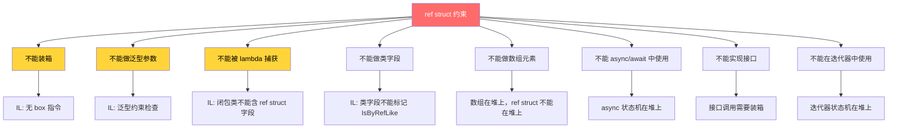
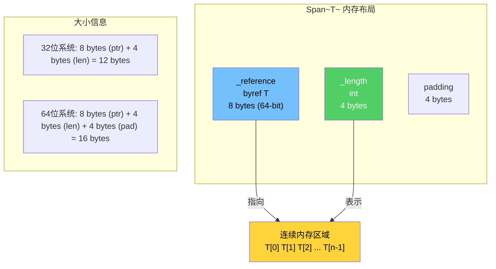
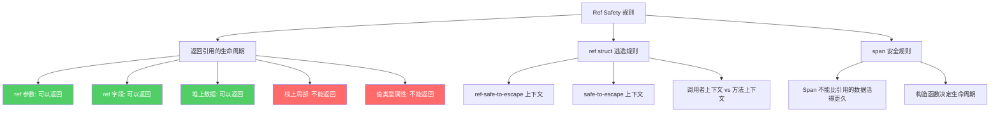
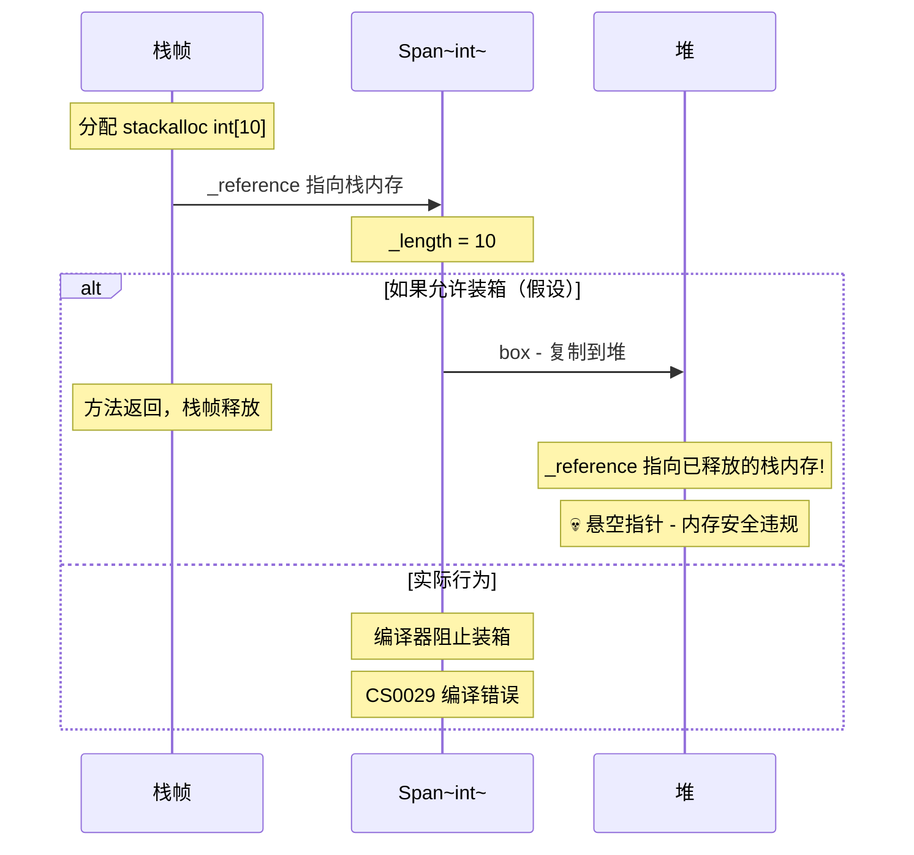
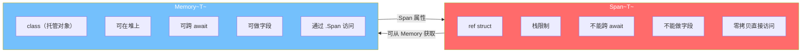
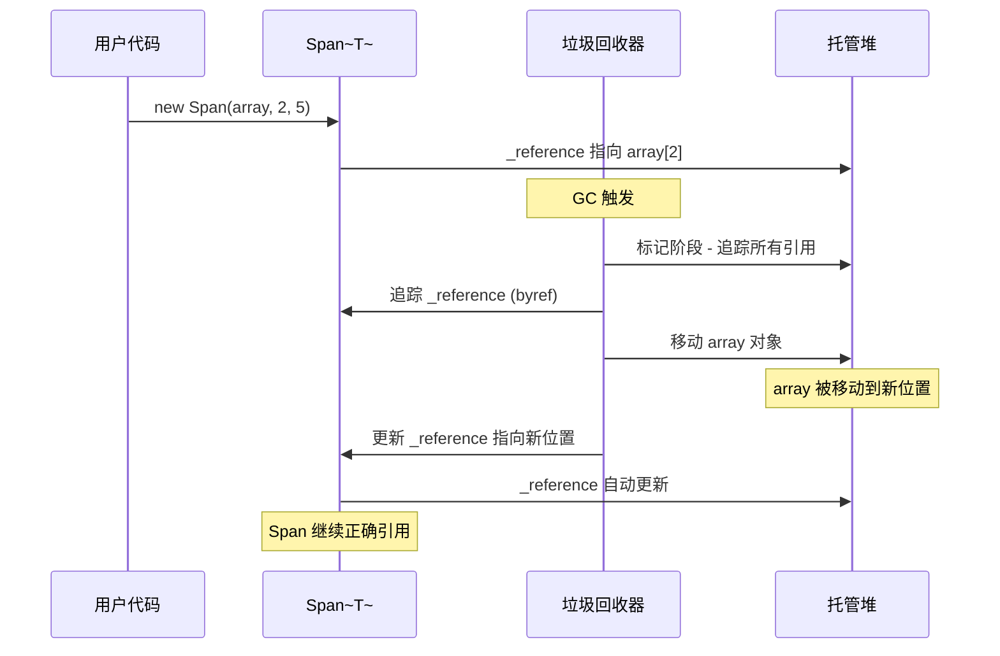
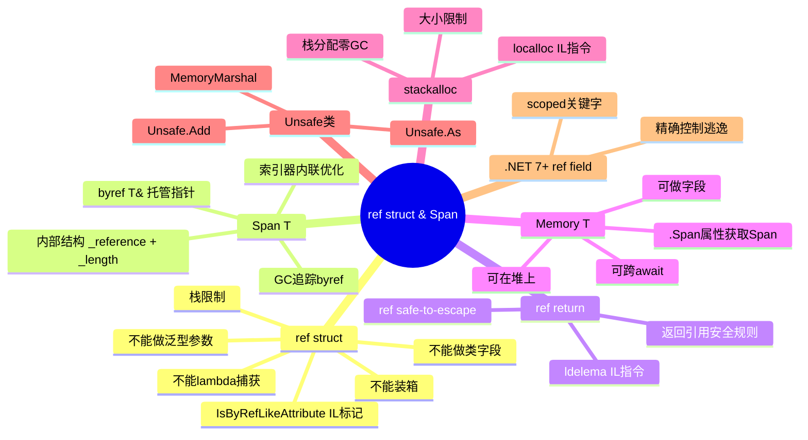

# ref 结构与 Span 原理

## 概述

`ref struct` 和 `Span&lt;T&gt;` 是 .NET 安全高性能编程的基石。它们在不牺牲类型安全的前提下，让 C# 开发者能够以接近 C/C++ 的效率操作内存。本文将从 IL 层面深入剖析 `ref struct` 的编译器约束、`Span&lt;T&gt;` 的内部结构、`ref return` 的实现原理，以及相关的安全规则与性能优化。

---

## 一、ref struct 的 IL 标记与约束

### 1.1 ref struct 的声明

`ref struct` 是 C# 7.2 引入的特性，它告诉编译器：这个值类型只能存在于栈上，绝不能逃逸到堆。

```csharp
public ref struct StackOnlyType
{
    private readonly Span<int> _data;

    public StackOnlyType(Span<int> data)
    {
        _data = data;
    }

    public void Process()
    {
        for (int i = 0; i < _data.Length; i++)
        {
            _data[i] *= 2;
        }
    }
}
```

### 1.2 IL 层面的 ref struct 标记

在 IL 中，`ref struct` 通过 `value type` + 特殊属性标记：

```il
.class public sequential sealed beforefieldinit
    StackOnlyType
    extends [System.Runtime]System.ValueType
{
    // 关键标记：IsByRefLikeAttribute
    .custom instance void [System.Runtime]System.Runtime.CompilerServices.IsByRefLikeAttribute::.ctor()
        = (01 00 00 00)

    // ObsoleteAttribute 防止从不支持 ref struct 的语言使用
    .custom instance void [System.Runtime]System.ObsoleteAttribute::.ctor(string, bool)
        = (01 00 50 01 00 00 54 79 70 65 73 20 77 69 74 68  ... // "Types with embedded ref..."
           01 00 00 00)

    .field private valuetype [System.Runtime]System.Span`1<int32> _data

    .method public hidebysig instance void Process() cil managed
    {
        // ...
    }
}
```

::: important IsByRefLikeAttribute 的作用
`IsByRefLikeAttribute` 是编译器和运行时识别 `ref struct` 的关键标记：
1. 编译器使用它在编译时执行 ref struct 的安全约束检查
2. 运行时使用它确保类型不会被错误地装箱
3. `ObsoleteAttribute` 防止不支持 ref struct 的语言（如 VB.NET）使用该类型
:::

### 1.3 ref struct 的编译器约束体系



### 1.4 约束的详细说明与 IL 验证

#### 不能装箱

```csharp
// 错误 CS0029: 无法将"Span<int>"转换为"object"
Span<int> span = stackalloc int[10];
object obj = span;  // 💥 编译错误
```

如果尝试通过反射或 IL 绕过编译器检查进行装箱，运行时会抛出异常：

```csharp
// 通过反射尝试装箱 - 运行时保护
var span = new Span<int>(new int[10]);
var boxed = (object)span;  // 💥 编译器阻止

// 即使绕过编译器（如通过 DynamicMethod），运行时会抛出：
// System.TypeLoadException: Span`1 cannot be boxed
```

#### 不能做泛型参数

```csharp
// 错误 CS0306: 类型"Span<int>"不能用作泛型类型或方法中的类型参数
List<Span<int>> list = new();  // 💥 编译错误

// 错误 CS0306
void Method<T>() where T : struct { }
Method<Span<int>>();  // 💥 编译错误

// 需要添加 unmanaged 约束也不行
void Method2<T>() where T : unmanaged { }
Method2<Span<int>>();  // 💥 仍然编译错误
```

#### 不能被 lambda 捕获

```csharp
Span<int> span = stackalloc int[10];

// 错误 CS8175: 无法按引用捕获"span"，因为不能在 lambda 中使用 ref struct
Func<int> fn = () => span.Length;  // 💥 编译错误

// 因为 lambda 编译为闭包类，闭包实例在堆上
// ref struct 不能存在于堆上
```

#### 不能做类字段

```csharp
public class MyClass
{
    // 错误 CS8345: 字段或自动属性不能属于类型"Span<int>"
    private Span<int> _data;  // 💥 编译错误

    // ref struct 只能作为 ref struct 的字段
}

public ref struct MyRefStruct
{
    // OK - ref struct 中可以包含 ref struct 字段
    private Span<int> _data;
}
```

#### 不能在 async/await 中使用

```csharp
async Task BadAsync()
{
    // 错误 CS8345: "Span<int>"不能在 async 方法中使用
    Span<int> span = stackalloc int[10];  // 💥 编译错误

    // 因为 async 状态机是类（在堆上）
    // 而 Span 可能引用栈内存，await 后栈帧已释放
}
```

---

## 二、Span&lt;T&gt; 内部结构

### 2.1 Span&lt;T&gt; 的字段布局

```csharp
// .NET Runtime 源码 - Span<T> 核心结构
public readonly ref struct Span<T>
{
    // 内部引用 - 指向数据的托管指针
    internal readonly ref T _reference;

    // 长度
    private readonly int _length;
}
```



### 2.2 Span&lt;T&gt; 的构造方式

```csharp
// 1. 从数组构造
var array = new int[10];
Span<int> span1 = array;  // _reference 指向 array[0], _length = 10

// 2. 从数组切片构造
Span<int> span2 = array.AsSpan(2, 5);  // _reference 指向 array[2], _length = 5

// 3. 从 stackalloc 构造
Span<int> span3 = stackalloc int[10];  // _reference 指向栈内存, _length = 10

// 4. 从指针构造（unsafe）
Span<int> span4 = new Span<int>(ptr, 10);  // _reference = ptr, _length = 10

// 5. 从 Memory<T> 构造
Memory<int> memory = new Memory<int>(array);
Span<int> span5 = memory.Span;  // 从 Memory 获取 Span
```

### 2.3 Span&lt;T&gt; 的 IL 表示

```il
// Span<int> 的字段在 IL 中的表示
.class public sequential sealed beforefieldinit
    System.Span`1<T>
    extends [System.Runtime]System.ValueType
{
    .custom instance void [System.Runtime]System.Runtime.CompilerServices.IsByRefLikeAttribute::.ctor()

    // _reference 字段 - 使用托管指针 (byref)
    .field private !0& _reference

    // _length 字段
    .field private int32 _length
}
```

::: important byref T& 的特殊性
`T&`（托管指针/byref）是 IL 中一种特殊的类型：
1. 它指向托管堆上的数据，但本身不是对象引用
2. 不能存储在堆上（不能作为类字段、不能装箱）
3. 只能存在于局部变量、参数和返回值中
4. GC 能够追踪 byref 指针，确保它们在 GC 后仍然正确
5. 这是 `Span&lt;T&gt;` 能够安全引用托管内存的关键
:::

### 2.4 Span&lt;T&gt; 的索引器 IL

```csharp
// C# 代码
Span<int> span = new int[10];
span[5] = 42;
int value = span[5];
```

```il
// 索引器访问的 IL
// span[5] = 42
IL_0001: ldloca.s span         // 加载 Span 的地址
IL_0003: ldc.i4.5               // 索引 = 5
IL_0004: ldc.i4.s 42            // 值 = 42
IL_0006: call instance void [System.Runtime]System.Span`1<int32>::set_Item(int32, !0)

// value = span[5]
IL_0008: ldloca.s span
IL_000a: ldc.i4.5
IL_000b: call instance !0 [System.Runtime]System.Span`1<int32>::get_Item(int32)
IL_0010: stloc.s value
```

Span 的索引器内部实现：

```csharp
// .NET Runtime 源码 - Span<T> 索引器
public ref T this[int index]
{
    [MethodImpl(MethodImplOptions.AggressiveInlining)]
    get
    {
        if ((uint)index >= (uint)_length)
            ThrowHelper.ThrowIndexOutOfRangeException();
        return ref Unsafe.Add(ref _reference, index);
    }
}
```

---

## 三、ref return 深度解析

### 3.1 ref return 的 C# 语法

```csharp
public ref int FindRef(int[] array, int target)
{
    for (int i = 0; i < array.Length; i++)
    {
        if (array[i] == target)
            return ref array[i];  // 返回引用
    }
    throw new InvalidOperationException("Not found");
}

// 使用
int[] data = { 1, 2, 3, 4, 5 };
ref int found = ref FindRef(data, 3);
found = 99;  // data[2] 现在是 99
```

### 3.2 ref return 的 IL 实现

```il
// C#: public ref int FindRef(int[] array, int target)
// IL 签名中的 & 表示返回 byref
.method public hidebysig instance int32& FindRef(
    int32[] array,
    int32 target) cil managed
{
    .maxstack 3
    .locals init (
        [0] int32 i
    )

    // for (int i = 0; ...
    IL_0000: ldc.i4.0
    IL_0001: stloc.0

    // i < array.Length
    IL_0002: ldloc.0
    IL_0003: ldarg.1
    IL_0004: ldlen
    IL_0005: conv.i4
    IL_0006: bge.s IL_0020

    // if (array[i] == target)
    IL_0008: ldarg.1
    IL_0009: ldloc.0
    IL_000a: ldelem.i4         // 加载 array[i] 的值
    IL_000b: ldarg.2
    IL_000c: bne.un.s IL_0018

    // return ref array[i]
    IL_000e: ldarg.1
    IL_000f: ldloc.0
    IL_0010: ldelema int32    // 加载 array[i] 的地址（byref）
    IL_0015: ret               // 返回 byref

    // i++
    IL_0018: ldloc.0
    IL_0019: ldc.i4.1
    IL_001a: add
    IL_001b: stloc.0
    IL_001c: br.s IL_0002

    IL_0020: // throw
}
```

::: tip ldelema vs ldelem 的区别
- `ldelem`：加载数组元素的**值**到计算栈
- `ldelema`：加载数组元素的**地址**（托管指针/byref）到计算栈
- `ref return` 使用 `ldelema` 获取元素地址，然后返回 byref
- 这是 ref return 能够直接修改原始数据的关键
:::

### 3.3 ref return 的安全规则

```csharp
public class RefReturnSafety
{
    private int _field = 42;
    private int[] _array = { 1, 2, 3 };

    // OK - 返回数组元素的引用
    public ref int GetArrayRef(int index)
        => ref _array[index];

    // OK - 返回字段的引用
    public ref int GetFieldRef()
        => ref _field;

    // 💥 错误 - 不能返回局部变量的引用
    public ref int BadReturn()
    {
        int local = 42;
        return ref local;  // CS8168: 不能按引用返回局部
    }

    // OK - 参数可以按引用返回
    public ref int ReturnParam(ref int value)
        => ref value;

    // 💥 错误 - 不能返回值类型属性的引用
    public ref int BadPropertyReturn()
    {
        return ref _array.Length;  // 属性是值，不是变量
    }
}
```

### 3.4 Ref Safety 规则的完整体系



---

## 四、ref struct 安全规则详解

### 4.1 不能装箱的深层原因

```csharp
// 为什么 ref struct 不能装箱？
// 假设允许装箱：
Span<int> span = stackalloc int[10];

// 如果装箱：span 的 _reference 指向栈内存
object boxed = span;  // 假设可以

// 然后栈帧释放...
// boxed 中的 _reference 变成悬空指针！

// 更糟糕的是 GC 可能移动栈内存
// （虽然 GC 不管理栈，但 byref 需要在 GC 期间被追踪）
```



### 4.2 不能做泛型参数的原因

```csharp
// 为什么 ref struct 不能做泛型参数？
// 因为泛型方法可能对 T 做任何操作，包括装箱

void Method<T>(T value)
{
    // 可能装箱 T
    object obj = value;  // 如果 T 是 ref struct，这就违反了规则

    // 可能存储到字段
    _field = value;  // 如果 T 是 ref struct，不能存储在堆上

    // 可能在 async 中使用
    await SomeAsync(value);  // 如果 T 是 ref struct，不能在 async 中使用
}

// 因此编译器完全禁止 ref struct 作为泛型参数
// 除非泛型本身是 ref struct
```

### 4.3 不能被 lambda 捕获的原因

```csharp
// Lambda 捕获编译为闭包类
Span<int> span = stackalloc int[10];

// 编译器生成的闭包类（假设允许）：
class Closure
{
    public Span<int> span;  // 💥 ref struct 不能做类字段！

    public void Lambda()
    {
        // 使用 span
    }
}

// 闭包实例在堆上 → ref struct 不能在堆上 → 矛盾
```

### 4.4 允许的场景

```csharp
// ref struct 可以：
// 1. 作为方法参数
void Process(Span<int> data) { }  // OK

// 2. 作为方法返回值（C# 7.2+）
Span<int> GetSpan() => new int[10];  // OK

// 3. 作为 ref struct 的字段
public ref struct Wrapper
{
    private Span<int> _data;  // OK
}

// 4. 在 using 声明中使用
using var handle = new RefStructHandle();  // OK（如果是 ref struct）

// 5. 作为 ref 参数
void ProcessRef(ref Span<int> data) { }  // OK

// 6. 作为 out 参数
void GetSpan(out Span<int> data) { data = default; }  // OK
```

---

## 五、Memory&lt;T&gt; 与 Span&lt;T&gt; 对比

### 5.1 核心区别



### 5.2 Memory&lt;T&gt; 的内部结构

```csharp
// .NET Runtime 源码 - Memory<T> 核心结构
public readonly struct Memory<T>
{
    private readonly object? _object;  // 数组或 MemoryManager
    private readonly int _index;       // 起始偏移
    private readonly int _length;      // 长度

    // 从数组构造
    public Memory(T[] array)
    {
        _object = array;
        _index = 0;
        _length = array.Length;
    }

    // 从数组切片构造
    public Memory(T[] array, int start, int length)
    {
        _object = array;
        _index = start;
        _length = length;
    }

    // 获取 Span
    public Span<T> Span
    {
        [MethodImpl(MethodImplOptions.AggressiveInlining)]
        get
        {
            if (_object is T[] array)
            {
                return new Span<T>(array, _index, _length);
            }
            // MemoryManager 路径
            return ((MemoryManager<T>)_object!).GetSpan();
        }
    }
}
```

### 5.3 使用场景对比

```csharp
// 场景1: 同步处理 - 使用 Span
void ProcessData(Span<byte> data)
{
    // 直接操作内存，零拷贝
    for (int i = 0; i < data.Length; i++)
        data[i] = (byte)(data[i] ^ 0xFF);
}

// 场景2: 异步处理 - 使用 Memory
async Task ProcessDataAsync(Memory<byte> data)
{
    // 可以在 await 前后使用
    await SomeOperationAsync();

    // 通过 .Span 获取临时访问
    ProcessData(data.Span);

    await AnotherOperationAsync();
}

// 场景3: 类字段 - 使用 Memory
public class DataProcessor
{
    private Memory<byte> _buffer;  // OK - Memory 不是 ref struct

    // private Span<byte> _buffer;  // 💥 编译错误
}
```

### 5.4 ReadOnlySpan 与 ReadOnlyMemory

```csharp
// ReadOnlySpan<T> - 只读视图
public readonly ref struct ReadOnlySpan<T>
{
    internal readonly ref readonly T _reference;  // readonly byref
    private readonly int _length;
}

// 隐式转换：Span → ReadOnlySpan
Span<int> span = new int[10];
ReadOnlySpan<int> readOnly = span;  // 隐式转换，安全

// 不能反向转换
// Span<int> back = readOnly;  // 💥 编译错误

// ReadOnlyMemory<T>
public readonly struct ReadOnlyMemory<T>
{
    private readonly object? _object;
    private readonly int _index;
    private readonly int _length;
}
```

---

## 六、stackalloc 与 Span

### 6.1 stackalloc 的 IL 表示

```csharp
// C# 代码
Span<int> span = stackalloc int[10];
```

```il
// IL 代码
.method private hidebysig instance void StackAllocExample() cil managed
{
    .maxstack 2
    .locals init (
        [0] valuetype [System.Runtime]System.Span`1<int32> span
    )

    // stackalloc 10 个 int
    IL_0000: ldc.i4.s 10          // 元素数量
    IL_0002: sizeof [System.Runtime]System.Int32  // 每个元素大小
    IL_0008: mul.un                // 总字节数 = 10 * 4 = 40
    IL_0009: localloc              // 在局部动态内存区分配
    IL_000b: initblk              // 清零
    IL_000d: call valuetype [System.Runtime]System.Span`1<int32>
            [System.Runtime]System.Span`1<int32>::op_Implicit(void*, int32)
    IL_0012: stloc.0
}
```

::: important localloc 指令
`localloc` 是 IL 中的栈分配指令：
1. 从线程的动态局部内存区分配指定大小的内存
2. 分配的内存在线程的当前方法帧中
3. 当方法返回时，内存自动释放（不需要 GC）
4. 类似 C 的 `alloca()`，但由 CLR 管理
5. 不受 GC 影响，但也不能超过栈大小限制
:::

### 6.2 stackalloc 的安全使用模式

```csharp
// 模式1: 在 Span 中使用
Span<int> span = stackalloc int[10];  // 安全，Span 确保不逃逸

// 模式2: 条件分配
Span<byte> buffer = length <= 256
    ? stackalloc byte[256]    // 小缓冲区：栈分配
    : new byte[length];        // 大缓冲区：堆分配

// 模式3: 在同一表达式中使用
int sum = 0;
foreach (ref int item in stackalloc int[] { 1, 2, 3, 4, 5 })
{
    sum += item;
}
```

### 6.3 stackalloc 的限制

```csharp
// 1. 大小限制 - 默认 1MB
// 可以通过 runtimeconfig.json 或 COMPlus_GCHeapHardLimit 调整
Span<byte> big = stackalloc byte[1024 * 1024];  // 可能 StackOverflow

// 2. 不能在 try 块中使用（C# 7.2 限制，C# 8.0+ 放宽）
try
{
    Span<int> span = stackalloc int[10];  // C# 8.0+ OK
}

// 3. 不能在 async 方法中使用
async Task BadAsync()
{
    Span<int> span = stackalloc int[10];  // 💥 编译错误
}
```

---

## 七、Span 与 unsafe 代码

### 7.1 Span 作为安全与不安全的桥梁

```csharp
// 从指针创建 Span
unsafe
{
    int* ptr = (int*)NativeMemory.Alloc(10 * sizeof(int));
    try
    {
        Span<int> span = new Span<int>(ptr, 10);
        // 安全地使用 Span API 操作非托管内存
        span.Fill(42);
        span[5] = 100;
    }
    finally
    {
        NativeMemory.Free(ptr);
    }
}
```

### 7.2 Span 与指针的转换

```csharp
// Span → 指针
Span<int> span = new int[10];
unsafe
{
    // 通过 MemoryMarshal.GetReference 获取引用
    ref int reference = ref MemoryMarshal.GetReference(span);
    // 转换为指针
    fixed (int* ptr = &reference)
    {
        ptr[0] = 42;
    }
}

// 指针 → Span
unsafe
{
    byte* ptr = (byte*)NativeMemory.Alloc(1024);
    Span<byte> span = new Span<byte>(ptr, 1024);
    // 使用完 Span 后释放
    NativeMemory.Free(ptr);
}
```

### 7.3 MemoryMarshal 的高级操作

```csharp
// MemoryMarshal - Span 的高级操作
public static class MemoryMarshal
{
    // 将 Span<TFrom> 重新解释为 Span<TTo>
    public static Span<TTo> Cast<TFrom, TTo>(Span<TFrom> span) where TFrom : struct where TTo : struct;

    // 获取 Span 第一个元素的引用（不检查空）
    public static ref T GetReference<T>(Span<T> span);

    // MemoryMarshal 上不存在 AsSpan<T>(ReadOnlySpan<T>) 方法
    // 如需从 ReadOnlySpan 获取可变 Span，应使用 CreateSpan

    // 从引用创建 Span
    public static Span<T> CreateSpan<T>(ref T reference, int length);
}

// 使用示例
Span<byte> bytes = stackalloc byte[16];
Span<int> ints = MemoryMarshal.Cast<byte, int>(bytes);
// 16 bytes = 4 ints
ints[0] = 0x12345678;
```

---

## 八、Unsafe 类方法详解

### 8.1 Unsafe 类的核心方法

```csharp
// System.Runtime.CompilerServices.Unsafe
public static class Unsafe
{
    // 读取指定位置的值（不验证）
    public static T Read<T>(void* source);

    // 写入值到指定位置
    public static void Write<T>(void* destination, T value);

    // 获取指定偏移处的引用
    public static ref T Add<T>(ref T source, int elementOffset);

    // 获取指定偏移处的引用（不溢出检查）
    public static ref T AddByteOffset<T>(ref T source, IntPtr byteOffset);

    // 计算两个引用之间的元素数
    public static int SizeOf<T>();

    // 类型转换（不检查）
    public static TAs As<TFrom, TAs>(ref TFrom source);

    // 获取 byref 的指针
    public static void* AsPointer<T>(ref T value);
}
```

### 8.2 Unsafe.Add 的 IL 实现

```csharp
// C# 代码
ref int AddRef(ref int source, int offset)
{
    return ref Unsafe.Add(ref source, offset);
}
```

```il
// IL 代码 - 极其简洁
.method public hidebysig instance int32& AddRef(
    int32& source,
    int32 offset) cil managed
{
    .maxstack 2

    IL_0000: ldarg.1          // 加载 source byref
    IL_0001: ldarg.2          // 加载 offset
    IL_0002: add               // 指针偏移 = source + offset * sizeof(int)
    IL_0003: ret               // 返回 byref
}
```

### 8.3 Unsafe.As 的类型转换

```csharp
// Unsafe.As - 不安全的类型转换（无运行时检查）
object obj = "hello";

// 正常类型转换会检查运行时类型
string str1 = (string)obj;         // OK - 运行时类型匹配
// int num = (int)obj;             // 💥 InvalidCastException

// Unsafe.As 跳过所有检查
ref int num = ref Unsafe.As<string, int>(ref str1);  // 编译通过但极其危险！

// 正确使用场景 - 高性能 reinterpret
[MethodImpl(MethodImplOptions.AggressiveInlining)]
public ref T AsRef<T>(Span<byte> span) where T : struct
{
    return ref Unsafe.As<byte, T>(ref MemoryMarshal.GetReference(span));
}
```

---

## 九、ref field（.NET 7+）

### 9.1 ref 字段的声明

C# 11 / .NET 7 引入了 `ref field`，允许在 `ref struct` 中声明引用字段：

```csharp
public ref struct RefFieldExample
{
    // C# 11 之前：编译器内部使用，开发者不能声明
    // C# 11：开发者可以在 ref struct 中声明 ref 字段
    private ref int _value;
    private readonly int _defaultValue;

    public RefFieldExample(ref int value)
    {
        _value = ref value;
        _defaultValue = value;
    }

    public ref int Value => ref _value;

    public void Reset() => _value = _defaultValue;
}
```

### 9.2 ref field 的 IL 表示

```il
.class public sequential sealed beforefieldinit
    RefFieldExample
    extends [System.Runtime]System.ValueType
{
    .custom instance void [System.Runtime]System.Runtime.CompilerServices.IsByRefLikeAttribute::.ctor()

    // ref 字段 - 使用托管指针类型
    .field private int32& _value

    // 普通字段
    .field private initonly int32 _defaultValue
}
```

### 9.3 ref field 的安全规则

```csharp
public ref struct SafeRefField
{
    private ref int _ref;
    private readonly int _length;

    // ref scoped 参数 - 确保引用不会逃逸
    public SafeRefField(scoped ref int reference, int length)
    {
        _ref = ref reference;
        _length = length;
    }

    // ref 返回 - 允许逃逸到调用者
    public ref int this[int index]
    {
        get
        {
            if ((uint)index >= (uint)_length)
                ThrowHelper.ThrowIndexOutOfRangeException();
            return ref Unsafe.Add(ref _ref, index);
        }
    }
}
```

### 9.4 scoped 关键字

C# 11 引入了 `scoped` 关键字来精确控制引用的逃逸范围：

```csharp
// scoped ref - 引用不能逃逸出方法
void Process(scoped ref int value)
{
    // _field = ref value;  // 💥 不能将 scoped ref 存储到字段
    // return ref value;    // 💥 不能返回 scoped ref
}

// scoped Span - Span 不能逃逸出方法
void ProcessSpan(scoped Span<int> span)
{
    // _field = span;       // 💥 不能存储到字段
    // return span;         // 💥 不能返回
}

// 无 scoped - 引用可以逃逸
ref int Process(ref int value)
{
    return ref value;        // OK - 可以返回
}
```

::: important scoped 的默认规则
1. `ref` 参数默认允许逃逸到调用者（无 `scoped`）
2. `out` 参数默认允许逃逸到调用者
3. `ref struct` 类型的参数默认 `scoped`（不能逃逸出方法）
4. 可以显式添加 `scoped` 来收紧逃逸范围
5. `scoped` 帮助编译器证明引用安全，减少不必要的复制
:::

---

## 十、Span 性能基准测试

### 10.1 数组访问 vs Span 访问

```csharp
[MemoryDiagnoser]
[ShortRunJob]
public class SpanAccessBenchmark
{
    private readonly int[] _array = Enumerable.Range(0, 1000).ToArray();

    [Benchmark(Baseline = true)]
    public int ArraySum()
    {
        int sum = 0;
        for (int i = 0; i < _array.Length; i++)
            sum += _array[i];
        return sum;
    }

    [Benchmark]
    public int SpanSum()
    {
        int sum = 0;
        Span<int> span = _array;
        for (int i = 0; i < span.Length; i++)
            sum += span[i];
        return sum;
    }

    [Benchmark]
    public int SpanForEachSum()
    {
        int sum = 0;
        foreach (ref int item in _array.AsSpan())
            sum += item;
        return sum;
    }

    [Benchmark]
    public int ReadOnlySpanSum()
    {
        int sum = 0;
        ReadOnlySpan<int> span = _array;
        for (int i = 0; i < span.Length; i++)
            sum += span[i];
        return sum;
    }
}
```

典型结果：

| Method | Mean | Allocated |
|--------|------|-----------|
| ArraySum | 845.1 ns | - |
| SpanSum | 842.3 ns | - |
| SpanForEachSum | 839.8 ns | - |
| ReadOnlySpanSum | 843.7 ns | - |

::: tip Span 与数组的访问性能几乎相同
因为 `Span&lt;T&gt;` 的索引器被 `AggressiveInlining` 标记，JIT 编译器会将边界检查和指针运算内联，最终生成的机器码与直接数组访问几乎相同。
:::

### 10.2 字符串处理性能

```csharp
[MemoryDiagnoser]
public class StringProcessingBenchmark
{
    private const string Text = "Hello, World! This is a test string for Span benchmarks.";

    [Benchmark(Baseline = true)]
    public int SubstringSum()
    {
        int sum = 0;
        for (int i = 0; i < 10; i++)
        {
            string sub = Text.Substring(7, 5);  // 分配新字符串
            sum += sub.Length;
        }
        return sum;
    }

    [Benchmark]
    public int AsSpanSum()
    {
        int sum = 0;
        for (int i = 0; i < 10; i++)
        {
            ReadOnlySpan<char> sub = Text.AsSpan(7, 5);  // 零分配
            sum += sub.Length;
        }
        return sum;
    }
}
```

| Method | Mean | Allocated |
|--------|------|-----------|
| SubstringSum | 85.3 ns | 160 B |
| AsSpanSum | 3.2 ns | - |

### 10.3 JSON 解析性能

```csharp
[MemoryDiagnoser]
public class JsonParseBenchmark
{
    private readonly byte[] _jsonData = Encoding.UTF8.GetBytes(
        "{\"name\":\"test\",\"value\":42,\"active\":true}");

    [Benchmark]
    public string ParseWithSubstring()
    {
        string json = Encoding.UTF8.GetString(_jsonData);
        int nameStart = json.IndexOf("\"name\":\"") + 8;
        int nameEnd = json.IndexOf("\"", nameStart);
        return json.Substring(nameStart, nameEnd - nameStart);
    }

    [Benchmark]
    public string ParseWithSpan()
    {
        ReadOnlySpan<byte> json = _jsonData;
        ReadOnlySpan<byte> marker = "\"name\":\""u8;
        int nameStart = json.IndexOf(marker) + marker.Length;
        int nameEnd = json.Slice(nameStart).IndexOf((byte)'"');
        return Encoding.UTF8.GetString(json.Slice(nameStart, nameEnd));
    }
}
```

---

## 十一、Span 在 .NET 运行时中的使用

### 11.1 String 与 ReadOnlySpan&lt;char&gt;

```csharp
// 字符串的内部表示（简化）
public sealed class String
{
    // 字符串长度
    private readonly int _length;

    // 第一个字符 — 实际字符紧跟其后内联存储
    // 不是 char[] 字段，而是连续的 char 数据内嵌在 String 对象中
    private readonly char _firstChar;

    // AsSpan 实现
    public ReadOnlySpan<char> AsSpan(int start, int length)
    {
        // 直接返回指向字符串内部数据的 Span
        // 无需复制字符数据
        return new ReadOnlySpan<char>(
            ref Unsafe.Add(ref Unsafe.AsRef(in _firstChar), start), length);
    }
}

// 使用示例
string text = "Hello, World!";
ReadOnlySpan<char> hello = text.AsSpan(0, 5);  // "Hello" - 无分配
```

### 11.2 Stream 与 Span

```csharp
// .NET 6+ 的 Stream 支持 Span/Memory
public class Stream
{
    // 旧 API - 使用 byte[]
    public virtual int Read(byte[] buffer, int offset, int count);

    // 新 API - 使用 Span<byte>
    public virtual int Read(Span<byte> buffer);

    // 异步 API - 使用 Memory<byte>
    public virtual ValueTask<int> ReadAsync(
        Memory<byte> buffer, CancellationToken ct = default);
}
```

### 11.3 Kestrel 中的 Span 使用

```csharp
// ASP.NET Core Kestrel 中的高性能 HTTP 解析
internal ref struct HttpParser
{
    public bool ParseRequestLine(
        scoped ReadOnlySpan<byte> span,
        out HttpMethod method,
        out ReadOnlySpan<byte> path,
        out ReadOnlySpan<byte> version)
    {
        // 使用 Span 直接在原始缓冲区上解析
        // 无需分配子字符串
        var lineEnd = span.IndexOf((byte)'\r');
        if (lineEnd < 0) return false;

        var line = span.Slice(0, lineEnd);

        // 解析方法
        var spaceIndex = line.IndexOf((byte)' ');
        method = ParseMethod(line.Slice(0, spaceIndex));
        line = line.Slice(spaceIndex + 1);

        // 解析路径
        spaceIndex = line.IndexOf((byte)' ');
        path = line.Slice(0, spaceIndex);
        line = line.Slice(spaceIndex + 1);

        // 解析版本
        version = line;

        return true;
    }
}
```

---

## 十二、实战：高性能内存映射解析器

```csharp
/// <summary>
/// 使用 Span 实现零分配的 CSV 解析器
/// </summary>
public ref struct CsvParser
{
    private readonly ReadOnlySpan<byte> _data;
    private readonly byte _delimiter;
    private int _position;

    public CsvParser(ReadOnlySpan<byte> data, byte delimiter = (byte)',')
    {
        _data = data;
        _delimiter = delimiter;
        _position = 0;
    }

    public bool TryReadRow(scoped Span<ReadOnlySpan<byte>> columns)
    {
        if (_position >= _data.Length)
            return false;

        // 查找行尾
        int lineEnd = _data.Slice(_position).IndexOf((byte)'\n');
        ReadOnlySpan<byte> line = lineEnd >= 0
            ? _data.Slice(_position, lineEnd)
            : _data.Slice(_position);

        _position += lineEnd >= 0 ? lineEnd + 1 : _data.Length - _position;

        // 解析列
        int colIndex = 0;
        int start = 0;
        for (int i = 0; i < line.Length && colIndex < columns.Length; i++)
        {
            if (line[i] == _delimiter)
            {
                columns[colIndex++] = line.Slice(start, i - start);
                start = i + 1;
            }
        }

        if (colIndex < columns.Length)
        {
            columns[colIndex] = line.Slice(start);
        }

        return true;
    }
}

// 使用示例
public class CsvParserExample
{
    public static void Parse()
    {
        byte[] csvData = Encoding.UTF8.GetBytes(
            "Name,Age,City\n" +
            "Alice,30,Beijing\n" +
            "Bob,25,Shanghai\n");

        var parser = new CsvParser(csvData);
        Span<ReadOnlySpan<byte>> columns = stackalloc ReadOnlySpan<byte>[3];

        while (parser.TryReadRow(columns))
        {
            for (int i = 0; i < columns.Length; i++)
            {
                Console.Write($"{Encoding.UTF8.GetString(columns[i])}\t");
            }
            Console.WriteLine();
        }
    }
}
```

---

## 十三、Span 与 GC 的交互

### 13.1 GC 对 byref 的追踪



### 13.2 Span 与 pinned 对象

```csharp
// 当 Span 引用的数据需要传递给非托管代码时
// 需要固定（pin）以防止 GC 移动

byte[] buffer = new byte[1024];
Span<byte> span = buffer;

// 使用 fixed 固定
fixed (byte* ptr = span)
{
    // 在此期间 GC 不会移动 buffer
    NativeMethod(ptr, span.Length);
}

// 或者使用 MemoryMarshal.GetReference
ref byte reference = ref MemoryMarshal.GetReference(span);
fixed (byte* ptr = &reference)
{
    NativeMethod(ptr, span.Length);
}
```

### 13.3 Span 与 GC Hole

```csharp
// 当数组很大时，Span 切片不会产生新的堆分配
byte[] largeArray = new byte[100_000_000];  // 100MB

// 切片 - 只是新的 Span 指向原数组的不同位置
Span<byte> slice1 = largeArray.AsSpan(0, 1000);       // 前 1000 字节
Span<byte> slice2 = largeArray.AsSpan(1000, 1000);    // 下 1000 字节
Span<byte> slice3 = largeArray.AsSpan(2000, 1000);    // 再下 1000 字节

// 三个 Span 共享同一底层数组，零额外分配
// 但 largeArray 保持活动，直到所有 Span 都不再使用
```

---

## 十四、Span 与 SIMD

### 14.1 使用 Span 加速向量化操作

```csharp
using System.Numerics;

public static class SimdHelper
{
    public static void MultiplyByScalar(Span<float> data, float factor)
    {
        if (Vector.IsHardwareAccelerated)
        {
            // 使用 SIMD 向量化
            var vFactor = new Vector<float>(factor);
            int vectorSize = Vector<float>.Count;
            int i = 0;

            // 处理向量对齐的部分
            for (; i <= data.Length - vectorSize; i += vectorSize)
            {
                var v = new Vector<float>(data.Slice(i, vectorSize));
                v *= vFactor;
                v.CopyTo(data.Slice(i, vectorSize));
            }

            // 处理剩余元素
            for (; i < data.Length; i++)
            {
                data[i] *= factor;
            }
        }
        else
        {
            // 回退到标量操作
            for (int i = 0; i < data.Length; i++)
            {
                data[i] *= factor;
            }
        }
    }
}
```

### 14.2 Span 与 Vector 的性能对比

```csharp
[MemoryDiagnoser]
public class SimdBenchmark
{
    private readonly float[] _data = Enumerable.Range(0, 10000)
        .Select(i => (float)i).ToArray();

    [Benchmark(Baseline = true)]
    public void ScalarMultiply()
    {
        for (int i = 0; i < _data.Length; i++)
            _data[i] *= 2.0f;
    }

    [Benchmark]
    public void SpanScalarMultiply()
    {
        Span<float> span = _data;
        for (int i = 0; i < span.Length; i++)
            span[i] *= 2.0f;
    }

    [Benchmark]
    public void SpanSimdMultiply()
    {
        Span<float> span = _data;
        SimdHelper.MultiplyByScalar(span, 2.0f);
    }
}
```

---

## 十五、常见陷阱与最佳实践

### 15.1 常见陷阱

```csharp
// 陷阱1: Span 引用过期栈内存
Span<int> GetBadSpan()
{
    Span<int> local = stackalloc int[10];
    return local;  // 💥 栈内存在方法返回后释放
    // 编译器会阻止这种行为
}

// 陷阱2: 在 async 方法中使用 Span
async Task BadAsync()
{
    Span<int> span = stackalloc int[10];  // 💥 编译错误
    await Task.Delay(100);
    // span 引用的栈内存已经无效
}

// 陷阱3: 修改 ReadOnlySpan
ReadOnlySpan<int> readOnly = new int[10].AsSpan();
// readOnly[0] = 42;  // 💥 编译错误 - 只读

// 陷阱4: 跨线程传递 Span
void BadCrossThread()
{
    Span<int> span = new int[10];
    Task.Run(() =>
    {
        // span[0] = 42;  // 💥 不能在 lambda 中捕获 ref struct
    });
}

// 陷阱5: MemoryMarshal.AsSpan 误用
string str = "Hello";
Span<char> writable = MemoryMarshal.CreateSpan(
    ref MemoryMarshal.GetReference(str.AsSpan()), str.Length);
writable[0] = 'h';  // 💥 修改字符串内容 - 未定义行为！
```

### 15.2 最佳实践

```csharp
// 1. 同步操作使用 Span，异步操作使用 Memory
void Sync(Span<byte> data) { }
async Task Async(Memory<byte> data) { }

// 2. 只读场景使用 ReadOnlySpan
int Sum(ReadOnlySpan<int> data)
{
    int sum = 0;
    foreach (int item in data) sum += item;
    return sum;
}

// 3. 小缓冲区使用 stackalloc
Span<byte> buffer = length <= 256
    ? stackalloc byte[256]
    : new byte[length];

// 4. 使用 AsSpan 代替 Substring
string text = "Hello, World!";
ReadOnlySpan<char> hello = text.AsSpan(0, 5);  // 无分配

// 5. 使用 MemoryMarshal.Cast 进行类型重解释
Span<byte> bytes = stackalloc byte[16];
Span<int> ints = MemoryMarshal.Cast<byte, int>(bytes);
```

---

## 十六、总结



::: important 核心要点
1. `ref struct` 通过 `IsByRefLikeAttribute` 在 IL 中标记，编译器确保它不逃逸到堆
2. `Span&lt;T&gt;` 使用 `byref T&` 托管指针引用数据，GC 能追踪和更新指针
3. `ref return` 通过 `ldelema` 指令返回元素引用，编译器确保引用安全
4. `Memory&lt;T&gt;` 是 `Span&lt;T&gt;` 的堆安全版本，适合异步和长期存储场景
5. `stackalloc` 使用 `localloc` 指令在栈上分配，避免 GC 压力
6. `Unsafe` 类提供绕过类型安全的低级操作，需谨慎使用
7. C# 11 的 `ref field` 和 `scoped` 关键字提供了更精确的引用安全控制
8. `Span&lt;T&gt;` 的性能与直接数组访问相当，但在字符串处理等场景中显著减少分配
:::

---

## 参考资料

- 《CLR via C#》第4版 - Jeffrey Richter
- ECMA-335 Standard - Common Language Infrastructure
- [.NET Runtime 源码 - Span.cs](https://github.com/dotnet/runtime/blob/main/src/libraries/System.Private.CoreLib/src/System/Span.cs)
- [C# Language Specification - Ref structs](https://learn.microsoft.com/en-us/dotnet/csharp/language-reference/proposals/csharp-11/ref-fields)
- [Span&lt;T&gt; - Stephen Toub](https://learn.microsoft.com/en-us/dotnet/standard/memory-and-spans/memory-t-usage-guidelines)
- [MemoryMarshal Class](https://learn.microsoft.com/en-us/dotnet/api/system.runtime.interopservices.memorymarshal)
