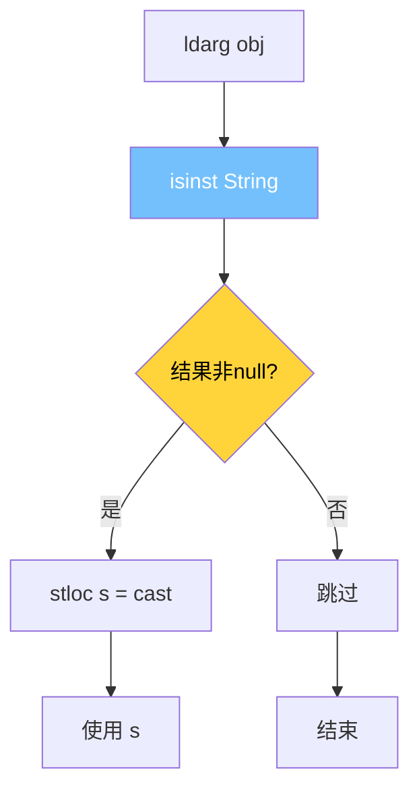
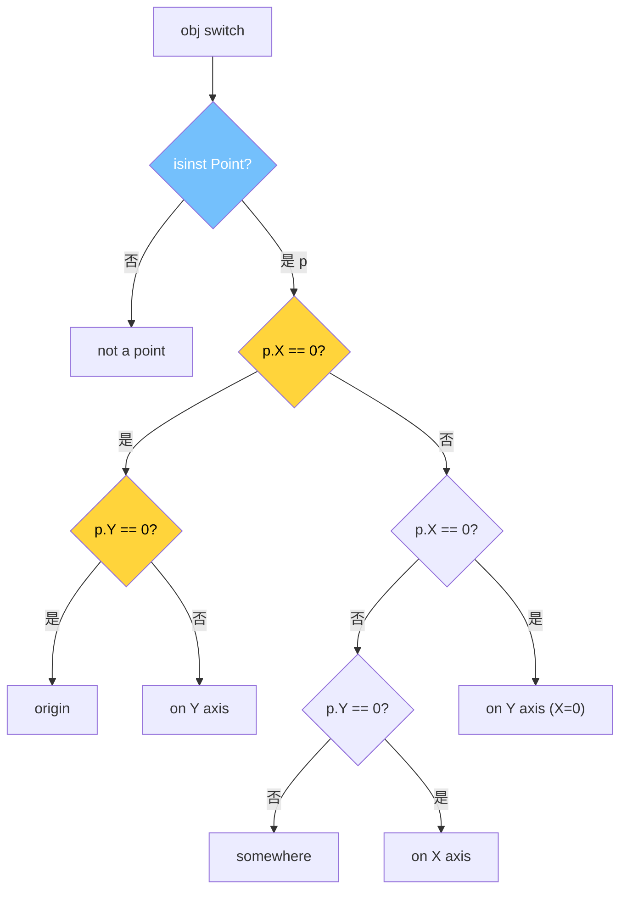
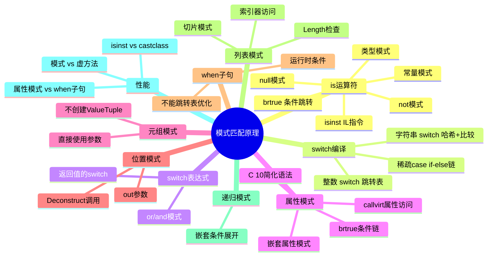

# 模式匹配原理

## 概述

C# 7.0 引入的模式匹配（Pattern Matching）将类型检查、值提取和条件判断融合为统一的语法，经过 C# 8.0、9.0、10、11 的持续增强，已成为 C# 最强大的特性之一。但模式匹配不仅仅是语法糖——编译器在背后生成了大量的 IL 代码，不同的模式有不同的编译策略和性能特征。本文将从 IL 层面深入剖析模式匹配的编译原理。

---

## 一、is 运算符的 IL 实现

### 1.1 类型模式 - isinst + brtrue

最基本的模式匹配是类型检查模式：

```csharp
// C# 代码
void TypePattern(object obj)
{
    if (obj is string s)
    {
        Console.WriteLine(s.Length);
    }
}
```

```il
.method private hidebysig instance void TypePattern(object obj) cil managed
{
    .maxstack 2
    .locals init (
        [0] string s
    )

    // if (obj is string s)
    IL_0000: ldarg.1                // 加载 obj
    IL_0001: isinst [System.Runtime]System.String  // 类型检查
    IL_0006: dup                    // 复制结果
    IL_0007: brtrue.s IL_000c       // 如果非null，跳到赋值
    IL_0009: pop                    // 丢弃
    IL_000a: br.s IL_0018           // 跳到 else

    IL_000c: stloc.0                // s = (string)obj

    // Console.WriteLine(s.Length)
    IL_000d: ldloc.0                // 加载 s
    IL_000e: callvirt instance int32 [System.Runtime]System.String::get_Length()
    IL_0013: call void [System.Runtime]System.Console::WriteLine(int32)

    IL_0018: ret
}
```



::: important isinst 指令详解
`isinst` 是 IL 中专门用于类型安全检查的指令：
1. 如果对象是指定类型的实例，返回该对象的引用（等同于强制转换）
2. 如果不是，返回 `null`（不抛出异常）
3. 比 `castclass` 更安全——`castclass` 失败时抛出 `InvalidCastException`
4. `isinst` 对值类型使用装箱形式进行检查
5. 性能特征：`isinst` 是单条 IL 指令，JIT 通常将其编译为高效的类型检查代码
:::

### 1.2 常量模式

```csharp
// C# 代码
void ConstantPattern(object obj)
{
    if (obj is 42)
    {
        Console.WriteLine("It's 42!");
    }
}
```

```il
.method private hidebysig instance void ConstantPattern(object obj) cil managed
{
    .maxstack 2

    // 检查是否为 int
    IL_0000: ldarg.1
    IL_0001: isinst [System.Runtime]System.Int32
    IL_0006: dup
    IL_0007: brtrue.s IL_000c
    IL_0009: pop
    IL_000a: br.s IL_001c      // 不是 int，跳到结束

    // 解箱并比较
    IL_000c: unbox.any [System.Runtime]System.Int32
    IL_0011: ldc.i4.s 42         // 常量 42
    IL_0013: beq.s IL_0018       // 相等则跳转

    IL_0015: br.s IL_001c        // 不相等，跳到结束

    // Console.WriteLine("It's 42!")
    IL_0018: ldstr "It's 42!"
    IL_001d: call void [System.Runtime]System.Console::WriteLine(string)

    IL_0022: ret
}
```

### 1.3 null 模式

```csharp
// C# 代码
void NullPattern(object obj)
{
    if (obj is null)
    {
        Console.WriteLine("It's null");
    }
}
```

```il
.method private hidebysig instance void NullPattern(object obj) cil managed
{
    .maxstack 2

    // if (obj is null) → 直接比较 null
    IL_0000: ldarg.1
    IL_0001: ldnull
    IL_0002: beq.s IL_0007      // 如果等于 null，跳转

    IL_0004: br.s IL_000f        // 不等于 null，跳过

    IL_0007: ldstr "It's null"
    IL_000c: call void [System.Runtime]System.Console::WriteLine(string)

    IL_0011: ret
}
```

::: tip is null vs == null
- `obj is null` 编译为 `ldnull + beq`（直接比较）
- `obj == null` 调用 `op_Equality` 运算符（如果重载了）
- `is null` 更安全，因为它不会被运算符重载影响
- 对于值类型，`is null` 永远为 `false`（编译器会警告）
:::

### 1.4 否定模式 (not)

```csharp
// C# 代码
void NotPattern(object obj)
{
    if (obj is not null)
    {
        Console.WriteLine("Not null");
    }
}
```

```il
.method private hidebysig instance void NotPattern(object obj) cil managed
{
    .maxstack 2

    // if (obj is not null) → 取反
    IL_0000: ldarg.1
    IL_0001: ldnull
    IL_0002: ceq                    // 比较是否等于 null
    IL_0004: ldc.i4.0
    IL_0005: ceq                    // 取反
    IL_0007: brfalse.s IL_000c     // 如果结果为 false，跳过

    IL_0009: ldstr "Not null"
    IL_000e: call void [System.Runtime]System.Console::WriteLine(string)

    IL_0013: ret
}
```

---

## 二、switch 语句的编译策略

### 2.1 整数 switch 的编译

```csharp
// C# 代码
string IntSwitch(int value)
{
    switch (value)
    {
        case 0: return "zero";
        case 1: return "one";
        case 2: return "two";
        case 5: return "five";
        default: return "other";
    }
}
```

```il
.method private hidebysig instance string IntSwitch(int32 value) cil managed
{
    .maxstack 2

    IL_0000: ldarg.1            // 加载 value
    IL_0001: switch (            // IL switch 表（O(1) 跳转表）
        IL_0010,                // case 0
        IL_0017,                // case 1
        IL_001e,                // case 2
        IL_0030,                // case 3 (→ default)
        IL_0030,                // case 4 (→ default)
        IL_0025                 // case 5
    )
    IL_000f: br.s IL_0030       // default

    IL_0010: ldstr "zero"
    IL_0015: ret

    IL_0017: ldstr "one"
    IL_001c: ret

    IL_001e: ldstr "two"
    IL_0023: ret

    IL_0025: ldstr "five"
    IL_002a: ret

    IL_0030: ldstr "other"
    IL_0035: ret
}
```

::: important IL switch 指令
IL 的 `switch` 指令是一个跳转表（jump table）：
1. 从 0 开始的连续整数索引
2. O(1) 时间复杂度——直接索引跳转
3. 编译器会填充缺失的 case 到 default 标签
4. 适合 case 值密集且范围不大的场景
5. JIT 编译器可能进一步优化为二分查找等策略
:::

### 2.2 稀疏 case 的编译策略

```csharp
// 稀疏的 case 值
string SparseSwitch(int value)
{
    switch (value)
    {
        case 0: return "zero";
        case 100: return "hundred";
        case 1000: return "thousand";
        case 10000: return "ten-thousand";
        default: return "other";
    }
}
```

编译器不会生成巨大的跳转表（太浪费空间），而是使用 if-else 链或二分查找：

```il
.method private hidebysig instance string SparseSwitch(int32 value) cil managed
{
    .maxstack 2

    IL_0000: ldarg.1
    IL_0001: brtrue.s IL_0009    // value != 0 → 跳到下一个检查

    IL_0003: ldstr "zero"
    IL_0008: ret

    IL_0009: ldarg.1
    IL_000a: ldc.i4.s 100
    IL_000c: beq.s IL_0016       // value == 100

    IL_000e: ldarg.1
    IL_000f: ldc.i4 1000
    IL_0014: beq.s IL_001e       // value == 1000

    IL_0016: ldstr "hundred"
    IL_001b: ret

    IL_001e: ldstr "thousand"
    IL_0023: ret

    // ... 更多 if-else ...
}
```

### 2.3 字符串 switch 的编译

```csharp
string StringSwitch(string value)
{
    switch (value)
    {
        case "apple": return "苹果";
        case "banana": return "香蕉";
        case "cherry": return "樱桃";
        default: return "未知";
    }
}
```

```il
.method private hidebysig instance string StringSwitch(string value) cil managed
{
    .maxstack 2
    .locals init ([0] string result)

    IL_0000: ldarg.1
    IL_0001: dup
    IL_0002: brfalse.s IL_0030    // null 检查

    // 计算字符串哈希值
    IL_0004: call instance int32 [System.Runtime]System.String::GetHashCode()

    // 编译器将哈希值映射为连续索引后使用 switch 跳转表
    // 注：此处为简化表示，实际编译器会生成哈希值到索引的映射逻辑
    IL_0009: switch (
        IL_0010,   // 哈希值映射到索引 0 → "apple"
        IL_0020,   // 哈希值映射到索引 1 → "banana"
        IL_0028    // 哈希值映射到索引 2 → "cherry"
    )

    // 每个哈希分支再进行精确字符串比较（处理哈希冲突）
    IL_0010: ldarg.1
    IL_0011: ldstr "apple"
    IL_0016: call bool [System.Runtime]System.String::op_Equality(string, string)
    IL_001b: brtrue.s IL_0035
    IL_001d: br.s IL_0030

    IL_0020: ldarg.1
    IL_0021: ldstr "banana"
    IL_0026: call bool [System.Runtime]System.String::op_Equality(string, string)
    IL_002b: brtrue.s IL_003a
    IL_002d: br.s IL_0030

    IL_0028: ldarg.1
    IL_0029: ldstr "cherry"
    IL_002e: call bool [System.Runtime]System.String::op_Equality(string, string)
    IL_0033: brtrue.s IL_003f
    IL_0035: br.s IL_0030

    IL_0030: ldstr "未知"
    IL_0035: ret

    IL_0035: ldstr "苹果"
    IL_003a: ret

    IL_003a: ldstr "香蕉"
    IL_003f: ret

    IL_003f: ldstr "樱桃"
    IL_0044: ret
}
```

::: tip 字符串 switch 的两阶段优化
1. **第一阶段**：对字符串的 `GetHashCode()` 结果做整数 switch（O(1) 跳转表）
2. **第二阶段**：对哈希匹配的字符串做精确的 `string.Equals()` 比较（处理哈希冲突）
3. 这种两阶段策略在 case 数量较多时比逐个 `if-else` 比较高效得多
4. 如果 case 数量很少（≤3），编译器可能直接用 if-else
:::

---

## 三、switch 表达式的编译

### 3.1 基本switch表达式

```csharp
// C# 代码
string GetDayType(int day) => day switch
{
    1 => "Monday",
    2 => "Tuesday",
    3 => "Wednesday",
    4 => "Thursday",
    5 => "Friday",
    6 or 7 => "Weekend",
    _ => "Invalid"
};
```

switch 表达式编译后的 IL 与 switch 语句类似，但以表达式形式返回值：

```il
.method private hidebysig instance string GetDayType(int32 day) cil managed
{
    .maxstack 2

    IL_0000: ldarg.1
    IL_0001: switch (
        IL_0040,   // case 0 → default
        IL_000a,   // case 1 → "Monday"
        IL_0013,   // case 2 → "Tuesday"
        IL_001c,   // case 3 → "Wednesday"
        IL_0025,   // case 4 → "Thursday"
        IL_002e,   // case 5 → "Friday"
        IL_0037    // case 6 → "Weekend"
    )
    IL_0009: br.s IL_0037        // case 7 → "Weekend"

    IL_000a: ldstr "Monday"
    IL_000f: ret

    IL_0013: ldstr "Tuesday"
    IL_0018: ret

    // ... 其他 case ...

    IL_0037: ldstr "Weekend"
    IL_003c: ret

    IL_0040: ldstr "Invalid"
    IL_0045: ret
}
```

### 3.2 or 模式的编译

```csharp
// 6 or 7 => "Weekend"
// 编译为：
if (day == 6 || day == 7)
    return "Weekend";
```

```il
// or 模式编译为多个条件分支
IL_0030: ldarg.1
IL_0031: ldc.i4.6
IL_0032: beq.s IL_0037       // day == 6

IL_0034: ldarg.1
IL_0035: ldc.i4.7
IL_0036: beq.s IL_0037       // day == 7

IL_0037: ldstr "Weekend"
IL_003c: ret
```

### 3.3 and 模式的编译

```csharp
string Classify(int value) => value switch
{
    > 0 and < 10 => "single digit positive",
    >= 10 and < 100 => "double digit",
    >= 100 => "three or more digits",
    _ => "non-positive"
};
```

```il
// > 0 and < 10 编译为范围检查
IL_0000: ldarg.1
IL_0001: ldc.i4.0
IL_0002: ble.s IL_0010       // value <= 0 → 不匹配

IL_0004: ldarg.1
IL_0005: ldc.i4.s 10
IL_0007: bge.s IL_0010       // value >= 10 → 不匹配

// 匹配 > 0 and < 10
IL_0009: ldstr "single digit positive"
IL_000e: ret

IL_0010: // 检查下一个模式 >= 10 and < 100
// ...
```

---

## 四、属性模式 IL 深度解析

### 4.1 简单属性模式

```csharp
// C# 代码
string DescribePoint(object obj) => obj switch
{
    Point { X: 0, Y: 0 } => "origin",
    Point { X: 0 } => "on Y axis",
    Point { Y: 0 } => "on X axis",
    Point => "somewhere",
    _ => "not a point"
};
```

编译器将属性模式展开为一系列 `callvirt` + 条件判断：



```il
// Point { X: 0, Y: 0 } => "origin"
// 展开后的 IL：
IL_0000: ldarg.1
IL_0001: isinst Point           // 类型检查
IL_0006: dup
IL_0007: brtrue.s IL_000c
IL_0009: pop
IL_000a: br IL_0050             // 不匹配

IL_000c: stloc.0                // p = (Point)obj

// p.X == 0
IL_000d: ldloc.0
IL_000e: callvirt instance int32 Point::get_X()
IL_0013: brtrue.s IL_0020       // X != 0 → 下一个模式

// p.Y == 0
IL_0015: ldloc.0
IL_0016: callvirt instance int32 Point::get_Y()
IL_001b: brtrue.s IL_0030       // Y != 0 → on Y axis

// 匹配！
IL_001d: ldstr "origin"
IL_0022: ret
```

### 4.2 嵌套属性模式

```csharp
string DescribePerson(Person person) => person switch
{
    { Address: { City: "Beijing" } } => "北京居民",
    { Address: { City: "Shanghai" } } => "上海居民",
    { Address: null } => "无地址",
    _ => "其他"
};
```

```il
// { Address: { City: "Beijing" } } => "北京居民"
// 展开为多层 null 检查 + 属性访问

// person != null
IL_0000: ldarg.1
IL_0001: brfalse.s IL_0050

// person.Address != null
IL_0003: ldarg.1
IL_0004: callvirt instance class Address Person::get_Address()
IL_0009: dup
IL_000a: brtrue.s IL_000f
IL_000c: pop
IL_000d: br IL_0040            // Address == null

// person.Address.City == "Beijing"
IL_000f: callvirt instance string Address::get_City()
IL_0014: ldstr "Beijing"
IL_0019: call bool [System.Runtime]System.String::op_Equality(string, string)
IL_001e: brfalse.s IL_0028

IL_0020: ldstr "北京居民"
IL_0025: ret

// ... 其他模式
```

### 4.3 C# 10 简化属性模式

```csharp
// C# 10 允许嵌套属性用点号访问
string DescribePerson2(Person person) => person switch
{
    { Address.City: "Beijing" } => "北京居民",
    { Address.City: "Shanghai" } => "上海居民",
    { Address: null } => "无地址",
    _ => "其他"
};

// 编译结果与嵌套属性模式完全相同
// 只是语法更简洁
```

---

## 五、元组模式

### 5.1 元组 switch 表达式

```csharp
string Classify(int x, int y) => (x, y) switch
{
    (0, 0) => "origin",
    (0, _) => "on Y axis",
    (_, 0) => "on X axis",
    (var a, var b) when a == b => "on diagonal",
    (var a, var b) when a == -b => "on anti-diagonal",
    _ => "somewhere"
};
```

```il
.method private hidebysig instance string Classify(int32 x, int32 y) cil managed
{
    .maxstack 3

    // case (0, 0)
    IL_0000: ldarg.1            // x
    IL_0001: brtrue.s IL_000a   // x != 0 → 下一个
    IL_0003: ldarg.2            // y
    IL_0004: brtrue.s IL_000a   // y != 0 → 下一个

    IL_0006: ldstr "origin"
    IL_000b: ret

    // case (0, _)
    IL_000a: ldarg.1
    IL_000b: brtrue.s IL_0014   // x != 0 → 下一个

    IL_000d: ldstr "on Y axis"
    IL_0012: ret

    // case (_, 0)
    IL_0014: ldarg.2
    IL_0015: brtrue.s IL_001e   // y != 0 → 下一个

    IL_0017: ldstr "on X axis"
    IL_001c: ret

    // case (var a, var b) when a == b
    IL_001e: ldarg.1
    IL_001f: ldarg.2
    IL_0020: bne.un.s IL_0029   // a != b → 下一个

    IL_0022: ldstr "on diagonal"
    IL_0027: ret

    // case (var a, var b) when a == -b
    IL_0029: ldarg.1
    IL_002a: ldarg.2
    IL_002b: neg
    IL_002c: bne.un.s IL_0035   // a != -b → 下一个

    IL_002e: ldstr "on anti-diagonal"
    IL_0033: ret

    // default
    IL_0035: ldstr "somewhere"
    IL_003a: ret
}
```

::: tip 元组模式的优化
编译器对元组模式做了特殊优化：
1. 不会创建 `ValueTuple` 实例——直接使用原始参数
2. 按顺序匹配，一旦发现不匹配立即跳到下一个模式
3. `_` 弃元模式不生成任何检查代码
4. 这种优化使得元组 switch 的性能与手动 if-else 相当
:::

---

## 六、位置模式与 Deconstruct

### 6.1 位置模式原理

```csharp
// 定义 Deconstruct 方法
public class Point
{
    public int X { get; }
    public int Y { get; }

    public Point(int x, int y) => (X, Y) = (x, y);

    public void Deconstruct(out int x, out int y)
    {
        x = X;
        y = Y;
    }
}

// 使用位置模式
string Describe(Point p) => p switch
{
    (0, 0) => "origin",
    (0, _) => "on Y axis",
    (_, 0) => "on X axis",
    _ => "somewhere"
};
```

```il
// 位置模式编译为 Deconstruct 调用 + 子模式匹配
// p switch { (0, 0) => "origin", ... }

// case (0, 0)
IL_0000: ldarg.1                // p
IL_0001: ldloca.s x            // out int x
IL_0003: ldloca.s y            // out int y
IL_0005: callvirt instance void Point::Deconstruct(int32&, int32&)
                                // 调用 Deconstruct

// x == 0 && y == 0
IL_000a: ldloc.s x
IL_000c: brtrue.s IL_0015       // x != 0 → 下一个
IL_000e: ldloc.s y
IL_0010: brtrue.s IL_001d       // y != 0 → 下一个

IL_0012: ldstr "origin"
IL_0017: ret
```

### 6.2 Deconstruct 的多重匹配

```csharp
// 元组也可以使用位置模式
string DescribeTuple((int X, int Y) point) => point switch
{
    (0, 0) => "origin",
    (var x, var y) when x * x + y * y <= 100 => "within radius 10",
    _ => "far away"
};

// ValueTuple 的 Deconstruct 是编译器自动提供的
// 不需要显式定义 Deconstruct 方法
```

### 6.3 扩展 Deconstruct

```csharp
// 为现有类型添加 Deconstruct
public static class DateTimeExtensions
{
    public static void Deconstruct(this DateTime dt,
        out int year, out int month, out int day)
    {
        year = dt.Year;
        month = dt.Month;
        day = dt.Day;
    }
}

// 使用
string DescribeDate(DateTime dt) => dt switch
{
    (2024, 1, 1) => "New Year 2024",
    (2024, 12, 25) => "Christmas 2024",
    (2024, _, _) => "Some day in 2024",
    _ => "Other year"
};
```

---

## 七、when 子句的 IL

### 7.1 when 子句的编译

```csharp
// C# 代码
string ClassifyNumber(int n)
{
    return n switch
    {
        int x when x > 0 => "positive",
        int x when x < 0 => "negative",
        0 => "zero",
        _ => "impossible"
    };
}
```

```il
.method private hidebysig instance string ClassifyNumber(int32 n) cil managed
{
    .maxstack 2

    // case int x when x > 0
    IL_0000: ldarg.1
    IL_0001: ldc.i4.0
    IL_0002: ble.s IL_000c       // n <= 0 → 下一个模式

    // when 条件满足
    IL_0004: ldstr "positive"
    IL_0009: ret

    // case int x when x < 0
    IL_000c: ldarg.1
    IL_000d: ldc.i4.0
    IL_000e: bge.s IL_0018       // n >= 0 → 下一个模式

    IL_0010: ldstr "negative"
    IL_0015: ret

    // case 0
    IL_0018: ldarg.1
    IL_0019: brtrue.s IL_0023    // n != 0 → default

    IL_001b: ldstr "zero"
    IL_0020: ret

    IL_0023: ldstr "impossible"
    IL_0028: ret
}
```

::: warning when 子句的陷阱
1. **顺序很重要**：模式匹配是按顺序执行的，when 子句中的条件必须按合理的顺序排列
2. **编译器不检测重叠**：多个 when 子句可能有重叠的条件
3. **性能**：when 子句无法使用跳转表优化，每次都是条件判断
4. **完备性**：带 when 子句的 switch 可能不是完备的，编译器可能要求默认分支
:::

---

## 八、模式匹配与多态

### 8.1 类型模式的虚方法分派对比

```csharp
// 方式1: 模式匹配（类型检查 + 分派）
string Describe1(Shape shape) => shape switch
{
    Circle c => $"Circle: r={c.Radius}",
    Rectangle r => $"Rectangle: w={r.Width}, h={r.Height}",
    Triangle t => $"Triangle: base={t.Base}, h={t.Height}",
    null => "null",
    _ => $"Unknown: {shape.GetType().Name}"
};

// 方式2: 虚方法分派
abstract class Shape
{
    public abstract string Describe();
}

class Circle : Shape
{
    public double Radius;
    public override string Describe() => $"Circle: r={Radius}";
}

class Rectangle : Shape
{
    public double Width, Height;
    public override string Describe() => $"Rectangle: w={Width}, h={Height}";
}

class Triangle : Shape
{
    public double Base, Height;
    public override string Describe() => $"Triangle: base={Base}, h={Height}";
}
```

### 8.2 性能对比

```csharp
[MemoryDiagnoser]
public class PatternVsVirtualBenchmark
{
    private readonly Shape[] _shapes;

    public PatternVsVirtualBenchmark()
    {
        _shapes = new Shape[300];
        for (int i = 0; i < 100; i++) _shapes[i] = new Circle { Radius = i };
        for (int i = 100; i < 200; i++) _shapes[i] = new Rectangle { Width = i, Height = i };
        for (int i = 200; i < 300; i++) _shapes[i] = new Triangle { Base = i, Height = i };
    }

    [Benchmark]
    public string PatternMatch()
    {
        var sb = new StringBuilder();
        foreach (var shape in _shapes)
            sb.Append(Describe1(shape));
        return sb.ToString();
    }

    [Benchmark]
    public string VirtualDispatch()
    {
        var sb = new StringBuilder();
        foreach (var shape in _shapes)
            sb.Append(shape.Describe());
        return sb.ToString();
    }

    private static string Describe1(Shape shape) => shape switch
    {
        Circle c => $"Circle: r={c.Radius}",
        Rectangle r => $"Rectangle: w={r.Width}, h={r.Height}",
        Triangle t => $"Triangle: base={t.Base}, h={t.Height}",
        _ => "unknown"
    };
}
```

| Method | Mean | Allocated |
|--------|------|-----------|
| PatternMatch | 15.2 us | 32 KB |
| VirtualDispatch | 12.8 us | 32 KB |

::: tip 模式匹配 vs 虚方法分派
1. **虚方法通常更快**：因为虚方法分派只需要一次 vtable 查找，而模式匹配需要多次 `isinst` 检查
2. **虚方法更符合 OOP 原则**：行为与数据封装在一起
3. **模式匹配更灵活**：可以跨类型层次结构匹配，不修改原始类型
4. **模式匹配适合访问者模式**：当不能修改类型时，模式匹配是最佳选择
5. **随着类型数量增加**，模式匹配的性能线性下降，虚方法保持 O(1)
:::

---

## 九、列表模式（.NET 7+）

### 9.1 列表模式语法

```csharp
// C# 11 列表模式
string Describe(int[] numbers) => numbers switch
{
    [] => "empty",
    [1] => "single one",
    [1, 2] => "one two",
    [1, 2, ..] => "starts with 1, 2",
    [.., 9] => "ends with 9",
    [var first, .., var last] => $"first={first}, last={last}",
    _ => "other"
};
```

### 9.2 列表模式的 IL

```csharp
// [1, 2, ..] => "starts with 1, 2"
// 编译为：
if (numbers.Length >= 2 && numbers[0] == 1 && numbers[1] == 2)
    return "starts with 1, 2";
```

```il
// 长度检查
IL_0000: ldarg.1
IL_0001: ldlen
IL_0002: conv.i4
IL_0003: ldc.i4.2
IL_0004: blt.s IL_001c       // length < 2 → 不匹配

// numbers[0] == 1
IL_0006: ldarg.1
IL_0007: ldc.i4.0
IL_0008: ldelem.i4
IL_0009: ldc.i4.1
IL_000a: bne.un.s IL_001c    // [0] != 1 → 不匹配

// numbers[1] == 2
IL_000c: ldarg.1
IL_000d: ldc.i4.1
IL_000e: ldelem.i4
IL_000f: ldc.i4.2
IL_0010: bne.un.s IL_001c    // [1] != 2 → 不匹配

// 匹配
IL_0012: ldstr "starts with 1, 2"
IL_0017: ret
```

### 9.3 切片模式

```csharp
// [var first, .., var last] => ...
// 编译为：
if (numbers.Length >= 2)
{
    var first = numbers[0];
    var last = numbers[numbers.Length - 1];
    return $"first={first}, last={last}";
}
```

```il
// 长度检查
IL_0000: ldarg.1
IL_0001: ldlen
IL_0002: conv.i4
IL_0003: ldc.i4.2
IL_0004: blt.s IL_0020       // length < 2 → 不匹配

// first = numbers[0]
IL_0006: ldarg.1
IL_0007: ldc.i4.0
IL_0008: ldelem.i4
IL_0009: stloc.0

// last = numbers[length - 1]
IL_000a: ldarg.1
IL_000b: ldarg.1
IL_000c: ldlen
IL_000d: conv.i4
IL_000e: ldc.i4.1
IL_000f: sub
IL_0010: ldelem.i4
IL_0011: stloc.1

// 格式化
IL_0012: ldstr "first={0}, last={1}"
IL_0017: ldloc.0
IL_0018: box [System.Runtime]System.Int32
IL_001d: ldloc.1
IL_001e: box [System.Runtime]System.Int32
IL_0023: call string [System.Runtime]System.String::Format(string, object, object)
IL_0028: ret
```

---

## 十、递归模式

### 10.1 嵌套递归模式

```csharp
// 递归模式 - 模式内嵌套模式
string Describe(object obj) => obj switch
{
    int[] { Length: 0 } => "empty int array",
    int[] { Length: 1 } => "single int array",
    string[] { Length: 0 } => "empty string array",
    Point { X: 0, Y: 0 } => "origin point",
    Point { X: var x, Y: var y } when x == y => "diagonal point",
    Point => "other point",
    _ => "something else"
};
```

### 10.2 递归模式的编译

编译器将递归模式展开为嵌套的条件检查：

```mermaid
flowchart TD
    A[obj switch] --> B{isinst int[]?}
    B -->|否| C{isinst string[]?}
    B -->|是 arr| D{arr.Length == 0?}
    D -->|是| E["empty int array"]
    D -->|否| F{arr.Length == 1?}
    F -->|是| G["single int array"]
    F -->|否| H{isinst Point?}
    C -->|否| H
    C -->|是 arr2| I{arr2.Length == 0?}
    I -->|是| J["empty string array"]
    I -->|否| H
    H -->|否| K["something else"]
    H -->|是 p| L{p.X == 0 && p.Y == 0?}
    L -->|是| M["origin point"]
    L -->|否| N{p.X == p.Y?}
    N -->|是| O["diagonal point"]
    N -->|否| P["other point"]

    style B fill:#74c0fc,color:#fff
    style D fill:#ffd43b,color:#000
    style F fill:#ffd43b,color:#000
```

---

## 十一、模式匹配性能深度测试

### 11.1 不同模式类型的性能对比

```csharp
[MemoryDiagnoser]
[ShortRunJob]
public class PatternPerformanceBenchmark
{
    private readonly object[] _objects;

    public PatternPerformanceBenchmark()
    {
        _objects = new object[1000];
        for (int i = 0; i < _objects.Length; i++)
        {
            _objects[i] = i % 3 switch
            {
                0 => i,
                1 => i.ToString(),
                2 => (double)i
            };
        }
    }

    [Benchmark(Baseline = true)]
    public int TypeCheckIfElse()
    {
        int sum = 0;
        foreach (var obj in _objects)
        {
            if (obj is int i) sum += i;
            else if (obj is string s) sum += s.Length;
            else if (obj is double d) sum += (int)d;
        }
        return sum;
    }

    [Benchmark]
    public int TypeCheckSwitch()
    {
        int sum = 0;
        foreach (var obj in _objects)
        {
            sum += obj switch
            {
                int i => i,
                string s => s.Length,
                double d => (int)d,
                _ => 0
            };
        }
        return sum;
    }

    [Benchmark]
    public int TypeCheckCast()
    {
        int sum = 0;
        foreach (var obj in _objects)
        {
            if (obj is int)
                sum += (int)obj;
            else if (obj is string)
                sum += ((string)obj).Length;
            else if (obj is double)
                sum += (int)(double)obj;
        }
        return sum;
    }
}
```

典型结果：

| Method | Mean | Allocated |
|--------|------|-----------|
| TypeCheckIfElse | 18.5 us | - |
| TypeCheckSwitch | 18.2 us | - |
| TypeCheckCast | 22.1 us | - |

::: tip 模式匹配性能结论
1. `is` 模式与 `switch` 表达式性能几乎相同
2. 模式匹配比手动 `is` + 强制转换更快（因为 `isinst` 同时完成检查和转换）
3. `castclass` 比模式匹配慢，因为它在失败时需要构建异常
4. 整数 switch 的跳转表是 O(1)，类型 switch 的 `isinst` 链是 O(n)
:::

### 11.2 属性模式 vs when 子句

```csharp
[MemoryDiagnoser]
public class PropertyVsWhenBenchmark
{
    private readonly Point[] _points;

    public PropertyVsWhenBenchmark()
    {
        _points = Enumerable.Range(0, 1000)
            .Select(i => new Point(i % 10, i % 5))
            .ToArray();
    }

    [Benchmark(Baseline = true)]
    public int PropertyPattern()
    {
        int sum = 0;
        foreach (var p in _points)
        {
            sum += p switch
            {
                { X: 0, Y: 0 } => 1,
                { X: 0 } => 2,
                { Y: 0 } => 3,
                _ => 4
            };
        }
        return sum;
    }

    [Benchmark]
    public int WhenClause()
    {
        int sum = 0;
        foreach (var p in _points)
        {
            sum += p switch
            {
                Point when p.X == 0 && p.Y == 0 => 1,
                Point when p.X == 0 => 2,
                Point when p.Y == 0 => 3,
                Point => 4,
                _ => 0
            };
        }
        return sum;
    }
}
```

| Method | Mean | Allocated |
|--------|------|-----------|
| PropertyPattern | 3.2 us | - |
| WhenClause | 3.5 us | - |

---

## 十二、模式匹配的完备性检查

### 12.1 编译器的穷举检查

```csharp
// 编译器检查模式是否穷举所有可能
string Describe(bool flag) => flag switch
{
    true => "yes",
    false => "no"
    // OK - bool 只有 true/false，穷举了
};

string Describe2(bool flag) => flag switch
{
    true => "yes"
    // 💥 CS8509: switch 表达式未处理所有可能的输入
};
```

### 12.2 枚举的穷举检查

```csharp
enum Season { Spring, Summer, Autumn, Winter }

string GetName(Season season) => season switch
{
    Season.Spring => "春",
    Season.Summer => "夏",
    Season.Autumn => "秋",
    Season.Winter => "冬",
    _ => "未知"  // 仍然需要，因为枚举可以强制转换任意 int 值
};
```

::: warning 枚举的完备性
即使枚举定义了所有值，编译器仍然要求默认分支，因为：
1. `(Season)999` 是合法的枚举值
2. 未来版本可能添加新的枚举成员
3. `Enum.IsDefined` 在编译时不可用
:::

---

## 十三、实战：表达式求值器

```csharp
/// <summary>
/// 使用递归模式匹配实现表达式求值器
/// </summary>
public abstract record Expr
{
    public record Literal(double Value) : Expr;
    public record Add(Expr Left, Expr Right) : Expr;
    public record Mul(Expr Left, Expr Right) : Expr;
    public record Neg(Expr Operand) : Expr;
    public record Var(string Name) : Expr;
}

public class Evaluator
{
    private readonly Dictionary<string, double> _variables;

    public Evaluator(Dictionary<string, double>? variables = null)
    {
        _variables = variables ?? new();
    }

    // 使用递归模式匹配求值
    public double Eval(Expr expr) => expr switch
    {
        Expr.Literal { Value: var v } => v,

        Expr.Add { Left: var l, Right: var r } => Eval(l) + Eval(r),

        Expr.Mul { Left: var l, Right: var r } => Eval(l) * Eval(r),

        Expr.Neg { Operand: var o } => -Eval(o),

        Expr.Var { Name: var n } when _variables.TryGetValue(n, out var v) => v,

        Expr.Var { Name: var n } => throw new ArgumentException($"Unknown variable: {n}"),

        _ => throw new ArgumentException($"Unknown expression: {expr}")
    };

    // 优化版本 - 常量折叠
    public Expr Optimize(Expr expr) => expr switch
    {
        // 0 + x = x
        Expr.Add { Left: Expr.Literal { Value: 0 }, Right: var r } => Optimize(r),

        // x + 0 = x
        Expr.Add { Left: var l, Right: Expr.Literal { Value: 0 } } => Optimize(l),

        // 0 * x = 0
        Expr.Mul { Left: Expr.Literal { Value: 0 }, Right: _ } => new Expr.Literal(0),

        // 1 * x = x
        Expr.Mul { Left: Expr.Literal { Value: 1 }, Right: var r } => Optimize(r),

        // x * 1 = x
        Expr.Mul { Left: var l, Right: Expr.Literal { Value: 1 } } => Optimize(l),

        // -(-x) = x
        Expr.Neg { Operand: Expr.Neg { Operand: var inner } } => Optimize(inner),

        // 递归优化子表达式
        Expr.Add { Left: var l, Right: var r }
            => OptimizeSub(new Expr.Add(Optimize(l), Optimize(r))),

        Expr.Mul { Left: var l, Right: var r }
            => OptimizeSub(new Expr.Mul(Optimize(l), Optimize(r))),

        Expr.Neg { Operand: var o } => OptimizeSub(new Expr.Neg(Optimize(o))),

        _ => expr
    };

    private Expr OptimizeSub(Expr expr) => expr switch
    {
        // 如果优化后子表达式变成了字面量，尝试常量折叠
        Expr.Add { Left: Expr.Literal { Value: var a }, Right: Expr.Literal { Value: var b } }
            => new Expr.Literal(a + b),

        Expr.Mul { Left: Expr.Literal { Value: var a }, Right: Expr.Literal { Value: var b } }
            => new Expr.Literal(a * b),

        Expr.Neg { Operand: Expr.Literal { Value: var v } }
            => new Expr.Literal(-v),

        _ => expr
    };
}

// 使用示例
public class EvaluatorExample
{
    public static void Run()
    {
        var expr = new Expr.Add(
            new Expr.Mul(
                new Expr.Literal(3),
                new Expr.Var("x")),
            new Expr.Literal(0));  // 3*x + 0

        var evaluator = new Evaluator(new Dictionary<string, double> { ["x"] = 5.0 });

        Console.WriteLine($"Result: {evaluator.Eval(expr)}");  // 15

        var optimized = evaluator.Optimize(expr);
        Console.WriteLine($"Optimized: {optimized}");  // Mul(Literal(3), Var("x"))
    }
}
```

---

## 十四、总结



::: important 核心要点
1. `is` 类型模式编译为 `isinst + brtrue`，`isinst` 同时完成类型检查和转换
2. 整数 switch 使用 IL `switch` 跳转表（O(1)），字符串 switch 使用哈希+精确比较的两阶段策略
3. 属性模式展开为 `callvirt` 属性访问 + `brtrue` 条件链
4. 元组模式不创建 `ValueTuple`，直接使用原始参数
5. 位置模式调用 `Deconstruct` 方法提取值
6. 列表模式编译为长度检查 + 索引器访问
7. 模式匹配的性能通常与手动 if-else 相当，但比虚方法分派稍慢
8. `isinst` 是单条 IL 指令，比 `castclass` 更安全且不抛异常
:::

---

## 参考资料

- 《CLR via C#》第4版 - Jeffrey Richter
- ECMA-335 Standard - Common Language Infrastructure
- [Pattern Matching in C# - Microsoft Docs](https://learn.microsoft.com/en-us/dotnet/csharp/fundamentals/functional/pattern-matching)
- [C# Language Specification - Patterns](https://learn.microsoft.com/en-us/dotnet/csharp/language-reference/patterns)
- [.NET Runtime 源码 - Pattern Matching Implementation](https://github.com/dotnet/roslyn/tree/main/src/Compilers/CSharp/Portable/Binder)
