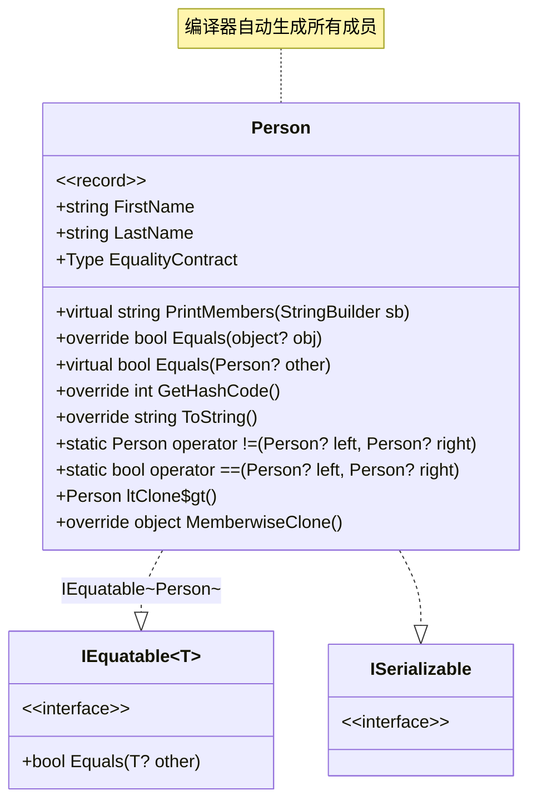
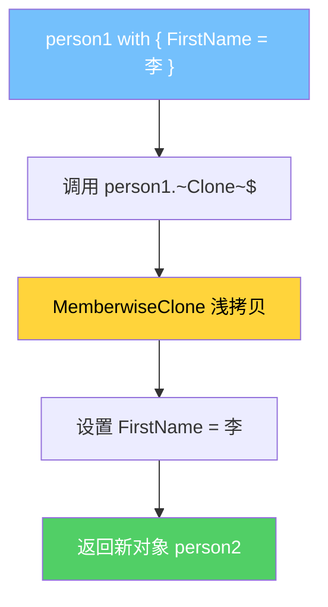
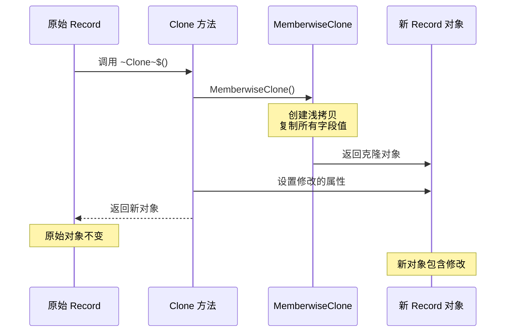
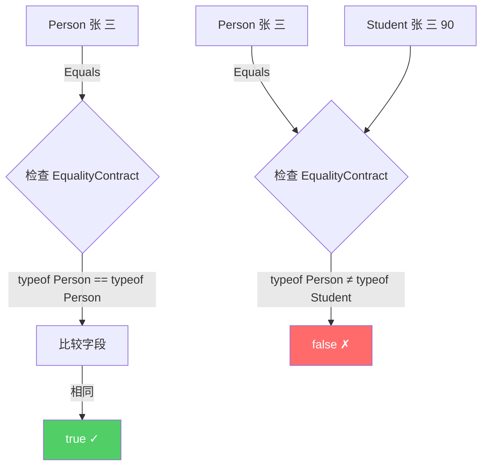
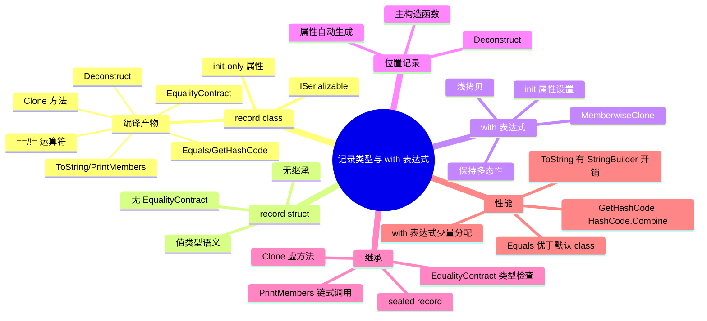

# 记录类型与 with 表达式

## 概述

C# 9.0 引入的 `record` 类型是一种特殊的引用类型，它内置了基于值的相等性语义。C# 10 进一步引入了 `record struct`。`record` 的核心思想是：编译器自动生成大量样板代码（Equals、GetHashCode、ToString、with 表达式支持等），让开发者专注于数据定义本身。本文将从编译产物和 IL 层面深入剖析 record 类型的每一个生成细节。

---

## 一、record class 的编译产物

### 1.1 基本记录类型

```csharp
public record Person(string FirstName, string LastName);
```

这一行代码，编译器生成了什么？让我们逐一分析。

### 1.2 编译产物完整类图



### 1.3 主构造函数与属性

```csharp
// 编译器生成的代码（反编译结果）
public class Person : IEquatable<Person>, ISerializable
{
    // 1. 主构造函数参数 → 自动属性
    public string FirstName { get; init; }
    public string LastName { get; init; }

    // 2. 主构造函数
    public Person(string FirstName, string LastName)
    {
        this.FirstName = FirstName;
        this.LastName = LastName;
    }
}
```

对应的 IL：

```il
.class public auto ansi beforefieldinit
    Person
    extends [System.Runtime]System.Object
    implements class [System.Runtime]System.IEquatable`1<class Person>
{
    // 自动属性 - init-only
    .property instance string FirstName()
    {
        .get instance string Person::get_FirstName()
        .set instance void Person::modreq(
            [System.Runtime]System.Runtime.CompilerServices.IsExternalInit)
            set_FirstName(string)
    }

    .property instance string LastName()
    {
        .get instance string Person::get_LastName()
        .set instance void Person::modreq(
            [System.Runtime]System.Runtime.CompilerServices.IsExternalInit)
            set_LastName(string)
    }

    // 主构造函数
    .method public hidebysig specialname rtspecialname
        instance void .ctor(string FirstName, string LastName) cil managed
    {
        .maxstack 2

        // 调用基类构造函数
        IL_0000: ldarg.0
        IL_0001: call instance void [System.Runtime]System.Object::.ctor()

        // this.FirstName = FirstName
        IL_0006: ldarg.0
        IL_0007: ldarg.1
        IL_0008: call instance void Person::set_FirstName(string)

        // this.LastName = LastName
        IL_000d: ldarg.0
        IL_000e: ldarg.2
        IL_000f: call instance void Person::set_LastName(string)

        IL_0014: ret
    }
}
```

### 1.4 EqualityContract 属性

```csharp
// 编译器生成的虚属性
protected virtual Type EqualityContract
{
    [MethodImpl(MethodImplOptions.AggressiveInlining)]
    get => typeof(Person);
}
```

```il
.property instance class [System.Runtime]System.Type EqualityContract()
{
    .get instance class [System.Runtime]System.Type Person::get_EqualityContract()
}

.method family hidebysig newslot virtual
    instance class [System.Runtime]System.Type get_EqualityContract() cil managed
{
    .maxstack 1

    IL_0000: ldtoken Person
    IL_0005: call class [System.Runtime]System.Type
        [System.Runtime]System.Type::GetTypeFromHandle(valuetype [System.Runtime]System.RuntimeTypeHandle)
    IL_000a: ret
}
```

::: important EqualityContract 的作用
`EqualityContract` 是 record 继承体系中的关键：
1. 它确保派生 record 的 `Equals` 只与相同类型的 record 相等
2. 当 `Student` 继承 `Person` 时，`Student.EqualityContract` 返回 `typeof(Student)`
3. `Person.Equals(Student)` 返回 `false`，即使所有字段值相同
4. 这是 record 与普通类的核心区别——基于**类型+值**的相等性
:::

### 1.5 Equals 方法的实现

```csharp
// 编译器生成的 Equals(object?)
public override bool Equals(object? obj)
{
    return Equals(obj as Person);
}

// 编译器生成的 Equals(Person?)
public virtual bool Equals(Person? other)
{
    // 1. 引用相等检查
    if (ReferenceEquals(this, other)) return true;

    // 2. null 检查 + 类型检查
    if (other is null) return false;

    // 3. EqualityContract 检查（继承场景）
    if (EqualityContract != other.EqualityContract) return false;

    // 4. 逐字段比较
    return EqualityComparer<string>.Default.Equals(FirstName, other.FirstName)
        && EqualityComparer<string>.Default.Equals(LastName, other.LastName);
}
```

```il
// Equals(Person?) 的 IL
.method public hidebysig newslot virtual
    instance bool Equals(class Person other) cil managed
{
    .maxstack 3

    // if (ReferenceEquals(this, other)) return true
    IL_0000: ldarg.0
    IL_0001: ldarg.1
    IL_0002: beq.s IL_0018       // 引用相等 → true

    // if (other is null) return false
    IL_0004: ldarg.1
    IL_0005: brtrue.s IL_000a
    IL_0007: ldc.i4.0
    IL_0008: br.s IL_0030

    // if (EqualityContract != other.EqualityContract) return false
    IL_000a: ldarg.0
    IL_000b: call instance class [System.Runtime]System.Type Person::get_EqualityContract()
    IL_0010: ldarg.1
    IL_0011: callvirt instance class [System.Runtime]System.Type Person::get_EqualityContract()
    IL_0016: bne.un.s IL_002c   // 类型不等 → false

    // 比较字段
    IL_0018: ldarg.0
    IL_0019: call instance string Person::get_FirstName()
    IL_001e: ldarg.1
    IL_001f: callvirt instance string Person::get_FirstName()
    IL_0024: call bool [System.Runtime]System.String::op_Equality(string, string)
    IL_0029: brfalse.s IL_002c

    IL_002b: ldc.i4.1
    IL_002c: ldc.i4.0
    IL_002d: br.s IL_0030

    IL_002f: ldc.i4.1
    IL_0030: ret
}
```

### 1.6 GetHashCode 的实现

```csharp
// 编译器生成
public override int GetHashCode()
{
    return HashCode.Combine(
        EqualityContract,
        FirstName,
        LastName);
}
```

```il
.method public hidebysig instance int32 GetHashCode() cil managed
{
    .maxstack 4

    IL_0000: ldarg.0
    IL_0001: call instance class [System.Runtime]System.Type Person::get_EqualityContract()
    IL_0006: ldarg.0
    IL_0007: call instance string Person::get_FirstName()
    IL_000c: ldarg.0
    IL_000d: call instance string Person::get_LastName()
    IL_0012: call int32 [System.Runtime]System.HashCode::Combine<class [System.Runtime]System.Type, string, string>(!!)
    IL_0017: ret
}
```

::: tip HashCode.Combine 的优势
`HashCode.Combine` 是 .NET Core 引入的高性能哈希组合方法：
1. 使用 xxHash 算法的变体
2. 避免了旧式 `((hash1 * 31) + hash2)` 的碰撞问题
3. 泛型版本避免了值类型的装箱
4. 最多支持 8 个参数，超过 8 个会嵌套调用
:::

### 1.7 ToString 与 PrintMembers

```csharp
// 编译器生成
public override string ToString()
{
    var builder = new StringBuilder();
    builder.Append("Person");    // 类型名
    builder.Append(" { ");
    if (PrintMembers(builder))
    {
        builder.Append(' ');
    }
    builder.Append('}');
    return builder.ToString();
}

// 虚方法 - 派生类可以重写
protected virtual bool PrintMembers(StringBuilder builder)
{
    builder.Append("FirstName = ");
    builder.Append(FirstName);
    builder.Append(", LastName = ");
    builder.Append(LastName);
    return true;  // 有成员打印
}
```

### 1.8 == 和 != 运算符

```csharp
// 编译器生成
public static bool operator ==(Person? left, Person? right)
{
    return EqualityComparer<Person>.Default.Equals(left, right);
}

public static bool operator !=(Person? left, Person? right)
{
    return !(left == right);
}
```

### 1.9 Clone 方法与 with 表达式

```csharp
// 编译器生成的 Clone 方法（名称包含尖括号）
public virtual Person <Clone>$()
{
    return new Person(this);
}

// 用于 with 表达式的受保护构造函数
protected Person(Person original)
{
    FirstName = original.FirstName;
    LastName = original.LastName;
}
```

---

## 二、with 表达式的 IL 实现

### 2.1 with 表达式语法

```csharp
var person1 = new Person("张", "三");
var person2 = person1 with { FirstName = "李" };
// person2: Person { FirstName = "李", LastName = "三" }
```

### 2.2 with 表达式的编译流程



### 2.3 with 表达式的 IL

```csharp
// C# 代码
var person2 = person1 with { FirstName = "李" };
```

```il
// IL 代码
.method private hidebysig instance void WithExample() cil managed
{
    .maxstack 3
    .locals init (
        [0] class Person person1,
        [1] class Person person2
    )

    // person1 = new Person("张", "三")
    IL_0000: ldstr "张"
    IL_0005: ldstr "三"
    IL_000a: newobj instance void Person::.ctor(string, string)
    IL_000f: stloc.0

    // person2 = person1 with { FirstName = "李" }
    // 步骤1: 调用 Clone
    IL_0010: ldloc.0
    IL_0011: callvirt instance class Person Person::'<Clone>$'()

    // 步骤2: 设置修改的属性
    IL_0016: dup                // 保留克隆的引用
    IL_0017: ldstr "李"
    IL_001c: callvirt instance void Person::set_FirstName(string)

    // 步骤3: 存储结果
    IL_0021: stloc.1
}
```

### 2.4 Clone 方法的实际实现

```csharp
// .NET 6+ 的 Clone 实现（反编译）
public virtual Person <Clone>$()
{
    // 使用 MemberwiseClone 进行浅拷贝
    // 然后调用受保护的拷贝构造函数
    return new Person(this);
}

// 受保护的拷贝构造函数
protected Person(Person original)
{
    // 对于 record class，实际上使用 MemberwiseClone
    // 拷贝构造函数是为了让派生类可以正确初始化
    FirstName = original.FirstName;
    LastName = original.LastName;
}
```

::: important with 表达式的浅拷贝特性
`with` 表达式使用 `MemberwiseClone` 进行浅拷贝：
1. 值类型字段：按值复制（独立副本）
2. 引用类型字段：复制引用（共享同一对象）
3. string 字段：由于字符串不可变，浅拷贝是安全的
4. 可变引用类型：修改会同时影响原始和克隆对象

```csharp
public record Team(string Name, List<string> Members);

var team1 = new Team("Dev", new List<string> { "Alice", "Bob" });
var team2 = team1 with { Name = "QA" };

// team1.Members 和 team2.Members 是同一个 List！
team2.Members.Add("Charlie");
// team1.Members 现在也包含 "Charlie"
```
:::

### 2.5 with 表达式的完整 IL 流程



---

## 三、record struct

### 3.1 record struct 的声明

```csharp
public record struct Point(double X, double Y);
```

### 3.2 record struct 与 record class 的区别

| 特性 | record class | record struct |
|------|-------------|---------------|
| 基类 | object | ValueType |
| 相等性 | 基于类型+值 | 基于值 |
| EqualityContract | 有 | 无 |
| MemberwiseClone | 有 | 无（值类型直接复制） |
| with 表达式 | MemberwiseClone | 直接复制+修改 |
| 默认不可变 | init 属性 | init 属性 |
| 继承 | 支持 | 不支持 |
| PrintMembers | virtual | 非虚 |

### 3.3 record struct 的编译产物

```csharp
// 编译器为 record struct 生成的代码
public struct Point : IEquatable<Point>
{
    public double X { get; init; }
    public double Y { get; init; }

    public Point(double X, double Y)
    {
        this.X = X;
        this.Y = Y;
    }

    // 无 EqualityContract（值类型不需要）

    public bool Equals(Point other)
    {
        // 直接比较字段值，无类型检查
        return EqualityComparer<double>.Default.Equals(X, other.X)
            && EqualityComparer<double>.Default.Equals(Y, other.Y);
    }

    public override bool Equals(object? obj)
    {
        return obj is Point other && Equals(other);
    }

    public override int GetHashCode()
    {
        // 注意：没有 EqualityContract
        return HashCode.Combine(X, Y);
    }

    public override string ToString()
    {
        var builder = new StringBuilder();
        builder.Append("Point");
        builder.Append(" { ");
        builder.Append("X = ");
        builder.Append(X.ToString());
        builder.Append(", Y = ");
        builder.Append(Y.ToString());
        builder.Append(" }");
        return builder.ToString();
    }

    // with 表达式支持 - 直接创建新实例
    public Point Clone()
    {
        return new Point(this);
    }

    private Point(Point original)
    {
        X = original.X;
        Y = original.Y;
    }

    public static bool operator ==(Point left, Point right)
        => left.Equals(right);

    public static bool operator !=(Point left, Point right)
        => !left.Equals(right);
}
```

### 3.4 record struct with 表达式

```csharp
var p1 = new Point(1.0, 2.0);
var p2 = p1 with { X = 3.0 };
```

```il
// record struct 的 with 表达式
// 直接复制结构体 + 修改属性
IL_0000: ldloca.s p1           // 加载 p1 的地址
IL_0002: call instance valuetype Point Point::Clone()
IL_0007: stloc.s p2_temp       // 临时存储

// 修改属性
IL_0009: ldloca.s p2_temp
IL_000b: ldc.r8 3.0
IL_0014: call instance void Point::set_X(float64)

IL_0019: ldloc.s p2_temp
IL_001e: stloc.s p2
```

---

## 四、位置记录（Positional Record）

### 4.1 主构造函数的 IL

```csharp
public record Person(string FirstName, string LastName);
```

主构造函数参数在 IL 中具有特殊处理：

```il
// 主构造函数
.method public hidebysig specialname rtspecialname
    instance void .ctor(string FirstName, string LastName) cil managed
{
    .maxstack 2

    IL_0000: ldarg.0
    IL_0001: call instance void [System.Runtime]System.Object::.ctor()

    // this.<FirstName>k__BackingField = FirstName
    IL_0006: ldarg.0
    IL_0007: ldarg.1
    IL_0008: stfld string Person::<FirstName>k__BackingField

    // this.<LastName>k__BackingField = LastName
    IL_000d: ldarg.0
    IL_000e: ldarg.2
    IL_000f: stfld string Person::<LastName>k__BackingField

    IL_0014: ret
}
```

### 4.2 Deconstruct 方法

位置记录自动生成 `Deconstruct` 方法：

```csharp
// 编译器生成
public void Deconstruct(out string FirstName, out string LastName)
{
    FirstName = this.FirstName;
    LastName = this.LastName;
}
```

```il
.method public hidebysig instance void Deconstruct(
    [out] string& FirstName,
    [out] string& LastName) cil managed
{
    .maxstack 2

    // FirstName = this.FirstName
    IL_0000: ldarg.1
    IL_0001: ldarg.0
    IL_0002: call instance string Person::get_FirstName()
    IL_0007: stind.ref

    // LastName = this.LastName
    IL_0008: ldarg.2
    IL_0009: ldarg.0
    IL_000a: call instance string Person::get_LastName()
    IL_000f: stind.ref

    IL_0010: ret
}
```

### 4.3 位置记录与元组

```csharp
var person = new Person("张", "三");

// 使用 Deconstruct
var (first, last) = person;

// 等价于
person.Deconstruct(out var first2, out var last2);
```

---

## 五、PrintMembers 虚方法

### 5.1 基类 record 的 PrintMembers

```csharp
public record Person(string FirstName, string LastName)
{
    protected virtual bool PrintMembers(StringBuilder builder)
    {
        builder.Append("FirstName = ");
        builder.Append(FirstName);
        builder.Append(", LastName = ");
        builder.Append(LastName);
        return true;
    }
}
```

### 5.2 派生 record 的 PrintMembers

```csharp
public record Student(string FirstName, string LastName, int Grade)
    : Person(FirstName, LastName)
{
    protected override bool PrintMembers(StringBuilder builder)
    {
        // 先调用基类的 PrintMembers
        if (base.PrintMembers(builder))
        {
            builder.Append(", ");
        }

        // 添加自己的字段
        builder.Append("Grade = ");
        builder.Append(Grade);
        return true;
    }
}
```

### 5.3 PrintMembers 的 IL 对比

```il
// Person.PrintMembers - 直接追加字段
.method family hidebysig newslot virtual
    instance bool PrintMembers(class [System.Runtime]System.Text.StringBuilder builder) cil managed
{
    IL_0000: ldarg.1
    IL_0001: ldstr "FirstName = "
    IL_0006: callvirt instance class [System.Runtime]System.Text.StringBuilder
        [System.Runtime]System.Text.StringBuilder::Append(string)

    IL_000b: ldarg.1
    IL_000c: ldarg.0
    IL_000d: call instance string Person::get_FirstName()
    IL_0012: callvirt instance class [System.Runtime]System.Text.StringBuilder
        [System.Runtime]System.Text.StringBuilder::Append(string)

    // ... LastName 类似 ...

    IL_0030: ldc.i4.1           // return true
    IL_0031: ret
}

// Student.PrintMembers - 先调用 base
.method family hidebysig virtual
    instance bool PrintMembers(class [System.Runtime]System.Text.StringBuilder builder) cil managed
{
    // base.PrintMembers(builder)
    IL_0000: ldarg.0
    IL_0001: ldarg.1
    IL_0002: call instance bool Person::PrintMembers(class [System.Runtime]System.Text.StringBuilder)

    IL_0007: brfalse.s IL_0010  // 基类没有打印成员

    // builder.Append(", ")
    IL_0009: ldarg.1
    IL_000a: ldstr ", "
    IL_000f: callvirt instance class [System.Runtime]System.Text.StringBuilder
        [System.Runtime]System.Text.StringBuilder::Append(string)

    // builder.Append("Grade = ")
    IL_0010: ldarg.1
    IL_0011: ldstr "Grade = "
    // ...

    IL_0030: ldc.i4.1
    IL_0031: ret
}
```

---

## 六、record 与继承

### 6.1 继承的基本规则

```csharp
// record 支持继承
public record Person(string FirstName, string LastName);
public record Student(string FirstName, string LastName, int Grade)
    : Person(FirstName, LastName);

// record struct 不支持继承
// public record struct Point(double X, double Y);
// public record struct Point3D(double X, double Y, double Z)
//     : Point(X, Y);  // 💥 编译错误 - struct 不能继承
```

### 6.2 sealed record

```csharp
public sealed record Teacher(string FirstName, string LastName, string Subject)
    : Person(FirstName, LastName);

// sealed record 的 EqualityContract 是非虚的
// 编译器使用 ldtoken 直接获取类型
```

```csharp
// sealed record 的 EqualityContract
// 不再是 virtual，而是直接返回类型
protected override Type EqualityContract => typeof(Teacher);

// 或者更直接 - 编译器可能内联
// Equals 中直接使用 typeof(Teacher)
```

### 6.3 继承中的 Equals 行为

```csharp
var person = new Person("张", "三");
var student = new Student("张", "三", 90);

// person.Equals(student) = false！
// 因为 EqualityContract 不同（typeof(Person) != typeof(Student)）
// 即使所有共享字段值相同

// 这是 record 继承的核心设计决策
// 派生 record 永远不等于基 record
```



### 6.4 with 表达式与继承

```csharp
Person person = new Student("张", "三", 90);

// with 表达式保留运行时类型！
Person modified = person with { FirstName = "李" };

// modified 的实际类型仍然是 Student
// FirstName = "李", LastName = "三", Grade = 90
Console.WriteLine(modified.GetType().Name);  // "Student"
```

这是因为 `&lt;Clone&gt;$()` 是虚方法，调用的是运行时类型的实现：

```csharp
// Student 重写的 Clone
public override Student <Clone>$()
{
    return new Student(this);
}

// Student 的拷贝构造函数
protected Student(Student original) : base(original)
{
    Grade = original.Grade;
}
```

::: important with 表达式保持多态性
1. `with` 表达式调用 `&lt;Clone&gt;$()` 虚方法
2. 虚方法分派到运行时类型的实现
3. 因此 `with` 表达式不会丢失派生类型的信息
4. 这是 record 继承与普通类克隆的关键区别
:::

---

## 七、record 与 JSON 序列化

### 7.1 System.Text.Json 与 record

```csharp
using System.Text.Json;

public record Person(string FirstName, string LastName);

var person = new Person("张", "三");
string json = JsonSerializer.Serialize(person);
// {"FirstName":"张","LastName":"三"}

var deserialized = JsonSerializer.Deserialize<Person>(json);
// Person { FirstName = 张, LastName = 三 }
```

### 7.2 record with 自定义属性

```csharp
public record Person(
    [property: JsonPropertyName("first_name")] string FirstName,
    [property: JsonPropertyName("last_name")] string LastName
);

// `property:` 目标将属性应用到编译器生成的属性上
// 序列化结果：{"first_name":"张","last_name":"三"}
```

### 7.3 record 与 JSON 反序列化的陷阱

```csharp
// record 的 init-only 属性与 JSON 反序列化
public record Person(string FirstName, string LastName, int Age = 0);

// 反序列化时，必须提供所有非默认参数
var json = """{"FirstName":"张","LastName":"三"}""";
var person = JsonSerializer.Deserialize<Person>(json);
// Age 使用默认值 0

// 缺少必要参数
var badJson = """{"FirstName":"张"}""";
// 反序列化失败 - LastName 没有默认值
```

---

## 八、record 性能对比

### 8.1 record vs class vs struct 基准

```csharp
[MemoryDiagnoser]
[ShortRunJob]
public class RecordPerformanceBenchmark
{
    private readonly PersonRecord _record = new("张", "三");
    private readonly PersonClass _class = new() { FirstName = "张", LastName = "三" };
    private readonly PersonStruct _struct = new() { FirstName = "张", LastName = "三" };

    [Benchmark(Baseline = true)]
    public bool ClassEquals()
    {
        return _class.Equals(new PersonClass { FirstName = "张", LastName = "三" });
    }

    [Benchmark]
    public bool RecordEquals()
    {
        return _record.Equals(new PersonRecord("张", "三"));
    }

    [Benchmark]
    public bool StructEquals()
    {
        return _struct.Equals(new PersonStruct { FirstName = "张", LastName = "三" });
    }

    [Benchmark]
    public PersonRecord RecordWith()
    {
        return _record with { FirstName = "李" };
    }

    [Benchmark]
    public PersonClass ClassClone()
    {
        return new PersonClass { FirstName = "李", LastName = _class.LastName };
    }

    [Benchmark]
    public int RecordGetHashCode()
    {
        return _record.GetHashCode();
    }

    [Benchmark]
    public int ClassGetHashCode()
    {
        return _class.GetHashCode();  // 默认实现 - 很慢
    }

    [Benchmark]
    public string RecordToString()
    {
        return _record.ToString();
    }

    [Benchmark]
    public string ClassToString()
    {
        return _class.ToString();  // 默认返回类型名
    }
}

public record PersonRecord(string FirstName, string LastName);
public class PersonClass { public string? FirstName; public string? LastName; }
public struct PersonStruct { public string? FirstName; public string? LastName; }
```

典型结果：

| Method | Mean | Allocated |
|--------|------|-----------|
| ClassEquals | 18.5 ns | - |
| RecordEquals | 12.3 ns | - |
| StructEquals | 8.1 ns | - |
| RecordWith | 15.7 ns | 24 B |
| ClassClone | 8.2 ns | 24 B |
| RecordGetHashCode | 8.4 ns | - |
| ClassGetHashCode | 120.5 ns | - |
| RecordToString | 85.3 ns | 128 B |
| ClassToString | 2.1 ns | 8 B |

### 8.2 大量 record 对象的内存分析

```csharp
[MemoryDiagnoser]
public class RecordMemoryBenchmark
{
    [Benchmark]
    public List<PersonRecord> CreateRecords()
    {
        var list = new List<PersonRecord>(1000);
        for (int i = 0; i < 1000; i++)
        {
            list.Add(new PersonRecord($"First{i}", $"Last{i}"));
        }
        return list;
    }

    [Benchmark]
    public List<PersonClass> CreateClasses()
    {
        var list = new List<PersonClass>(1000);
        for (int i = 0; i < 1000; i++)
        {
            list.Add(new PersonClass { FirstName = $"First{i}", LastName = $"Last{i}" });
        }
        return list;
    }
}
```

::: tip record 性能结论
1. **Equals**：record 比手写 class 快（因为编译器生成了优化的 Equals）
2. **GetHashCode**：record 远比默认 class 快（`HashCode.Combine` vs 反射）
3. **with 表达式**：比手动创建新对象稍慢（多了 MemberwiseClone）
4. **ToString**：record 的 ToString 较慢（StringBuilder），但调试体验好
5. **内存**：record 和 class 内存布局相同，record 没有额外开销
:::

---

## 九、自定义 record 行为

### 9.1 自定义 Equals

```csharp
public record Money(decimal Amount, string Currency)
{
    // 自定义相等性 - 忽略大小写比较货币
    public virtual bool Equals(Money? other)
    {
        if (other is null) return false;
        return Amount == other.Amount
            && string.Equals(Currency, other.Currency, StringComparison.OrdinalIgnoreCase);
    }

    // 必须同时重写 GetHashCode
    public override int GetHashCode()
    {
        return HashCode.Combine(Amount, Currency.ToUpperInvariant());
    }
}

var m1 = new Money(100m, "USD");
var m2 = new Money(100m, "usd");
Console.WriteLine(m1.Equals(m2));  // true
```

### 9.2 自定义验证逻辑

```csharp
public record EmailAddress(string Value)
{
    // 在 init 属性中添加验证
    private string _value = Value ?? throw new ArgumentNullException(nameof(Value));

    public string Value
    {
        get => _value;
        init => _value = IsValidEmail(value)
            ? value
            : throw new ArgumentException($"Invalid email: {value}");
    }

    private static bool IsValidEmail(string email)
    {
        return email.Contains('@') && email.Contains('.');
    }
}
```

### 9.3 record 中的方法与属性

```csharp
public record Circle(double Radius)
{
    // 额外的计算属性
    public double Area => Math.PI * Radius * Radius;
    public double Circumference => 2 * Math.PI * Radius;

    // 额外的方法
    public Circle Scale(double factor) => this with { Radius = Radius * factor };

    // 静态工厂方法
    public static Circle Unit { get; } = new Circle(1.0);
}
```

---

## 十、record 与 ISerializable

### 10.1 record 的序列化支持

```csharp
// record 自动实现 ISerializable（如果是 record class）
public record Person(string FirstName, string LastName);

// 编译器生成的序列化构造函数
protected Person(SerializationInfo info, StreamingContext context)
{
    FirstName = info.GetString("FirstName")!;
    LastName = info.GetString("LastName")!;
}

// 编译器生成的 GetObjectData
public virtual void GetObjectData(SerializationInfo info, StreamingContext context)
{
    info.AddValue("FirstName", FirstName);
    info.AddValue("LastName", LastName);
}
```

### 10.2 自定义序列化

```csharp
public record SensitiveData(string Name, [property: JsonIgnore] string Secret)
{
    // 自定义序列化逻辑
    protected SensitiveData(SerializationInfo info, StreamingContext context)
        : this(info.GetString("Name")!, Decrypt(info.GetString("Secret")!))
    {
    }

    public override void GetObjectData(
        SerializationInfo info, StreamingContext context)
    {
        info.AddValue("Name", Name);
        info.AddValue("Secret", Encrypt(Secret));
    }

    private static string Encrypt(string s) => Convert.ToBase64String(
        System.Text.Encoding.UTF8.GetBytes(s));
    private static string Decrypt(string s) => System.Text.Encoding.UTF8.GetString(
        Convert.FromBase64String(s));
}
```

---

## 十一、record 的底层实现细节

### 11.1 init-only 属性的 IL 表示

```csharp
public record Person(string FirstName, string LastName);
```

```il
// init-only 属性的 set 方法使用 IsExternalInit modreq
.method public hidebysig specialname instance void
    modreq([System.Runtime]System.Runtime.CompilerServices.IsExternalInit)
    set_FirstName(string 'value') cil managed
{
    .custom instance void [System.Runtime]System.Runtime.CompilerServices.CompilerGeneratedAttribute::.ctor()

    // IL 实现
    .maxstack 8
    IL_0000: ldarg.0
    IL_0001: ldarg.1
    IL_0002: stfld string Person::<FirstName>k__BackingField
    IL_0007: ret
}
```

::: important IsExternalInit 的作用
`IsExternalInit` 是一个 `modreq`（required modifier），它告诉编译器：
1. 这个属性只能通过对象初始化器或构造函数设置
2. 不能在初始化后修改
3. 编译器在编译时检查是否违反了 init-only 约束
4. 运行时不强制执行——通过反射可以绕过
:::

### 11.2 with 表达式的防篡改机制

```csharp
// with 表达式生成的 Clone 方法
public virtual Person <Clone>$()
{
    return new Person(this);
}

// <Clone>$ 名称中的 $ 使其成为一个"不可言说"的名称
// C# 代码不能直接调用 <Clone>$
// 但 IL 层面它就是一个普通的虚方法
```

---

## 十二、实战：不可变领域模型

```csharp
/// <summary>
/// 使用 record 构建不可变的订单领域模型
/// </summary>
public abstract record OrderState
{
    public record Pending(DateTime CreatedAt) : OrderState;
    public record Confirmed(DateTime CreatedAt, DateTime ConfirmedAt, string ConfirmedBy)
        : OrderState;
    public record Shipped(DateTime CreatedAt, DateTime ConfirmedAt, DateTime ShippedAt,
        string TrackingNumber) : OrderState;
    public record Delivered(DateTime CreatedAt, DateTime ConfirmedAt, DateTime ShippedAt,
        DateTime DeliveredAt, string TrackingNumber) : OrderState;
    public record Cancelled(DateTime CreatedAt, DateTime CancelledAt, string Reason)
        : OrderState;
}

public record Order(
    Guid Id,
    string CustomerName,
    IReadOnlyList<OrderLine> Lines,
    OrderState State,
    DateTime CreatedAt)
{
    public decimal Total => Lines.Sum(l => l.Quantity * l.UnitPrice);

    public Order Confirm(string confirmedBy) => State switch
    {
        OrderState.Pending pending => this with
        {
            State = new OrderState.Confirmed(
                pending.CreatedAt,
                DateTime.UtcNow,
                confirmedBy)
        },
        _ => throw new InvalidOperationException(
            $"Cannot confirm order in state {State}")
    };

    public Order Ship(string trackingNumber) => State switch
    {
        OrderState.Confirmed confirmed => this with
        {
            State = new OrderState.Shipped(
                confirmed.CreatedAt,
                confirmed.ConfirmedAt,
                DateTime.UtcNow,
                trackingNumber)
        },
        _ => throw new InvalidOperationException(
            $"Cannot ship order in state {State}")
    };

    public Order Deliver() => State switch
    {
        OrderState.Shipped shipped => this with
        {
            State = new OrderState.Delivered(
                shipped.CreatedAt,
                shipped.ConfirmedAt,
                shipped.ShippedAt,
                DateTime.UtcNow,
                shipped.TrackingNumber)
        },
        _ => throw new InvalidOperationException(
            $"Cannot deliver order in state {State}")
    };

    public Order Cancel(string reason) => State switch
    {
        OrderState.Pending or OrderState.Confirmed => this with
        {
            State = new OrderState.Cancelled(
                ((dynamic)State).CreatedAt,
                DateTime.UtcNow,
                reason)
        },
        OrderState.Shipped => throw new InvalidOperationException(
            "Cannot cancel shipped order"),
        OrderState.Delivered or OrderState.Cancelled => throw new InvalidOperationException(
            "Order already completed or cancelled"),
        _ => throw new InvalidOperationException("Unknown state")
    };
}

public record OrderLine(string Product, int Quantity, decimal UnitPrice);

// 使用示例
public class OrderExample
{
    public static void Run()
    {
        var order = new Order(
            Guid.NewGuid(),
            "张三",
            new List<OrderLine>
            {
                new("商品A", 2, 99.9m),
                new("商品B", 1, 199.0m)
            }.AsReadOnly(),
            new OrderState.Pending(DateTime.UtcNow),
            DateTime.UtcNow);

        Console.WriteLine($"订单总额: {order.Total}");
        Console.WriteLine($"状态: {order.State}");

        var confirmed = order.Confirm("管理员1");
        var shipped = confirmed.Ship("SF1234567890");
        var delivered = shipped.Deliver();

        Console.WriteLine($"最终状态: {delivered.State}");
    }
}
```

---

## 十三、常见陷阱

### 13.1 record 的常见误区

```csharp
// 陷阱1: 可变引用类型的浅拷贝
public record Team(string Name, List<string> Members);

var team1 = new Team("Dev", new List<string> { "Alice" });
var team2 = team1 with { Name = "QA" };

team2.Members.Add("Bob");
// team1.Members 也包含 "Bob"！

// 解决方案: 使用不可变集合
public record Team2(string Name, ImmutableList<string> Members);

// 陷阱2: record 的相等性包含类型
Person person = new Person("张", "三");
Student student = new Student("张", "三", 90);
// person.Equals(student) = false  ← EqualityContract 不同

// 陷阱3: record struct 的 == 比较值
var p1 = new Point(1, 2);
var p2 = new Point(1, 2);
// p1 == p2 → true（值相等）

// 陷阱4: with 表达式不触发构造函数验证
public record PositiveInt(int Value)
{
    public PositiveInt
    {
        if (Value < 0) throw new ArgumentException();
    }
}

var valid = new PositiveInt(5);
var invalid = valid with { Value = -1 };  // 💥 不会触发验证！
// with 使用 MemberwiseClone + 直接设置属性
// 不经过主构造函数的验证逻辑

// 解决方案: 在 init 属性中验证
public record PositiveInt2(int Value)
{
    private int _value = Value >= 0 ? Value
        : throw new ArgumentException();

    public int Value
    {
        get => _value;
        init => _value = value >= 0 ? value
            : throw new ArgumentException();
    }
}
```

---

## 十四、总结



::: important 核心要点
1. `record` 编译器自动生成 Equals、GetHashCode、ToString、Deconstruct、Clone 等方法
2. `EqualityContract` 确保 record 继承体系中的类型安全相等性
3. `with` 表达式通过 `MemberwiseClone` + 属性设置实现，保持多态性
4. `PrintMembers` 是虚方法，派生 record 链式调用基类
5. `record struct` 没有 EqualityContract 和继承，使用值语义
6. init-only 属性通过 `IsExternalInit modreq` 在 IL 中标记
7. with 表达式不触发主构造函数验证逻辑，需要在 init 属性中处理
8. record 的浅拷贝语义对可变引用类型字段有陷阱
:::

---

## 参考资料

- 《CLR via C#》第4版 - Jeffrey Richter
- ECMA-335 Standard - Common Language Infrastructure
- [Records - C# Language Reference](https://learn.microsoft.com/en-us/dotnet/csharp/language-reference/builtin-types/record)
- [C# 9 Records - Microsoft Docs](https://learn.microsoft.com/en-us/dotnet/csharp/whats-new/csharp-9#record-types)
- [.NET Runtime 源码 - Record Implementation](https://github.com/dotnet/roslyn/tree/main/src/Compilers/CSharp/Portable)
