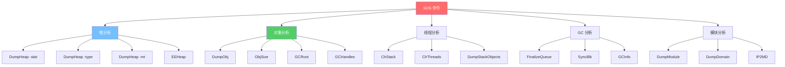
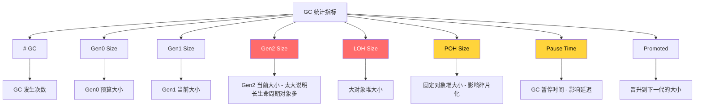
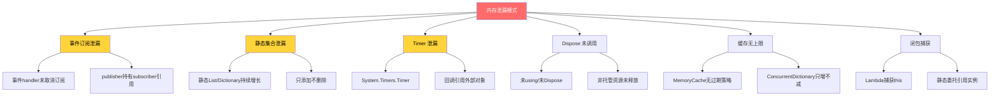
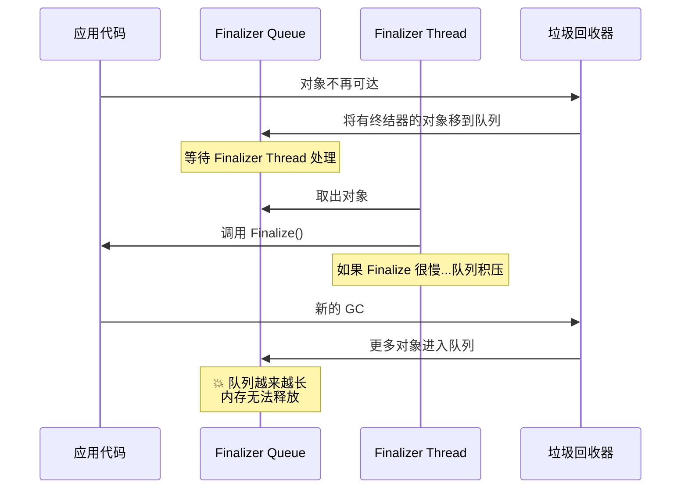
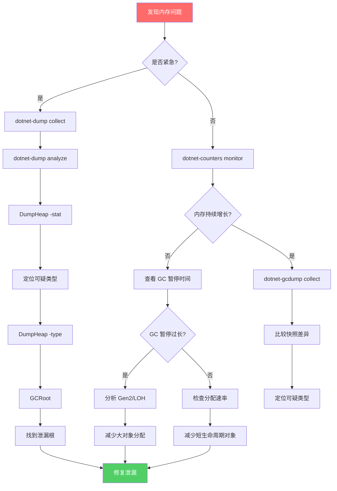
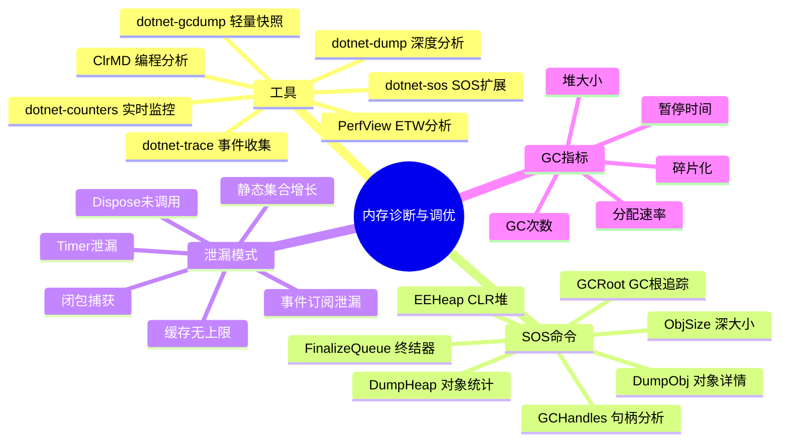

# 内存诊断与调优

## 概述

内存问题是 .NET 应用最棘手的问题之一——内存泄漏、GC 压力过大、大对象堆碎片化等问题往往在生产环境才暴露。.NET 提供了一套强大的诊断工具链，从轻量级的实时监控到深入的核心转储分析，帮助开发者精确定位和解决内存问题。本文将系统性地介绍这些工具及其使用方法。

---

## 一、dotnet-dump 收集与分析

### 1.1 dotnet-dump 简介

`dotnet-dump` 是 .NET 提供的核心转储工具，可以在不安装调试器的情况下收集和分析进程的内存转储。

```bash
# 安装
dotnet tool install --global dotnet-dump

# 收集转储
dotnet-dump collect -p <pid>
dotnet-dump collect -p <pid> --output mydump.dmp
dotnet-dump collect -p <pid> --type Full    # 完整转储
dotnet-dump collect -p <pid> --type Heap    # 仅堆转储（较小）

# 分析转储
dotnet-dump analyze mydump.dmp
```

### 1.2 转储类型

| 类型 | 大小 | 内容 | 适用场景 |
|------|------|------|----------|
| Full | 大 | 完整进程内存 | 深度分析 |
| Heap | 中 | 托管堆+句柄 | 内存泄漏分析 |
| Mini | 小 | 线程+栈 | 崩溃分析 |

### 1.3 dotnet-dump 分析命令

```
(dotnet-dump) > help

可用命令:
  dumpheap       - 显示托管堆信息
  dumpmd         - 显示 MethodDesc 信息
  dumpmt         - 显示方法表信息
  dumpobj        - 显示对象信息
  dumpclass      - 显示类信息
  dumpdomain     - 显示 AppDomain 信息
  dumpmodule     - 显示模块信息
  dumpstack      - 显示栈追踪
  clrstack       - 显示托管栈追踪
  clrthreads     - 显示托管线程
  gchandles      - 显示 GC 句柄
  gcroot         - 显示对象的 GC 根
  eeheap         - 显示 CLR 堆信息
  finalizequeue  - 显示终结器队列
  syncblk        - 显示同步块
  soshelp        - SOS 命令帮助
```

### 1.4 常用分析工作流

```bash
# 1. 查看堆上的对象统计
> dumpheap -stat

# 2. 找到可疑类型后，查看该类型的所有对象
> dumpheap -type System.String

# 3. 查看特定对象的详情
> dumpobj <address>

# 4. 查找对象的 GC 根（谁引用了它）
> gcroot <address>

# 5. 查看对象大小（含引用的对象）
> objsize <address>
```

---

## 二、dotnet-gcdump 轻量 GC 快照

### 2.1 gcdump 的优势

`dotnet-gcdump` 比 `dotnet-dump` 轻量得多，它只记录堆上对象的类型统计和引用关系，不记录具体的对象数据：

```bash
# 安装
dotnet tool install --global dotnet-gcdump

# 收集 GC 快照
dotnet-gcdump collect -p <pid>

# 收集并保存
dotnet-gcdump collect -p <pid> -o before.gcdump

# 比较两个快照
dotnet-gcdump report before.gcdump after.gcdump
```

### 2.2 gcdump 文件格式

gcdump 文件可以在 Visual Studio 中打开，查看：
1. 各类型的对象数量和大小
2. 对象之间的引用关系
3. 两个快照之间的差异

### 2.3 gcdump vs dump 对比

| 特性 | dotnet-gcdump | dotnet-dump |
|------|--------------|-------------|
| 文件大小 | 小 (KB-MB) | 大 (GB级) |
| 收集速度 | 快 (< 1秒) | 慢 (数秒) |
| 暂停时间 | 短 | 长 |
| 内容 | 类型统计+引用 | 完整内存 |
| 分析深度 | 中等 | 深 |
| 适用场景 | 日常监控 | 深度排查 |

---

## 三、SOS 命令详解

### 3.1 SOS 命令树



### 3.2 DumpHeap 详解

```bash
# 统计堆上所有类型
> dumpheap -stat

# 输出示例:
# Statistics:
#       MT    Count    TotalSize Class Name
# 7f1a2b3c4d      1          24 System.String[]
# 7f1a2b3c5e    500      2000000 System.Byte[]
# 7f1a2b3c6f   1000      32000000 MyApp.LargeObject
# Total 1501 objects

# 查看特定类型的对象
> dumpheap -type MyApp.LargeObject

# 查看特定方法表的对象
> dumpheap -mt 7f1a2b3c6f

# 查看特定代的对象
> dumpheap -gen 2

# 只看大对象堆
> dumpheap -segment

# 查看最小/最大的对象
> dumpheap -min 10000    # 大于 10KB 的对象
```

### 3.3 GCHandles 详解

```bash
# 查看所有 GC 句柄
> gchandles

# 输出示例:
# GC Handle Statistics:
# Strong Handles:        150
# Pinned Handles:         12
# Async Pinned Handles:    5
# Ref Count Handles:       0
# Weak Handles:           30
# Weak Track Handles:      10
# Total Handles:         207

# 查看特定对象的 GC 句柄
> gchandles -gcinfo
```

::: important GC 句柄类型
1. **Strong**：强引用，阻止 GC 回收对象
2. **Pinned**：固定对象，阻止 GC 移动对象（影响碎片化）
3. **Async Pinned**：异步操作使用的固定句柄
4. **Weak**：弱引用，不阻止 GC 回收
5. **Weak Track**：弱短引用，对象被回收后通知
6. **Ref Count**：引用计数句柄（COM 互操作）

过多的 Pinned 句柄会导致堆碎片化，因为 GC 无法移动这些对象。
:::

### 3.4 ObjSize 详解

```bash
# 查看对象的浅大小
> dumpobj <address>
# Size: 24 bytes

# 查看对象的深大小（含引用的对象）
> objsize <address>
# Size: 1,048,576 bytes (0x100000)

# 这对于分析内存泄漏非常有用
# 因为对象本身可能很小，但它引用了大量其他对象
```

---

## 四、GC 统计信息

### 4.1 使用 dotnet-dump 查看 GC 统计

```bash
> eeheap -gc

# 输出示例:
# Number of GC Heaps: 1
# generation 0 starts at 0x7f1a00001000
# generation 1 starts at 0x7f1a00005000
# generation 2 starts at 0x7f1a00010000
# ephemeral segment generation 0 starts at 0x7f1a00001000
#   segment            beginning     allocated     size
#   7f1a00000000  7f1a00001000  7f1a00012000  0x11000(69632)
# Large object heap starts at 0x7f1a00100000
#   segment            beginning     allocated     size
#   7f1a00100000  7f1a00100000  7f1a00350000  0x250000(2424832)
# Pinned object heap starts at 0x7f1a00400000
# Total Heap Size:    Size: 0x261000 (2494464) bytes
# ==============================
# GC Heap Size:    Size: 0x261000 (2494464) bytes
```

### 4.2 关键 GC 指标



---

## 五、内存泄漏典型模式

### 5.1 内存泄漏模式图



### 5.2 事件订阅泄漏

```csharp
// 典型的事件订阅泄漏
public class EventPublisher
{
    public event EventHandler<string>? OnMessage;
    public void Raise(string msg) => OnMessage?.Invoke(this, msg);
}

public class Subscriber
{
    private readonly byte[] _buffer = new byte[1024 * 1024]; // 1MB

    public Subscriber(EventPublisher publisher)
    {
        publisher.OnMessage += HandleMessage;  // 订阅
        // 💥 忘记取消订阅！publisher 持有对 Subscriber 的引用
    }

    private void HandleMessage(object? sender, string e)
    {
        // 处理消息
    }
}

// 使用
var publisher = new EventPublisher();
for (int i = 0; i < 1000; i++)
{
    var sub = new Subscriber(publisher);
    // sub 超出作用域，但 publisher 仍然引用它！
    // 内存泄漏：1000 * 1MB = 1GB
}
```

**修复方案**：

```csharp
// 方案1: 取消订阅
public class Subscriber : IDisposable
{
    private readonly EventPublisher _publisher;
    private readonly byte[] _buffer = new byte[1024 * 1024];

    public Subscriber(EventPublisher publisher)
    {
        _publisher = publisher;
        _publisher.OnMessage += HandleMessage;
    }

    public void Dispose()
    {
        _publisher.OnMessage -= HandleMessage;  // 取消订阅
    }
}

// 方案2: 使用弱事件模式
public class WeakSubscriber
{
    private readonly WeakReference<EventPublisher> _publisherRef;

    public WeakSubscriber(EventPublisher publisher)
    {
        _publisherRef = new WeakReference<EventPublisher>(publisher);
        // 使用 WeakEventManager 或自定义弱事件
    }
}
```

### 5.3 静态集合泄漏

```csharp
// 静态集合持续增长
public static class Cache
{
    // 💥 只添加不删除
    private static readonly Dictionary<string, byte[]> _cache = new();

    public static void Add(string key, byte[] data)
    {
        _cache[key] = data;  // 持续增长
    }
}

// 修复：使用 MemoryCache 或限制大小
public static class FixedCache
{
    private static readonly MemoryCache _cache = new(new MemoryCacheOptions
    {
        SizeLimit = 1000  // 限制条目数
    });

    public static void Add(string key, byte[] data)
    {
        _cache.Set(key, data, new MemoryCacheEntryOptions
        {
            Size = 1,
            SlidingExpiration = TimeSpan.FromMinutes(30)
        });
    }
}
```

### 5.4 Timer 泄漏

```csharp
// Timer 泄漏
public class LeakyService
{
    private readonly Timer _timer;
    private readonly byte[] _buffer = new byte[1024 * 1024];

    public LeakyService()
    {
        // 💥 Timer 回调持有对 this 的引用
        _timer = new Timer(_ => DoWork(), null, TimeSpan.Zero, TimeSpan.FromSeconds(1));
    }

    private void DoWork() { /* ... */ }
}

// 即使 LeakyService 实例超出作用域，Timer 仍然保持它活跃

// 修复：实现 IDisposable
public class FixedService : IDisposable
{
    private readonly Timer _timer;
    private readonly byte[] _buffer = new byte[1024 * 1024];

    public FixedService()
    {
        _timer = new Timer(DoWork, null, TimeSpan.Zero, TimeSpan.FromSeconds(1));
    }

    private void DoWork(object? state) { /* ... */ }

    public void Dispose()
    {
        _timer.Dispose();  // 停止 Timer
    }
}
```

---

## 六、dotnet-counters 实时监控

### 6.1 dotnet-counters 使用

```bash
# 安装
dotnet tool install --global dotnet-counters

# 实时监控所有 .NET 计数器
dotnet-counters monitor -p <pid>

# 监控特定计数器
dotnet-counters monitor -p <pid> --counters System.Runtime

# 导出为 CSV
dotnet-counters collect -p <pid> --format csv -o metrics.csv

# 导出为 JSON
dotnet-counters collect -p <pid> --format json -o metrics.json
```

### 6.2 关键 GC 计数器

| 计数器 | 说明 | 关注点 |
|--------|------|--------|
| gc-heap-size | GC 堆大小 | 持续增长可能泄漏 |
| gen-0-gc-count | Gen0 GC 次数 | 过多说明短生命周期对象多 |
| gen-1-gc-count | Gen1 GC 次数 | 过多说明中生命周期对象多 |
| gen-2-gc-count | Gen2 GC 次数 | 每次都很慢 |
| gen-0-size | Gen0 大小 | 预算大小 |
| gen-1-size | Gen1 大小 | |
| gen-2-size | Gen2 大小 | 过大说明长生命周期对象多 |
| loh-size | LOH 大小 | 过大说明大对象多 |
| poh-size | POH 大小 | 过大说明固定对象多 |
| alloc-rate | 分配速率 | 过高说明 GC 压力大 |
| gc-fragmentation | 碎片化比例 | 过高说明碎片化严重 |

### 6.3 自定义计数器

```csharp
using System.Diagnostics.Metrics;

public class ApplicationMetrics
{
    private readonly Meter _meter = new("MyApp", "1.0");
    private readonly Counter<long> _requests;
    private readonly Histogram<double> _requestDuration;
    private readonly UpDownCounter<int> _activeConnections;

    public ApplicationMetrics()
    {
        _requests = _meter.CreateCounter<long>("requests-total", "次");
        _requestDuration = _meter.CreateHistogram<double>("request-duration", "ms");
        _activeConnections = _meter.CreateUpDownCounter<int>("active-connections", "个");
    }

    public void RecordRequest(double durationMs)
    {
        _requests.Add(1);
        _requestDuration.Record(durationMs);
    }

    public void ConnectionOpened() => _activeConnections.Add(1);
    public void ConnectionClosed() => _activeConnections.Add(-1);
}
```

---

## 七、dotnet-sos 安装与使用

### 7.1 安装 SOS

```bash
# 方式1: dotnet-sos 工具
dotnet tool install --global dotnet-sos
dotnet-sos install

# 方式2: 在 dotnet-dump 中自动加载
# dotnet-dump analyze 会自动尝试加载 SOS
```

### 7.2 SOS 在 lldb 中的使用（Linux）

```bash
# 加载 SOS 扩展
dotnet-sos install

# 在 lldb 中使用
lldb -c core.dump
(lldb) loadsos

# 常用命令
(lldb) sos DumpHeap -stat
(lldb) sos GCRoot <address>
(lldb) sos ClrStack
(lldb) sos DumpObj <address>
```

---

## 八、PerfView ETW 分析

### 8.1 PerfView 简介

PerfView 是微软开发的免费性能分析工具，基于 ETW（Event Tracing for Windows）：

1. **GC 事件**：GC 开始/结束、暂停时间、代大小
2. **分配事件**：每个对象的分配（采样模式）
3. **JIT 事件**：方法编译信息
4. **线程事件**：线程创建/销毁/切换
5. **IO 事件**：文件/网络 IO

### 8.2 PerfView 收集 GC 数据

```bash
# 收集 GC 事件
PerfView.exe /GCCollectOnly collect

# 收集所有 .NET 事件
PerfView.exe collect

# 附加到运行中的进程
PerfView.exe /GCCollectOnly attach -p <pid>

# 收集指定时长
PerfView.exe /GCCollectOnly collect -MaxCollectSec:60
```

### 8.3 PerfView 分析 GC

在 PerfView 中查看 GC 事件的步骤：

1. 打开 .etl 文件
2. 展开 "Memory Group"
3. 双击 "GC Stats"
4. 查看 GC 统计信息：
   - GC 次数和代
   - 暂停时间
   - 堆大小变化
   - 提升大小

### 8.4 Linux 上的替代方案

```bash
# dotnet-trace - 跨平台的事件收集
dotnet tool install --global dotnet-trace

# 收集 GC 事件
dotnet-trace collect -p <pid> --profile gc-verbose

# 收集 CPU 采样 + GC
dotnet-trace collect -p <pid> --profile cpu-sampling

# 输出为 nettrace 文件
# 可以用 PerfView 或 Visual Studio 打开
```

---

## 九、Finalizer Queue 分析

### 9.1 查看终结器队列

```bash
# 在 dotnet-dump 中
> finalizequeue

# 输出示例:
# generation 0 has 10 finalizable objects
# generation 1 has 5 finalizable objects
# generation 2 has 2 finalizable objects
# Ready for finalization: 3 objects

# Statistics:
#       MT    Count    TotalSize Class Name
# 7f1a0000001      10         400 System.IO.FileStream
# 7f1a0000002       5         200 System.Threading.Timer
# 7f1a0000003       2         128 MyApp.UnmanagedResource
```

### 9.2 终结器队列问题



::: warning 终结器队列的危险
1. **内存延迟释放**：有终结器的对象至少需要两次 GC 才能释放
2. **队列积压**：如果 Finalize 方法很慢，队列会越来越长
3. **线程阻塞**：Finalizer 线程是单线程的，一个慢终结器会阻塞所有后续
4. **复活问题**：Finalize 中重新引用 this 会导致对象复活
5. **最佳实践**：使用 SafeHandle 代替终结器
:::

---

## 十、内存诊断工作流

### 10.1 完整诊断工作流



### 10.2 典型诊断场景

#### 场景1: 内存持续增长

```bash
# 步骤1: 实时监控确认
dotnet-counters monitor -p <pid> --counters System.Runtime

# 步骤2: 收集两个 gcdump 快照
dotnet-gcdump collect -p <pid> -o snapshot1.gcdump
# 等待一段时间...
dotnet-gcdump collect -p <pid> -o snapshot2.gcdump

# 步骤3: 比较快照
dotnet-gcdump report snapshot1.gcdump snapshot2.gcdump

# 步骤4: 如果需要更深入的分析
dotnet-dump collect -p <pid>
dotnet-dump analyze dump.dmp
> dumpheap -stat
> dumpheap -type <可疑类型>
> gcroot <对象地址>
```

#### 场景2: GC 暂停时间过长

```bash
# 步骤1: 查看 GC 统计
dotnet-counters monitor -p <pid> --counters System.Runtime

# 步骤2: 收集 GC 事件
dotnet-trace collect -p <pid> --profile gc-verbose

# 步骤3: 分析 Gen2 GC 频率和暂停时间
# 在 PerfView 或 Visual Studio 中打开

# 步骤4: 检查 LOH 碎片化
dotnet-dump collect -p <pid>
dotnet-dump analyze dump.dmp
> eeheap -gc
> dumpheap -stat -min 85000  # LOH 中的对象
```

---

## 十一、GC 碎片化分析

### 11.1 检查碎片化

```bash
# 在 dotnet-dump 中
> eeheap -gc

# 查看 fragmentation 指标
> dumpheap -segment

# 查看空闲空间
# 在 GC 堆信息中寻找 "Free" 对象
> dumpheap -type Free -stat
```

### 11.2 碎片化的原因和解决方案

```csharp
// 原因1: 大量固定对象
// 解决: 减少 fixed 语句的使用，使用 ArrayPool

// 原因2: LOH 上的大对象频繁分配和释放
// 解决: 使用 ArrayPool 池化大数组

// 原因3: 大小差异很大的对象交替分配
// 解决: 统一对象大小，或使用对象池

// 使用 ArrayPool 减少碎片化
var pool = ArrayPool<byte>.Shared;
byte[] buffer = pool.Rent(8192);
try
{
    // 使用 buffer
}
finally
{
    pool.Return(buffer);
}
```

---

## 十二、实战：生产环境内存泄漏排查

### 12.1 完整排查示例

```bash
# 步骤1: 确认内存增长
$ dotnet-counters monitor -p 12345
# 观察到 gc-heap-size 从 500MB 增长到 2GB

# 步骤2: 收集 gcdump
$ dotnet-gcdump collect -p 12345 -o leak1.gcdump
# 10分钟后...
$ dotnet-gcdump collect -p 12345 -o leak2.gcdump

# 步骤3: 比较快照
$ dotnet-gcdump report leak1.gcdump leak2.gcdump
# 发现 MyApp.UserSession 对象增长最多

# 步骤4: 收集完整转储深度分析
$ dotnet-dump collect -p 12345
$ dotnet-dump analyze core_20240101.dmp

# 步骤5: 查看统计
> dumpheap -stat
#   MT        Count    TotalSize Class Name
#   7f1a0001    5000  500000000  MyApp.UserSession
#   7f1a0002   50000  200000000  System.Byte[]

# 步骤6: 查看 UserSession 对象
> dumpheap -type MyApp.UserSession
# Address       MT     Size
# 7f1a100000 7f1a0001 100000  ...

# 步骤7: 查看对象的 GC 根
> gcroot 7f1a100000
# Thread 1:
#     MyApp.ConnectionManager._sessions (Dictionary<int, UserSession>)
#     → System.Collections.Generic.Dictionary<int, UserSession>
#     → MyApp.UserSession
# 找到了！ConnectionManager._sessions 字典在持续增长

# 步骤8: 修复 - 添加过期清理
```

### 12.2 修复方案

```csharp
// 原始泄漏代码
public class ConnectionManager
{
    // 💥 只添加不删除
    private readonly Dictionary<int, UserSession> _sessions = new();

    public void AddSession(UserSession session)
    {
        _sessions[session.Id] = session;
    }
}

// 修复方案1: 定期清理
public class ConnectionManager
{
    private readonly ConcurrentDictionary<int, UserSession> _sessions = new();
    private readonly Timer _cleanupTimer;

    public ConnectionManager()
    {
        _cleanupTimer = new Timer(Cleanup, null,
            TimeSpan.FromMinutes(1), TimeSpan.FromMinutes(1));
    }

    private void Cleanup(object? state)
    {
        var now = DateTime.UtcNow;
        foreach (var kvp in _sessions)
        {
            if (now - kvp.Value.LastActivity > TimeSpan.FromMinutes(30))
            {
                _sessions.TryRemove(kvp.Key, out _);
            }
        }
    }
}

// 修复方案2: 使用 MemoryCache
public class ConnectionManager
{
    private readonly MemoryCache _sessions = new(new MemoryCacheOptions
    {
        ExpirationScanFrequency = TimeSpan.FromMinutes(1)
    });

    public void AddSession(UserSession session)
    {
        _sessions.Set(session.Id, session, new MemoryCacheEntryOptions
        {
            SlidingExpiration = TimeSpan.FromMinutes(30)
        });
    }

    public UserSession? GetSession(int id) => _sessions.Get<UserSession>(id);
}
```

---

## 十三、高级诊断技巧

### 13.1 dotnet-dump 中的脚本

```bash
# 使用 SOS 的脚本功能批量分析
# 在 dotnet-dump 中使用 .foreach 命令

# 查找所有大字符串
> dumpheap -type System.String -min 10000

# 查找所有等待 Finalize 的对象
> finalizequeue

# 查看线程池信息
> clrthreads

# 查看所有锁
> syncblk
```

### 13.2 使用 ClrMD 编程分析

```csharp
// 使用 Microsoft.Diagnostics.Runtime (ClrMD) 编程分析转储
using Microsoft.Diagnostics.Runtime;

public class DumpAnalyzer
{
    public void Analyze(string dumpPath)
    {
        using var target = DataTarget.LoadDump(dumpPath);
        var runtime = target.ClrVersions[0].CreateRuntime();

        // 获取堆信息
        var heap = runtime.Heap;

        // 统计各类型对象数量和大小
        var stats = new Dictionary<string, (int Count, long Size)>();

        foreach (var obj in heap.EnumerateObjects())
        {
            var typeName = obj.Type?.Name ?? "Unknown";
            var size = obj.Size;

            if (stats.TryGetValue(typeName, out var existing))
            {
                stats[typeName] = (existing.Count + 1, existing.Size + size);
            }
            else
            {
                stats[typeName] = (1, size);
            }
        }

        // 按大小排序输出
        foreach (var kvp in stats.OrderByDescending(x => x.Value.Size))
        {
            Console.WriteLine($"{kvp.Key}: Count={kvp.Value.Count}, Size={kvp.Value.Size:N0}");
        }
    }
}
```

---

## 十四、总结



::: important 核心要点
1. `dotnet-dump` 用于深度内存分析，`dotnet-gcdump` 用于轻量快照比较
2. `dotnet-counters` 用于实时监控 GC 指标，是发现问题的第一步
3. 内存泄漏的常见模式：事件订阅、静态集合、Timer、缓存无上限
4. `DumpHeap -stat` 是定位可疑类型的起点，`GCRoot` 是找到泄漏根的关键
5. 终结器队列积压会导致内存延迟释放，应优先使用 SafeHandle
6. LOH 碎片化可通过 ArrayPool 和减少固定对象来缓解
7. 完整的诊断工作流：监控 → 快照 → 对比 → 转储 → 深度分析 → 修复
:::

---

## 参考资料

- 《CLR via C#》第4版 - Jeffrey Richter
- [.NET Diagnostics Tools](https://learn.microsoft.com/en-us/dotnet/core/diagnostics/)
- [dotnet-dump documentation](https://learn.microsoft.com/en-us/dotnet/core/diagnostics/dotnet-dump)
- [Memory Leak Investigation](https://learn.microsoft.com/en-us/dotnet/core/diagnostics/debug-memory-leak)
- [PerfView Documentation](https://github.com/microsoft/perfview)
- [ClrMD on GitHub](https://github.com/microsoft/clrmd)
