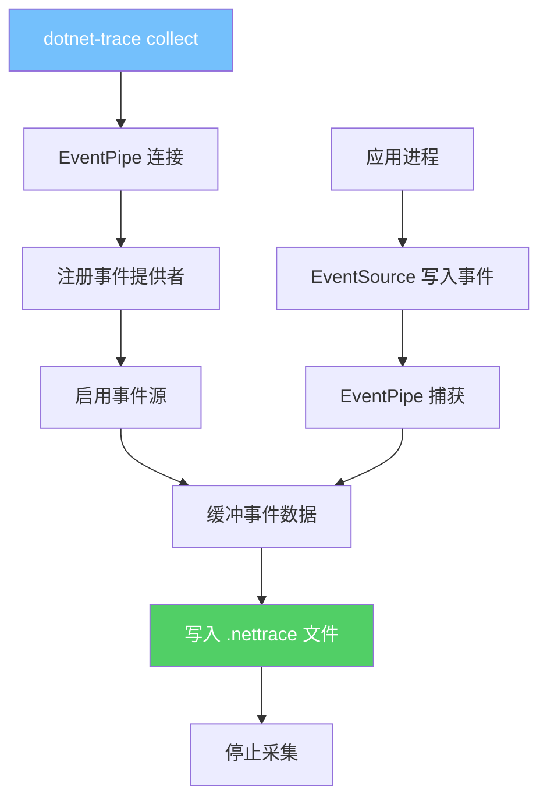
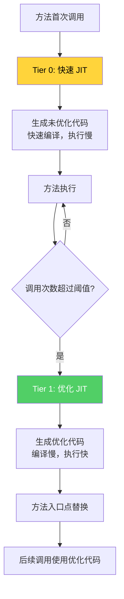
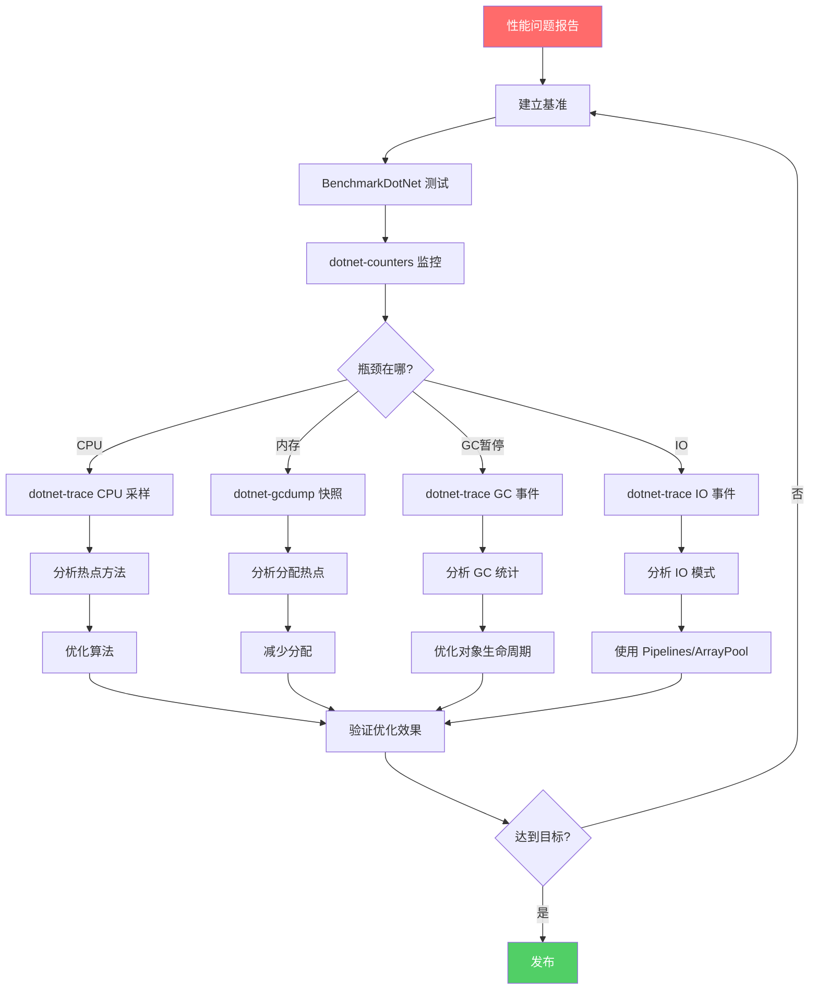
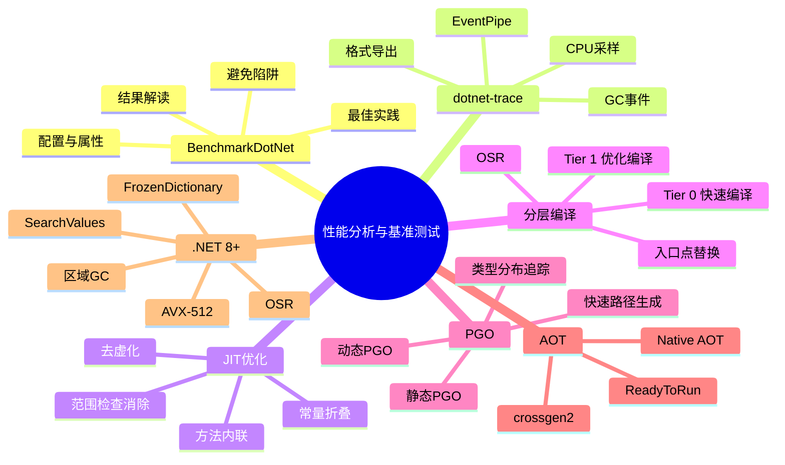

# 性能分析与基准测试

## 概述

性能优化是 .NET 开发中从"能跑"到"跑得好"的关键跨越。本文将系统性地介绍 .NET 性能分析工具链、JIT 编译优化技术、基准测试方法论，以及从 .NET 7 到 .NET 8+ 的性能改进。掌握这些知识，才能科学地发现和解决性能问题，而非依靠直觉猜测。

---

## 一、BenchmarkDotNet 使用

### 1.1 基本配置

```csharp
using BenchmarkDotNet.Attributes;
using BenchmarkDotNet.Running;
using BenchmarkDotNet.Configs;
using BenchmarkDotNet.Jobs;

// 最简单的基准测试
[MemoryDiagnoser]
public class StringConcatBenchmark
{
    [Params(10, 100, 1000)]
    public int Count { get; set; }

    [Benchmark(Baseline = true)]
    public string StringConcat()
    {
        string result = "";
        for (int i = 0; i < Count; i++)
            result += i.ToString();
        return result;
    }

    [Benchmark]
    public string StringBuilder()
    {
        var sb = new StringBuilder();
        for (int i = 0; i < Count; i++)
            sb.Append(i);
        return sb.ToString();
    }
}

// 运行
BenchmarkRunner.Run<StringConcatBenchmark>();
```

### 1.2 高级配置

```csharp
[Config(typeof(CustomConfig))]
[MemoryDiagnoser]
[RankColumn]
public class AdvancedBenchmark
{
    private class CustomConfig : ManualConfig
    {
        public CustomConfig()
        {
            // 运行配置
            AddJob(Job.ShortRun
                .WithWarmupCount(3)
                .WithIterationCount(10)
                .WithRuntime(Runtime.Core80)
                .WithJit(Jit.RyuJit)
                .WithPlatform(Platform.X64));

            // 多个运行时比较
            AddJob(Job.ShortRun.WithRuntime(Runtime.Core70).WithId(".NET 7"));
            AddJob(Job.ShortRun.WithRuntime(Runtime.Core80).WithId(".NET 8"));

            // 列配置
            AddColumn(StatisticColumn.P95);
            AddColumn(StatisticColumn.StdDev);

            // 导出
            AddExporter(HtmlExporter.Default);
            AddExporter(MarkdownExporter.Default);
        }
    }
}
```

### 1.3 常用属性

| 属性 | 说明 |
|------|------|
| `[Benchmark]` | 标记基准测试方法 |
| `[Benchmark(Baseline = true)]` | 设为基线 |
| `[Params]` | 参数化测试 |
| `[ParamsAllValues]` | 枚举的所有值 |
| `[ParamsSource]` | 从属性获取参数 |
| `[GlobalSetup]` | 全局初始化 |
| `[GlobalCleanup]` | 全局清理 |
| `[IterationSetup]` | 每次迭代前执行 |
| `[IterationCleanup]` | 每次迭代后执行 |
| `[MemoryDiagnoser]` | 内存诊断 |
| `[RankColumn]` | 排名列 |
| `[Group]` | 基准测试分组 |

### 1.4 结果解读

```
| Method           | Count | Mean       | Error    | StdDev   | Ratio | Allocated |
|----------------- |------ |-----------:|----------:|----------:|------:|----------:|
| StringConcat     | 10    |   845.2 ns |  16.8 ns |  23.5 ns |  1.00 |   1.02 KB |
| StringBuilder    | 10    |   312.1 ns |   6.2 ns |   8.7 ns |  0.37 |   0.42 KB |
| StringConcat     | 100   | 8,452.3 ns | 168.5 ns | 235.2 ns |  1.00 |  10.15 KB |
| StringBuilder    | 100   | 2,891.5 ns |  57.6 ns |  80.5 ns |  0.34 |   3.96 KB |
```

::: tip 基准测试结果的关键指标
1. **Mean**：平均执行时间，最常用的指标
2. **Error**：均值的标准误差
3. **StdDev**：标准差，反映数据离散程度
4. **Ratio**：相对于基线的比率
5. **Allocated**：分配的内存大小
6. **Gen0/Gen1/Gen2**：各代 GC 的次数

注意：如果 Error/StdDev 相对 Mean 较大，说明测试结果不稳定，需要增加迭代次数或检查干扰因素。
:::

---

## 二、dotnet-trace 采集

### 2.1 dotnet-trace 使用

```bash
# 安装
dotnet tool install --global dotnet-trace

# 基本采集
dotnet-trace collect -p <pid>

# 使用预定义配置
dotnet-trace collect -p <pid> --profile cpu-sampling
dotnet-trace collect -p <pid> --profile gc-verbose
dotnet-trace collect -p <pid> --profile gc-collect
dotnet-trace collect -p <pid> --profile http-collect

# 指定事件提供者
dotnet-trace collect -p <pid> \
    --providers Microsoft-DotNETCore-SampleProfiler,Microsoft-Windows-DotNETRuntime

# 指定时长
dotnet-trace collect -p <pid> --duration 00:01:00

# 指定输出格式
dotnet-trace collect -p <pid> --format speedscope  # 生成 speedscope 格式
dotnet-trace collect -p <pid> --format nettrace    # 默认格式
```

### 2.2 采集流程图



### 2.3 ETW 与 EventPipe

| 特性 | ETW (Windows) | EventPipe (跨平台) |
|------|--------------|-------------------|
| 平台 | Windows only | Windows/Linux/macOS |
| 开销 | 低 | 较低 |
| 事件类型 | 系统+应用 | 应用+运行时 |
| 工具 | PerfView, WPA | dotnet-trace, speedscope |
| 内核事件 | 支持 | 不支持 |

---

## 三、JIT 优化技术

### 3.1 方法内联 (Method Inlining)

```csharp
// 内联前
public int Add(int a, int b) => a + b;

public int Calculate()
{
    return Add(1, 2);  // 调用 Add
}

// JIT 内联后（等效）
public int Calculate()
{
    return 1 + 2;  // 直接计算，无调用开销
}
```

::: important JIT 内联的条件
JIT 会内联满足以下条件的方法：
1. 方法体足够小（通常 < 32 字节 IL）
2. 方法不是虚方法（除非去虚化成功）
3. 方法没有 try/catch 等 EH 子句
4. 调用次数足够多（Tiered Compilation 场景）
5. 方法没有 `MethodImp(MethodImplOptions.NoInlining)` 标记

阻止内联的因素：
- 虚方法调用
- 复杂的控制流
- 大方法
- 循环中的调用（可能）
:::

### 3.2 去虚化 (Devirtualization)

```csharp
// 虚方法调用 - 通常不能内联
interface IProcessor
{
    int Process(int value);
}

class FastProcessor : IProcessor
{
    public int Process(int value) => value * 2;
}

// JIT 去虚化：当 JIT 能确定实际类型时
void Run(IProcessor processor)
{
    // 如果 JIT 能证明 processor 一定是 FastProcessor
    // 可以去虚化并内联 Process 方法
    int result = processor.Process(42);
}

// 例如：
void Run()
{
    IProcessor p = new FastProcessor();  // JIT 知道类型
    Run(p);  // 可以去虚化
}
```

### 3.3 常量折叠 (Constant Folding)

```csharp
// 编译前
int result = 3 * 4 + 5;

// JIT 编译后（常量折叠）
int result = 17;  // 直接计算结果

// 更多例子
const int Factor = 10;
int Calculate(int x) => x * Factor + 5;
// JIT 知道 Factor 是常量，可以优化
```

### 3.4 范围检查消除 (Bounds Check Elimination)

```csharp
// 有范围检查
int Sum(int[] array)
{
    int sum = 0;
    for (int i = 0; i < array.Length; i++)
    {
        sum += array[i];  // JIT 可能消除范围检查
    }
    return sum;
}

// JIT 知道 0 <= i < array.Length（循环条件保证）
// 因此可以消除 array[i] 的范围检查

// 但以下情况不能消除：
int GetAt(int[] array, int index)
{
    return array[index];  // 不知道 index 是否在范围内
}
```

### 3.5 查看 JIT 优化

```bash
# 启用 JIT 日志
set COMPlus_JitDump=*
set COMPlus_JitDisasm=*

# .NET 8+
dotnet env COMPlus_JitDump=* MyAssembly
dotnet env COMPlus_JitDisasm=* MyAssembly
```

---

## 四、Tiered Compilation（分层编译）

### 4.1 分层编译原理



### 4.2 分层编译配置

```json
// runtimeconfig.json
{
  "configProperties": {
    "System.Runtime.TieredCompilation": true,
    "System.Runtime.TieredCompilation.QuickJit": true,
    "System.Runtime.TieredCompilation.QuickJitForLoops": true,
    "System.Runtime.TieredPGO": true
  }
}
```

```csharp
// 在代码中配置
var builder = WebApplication.CreateBuilder(args);
builder.Services.Configure<ConsoleLifetimeOptions>(options =>
{
    // 配置分层编译
});

// 环境变量
// COMPlus_TieredCompilation=1
// COMPlus_TieredPGO=1
```

::: important 分层编译的权衡
1. **启动速度**：Tier 0 快速编译，减少启动时间
2. **稳态性能**：Tier 1 优化编译，提供最好的执行效率
3. **内存开销**：方法可能有两个版本的代码
4. **入口点替换**：Tier 1 编译完成后，替换方法入口点，后续调用使用优化代码
5. **On-Stack Replacement (OSR)**：.NET 8+ 支持在循环执行中替换代码
:::

---

## 五、PGO（Profile-Guided Optimization）

### 5.1 静态 PGO

```bash
# .NET 7+ 支持静态 PGO

# 步骤1: 采集 profile
dotnet-trace collect -p <pid> --providers Microsoft-DotNETCore-SampleProfiler

# 步骤2: 使用 profile 编译
dotnet publish -c Release -p:PublishProfile=pgosave
dotnet publish -c Release -p:PublishProfile=pgouse
```

### 5.2 动态 PGO

```csharp
// .NET 7+ 默认启用动态 PGO
// 基于运行时的方法调用统计进行优化

// 动态 PGO 优化示例：
interface ICalculator
{
    int Compute(int x);
}

class AddCalculator : ICalculator
{
    public int Compute(int x) => x + 1;
}

class MulCalculator : ICalculator
{
    public int Compute(int x) => x * 2;
}

void Process(ICalculator calc)
{
    // 动态 PGO 追踪到 95% 的时间 calc 是 AddCalculator
    // JIT 会为 AddCalculator 生成快速路径（去虚化+内联）
    // 为其他类型生成慢速路径
    int result = calc.Compute(42);
}

// 等效于：
void Process_Optimized(ICalculator calc)
{
    int result;
    if (calc is AddCalculator addCalc)
    {
        result = addCalc.Compute(42);  // 内联：42 + 1
    }
    else
    {
        result = calc.Compute(42);     // 虚调用
    }
}
```

### 5.3 PGO 的性能影响

```csharp
[MemoryDiagnoser]
[ShortRunJob]
public class PgoBenchmark
{
    private readonly ICalculator[] _calculators;

    public PgoBenchmark()
    {
        _calculators = new ICalculator[1000];
        for (int i = 0; i < 950; i++) _calculators[i] = new AddCalculator();
        for (int i = 950; i < 1000; i++) _calculators[i] = new MulCalculator();
    }

    [Benchmark]
    public int ComputeAll()
    {
        int sum = 0;
        foreach (var calc in _calculators)
            sum += calc.Compute(1);
        return sum;
    }
}
```

::: tip 动态 PGO 的要点
1. 默认在 .NET 7+ 中启用（与 Tiered Compilation 配合）
2. 追踪虚调用的实际类型分布
3. 为最常见的类型生成快速路径
4. 对单态调用点（始终是同一类型）效果最好
5. 对多态调用点效果有限
:::

---

## 六、ReadyToRun / crossgen2 AOT

### 6.1 ReadyToRun 编译

```bash
# 发布时生成 ReadyToRun 代码
dotnet publish -c Release -r win-x64 -p:PublishReadyToRun=true

# ReadyToRun 的优势：
# 1. 减少启动时的 JIT 编译时间
# 2. 预编译为本地代码
# 3. 不需要运行时 JIT

# ReadyToRun 的劣势：
# 1. 文件更大
# 2. 不如 JIT 优化（没有 PGO）
# 3. 与特定平台绑定
```

### 6.2 crossgen2

```bash
# crossgen2 - 新一代 AOT 编译器
# .NET 7+ 使用 crossgen2 代替 crossgen

# 生成 ReadyToRun 镜像
dotnet publish -c Release -r win-x64 -p:PublishReadyToRun=true

# crossgen2 特点：
# 1. 用 C# 重写（crossgen 是 C++）
# 2. 更好的优化
# 3. 支持复合 ReadyToRun（多个程序集合并）
# 4. 支持部分 AOT
```

### 6.3 Native AOT (.NET 7+)

```bash
# 完全的 AOT 编译
dotnet publish -c Release -r win-x64 -p:PublishAot=true

# 特点：
# 1. 完全的提前编译
# 2. 没有 JIT，没有 IL
# 3. 极小的部署大小
# 4. 极快的启动时间
# 5. 不支持反射（有限制）
# 6. 不支持动态加载程序集
```

---

## 七、性能分析工作流

### 7.1 完整性能分析工作流



### 7.2 常见性能反模式

```csharp
// 反模式1: 不必要的装箱
ArrayList list = new();
list.Add(42);  // 装箱！
// 修复: 使用泛型集合
List<int> genericList = new();
genericList.Add(42);  // 无装箱

// 反模式2: 字符串拼接
string result = "";
for (int i = 0; i < 1000; i++)
    result += i.ToString();  // 每次创建新字符串
// 修复: 使用 StringBuilder
var sb = new StringBuilder();
for (int i = 0; i < 1000; i++)
    sb.Append(i);

// 反模式3: 不必要的 LINQ
var first = array.Where(x => x > 0).First();
// 修复: 使用循环或 Array.Find
var first = Array.Find(array, x => x > 0);

// 反模式4: 异步中的阻塞
var result = GetDataAsync().Result;  // 可能死锁
// 修复: 使用 await
var result = await GetDataAsync();

// 反模式5: 大对象频繁分配
byte[] buffer = new byte[1024 * 1024];  // 每次请求分配 1MB
// 修复: 使用 ArrayPool
byte[] buffer = ArrayPool<byte>.Shared.Rent(1024 * 1024);
try { /* 使用 */ }
finally { ArrayPool<byte>.Shared.Return(buffer); }
```

---

## 八、.NET 8+ 性能改进摘要

### 8.1 JIT 改进

```csharp
// .NET 8 JIT 改进

// 1. AVX-512 支持
// JIT 现在可以使用 AVX-512 指令集
// 向量化操作更宽（512位 vs 256位）

// 2. 循环优化
// 更好的循环向量化
// 循环强度消减

// 3. 内联改进
// 更多的方法可以被内联
// 包括一些值类型的虚方法

// 4. OSR (On-Stack Replacement)
// 长时间运行的循环中可以从 Tier 0 升级到 Tier 1
while (running)
{
    // 在 .NET 7 中，这个循环可能一直运行 Tier 0
    // 在 .NET 8+ 中，OSR 允许在循环中升级到 Tier 1
    Process();
}
```

### 8.2 GC 改进

```csharp
// .NET 8 GC 改进

// 1. 动态适应应用程序大小
// GC 更好地适应变化的内存需求

// 2. LOH 碎片化改进
// 更好的 LOH 空闲空间管理

// 3. 区域 GC (Regions)
// .NET 8 引入了区域式 GC，替代了传统的段式 GC
// 更好的内存利用率和碎片化控制
```

### 8.3 集合和字符串改进

```csharp
// .NET 8 集合改进

// 1. FrozenDictionary / FrozenSet
// 不可变且针对读取优化的集合
var dict = new Dictionary<string, int> { ["a"] = 1, ["b"] = 2 };
var frozen = dict.ToFrozenDictionary();
// 查找性能比 Dictionary 快 2-3 倍

// 2. SearchValues
// 高性能的搜索集合
var searchValues = SearchValues.Create("aeiou");
bool hasVowel = "hello".AsSpan().ContainsAny(searchValues);

// 3. CompositeFormat
// 预编译格式字符串
var format = CompositeFormat.Parse("Hello, {0}! You have {1} messages.");
string result = string.Format(CultureInfo.InvariantCulture, format, "World", 5);
```

---

## 九、性能基准测试最佳实践

### 9.1 正确的基准测试方法

```csharp
[MemoryDiagnoser]
public class ProperBenchmark
{
    // 1. 使用 [GlobalSetup] 而非构造函数
    private List<int> _data = null!;

    [GlobalSetup]
    public void Setup()
    {
        _data = Enumerable.Range(0, 10000).ToList();
    }

    // 2. 返回值，避免死代码消除
    [Benchmark]
    public int SumWithReturn()
    {
        int sum = 0;
        foreach (int i in _data) sum += i;
        return sum;  // 返回结果，防止 JIT 消除整个方法
    }

    // 3. 不要在 [Benchmark] 中使用 [IterationSetup]
    // IterationSetup 开销会被计入基准测试

    // 4. 避免短方法 - 确保 Method 段足够长
    [Benchmark]
    public int ProcessAll()
    {
        int total = 0;
        for (int i = 0; i < _data.Count; i++)
        {
            total += Process(_data[i]);
        }
        return total;
    }

    [MethodImpl(MethodImplOptions.NoInlining)]
    private int Process(int value) => value * 2;
}
```

### 9.2 避免基准测试陷阱

```csharp
// 陷阱1: 死代码消除
[Benchmark]
public void DeadCode()
{
    int x = 42;  // JIT 可能消除这行
    int y = x * 2;  // 和这行
    // 没有使用 x 和 y 的结果
}

// 修复: 返回结果或使用 Consumer
[Benchmark]
public int NoDeadCode()
{
    int x = 42;
    int y = x * 2;
    return y;
}

// 陷阱2: 短方法被内联后消失
[Benchmark]
public int ShortMethod()
{
    return Add(1, 2);  // 可能被完全内联和常量折叠
}

private int Add(int a, int b) => a + b;

// 陷阱3: 分配在 GC 期间被回收
[Benchmark]
public string AllocateAndUse()
{
    var sb = new StringBuilder();
    sb.Append("test");
    return sb.ToString();  // 必须使用结果
}

// 陷阱4: 不稳定的输入数据
[MemoryDiagnoser]
public class StableBenchmark
{
    // 固定随机种子
    private readonly Random _random = new(42);
    private int[] _data = null!;

    [GlobalSetup]
    public void Setup()
    {
        _data = Enumerable.Range(0, 1000)
            .Select(_ => _random.Next(1000))
            .ToArray();
    }
}
```

---

## 十、实战：完整性能优化案例

### 10.1 案例：字符串处理优化

```csharp
[MemoryDiagnoser]
[ShortRunJob]
public class StringProcessingOptimization
{
    private const string Input = "The quick brown fox jumps over the lazy dog";
    private const int Iterations = 1000;

    // 原始实现
    [Benchmark(Baseline = true)]
    public string Original()
    {
        string result = Input;
        for (int i = 0; i < Iterations; i++)
        {
            result = result.Replace("o", "0")
                          .Replace("e", "3")
                          .Replace("a", "4");
        }
        return result;
    }

    // 使用 StringBuilder
    [Benchmark]
    public string WithStringBuilder()
    {
        var sb = new StringBuilder(Input.Length * 2);
        for (int i = 0; i < Iterations; i++)
        {
            sb.Clear();
            foreach (char c in Input)
            {
                sb.Append(c switch
                {
                    'o' => '0',
                    'e' => '3',
                    'a' => '4',
                    _ => c
                });
            }
        }
        return sb.ToString();
    }

    // 使用 Span + SearchValues (.NET 8)
    [Benchmark]
    public string WithSpanAndSearchValues()
    {
        var searchValues = SearchValues.Create("oea");
        var replacements = new Dictionary<char, char>
        {
            ['o'] = '0', ['e'] = '3', ['a'] = '4'
        };

        var result = new char[Input.Length];
        for (int i = 0; i < Iterations; i++)
        {
            var input = Input.AsSpan();
            for (int j = 0; j < input.Length; j++)
            {
                result[j] = replacements.TryGetValue(input[j], out var replacement)
                    ? replacement
                    : input[j];
            }
        }
        return new string(result);
    }
}
```

### 10.2 案例：集合查找优化

```csharp
[MemoryDiagnoser]
public class LookupOptimization
{
    private readonly Dictionary<string, int> _dict;
    private readonly FrozenDictionary<string, int> _frozen;
    private readonly string[] _keys;

    public LookupOptimization()
    {
        _dict = Enumerable.Range(0, 1000)
            .ToDictionary(i => $"key_{i}", i => i);
        _frozen = _dict.ToFrozenDictionary();
        _keys = _dict.Keys.ToArray();
    }

    [Benchmark(Baseline = true)]
    public int DictionaryLookup()
    {
        int sum = 0;
        foreach (var key in _keys)
            sum += _dict[key];
        return sum;
    }

    [Benchmark]
    public int FrozenDictionaryLookup()
    {
        int sum = 0;
        foreach (var key in _keys)
            sum += _frozen[key];
        return sum;
    }
}
```

---

## 十一、总结



::: important 核心要点
1. `BenchmarkDotNet` 是 .NET 性能基准测试的标准工具，必须掌握配置和结果解读
2. `dotnet-trace` 是跨平台的性能事件采集工具，配合 Visual Studio 或 speedscope 分析
3. JIT 优化包括内联、去虚化、常量折叠、范围检查消除，理解这些才能写出 JIT 友好的代码
4. 分层编译在启动速度和稳态性能之间取得平衡，Tier 0 快速编译，Tier 1 优化编译
5. 动态 PGO 基于运行时类型分布进行去虚化和内联，对单态调用点效果最好
6. ReadyToRun/Native AOT 适合启动时间敏感的场景，但有各自的限制
7. 性能优化的工作流：基准 → 监控 → 分析 → 优化 → 验证
:::

---

## 参考资料

- 《CLR via C#》第4版 - Jeffrey Richter
- [BenchmarkDotNet Documentation](https://benchmarkdotnet.org/)
- [dotnet-trace documentation](https://learn.microsoft.com/en-us/dotnet/core/diagnostics/dotnet-trace)
- [Tiered Compilation](https://learn.microsoft.com/en-us/dotnet/core/whats-new/dotnet-core-3-0#tiered-compilation)
- [Profile-Guided Optimization](https://learn.microsoft.com/en-us/dotnet/core/whats-new/dotnet-7#performance)
- [.NET 8 Performance Improvements](https://devblogs.microsoft.com/dotnet/performance-improvements-in-net-8/)
