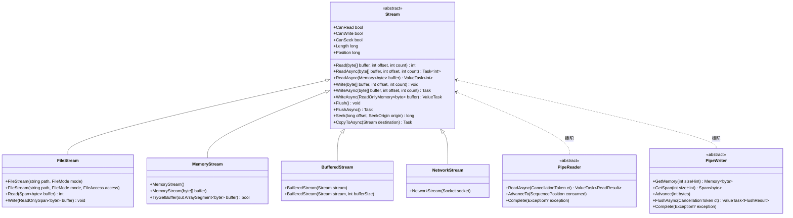
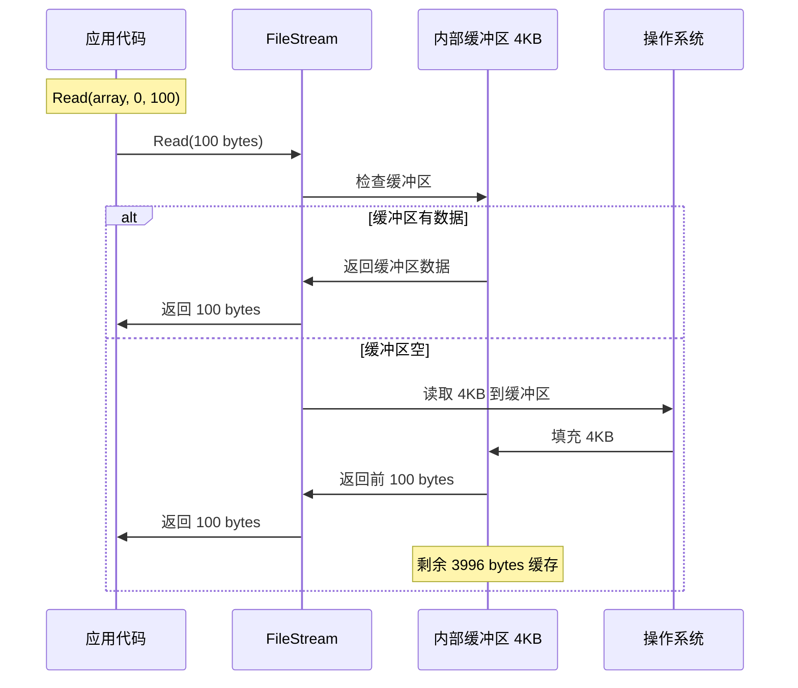
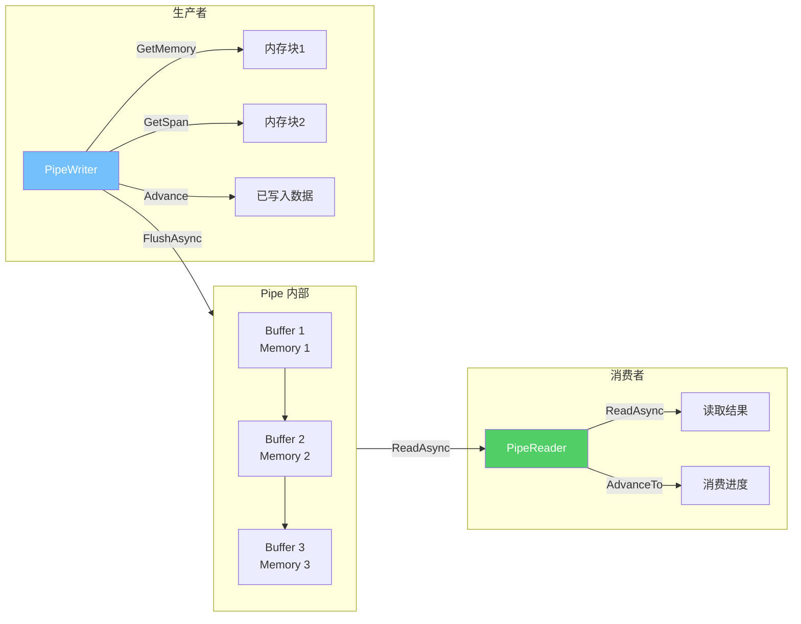
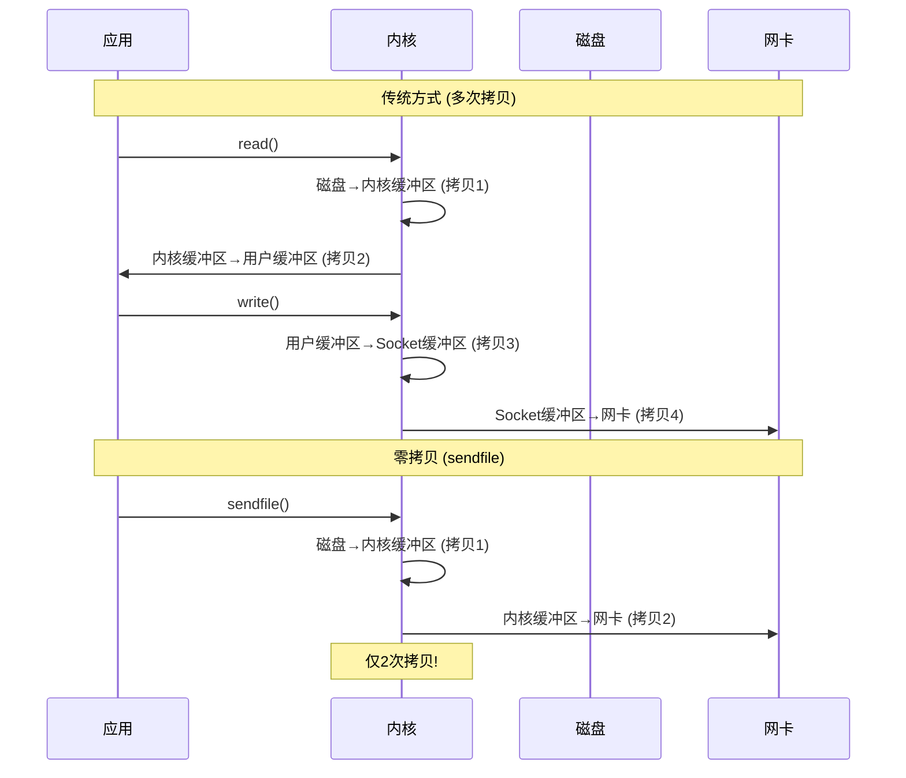
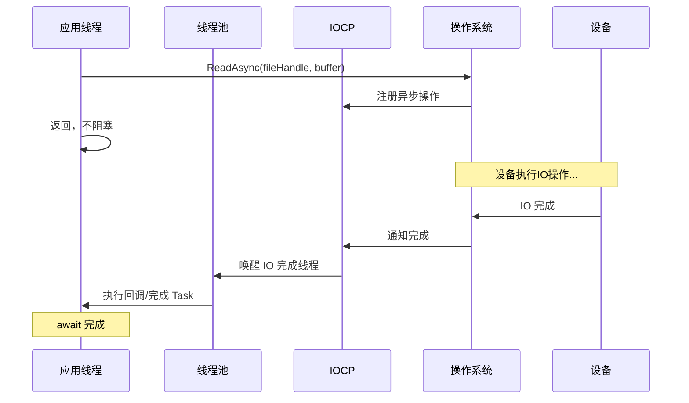
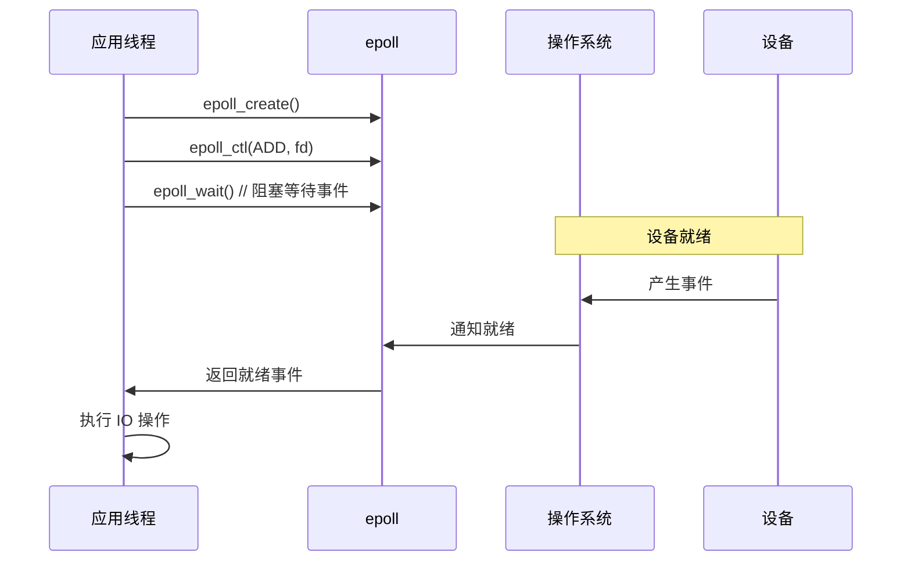
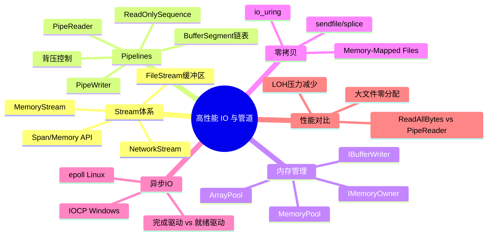

# 高性能 IO 与管道

## 概述

IO 是 .NET 应用最常见的性能瓶颈之一。从传统的 Stream 到现代的 System.IO.Pipelines，.NET 的 IO 栈经历了根本性的架构变革。本文将深入剖析 Stream 继承体系、Pipelines 管道模型、零拷贝技术、异步 IO 原理，帮助开发者选择和正确使用最适合的 IO 模型。

---

## 一、Stream 继承体系

### 1.1 Stream 类层次



### 1.2 FileStream 缓冲区原理

```csharp
// FileStream 内部缓冲区
public class FileStream : Stream
{
    private byte[]? _buffer;      // 内部缓冲区
    private int _bufferPos;       // 读取位置
    private int _bufferLength;    // 有效数据长度
    private const int DefaultBufferSize = 4096;

    // 带缓冲区的读取
    public override int Read(byte[] array, int offset, int count)
    {
        // 1. 先从缓冲区读取
        int bytesFromBuffer = ReadFromBuffer(array, offset, count);

        if (bytesFromBuffer == count)
            return bytesFromBuffer;  // 缓冲区足够

        // 2. 缓冲区不够，从文件填充缓冲区
        FillBuffer();

        // 3. 再次从缓冲区读取
        bytesFromBuffer += ReadFromBuffer(array,
            offset + bytesFromBuffer,
            count - bytesFromBuffer);

        return bytesFromBuffer;
    }
}
```



::: important FileStream 缓冲区的意义
1. **减少系统调用**：每次 OS 调用都有上下文切换的开销
2. **减少磁盘 IO**：磁盘是块设备，按块读取更高效
3. **默认缓冲区大小**：4KB，适合大多数场景
4. **大文件顺序读取**：可以增大缓冲区到 64KB 或更大
5. **随机读取**：缓冲区效果有限，考虑禁用
:::

---

## 二、System.IO.Pipelines 架构

### 2.1 管道模型



### 2.2 Pipe 的核心组件

```csharp
// Pipe 的基本使用
var pipe = new Pipe(new PipeOptions(
    pool: ArrayPool<byte>.Shared,
    readerScheduler: PipeScheduler.ThreadPool,
    writerScheduler: PipeScheduler.ThreadPool,
    pauseWriterThreshold: 65536,    // 写入暂停阈值
    resumeWriterThreshold: 32768,   // 写入恢复阈值
    minimumSegmentSize: 4096,
    useSynchronizationContext: false
));
```

### 2.3 PipeWriter 使用

```csharp
async Task ProduceAsync(PipeWriter writer, Stream source, CancellationToken ct)
{
    while (true)
    {
        // 1. 获取内存块
        Memory<byte> memory = writer.GetMemory(4096);

        try
        {
            // 2. 从源读取数据
            int bytesRead = await source.ReadAsync(memory, ct);
            if (bytesRead == 0)
                break;  // 源已结束

            // 3. 告诉 PipeWriter 写入了多少数据
            writer.Advance(bytesRead);

            // 4. 刷新缓冲区，通知消费者
            FlushResult result = await writer.FlushAsync(ct);

            // 5. 检查消费者是否已完成
            if (result.IsCompleted)
                break;
        }
        catch (Exception ex)
        {
            // 6. 错误时完成管道
            writer.Complete(ex);
            return;
        }
    }

    // 7. 正常完成
    await writer.CompleteAsync();
}
```

### 2.4 PipeReader 使用

```csharp
async Task ConsumeAsync(PipeReader reader, CancellationToken ct)
{
    while (true)
    {
        // 1. 读取数据
        ReadResult result = await reader.ReadAsync(ct);

        // 2. 获取读取的缓冲区
        ReadOnlySequence<byte> buffer = result.Buffer;

        // 3. 处理数据
        SequencePosition consumed = buffer.Start;
        SequencePosition examined = buffer.Start;

        try
        {
            // 按行处理
            while (TryReadLine(ref buffer, out ReadOnlySequence<byte> line))
            {
                ProcessLine(line);
                consumed = buffer.Start;
            }

            examined = buffer.End;

            // 4. 标记已消费的位置
            reader.AdvanceTo(consumed, examined);

            // 5. 检查是否完成
            if (result.IsCompleted)
                break;
        }
        catch (Exception ex)
        {
            reader.Complete(ex);
            return;
        }
    }

    await reader.CompleteAsync();
}

private static bool TryReadLine(
    ref ReadOnlySequence<byte> buffer,
    out ReadOnlySequence<byte> line)
{
    // 查找换行符
    SequencePosition? position = buffer.PositionOf((byte)'\n');

    if (position == null)
    {
        line = default;
        return false;
    }

    // 获取行（不含换行符）
    line = buffer.Slice(0, position.Value);

    // 移动缓冲区到换行符之后
    buffer = buffer.Slice(buffer.GetPosition(1, position.Value));

    return true;
}
```

---

## 三、MemoryOwner 与 IMemoryOwner

### 3.1 IMemoryOwner<T> 接口

```csharp
public interface IMemoryOwner<T> : IDisposable
{
    Memory<T> Memory { get; }
}
```

### 3.2 ArrayPool 的 MemoryOwner

```csharp
// 使用 ArrayPool 的 MemoryOwner
using var owner = ArrayPool<byte>.Shared.RentAsMemoryOwner(1024);
Memory<byte> memory = owner.Memory;

// 使用 memory 进行 IO
int bytesRead = await stream.ReadAsync(memory);

// owner 被 Dispose 时，数组自动归还到 ArrayPool
```

### 3.3 自定义 MemoryOwner

```csharp
public sealed class PooledMemoryOwner<T> : IMemoryOwner<T>
{
    private readonly ArrayPool<T> _pool;
    private readonly int _length;
    private T[]? _array;

    public PooledMemoryOwner(ArrayPool<T> pool, int length)
    {
        _pool = pool;
        _length = length;
        _array = pool.Rent(length);
    }

    public Memory<T> Memory => _array is null
        ? throw new ObjectDisposedException(nameof(PooledMemoryOwner<T>))
        : _array.AsMemory(0, _length);

    public void Dispose()
    {
        if (_array is not null)
        {
            _pool.Return(_array);
            _array = null;
        }
    }
}
```

---

## 四、IBufferWriter<T>

### 4.1 IBufferWriter 接口

```csharp
public interface IBufferWriter<T>
{
    // 获取可写的 Memory
    Memory<T> GetMemory(int sizeHint = 0);

    // 获取可写的 Span
    Span<T> GetSpan(int sizeHint = 0);

    // 告知写入了多少数据
    void Advance(int count);
}
```

### 4.2 PipeWriter 实现了 IBufferWriter

```csharp
// PipeWriter 实现了 IBufferWriter<byte>
PipeWriter writer = pipe.Writer;

// 因此可以与任何接受 IBufferWriter 的 API 配合使用
void WriteData(IBufferWriter<byte> writer)
{
    Span<byte> span = writer.GetSpan(100);
    int bytesWritten = EncodeData(span);
    writer.Advance(bytesWritten);
}
```

### 4.3 ArrayBufferWriter

```csharp
// ArrayBufferWriter - 简单的 IBufferWriter 实现
var bufferWriter = new ArrayBufferWriter<byte>(1024);

Span<byte> span = bufferWriter.GetSpan(100);
int bytesWritten = EncodeData(span);
bufferWriter.Advance(bytesWritten);

// 获取写入的数据
ReadOnlySpan<byte> written = bufferWriter.WrittenSpan;
```

---

## 五、零拷贝技术

### 5.1 零拷贝原理



### 5.2 .NET 中的零拷贝

```csharp
// 1. 使用 TransmitFile（Windows）
// 将文件直接传输到 Socket，无需用户态缓冲区
socket.SendFile(filePath);

// 2. 使用 Memory-Mapped Files
using var mmf = MemoryMappedFile.CreateFromFile("large.dat");
using var accessor = mmf.CreateViewAccessor();
// 直接访问文件内容，无需 Read 调用

// 3. 使用 Pipelines 的零拷贝
// PipeReader 直接在底层缓冲区上提供 ReadOnlySequence
// 不需要将数据复制到用户提供的 byte[] 中
```

### 5.3 Linux 上的 io_uring (.NET 7+)

```csharp
// .NET 7+ 在 Linux 上支持 io_uring
// 通过环境变量启用
// DOTNET_ThreadPool_IOCount=io_uring

// io_uring 的优势：
// 1. 异步 IO 不需要系统调用
// 2. 批量提交 IO 请求
// 3. 零拷贝 IO 操作
// 4. 更低的延迟和更高的吞吐量
```

---

## 六、异步 IO 原理

### 6.1 IOCP (Windows)



### 6.2 epoll (Linux)



### 6.3 IOCP vs epoll 对比

| 特性 | IOCP (Windows) | epoll (Linux) |
|------|---------------|---------------|
| 模型 | 完成端口 | 就绪通知 |
| 通知时机 | IO 完成后 | IO 就绪时 |
| 编程模型 | 完成驱动 | 就绪驱动 |
| 线程模型 | 线程池回调 | 事件循环 |
| 扩展性 | 很好 | 极好 |
| .NET 支持 | 内建 | 内建 |

---

## 七、File.ReadAllBytesAsync vs PipeReader

### 7.1 传统方式

```csharp
// 传统方式 - ReadAllBytesAsync
byte[] data = await File.ReadAllBytesAsync("large.dat");
// 问题：一次性分配整个文件的 byte[]
// 对于大文件，这会导致 LOH 分配和 GC 压力
```

### 7.2 使用 PipeReader

```csharp
// 使用 PipeReader 读取文件
async Task ProcessFileAsync(string path, CancellationToken ct)
{
    await using var file = File.OpenRead(path);
    var reader = PipeReader.Create(file);

    while (true)
    {
        ReadResult result = await reader.ReadAsync(ct);
        ReadOnlySequence<byte> buffer = result.Buffer;

        // 处理缓冲区中的数据
        ProcessBuffer(buffer);

        // 标记所有数据已消费
        reader.AdvanceTo(buffer.End);

        if (result.IsCompleted)
            break;
    }

    await reader.CompleteAsync();
}
```

### 7.3 性能对比

```csharp
[MemoryDiagnoser]
public class FileReadBenchmark
{
    private const string FilePath = "test_1mb.dat";

    [Benchmark(Baseline = true)]
    public async Task<byte[]> ReadAllBytesAsync()
    {
        return await File.ReadAllBytesAsync(FilePath);
    }

    [Benchmark]
    public async Task<int> ReadWithPipeReaderAsync()
    {
        await using var file = File.OpenRead(FilePath);
        var reader = PipeReader.Create(file);
        int totalRead = 0;

        while (true)
        {
            var result = await reader.ReadAsync();
            totalRead += (int)result.Buffer.Length;
            reader.AdvanceTo(result.Buffer.End);

            if (result.IsCompleted)
                break;
        }

        await reader.CompleteAsync();
        return totalRead;
    }

    [Benchmark]
    public async Task<int> ReadWithStreamAsync()
    {
        await using var file = File.OpenRead(FilePath);
        var buffer = ArrayPool<byte>.Shared.Rent(8192);
        try
        {
            int totalRead = 0;
            int bytesRead;
            while ((bytesRead = await file.ReadAsync(buffer)) > 0)
            {
                totalRead += bytesRead;
            }
            return totalRead;
        }
        finally
        {
            ArrayPool<byte>.Shared.Return(buffer);
        }
    }
}
```

| Method | Mean | Gen0 | Allocated |
|--------|------|------|-----------|
| ReadAllBytesAsync | 1.2 ms | - | 1 MB |
| ReadWithPipeReaderAsync | 1.0 ms | - | 2 KB |
| ReadWithStreamAsync | 1.1 ms | - | 4 KB |

---

## 八、Pipe 的内部实现

### 8.1 BufferSegment 链表

```csharp
// Pipe 内部使用 BufferSegment 链表管理内存
internal class BufferSegment
{
    public byte[] Array;          // 底层数组
    public int Start;             // 有效数据起始
    public int End;               // 有效数据结束
    public BufferSegment? Next;   // 下一个段
    public int Length => End - Start;

    public Memory<byte> AvailableMemory =>
        Array.AsMemory(End);

    public Memory<byte> CommitedMemory =>
        Array.AsMemory(Start, Length);
}
```

### 8.2 ReadOnlySequence 结构

```csharp
// ReadOnlySequence<T> - PipeReader 返回的读取结果
public readonly struct ReadOnlySequence<T>
{
    // 起始段
    private readonly SequenceSegment<T>? _startSegment;
    private readonly int _startIndex;

    // 结束段
    private readonly SequenceSegment<T>? _endSegment;
    private readonly int _endIndex;

    // 如果只有一个段，使用快速路径
    private readonly T[]? _singleArray;
    private readonly int _singleLength;

    public long Length { get; }

    // 获取枚举器 - 遍历所有段
    public Enumerator GetEnumerator() => new(this);

    // 切片
    public ReadOnlySequence<T> Slice(long start, long length);

    // 获取第一个段的 Memory
    public Memory<T> FirstMemory => _startSegment?.Memory.Slice(_startIndex) ?? default;
}
```

---

## 九、实战：高性能 HTTP 请求解析

```csharp
/// <summary>
/// 使用 Pipelines 实现高性能 HTTP 请求解析
/// </summary>
public class HttpRequestParser
{
    public async Task ParseAsync(PipeReader reader, CancellationToken ct)
    {
        while (true)
        {
            ReadResult result = await reader.ReadAsync(ct);
            var buffer = result.Buffer;

            // 尝试解析完整的 HTTP 请求
            while (TryParseRequest(ref buffer, out HttpRequest? request))
            {
                ProcessRequest(request);
            }

            // 标记消费进度
            reader.AdvanceTo(buffer.Start, buffer.End);

            if (result.IsCompleted)
                break;
        }

        await reader.CompleteAsync();
    }

    private bool TryParseRequest(
        ref ReadOnlySequence<byte> buffer,
        out HttpRequest? request)
    {
        request = null;

        // 查找请求行结束
        var lineEnd = buffer.PositionOf((byte)'\n');
        if (lineEnd == null)
            return false;

        // 解析请求行: GET /path HTTP/1.1\r\n
        var requestLine = buffer.Slice(0, lineEnd.Value);
        if (!TryParseRequestLine(requestLine, out var method, out var path, out var version))
            return false;

        // 移动到请求行之后
        buffer = buffer.Slice(buffer.GetPosition(1, lineEnd.Value));

        // 解析头部
        var headers = new Dictionary<string, string>();
        while (true)
        {
            lineEnd = buffer.PositionOf((byte)'\n');
            if (lineEnd == null)
                return false;  // 需要更多数据

            var headerLine = buffer.Slice(0, lineEnd.Value);

            // 空行 = 头部结束
            if (headerLine.Length <= 2)
            {
                buffer = buffer.Slice(buffer.GetPosition(1, lineEnd.Value));
                break;
            }

            // 解析头部: Key: Value\r\n
            if (TryParseHeader(headerLine, out var key, out var value))
            {
                headers[key] = value;
            }

            buffer = buffer.Slice(buffer.GetPosition(1, lineEnd.Value));
        }

        request = new HttpRequest(method, path, version, headers);
        return true;
    }

    private bool TryParseRequestLine(
        ReadOnlySequence<byte> line,
        out string method, out string path, out string version)
    {
        method = path = version = "";

        var span = line.IsSingleSegment
            ? line.FirstSpan
            : line.ToArray();  // 回退到数组

        var spaceIndex = span.IndexOf((byte)' ');
        if (spaceIndex < 0) return false;
        method = Encoding.UTF8.GetString(span.Slice(0, spaceIndex));

        var rest = span.Slice(spaceIndex + 1);
        spaceIndex = rest.IndexOf((byte)' ');
        if (spaceIndex < 0) return false;
        path = Encoding.UTF8.GetString(rest.Slice(0, spaceIndex));

        rest = rest.Slice(spaceIndex + 1);
        version = Encoding.UTF8.GetString(rest.TrimEnd((byte)'\r'));

        return true;
    }

    private bool TryParseHeader(
        ReadOnlySequence<byte> line,
        out string key, out string value)
    {
        key = value = "";
        var span = line.IsSingleSegment ? line.FirstSpan : line.ToArray();

        var colonIndex = span.IndexOf((byte)':');
        if (colonIndex < 0) return false;

        key = Encoding.UTF8.GetString(span.Slice(0, colonIndex));
        value = Encoding.UTF8.GetString(span.Slice(colonIndex + 1).Trim((byte)' '));

        return true;
    }
}

public record HttpRequest(
    string Method, string Path, string Version,
    Dictionary<string, string> Headers);
```

---

## 十、总结



::: important 核心要点
1. `FileStream` 使用内部缓冲区减少系统调用，默认 4KB
2. `System.IO.Pipelines` 提供了零分配、自动缓冲区管理的 IO 模型
3. `PipeWriter` 和 `PipeReader` 分离了生产者和消费者，天然支持背压
4. `ReadOnlySequence<T>` 是多段缓冲区的统一视图，避免数据复制
5. `IMemoryOwner<T>` 和 `ArrayPool` 实现了内存的池化复用
6. 零拷贝技术（sendfile/splice/io_uring）减少了内核态和用户态之间的数据复制
7. IOCP（完成驱动）和 epoll（就绪驱动）是 Windows 和 Linux 的异步 IO 基础
8. `PipeReader.Create(file)` 比直接 `ReadAllBytesAsync` 更适合大文件处理
:::

---

## 参考资料

- 《CLR via C#》第4版 - Jeffrey Richter
- [System.IO.Pipelines](https://learn.microsoft.com/en-us/dotnet/standard/io/pipelines)
- [High performance IO with Pipelines](https://devblogs.microsoft.com/dotnet/system-io-pipelines-high-performance-io-in-net/)
- [IO Performance Improvements in .NET 6](https://devblogs.microsoft.com/dotnet/file-io-improvements-in-dotnet-6/)
- [io_uring support in .NET 7](https://devblogs.microsoft.com/dotnet/io_uring/)
