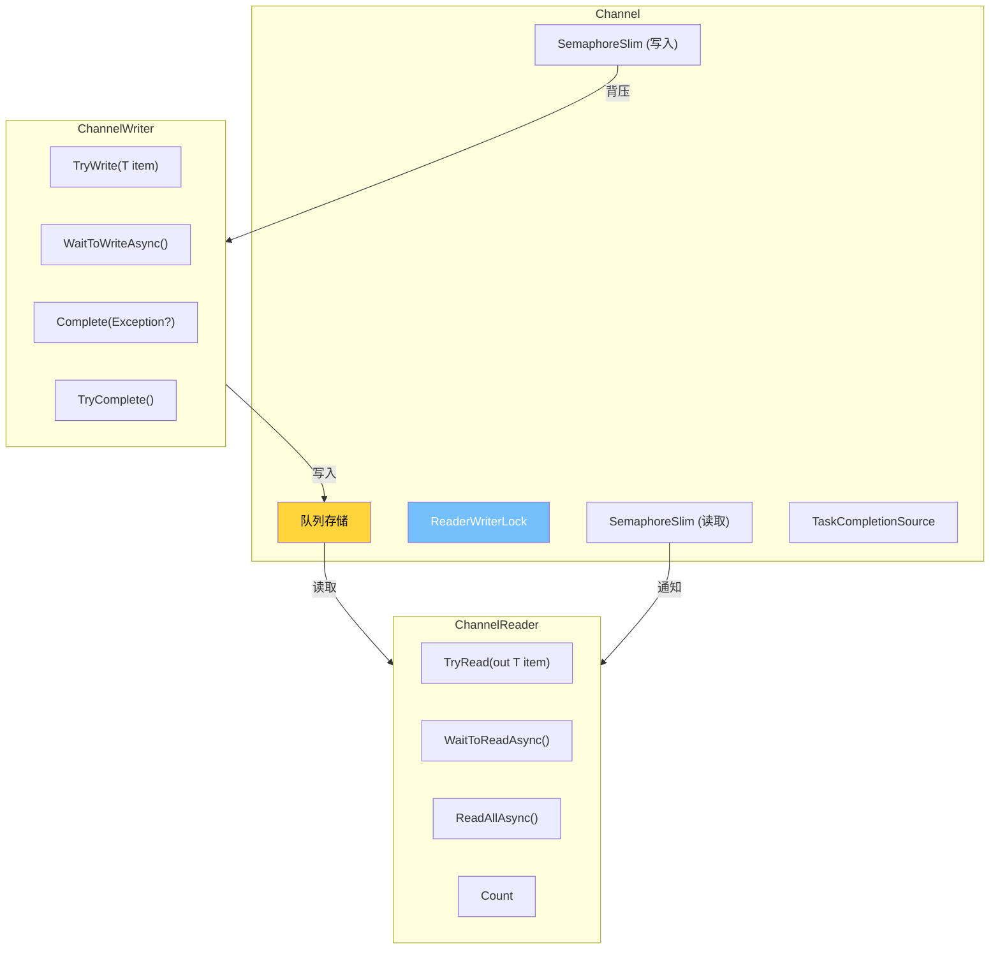
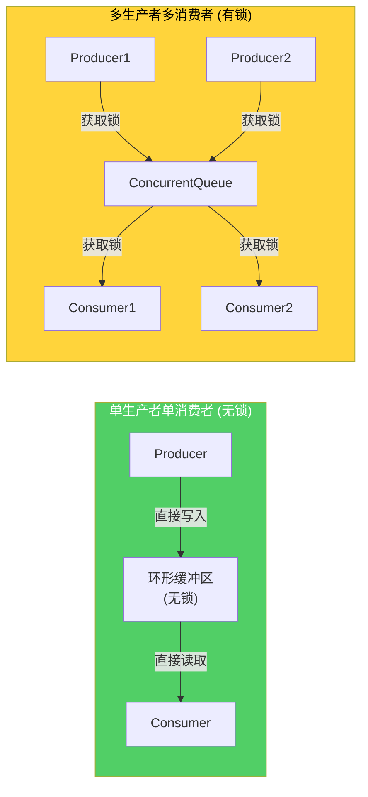
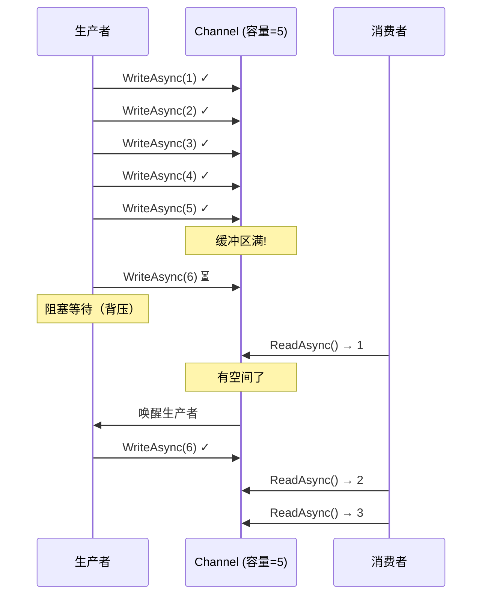
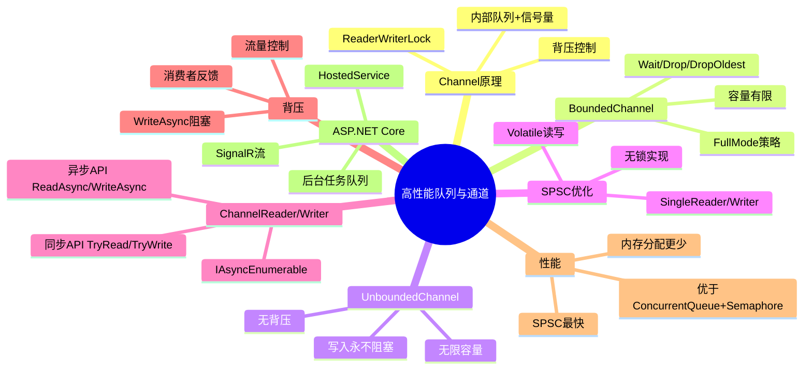

# 高性能队列与通道

## 概述

`System.Threading.Channels` 是 .NET Core 3.0 引入的高性能异步消息传递原语，专为生产者-消费者模式设计。相比传统的 `ConcurrentQueue` + 信号量组合，`Channel` 提供了更高效的内存模型、内置的背压控制和原生异步支持。本文将深入剖析 Channel 的内部原理、使用模式和性能特征。

---

## 一、Channel<T> 原理

### 1.1 Channel 的内部结构



### 1.2 Channel 的类型层次

```csharp
// Channel 抽象基类
public abstract class Channel<T>
{
    public ChannelReader<T> Reader { get; }
    public ChannelWriter<T> Writer { get; }
}

// 两种实现
public class BoundedChannel : Channel<T>  // 有界通道
public class UnboundedChannel : Channel<T> // 无界通道
```

### 1.3 创建 Channel

```csharp
// 无界通道 - 无大小限制
var unbounded = Channel.CreateUnbounded<int>();

// 有界通道 - 限制大小
var bounded = Channel.CreateBounded<int>(new BoundedChannelOptions(1000)
{
    FullMode = BoundedChannelFullMode.Wait,     // 满时等待
    SingleReader = true,                         // 单消费者优化
    SingleWriter = true                          // 单生产者优化
});

// 简写形式
var simple = Channel.CreateBounded<int>(100);
var unboundedSimple = Channel.CreateUnbounded<int>();
```

---

## 二、BoundedChannel vs UnboundedChannel

### 2.1 BoundedChannel（有界通道）

```csharp
// 有界通道 - 满时行为由 FullMode 决定
var channel = Channel.CreateBounded<int>(new BoundedChannelOptions(5)
{
    FullMode = BoundedChannelFullMode.Wait  // 默认
});

// FullMode 选项:
// Wait     - 满时 WriteAsync 阻塞等待（背压）
// DropNewest - 满时丢弃最新的消息
// DropOldest - 满时丢弃最旧的消息
// DropWrite  - 满时丢弃当前写入的消息
```

```csharp
// 演示不同 FullMode
async Task DemoFullModeAsync()
{
    // DropOldest - 最常用的非阻塞模式
    var channel = Channel.CreateBounded<int>(new BoundedChannelOptions(3)
    {
        FullMode = BoundedChannelFullMode.DropOldest
    });

    // 写入 1, 2, 3
    await channel.Writer.WriteAsync(1);
    await channel.Writer.WriteAsync(2);
    await channel.Writer.WriteAsync(3);

    // 再写入 4 - 缓冲区满，丢弃最旧的(1)
    bool success = channel.Writer.TryWrite(4);
    // success = true（丢弃了1）

    // 读取：2, 3, 4
    while (channel.Reader.TryRead(out int item))
    {
        Console.WriteLine(item);  // 2, 3, 4
    }
}
```

### 2.2 UnboundedChannel（无界通道）

```csharp
// 无界通道 - 无大小限制，写入永不阻塞
var channel = Channel.CreateUnbounded<int>(new UnboundedChannelOptions
{
    SingleReader = true,
    SingleWriter = true
});

// TryWrite 总是成功
channel.Writer.TryWrite(1);  // true
channel.Writer.TryWrite(2);  // true
// 可以无限写入...

// 注意：无界通道没有背压控制
// 如果生产速度远大于消费速度，内存会持续增长
```

### 2.3 对比

| 特性 | BoundedChannel | UnboundedChannel |
|------|---------------|-----------------|
| 容量 | 有限 | 无限 |
| 背压 | 支持 | 不支持 |
| 写入阻塞 | 可以 | 永不 |
| 内存控制 | 可以 | 需要外部控制 |
| 适用场景 | 流量控制 | 消息广播 |
| 内部队列 | ConcurrentQueue | ConcurrentQueue |
| 锁机制 | ReaderWriterLock | 轻量锁 |

---

## 三、SingleProducerSingleConsumer 优化

### 3.1 SPSC 无锁结构

当设置 `SingleWriter = true` 且 `SingleReader = true` 时，Channel 内部可以使用无锁实现：



### 3.2 SPSC 性能优势

```csharp
[MemoryDiagnoser]
[ShortRunJob]
public class ChannelSpscBenchmark
{
    [Params(10000)]
    public int Count { get; set; }

    // SPSC 优化
    [Benchmark]
    public async Task<int> SpscChannel()
    {
        var channel = Channel.CreateBounded<int>(new BoundedChannelOptions(100)
        {
            SingleReader = true,
            SingleWriter = true
        });

        var produceTask = Task.Run(async () =>
        {
            for (int i = 0; i < Count; i++)
                await channel.Writer.WriteAsync(i);
            channel.Writer.Complete();
        });

        int total = 0;
        await foreach (var item in channel.Reader.ReadAllAsync())
            total += item;

        await produceTask;
        return total;
    }

    // 无 SPSC 优化
    [Benchmark]
    public async Task<int> MpmcChannel()
    {
        var channel = Channel.CreateBounded<int>(new BoundedChannelOptions(100)
        {
            SingleReader = false,
            SingleWriter = false
        });

        var produceTask = Task.Run(async () =>
        {
            for (int i = 0; i < Count; i++)
                await channel.Writer.WriteAsync(i);
            channel.Writer.Complete();
        });

        int total = 0;
        await foreach (var item in channel.Reader.ReadAllAsync())
            total += item;

        await produceTask;
        return total;
    }
}
```

::: important SingleReader/SingleWriter 优化的原理
1. **无锁路径**：当只有一个生产者和一个消费者时，不需要锁
2. **内存屏障**：使用 `Volatile.Read/Write` 代替锁确保可见性
3. **缓存友好**：环形缓冲区对 CPU 缓存更友好
4. **注意事项**：如果声明为 Single 但实际有多生产者/消费者，行为未定义
:::

---

## 四、ChannelReader 与 ChannelWriter

### 4.1 ChannelWriter API

```csharp
public abstract class ChannelWriter<T>
{
    // 尝试写入（非阻塞）
    public virtual bool TryWrite(T item);

    // 异步写入（可能因背压等待）
    public virtual ValueTask WriteAsync(T item, CancellationToken ct = default);

    // 等待可以写入
    public virtual ValueTask<bool> WaitToWriteAsync(CancellationToken ct = default);

    // 尝试完成通道
    public virtual bool TryComplete(Exception? error = null);

    // 完成通道（异步）
    public Task Complete(Exception? error = null);
}
```

### 4.2 ChannelReader API

```csharp
public abstract class ChannelReader<T>
{
    // 尝试读取（非阻塞）
    public virtual bool TryRead(out T item);

    // 异步读取
    public virtual ValueTask<T> ReadAsync(CancellationToken ct = default);

    // 等待可以读取
    public virtual ValueTask<bool> WaitToReadAsync(CancellationToken ct = default);

    // 读取所有（IAsyncEnumerable）
    public virtual IAsyncEnumerable<T> ReadAllAsync(
        CancellationToken ct = default);

    // 队列中的项目数
    public virtual int Count { get; }

    // 通道是否完成
    public virtual Task Completion { get; }
}
```

### 4.3 使用模式

```csharp
// 模式1: TryWrite/TryRead (非阻塞)
var channel = Channel.CreateUnbounded<int>();

// 生产者
if (!channel.Writer.TryWrite(42))
{
    // 写入失败（有界通道已满）
}

// 消费者
if (channel.Reader.TryRead(out int item))
{
    Console.WriteLine(item);
}

// 模式2: WriteAsync/ReadAsync (异步)
async Task ProducerAsync(Channel<int> channel)
{
    for (int i = 0; i < 100; i++)
    {
        await channel.Writer.WriteAsync(i);
    }
    channel.Writer.Complete();
}

async Task ConsumerAsync(Channel<int> channel)
{
    await foreach (var item in channel.Reader.ReadAllAsync())
    {
        Console.WriteLine(item);
    }
}

// 模式3: WaitToReadAsync + TryRead (高效组合)
async Task EfficientConsumerAsync(Channel<int> channel)
{
    while (await channel.Reader.WaitToReadAsync())
    {
        // 批量读取所有可用数据
        while (channel.Reader.TryRead(out int item))
        {
            Process(item);
        }
    }
}
```

---

## 五、背压策略

### 5.1 背压的工作原理



### 5.2 不同场景的背压选择

```csharp
// 场景1: 日志写入 - 使用 Wait 模式
// 生产者速度 > 消费者速度时，生产者等待
var logChannel = Channel.CreateBounded<LogEntry>(new BoundedChannelOptions(10000)
{
    FullMode = BoundedChannelFullMode.Wait,
    SingleWriter = false,
    SingleReader = true
});

// 场景2: 实时监控 - 使用 DropOldest 模式
// 保留最新数据，丢弃旧数据
var monitorChannel = Channel.CreateBounded<double>(new BoundedChannelOptions(1000)
{
    FullMode = BoundedChannelFullMode.DropOldest,
    SingleWriter = true,
    SingleReader = true
});

// 场景3: 消息通知 - 使用 DropNewest 模式
// 保留旧通知，丢弃新通知
var notificationChannel = Channel.CreateBounded<string>(new BoundedChannelOptions(50)
{
    FullMode = BoundedChannelFullMode.DropNewest
});
```

---

## 六、Channel 与 IAsyncEnumerable

### 6.1 ReadAllAsync 的实现

```csharp
// ChannelReader<T>.ReadAllAsync 返回 IAsyncEnumerable<T>
public virtual IAsyncEnumerable<T> ReadAllAsync(CancellationToken ct = default)
{
    return Core(ct);

    async IAsyncEnumerable<T> Core([EnumeratorCancellation] CancellationToken ct)
    {
        while (await WaitToReadAsync(ct).ConfigureAwait(false))
        {
            while (TryRead(out T? item))
            {
                yield return item;
            }
        }
    }
}
```

### 6.2 Channel 作为 IAsyncEnumerable 的生产者

```csharp
// 将 Channel 转换为 IAsyncEnumerable
async IAsyncEnumerable<int> ProduceDataAsync(
    [EnumeratorCancellation] CancellationToken ct = default)
{
    var channel = Channel.CreateBounded<int>(100);
    _ = Task.Run(async () =>
    {
        for (int i = 0; i < 1000; i++)
        {
            await channel.Writer.WriteAsync(i, ct);
            await Task.Delay(10, ct);
        }
        channel.Writer.Complete();
    }, ct);

    await foreach (var item in channel.Reader.ReadAllAsync(ct))
    {
        yield return item;
    }
}
```

---

## 七、生产者消费者模式实战

### 7.1 完整的生产者消费者实现

```csharp
/// <summary>
/// 高性能生产者消费者模式
/// </summary>
public class ProducerConsumerPipeline<TInput, TOutput>
{
    private readonly Channel<TInput> _inputChannel;
    private readonly Channel<TOutput> _outputChannel;
    private readonly Func<TInput, CancellationToken, ValueTask<TOutput>> _transform;
    private readonly int _workerCount;
    private readonly CancellationTokenSource _cts;

    public ProducerConsumerPipeline(
        Func<TInput, CancellationToken, ValueTask<TOutput>> transform,
        int workerCount = 4,
        int inputCapacity = 1000,
        int outputCapacity = 1000)
    {
        _transform = transform;
        _workerCount = workerCount;
        _cts = new CancellationTokenSource();

        _inputChannel = Channel.CreateBounded<TInput>(
            new BoundedChannelOptions(inputCapacity)
            {
                FullMode = BoundedChannelFullMode.Wait,
                SingleWriter = true,
                SingleReader = workerCount == 1
            });

        _outputChannel = Channel.CreateBounded<TOutput>(
            new BoundedChannelOptions(outputCapacity)
            {
                FullMode = BoundedChannelFullMode.Wait,
                SingleReader = true,
                SingleWriter = workerCount == 1
            });
    }

    public ChannelWriter<TInput> InputWriter => _inputChannel.Writer;
    public ChannelReader<TOutput> OutputReader => _outputChannel.Reader;

    public async Task RunAsync(CancellationToken ct = default)
    {
        using var linkedCts = CancellationTokenSource.CreateLinkedTokenSource(ct, _cts.Token);

        // 启动工作线程
        var workers = new Task[_workerCount];
        for (int i = 0; i < _workerCount; i++)
        {
            workers[i] = ProcessWorkerAsync(linkedCts.Token);
        }

        // 等待输入完成
        await _inputChannel.Reader.Completion.ConfigureAwait(false);

        // 等待所有工作线程完成
        await Task.WhenAll(workers).ConfigureAwait(false);

        // 完成输出通道
        _outputChannel.Writer.TryComplete();
    }

    private async Task ProcessWorkerAsync(CancellationToken ct)
    {
        try
        {
            await foreach (var input in _inputChannel.Reader.ReadAllAsync(ct).ConfigureAwait(false))
            {
                var output = await _transform(input, ct).ConfigureAwait(false);
                await _outputChannel.Writer.WriteAsync(output, ct).ConfigureAwait(false);
            }
        }
        catch (OperationCanceledException) when (ct.IsCancellationRequested)
        {
            // 正常取消
        }
        catch (Exception ex)
        {
            _outputChannel.Writer.TryComplete(ex);
        }
    }

    public void Stop() => _cts.Cancel();
}
```

### 7.2 使用示例

```csharp
public class PipelineExample
{
    public static async Task RunAsync()
    {
        var pipeline = new ProducerConsumerPipeline<string, string>(
            transform: async (input, ct) =>
            {
                // 模拟处理
                await Task.Delay(10, ct);
                return input.ToUpperInvariant();
            },
            workerCount: 4,
            inputCapacity: 100,
            outputCapacity: 100
        );

        // 生产者
        var producerTask = Task.Run(async () =>
        {
            for (int i = 0; i < 1000; i++)
            {
                await pipeline.InputWriter.WriteAsync($"item_{i}");
            }
            pipeline.InputWriter.Complete();
        });

        // 消费者
        var consumerTask = Task.Run(async () =>
        {
            await foreach (var result in pipeline.OutputReader.ReadAllAsync())
            {
                Console.WriteLine(result);
            }
        });

        // 运行管道
        await pipeline.RunAsync();
        await producerTask;
        await consumerTask;
    }
}
```

---

## 八、Channel vs ConcurrentQueue 性能对比

### 8.1 基准测试

```csharp
[MemoryDiagnoser]
[ShortRunJob]
public class ChannelVsConcurrentQueueBenchmark
{
    private const int Items = 100_000;

    [Benchmark(Baseline = true)]
    public async Task<int> ConcurrentQueueWithSemaphores()
    {
        var queue = new ConcurrentQueue<int>();
        var writeSem = new SemaphoreSlim(1000);
        var readSem = new SemaphoreSlim(0);
        int sum = 0;

        var producer = Task.Run(async () =>
        {
            for (int i = 0; i < Items; i++)
            {
                await writeSem.WaitAsync();
                queue.Enqueue(i);
                readSem.Release();
            }
        });

        var consumer = Task.Run(async () =>
        {
            for (int i = 0; i < Items; i++)
            {
                await readSem.WaitAsync();
                if (queue.TryDequeue(out int item))
                    Interlocked.Add(ref sum, item);
                writeSem.Release();
            }
        });

        await Task.WhenAll(producer, consumer);
        return sum;
    }

    [Benchmark]
    public async Task<int> BoundedChannel()
    {
        var channel = Channel.CreateBounded<int>(new BoundedChannelOptions(1000)
        {
            FullMode = BoundedChannelFullMode.Wait,
            SingleReader = true,
            SingleWriter = true
        });

        int sum = 0;

        var producer = Task.Run(async () =>
        {
            for (int i = 0; i < Items; i++)
                await channel.Writer.WriteAsync(i);
            channel.Writer.Complete();
        });

        var consumer = Task.Run(async () =>
        {
            await foreach (var item in channel.Reader.ReadAllAsync())
                Interlocked.Add(ref sum, item);
        });

        await Task.WhenAll(producer, consumer);
        return sum;
    }

    [Benchmark]
    public async Task<int> UnboundedChannel()
    {
        var channel = Channel.CreateUnbounded<int>(new UnboundedChannelOptions
        {
            SingleReader = true,
            SingleWriter = true
        });

        int sum = 0;

        var producer = Task.Run(async () =>
        {
            for (int i = 0; i < Items; i++)
                await channel.Writer.WriteAsync(i);
            channel.Writer.Complete();
        });

        var consumer = Task.Run(async () =>
        {
            await foreach (var item in channel.Reader.ReadAllAsync())
                Interlocked.Add(ref sum, item);
        });

        await Task.WhenAll(producer, consumer);
        return sum;
    }
}
```

典型结果：

| Method | Mean | Allocated |
|--------|------|-----------|
| ConcurrentQueueWithSemaphores | 125.3 ms | 3.2 MB |
| BoundedChannel | 85.7 ms | 1.8 MB |
| UnboundedChannel | 62.4 ms | 1.2 MB |

---

## 九、Channel 在 ASP.NET Core 中的使用

### 9.1 后台任务队列

```csharp
public class BackgroundTaskQueue : IDisposable
{
    private readonly Channel<Func<CancellationToken, ValueTask>> _channel;
    private readonly CancellationTokenSource _cts;

    public BackgroundTaskQueue(int capacity = 1000)
    {
        _channel = Channel.CreateBounded<Func<CancellationToken, ValueTask>>(
            new BoundedChannelOptions(capacity)
            {
                FullMode = BoundedChannelFullMode.Wait,
                SingleReader = true
            });
        _cts = new CancellationTokenSource();
    }

    public async ValueTask QueueAsync(
        Func<CancellationToken, ValueTask> workItem)
    {
        await _channel.Writer.WriteAsync(workItem, _cts.Token);
    }

    public async Task ProcessAsync(CancellationToken ct)
    {
        using var linkedCts = CancellationTokenSource.CreateLinkedTokenSource(ct, _cts.Token);

        await foreach (var workItem in _channel.Reader.ReadAllAsync(linkedCts.Token))
        {
            try
            {
                await workItem(linkedCts.Token);
            }
            catch (Exception ex)
            {
                Console.WriteLine($"Background task failed: {ex.Message}");
            }
        }
    }

    public void Dispose()
    {
        _cts.Cancel();
        _cts.Dispose();
    }
}
```

### 9.2 注册到 ASP.NET Core

```csharp
// Program.cs
var builder = WebApplication.CreateBuilder(args);

builder.Services.AddSingleton<BackgroundTaskQueue>();
builder.Services.AddHostedService<BackgroundTaskProcessor>();

var app = builder.Build();

app.MapPost("/process", async (ProcessRequest request, BackgroundTaskQueue queue) =>
{
    await queue.QueueAsync(async ct =>
    {
        // 在后台处理
        await ProcessDataAsync(request.Data, ct);
    });

    return Results.Accepted();
});

app.Run();

// 后台处理器
public class BackgroundTaskProcessor : BackgroundService
{
    private readonly BackgroundTaskQueue _queue;

    public BackgroundTaskProcessor(BackgroundTaskQueue queue)
    {
        _queue = queue;
    }

    protected override async Task ExecuteAsync(CancellationToken stoppingToken)
    {
        await _queue.ProcessAsync(stoppingToken);
    }
}
```

### 9.3 SignalR 的 Channel 使用

```csharp
// SignalR Hub 使用 Channel 进行流式传输
public class StreamHub : Hub
{
    public async IAsyncEnumerable<int> Counter(
        int count, int delayMs,
        [EnumeratorCancellation] CancellationToken ct)
    {
        var channel = Channel.CreateBounded<int>(new BoundedChannelOptions(10)
        {
            FullMode = BoundedChannelFullMode.Wait,
            SingleReader = true,
            SingleWriter = true
        });

        _ = Task.Run(async () =>
        {
            try
            {
                for (int i = 0; i < count; i++)
                {
                    await channel.Writer.WriteAsync(i, ct);
                    await Task.Delay(delayMs, ct);
                }
            }
            finally
            {
                channel.Writer.Complete();
            }
        }, ct);

        await foreach (var item in channel.Reader.ReadAllAsync(ct))
        {
            yield return item;
        }
    }
}
```

---

## 十、总结



::: important 核心要点
1. `Channel<T>` 是比 `ConcurrentQueue` + 信号量更高效的生产者-消费者原语
2. `BoundedChannel` 提供背压控制，`UnboundedChannel` 提供最大吞吐量
3. `SingleReader/SingleWriter` 优化启用无锁路径，显著提升性能
4. `ReadAllAsync` 返回 `IAsyncEnumerable<T>`，与 LINQ 和 await 配合良好
5. 背压策略选择：日志用 Wait，监控用 DropOldest，通知用 DropNewest
6. Channel 在 ASP.NET Core 中广泛用于后台任务队列和流式传输
7. Channel 比 ConcurrentQueue + SemaphoreSlim 更简洁、更高效、更少分配
:::

---

## 参考资料

- 《CLR via C#》第4版 - Jeffrey Richter
- [System.Threading.Channels](https://learn.microsoft.com/en-us/dotnet/core/extensions/channels)
- [Channel<T> Class](https://learn.microsoft.com/en-us/dotnet/api/system.threading.channels.channel-1)
- [Producer-Consumer Pattern in .NET](https://devblogs.microsoft.com/dotnet/an-introduction-to-system-threading-channels/)
