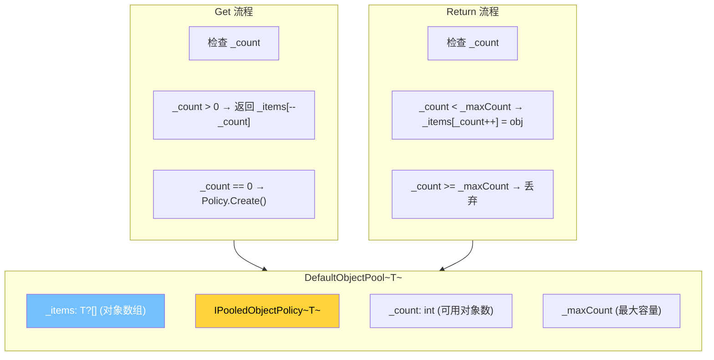
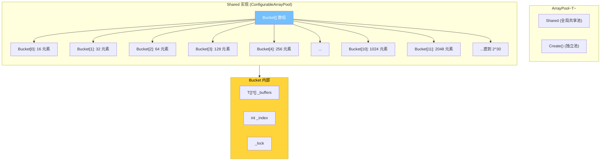
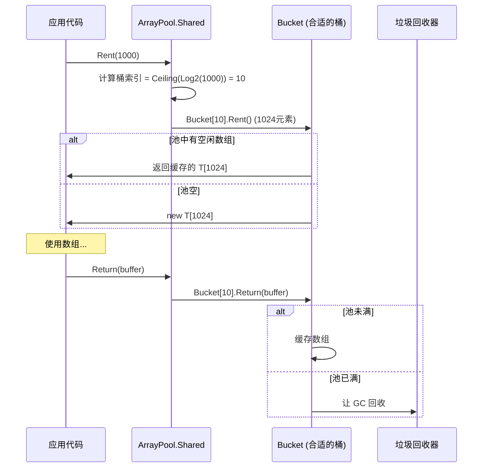
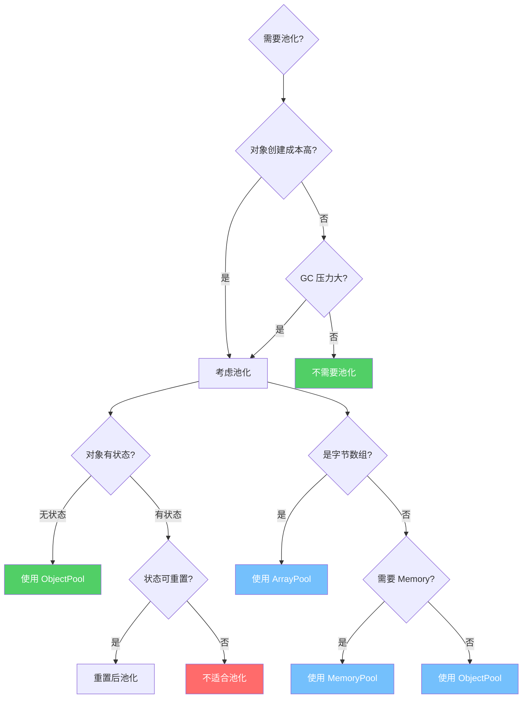
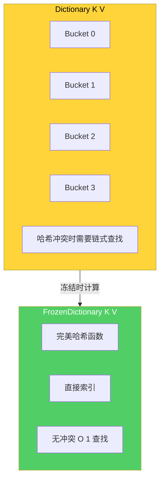
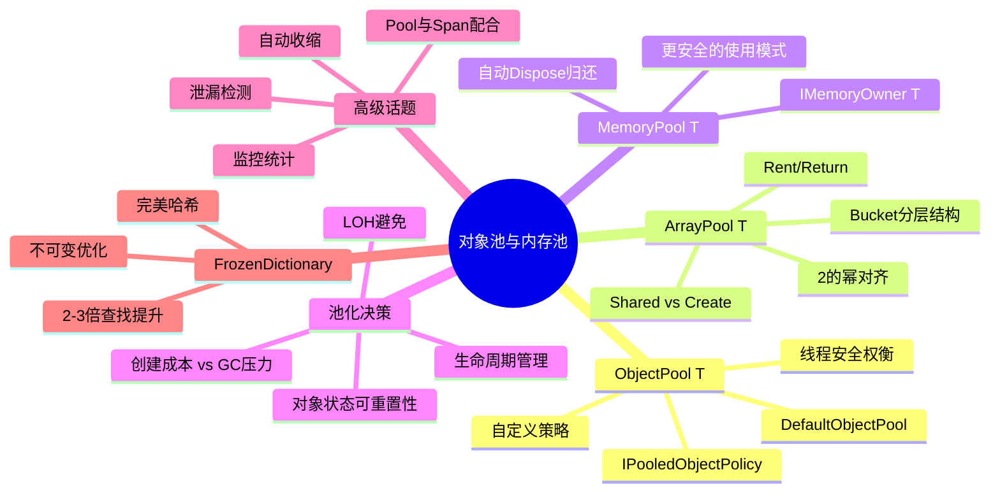

# 对象池与内存池

## 概述

在高性能 .NET 应用中，频繁的对象创建和回收是 GC 压力的主要来源。对象池和内存池通过复用对象来消除不必要的分配，是减少 GC 压力的核心技术。本文将深入剖析 `ObjectPool&lt;T&gt;`、`ArrayPool&lt;T&gt;`、`MemoryPool&lt;T&gt;` 的内部实现，以及生产级对象池的设计与实现。

---

## 一、ObjectPool&lt;T&gt; 原理

### 1.1 DefaultObjectPool 内部结构



### 1.2 DefaultObjectPool 源码分析

```csharp
// .NET Runtime 源码简化版
public class DefaultObjectPool<T> : ObjectPool<T> where T : class
{
    private readonly T?[] _items;
    private readonly IPooledObjectPolicy<T> _policy;
    private readonly int _maxCount;
    private int _count;

    public DefaultObjectPool(IPooledObjectPolicy<T> policy, int maximumRetained)
    {
        _policy = policy;
        _maxCount = maximumRetained;
        _items = new T[maximumRetained];

        // 预创建一个对象
        _items[0] = policy.Create();
        _count = 1;
    }

    public override T Get()
    {
        // 快速路径：从池中获取
        if (_count > 0)
        {
            _count--;
            T? item = _items[_count];
            _items[_count] = null;  // 防止持有引用
            return item!;
        }

        // 慢速路径：创建新对象
        return _policy.Create();
    }

    public override void Return(T obj)
    {
        // 检查对象是否可以被归还
        if (_policy.Return(obj) && _count < _maxCount)
        {
            _items[_count] = obj;
            _count++;
        }
        // 否则丢弃，让 GC 回收
    }
}
```

::: important DefaultObjectPool 的线程安全
1. `Get()` 和 `Return()` 没有使用锁——这是一个有意的权衡
2. 可能存在竞态条件，导致同一对象被多个线程获取
3. 在实践中，这种竞态的影响很小（只是多创建了一个对象）
4. 如果需要严格的线程安全，可以使用 `ConcurrentBag&lt;T&gt;` 实现
5. ASP.NET Core 的 `DefaultObjectPool` 选择性能而非严格安全
:::

### 1.3 IPooledObjectPolicy

```csharp
public interface IPooledObjectPolicy<T>
{
    // 创建新对象
    T Create();

    // 对象归还时调用，返回是否接受
    bool Return(T obj);
}

// 内置策略：DefaultPooledObjectPolicy
public class DefaultPooledObjectPolicy<T> : IPooledObjectPolicy<T>
    where T : class, new()
{
    public T Create() => new();

    public bool Return(T obj) => true;  // 总是接受
}
```

---

## 二、ArrayPool&lt;T&gt; 原理

### 2.1 ArrayPool 的分层结构



### 2.2 Bucket 的内部实现

```csharp
// .NET Runtime 源码简化版
internal sealed class Bucket
{
    private readonly T[]?[] _buffers;    // 缓冲区数组
    private readonly int _bufferLength;    // 每个缓冲区的长度
    private readonly int _poolCapacity;   // 池容量
    private int _index;                   // 当前可用索引

    public Bucket(int bufferLength, int poolCapacity)
    {
        _bufferLength = bufferLength;
        _poolCapacity = poolCapacity;
        _buffers = new T[poolCapacity][];
        _index = 0;
    }

    public T[] Rent()
    {
        // 从池中获取
        if (_index > 0)
        {
            _index--;
            T[]? buffer = _buffers[_index];
            _buffers[_index] = null;
            return buffer!;
        }

        // 池空，创建新的
        return new T[_bufferLength];
    }

    public void Return(T[] buffer)
    {
        // 检查长度是否匹配
        if (buffer.Length != _bufferLength)
            return;  // 丢弃不匹配的

        // 归还到池
        if (_index < _poolCapacity)
        {
            _buffers[_index] = buffer;
            _index++;
        }
        // 池满，丢弃（让 GC 回收）
    }
}
```

### 2.3 Rent/Return 工作流



### 2.4 ArrayPool 使用示例

```csharp
// 基本使用
var pool = ArrayPool<byte>.Shared;

// 租用
byte[] buffer = pool.Rent(1024);
// 注意：Rent 返回的数组可能比请求的大
// buffer.Length 可能是 1024 或更大（向上取整到 2 的幂）

try
{
    // 使用 buffer（只使用需要的大小）
    int bytesRead = await stream.ReadAsync(buffer.AsMemory(0, 1024));
    Process(buffer.AsSpan(0, bytesRead));
}
finally
{
    // 归还
    pool.Return(buffer);

    // 如果数组被修改了，可以清除
    pool.Return(buffer, clearArray: true);
}

// 创建独立池
var customPool = ArrayPool<int>.Create(
    maxArrayLength: 1024,   // 最大数组长度
    maxArraysPerBucket: 50  // 每个桶的最大数组数
);
```

::: warning ArrayPool 的注意事项
1. **Rent 返回的数组可能更大**：总是向上取整到 2 的幂，使用 `AsMemory(0, neededLength)` 限制大小
2. **必须 Return**：忘记归还会导致池耗尽和内存泄漏
3. **不要持有引用**：Return 后不要再访问数组
4. **线程安全**：`ArrayPool.Shared` 是线程安全的
5. **池大小有限**：满了之后多余的对象会被 GC 回收
:::

---

## 三、MemoryPool&lt;T&gt;

### 3.1 MemoryPool 接口

```csharp
public abstract class MemoryPool<T> : IDisposable
{
    public abstract IMemoryOwner<T> Rent(int minimumBufferSize = -1);
    public abstract int MaxBufferSize { get; }
    public static MemoryPool<T> Shared { get; }
}
```

### 3.2 MemoryPool vs ArrayPool

| 特性 | ArrayPool&lt;T&gt; | MemoryPool&lt;T&gt; |
|------|-------------|---------------|
| 返回类型 | T[] | IMemoryOwner&lt;T&gt; |
| 生命周期管理 | 手动 Return | Dispose 归还 |
| Span 支持 | 需要包装 | Memory&lt;T&gt;.Span |
| 使用模式 | try/finally | using |
| 适合场景 | 底层代码 | 高层 API |

### 3.3 使用示例

```csharp
// ArrayPool 模式
var pool = ArrayPool<byte>.Shared;
byte[] buffer = pool.Rent(1024);
try
{
    await stream.ReadAsync(buffer, 0, 1024);
}
finally
{
    pool.Return(buffer);
}

// MemoryPool 模式 - 更安全
var memoryPool = MemoryPool<byte>.Shared;
using IMemoryOwner<byte> owner = memoryPool.Rent(1024);
Memory<byte> memory = owner.Memory;
await stream.ReadAsync(memory);
// owner.Dispose() 自动归还
```

---

## 四、池化策略设计

### 4.1 池化决策树



### 4.2 池化的适用场景

```csharp
// 适合池化：
// 1. 大对象（> 85KB，避免 LOH 分配）
// 2. 创建成本高的对象（数据库连接、HttpClient）
// 3. 高频分配的短生命周期对象
// 4. 需要稳定内存地址的对象（与非托管代码交互）

// 不适合池化：
// 1. 小对象（池化开销 > GC 开销）
// 2. 有不可重置状态的对象
// 3. 低频使用的对象
// 4. 生命周期不确定的对象
```

---

## 五、对象池与 GC 压力减少

### 5.1 GC 压力对比

```csharp
[MemoryDiagnoser]
[ShortRunJob]
public class ObjectPoolGCBenchmark
{
    private const int Iterations = 100_000;

    [Benchmark(Baseline = true)]
    public void WithoutPool()
    {
        for (int i = 0; i < Iterations; i++)
        {
            var buffer = new byte[1024];
            Process(buffer);
            // buffer 被 GC 回收
        }
    }

    [Benchmark]
    public void WithArrayPool()
    {
        var pool = ArrayPool<byte>.Shared;
        for (int i = 0; i < Iterations; i++)
        {
            byte[] buffer = pool.Rent(1024);
            try
            {
                Process(buffer);
            }
            finally
            {
                pool.Return(buffer);
            }
        }
    }

    [Benchmark]
    public void WithMemoryPool()
    {
        var pool = MemoryPool<byte>.Shared;
        for (int i = 0; i < Iterations; i++)
        {
            using var owner = pool.Rent(1024);
            Process(owner.Memory.Span);
        }
    }

    private static void Process(Span<byte> buffer)
    {
        buffer[0] = 42;
    }
}
```

| Method | Mean | Gen0 | Gen1 | Gen2 | Allocated |
|--------|------|------|------|------|-----------|
| WithoutPool | 12.5 ms | 3125 | 0 | 0 | 97.7 MB |
| WithArrayPool | 5.2 ms | 0 | 0 | 0 | - |
| WithMemoryPool | 6.1 ms | 0 | 0 | 0 | 3.8 KB |

---

## 六、自定义 ObjectPool 策略

### 6.1 自定义 Policy

```csharp
// 自定义 StringBuilder 池化策略
public class StringBuilderPolicy : IPooledObjectPolicy<StringBuilder>
{
    private readonly int _initialCapacity;
    private readonly int _maxCapacity;

    public StringBuilderPolicy(int initialCapacity = 1024, int maxCapacity = 8192)
    {
        _initialCapacity = initialCapacity;
        _maxCapacity = maxCapacity;
    }

    public StringBuilder Create()
    {
        return new StringBuilder(_initialCapacity);
    }

    public bool Return(StringBuilder obj)
    {
        // 如果 StringBuilder 太大，不归还（让 GC 回收）
        if (obj.Capacity > _maxCapacity)
            return false;

        // 重置状态
        obj.Clear();
        return true;
    }
}

// 使用
var pool = new DefaultObjectPool<StringBuilder>(
    new StringBuilderPolicy(), maximumRetained: 16);

var sb = pool.Get();
try
{
    sb.Append("Hello");
    sb.Append(" World");
    Console.WriteLine(sb.ToString());
}
finally
{
    pool.Return(sb);
}
```

### 6.2 线程安全的 ObjectPool

```csharp
public class ConcurrentObjectPool<T> : ObjectPool<T> where T : class
{
    private readonly ConcurrentBag<T> _objects;
    private readonly Func<T> _factory;
    private readonly int _maxCount;

    public ConcurrentObjectPool(Func<T> factory, int maxCount = 16)
    {
        _factory = factory;
        _maxCount = maxCount;
        _objects = new ConcurrentBag<T>();
    }

    public override T Get()
    {
        if (_objects.TryTake(out var item))
            return item;
        return _factory();
    }

    public override void Return(T obj)
    {
        if (_objects.Count < _maxCount)
            _objects.Add(obj);
    }
}
```

---

## 七、池泄漏检测

### 7.1 带泄漏检测的对象池

```csharp
public class LeakingDetectingPool<T> : ObjectPool<T> where T : class
{
    private readonly ObjectPool<T> _innerPool;
    private int _getCount;
    private int _returnCount;
    private readonly ConcurrentDictionary<T, string> _outstandingObjects = new();

    public LeakingDetectingPool(ObjectPool<T> innerPool)
    {
        _innerPool = innerPool;
    }

    public override T Get()
    {
        var item = _innerPool.Get();
        Interlocked.Increment(ref _getCount);
        _outstandingObjects[item] = Environment.StackTrace;
        return item;
    }

    public override void Return(T obj)
    {
        Interlocked.Increment(ref _returnCount);
        _outstandingObjects.TryRemove(obj, out _);
        _innerPool.Return(obj);
    }

    public int OutstandingCount => _outstandingObjects.Count;
    public int GetCount => _getCount;
    public int ReturnCount => _returnCount;

    public void DumpOutstanding()
    {
        Console.WriteLine($"Outstanding objects: {OutstandingCount}");
        Console.WriteLine($"Total Get: {GetCount}, Total Return: {ReturnCount}");

        foreach (var kvp in _outstandingObjects)
        {
            Console.WriteLine($"Object: {kvp.Key}, Allocated at:\n{kvp.Value}\n");
        }
    }
}
```

---

## 八、Pool 与 Span 配合

### 8.1 ArrayPool + Span

```csharp
// ArrayPool + Span 的高效组合
public static class PoolExtensions
{
    public static RentedArray<T> RentAsSpan<T>(this ArrayPool<T> pool, int length)
    {
        return new RentedArray<T>(pool, length);
    }
}

public ref struct RentedArray<T>
{
    private readonly ArrayPool<T> _pool;
    private readonly T[] _array;
    private readonly int _length;

    public RentedArray(ArrayPool<T> pool, int length)
    {
        _pool = pool;
        _array = pool.Rent(length);
        _length = length;
    }

    public Span<T> Span => _array.AsSpan(0, _length);
    public Memory<T> Memory => _array.AsMemory(0, _length);

    public void Dispose()
    {
        _pool.Return(_array);
    }
}

// 使用
using var rented = ArrayPool<byte>.Shared.RentAsSpan(1024);
Span<byte> span = rented.Span;
// 自动归还
```

---

## 九、生产级对象池实现

### 9.1 完整的生产级对象池

```csharp
/// <summary>
/// 生产级对象池 - 带监控、泄漏检测、自动收缩
/// </summary>
public class ProductionObjectPool<T> : ObjectPool<T>, IDisposable where T : class
{
    private readonly ConcurrentBag<T> _pool;
    private readonly Func<T> _factory;
    private readonly Action<T>? _resetAction;
    private readonly int _maxCapacity;
    private readonly TimeSpan _shrinkInterval;
    private readonly Timer _shrinkTimer;

    // 监控指标
    private long _totalGet;
    private long _totalReturn;
    private long _totalCreated;
    private long _totalDiscarded;
    private int _currentCount;

    public ProductionObjectPool(
        Func<T> factory,
        Action<T>? resetAction = null,
        int maxCapacity = 64,
        int initialCapacity = 0,
        TimeSpan? shrinkInterval = null)
    {
        _factory = factory;
        _resetAction = resetAction;
        _maxCapacity = maxCapacity;
        _shrinkInterval = shrinkInterval ?? TimeSpan.FromMinutes(5);
        _pool = new ConcurrentBag<T>();

        // 预热
        for (int i = 0; i < initialCapacity; i++)
        {
            _pool.Add(factory());
            Interlocked.Increment(ref _totalCreated);
        }
        _currentCount = initialCapacity;

        // 定期收缩
        _shrinkTimer = new Timer(Shrink, null,
            _shrinkInterval, _shrinkInterval);
    }

    public override T Get()
    {
        Interlocked.Increment(ref _totalGet);

        if (_pool.TryTake(out var item))
        {
            Interlocked.Decrement(ref _currentCount);
            return item;
        }

        Interlocked.Increment(ref _totalCreated);
        return _factory();
    }

    public override void Return(T obj)
    {
        Interlocked.Increment(ref _totalReturn);

        // 重置对象状态
        _resetAction?.Invoke(obj);

        // 检查容量
        if (_currentCount >= _maxCapacity)
        {
            Interlocked.Increment(ref _totalDiscarded);
            return;  // 丢弃，让 GC 回收
        }

        _pool.Add(obj);
        Interlocked.Increment(ref _currentCount);
    }

    private void Shrink(object? state)
    {
        // 如果池中对象数量超过平均使用量的 2 倍，收缩
        var avgUsage = (_totalGet + _totalReturn) / 2;
        var targetSize = Math.Min((int)(avgUsage * 0.5), _maxCapacity);

        while (_currentCount > targetSize && _pool.TryTake(out _))
        {
            Interlocked.Decrement(ref _currentCount);
            Interlocked.Increment(ref _totalDiscarded);
        }

        // 重置计数器
        Interlocked.Exchange(ref _totalGet, 0);
        Interlocked.Exchange(ref _totalReturn, 0);
    }

    public PoolStatistics GetStatistics()
    {
        return new PoolStatistics
        {
            CurrentCount = _currentCount,
            TotalGet = Interlocked.Read(ref _totalGet),
            TotalReturn = Interlocked.Read(ref _totalReturn),
            TotalCreated = Interlocked.Read(ref _totalCreated),
            TotalDiscarded = Interlocked.Read(ref _totalDiscarded),
            MaxCapacity = _maxCapacity
        };
    }

    public void Dispose()
    {
        _shrinkTimer.Dispose();
        _pool.Clear();
    }
}

public record PoolStatistics
{
    public int CurrentCount { get; init; }
    public long TotalGet { get; init; }
    public long TotalReturn { get; init; }
    public long TotalCreated { get; init; }
    public long TotalDiscarded { get; init; }
    public int MaxCapacity { get; init; }
}
```

### 9.2 BenchmarkDotNet 测试

```csharp
[MemoryDiagnoser]
[ShortRunJob]
public class ProductionPoolBenchmark
{
    private const int Iterations = 100_000;
    private readonly ProductionObjectPool<StringBuilder> _pool;

    public ProductionPoolBenchmark()
    {
        _pool = new ProductionObjectPool<StringBuilder>(
            factory: () => new StringBuilder(1024),
            resetAction: sb => sb.Clear(),
            maxCapacity: 32,
            initialCapacity: 4
        );
    }

    [Benchmark(Baseline = true)]
    public string WithoutPool()
    {
        var sb = new StringBuilder(1024);
        sb.Append("Hello, World!");
        return sb.ToString();
    }

    [Benchmark]
    public string WithPool()
    {
        var sb = _pool.Get();
        try
        {
            sb.Append("Hello, World!");
            return sb.ToString();
        }
        finally
        {
            _pool.Return(sb);
        }
    }

    [Benchmark]
    public string WithPoolAndSpan()
    {
        var sb = _pool.Get();
        try
        {
            sb.Append("Hello, World!");
            return sb.ToString();
        }
        finally
        {
            _pool.Return(sb);
        }
    }
}
```

---

## 十、.NET 8+ FrozenDictionary

### 10.1 FrozenDictionary 原理

```csharp
// .NET 8 引入的 FrozenDictionary/FrozenSet
// 不可变但读取极快的字典

var dict = new Dictionary<string, int>
{
    ["apple"] = 1,
    ["banana"] = 2,
    ["cherry"] = 3
};

// 冻结 - 不可修改，但读取优化
var frozen = dict.ToFrozenDictionary();

// 查找比普通 Dictionary 快 2-3 倍
int value = frozen["apple"];  // 1
```

### 10.2 FrozenDictionary 的优化原理



### 10.3 性能对比

```csharp
[MemoryDiagnoser]
public class FrozenDictionaryBenchmark
{
    private readonly Dictionary<string, int> _dict;
    private readonly FrozenDictionary<string, int> _frozen;
    private readonly string[] _keys;

    public FrozenDictionaryBenchmark()
    {
        _dict = Enumerable.Range(0, 1000)
            .ToDictionary(i => $"key_{i}", i => i);
        _frozen = _dict.ToFrozenDictionary();
        _keys = _dict.Keys.ToArray();
    }

    [Benchmark(Baseline = true)]
    public int DictionaryLookup()
    {
        int sum = 0;
        foreach (var key in _keys)
            sum += _dict[key];
        return sum;
    }

    [Benchmark]
    public int FrozenDictionaryLookup()
    {
        int sum = 0;
        foreach (var key in _keys)
            sum += _frozen[key];
        return sum;
    }

    [Benchmark]
    public int DictionaryTryGetValue()
    {
        int sum = 0;
        foreach (var key in _keys)
        {
            if (_dict.TryGetValue(key, out var value))
                sum += value;
        }
        return sum;
    }

    [Benchmark]
    public int FrozenDictionaryTryGetValue()
    {
        int sum = 0;
        foreach (var key in _keys)
        {
            if (_frozen.TryGetValue(key, out var value))
                sum += value;
        }
        return sum;
    }
}
```

| Method | Mean | Allocated |
|--------|------|-----------|
| DictionaryLookup | 85.3 us | - |
| FrozenDictionaryLookup | 32.1 us | - |
| DictionaryTryGetValue | 92.5 us | - |
| FrozenDictionaryTryGetValue | 38.7 us | - |

::: important FrozenDictionary 适用场景
1. **只读查找密集**：数据初始化后不再修改
2. **查找频率远高于创建**：冻结过程有额外开销
3. **中小规模数据**：完美哈希的构建有开销
4. **不适合频繁修改**：每次修改需要重新冻结
5. **典型场景**：配置映射、枚举映射、国际化字符串
:::

---

## 十一、总结



::: important 核心要点
1. `ObjectPool&lt;T&gt;` 通过复用对象减少 GC 压力，`DefaultObjectPool` 使用数组而非锁实现高性能
2. `ArrayPool&lt;T&gt;` 使用 Bucket 分层结构，按 2 的幂分配，是池化字节数组的首选
3. `MemoryPool&lt;T&gt;` 返回 `IMemoryOwner&lt;T&gt;`，通过 Dispose 模式确保归还
4. 池化决策要考虑：创建成本、GC 压力、对象状态可重置性
5. 生产级对象池需要：泄漏检测、自动收缩、监控统计
6. `ArrayPool.Rent` 返回的数组可能比请求的大，使用 `AsMemory/AsSpan` 限制大小
7. `FrozenDictionary` (.NET 8+) 通过完美哈希实现 2-3 倍的查找性能提升
:::

---

## 参考资料

- 《CLR via C#》第4版 - Jeffrey Richter
- [ArrayPool&lt;T&gt; Class](https://learn.microsoft.com/en-us/dotnet/api/system.buffers.arraypool-1)
- [MemoryPool&lt;T&gt; Class](https://learn.microsoft.com/en-us/dotnet/api/system.buffers.memorypool-1)
- [ObjectPool&lt;T&gt; in ASP.NET Core](https://learn.microsoft.com/en-us/dotnet/core/extensions/objectpool)
- [Frozen Collections in .NET 8](https://devblogs.microsoft.com/dotnet/performance-improvements-in-net-8/#frozen-collections)
