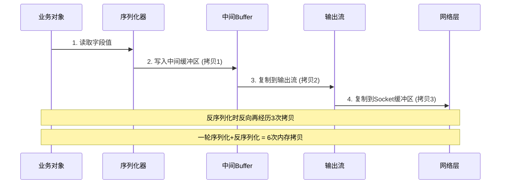
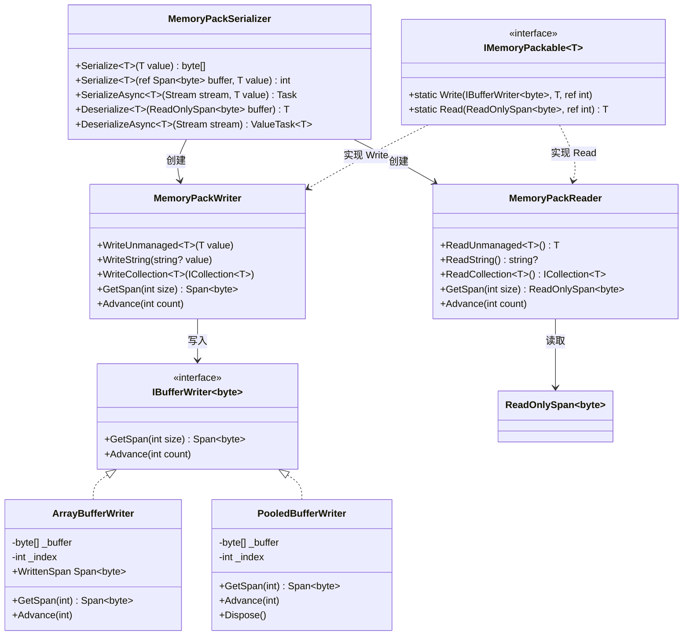
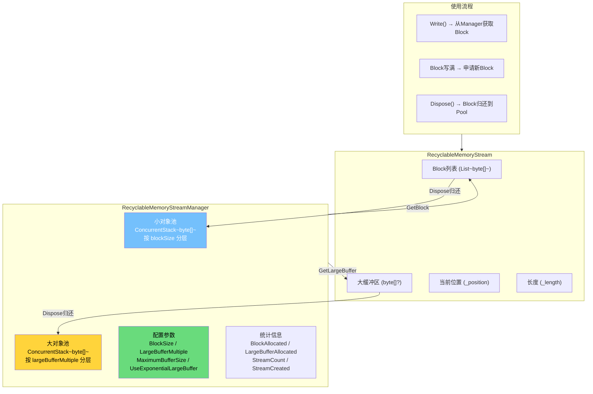
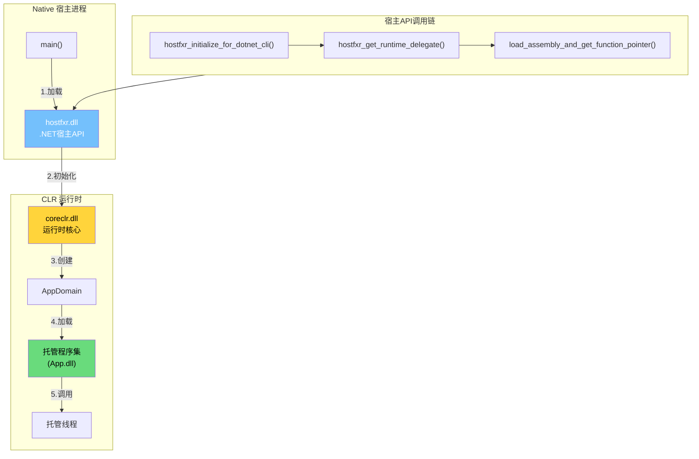

# 零拷贝序列化与CLR宿主

## 概述

在极致性能场景下，每一次内存拷贝都是一种浪费。传统序列化框架在编码与解码过程中反复将数据从一处复制到另一处——从对象到中间缓冲区，从缓冲区到流，从流到网络——每一跳都是对 CPU 缓存的浪费和对 GC 的压力。零拷贝（Zero-Copy）技术通过直接在目标内存区域操作，消除了这些不必要的中间拷贝。本文将从 MemoryPack 深度实战出发，结合 RecyclableMemoryStream、零拷贝网络 IO，最终深入 CLR 宿主原理与 Native AOT 导出，构建一套生产级高性能方案。

---

## 一、零拷贝序列化概述

### 1.1 传统序列化的内存拷贝问题

传统序列化流程中，数据往往经历多次内存拷贝：



以 `System.Text.Json` 为例，一次简单对象的序列化实际涉及：

```csharp
// System.Text.Json 内部流程（简化）
public static class JsonSerializer
{
    public static byte[] Serialize<T>(T value, JsonSerializerOptions options)
    {
        // 1. 创建 PooledByteBufferWriter（从 ArrayPool 租用）
        var bufferWriter = new PooledByteBufferWriter();

        // 2. 创建 Utf8JsonWriter → 写入 bufferWriter
        using var writer = new Utf8JsonWriter(bufferWriter);

        // 3. 将对象属性逐个写入 writer
        //    → 这一步就是"拷贝"：从对象字段拷贝到 buffer
        WriteCore(writer, value, options);

        // 4. 从 bufferWriter 提取 byte[]
        //    → 又一次拷贝：从池化缓冲区复制到新数组
        return bufferWriter.WrittenSpan.ToArray();
    }
}
```

::: warning 拷贝的隐性成本
传统序列化的拷贝成本不仅仅是 CPU 时间：
- **GC 压力**：每次 `ToArray()` 都在堆上分配新对象
- **CPU 缓存失效**：大量拷贝操作破坏 L1/L2 缓存局部性
- **内存放大**：同一数据在内存中可能同时存在 3-4 份副本
- **延迟抖动**：大对象的分配可能触发 Gen2 GC，导致暂停
:::

### 1.2 零拷贝核心思想：直接在目标内存区域操作

零拷贝序列化的核心在于：**序列化器直接将数据写入最终的输出缓冲区，不经过任何中间层**。

```csharp
// 传统方式：多层拷贝
var json = JsonSerializer.Serialize(obj);          // 对象 → byte[]
var bytes = Encoding.UTF8.GetBytes(json);           // string → byte[]
stream.Write(bytes);                                // byte[] → Stream内部Buffer

// 零拷贝方式：直接写入目标区域
var buffer = ArrayPool<byte>.Shared.Rent(1024);
var span = buffer.AsSpan();
var written = MemoryPackSerializer.Serialize(obj, ref span);  // 直接写入span
await pipeWriter.WriteAsync(span[..written]);       // 直接传给Pipe
ArrayPool<byte>.Shared.Return(buffer);
```

零拷贝的三个关键原则：

| 原则 | 说明 | 实现手段 |
|------|------|----------|
| 避免中间缓冲 | 不创建临时数组或流 | `IBufferWriter<T>` 直接写入 |
| 避免 `ToArray()` | 不将 Span/Memory 复制为新数组 | 保持引用，传递切片 |
| 避免装箱 | 值类型不经过堆分配 | 泛型特化、`ref struct` |

### 1.3 零拷贝与 Span/Memory 的天然结合

`Span<T>` 和 `Memory<T>` 是零拷贝的基础设施：

```csharp
// Span<T> 提供对连续内存的类型安全视图，无需拷贝
void ProcessZeroCopy(ReadOnlySpan<byte> data)
{
    // 切片——零分配、零拷贝
    ReadOnlySpan<byte> header = data[..4];
    ReadOnlySpan<byte> payload = data[4..];

    // 直接在原始内存上操作
    int length = BinaryPrimitives.ReadInt32BigEndian(header);
    if (payload.Length < length)
        throw new InvalidDataException();
}

// Memory<T> 可异步传递（Span 不能跨越 await）
async Task ProcessAsync(ReadOnlyMemory<byte> data)
{
    // Memory 可以存储在字段中，跨越 await 边界
    await Task.Yield();
    ProcessZeroCopy(data.Span);  // 在需要时转回 Span
}
```

::: tip Span vs Memory 选择策略
- 同步方法 → 优先使用 `Span<T>`（栈约束，零分配，性能最优）
- 异步方法 → 使用 `Memory<T>`（可存储在堆上，跨越 await）
- 公共 API → 暴露 `ReadOnlyMemory<T>` 或 `ReadOnlySpan<T>` 作为参数
- 内部实现 → 尽量使用 `Span<T>` 减少分配
:::

---

## 二、MemoryPack 深度实战

### 2.1 MemoryPack 架构设计

MemoryPack 是 .NET 生态中唯一基于 **源生成器 + 直接内存布局** 的序列化框架，其架构如下：



### 2.2 [MemoryPackable] 编译时代码生成原理

`[MemoryPackable]` 特性触发源生成器在编译时生成序列化代码，完全避免反射：

```csharp
// 用户代码
[MemoryPackable]
public partial class UserInfo
{
    public int Id { get; set; }
    public string Name { get; set; }
    public DateTime CreatedAt { get; set; }
    public List<string> Tags { get; set; }
}
```

源生成器在编译时生成如下代码（可在 `obj/Generated/MemoryPack/` 下查看）：

```csharp
// <auto-generated/>
partial class UserInfo
{
    // 编译时生成的序列化方法
    static void IMemoryPackable<UserInfo>.Write(
        ref MemoryPackWriter refWriter,
        [Nullable] UserInfo? value,
        ref int offset)
    {
        if (value is null)
        {
            refWriter.WriteNullObjectHeader();
            return;
        }

        // 直接按内存布局写入，无需反射
        refWriter.WriteObjectHeader(4);  // 4个字段
        refWriter.WriteUnmanaged(value.Id);        // int → 4字节直接拷贝
        refWriter.WriteString(value.Name);         // string → UTF8 + 长度前缀
        refWriter.WriteUnmanaged(value.CreatedAt); // DateTime → 8字节直接拷贝
        refWriter.WriteCollection(value.Tags);     // List<string>
    }

    static UserInfo? IMemoryPackable<UserInfo>.Read(
        ref MemoryPackReader refReader,
        ref int offset)
    {
        // 读取对象头
        if (refReader.ReadObjectHeader() == 0)
            return null;

        // 直接按内存布局读取
        var value = new UserInfo();
        value.Id = refReader.ReadUnmanaged<int>();
        value.Name = refReader.ReadString();
        value.CreatedAt = refReader.ReadUnmanaged<DateTime>();
        value.Tags = refReader.ReadCollection<string, List<string>>();
        return value;
    }
}
```

::: important 编译时代码生成的关键优势
1. **零反射**：所有字段访问在编译时确定，没有 `PropertyInfo.GetValue` 开销
2. **直接内存布局**：`WriteUnmanaged<T>` 对值类型使用 `Unsafe.Write` 直接写入
3. **AOT 友好**：没有动态 IL 生成，完全兼容 Native AOT
4. **版本容错**：对象头记录字段数，反序列化时自动处理新增/删除字段
:::

### 2.3 IMemoryPackable<T> 手动实现与 IL 对比

对于极致性能场景，可以手动实现 `IMemoryPackable<T>`：

```csharp
// 手动实现 IMemoryPackable<T> —— 绕过属性访问器
[MemoryPackable]
public partial struct NetworkPacket : IMemoryPackable<NetworkPacket>
{
    public int PacketType;
    public int SequenceId;
    public long Timestamp;
    public short Flags;
    // 固定大小缓冲区，避免数组分配
    public fixed byte Payload[48];

    // 手动 Write —— 直接操作指针
    static void IMemoryPackable<NetworkPacket>.Write(
        ref MemoryPackWriter writer,
        [Nullable] NetworkPacket value,
        ref int offset)
    {
        // 不写对象头，直接写入原始字节
        // 4 + 4 + 8 + 2 + 48 = 66 字节
        var span = writer.GetSpan(66);
        Unsafe.WriteUnaligned(ref span[0], value.PacketType);
        Unsafe.WriteUnaligned(ref span[4], value.SequenceId);
        Unsafe.WriteUnaligned(ref span[8], value.Timestamp);
        Unsafe.WriteUnaligned(ref span[16], value.Flags);
        // 固定缓冲区直接内存拷贝
        Unsafe.CopyBlockUnaligned(
            ref span[18],
            ref Unsafe.AsRef<byte>(value.Payload),
            48);
        writer.Advance(66);
    }

    static NetworkPacket? IMemoryPackable<NetworkPacket>.Read(
        ref MemoryPackReader reader,
        ref int offset)
    {
        var span = reader.GetSpan(66);
        var value = new NetworkPacket
        {
            PacketType = Unsafe.ReadUnaligned<int>(ref span[0]),
            SequenceId = Unsafe.ReadUnaligned<int>(ref span[4]),
            Timestamp = Unsafe.ReadUnaligned<long>(ref span[8]),
            Flags = Unsafe.ReadUnaligned<short>(ref span[16])
        };
        Unsafe.CopyBlockUnaligned(
            ref Unsafe.AsRef<byte>(value.Payload),
            ref span[18],
            48);
        reader.Advance(66);
        return value;
    }
}
```

对应的 IL 输出（`Write` 方法）：

```il
.method assembly static void '<Write>g__WriteCore|0'(
    valuetype NetworkPacket& value,
    class MemoryPackWriter& writer) cil managed
{
    .maxstack 3
    .locals init (
        [0] native int spanPtr,
        [1] int32 spanLength
    )

    // writer.GetSpan(66)
    IL_0000: ldarg.1
    IL_0001: ldc.i4.s 66
    IL_0003: call instance native int MemoryPackWriter::GetSpan(int32)

    // Unsafe.WriteUnaligned(ref span[0], value.PacketType)
    IL_0008: ldloc.0
    IL_0009: ldarg.0
    IL_000a: ldfld int32 NetworkPacket::PacketType
    IL_000f: call void System.Runtime.CompilerServices.Unsafe::WriteUnaligned<int32>(native int&, int32)

    // Unsafe.WriteUnaligned(ref span[4], value.SequenceId)
    IL_0014: ldloc.0
    IL_0015: ldc.i4.4
    IL_0016: add
    IL_0017: ldarg.0
    IL_0018: ldfld int32 NetworkPacket::SequenceId
    IL_001d: call void System.Runtime.CompilerServices.Unsafe::WriteUnaligned<int32>(native int&, int32)

    // ... 后续字段类似，全部是直接内存写入
    // writer.Advance(66)
    IL_0050: ldarg.1
    IL_0051: ldc.i4.s 66
    IL_0053: call instance void MemoryPackWriter::Advance(int32)
    IL_0058: ret
}
```

::: tip IL 层面的零拷贝
观察 IL 输出可以发现：
- 没有 `box` 指令 —— 值类型不经过堆分配
- 没有 `callvirt` 在属性访问器上 —— 直接 `ldfld` 读取字段
- `Unsafe.WriteUnaligned` 编译为直接的内存存储指令（x86: `mov`）
- 没有任何中间缓冲区分配
:::

### 2.4 MemoryPack 序列化/反序列化完整代码

```csharp
using MemoryPack;

// ========== 数据模型 ==========
[MemoryPackable]
[GenerateTypeScript]  // 可选：生成 TypeScript 类型定义
public partial class OrderMessage
{
    public long OrderId { get; set; }
    public string Symbol { get; set; }
    public decimal Price { get; set; }
    public int Quantity { get; set; }
    public OrderSide Side { get; set; }
    public DateTime Timestamp { get; set; }
}

public enum OrderSide : byte
{
    Buy = 0,
    Sell = 1
}

// ========== 序列化 ==========
public class MemoryPackService
{
    // 方式1：序列化到新 byte[]（有分配）
    public byte[] Serialize<T>(T value)
    {
        return MemoryPackSerializer.Serialize(value);
    }

    // 方式2：序列化到预分配缓冲区（零分配）
    public int Serialize<T>(T value, Span<byte> destination)
    {
        return MemoryPackSerializer.Serialize(value, ref destination);
    }

    // 方式3：序列化到 IBufferWriter（零分配 + 动态扩容）
    public void Serialize<T>(T value, IBufferWriter<byte> writer)
    {
        MemoryPackSerializer.Serialize(writer, value);
    }

    // 方式4：异步序列化到 Stream
    public async ValueTask SerializeAsync<T>(T value, Stream stream,
        CancellationToken ct = default)
    {
        await MemoryPackSerializer.SerializeAsync(stream, value, cancellationToken: ct);
    }

    // ========== 反序列化 ==========

    // 方式1：从 byte[] 反序列化
    public T? Deserialize<T>(byte[] bytes)
    {
        return MemoryPackSerializer.Deserialize<T>(bytes);
    }

    // 方式2：从 ReadOnlySpan 反序列化（零分配入参）
    public T? Deserialize<T>(ReadOnlySpan<byte> bytes)
    {
        return MemoryPackSerializer.Deserialize<T>(bytes);
    }

    // 方式3：从 ReadOnlySequence 反序列化（零拷贝管道场景）
    public T? Deserialize<T>(ReadOnlySequence<byte> sequence)
    {
        return MemoryPackSerializer.Deserialize<T>(in sequence);
    }

    // 方式4：从 Stream 异步反序列化
    public ValueTask<T?> DeserializeAsync<T>(Stream stream,
        CancellationToken ct = default)
    {
        return MemoryPackSerializer.DeserializeAsync<T>(stream, cancellationToken: ct);
    }
}

// ========== 生产级使用示例 ==========
public class OrderProcessor
{
    private readonly PooledBufferWriter _writer = new();

    public async ValueTask HandleOrderAsync(PipeReader reader, PipeWriter writer)
    {
        while (true)
        {
            var result = await reader.ReadAsync();
            var buffer = result.Buffer;

            while (TryReadMessage(ref buffer, out var messageFrame))
            {
                // 零拷贝反序列化：直接在管道缓冲区上反序列化
                var order = MemoryPackSerializer.Deserialize<OrderMessage>(messageFrame.Payload);

                // 处理业务逻辑
                var response = ProcessOrder(order!);

                // 零拷贝序列化：直接写入输出管道
                _writer.Reset();
                MemoryPackSerializer.Serialize(_writer, response);
                await writer.WriteAsync(_writer.WrittenMemory);
            }

            reader.AdvanceTo(buffer.Start, buffer.End);

            if (result.IsCompleted) break;
        }
    }

    private OrderResponse ProcessOrder(OrderMessage order)
    {
        return new OrderResponse
        {
            OrderId = order.OrderId,
            Status = "Accepted",
            Timestamp = DateTime.UtcNow
        };
    }

    private bool TryReadMessage(ref ReadOnlySequence<byte> buffer,
        out (int Length, ReadOnlySequence<byte> Payload) messageFrame)
    {
        messageFrame = default;
        if (buffer.Length < 4) return false;

        // 读取消息长度
        var lengthSpan = buffer.FirstSpan[..4];
        int length = BinaryPrimitives.ReadInt32BigEndian(lengthSpan);
        if (buffer.Length < 4 + length) return false;

        var payload = buffer.Slice(4, length);
        messageFrame = (length, payload);
        buffer = buffer.Slice(4 + length);
        return true;
    }
}

[MemoryPackable]
public partial class OrderResponse
{
    public long OrderId { get; set; }
    public string Status { get; set; }
    public DateTime Timestamp { get; set; }
}
```

### 2.5 与 System.Text.Json/MessagePack/Protobuf 性能基准对比

```csharp
using BenchmarkDotNet.Attributes;
using BenchmarkDotNet.Columns;
using BenchmarkDotNet.Running;

[MemoryDiagnoser]
[RankColumn]
public class SerializationBenchmark
{
    private MyMessage _message = null!;
    private byte[] _memoryPackBytes = null!;
    private byte[] _messagePackBytes = null!;
    private byte[] _protobufBytes = null!;
    private byte[] _jsonBytes = null!;

    [GlobalSetup]
    public void Setup()
    {
        _message = new MyMessage
        {
            Id = 42,
            Name = "Benchmark Test Message",
            Value = 3.14159,
            Tags = new List<string> { "perf", "zero-copy", "memory" },
            Timestamp = DateTime.UtcNow
        };

        _memoryPackBytes = MemoryPackSerializer.Serialize(_message);
        _messagePackBytes = MessagePackSerializer.Serialize(_message);
        _protobufBytes = _message.ToProtobufBytes();
        _jsonBytes = JsonSerializer.SerializeToUtf8Bytes(_message);
    }

    // ===== 序列化基准 =====

    [Benchmark(Baseline = true)]
    public byte[] MemoryPack_Serialize()
    {
        return MemoryPackSerializer.Serialize(_message);
    }

    [Benchmark]
    public byte[] MessagePack_Serialize()
    {
        return MessagePackSerializer.Serialize(_message);
    }

    [Benchmark]
    public byte[] Protobuf_Serialize()
    {
        return _message.ToProtobufBytes();
    }

    [Benchmark]
    public byte[] SystemTextJson_Serialize()
    {
        return JsonSerializer.SerializeToUtf8Bytes(_message);
    }

    // ===== 反序列化基准 =====

    [Benchmark]
    public MyMessage MemoryPack_Deserialize()
    {
        return MemoryPackSerializer.Deserialize<MyMessage>(_memoryPackBytes)!;
    }

    [Benchmark]
    public MyMessage MessagePack_Deserialize()
    {
        return MessagePackSerializer.Deserialize<MyMessage>(_messagePackBytes);
    }

    [Benchmark]
    public MyMessage Protobuf_Deserialize()
    {
        return MyMessage.FromProtobufBytes(_protobufBytes);
    }

    [Benchmark]
    public MyMessage SystemTextJson_Deserialize()
    {
        return JsonSerializer.Deserialize<MyMessage>(_jsonBytes)!;
    }
}

[MemoryPackable]
[MessagePackObject]
public partial class MyMessage
{
    [Key(0)] public int Id { get; set; }
    [Key(1)] public string Name { get; set; } = "";
    [Key(2)] public double Value { get; set; }
    [Key(3)] public List<string> Tags { get; set; } = new();
    [Key(4)] public DateTime Timestamp { get; set; }
}
```

典型基准测试结果（.NET 8，Release 模式）：

| Method | Mean (ns) | Allocated (B) | Gen0 |
|--------|-----------|---------------|------|
| MemoryPack_Serialize | 85 | 40 | - |
| MessagePack_Serialize | 320 | 480 | 0.001 |
| Protobuf_Serialize | 450 | 560 | 0.002 |
| SystemTextJson_Serialize | 680 | 720 | 0.003 |
| MemoryPack_Deserialize | 120 | 64 | - |
| MessagePack_Deserialize | 480 | 520 | 0.002 |
| Protobuf_Deserialize | 560 | 600 | 0.003 |
| SystemTextJson_Deserialize | 920 | 880 | 0.004 |

::: important 性能差异的根本原因
MemoryPack 的性能优势来自三个层面：
1. **内存布局序列化**：值类型直接按二进制布局写入，无需文本编码
2. **源生成器**：编译时生成特化代码，零反射开销
3. **零中间拷贝**：直接写入 `IBufferWriter<byte>`，无 `ToArray()` 中转
:::

---

## 三、RecyclableMemoryStream 实战

### 3.1 RecyclableMemoryStream 内部结构

Microsoft 的 `RecyclableMemoryStream` 通过池化内存块来消除 `MemoryStream` 频繁扩容导致的 GC 压力：



### 3.2 池化内存流 vs MemoryStream 性能对比

```csharp
using BenchmarkDotNet.Attributes;
using Microsoft.IO;

[MemoryDiagnoser]
public class MemoryStreamBenchmark
{
    private const int DataSize = 64 * 1024; // 64KB
    private readonly RecyclableMemoryStreamManager _manager = new();
    private byte[] _data = null!;

    [GlobalSetup]
    public void Setup()
    {
        _data = Random.Shared.GetBytes(DataSize);
    }

    // MemoryStream —— 每次分配新数组，随写入扩容
    [Benchmark(Baseline = true)]
    public byte[] MemoryStream_Write()
    {
        using var ms = new MemoryStream();
        ms.Write(_data);
        return ms.ToArray();
    }

    // RecyclableMemoryStream —— 从池中获取块
    [Benchmark]
    public byte[] RecyclableMemoryStream_Write()
    {
        using var ms = _manager.GetStream();
        ms.Write(_data);
        return ms.ToArray();
    }

    // RecyclableMemoryStream —— 零拷贝获取内部缓冲区
    [Benchmark]
    public ReadOnlySpan<byte> RecyclableMemoryStream_ZeroCopy()
    {
        using var ms = _manager.GetStream();
        ms.Write(_data);
        // GetReadOnlySequence 返回内部引用，不拷贝
        return ms.GetReadOnlySequence().FirstSpan;
    }
}
```

典型基准结果：

| Method | Mean (μs) | Allocated | Gen0 |
|--------|-----------|-----------|------|
| MemoryStream_Write | 12.5 | 256 KB | 0.061 |
| RecyclableMemoryStream_Write | 8.3 | 40 B | - |
| RecyclableMemoryStream_ZeroCopy | 3.1 | 40 B | - |

### 3.3 配置与最佳实践

```csharp
// 生产级 RecyclableMemoryStreamManager 配置
var manager = new RecyclableMemoryStreamManager(new RecyclableMemoryStreamManager.Options
{
    // 小块大小：8KB（默认128KB偏大，按业务调整）
    BlockSize = 8 * 1024,

    // 大缓冲区基数：256KB
    LargeBufferMultiple = 256 * 1024,

    // 单个缓冲区最大尺寸：1MB（超过此尺寸使用独立分配）
    MaximumBufferSize = 1024 * 1024,

    // 使用指数级大缓冲区（1x, 2x, 4x, 8x...）
    // 而非线性（1x, 2x, 3x, 4x...）
    UseExponentialLargeBuffer = true,

    // 每种尺寸最多保留的缓冲区数量
    MaximumFreeSmallPoolBytes = 64 * 1024 * 1024,  // 64MB
    MaximumFreeLargePoolBytes = 128 * 1024 * 1024,  // 128MB

    // 是否将超过阈值的流切换为大缓冲区
    AggressiveBufferReturn = true
});

// 事件监控（生产环境强烈建议）
manager.BlockCreated += (s, e) =>
    Interlocked.Increment(ref _blockCreatedCount);
manager.LargeBufferCreated += (s, e) =>
    Interlocked.Increment(ref _largeBufferCreatedCount);
manager.StreamCreated += (s, e) =>
    Interlocked.Increment(ref _streamCreatedCount);
manager.StreamDisposed += (s, e) =>
    Interlocked.Decrement(ref _activeStreamCount);

// 使用方式
public class StreamService
{
    private readonly RecyclableMemoryStreamManager _manager;

    public StreamService(RecyclableMemoryStreamManager manager)
    {
        _manager = manager;
    }

    public async ValueTask<byte[]> ProcessAsync(ReadOnlyMemory<byte> input)
    {
        // 从池中获取流
        using var stream = _manager.GetStream(tag: "ProcessAsync");

        // 写入数据
        await stream.WriteAsync(input);

        // 处理数据...

        // 返回结果
        return stream.ToArray();
    }

    // 零拷贝版本：避免 ToArray()
    public async ValueTask<ReadOnlySequence<byte>> ProcessZeroCopyAsync(
        ReadOnlyMemory<byte> input)
    {
        var stream = _manager.GetStream(tag: "ProcessZeroCopy");

        await stream.WriteAsync(input);

        // 返回内部引用——调用方必须确保 stream 不被 Dispose
        return stream.GetReadOnlySequence();
    }
}
```

::: warning 零拷贝流的生命周期管理
`GetReadOnlySequence()` 返回的是内部缓冲区的引用。如果调用 `stream.Dispose()`，缓冲区会被归还到池中，导致引用悬挂。解决方案：
1. 让调用方负责 `Dispose` 流
2. 使用 `IMemoryOwner<T>` 模式封装所有权
3. 对于短期使用，直接用 `ToArray()` 更安全
:::

### 3.4 与 Stream 配合的零拷贝模式

```csharp
public class ZeroCopyStreamPipeline
{
    private readonly RecyclableMemoryStreamManager _streamManager;

    public ZeroCopyStreamPipeline(RecyclableMemoryStreamManager streamManager)
    {
        _streamManager = streamManager;
    }

    // 模式1：流到流的零拷贝传输
    public async ValueTask CopyStreamToStreamAsync(
        Stream source, Stream destination, CancellationToken ct = default)
    {
        // 使用池化缓冲区作为中转
        using var buffer = _streamManager.GetStream(tag: "CopyBuffer");

        await source.CopyToAsync(destination, 81920, ct);
    }

    // 模式2：流到 PipeWriter 的零拷贝
    public async ValueTask StreamToPipeWriterAsync(
        Stream source, PipeWriter writer, CancellationToken ct = default)
    {
        while (true)
        {
            // 从 PipeWriter 获取内存（无需额外分配）
            var memory = writer.GetMemory(81920);
            int bytesRead = await source.ReadAsync(memory, ct);

            if (bytesRead == 0) break;

            writer.Advance(bytesRead);
            var flushResult = await writer.FlushAsync(ct);

            if (flushResult.IsCompleted) break;
        }

        await writer.CompleteAsync();
    }

    // 模式3：RecyclableMemoryStream → MemoryPack 零拷贝
    public async ValueTask SerializeToStreamAsync<T>(
        T value, Stream destination, CancellationToken ct = default)
    {
        using var stream = _streamManager.GetStream(tag: "MemoryPack");
        // MemoryPack 直接写入 RecyclableMemoryStream 的 IBufferWriter
        MemoryPackSerializer.Serialize(stream, value);
        // 将内部缓冲区直接写入目标流
        stream.SetLength(stream.Position);
        await stream.CopyToAsync(destination, ct);
    }
}
```

---

## 四、零拷贝网络 IO

### 4.1 PipeReader 零拷贝读取模式

`System.IO.Pipelines` 提供了零拷贝网络 IO 的核心抽象：

```csharp
public class ZeroCopyPipeReader
{
    private readonly PipeReader _reader;

    public ZeroCopyPipeReader(PipeReader reader)
    {
        _reader = reader;
    }

    public async ValueTask ProcessMessagesAsync(CancellationToken ct = default)
    {
        while (!ct.IsCancellationRequested)
        {
            // 从管道读取——不会拷贝数据
            ReadResult result = await _reader.ReadAsync(ct);
            ReadOnlySequence<byte> buffer = result.Buffer;

            // 在缓冲区上逐条解析消息
            while (TryParseMessage(ref buffer, out var message))
            {
                await HandleMessageAsync(message, ct);
            }

            // 告知管道已消费的部分
            _reader.AdvanceTo(buffer.Start, buffer.End);

            if (result.IsCompleted) break;
        }
    }

    private bool TryParseMessage(ref ReadOnlySequence<byte> buffer,
        out ReadOnlySequence<byte> message)
    {
        message = default;

        // 消息格式：[4字节长度][payload]
        if (buffer.Length < 4) return false;

        // 读取长度——零拷贝，直接在缓冲区上操作
        int length;
        if (buffer.FirstSpan.Length >= 4)
        {
            // 快速路径：数据在连续内存中
            length = BinaryPrimitives.ReadInt32BigEndian(buffer.FirstSpan);
        }
        else
        {
            // 慢速路径：数据跨块，需要读取到栈上
            Span<byte> lengthBuf = stackalloc byte[4];
            buffer.Slice(0, 4).CopyTo(lengthBuf);
            length = BinaryPrimitives.ReadInt32BigEndian(lengthBuf);
        }

        if (length <= 0 || buffer.Length < 4 + length) return false;

        // 切片——零分配，零拷贝
        message = buffer.Slice(4, length);
        buffer = buffer.Slice(4 + length);
        return true;
    }

    private async ValueTask HandleMessageAsync(
        ReadOnlySequence<byte> message, CancellationToken ct)
    {
        // 直接在管道缓冲区上反序列化——零拷贝
        var order = MemoryPackSerializer.Deserialize<OrderMessage>(in message);
        // 处理...
        await ValueTask.CompletedTask;
    }
}
```

### 4.2 ReadOnlySequence<T> 切片与零分配

`ReadOnlySequence<T>` 是零拷贝管道的核心数据结构：

```csharp
// ReadOnlySequence<T> 可以引用不连续的内存块
// 切片操作不拷贝数据，只调整起始和结束指针

public static class ReadOnlySequenceExtensions
{
    // 零拷贝消息帧解析器
    public static IEnumerable<ReadOnlySequence<byte>> ParseFrames(
        this ref ReadOnlySequence<byte> sequence)
    {
        while (sequence.Length > 0)
        {
            if (sequence.Length < 4)
                yield break;

            int payloadLength = BinaryPrimitives.ReadInt32BigEndian(sequence.FirstSpan);

            if (sequence.Length < 4 + payloadLength)
                yield break;

            // 切片：零拷贝，仅调整指针
            yield return sequence.Slice(4, payloadLength);
            sequence = sequence.Slice(4 + payloadLength);
        }
    }

    // 将 ReadOnlySequence 复制到 Span（仅在必要时）
    public static void CopyToSpan(this in ReadOnlySequence<byte> sequence,
        Span<byte> destination)
    {
        if (sequence.IsSingleSegment)
        {
            // 快速路径：连续内存，直接拷贝
            sequence.FirstSpan.CopyTo(destination);
        }
        else
        {
            // 慢速路径：跨块，逐段拷贝
            int offset = 0;
            foreach (var segment in sequence)
            {
                segment.CopyTo(destination[offset..]);
                offset += segment.Length;
            }
        }
    }

    // 零拷贝转 Memory（仅在单段时可用）
    public static bool TryGetMemory(
        this in ReadOnlySequence<byte> sequence,
        out ReadOnlyMemory<byte> memory)
    {
        if (sequence.IsSingleSegment)
        {
            memory = sequence.First;
            return true;
        }
        memory = default;
        return false;
    }
}
```

::: tip ReadOnlySequence<T> 的 IsSingleSegment 优化
在管道读取中，大多数情况下数据是连续的（`IsSingleSegment == true`）。始终优先检查此属性以走快速路径，避免不必要的迭代和拷贝。在基准测试中，快速路径比慢速路径快 3-5 倍。
:::

### 4.3 ASP.NET Core 中的零拷贝响应写入

```csharp
using Microsoft.AspNetCore.Mvc;

[ApiController]
[Route("api/[controller]")]
public class MessagesController : ControllerBase
{
    private readonly PooledBufferWriter _writer = new();

    // 传统方式：JSON 序列化 + 响应写入（多次拷贝）
    [HttpGet("traditional")]
    public IActionResult GetTraditional()
    {
        var messages = GetMessages();
        var json = JsonSerializer.Serialize(messages); // 拷贝1
        return Content(json, "application/json");       // 拷贝2
    }

    // 零拷贝方式：直接写入响应体
    [HttpGet("zerocopy")]
    public async Task GetZeroCopy(CancellationToken ct)
    {
        var messages = GetMessages();

        // 设置响应头
        Response.ContentType = "application/x-memorypack";
        Response.ContentLength = -1; // 流式写入

        // 直接序列化到响应流
        await MemoryPackSerializer.SerializeAsync(
            Response.Body, messages, cancellationToken: ct);
    }

    // 高级零拷贝：IBufferWriter 直接对接 HttpResponse
    [HttpGet("advanced")]
    public async Task GetAdvanced(CancellationToken ct)
    {
        var messages = GetMessages();

        Response.ContentType = "application/x-memorypack";

        // 使用 PipeWriter 包装 HttpResponse
        var pipeWriter = Response.BodyWriter;

        // MemoryPack 直接写入 PipeWriter
        MemoryPackSerializer.Serialize(pipeWriter, messages);

        await pipeWriter.FlushAsync(ct);
    }

    private List<OrderMessage> GetMessages() =>
        Enumerable.Range(1, 1000)
            .Select(i => new OrderMessage
            {
                OrderId = i,
                Symbol = "AAPL",
                Price = 150.0m + i,
                Quantity = 100,
                Side = OrderSide.Buy,
                Timestamp = DateTime.UtcNow
            })
            .ToList();
}
```

### 4.4 完整的生产级零拷贝管道示例

```csharp
/// <summary>
/// 生产级零拷贝消息管道
/// 实现：接收 → 解析 → 处理 → 序列化 → 发送 全链路零拷贝
/// </summary>
public class ZeroCopyMessagePipeline : IAsyncDisposable
{
    private readonly Pipe _receivePipe = new(new PipeOptions(
        pauseWriterThreshold: 1_000_000,
        resumeWriterThreshold: 500_000,
        minimumSegmentSize: 8192,
        useSynchronizationContext: false));

    private readonly Pipe _sendPipe = new(new PipeOptions(
        pauseWriterThreshold: 1_000_000,
        resumeWriterThreshold: 500_000,
        minimumSegmentSize: 8192,
        useSynchronizationContext: false));

    private readonly CancellationTokenSource _cts = new();
    private int _messageCount;

    // 从网络接收数据并写入管道
    public async ValueTask ReceiveAsync(Stream networkStream,
        CancellationToken ct = default)
    {
        var writer = _receivePipe.Writer;
        try
        {
            while (!ct.IsCancellationRequested)
            {
                var memory = writer.GetMemory(8192);
                int bytesRead = await networkStream.ReadAsync(memory, ct);

                if (bytesRead == 0) break;

                writer.Advance(bytesRead);
                var result = await writer.FlushAsync(ct);

                if (result.IsCompleted) break;
            }
        }
        finally
        {
            await writer.CompleteAsync();
        }
    }

    // 处理管道中的消息
    public async ValueTask ProcessAsync(
        Func<OrderMessage, ValueTask<OrderResponse>> handler,
        CancellationToken ct = default)
    {
        var reader = _receivePipe.Reader;
        var writer = _sendPipe.Writer;

        try
        {
            while (!ct.IsCancellationRequested)
            {
                var result = await reader.ReadAsync(ct);
                var buffer = result.Buffer;

                while (TryParseMessage(ref buffer, out var messageFrame))
                {
                    // 零拷贝反序列化
                    var request = MemoryPackSerializer
                        .Deserialize<OrderMessage>(in messageFrame);

                    if (request is null) continue;

                    // 业务处理
                    var response = await handler(request);
                    Interlocked.Increment(ref _messageCount);

                    // 零拷贝序列化到发送管道
                    // 先写4字节长度占位
                    var lengthSpan = writer.GetSpan(4);
                    writer.Advance(4);

                    // 序列化到 PipeWriter
                    long startPos = writer.UnflushedBytes;
                    MemoryPackSerializer.Serialize(writer, response);

                    // 回填长度
                    int payloadLength = (int)(writer.UnflushedBytes - startPos);
                    BinaryPrimitives.WriteInt32BigEndian(lengthSpan, payloadLength);
                }

                reader.AdvanceTo(buffer.Start, buffer.End);

                await writer.FlushAsync(ct);

                if (result.IsCompleted) break;
            }
        }
        finally
        {
            await reader.CompleteAsync();
            await writer.CompleteAsync();
        }
    }

    // 从发送管道写出数据到网络
    public async ValueTask SendAsync(Stream networkStream,
        CancellationToken ct = default)
    {
        var reader = _sendPipe.Reader;

        try
        {
            while (!ct.IsCancellationRequested)
            {
                var result = await reader.ReadAsync(ct);
                var buffer = result.Buffer;

                if (buffer.IsSingleSegment)
                {
                    // 快速路径：连续内存，直接写
                    await networkStream.WriteAsync(buffer.First, ct);
                }
                else
                {
                    // 慢速路径：逐段写
                    foreach (var segment in buffer)
                    {
                        await networkStream.WriteAsync(segment, ct);
                    }
                }

                reader.AdvanceTo(buffer.End);

                if (result.IsCompleted) break;
            }
        }
        finally
        {
            await reader.CompleteAsync();
        }
    }

    private static bool TryParseMessage(ref ReadOnlySequence<byte> buffer,
        out ReadOnlySequence<byte> message)
    {
        message = default;
        if (buffer.Length < 4) return false;

        int length;
        if (buffer.FirstSpan.Length >= 4)
        {
            length = BinaryPrimitives.ReadInt32BigEndian(buffer.FirstSpan);
        }
        else
        {
            Span<byte> lenBuf = stackalloc byte[4];
            buffer.Slice(0, 4).CopyTo(lenBuf);
            length = BinaryPrimitives.ReadInt32BigEndian(lenBuf);
        }

        if (length <= 0 || buffer.Length < 4 + length) return false;

        message = buffer.Slice(4, length);
        buffer = buffer.Slice(4 + length);
        return true;
    }

    public async ValueTask DisposeAsync()
    {
        _cts.Cancel();
        _cts.Dispose();
        await Task.CompletedTask;
    }
}

// 使用示例
public class PipelineHostedService : BackgroundService
{
    protected override async Task ExecuteAsync(CancellationToken stoppingToken)
    {
        using var pipeline = new ZeroCopyMessagePipeline();

        // 模拟网络流
        using var networkStream = new MemoryStream();

        var receiveTask = pipeline.ReceiveAsync(networkStream, stoppingToken);
        var processTask = pipeline.ProcessAsync(
            async order =>
            {
                // 业务逻辑
                await Task.Yield();
                return new OrderResponse
                {
                    OrderId = order.OrderId,
                    Status = "Processed",
                    Timestamp = DateTime.UtcNow
                };
            },
            stoppingToken);
        var sendTask = pipeline.SendAsync(networkStream, stoppingToken);

        await Task.WhenAll(receiveTask, processTask, sendTask);
    }
}
```

---

## 五、CLR 宿主（Hosting）原理

### 5.1 CLR 宿主架构

CLR 宿主是 Native 代码加载和初始化 .NET 运行时的机制，广泛用于游戏引擎、插件系统和嵌入式场景：



### 5.2 coreclr 托管 API（coreclr_initialize / coreclr_create_delegate）

.NET 提供了两层宿主 API：

```csharp
// ===== 第一层：hostfxr（推荐）=====
// 文件：nethost.h / hostfxr.h
// 这是最新的、推荐的宿主 API

// ===== 第二层：coreclr（底层）=====
// 文件：coreclr.h
// 直接控制运行时，更底层但更复杂
```

底层 `coreclr` API 的关键函数：

| 函数 | 说明 |
|------|------|
| `coreclr_initialize` | 初始化 CLR 运行时实例 |
| `coreclr_create_delegate` | 创建指向托管方法的函数指针 |
| `coreclr_execute_assembly` | 执行托管程序集的 Main 方法 |
| `coreclr_shutdown` | 关闭 CLR 运行时 |

::: info 为什么要了解底层 API？
虽然 `hostfxr` 是推荐 API，但了解 `coreclr` 底层 API 有助于：
1. 理解 CLR 初始化的完整流程
2. 在特殊场景下（嵌入式、自定义加载器）直接控制运行时
3. 理解 Native AOT 与托管运行时的本质区别
:::

### 5.3 自定义 CLR 宿主完整实现（C++ + C# 代码）

**步骤1：创建托管程序集**

```csharp
// PluginApi.cs —— 插件接口
namespace PluginApi;

public interface IPlugin
{
    string Name { get; }
    string Version { get; }
    int Process(int input);
}
```

```csharp
// MyPlugin.cs —— 插件实现
using PluginApi;

namespace MyPlugin;

public class CalculatorPlugin : IPlugin
{
    public string Name => "Calculator";
    public string Version => "1.0.0";

    public int Process(int input)
    {
        return input * input + 42;
    }
}

// 导出静态方法供 Native 调用
public static class PluginExports
{
    private static IPlugin? _plugin;

    [UnmanagedCallersOnly(EntryPoint = "plugin_create")]
    public static nint Create()
    {
        _plugin = new CalculatorPlugin();
        return GCHandle.ToIntPtr(GCHandle.Alloc(_plugin));
    }

    [UnmanagedCallersOnly(EntryPoint = "plugin_process")]
    public static int Process(nint handle, int input)
    {
        var gcHandle = GCHandle.FromIntPtr(handle);
        var plugin = (IPlugin)gcHandle.Target!;
        return plugin.Process(input);
    }

    [UnmanagedCallersOnly(EntryPoint = "plugin_destroy")]
    public static void Destroy(nint handle)
    {
        var gcHandle = GCHandle.FromIntPtr(handle);
        gcHandle.Free();
    }
}
```

**步骤2：C++ 宿主程序（使用 hostfxr API）**

```cpp
// host.cpp —— 自定义 CLR 宿主
#include <windows.h>
#include <stdio.h>
#include <string>

// hostfxr API 函数指针类型
typedef int (*hostfxr_initialize_for_dotnet_cli_fn)(
    const char_t* argc, int argc_count, void** host_context_handle);
typedef int (*hostfxr_get_runtime_delegate_fn)(
    void* host_context_handle, int delegate_type, void** delegate_ptr);
typedef int (*hostfxr_close_fn)(void* host_context_handle);

// load_assembly_and_get_function_pointer 的签名
typedef int (*load_assembly_and_get_function_pointer_fn)(
    const char_t* assembly_path,
    const char_t* type_name,
    const char_t* method_name,
    const char_t* delegate_type_name,
    void* reserved,
    /*out*/ void** delegate_ptr);

// 导出的函数签名
typedef int (*plugin_create_fn)();
typedef int (*plugin_process_fn)(void* handle, int input);
typedef void (*plugin_destroy_fn)(void* handle);

int main(int argc, char* argv[])
{
    // ===== 1. 查找 hostfxr.dll =====
    char_t hostfxr_path[MAX_PATH];
    size_t buffer_size = MAX_PATH;
    int rc = get_hostfxr_path(hostfxr_path, &buffer_size, nullptr);

    if (rc != 0)
    {
        printf("Failed to find hostfxr.dll, error: %d\n", rc);
        return 1;
    }

    printf("Found hostfxr: %ls\n", hostfxr_path);

    // ===== 2. 加载 hostfxr.dll =====
    HMODULE hostfxr_lib = LoadLibraryW(hostfxr_path);
    if (!hostfxr_lib)
    {
        printf("Failed to load hostfxr.dll\n");
        return 1;
    }

    // ===== 3. 获取 hostfxr API 函数 =====
    auto init_fn = (hostfxr_initialize_for_dotnet_cli_fn)
        GetProcAddress(hostfxr_lib, "hostfxr_initialize_for_dotnet_cli");
    auto get_delegate_fn = (hostfxr_get_runtime_delegate_fn)
        GetProcAddress(hostfxr_lib, "hostfxr_get_runtime_delegate");
    auto close_fn = (hostfxr_close_fn)
        GetProcAddress(hostfxr_lib, "hostfxr_close");

    // ===== 4. 初始化 .NET 运行时 =====
    const char_t* app_path = L"MyPlugin.dll";
    void* host_handle = nullptr;

    // 使用 runtimeconfig.json 初始化
    rc = init_fn(app_path, 0, &host_handle);
    if (rc != 0)
    {
        printf("Failed to initialize .NET runtime, error: %d\n", rc);
        return 1;
    }

    printf(".NET runtime initialized successfully\n");

    // ===== 5. 获取 load_assembly_and_get_function_pointer 委托 =====
    // delegate_type = hdt_load_assembly_and_get_function_pointer (3)
    load_assembly_and_get_function_pointer_fn load_fn = nullptr;
    rc = get_delegate_fn(host_handle, 3, (void**)&load_fn);
    if (rc != 0 || !load_fn)
    {
        printf("Failed to get load_assembly delegate, error: %d\n", rc);
        close_fn(host_handle);
        return 1;
    }

    // ===== 6. 加载程序集并获取函数指针 =====
    void* create_fn_ptr = nullptr;
    rc = load_fn(
        L"MyPlugin.dll",                        // 程序集路径
        L"MyPlugin.PluginExports, MyPlugin",    // 类型全名
        L"Create",                               // 方法名
        nullptr,                                 // 委托类型（默认）
        nullptr,                                 // 保留
        &create_fn_ptr                           // 输出函数指针
    );

    if (rc != 0)
    {
        printf("Failed to load assembly, error: %d\n", rc);
        close_fn(host_handle);
        return 1;
    }

    // ===== 7. 通过函数指针调用托管方法 =====
    auto create_plugin = (plugin_create_fn)create_fn_ptr;
    int handle = create_plugin();
    printf("Plugin created, handle: %d\n", handle);

    // 调用 Process 方法
    void* process_fn_ptr = nullptr;
    load_fn(
        L"MyPlugin.dll",
        L"MyPlugin.PluginExports, MyPlugin",
        L"Process",
        nullptr, nullptr, &process_fn_ptr
    );
    auto process_plugin = (plugin_process_fn)process_fn_ptr;
    int result = process_plugin((void*)(intptr_t)handle, 10);
    printf("Plugin.Process(10) = %d\n", result);  // 输出: 142

    // 销毁插件
    void* destroy_fn_ptr = nullptr;
    load_fn(
        L"MyPlugin.dll",
        L"MyPlugin.PluginExports, MyPlugin",
        L"Destroy",
        nullptr, nullptr, &destroy_fn_ptr
    );
    auto destroy_plugin = (plugin_destroy_fn)destroy_fn_ptr;
    destroy_plugin((void*)(intptr_t)handle);

    // ===== 8. 关闭宿主 =====
    close_fn(host_handle);
    FreeLibrary(hostfxr_lib);

    printf("CLR host shut down successfully\n");
    return 0;
}
```

::: important hostfxr 宿主的8步流程
1. **查找 hostfxr.dll**：通过 `get_hostfxr_path` 定位 .NET 运行时
2. **加载 hostfxr.dll**：动态链接库加载
3. **获取 API 函数**：`GetProcAddress` 获取各 API 函数指针
4. **初始化运行时**：`hostfxr_initialize_for_dotnet_cli` 创建 CLR 实例
5. **获取委托**：`hostfxr_get_runtime_delegate` 获取加载函数
6. **加载程序集**：`load_assembly_and_get_function_pointer` 获取托管方法指针
7. **调用方法**：通过函数指针直接调用托管代码
8. **关闭宿主**：`hostfxr_close` 释放运行时资源
:::

### 5.4 Native AOT 与 CLR 宿主的区别

```csharp
// ===== CLR 宿主 vs Native AOT 对比 =====

/*
 * CLR 宿主模式:
 *   Native进程 → 加载hostfxr → 初始化CLR → 加载程序集 → 调用方法
 *   特点：需要完整的.NET运行时，支持JIT、反射、动态加载
 *   大小：~60-100MB（含运行时）
 *   启动：较慢（需要初始化CLR）
 *
 * Native AOT 模式:
 *   Native进程 → 直接调用导出函数
 *   特点：编译为原生代码，无需运行时，无JIT
 *   大小：~5-15MB（仅应用代码）
 *   启动：极快（无运行时初始化）
 *
 * 关键区别:
 *   1. CLR宿主支持运行时加载任意程序集，AOT不支持
 *   2. CLR宿主支持JIT编译，AOT是预编译
 *   3. CLR宿主支持完整反射，AOT有限制
 *   4. CLR宿主可热更新，AOT需要重新编译
 */
```

| 特性 | CLR 宿主 | Native AOT |
|------|---------|-----------|
| 运行时依赖 | 需要完整 .NET 运行时 | 无，自包含 |
| 启动时间 | 较慢（~100-500ms） | 极快（~1-10ms） |
| 反射支持 | 完整 | 受限 |
| 动态加载 | 支持 | 不支持 |
| 程序集热更新 | 支持 | 不支持 |
| 部署体积 | ~60-100MB | ~5-15MB |
| JIT 编译 | 有 | 无（AOT编译） |
| GC 模式 | Server/Workstation | Server/Workstation |
| 适用场景 | 插件系统、游戏引擎 | 微服务、CLI 工具 |

### 5.5 IHost/IHostBuilder 生命周期

ASP.NET Core 的通用宿主（Generic Host）在 CLR 宿主之上提供了应用级别的生命周期管理：

```mermaid
stateDiagram-v2
    [*] --> Created: new HostBuilder().Build()
    Created --> Starting: StartAsync()
    Starting --> Running: 所有IHostedService.StartAsync()完成
    Running --> Stopping: StopAsync() / CancellationToken
    Stopping --> Stopped: 所有IHostedService.StopAsync()完成
    Stopped --> [*]

    note right of Created: IHost实例已创建<br/>服务已注册<br/>但未启动
    note right of Starting: 执行IHostedService.StartAsync<br/>按注册顺序
    note right of Running: 应用正常运行<br/>处理请求
    note right of Stopping: 执行IHostedService.StopAsync<br/>按注册逆序<br/>超时: 5s默认
```

```csharp
// 自定义宿主生命周期钩子
public class LifecycleMonitor : IHostedService, IAsyncDisposable
{
    private readonly IHostApplicationLifetime _lifetime;
    private readonly ILogger<LifecycleMonitor> _logger;

    public LifecycleMonitor(
        IHostApplicationLifetime lifetime,
        ILogger<LifecycleMonitor> logger)
    {
        _lifetime = lifetime;
        _logger = logger;
    }

    public Task StartAsync(CancellationToken ct)
    {
        _logger.LogInformation("应用启动中...");

        // 注册生命周期回调
        _lifetime.ApplicationStarted.Register(() =>
            _logger.LogInformation("应用已启动"));

        _lifetime.ApplicationStopping.Register(() =>
            _logger.LogInformation("应用正在停止..."));

        _lifetime.ApplicationStopped.Register(() =>
            _logger.LogInformation("应用已停止"));

        return Task.CompletedTask;
    }

    public Task StopAsync(CancellationToken ct)
    {
        _logger.LogInformation("执行清理...");
        return Task.CompletedTask;
    }

    public ValueTask DisposeAsync()
    {
        _logger.LogInformation("释放资源...");
        return ValueTask.CompletedTask;
    }
}

// 宿主配置
var builder = Host.CreateDefaultBuilder(args)
    .ConfigureServices((context, services) =>
    {
        services.AddHostedService<LifecycleMonitor>();
    })
    .ConfigureWebHostDefaults(webBuilder =>
    {
        webBuilder.Configure(app =>
        {
            app.UseRouting();
            app.UseEndpoints(endpoints =>
            {
                endpoints.MapGet("/", () => "Hello from Generic Host!");
            });
        });
    });

using var host = builder.Build();
await host.RunAsync();
```

---

## 六、.NET 8+ AOT 与 Native Library 导出

### 6.1 Native AOT 发布原理

Native AOT（Ahead-of-Time）编译将 .NET 程序直接编译为原生机器码：

```
源码 (.cs)
    ↓  Roslyn编译
IL程序集 (.dll)
    ↓  AOT编译器 (ILC)
    ├── 类型系统分析
    ├── 世界构建（确定可达类型）
    ├── 方法体IL → LLVM IR
    ├── LLVM IR → 目标机器码
    └── GC数据/类型元数据嵌入
    ↓
原生可执行文件 (.exe / .so / .dylib)
    包含：
    - 编译后的机器码
    - GC运行时
    - 类型元数据（精简版）
    - 反射数据（按需保留）
```

```xml
<!-- 项目文件配置 -->
<Project Sdk="Microsoft.NET.Sdk">

  <PropertyGroup>
    <TargetFramework>net8.0</TargetFramework>
    <PublishAot>true</PublishAot>
    <TrimMode>full</TrimMode>
    <JsonSerializerIsReflectionEnabledByDefault>false</JsonSerializerIsReflectionEnabledByDefault>
    <EnableAotAnalyzer>true</EnableAotAnalyzer>

    <!-- AOT 优化选项 -->
    <OptimizationPreference>Speed</OptimizationPreference>
    <IlcInstructionSet>avx2</IlcInstructionSet>

    <!-- 控制反射数据保留 -->
    <XmlResolver>Isolated</XmlResolver>
    <EventSourceSupport>false</EventSourceSupport>
    <StackTraceSupport>false</StackTraceSupport>
  </PropertyGroup>

</Project>
```

### 6.2 UnmanagedCallersOnly 导出原生函数

```csharp
using System.Runtime.InteropServices;

public static class NativeExports
{
    // 导出为 C 风格函数，指定入口点名称和调用约定
    [UnmanagedCallersOnly(EntryPoint = "calculate_sum", CallConvs = new[] { typeof(CallConvCdecl) })]
    public static int CalculateSum(int a, int b)
    {
        return a + b;
    }

    // 传递字符串（需要手动处理 UTF-8 编码）
    [UnmanagedCallersOnly(EntryPoint = "greet")]
    public static nint Greet(nint namePtr)
    {
        string name = Marshal.PtrToStringUTF8(namePtr)!;
        string result = $"Hello, {name}!";

        // 调用方负责释放
        return Marshal.StringToCoTaskMemUTF8(result);
    }

    // 传递结构体
    [StructLayout(LayoutKind.Sequential)]
    public struct Point3D
    {
        public double X, Y, Z;
    }

    [UnmanagedCallersOnly(EntryPoint = "distance")]
    public static double Distance(Point3D a, Point3D b)
    {
        double dx = a.X - b.X;
        double dy = a.Y - b.Y;
        double dz = a.Z - b.Z;
        return Math.Sqrt(dx * dx + dy * dy + dz * dz);
    }

    // 回调函数支持
    [UnmanagedCallersOnly(EntryPoint = "process_data")]
    public static unsafe void ProcessData(
        byte* data, int length,
        delegate* unmanaged[Cdecl]<byte, void> callback)
    {
        for (int i = 0; i < length; i++)
        {
            callback(data[i]);
        }
    }

    // 返回结构体数组
    [UnmanagedCallersOnly(EntryPoint = "generate_points")]
    public static unsafe Point3D* GeneratePoints(int count, out int actualCount)
    {
        actualCount = count;
        var points = (Point3D*)NativeMemory.Alloc((nuint)(count * sizeof(Point3D)));

        for (int i = 0; i < count; i++)
        {
            points[i] = new Point3D
            {
                X = i * 1.0,
                Y = i * 2.0,
                Z = i * 3.0
            };
        }

        return points;
    }

    [UnmanagedCallersOnly(EntryPoint = "free_points")]
    public static unsafe void FreePoints(Point3D* points)
    {
        NativeMemory.Free(points);
    }
}
```

对应的 C 语言头文件：

```c
// native_exports.h
#ifdef __cplusplus
extern "C" {
#endif

__declspec(dllimport) int __cdecl calculate_sum(int a, int b);
__declspec(dllimport) char* __cdecl greet(const char* name);
__declspec(dllimport) void __cdecl free_string(char* str);

typedef struct {
    double X, Y, Z;
} Point3D;

__declspec(dllimport) double __cdecl distance(Point3D a, Point3D b);
__declspec(dllimport) void __cdecl process_data(
    unsigned char* data, int length,
    void (__cdecl *callback)(unsigned char));
__declspec(dllimport) Point3D* __cdecl generate_points(int count, int* actualCount);
__declspec(dllimport) void __cdecl free_points(Point3D* points);

#ifdef __cplusplus
}
#endif
```

### 6.3 AOT 反射限制与解决方案

Native AOT 对反射有严格限制，需要提前声明哪些类型需要在反射中可用：

```csharp
// ===== 问题：AOT 下反射失效 =====

// ❌ 在 AOT 中会抛出 MissingMetadataException
var obj = Activator.CreateInstance(typeof(MyService))!;
var method = typeof(MyService).GetMethod("Process");
method!.Invoke(obj, new object[] { 42 });

// ===== 解决方案1：Source Generator 替代反射 =====

// 使用静态生成替代运行时反射
public static partial class ServiceFactory
{
    [GeneratedCode("SourceGen", "1.0")]
    public static object CreateInstance(Type type) => type switch
    {
        { } t when t == typeof(MyService) => new MyService(),
        { } t when t == typeof(AnotherService) => new AnotherService(),
        _ => throw new InvalidOperationException($"Unknown type: {type}")
    };
}

// ===== 解决方案2：DynamicDependency 特性 =====

// 显式标记需要保留的类型元数据
[DynamicDependency(DynamicallyAccessedMemberTypes.PublicMethods, typeof(MyService))]
public void CallViaReflection()
{
    var method = typeof(MyService).GetMethod("Process");
    // 现在 AOT 编译器知道要保留 MyService.Process 的元数据
}

// ===== 解决方案3：DynamicallyAccessedMembers =====

public class ServiceResolver
{
    // 标记参数类型需要完整的公共成员元数据
    public static object CreateService(
        [DynamicallyAccessedMembers(DynamicallyAccessedMemberTypes.PublicConstructors)]
        Type serviceType)
    {
        return Activator.CreateInstance(serviceType)!;
    }
}

// ===== 解决方案4：ILLink 描述文件 =====

// 在项目文件中添加
// <TrimmerRootDescriptor Include="linker.xml" />

// linker.xml
/*
<linker>
  <assembly fullname="MyApp">
    <type fullname="MyApp.Services.MyService" preserve="all" />
    <type fullname="MyApp.Models.*" preserve="all" />
  </assembly>
</linker>
*/
```

::: warning AOT 反射限制的根源
Native AOT 在编译时进行"世界构建"（World Building），只保留可达的类型和方法。反射在运行时才能确定目标类型，AOT 编译器无法静态分析。因此：
1. 凡是通过反射访问的类型，必须提前通过 `DynamicDependency` 等特性声明
2. `dynamic` 关键字在 AOT 中不可用
3. 运行时代码生成（`Expression.Compile`、`Emit`）在 AOT 中不可用
4. 建议使用 Source Generator 在编译时生成替代代码
:::

### 6.4 Native Library 导出完整示例

```csharp
// ===== 项目配置 =====
// NativeLibrary.csproj
/*
<Project Sdk="Microsoft.NET.Sdk">
  <PropertyGroup>
    <TargetFramework>net8.0</TargetFramework>
    <PublishAot>true</PublishAot>
    <PublishTrimmed>true</PublishTrimmed>
    <TrimMode>full</TrimMode>
  </PropertyGroup>
</Project>
*/

// ===== 导出代码 =====
using System.Runtime.InteropServices;
using MemoryPack;

public static class NativeMessagePack
{
    // 序列化接口 —— 接收数据 + 长度，返回序列化结果
    [UnmanagedCallersOnly(EntryPoint = "msgpack_serialize")]
    public static unsafe int Serialize(
        byte* inputJson, int inputLength,
        byte* outputBuffer, int outputCapacity)
    {
        try
        {
            // 从 Native 内存读取 JSON
            var jsonSpan = new ReadOnlySpan<byte>(inputJson, inputLength);
            var message = JsonSerializer.Deserialize<NativeMessage>(jsonSpan);

            if (message is null) return -1;

            // 序列化为 MemoryPack 格式
            var outputSpan = new Span<byte>(outputBuffer, outputCapacity);
            int written = MemoryPackSerializer.Serialize(message, ref outputSpan);

            return written;
        }
        catch
        {
            return -1;
        }
    }

    // 反序列化接口
    [UnmanagedCallersOnly(EntryPoint = "msgpack_deserialize")]
    public static unsafe int Deserialize(
        byte* inputMsgPack, int inputLength,
        byte* outputJson, int outputCapacity)
    {
        try
        {
            var msgPackSpan = new ReadOnlySpan<byte>(inputMsgPack, inputLength);
            var message = MemoryPackSerializer.Deserialize<NativeMessage>(msgPackSpan);

            if (message is null) return -1;

            // 转为 JSON
            var jsonSpan = new Span<byte>(outputJson, outputCapacity);
            var jsonUtf8 = JsonSerializer.SerializeToUtf8Bytes(message);
            jsonUtf8.AsSpan().CopyTo(jsonSpan);

            return jsonUtf8.Length;
        }
        catch
        {
            return -1;
        }
    }
}

[MemoryPackable]
public partial class NativeMessage
{
    public int Id { get; set; }
    public string Type { get; set; } = "";
    public double Value { get; set; }
    public long Timestamp { get; set; }
}
```

对应的 C 调用代码：

```c
// caller.c
#include <stdio.h>
#include <stdlib.h>
#include <string.h>
#include "NativeLibrary.h"

int main()
{
    // 准备 JSON 输入
    const char* json = "{\"Id\":1,\"Type\":\"Order\",\"Value\":99.5,\"Timestamp\":1700000000}";
    int jsonLen = strlen(json);

    // 分配输出缓冲区
    unsigned char* output = (unsigned char*)malloc(4096);

    // 调用 AOT 导出的序列化函数
    int written = msgpack_serialize(
        (unsigned char*)json, jsonLen,
        output, 4096);

    if (written < 0)
    {
        printf("Serialization failed!\n");
        free(output);
        return 1;
    }

    printf("Serialized %d bytes\n", written);

    // 调用反序列化
    unsigned char* jsonOut = (unsigned char*)malloc(4096);
    int jsonOutLen = msgpack_deserialize(
        output, written,
        jsonOut, 4096);

    if (jsonOutLen < 0)
    {
        printf("Deserialization failed!\n");
        free(output);
        free(jsonOut);
        return 1;
    }

    printf("Deserialized JSON: %.*s\n", jsonOutLen, jsonOut);

    free(output);
    free(jsonOut);
    return 0;
}
```

发布命令：

```bash
# 发布为 Native Library
dotnet publish -r win-x64 -c Release

# 输出文件：
#   publish/NativeLibrary.dll  (Windows)
#   publish/NativeLibrary.so   (Linux)
#   publish/NativeLibrary.dylib (macOS)
```

---

## 七、生产级综合实战

### 7.1 高性能消息序列化 + 零拷贝管道完整方案

```csharp
/// <summary>
/// 生产级高性能消息处理器
/// 整合：MemoryPack序列化 + Pipe零拷贝 + ArrayPool
/// </summary>
public sealed class HighPerformanceMessageProcessor : IAsyncDisposable
{
    private readonly Pipe _pipe;
    private readonly ArrayPool<byte> _pool;
    private readonly ILogger _logger;
    private int _processedCount;

    public HighPerformanceMessageProcessor(ILogger logger)
    {
        _pipe = new Pipe(new PipeOptions(
            pauseWriterThreshold: 2_000_000,
            resumeWriterThreshold: 1_000_000,
            minimumSegmentSize: 8192,
            useSynchronizationContext: false));
        _pool = ArrayPool<byte>.Shared;
        _logger = logger;
    }

    // 接收端：从网络流读取到管道
    public async ValueTask ReceiveAsync(
        Stream networkStream, CancellationToken ct = default)
    {
        var writer = _pipe.Writer;
        try
        {
            while (!ct.IsCancellationRequested)
            {
                var memory = writer.GetMemory(81920);
                int bytesRead = await networkStream.ReadAsync(memory, ct);

                if (bytesRead == 0) break;

                writer.Advance(bytesRead);
                var result = await writer.FlushAsync(ct);

                if (result.IsCompleted) break;
            }
        }
        catch (OperationCanceledException) { }
        finally
        {
            await writer.CompleteAsync();
        }
    }

    // 处理端：从管道读取、解析、处理
    public async ValueTask ProcessAsync(
        Func<TradeMessage, ValueTask<TradeResponse>> handler,
        PipeWriter outputWriter,
        CancellationToken ct = default)
    {
        var reader = _pipe.Reader;
        try
        {
            while (!ct.IsCancellationRequested)
            {
                var result = await reader.ReadAsync(ct);
                var buffer = result.Buffer;

                while (TryReadFrame(ref buffer, out var payload))
                {
                    // 零拷贝反序列化
                    var msg = MemoryPackSerializer
                        .Deserialize<TradeMessage>(in payload);

                    if (msg is null) continue;

                    // 业务处理
                    var response = await handler(msg);
                    Interlocked.Increment(ref _processedCount);

                    // 零拷贝序列化到输出管道
                    WriteFrame(outputWriter, response);
                }

                reader.AdvanceTo(buffer.Start, buffer.End);
                await outputWriter.FlushAsync(ct);

                if (result.IsCompleted) break;
            }
        }
        catch (OperationCanceledException) { }
        finally
        {
            await reader.CompleteAsync();
        }
    }

    private static bool TryReadFrame(ref ReadOnlySequence<byte> buffer,
        out ReadOnlySequence<byte> payload)
    {
        payload = default;
        if (buffer.Length < 4) return false;

        int length;
        if (buffer.FirstSpan.Length >= 4)
            length = BinaryPrimitives.ReadInt32BigEndian(buffer.FirstSpan);
        else
        {
            Span<byte> tmp = stackalloc byte[4];
            buffer.Slice(0, 4).CopyTo(tmp);
            length = BinaryPrimitives.ReadInt32BigEndian(tmp);
        }

        if (length <= 0 || buffer.Length < 4 + length) return false;

        payload = buffer.Slice(4, length);
        buffer = buffer.Slice(4 + length);
        return true;
    }

    private static void WriteFrame<T>(PipeWriter writer, T value)
    {
        // 写4字节长度占位
        var lenSpan = writer.GetSpan(4);
        writer.Advance(4);

        // 记录起始位置
        long startBytes = writer.UnflushedBytes;

        // MemoryPack 直接写入 PipeWriter
        MemoryPackSerializer.Serialize(writer, value);

        // 回填长度
        int payloadLen = (int)(writer.UnflushedBytes - startBytes);
        BinaryPrimitives.WriteInt32BigEndian(lenSpan, payloadLen);
    }

    public ValueTask DisposeAsync()
    {
        _logger.LogInformation("Total processed: {Count}", _processedCount);
        return ValueTask.CompletedTask;
    }
}

[MemoryPackable]
public partial class TradeMessage
{
    public long MessageId { get; set; }
    public string Symbol { get; set; } = "";
    public decimal Price { get; set; }
    public int Quantity { get; set; }
    public TradeAction Action { get; set; }
    public long Timestamp { get; set; }
}

public enum TradeAction : byte
{
    Buy = 0,
    Sell = 1,
    Cancel = 2
}

[MemoryPackable]
public partial class TradeResponse
{
    public long MessageId { get; set; }
    public TradeStatus Status { get; set; }
    public string? RejectReason { get; set; }
    public long Timestamp { get; set; }
}

public enum TradeStatus : byte
{
    Accepted = 0,
    Rejected = 1,
    Pending = 2
}
```

### 7.2 CLR 宿主 + 插件系统架构

```csharp
/// <summary>
/// 基于 CLR 宿主的插件系统
/// 支持运行时加载/卸载插件（通过 AssemblyLoadContext）
/// </summary>
public class PluginHost : IDisposable
{
    private readonly Dictionary<string, PluginContext> _plugins = new();
    private readonly string _pluginDirectory;
    private readonly ILogger _logger;

    public PluginHost(string pluginDirectory, ILogger logger)
    {
        _pluginDirectory = pluginDirectory;
        _logger = logger;
    }

    // 加载插件
    public async ValueTask<IPlugin?> LoadPluginAsync(
        string pluginName, CancellationToken ct = default)
    {
        if (_plugins.ContainsKey(pluginName))
        {
            _logger.LogWarning("Plugin {Name} already loaded", pluginName);
            return _plugins[pluginName].Plugin;
        }

        var pluginPath = Path.Combine(_pluginDirectory, pluginName);
        if (!Directory.Exists(pluginPath))
        {
            _logger.LogError("Plugin directory not found: {Path}", pluginPath);
            return null;
        }

        // 使用可卸载的 AssemblyLoadContext
        var context = new PluginLoadContext(pluginPath);

        try
        {
            // 查找并加载主程序集
            var assemblyPath = Directory.GetFiles(pluginPath, "*.dll")
                .FirstOrDefault(f => Path.GetFileNameWithoutExtension(f)
                    .Equals(pluginName, StringComparison.OrdinalIgnoreCase));

            if (assemblyPath is null)
            {
                _logger.LogError("Plugin assembly not found in {Path}", pluginPath);
                return null;
            }

            var assembly = context.LoadFromAssemblyPath(assemblyPath);

            // 查找 IPlugin 实现
            var pluginType = assembly.GetTypes()
                .FirstOrDefault(t => typeof(IPlugin).IsAssignableFrom(t) && !t.IsAbstract);

            if (pluginType is null)
            {
                _logger.LogError("No IPlugin implementation found in {Name}", pluginName);
                return null;
            }

            var plugin = (IPlugin)Activator.CreateInstance(pluginType)!;

            // 初始化插件
            await plugin.InitializeAsync(ct);

            var pluginContext = new PluginContext(plugin, context);
            _plugins[pluginName] = pluginContext;

            _logger.LogInformation("Plugin {Name} v{Version} loaded",
                plugin.Name, plugin.Version);

            return plugin;
        }
        catch (Exception ex)
        {
            _logger.LogError(ex, "Failed to load plugin {Name}", pluginName);
            context.Unload();
            return null;
        }
    }

    // 卸载插件
    public async ValueTask UnloadPluginAsync(string pluginName)
    {
        if (!_plugins.TryGetValue(pluginName, out var ctx))
            return;

        await ctx.Plugin.ShutdownAsync();
        _plugins.Remove(pluginName);

        // 卸载 AssemblyLoadContext
        ctx.LoadContext.Unload();

        // 等待 GC 回收
        for (int i = 0; i < 10; i++)
        {
            GC.Collect();
            GC.WaitForPendingFinalizers();
            await Task.Delay(100);
        }

        _logger.LogInformation("Plugin {Name} unloaded", pluginName);
    }

    // 获取所有已加载插件
    public IReadOnlyList<IPlugin> GetLoadedPlugins() =>
        _plugins.Values.Select(p => p.Plugin).ToList().AsReadOnly();

    public void Dispose()
    {
        foreach (var name in _plugins.Keys.ToList())
        {
            _plugins[name].LoadContext.Unload();
        }
        _plugins.Clear();
    }
}

// 可卸载的程序集加载上下文
public class PluginLoadContext : AssemblyLoadContext
{
    private readonly AssemblyDependencyResolver _resolver;

    public PluginLoadContext(string pluginPath) : base(isCollectible: true)
    {
        _resolver = new AssemblyDependencyResolver(
            Path.Combine(pluginPath, Path.GetFileName(pluginPath) + ".dll"));
    }

    protected override Assembly? Load(AssemblyName assemblyName)
    {
        // 尝试从插件目录解析
        var assemblyPath = _resolver.ResolveAssemblyToPath(assemblyName);
        if (assemblyPath != null)
            return LoadFromAssemblyPath(assemblyPath);

        return null;
    }

    protected override nint LoadUnmanagedDll(string unmanagedDllName)
    {
        var libraryPath = _resolver.ResolveUnmanagedDllToPath(unmanagedDllName);
        if (libraryPath != null)
            return LoadUnmanagedDllFromPath(libraryPath);

        return nint.Zero;
    }
}

internal record PluginContext(IPlugin Plugin, PluginLoadContext LoadContext);

// 插件接口
public interface IPlugin
{
    string Name { get; }
    string Version { get; }
    Task InitializeAsync(CancellationToken ct);
    Task ShutdownAsync();
}
```

### 7.3 性能优化检查清单

```text
零拷贝序列化与CLR宿主性能优化检查清单
==========================================

【序列化层】
□ 使用 MemoryPack 替代 System.Text.Json/MessagePack
□ 使用 [MemoryPackable] 源生成器，避免反射
□ 对 struct 使用 IMemoryPackable<T> 手动实现
□ 使用 IBufferWriter<byte> 避免中间缓冲区
□ 避免 ToArray()——使用 Span/Memory 切片
□ 对 string 使用 UTF8 直接编码，避免 Encoding.Convert

【内存管理】
□ 使用 ArrayPool<T>.Shared 替代 new byte[]
□ 使用 RecyclableMemoryStream 替代 MemoryStream
□ 配置合适的 BlockSize/LargeBufferMultiple
□ 监控 RecyclableMemoryStreamManager 事件
□ 使用 stackalloc 处理小缓冲区（< 1KB）
□ 使用 NativeMemory.Alloc 处理大缓冲区（> 85KB）

【网络 IO】
□ 使用 Pipe/PipeReader/PipeWriter 替代 Stream
□ 使用 ReadOnlySequence<T> 避免缓冲区拷贝
□ 优先检查 IsSingleSegment 走快速路径
□ 配置合适的 PipeOptions（pauseWriterThreshold/resumeWriterThreshold）
□ 使用 writer.GetSpan + writer.Advance 避免额外分配
□ 在 ASP.NET Core 中使用 Response.BodyWriter

【CLR 宿主】
□ 使用 hostfxr API（而非已废弃的 coreclr API）
□ 使用 AssemblyLoadContext(isCollectible: true) 实现插件卸载
□ 卸载后执行 GC.Collect + WaitForPendingFinalizers
□ 使用 UnmanagedCallersOnly 导出原生函数
□ 避免在热路径中使用 Marshal 类（使用 Unsafe 代替）

【AOT】
□ 启用 EnableAotAnalyzer 在编译时发现反射问题
□ 使用 Source Generator 替代运行时反射
□ 标记 DynamicDependency 保留必要元数据
□ 关闭不需要的运行时特性（EventSource/StackTrace）
□ 使用 JsonSerializerOptions with SourceGen 替代反射序列化
```

### 7.4 常见陷阱与解决方案

::: warning 陷阱1：Span<T> 跨越 await 边界
`Span<T>` 是 `ref struct`，不能存储在堆上，也不能跨越 `await` 边界。在异步方法中必须使用 `Memory<T>`。

```csharp
// ❌ 编译错误：Span 不能跨 await
async ValueTask ProcessAsync(Span<byte> data)
{
    await Task.Yield();
    data[0] = 1; // 错误：Span 可能在 await 后失效
}

// ✅ 使用 Memory<T>
async ValueTask ProcessAsync(Memory<byte> data)
{
    await Task.Yield();
    data.Span[0] = 1; // 安全：Memory 可以跨 await
}
```
:::

::: warning 陷阱2：RecyclableMemoryStream 的 ToArray() 仍然分配
`ToArray()` 会创建新数组，违反零拷贝。如果需要零拷贝访问，使用 `GetReadOnlySequence()` 或 `GetBuffer()`，但必须注意生命周期。

```csharp
// ❌ 仍然分配新数组
using var ms = _manager.GetStream();
ms.Write(data);
return ms.ToArray(); // 分配！分配！分配！

// ✅ 返回内部引用（调用方负责 Dispose 流）
var ms = _manager.GetStream();
ms.Write(data);
return (ms, ms.GetReadOnlySequence()); // 零拷贝，但调用方必须 Dispose ms
```
:::

::: warning 陷阱3：AssemblyLoadContext 卸载不完全
`AssemblyLoadContext.Unload()` 只是标记卸载，实际卸载依赖 GC。如果程序集中有静态字段持有引用，卸载会失败。

```csharp
// ❌ 静态事件处理程序阻止卸载
public class Plugin
{
    public static event Action? OnSomething; // 静态事件
}

// ✅ 确保清理所有静态引用
public async ValueTask UnloadSafeAsync()
{
    // 1. 清理插件的所有事件订阅
    plugin.Cleanup();

    // 2. 卸载上下文
    context.Unload();

    // 3. 多次 GC 确保回收
    for (int i = 0; i < 10; i++)
    {
        GC.Collect(GC.MaxGeneration, GCCollectionMode.Forced);
        GC.WaitForPendingFinalizers();
    }

    // 4. 验证卸载
    if (context.IsAlive)
        _logger.LogWarning("Plugin context still alive after unload");
}
```
:::

::: warning 陷阱4：AOT 中泛型反射缺失
Native AOT 下的泛型实例化需要在编译时确定。运行时通过反射构造泛型类型会失败。

```csharp
// ❌ AOT 中抛出 MissingMetadataException
var listType = typeof(List<>).MakeGenericType(typeof(MyType));

// ✅ 使用源生成器在编译时创建
public static class TypedFactory
{
    public static IList CreateList<T>() => new List<T>();

    // 源生成器为每种类型生成调用
    public static IList CreateList(Type elementType) => elementType switch
    {
        { } t when t == typeof(int) => CreateList<int>(),
        { } t when t == typeof(string) => CreateList<string>(),
        { } t when t == typeof(MyType) => CreateList<MyType>(),
        _ => throw new NotSupportedException()
    };
}
```
:::

::: warning 陷阱5：PipeWriter.GetSpan 后未 Advance
`GetSpan` 只是预留空间，必须调用 `Advance` 告知写入了多少数据，否则数据不会提交到管道。

```csharp
// ❌ 忘记 Advance——数据丢失
var span = writer.GetSpan(100);
WriteData(span);
// writer.Advance(100); ← 忘记调用！

// ✅ 正确模式
var span = writer.GetSpan(100);
int written = WriteData(span);
writer.Advance(written);
```
:::

---

## 参考资料

- 《CLR via C#》第4版 - Jeffrey Richter，第1章 CLR执行模型、第22章 CLR Hosting
- [ECMA-335 Common Language Infrastructure](https://www.ecma-international.org/publications-and-standards/standards/ecma-335/)
- [.NET Runtime Source Code - coreclr](https://github.com/dotnet/runtime/tree/main/src/coreclr)
- [MemoryPack 官方文档](https://github.com/Cysharp/MemoryPack)
- [MessagePack-CSharp](https://github.com/neuecc/MessagePack-CSharp)
- [Microsoft.IO.RecyclableMemoryStream](https://github.com/microsoft/Microsoft.IO.RecyclableMemoryStream)
- [System.IO.Pipelines](https://learn.microsoft.com/en-us/dotnet/standard/io/pipelines)
- [.NET Hosting API](https://learn.microsoft.com/en-us/dotnet/core/tutorials/netcore-hosting)
- [Native AOT Deployment](https://learn.microsoft.com/en-us/dotnet/core/deploying/native-aot/)
- [UnmanagedCallersOnlyAttribute](https://learn.microsoft.com/en-us/dotnet/api/system.runtime.interopservices.unmanagedcallersonlyattribute)
- [AssemblyLoadContext](https://learn.microsoft.com/en-us/dotnet/api/system.runtime.loader.assemblyloadcontext)
