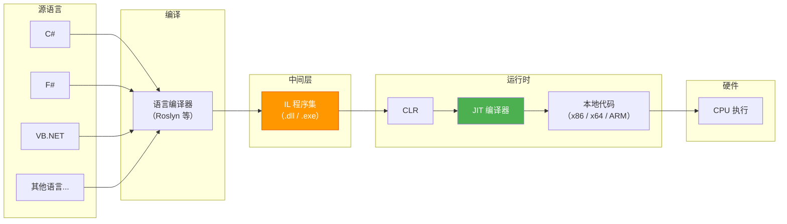

# 什么是 IL

::: tip 核心要点
IL（Intermediate Language）是 .NET 的通用中间语言，所有 .NET 语言编译后都生成 IL 代码。它是 .NET 跨语言、跨平台的基石。
:::

## 一、IL 的定义与别名

IL 有三个常见的名称，它们指向同一个东西：

| 名称 | 全称 | 语境 |
|------|------|------|
| **IL** | Intermediate Language | 最通用的简称，日常使用最多 |
| **MSIL** | Microsoft Intermediate Language | .NET Framework 早期文档中的叫法 |
| **CIL** | Common Intermediate Language | ECMA-335 标准中的正式名称 |

::: important 名称演变
- .NET Framework 1.0 时代，微软称之为 **MSIL**
- 随着标准化推进（ECMA-335），官方更名为 **CIL**，强调"通用"
- 社区和文档中最常用的简称是 **IL**
- 三者完全等价，只是不同语境下的不同叫法
:::

## 二、IL 在 .NET 体系中的位置

IL 是 CLI（Common Language Infrastructure）架构的核心组件。CLI 是一个开放规范，定义了 .NET 运行时的基础架构。



这张图揭示了 IL 的核心价值：**它是所有 .NET 语言的"统一交流语言"**。无论你用 C#、F# 还是 VB.NET 编写代码，编译器最终产出的都是同一种 IL。

## 三、IL 的核心特征

### 3.1 基于栈的指令集

IL 是一种**基于栈（Stack-Based）**的字节码，与基于寄存器的指令集（如 x86）不同，IL 的操作数通过求值栈（Evaluation Stack）传递：

```csharp
// C# 源码
int result = 1 + 2;
```

```il
// 对应的 IL 代码
IL_0000: ldc.i4.1      // 将常量 1 压入求值栈
IL_0001: ldc.i4.2      // 将常量 2 压入求值栈
IL_0002: add            // 弹出两个值，相加，将结果压栈
IL_0003: stloc.0       // 弹出栈顶值，存入局部变量 0
```

::: tip 为什么要基于栈？
基于栈的设计让 IL 完全不依赖具体 CPU 架构。x86 有 16 个通用寄存器，ARM 有 31 个，如果 IL 基于寄存器设计，就必须为每种架构定义不同的指令集。基于栈则统一了抽象，由 JIT 编译器负责将栈操作映射到具体寄存器——这是跨平台的关键设计。
:::

### 3.2 CPU 无关性

IL 代码不包含任何特定 CPU 的指令。同一份 IL 程序集可以在 x86、x64、ARM、ARM64 甚至 WebAssembly 上运行，只要目标平台有对应的 CLR 实现。

### 3.3 类型安全的基础

IL 内置了类型信息，每个操作都带有类型语义。CLR 在加载 IL 时会进行**验证（Verification）**，确保类型安全，防止不安全的内存操作。

### 3.4 面向对象的指令集

IL 原生支持面向对象概念：
- `newobj` —— 创建对象实例
- `callvirt` —— 虚方法调用
- `castclass` —— 类型转换
- `isinst` —— 类型检查
- `box` / `unbox` —— 装箱/拆箱

## 四、IL 的历史演进

| 时间 | 版本/事件 | 里程碑 |
|------|-----------|--------|
| 2002 年 | .NET Framework 1.0 | IL 随 .NET 首次发布，当时称为 MSIL |
| 2003 年 | ECMA-335 标准化 | IL 正式成为开放标准，更名为 CIL |
| 2006 年 | .NET Framework 3.0 | 引入 WPF/WCF/WF，IL 指令集本身无大变化 |
| 2012 年 | .NET Framework 4.5 | `async/await` 编译器生成复杂 IL（状态机） |
| 2016 年 | .NET Core 1.0 | 跨平台 CLR（CoreCLR），IL 不变，运行时变 |
| 2019 年 | .NET Core 3.0 | 引入 ReadyToRun（R2R）预编译优化 |
| 2020 年 | .NET 5 | 统一平台，IL 仍是核心中间表示 |
| 2022 年 | .NET 7 | 引入 Native AOT，IL 可被 AOT 编译器直接消费 |

::: warning 注意
Native AOT 并不意味着 IL 被淘汰。Native AOT 编译器仍然以 IL 程序集作为输入，只是在发布时直接编译为本地代码，跳过了 JIT。IL 作为中间表示的地位不变。
:::

## 五、CLI 架构与 ECMA-335

IL 是 **CLI（Common Language Infrastructure）** 规范的一部分，由 **ECMA-335** 标准定义。CLI 规范分为六个分区（Partition）：

| 分区 | 内容 | 与 IL 的关系 |
|------|------|-------------|
| Partition I | 概念与架构 | 定义了 IL 在整体架构中的位置 |
| Partition II | 元数据 | 定义了 IL 引用的类型系统元数据 |
| **Partition III** | **CIL 指令集** | **IL 指令的权威规范** |
| Partition IV | profiles & libraries | 基础类库约定 |
| Partition V | 调试互换格式 | 调试信息 |
| Partition VI | 附录 | 注解与编译器编写指南 |

::: tip 对学习者而言
Partition III 是学习 IL 指令的最权威参考。当你对某个指令的行为不确定时，查 ECMA-335 Partition III 比任何博客都可靠。
:::

## 六、IL 代码长什么样？

一个完整的 IL 方法示例：

```csharp
// C# 源码
public int Add(int a, int b)
{
    return a + b;
}
```

```il
// IL 反编译输出
.method public hidebysig instance int32
    Add(int32 a, int32 b) cil managed
{
    // 代码大小       9 (0x9)
    .maxstack  2      // 求值栈最大深度为 2
    .locals init (int32 V_0)  // 局部变量声明

    IL_0000: ldarg.1      // 加载参数 a
    IL_0001: ldarg.2      // 加载参数 b
    IL_0002: add           // 相加
    IL_0003: stloc.0      // 存入局部变量
    IL_0004: br.s       IL_0006
    IL_0006: ldloc.0      // 加载局部变量
    IL_0007: ret           // 返回
} // end of method MyClass::Add
```

## 七、参考资料

- [ECMA-335: Common Language Infrastructure (CLI)](https://ecma-international.org/publications-and-standards/standards/ecma-335/) —— IL 的官方规范
- [System.Reflection.Emit.OpCodes 字段](https://learn.microsoft.com/en-us/dotnet/api/system.reflection.emit.opcodes) —— 微软官方 OpCodes API 文档
- [.NET Runtime 源码 - OpCodes.cs](https://github.com/dotnet/runtime/blob/main/src/libraries/System.Private.CoreLib/src/System/Reflection/Emit/OpCodes.cs) —— .NET 运行时中所有操作码的定义

---

## 面试技巧

::: tip 面试常考
1. **"IL、MSIL、CIL 有什么区别？"** —— 没有区别，三者等价。MSIL 是早期叫法，CIL 是标准名称，IL 是通用简称。
2. **"为什么 .NET 要用 IL 而不是直接编译为机器码？"** —— 跨语言互操作（所有 .NET 语言编译为同一种 IL）+ 跨平台（IL 与 CPU 无关，由 CLR/JIT 在运行时适配）+ 安全验证（CLR 可在执行前验证 IL 的类型安全性）。
3. **"IL 是基于栈还是基于寄存器的？"** —— 基于栈。这使其与 CPU 架构无关，由 JIT 负责栈到寄存器的映射优化。
4. **"ECMA-335 哪个分区定义了 IL 指令集？"** —— Partition III。
5. **"Native AOT 是否意味着 IL 被淘汰？"** —— 不是。Native AOT 仍以 IL 程序集为输入，只是跳过了 JIT，在编译时直接生成本地代码。IL 作为中间表示的地位不变。
:::
