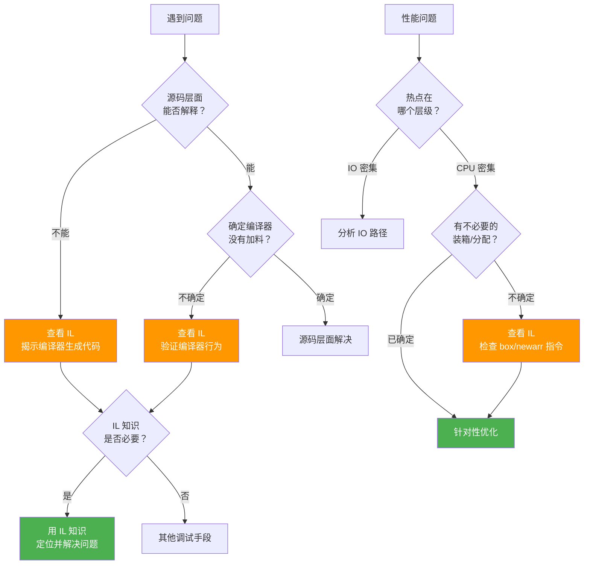

# 为什么学习 IL

::: tip 核心要点
学习 IL 不是为了日常用 IL 写代码，而是为了在关键时刻看透编译器的"障眼法"，理解代码的真实行为。
:::

## 一、五大核心场景

### 1.1 调试编译器生成的代码

C# 编译器会为你生成大量"看不见"的代码，当这些代码出了问题，不懂 IL 就如同盲人摸象。

**迭代器（Iterator）** —— `yield return` 被编译为一个完整的状态机类：

```csharp
// 你写的代码
public IEnumerable<int> GetNumbers()
{
    yield return 1;
    yield return 2;
    yield return 3;
}
```

编译器生成了一个实现了 `IEnumerable<int>` 和 `IEnumerator<int>` 的嵌套类，包含 `MoveNext()`、`Current`、`Reset()` 等方法，以及用于跟踪迭代状态的状态字段。通过 IL 你能清晰看到这个状态机的完整结构。

**异步状态机** —— `async/await` 同样被编译为状态机：

```csharp
// 你写的代码
public async Task<string> FetchDataAsync()
{
    var response = await httpClient.GetAsync(url);
    return await response.Content.ReadAsStringAsync();
}
```

编译器生成了一个 `IAsyncStateMachine` 实现，包含 `MoveNext()` 方法，用状态字段跟踪异步执行进度。调试死锁、异常丢失、`ConfigureAwait` 行为时，看 IL 是唯一可靠的方式。

**闭包（Closure）** —— Lambda 和匿名方法捕获变量时，编译器会生成闭包类：

```csharp
// 你写的代码
int threshold = 10;
Func<int, bool> predicate = x => x > threshold;
```

编译器生成了一个包含 `threshold` 字段的类，Lambda 变成了该类的方法。`threshold` 不是"被捕获到 Lambda 中"，而是被提升到了堆上的闭包对象里——这在 IL 中一目了然。

### 1.2 性能优化

IL 能帮你发现 C# 源码层面看不到的性能陷阱。

**装箱（Boxing）** —— 值类型被隐式转为引用类型：

```csharp
// C# 源码 — 看起来没问题
int value = 42;
object obj = value;   // 装箱
Console.WriteLine(obj);
```

```il
// IL 揭示了装箱操作
IL_0000: ldc.i4.s     42
IL_0002: stloc.0
IL_0003: ldloc.0
IL_0004: box          [mscorlib]System.Int32   // ← 装箱！堆分配！
IL_0009: stloc.1
IL_000a: ldloc.1
IL_000b: call         void [mscorlib]System.Console::WriteLine(object)
```

::: warning 性能隐患
在高频路径（如每帧调用的游戏循环、每秒百万次的请求处理）中，一个隐藏的 `box` 指令就是一次堆分配，会产生 GC 压力。通过 IL 可以精确发现这些热点。
:::

**不必要的分配** —— 例如 `params` 参数在调用时创建了数组：

```csharp
// C# 调用
Log("Error", "File not found", "path.txt");
```

```il
// IL 揭示了数组分配
IL_0000: ldstr        "Error"
IL_0005: ldstr        "File not found"
IL_000a: ldstr        "path.txt"
IL_000f: newarr       [mscorlib]System.String   // ← 数组分配！
IL_0014: call         void Logger::Log(string, string[])
```

### 1.3 AOP 与 IL 注入

许多 .NET 生态中的 AOP 框架直接操作 IL：

| 框架 | 原理 | 典型用途 |
|------|------|----------|
| **Fody** | 编译后修改 IL | 织入 INotifyPropertyChanged、日志 |
| **Harmony** | 运行时 IL 补丁 | 游戏模组、运行时方法替换 |
| **MethodDecorator** | 方法级 IL 注入 | 方法拦截、性能统计 |

```csharp
// Harmony 补丁示例 — 直接操作 IL 级别
[HarmonyPatch(typeof(TargetClass), "TargetMethod")]
class MyPatch
{
    static IEnumerable<CodeInstruction> Transpiler(
        IEnumerable<CodeInstruction> instructions)
    {
        // 遍历并修改 IL 指令
        foreach (var instruction in instructions)
        {
            if (instruction.opcode == OpCodes.Call)
            {
                // 替换方法调用
                instruction.operand = typeof(MyPatch)
                    .GetMethod("Replacement");
            }
            yield return instruction;
        }
    }
}
```

不懂 IL，你无法编写 Transpiler，也无法理解 AOP 框架到底对你的代码做了什么。

### 1.4 构建编译器与代码生成器

如果你要构建或扩展 .NET 代码生成工具，IL 知识是必备的：

- **Roslyn** —— C# 编译器平台，底层生成 IL
- **Expression Trees** —— 运行时构建表达式树，本质是 IL 的数据结构表示
- **Reflection.Emit** —— 运行时动态生成 IL 代码

```csharp
// 用 Reflection.Emit 动态生成一个方法
var method = new DynamicMethod("Add", typeof(int),
    new[] { typeof(int), typeof(int) });
var il = method.GetILGenerator();
il.Emit(OpCodes.Ldarg_0);   // 加载第一个参数
il.Emit(OpCodes.Ldarg_1);   // 加载第二个参数
il.Emit(OpCodes.Add);        // 相加
il.Emit(OpCodes.Ret);        // 返回

var addFunc = (Func<int, int, int>)method.CreateDelegate(
    typeof(Func<int, int, int>));
Console.WriteLine(addFunc(3, 5));  // 输出: 8
```

### 1.5 理解语言特性的真实实现

C# 的许多语法糖在 IL 层面展现了真实面目：

| C# 语法糖 | IL 真相 |
|-----------|---------|
| `foreach` | `try/finally` + `IDisposable.Dispose()` |
| `using` | `try/finally` + `Dispose()` |
| `string interpolation` | `string.Format()` 调用 |
| `lock` | `Monitor.Enter()` + `Monitor.Exit()` 在 `try/finally` 中 |
| `?.` (null 条件) | 条件分支 + `null` 检查 |
| `delegate { }` | 缓存的静态委托实例 |

**foreach 的 IL 真相**：

```csharp
// C# 代码
foreach (var item in list)
{
    Console.WriteLine(item);
}
```

```il
// IL 揭示的完整逻辑（伪代码还原）
IEnumerator<T> enumerator = list.GetEnumerator();
try
{
    while (enumerator.MoveNext())
    {
        T item = enumerator.Current;
        Console.WriteLine(item);
    }
}
finally
{
    IDisposable disposable = enumerator as IDisposable;
    if (disposable != null)
    {
        disposable.Dispose();
    }
}
```

::: important foreach 的隐含契约
即使集合类型不是 `IEnumerable<T>`，只要有 `GetEnumerator()` 方法返回带 `MoveNext()` 和 `Current` 的对象，`foreach` 就能工作。但 IL 中的 `try/finally` 和 `IDisposable` 调用是始终存在的——这是很多人忽略的细节。
:::

## 二、IL 知识何时能帮你？



## 三、一个完整示例：foreach 的 IL 分析

让我们用真实 IL 代码验证 `foreach` 的 `try/finally` + `IDisposable` 模式：

```csharp
// C# 源码
using System;
using System.Collections.Generic;

public class Demo
{
    public void Process(List<int> numbers)
    {
        foreach (var n in numbers)
        {
            Console.WriteLine(n);
        }
    }
}
```

```il
// IL 反编译输出（简化标注）
.method public hidebysig instance void
    Process(class [mscorlib]System.Collections.Generic.List`1<int32> numbers) cil managed
{
    .maxstack 2
    .locals init (
        [0] int32 n,
        [1] valuetype [mscorlib]System.Collections.Generic.List`1/Enumerator<int32> V_1
    )

    IL_0000: ldarg.1
    IL_0001: callvirt instance valuetype
        [mscorlib]System.Collections.Generic.List`1/Enumerator<!0>
        class [mscorlib]System.Collections.Generic.List`1<!T>::GetEnumerator()
    IL_0006: stloc.1
    .try
    {
        Loop:
        IL_0007: ldloca.s V_1
        IL_0009: call instance bool
            [mscorlib]System.Collections.Generic.List`1/Enumerator<int32>::MoveNext()
        IL_000e: brfalse.s EndLoop

        IL_0010: ldloca.s V_1
        IL_0012: call instance !0
            [mscorlib]System.Collections.Generic.List`1/Enumerator<int32>::get_Current()
        IL_0017: stloc.0

        IL_0018: ldloc.0
        IL_0019: call void [mscorlib]System.Console::WriteLine(int32)
        IL_001e: br.s Loop

        EndLoop:
        IL_0020: leave.s EndMethod
    }
    finally
    {
        IL_0022: ldloca.s V_1
        IL_0024: constrained. [mscorlib]System.Collections.Generic.List`1/Enumerator<int32>
        IL_002a: callvirt instance void [mscorlib]System.IDisposable::Dispose()
        IL_002f: endfinally
    }
    EndMethod:
    IL_0030: ret
}
```

::: tip 关键观察
1. `GetEnumerator()` 在 `.try` 块之前调用
2. `MoveNext()` + `get_Current()` 构成循环体
3. `finally` 块中调用了 `IDisposable.Dispose()` —— 即使 `List<T>.Enumerator` 是值类型，IL 仍通过 `constrained.` 前缀调用 `Dispose()`
4. 这意味着 `foreach` 始终会调用 `Dispose()`，对于 `IEnumerable<T>` 这种返回引用类型枚举器的情况尤为重要
:::

## 四、参考资料

- [C# Language Specification — foreach statement](https://learn.microsoft.com/en-us/dotnet/csharp/language-reference/language-specification/statements#1295-the-foreach-statement) —— foreach 的语言规范定义
- [System.Reflection.Emit — DynamicMethod](https://learn.microsoft.com/en-us/dotnet/api/system.reflection.emit.dynamicmethod) —— 动态方法生成
- [HarmonyLib Documentation](https://harmony.pardeike.net/) —— Harmony IL 补丁框架
- [Fody — GitHub](https://github.com/Fody/Fody) —— Fody IL 织入框架

---

## 面试技巧

::: tip 面试常考
1. **"C# 的 foreach 在 IL 层面做了什么？"** —— 生成了 `try/finally` 块，在 `finally` 中调用枚举器的 `Dispose()`。所以 `foreach` 不仅仅是语法糖，它还确保了资源释放。
2. **"如何发现代码中的隐式装箱？"** —— 查看IL中的 `box` 指令。常见场景：值类型传入 `object` 参数、调用值类型的 `GetType()`、枚举作为字典键时的比较。
3. **"Harmony 的 Transpiler 是什么？"** —— 一种方法级 IL 补丁技术，通过遍历和修改 `CodeInstruction` 序列来改变方法行为。需要理解 IL 指令才能正确使用。
4. **"async/await 编译后变成了什么？"** —— 一个实现了 `IAsyncStateMachine` 的结构体/类，核心是 `MoveNext()` 方法，用状态字段跟踪异步执行进度。
5. **"学习 IL 对日常开发有什么帮助？"** —— 理解语法糖的真实行为（避免踩坑）、发现性能隐患（装箱、分配）、调试编译器生成的代码（状态机、闭包）、编写 IL 注入代码。
:::
