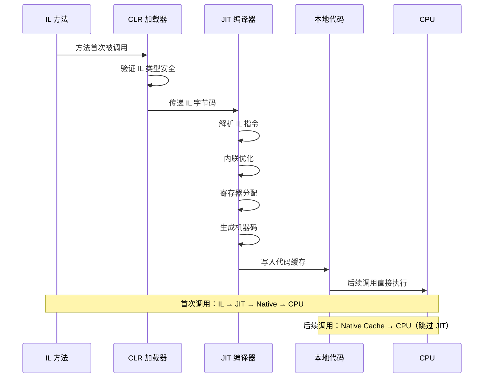

# IL 执行模型

::: tip 核心要点
IL 基于栈式虚拟机模型执行。理解求值栈（Evaluation Stack）的 push/pop 语义，是读懂 IL 代码的钥匙。
:::

## 一、栈式虚拟机模型

IL 虚拟机是一个**栈式机器（Stack Machine）**。它没有寄存器的概念，所有运算都通过**求值栈（Evaluation Stack）**完成：

1. **入栈（Push）** —— 将值压入栈顶
2. **出栈（Pop）** —— 从栈顶弹出值
3. **运算** —— 弹出操作数，计算结果，压入栈顶

```
求值栈示意（从底到顶）：

执行 ldc.i4.1 后：   [ 1 ]
执行 ldc.i4.2 后：   [ 1, 2 ]
执行 add 后：        [ 3 ]     ← 弹出 1 和 2，压入结果 3
```

### 1.1 maxstack

每个 IL 方法都声明了 `.maxstack`，表示该方法的求值栈在任意时刻的最大深度：

```il
.method private hidebysig instance int32 Add(int32 a, int32 b) cil managed
{
    .maxstack 2    // 求值栈最多同时容纳 2 个值
    // ...
}
```

::: warning maxstack 不是栈大小
`maxstack` 是求值栈的**最大深度**（以"槽位"为单位），不是字节数。JIT 编译器用这个信息来优化栈帧布局。如果 `maxstack` 值小于实际需要的深度，CLR 验证器会拒绝该方法的验证。
:::

### 1.2 逐指令的求值栈状态

下面用一个完整示例，标注每条指令执行后的求值栈状态：

```csharp
// C# 源码
public int Multiply(int x, int y)
{
    int result = x * y;
    return result;
}
```

```il
// IL 代码 + 求值栈状态注释
.method public hidebysig instance int32 Multiply(int32 x, int32 y) cil managed
{
    .maxstack 2
    .locals init (int32 result)   // 局部变量 result = V_0

    //                                    求值栈状态
    IL_0000: ldarg.1          //       [ x ]           ← 加载参数 x
    IL_0001: ldarg.2          //       [ x, y ]        ← 加载参数 y
    IL_0002: mul              //       [ x*y ]         ← 弹出 x,y，压入乘积
    IL_0003: stloc.0          //       [ ]             ← 弹出，存入 result
    IL_0004: ldloc.0          //       [ result ]      ← 加载 result
    IL_0005: ret              //       [ ]             ← 弹出返回值，方法结束
}
```

::: important push/pop 是 IL 的基本节奏
读懂 IL 的秘诀就是追踪求值栈。每条指令要么入栈、要么出栈、要么既出又入。养成"脑内模拟栈"的习惯，IL 代码就不再难懂。
:::

## 二、JIT 编译全流程

IL 不会直接被 CPU 执行，它需要经过 **JIT（Just-In-Time）编译器** 转换为本地机器码。



### 2.1 分层编译（Tiered Compilation）

.NET Core 2.1 引入了**分层编译**，JIT 对方法采用不同的优化级别：

| 层级 | 优化级别 | 何时使用 | 特点 |
|------|---------|---------|------|
| Tier 0 | 快速编译，最小优化 | 方法首次调用 | 编译快，代码质量低，带仪器插桩 |
| Tier 1 | 完全优化 | 热点方法被重新 JIT | 编译慢，代码质量高（内联、循环优化等） |


### 2.2 ReadyToRun（R2R）

.NET Core 3.0 引入了 **ReadyToRun** 预编译技术：

- 在发布时将 IL 预编译为本地代码，存入 `.readytorun` 段
- 应用启动时直接加载预编译的本地代码，跳过 JIT
- 权衡：更大的文件体积，换更快的启动速度
- 后续仍可能对热点方法进行 Tier 1 重新 JIT

## 三、方法头格式

每个 IL 方法的开头都有一个**方法头（Method Header）**，分为两种格式：

### 3.1 Tiny 方法头

当方法满足以下条件时使用 Tiny 格式：
- 代码长度 < 64 字节
- 无局部变量
- 无异常处理
- maxstack ≤ 8

```
Tiny Header（2 字节）：
┌──────────────────────────────────────────────────────────┐
│ Byte 0                                                  │
│ ┌───┬───────────────────────────────────────────────────┐│
│ │ 02│        Code Size (6 bits)                         ││
│ └───┴───────────────────────────────────────────────────┘│
└──────────────────────────────────────────────────────────┘

位 0-1 = 10 (Tiny 标志)
位 2-7 = 代码大小（1-63 字节）
```

### 3.2 Fat 方法头

不满足 Tiny 条件时使用 Fat 格式：

```
Fat Header（12 字节）：
┌──────────┬──────────┬─────────────────────────────────────┐
│ Flags    │ MaxStack │ Code Size                           │
│ (2 bytes)│ (2 bytes)│ (4 bytes)                           │
├──────────┴──────────┼─────────────────────────────────────┤
│ LocalVarSig Token   │ (4 bytes)                           │
└─────────────────────┴─────────────────────────────────────┘

Flags 位定义：
  位 0-1   = 11 (Fat 标志)
  位 3     = MoreSects (是否有异常处理表)
  位 4     = InitLocals (是否自动初始化局部变量)
  位 5-12  = 头大小（以 4 字节为单位，通常为 3 = 12 字节）
```

::: tip InitLocals 标志
当 `InitLocals = 1` 时，CLR 会自动将所有局部变量初始化为 0/null。这就是为什么 C# 中的局部变量"默认有值"——但 C# 编译器仍要求你显式赋值后才能使用，这是编译器的安全检查，不是 CLR 的要求。
:::

## 四、局部变量签名

方法的局部变量通过 **LocalVarSig** 元数据标记引用：

```il
.locals init (int32 V_0, string V_1, int64 V_2)
```

- `init` 关键字表示所有变量初始化为零（对应 Fat Header 的 InitLocals 标志）
- 每个变量按索引引用：`V_0` → `ldloc.0` / `stloc.0`，`V_1` → `ldloc.1` / `stloc.1`
- 局部变量可以重叠（union），通过不同的槽位索引访问同一内存

## 五、异常处理表

异常处理信息存储在方法头的扩展节（Extra Data Sections）中：

```il
.try
{
    IL_0000: ...
    IL_0005: leave.s EndTry
}
catch [mscorlib]System.Exception
{
    IL_0007: pop
    IL_0008: ...
    IL_000d: leave.s EndTry
}
finally
{
    IL_000f: ...
    IL_0012: endfinally
}
EndTry:
IL_0014: ret
```

异常子句的存储格式：

| 字段 | 大小 | 说明 |
|------|------|------|
| Flags | 4 bytes | 异常类型（COR_ILEXCEPTION_CLAUSE_xxx） |
| TryOffset | 4 bytes | try 块起始偏移 |
| TryLength | 4 bytes | try 块长度 |
| HandlerOffset | 4 bytes | handler 起始偏移 |
| HandlerLength | 4 bytes | handler 长度 |
| ClassToken / FilterOffset | 4 bytes | catch 类型的元数据标记 / filter 偏移 |

Flags 值：

| 值 | 含义 |
|----|------|
| 0x0000 | catch（捕获指定类型异常） |
| 0x0001 | filter（条件过滤） |
| 0x0002 | finally（始终执行） |
| 0x0004 | fault（异常时执行，类似 finally 但仅异常时） |

## 六、指令编码

IL 指令的编码分为两种长度：

### 6.1 单字节操作码

操作码为 1 字节（0x00 - 0xFE），覆盖常用指令：

```
0x00  nop
0x01  break
0x02  ldarg.0
0x03  ldarg.1
...
0x14  ldloc.0
0x15  ldloc.1
...
0x58  add
0x59  sub
0x5A  mul
0x5B  div
...
0x26  pop
0x27  ret
```

### 6.2 双字节操作码

以 `0xFE` 为前缀，后跟第二字节：

```
0xFE 0x00  arglist
0xFE 0x01  ceq
0xFE 0x02  cgt
0xFE 0x03  cgt.un
0xFE 0x04  clt
0xFE 0x05  clt.un
0xFE 0x06  ldftn
0xFE 0x07  ldvirtftn
...
0xFE 0x09  ldarg
0xFE 0x0A  ldarga
0xFE 0x0B  starg
0xFE 0x0C  ldloc
0xFE 0x0D  ldloca
0xFE 0x0E  stloc
0xFE 0x16  constrained.
0xFE 0x19  tail.
```

### 6.3 内联操作数

许多指令后跟操作数（Operand），其编码长度取决于指令类型：

| 前缀 | 操作数大小 | 示例指令 |
|------|-----------|---------|
| `inline` | 4 bytes | `call`, `newobj`, `ldfld`（元数据标记） |
| `short` | 1 byte | `ldc.i4.s`, `br.s`, `leave.s` |
| `inline var` | 2 bytes | `ldloc`, `stloc`（变量索引 > 255） |
| `short var` | 1 byte | `ldloc.s`, `stloc.s`（变量索引 ≤ 255） |
| `inline i8` | 8 bytes | `ldc.i8`（64 位常量） |
| `inline r4` | 4 bytes | `ldc.r4`（float32） |
| `inline r8` | 8 bytes | `ldc.r8`（float64） |
| `inline br` | 4 bytes | `br`, `beq`, `bne.un`（远跳转） |
| `short br` | 1 byte | `br.s`, `beq.s`（近跳转） |

## 七、完整示例：带注释的方法

```csharp
// C# 源码
public static int Calculate(int a, int b, bool flag)
{
    int temp;
    if (flag)
        temp = a + b;
    else
        temp = a - b;
    return temp * 2;
}
```

```il
// IL 反编译输出（带求值栈状态注释）
.method public hidebysig static int32 Calculate(
    int32 a, int32 b, bool flag) cil managed
{
    // Fat Header: Flags=0x13, MaxStack=2, CodeSize=22, LocalVarSig=0x10
    .maxstack 2
    .locals init (int32 temp)    // V_0 = temp

    //                                   求值栈状态
    IL_0000: ldarg.2          //       [ flag ]       ← 加载 flag 参数
    IL_0001: brfalse.s  IL_0009  //    [ ]            ← if (!flag) 跳转

    IL_0003: ldarg.0          //       [ a ]
    IL_0004: ldarg.1          //       [ a, b ]
    IL_0005: add              //       [ a+b ]
    IL_0006: stloc.0          //       [ ]            ← temp = a + b
    IL_0007: br.s     IL_000d  //    [ ]            ← 跳到 return

    IL_0009: ldarg.0          //       [ a ]
    IL_000a: ldarg.1          //       [ a, b ]
    IL_000b: sub              //       [ a-b ]
    IL_000c: stloc.0          //       [ ]            ← temp = a - b

    IL_000d: ldloc.0          //       [ temp ]
    IL_000e: ldc.i4.2         //       [ temp, 2 ]
    IL_000f: mul              //       [ temp*2 ]
    IL_0010: stloc.0          //       [ ]            ← temp = temp * 2
    IL_0011: ldloc.0          //       [ temp ]
    IL_0012: ret              //       [ ]            ← 返回 temp
}
```

## 八、参考资料

- [ECMA-335 Partition III — CIL Instruction Set](https://ecma-international.org/publications-and-standards/standards/ecma-335/) —— IL 指令编码和方法头格式的权威规范
- [Method Headers — .NET IL Format](https://learn.microsoft.com/en-us/dotnet/api/system.reflection.emit.methodbody) —— MethodBody API 文档
- [Tiered Compilation — .NET Runtime](https://github.com/dotnet/runtime/blob/main/docs/design/features/tiered-compilation.md) —— 分层编译设计文档
- [ReadyToRun Compilation](https://learn.microsoft.com/en-us/dotnet/core/deploying/ready-to-run) —— R2R 预编译官方文档

---

## 面试技巧

::: tip 面试常考
1. **"IL 是基于栈的虚拟机，这对跨平台有什么意义？"** —— 基于栈的设计让 IL 完全不依赖 CPU 寄存器架构，JIT 编译器负责将栈操作映射到具体寄存器，一份 IL 可在不同架构上运行。
2. **"什么是 maxstack？设置错误会怎样？"** —— maxstack 是方法求值栈的最大深度。设置过小会导致 CLR 验证失败（VerificationException），设置过大只是浪费 JIT 的栈帧分配。
3. **"JIT 的分层编译是怎么回事？"** —— 方法首次调用用 Tier 0（快速编译，最小优化），热点方法自动重新 JIT 为 Tier 1（完全优化），兼顾启动速度和运行时性能。
4. **"Tiny Header 和 Fat Header 有什么区别？"** —— Tiny 适用于代码 < 64 字节、无局部变量、无异常的简单方法，仅占 1-2 字节；Fat Header 占 12 字节，支持局部变量、异常处理等完整功能。
5. **"IL 指令的操作数编码有几种长度？"** —— 短操作数（1 byte，如 `.s` 后缀指令）和内联操作数（4/8 bytes，如元数据标记、远跳转偏移）。短操作数用于减小代码体积。
6. **"InitLocals 标志是什么？"** —— 当 InitLocals=1 时，CLR 自动将所有局部变量初始化为零/null。C# 编译器默认设置此标志，这就是 C# 局部变量"默认有值"的原因——但编译器仍要求显式赋值。
:::
