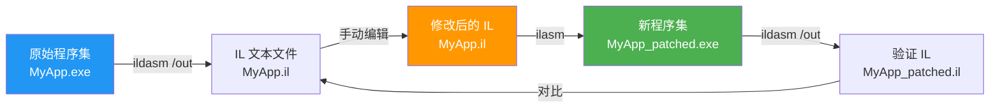

# ildasm 与 ilasm

::: tip 核心要点
`ildasm` 和 `ilasm` 是 .NET 自带的 IL 反汇编器和汇编器，它们组合使用可以实现"反编译 → 修改 → 重新编译"的往返工程（Round-tripping）。
:::

## 一、ildasm —— IL 反汇编器

`ildasm`（IL Disassembler）随 .NET SDK 一起安装，用于将 .NET 程序集反编译为 IL 文本。

### 1.1 基本用法

```bash
# 打开 GUI 模式
ildasm MyApp.exe

# 输出 IL 文本到文件
ildasm MyApp.exe /out:MyApp.il

# 仅输出文本（无 GUI）
ildasm MyApp.exe /text

# 带 C# 源码行号注释
ildasm MyApp.exe /source /out:MyApp.il
```

### 1.2 常用命令行标志

| 标志 | 说明 |
|------|------|
| `/out:filename` | 输出到指定文件 |
| `/text` | 文本模式输出（不打开 GUI） |
| `/source` | 在 IL 中注释原始 C# 源码行号 |
| `/linenum` | 包含行号信息 |
| `/bytes` | 显示每条 IL 指令的十六进制字节 |
| `/tokens` | 显示元数据标记 |
| `/header` | 显示 PE 头信息和 CLR 头 |
| `/stats` | 显示程序集统计信息 |
| `/utf8` | 使用 UTF-8 输出 |

### 1.3 GUI 模式导航

启动 `ildasm MyApp.exe` 后，你会看到一个树形视图：

```
 MyApp.exe
 ├── MANIFEST
 │   ├── .assembly extern mscorlib
 │   ├── .assembly MyApp
 │   └── .module MyApp.exe
 ├── Namespace.MyClass
 │   ├── .class private auto ansi beforefieldinit
 │   ├── .field private int32 _value
 │   ├── .method public int32 get_Value()
 │   ├── .method public void set_Value(int32)
 │   ├── .property int32 Value()
 │   ├── .method public void .ctor()
 │   └── .method public int32 Add(int32, int32)
 └── <Module>
```

双击任何方法节点即可查看该方法的 IL 代码。

::: tip 快捷操作
- 双击方法：查看 IL 代码
- 双击字段：查看字段元数据
- 双击属性：查看属性关联的 getter/setter
- `Ctrl+M`：查看元信息
- `View → Statistics`：查看程序集统计
:::

### 1.4 ildasm 输出示例

```csharp
// C# 源码
using System;

public class Calculator
{
    private int _value;

    public int Value
    {
        get { return _value; }
        set { _value = value; }
    }

    public int Add(int a, int b)
    {
        return a + b;
    }
}
```

```il
// ildasm /out 输出
.class public auto ansi beforefieldinit Calculator
       extends [mscorlib]System.Object
{
  .field private int32 _value
  .method public hidebysig instance int32
          get_Value() cil managed
  {
    .maxstack  8
    IL_0000:  ldarg.0
    IL_0001:  ldfld      int32 Calculator::_value
    IL_0006:  ret
  } // end of method Calculator::get_Value

  .method public hidebysig instance void
          set_Value(int32 'value') cil managed
  {
    .maxstack  8
    IL_0000:  ldarg.0
    IL_0001:  ldarg.1
    IL_0002:  stfld      int32 Calculator::_value
    IL_0007:  ret
  } // end of method Calculator::set_Value

  .method public hidebysig instance int32
          Add(int32 a, int32 b) cil managed
  {
    .maxstack  8
    IL_0000:  ldarg.1
    IL_0001:  ldarg.2
    IL_0002:  add
    IL_0003:  ret
  } // end of method Calculator::Add

  .method public hidebysig instance void
          .ctor() cil managed
  {
    .maxstack  8
    IL_0000:  ldarg.0
    IL_0001:  call       instance void [mscorlib]System.Object::.ctor()
    IL_0006:  ret
  } // end of method Calculator::.ctor

  .property instance int32 Value()
  {
    .get instance int32 Calculator::get_Value()
    .set instance void Calculator::set_Value(int32)
  } // end of property Calculator::Value
} // end of class Calculator
```

## 二、ilasm —— IL 汇编器

`ilasm`（IL Assembler）用于将 `.il` 文本文件编译为 .NET 程序集。

### 2.1 基本用法

```bash
# 编译为 .exe
ilasm MyApp.il

# 编译为 .dll
ilasm MyApp.il /dll

# 指定输出文件名
ilasm MyApp.il /output:MyPatchedApp.exe

# 包含调试信息
ilasm MyApp.il /debug
ilasm MyApp.il /debug=impl  # 隐藏调试信息（嵌入 PDB）
ilasm MyApp.il /debug=opt   # 优化调试信息
```

### 2.2 常用命令行标志

| 标志 | 说明 |
|------|------|
| `/dll` | 输出 .dll 程序集 |
| `/exe` | 输出 .exe 程序集（默认） |
| `/output:filename` | 指定输出文件名 |
| `/debug` | 生成调试信息 |
| `/optimize` | 启用优化 |
| `/resource:filename` | 嵌入资源文件 |
| `/key:filename` | 使用强名称密钥签名 |
| `/subsystem:version` | 指定子系统版本 |
| `/x64` / `/x86` / `/arm64` | 指定目标平台 |

## 三、往返工程（Round-tripping）

往返工程是 ildasm + ilasm 的核心工作流：反编译程序集 → 修改 IL → 重新编译。



::: important 往返工程的限制
1. **签名程序集** —— 强名称签名的程序集修改后签名会失效，需要用 `/key` 重新签名或先去除签名
2. **资源文件** —— ildasm 会生成 `.res` 资源文件，ilasm 编译时需要包含
3. **混淆程序集** —— 经过混淆的程序集可能无法正确反编译
4. **混合模式程序集** —— 包含本地代码（C++/CLI）的程序集无法完整往返
:::

## 四、实战：修补程序集

### 4.1 场景

假设有一个第三方库，其中 `LicenseChecker.IsValid()` 方法始终返回 `false`。我们需要将其修改为始终返回 `true`。

### 4.2 步骤

**第一步：反编译**

```bash
ildasm ThirdPartyLib.dll /out:ThirdPartyLib.il
```

**第二步：找到目标方法**

在 `ThirdPartyLib.il` 中搜索 `IsValid`：

```il
.method public hidebysig instance bool
        IsValid() cil managed
{
  // 代码大小       13 (0xd)
  .maxstack  8
  IL_0000:  nop
  IL_0001:  ldc.i4.0         // ← 加载常量 0 (false)
  IL_0002:  br.s       IL_0004
  IL_0004:  stloc.0
  IL_0005:  br.s       IL_0007
  IL_0007:  ldloc.0
  IL_0008:  ret
} // end of method LicenseChecker::IsValid
```

**第三步：修改 IL**

将 `ldc.i4.0` 改为 `ldc.i4.1`：

```il
.method public hidebysig instance bool
        IsValid() cil managed
{
  // 代码大小       13 (0xd)
  .maxstack  8
  IL_0000:  nop
  IL_0001:  ldc.i4.1         // ← 修改：加载常量 1 (true)
  IL_0002:  br.s       IL_0004
  IL_0004:  stloc.0
  IL_0005:  br.s       IL_0007
  IL_0007:  ldloc.0
  IL_0008:  ret
} // end of method LicenseChecker::IsValid
```

**第四步：重新编译**

```bash
ilasm ThirdPartyLib.il /dll /output:ThirdPartyLib_patched.dll
```

**第五步：验证**

```bash
ildasm ThirdPartyLib_patched.dll /text | grep -A 10 "IsValid"
```

::: warning 法律与道德
修改第三方程序集可能违反许可协议。此技术应用于合法场景：调试自己的代码、修复 bug、学习研究等。在生产环境中修补第三方库前，请确认你有权这样做。
:::

## 五、ildasm 的高效使用技巧

### 5.1 查看元数据标记

```bash
ildasm MyApp.exe /tokens /text
```

输出中每条指令旁会显示元数据标记（如 `Token: 0x06000001`），方便你交叉引用类型和方法。

### 5.2 查看字节级编码

```bash
ildasm MyApp.exe /bytes /text
```

输出示例：

```il
  IL_0000:  /* 02   |                  */ ldarg.0
  IL_0001:  /* 7B   | 04000001         */ ldfld      int32 MyClass::_value
  IL_0006:  /* 2A   |                  */ ret
```

这让你看到每条 IL 指令的实际字节编码，对于理解指令格式很有帮助。

### 5.3 查看 PE 头信息

```bash
ildasm MyApp.exe /header /text
```

输出 PE 文件头、CLR 头、入口点信息等，对理解 .NET 程序集的文件格式很有价值。

## 六、.NET 6+ 中的 ildasm 变化

从 .NET 6 开始，ildasm 的定位有所变化：

| 版本 | ildasm 状态 | 替代方案 |
|------|-------------|---------|
| .NET Framework | 随 SDK 安装，路径：`C:\Program Files\Microsoft SDKs\Windows\...` | - |
| .NET Core 3.x | 需单独安装或通过 NuGet 获取 | ILSpy、dnSpy |
| .NET 5/6+ | `ildasm` 作为 `dotnet-ildasm` 工具 | ILSpy、SharpLab |

```bash
# .NET 6+ 中安装 ildasm 全局工具
dotnet tool install -g dotnet-ildasm
```

::: tip 推荐
在 .NET 5+ 环境下，推荐使用 ILSpy 或 dnSpy 替代 ildasm，它们功能更强大、界面更友好。下一章将详细介绍这些工具。
:::

## 七、参考资料

- [ildasm — Microsoft Learn](https://learn.microsoft.com/en-us/dotnet/framework/tools/ildasm-exe-il-disassembler) —— ildasm 官方文档
- [ilasm — Microsoft Learn](https://learn.microsoft.com/en-us/dotnet/framework/tools/ilasm-exe-il-assembler) —— ilasm 官方文档
- [ECMA-335 Partition II — Metadata](https://ecma-international.org/publications-and-standards/standards/ecma-335/) —— 元数据格式规范
- [dotnet-ildasm — GitHub](https://github.com/pjbgf/dotnet-ildasm) —— .NET 6+ ildasm 替代工具

---

## 面试技巧

::: tip 面试常考
1. **"ildasm 和 ilasm 分别是什么？"** —— ildasm 是 IL 反汇编器，将 .NET 程序集转为 IL 文本；ilasm 是 IL 汇编器，将 IL 文本编译为 .NET 程序集。
2. **"什么是往返工程？有什么限制？"** —— ildasm → 修改 → ilasm 的循环。限制：强名称签名会失效、资源文件需要单独处理、混淆程序集可能无法正确反编译。
3. **"如何修改一个已编译的 .NET 程序集？"** —— 用 ildasm 反编译为 .il 文件，修改 IL 代码，用 ilasm 重新编译。注意签名和资源文件。
4. **"ildasm 的 /source 标志有什么用？"** —— 在 IL 输出中注释原始 C# 源码行号，方便对照 C# 和 IL。
5. **"在 .NET 6+ 中还能用 ildasm 吗？"** —— 原生 ildasm 不再随 SDK 安装，但可通过 `dotnet-ildasm` 全局工具获取。推荐使用 ILSpy 或 dnSpy 作为替代。
:::
