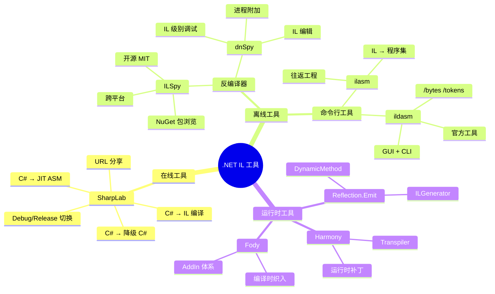

# SharpLab 与 dnSpy

::: tip 核心要点
SharpLab 是最便捷的在线 C#→IL 探索工具，dnSpy 是最强大的离线 .NET 调试/反编译器，ILSpy 是最佳开源反编译器。三者互补，覆盖日常 IL 学习和调试的全部需求。
:::

## 一、SharpLab —— 在线 IL 探索器

[SharpLab](https://sharplab.io) 是一个在线工具，可以实时将 C# 代码编译为 IL、JIT ASM 或 C# 降级代码。

### 1.1 基本使用

1. 打开 [sharplab.io](https://sharplab.io)
2. 在左侧编辑器输入 C# 代码
3. 右侧自动显示编译结果

### 1.2 分支视图（Results View）

SharpLab 支持多种输出视图：

| 视图 | 说明 | 用途 |
|------|------|------|
| **C#** | 降级后的 C# 代码（Lowered C#） | 查看编译器生成的代码（状态机、闭包等） |
| **IL** | IL 反汇编输出 | 学习 IL 指令、理解底层行为 |
| **JIT ASM** | JIT 编译后的本地汇编代码 | 性能分析、理解 JIT 优化 |
| **JIT ASM (Diff)** | 对比优化前后的 JIT 输出 | 比较不同优化级别 |
| **Verify Only** | 仅验证代码合法性 | 快速检查语法错误 |

### 1.3 优化级别

SharpLab 支持 C# 编译器的不同优化级别：

| 设置 | 对应 | 特点 |
|------|------|------|
| **Debug** | `/optimize-` | 保留所有 `nop`、局部变量、分支，IL 更易读 |
| **Release** | `/optimize+` | 移除 `nop`、优化常量折叠、内联短跳转 |

::: important 学习 IL 时用 Debug 模式
Debug 模式下的 IL 更完整，保留了 `nop` 指令和所有局部变量，便于对照 C# 源码理解。Release 模式的 IL 更精简，适合观察编译器优化。
:::

### 1.4 探索 async 状态机

SharpLab 是探索 `async/await` 编译器生成代码的最佳工具：

```csharp
// 在 SharpLab 中输入
using System.Threading.Tasks;

public class AsyncDemo
{
    public async Task<int> ComputeAsync()
    {
        int a = await GetValueAsync();
        int b = await GetValueAsync();
        return a + b;
    }

    private Task<int> GetValueAsync() => Task.FromResult(42);
}
```

在 **C#** 视图中，你会看到编译器生成的完整状态机类，包括：
- `struct <ComputeAsync>d__0 : IAsyncStateMachine`
- `MoveNext()` 方法中的 `<>1__state` 状态切换
- `<>u__1` TaskAwaiter 字段
- `<>t__builder` AsyncTaskMethodBuilder

在 **IL** 视图中，你能看到 `MoveNext()` 方法的完整 IL，包括所有 `try/catch` 块和状态跳转。

### 1.5 实用技巧

- **对比 Debug/Release**：切换优化级别，观察 `nop` 被移除、常量折叠等优化
- **JIT ASM 分析**：在 Release 模式下查看 JIT ASM，观察方法内联、循环优化
- **实验语言特性**：输入 `foreach`、`using`、`lock` 等语法糖，查看其 IL 实现
- **分享链接**：SharpLab 支持通过 URL 分享代码，方便讨论

## 二、dnSpy —— .NET 调试与反编译

[dnSpy](https://github.com/dnSpyEx/dnSpy) 是一个强大的 .NET 调试器和程序集编辑器，支持 IL 级别的调试和编辑。

### 2.1 核心功能

| 功能 | 说明 |
|------|------|
| **反编译** | 将 .NET 程序集反编译为 C#、IL 或 VB.NET |
| **IL 编辑** | 直接在 IL 级别编辑方法体 |
| **调试** | 附加到进程、设置断点、单步执行 |
| **编辑程序集** | 修改方法、添加类型、保存修改后的程序集 |
| **搜索** | 按类型、方法、字符串、元数据标记搜索 |

### 2.2 IL 级别调试

dnSpy 支持在 IL 指令级别设置断点和单步执行：

1. 打开程序集，切换到 **IL 视图**（右键 → "View IL"）
2. 在 IL 指令旁点击设置断点（红色圆点）
3. 启动调试（`Debug → Start Debugging`）
4. 逐指令单步执行，观察求值栈变化

::: tip IL 级别调试的独特价值
当 C# 源码不可用时（第三方库、编译器生成代码），IL 级别调试是唯一能深入代码内部的方式。你可以观察每条 IL 指令的执行效果，查看求值栈的状态变化。
:::

### 2.3 编辑 IL

dnSpy 支持直接编辑方法的 IL 代码：

1. 右键方法 → "Edit IL Instructions"
2. 在 IL 编辑器中添加、删除、修改指令
3. 点击 "Compile" 验证修改
4. 保存修改后的程序集（`File → Save Module`）

### 2.4 附加到进程

dnSpy 可以附加到正在运行的 .NET 进程：

1. `Debug → Attach to Process`
2. 选择目标进程
3. 设置断点并调试

这对于调试生产环境问题非常有用（在允许的安全前提下）。

## 三、ILSpy —— 开源反编译器

[ILSpy](https://github.com/icsharpcode/ILSpy) 是一个开源的 .NET 程序集浏览器和反编译器。

### 3.1 核心特性

| 特性 | 说明 |
|------|------|
| **多语言反编译** | C#、IL、VB.NET |
| **NuGet 包浏览** | 直接打开 .nupkg 文件 |
| **搜索** | 全文本搜索、类型搜索 |
| **分析** | 查找类型/方法的引用和被引用 |
| **插件系统** | 支持扩展插件 |
| **跨平台** | Windows、macOS、Linux |

### 3.2 ILSpy vs dnSpy

| 特性 | ILSpy | dnSpy |
|------|-------|-------|
| 开源 | MIT 许可 | GPL 许可 |
| 调试功能 | 无 | 有（IL 级别调试） |
| IL 编辑 | 只读 | 可编辑 |
| NuGet 支持 | 有 | 无 |
| 跨平台 | 有（Avalonia） | 仅 Windows |
| 活跃度 | 非常活跃 | 社区维护 |
| 适用场景 | 阅读/分析代码 | 调试/编辑程序集 |

::: tip 选择建议
- **只想查看代码** → ILSpy（开源、跨平台、NuGet 支持）
- **需要调试或编辑** → dnSpy（IL 级别调试和编辑）
- **快速实验** → SharpLab（在线、无需安装）
:::

## 四、工具全景图



## 五、工具对比总结

| 工具 | 类型 | IL 查看 | IL 编辑 | 调试 | JIT ASM | 价格 |
|------|------|---------|---------|------|---------|------|
| **SharpLab** | 在线 | Yes | No | No | Yes | 免费 |
| **dnSpy** | 桌面 | Yes | Yes | Yes | No | 免费 |
| **ILSpy** | 桌面 | Yes | No | No | No | 免费 |
| **ildasm** | CLI | Yes | No | No | No | 随 SDK |
| **ilasm** | CLI | - | Yes | No | No | 随 SDK |

## 六、实战：用 SharpLab 分析闭包

让我们用 SharpLab 分析 Lambda 闭包的 IL 实现：

```csharp
// 输入到 SharpLab
using System;

public class ClosureDemo
{
    public void Demo()
    {
        int x = 10;
        Action action = () => Console.WriteLine(x);
        action();
    }
}
```

在 **C#（Lowered）** 视图中，你会看到编译器生成了：

```csharp
// 编译器生成的降级代码
public class ClosureDemo
{
    [CompilerGenerated]
    private sealed class <>c__DisplayClass0_0
    {
        public int x;

        internal void <Demo>b__0()
        {
            Console.WriteLine(x);
        }
    }

    public void Demo()
    {
        <>c__DisplayClass0_0 CS$<>8__locals0 = new <>c__DisplayClass0_0();
        CS$<>8__locals0.x = 10;
        Action action = new Action(CS$<>8__locals0.<Demo>b__0);
        action();
    }
}
```

::: important 闭包的本质
Lambda 捕获的变量不是"复制"到 Lambda 中的，而是被提升到了编译器生成的闭包类中。Lambda 本身变成了闭包类的方法。这意味着对捕获变量的修改在 Lambda 内外是同步的——因为它们引用的是同一个堆上的字段。
:::

## 七、参考资料

- [SharpLab](https://sharplab.io) —— 在线 C#→IL 编译器
- [dnSpy — GitHub](https://github.com/dnSpyEx/dnSpy) —— dnSpy 调试器
- [ILSpy — GitHub](https://github.com/icsharpcode/ILSpy) —— ILSpy 反编译器
- [dnSpy Documentation](https://github.com/dnSpyEx/dnSpy/wiki) —— dnSpy 使用文档

---

## 面试技巧

::: tip 面试常考
1. **"SharpLab 的 C# 视图和 IL 视图分别有什么用？"** —— C# 视图显示编译器降级后的 C# 代码（状态机、闭包等），IL 视图显示 IL 反汇编输出，JIT ASM 视图显示本地机器码。
2. **"dnSpy 能做什么而 ILSpy 做不到的？"** —— IL 级别调试（断点、单步执行）和 IL 编辑（修改方法体、保存修改后的程序集）。
3. **"如何在线分析 async/await 的实现？"** —— 在 SharpLab 中输入 async 方法，切换到 C# 视图查看编译器生成的状态机，切换到 IL 视图查看 `MoveNext()` 方法的 IL。
4. **"什么场景下需要 IL 级别调试？"** —— C# 源码不可用（第三方库、编译器生成代码）、需要逐指令观察求值栈变化、排查 JIT 相关的运行时问题。
5. **"ILSpy 的 NuGet 包浏览功能有什么用？"** —— 直接打开 .nupkg 文件查看内部实现，无需先创建项目再安装包，方便快速研究库的源码。
:::
