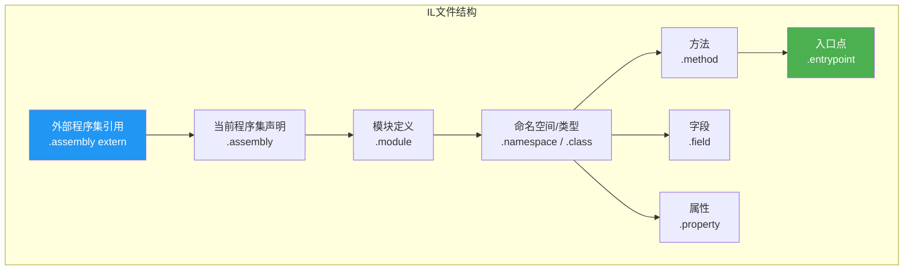
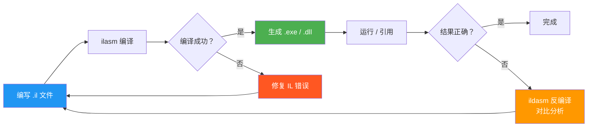

# 编写第一个 IL 程序

::: tip 核心要点
手写一个 .il 文件并用 ilasm 编译，是理解 IL 程序集结构的最佳方式。本文带你从零构建一个完整的 IL 程序。
:::

## 一、IL 程序集的结构

一个完整的 .il 文件包含以下部分：



## 二、Hello World —— 最简版本

### 2.1 完整代码

```il
// ============================================
// HelloWorld.il —— 最简单的 IL 程序
// ============================================

// 1. 引用外部程序集
.assembly extern mscorlib
{
  .publickeytoken = (B7 7A 5C 56 19 34 E0 89 )  // mscorlib 的公钥标记
  .ver 4:0:0:0                                  // 版本号
}

// 2. 声明当前程序集
.assembly HelloWorld
{
  .ver 1:0:0:0    // 版本 1.0.0.0
}

// 3. 定义模块
.module HelloWorld.exe
  // MVID 由 ilasm 自动生成

// 4. 定义入口方法
.method static void Main() cil managed
{
  .entrypoint           // 标记为程序入口点
  .maxstack 1           // 求值栈最大深度为 1

  // 方法体
  IL_0000: ldstr        "Hello, IL World!"   // 将字符串压入求值栈
  IL_0005: call         void [mscorlib]System.Console::WriteLine(string)  // 调用 Console.WriteLine
  IL_000a: ret                               // 返回
}
```

### 2.2 逐行解析

| 代码 | 说明 |
|------|------|
| `.assembly extern mscorlib` | 引用 mscorlib 程序集（包含 `System.Console` 等基础类型） |
| `.publickeytoken` | mscorlib 的公钥标记，用于强名称验证 |
| `.ver 4:0:0:0` | 引用 mscorlib 的版本号 |
| `.assembly HelloWorld` | 声明当前程序集名为 `HelloWorld` |
| `.module HelloWorld.exe` | 定义模块名（通常与程序集同名） |
| `.method static void Main()` | 定义静态方法 `Main`，返回 `void` |
| `.entrypoint` | 标记此方法为程序入口点（每个 .exe 只能有一个） |
| `.maxstack 1` | 求值栈最多同时容纳 1 个值 |
| `ldstr "Hello, IL World!"` | 将字符串字面量压入求值栈 |
| `call Console::WriteLine(string)` | 调用 `Console.WriteLine`，从栈中弹出字符串参数 |
| `ret` | 方法返回 |

### 2.3 编译与运行

```bash
# 编译
ilasm HelloWorld.il

# 运行
HelloWorld.exe
# 输出: Hello, IL World!
```

::: important .entrypoint 是关键
`.entrypoint` 标记告诉 CLR 从哪个方法开始执行。没有 `.entrypoint` 的 .exe 程序集无法运行。`.dll` 程序集不需要 `.entrypoint`。
:::

## 三、添加方法调用

### 3.1 添加一个自定义方法

```il
.assembly extern mscorlib
{
  .publickeytoken = (B7 7A 5C 56 19 34 E0 89)
  .ver 4:0:0:0
}

.assembly HelloWorld
{
  .ver 1:0:0:0
}

.module HelloWorld.exe

// ===== 自定义方法：计算两个整数之和 =====
.method static int32 Add(int32 a, int32 b) cil managed
{
  .maxstack 2

  //                                  求值栈状态
  IL_0000: ldarg.0             //    [ a ]        ← 加载第 1 个参数
  IL_0001: ldarg.1             //    [ a, b ]     ← 加载第 2 个参数
  IL_0002: add                 //    [ a+b ]      ← 弹出两个值，压入和
  IL_0003: ret                 //    [ ]          ← 弹出返回值
}

// ===== 主方法 =====
.method static void Main() cil managed
{
  .entrypoint
  .maxstack 2

  //                                  求值栈状态
  IL_0000: ldc.i4.s     10    //    [ 10 ]        ← 加载常量 10
  IL_0002: ldc.i4.s     20    //    [ 10, 20 ]    ← 加载常量 20
  IL_0004: call          int32 Add(int32, int32)  // 调用 Add 方法
                                    // [ 30 ]        ← 结果压栈
  IL_0009: call          void [mscorlib]System.Console::WriteLine(int32)
                                    // [ ]           ← 输出 30
  IL_000e: ret
}
```

::: warning 静态方法的参数索引
静态方法中，`ldarg.0` 对应第一个参数（没有 `this`）。实例方法中，`ldarg.0` 是 `this` 引用，`ldarg.1` 才是第一个参数。
:::

### 3.2 编译与运行

```bash
ilasm HelloWorld.il
HelloWorld.exe
# 输出: 30
```

## 四、局部变量与分支

### 4.1 带条件判断的示例

```il
.assembly extern mscorlib
{
  .publickeytoken = (B7 7A 5C 56 19 34 E0 89)
  .ver 4:0:0:0
}

.assembly HelloWorld
{
  .ver 1:0:0:0
}

.module HelloWorld.exe

// ===== 判断奇偶 =====
.method static string CheckEvenOrOdd(int32 number) cil managed
{
  .maxstack 2
  .locals init (
    int32 remainder   // V_0: 余数
  )

  //                                        求值栈状态
  IL_0000: ldarg.0                    //    [ number ]
  IL_0001: ldc.i4.2                   //    [ number, 2 ]
  IL_0002: rem                        //    [ number % 2 ]    ← 取余
  IL_0003: stloc.0                    //    [ ]               ← 存入 V_0
  IL_0004: ldloc.0                    //    [ remainder ]
  IL_0005: ldc.i4.0                   //    [ remainder, 0 ]
  IL_0006: beq.s      IS_EVEN         //    [ ]               ← 如果相等，跳转

  // 奇数路径
  IL_0008: ldstr       "Odd"          //    [ "Odd" ]
  IL_000d: ret                        //    [ ]               ← 返回 "Odd"

  // 偶数路径
  IS_EVEN:
  IL_000f: ldstr       "Even"         //    [ "Even" ]
  IL_0014: ret                        //    [ ]               ← 返回 "Even"
}

// ===== 主方法 =====
.method static void Main() cil managed
{
  .entrypoint
  .maxstack 1

  IL_0000: ldc.i4.s     42            //    [ 42 ]
  IL_0002: call          string CheckEvenOrOdd(int32)
                                       //    [ "Even" ]
  IL_0007: call          void [mscorlib]System.Console::WriteLine(string)
                                       //    [ ]
  IL_000c: ret
}
```

### 4.2 编译与运行

```bash
ilasm HelloWorld.il
HelloWorld.exe
# 输出: Even
```

## 五、定义类与实例方法

### 5.1 完整的类定义

```il
.assembly extern mscorlib
{
  .publickeytoken = (B7 7A 5C 56 19 34 E0 89)
  .ver 4:0:0:0
}

.assembly GreeterApp
{
  .ver 1:0:0:0
}

.module GreeterApp.exe

// ===== 定义 Greeter 类 =====
.class public auto ansi beforefieldinit Greeter
       extends [mscorlib]System.Object
{
  // 实例字段
  .field private string _name

  // 构造函数
  .method public hidebysig instance void .ctor(string name) cil managed
  {
    .maxstack 8

    //                                        求值栈状态
    // 调用基类 Object 的构造函数
    IL_0000: ldarg.0                    //    [ this ]
    IL_0001: call        instance void [mscorlib]System.Object::.ctor()
                                         //    [ ]
    // 将 name 参数存入 _name 字段
    IL_0006: ldarg.0                    //    [ this ]
    IL_0007: ldarg.1                    //    [ this, name ]
    IL_0008: stfld       string Greeter::_name
                                         //    [ ]
    IL_000d: ret
  }

  // 实例方法：SayHello
  .method public hidebysig instance void SayHello() cil managed
  {
    .maxstack 8

    // 构造输出字符串并打印
    IL_0000: ldstr       "Hello, "     //    [ "Hello, " ]
    IL_0005: ldarg.0                    //    [ "Hello, ", this ]
    IL_0006: ldfld       string Greeter::_name
                                         //    [ "Hello, ", name ]
    IL_000b: call        string [mscorlib]System.String::Concat(string, string)
                                         //    [ "Hello, xxx" ]
    IL_0010: call        void [mscorlib]System.Console::WriteLine(string)
                                         //    [ ]
    IL_0015: ret
  }
}

// ===== 主方法 =====
.method static void Main() cil managed
{
  .entrypoint
  .maxstack 1
  .locals init (
    class Greeter greeter   // V_0: Greeter 实例
  )

  //                                        求值栈状态
  // 创建 Greeter 实例
  IL_0000: ldstr       "IL Learner"    //    [ "IL Learner" ]
  IL_0005: newobj      instance void Greeter::.ctor(string)
                                         //    [ greeter ]
  IL_000a: stloc.0                     //    [ ]

  // 调用 SayHello 方法
  IL_000b: ldloc.0                     //    [ greeter ]
  IL_000c: callvirt    instance void Greeter::SayHello()
                                         //    [ ]
  IL_0011: ret
}
```

### 5.2 编译与运行

```bash
ilasm GreeterApp.il
GreeterApp.exe
# 输出: Hello, IL Learner
```

## 六、构建流程



## 七、常见编译错误

| 错误信息 | 原因 | 修复方式 |
|---------|------|---------|
| `invalid .assembly directive` | 程序集声明语法错误 | 检查大括号和属性格式 |
| `Method does not have .maxstack` | 缺少 `.maxstack` 声明 | 添加 `.maxstack N` |
| `Invalid IL` | IL 指令序列不合法（如栈下溢） | 检查 push/pop 是否匹配 |
| `Failed to resolve type` | 引用的类型找不到 | 检查 `.assembly extern` 声明 |
| `Entry point not found` | .exe 缺少 `.entrypoint` | 在 Main 方法中添加 `.entrypoint` |

## 八、参考资料

- [ilasm — Microsoft Learn](https://learn.microsoft.com/en-us/dotnet/framework/tools/ilasm-exe-il-assembler) —— ilasm 官方文档
- [ECMA-335 Partition II — Metadata Definition and Semantics](https://ecma-international.org/publications-and-standards/standards/ecma-335/) —— IL 语法的权威规范
- [ECMA-335 Partition III — CIL Instruction Set](https://ecma-international.org/publications-and-standards/standards/ecma-335/) —— IL 指令参考

---

## 面试技巧

::: tip 面试常考
1. **"一个 .il 文件最少需要哪些部分才能编译运行？"** —— `.assembly extern mscorlib`（引用基础类库）、`.assembly`（声明程序集）、`.module`（定义模块）、带 `.entrypoint` 的 `.method`（入口方法）。
2. **".entrypoint 的作用是什么？"** —— 标记程序入口点方法。CLR 从此方法开始执行。每个 .exe 只能有一个，.dll 不需要。
3. **"静态方法和实例方法中 ldarg 的索引有什么区别？"** —— 静态方法：`ldarg.0` = 第一个参数；实例方法：`ldarg.0` = `this`，`ldarg.1` = 第一个参数。
4. **".locals init 中的 init 关键字有什么作用？"** —— `init` 表示所有局部变量自动初始化为零/null。省略 `init` 则局部变量值不确定（但 CLR 验证可能不允许省略）。
5. **"如何定义一个类并创建实例？"** —— 用 `.class` 定义类，`.method instance void .ctor()` 定义构造函数，用 `newobj` 指令创建实例。
6. **"手写 IL 时如何调试？"** —— 用 ilasm 编译后运行，观察输出；用 ildasm 反编译对比；逐步构建，先写最简版本再添加功能。
:::
