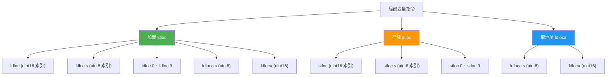
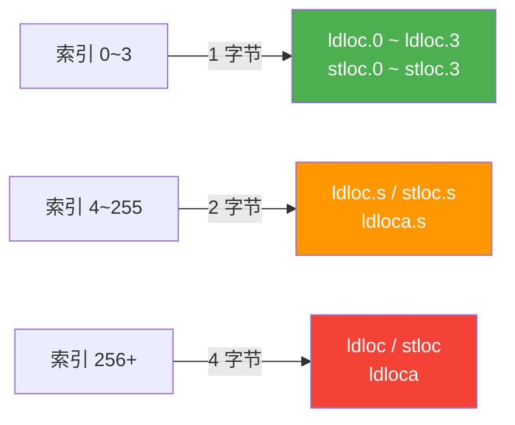
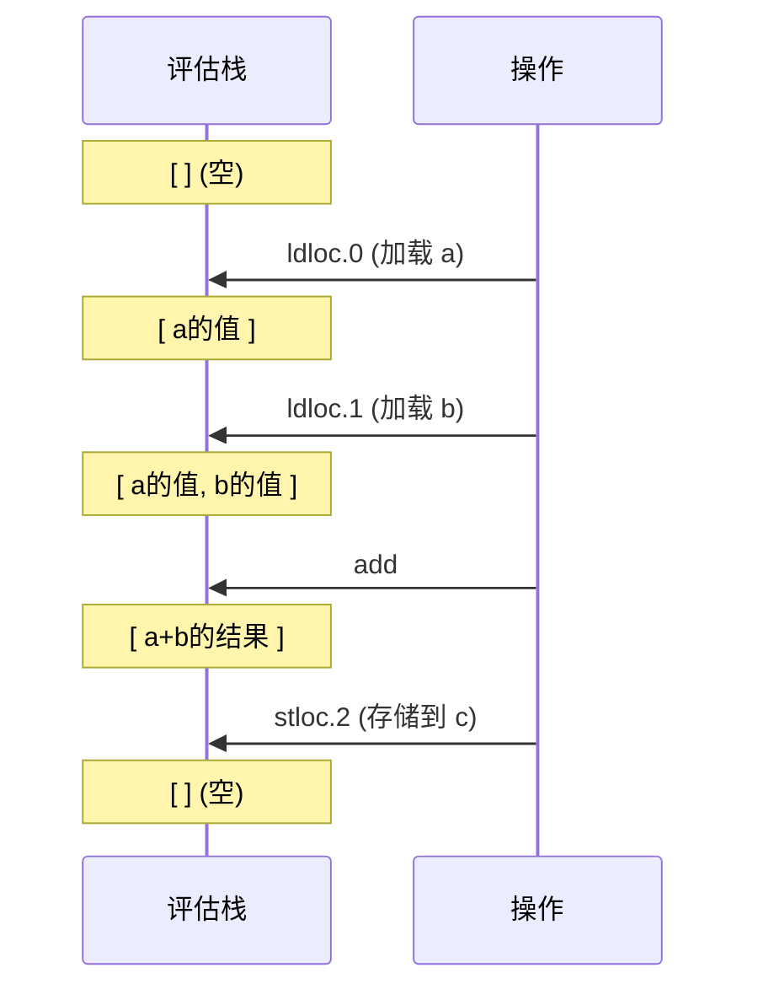

# 局部变量

> 局部变量是方法执行中最基础的存储单元。IL 通过 `ldloc`/`stloc`/`ldloca` 三族指令完成局部变量的读、写、取地址操作，并提供了高效的短格式编码。

## .locals init 指令

IL 方法体中，局部变量通过 `.locals init` 指令声明。`init` 关键字表示 CLR 会在方法入口将所有局部变量初始化为零值（零初始化保证）。

```il
.method private hidebysig static void Demo() cil managed
{
  .maxstack 2
  .locals init (
    [0] int32 x,        // 初始化为 0
    [1] float64 y,      // 初始化为 0.0
    [2] string name,    // 初始化为 null
    [3] bool flag,      // 初始化为 false
    [4] int64 counter   // 初始化为 0L
  )
  // ...
}
```

::: tip
`init` 不是可选项 —— 可验证的（verifiable）IL 必须使用 `.locals init`。省略 `init` 会导致验证失败，仅在特殊场景（如高度优化的动态发射）中才会考虑 `.locals`（无 init），此时需要 `SecurityPermission` 跳过验证。
:::

## 指令总览



## ldloc —— 加载局部变量

将指定局部变量的值压入评估栈。

| 指令 | 操作数 | 字节大小 | 适用范围 | 说明 |
|------|--------|----------|----------|------|
| `ldloc.0` | 无 | 1 字节 | 索引 0 | 最常用，最短编码 |
| `ldloc.1` | 无 | 1 字节 | 索引 1 | |
| `ldloc.2` | 无 | 1 字节 | 索引 2 | |
| `ldloc.3` | 无 | 1 字节 | 索引 3 | |
| `ldloc.s` | uint8 | 2 字节 | 索引 0~255 | 短格式 |
| `ldloc` | uint16 | 4 字节 | 索引 0~65534 | 长格式，极少使用 |

::: important
前 4 个局部变量有专用的单字节指令，这是 .NET JIT 最常见的优化之一。C# 编译器会自动将高频使用的变量排到前 4 个槽位。
:::

**栈行为**：`... → ..., value`

```
评估栈变化：

    ldloc.1          压入 locals[1] 的值
  ┌─────────┐      ┌─────────┐
  │  旧内容  │      │  旧内容  │
  ├─────────┤      ├─────────┤
  │         │  →   │ value   │  ← locals[1] 的副本
  └─────────┘      └─────────┘
```

## stloc —— 存储到局部变量

从评估栈弹出顶部值，存入指定局部变量槽位。

| 指令 | 操作数 | 字节大小 | 适用范围 | 说明 |
|------|--------|----------|----------|------|
| `stloc.0` | 无 | 1 字节 | 索引 0 | |
| `stloc.1` | 无 | 1 字节 | 索引 1 | |
| `stloc.2` | 无 | 1 字节 | 索引 2 | |
| `stloc.3` | 无 | 1 字节 | 索引 3 | |
| `stloc.s` | uint8 | 2 字节 | 索引 0~255 | 短格式 |
| `stloc` | uint16 | 4 字节 | 索引 0~65534 | 长格式 |

**栈行为**：`..., value → ...`

```
评估栈变化：

    stloc.2          弹出栈顶 → locals[2]
  ┌─────────┐      ┌─────────┐
  │  旧内容  │      │  旧内容  │
  ├─────────┤      │         │
  │ value   │  →   └─────────┘  value 已存入 locals[2]
  └─────────┘
```

::: warning
`stloc` 是**弹出**操作，执行后栈顶值消失。如果你需要同时保留值在栈上并存储到变量，必须先 `dup` 再 `stloc`。
:::

## ldloca —— 加载局部变量地址

将局部变量的**托管指针**（managed pointer, `&`）压入评估栈，而非值本身。主要用于：

- 将局部变量作为 `ref`/`out` 参数传递
- 对值类型局部变量进行原地修改

| 指令 | 操作数 | 字节大小 | 适用范围 |
|------|--------|----------|----------|
| `ldloca.s` | uint8 | 2 字节 | 索引 0~255 |
| `ldloca` | uint16 | 4 字节 | 索引 0~65534 |

**栈行为**：`... → ..., address`

::: important
`ldloca` 产生的是**托管指针**（type `&`），不是非托管指针（type `native int`）。托管指针受 GC 跟踪，如果局部变量是引用类型的字段，GC 会正确处理。
:::

## 短格式 vs 长格式

C# 编译器和 JIT 都会优先使用短格式指令，这直接影响 IL 体积：



| 对比项 | 短格式 `.s` | 长格式 |
|--------|------------|--------|
| 索引范围 | 0~255 | 0~65534 |
| 操作数字节数 | 1 字节 (uint8) | 2 字节 (uint16) |
| 总指令大小 | 2 字节 | 4 字节 |
| JIT 编译速度 | 略快（更小的 IL 解码量） | 略慢 |

::: tip
实际项目中超过 255 个局部变量的方法极为罕见。绝大多数情况 `ldloc.s` / `stloc.s` 已足够。C# 编译器总是优先选择最短的编码。
:::

## C# 与 IL 对照

### 基本局部变量

```csharp
int a = 10;
int b = 20;
int c = a + b;
```

```il
.locals init ([0] int32 a, [1] int32 b, [2] int32 c)

// int a = 10;
IL_0000: ldc.i4.s     10
IL_0002: stloc.0                          // a = 10

// int b = 20;
IL_0003: ldc.i4.s     20
IL_0005: stloc.1                          // b = 20

// int c = a + b;
IL_0006: ldloc.0                          // 加载 a
IL_0007: ldloc.1                          // 加载 b
IL_0008: add                              // a + b
IL_0009: stloc.2                          // c = 结果
```

### var 隐式类型

```csharp
var x = 42;       // 编译器推断为 int32
var s = "hello";   // 编译器推断为 string
```

```il
.locals init ([0] int32 x, [1] string s)

// var x = 42;
IL_0000: ldc.i4.s     42
IL_0002: stloc.0

// var s = "hello";
IL_0003: ldstr        "hello"
IL_0008: stloc.1
```

::: tip
`var` 纯粹是 C# 编译器的语法糖。IL 层面完全没有"隐式类型"的概念 —— `.locals init` 中必须显式声明精确类型。编译器在编译期完成类型推断，生成的 IL 与手写类型完全一致。
:::

### ref 局部变量

```csharp
int value = 10;
ref int refValue = ref value;
refValue = 99;
Console.WriteLine(value); // 输出 99
```

```il
.locals init ([0] int32 value, [1] int32& refValue)

// int value = 10;
IL_0000: ldc.i4.s     10
IL_0002: stloc.0

// ref int refValue = ref value;
IL_0003: ldloca.s     value              // 取 value 的地址
IL_0005: stloc.1                          // 存储为托管指针

// refValue = 99;
IL_0006: ldloc.1                          // 加载地址
IL_0007: ldc.i4.s     99
IL_0009: stind.i4                         // 通过地址写入

// Console.WriteLine(value);
IL_000a: ldloc.0
IL_000b: call         void [mscorlib]System.Console::WriteLine(int32)
```

::: important
`ref` 局部变量在 IL 中存储为**托管指针**（`int32&`）。对 `ref` 变量的赋值被编译为 `ldloc` 加载地址 + `stind` 间接写入，而非普通的 `stloc`。读取则对应 `ldloc` 加载地址 + `ldind` 间接读取。
:::

## 完整示例：5 个局部变量

```csharp
public static int Calculate(int input)
{
    int a = input + 1;
    int b = input * 2;
    int c = a + b;
    int d = c - 5;
    int e = d * d;
    return e;
}
```

对应 IL（带栈注释）：

```il
.method public hidebysig static int32 Calculate(int32 input) cil managed
{
  .maxstack 2
  .locals init (
    [0] int32 a,
    [1] int32 b,
    [2] int32 c,
    [3] int32 d,
    [4] int32 e
  )

  // int a = input + 1;
  IL_0000: ldarg.0          // 栈: [input]         ← 加载参数 input
  IL_0001: ldc.i4.1         // 栈: [input, 1]
  IL_0002: add              // 栈: [input+1]
  IL_0003: stloc.0          // 栈: []              → a = input+1

  // int b = input * 2;
  IL_0004: ldarg.0          // 栈: [input]
  IL_0005: ldc.i4.2         // 栈: [input, 2]
  IL_0006: mul              // 栈: [input*2]
  IL_0007: stloc.1          // 栈: []              → b = input*2

  // int c = a + b;
  IL_0008: ldloc.0          // 栈: [a]
  IL_0009: ldloc.1          // 栈: [a, b]
  IL_000a: add              // 栈: [a+b]
  IL_000b: stloc.2          // 栈: []              → c = a+b

  // int d = c - 5;
  IL_000c: ldloc.2          // 栈: [c]
  IL_000d: ldc.i4.5         // 栈: [c, 5]
  IL_000e: sub              // 栈: [c-5]
  IL_000f: stloc.3          // 栈: []              → d = c-5

  // int e = d * d;
  IL_0010: ldloc.3          // 栈: [d]
  IL_0011: ldloc.3          // 栈: [d, d]
  IL_0012: mul              // 栈: [d*d]
  IL_0013: stloc.s e        // 栈: []              → e = d*d
                           // 注意: 索引 4 用 stloc.s，无快捷方式

  // return e;
  IL_0015: ldloc.s e        // 栈: [e]             ← 同理用 ldloc.s
  IL_0017: ret
}
```

::: warning
注意索引 4 的 `e` 变量使用的是 `stloc.s` 和 `ldloc.s`（2 字节），而不是 `stloc.4` / `ldloc.4` —— **快捷指令只存在 0~3**。这是初学者常见的误解。
:::

## 评估栈状态图解

以 `int c = a + b;` 为例，展示完整的栈变化：



## 参考文档

- [OpCodes.Ldloc](https://learn.microsoft.com/en-us/dotnet/api/system.reflection.emit.opcodes.ldloc)
- [OpCodes.Stloc](https://learn.microsoft.com/en-us/dotnet/api/system.reflection.emit.opcodes.stloc)
- [OpCodes.Ldloca](https://learn.microsoft.com/en-us/dotnet/api/system.reflection.emit.opcodes.ldloca)
- [ECMA-335 III.4.1 - ldloc](https://ecma-international.org/publications-and-standards/standards/ecma-335/)
- [ECMA-335 III.4.1 - stloc](https://ecma-international.org/publications-and-standards/standards/ecma-335/)

## 面试要点

1. **ldloc.0~3 与 ldloc.s 的区别**：前者是单字节快捷指令（无操作数），后者是 2 字节（1 字节操作码 + 1 字节索引）。超过索引 3 必须使用 `ldloc.s` 或 `ldloc`。

2. **.locals init 的作用**：CLR 保证 `init` 声明的局部变量被零初始化。这既是安全保证（防止读取未初始化内存），也是可验证 IL 的强制要求。

3. **ref 局部变量在 IL 中的表示**：`ref int` 对应 `int32&`（托管指针），通过 `ldloca` 取地址，通过 `ldind` / `stind` 间接读写。

4. **stloc 会弹出栈顶**：如果需要"既存储又保留在栈上"，需要先 `dup` 再 `stloc`。

5. **C# 编译器的变量排序优化**：编译器可能重排局部变量槽位，将高频访问的变量放在索引 0~3 以利用短编码指令。这在 Debug 和 Release 模式下可能不同。
