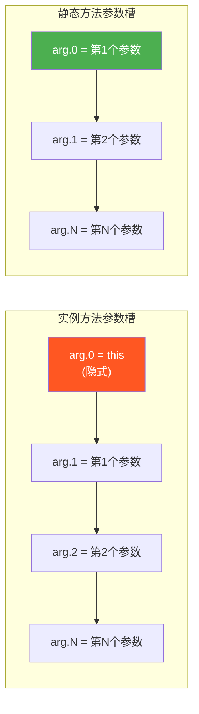
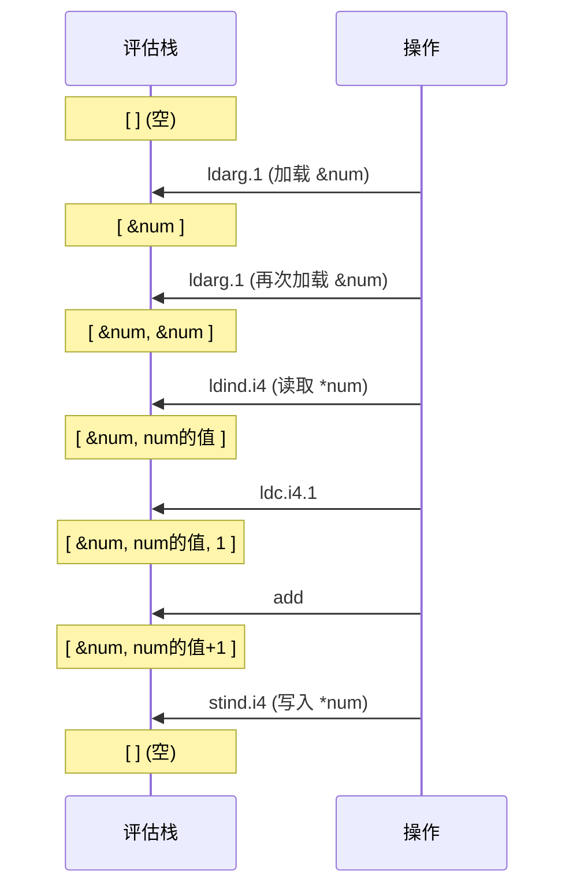

# 参数访问

> 方法参数是调用者传入的数据入口。IL 通过 `ldarg`/`starg`/`ldarga` 三族指令完成参数的读、写、取地址操作。理解参数槽位编号规则 —— 特别是 `this` 的位置 —— 是读懂 IL 的关键。

## 核心概念：this = arg.0

在实例方法中，**第一个参数槽位始终是 `this` 引用**，这是 C# 编译器隐式添加的：



::: important
这是 IL 与 C# 最大的视角差异之一。C# 代码中 `this` 是关键字，但 IL 层面它就是第 0 号参数。静态方法没有 `this`，所以参数从 0 开始编号。
:::

## 指令总览

| 指令族 | 作用 | 快捷方式 | 短格式 | 长格式 |
|--------|------|----------|--------|--------|
| **ldarg** | 加载参数值 | `ldarg.0` ~ `ldarg.3` | `ldarg.s` (uint8) | `ldarg` (uint16) |
| **starg** | 存储到参数槽 | 无 | `starg.s` (uint8) | `starg` (uint16) |
| **ldarga** | 加载参数地址 | 无 | `ldarga.s` (uint8) | `ldarga` (uint16) |

## ldarg —— 加载参数

将指定参数的值压入评估栈。

| 指令 | 操作数 | 字节大小 | 适用范围 |
|------|--------|----------|----------|
| `ldarg.0` | 无 | 1 字节 | 索引 0 |
| `ldarg.1` | 无 | 1 字节 | 索引 1 |
| `ldarg.2` | 无 | 1 字节 | 索引 2 |
| `ldarg.3` | 无 | 1 字节 | 索引 3 |
| `ldarg.s` | uint8 | 2 字节 | 索引 0~255 |
| `ldarg` | uint16 | 4 字节 | 索引 0~65534 |

**栈行为**：`... → ..., value`

## starg —— 存储到参数

从评估栈弹出值，写入指定参数槽位。此指令**较少使用**，主要用于：

- 修改 `ref`/`out` 参数的引用本身（而非通过引用修改目标）
- 某些编译器生成的代码中复用参数槽位

| 指令 | 操作数 | 字节大小 | 适用范围 |
|------|--------|----------|----------|
| `starg.s` | uint8 | 2 字节 | 索引 0~255 |
| `starg` | uint16 | 4 字节 | 索引 0~65534 |

::: warning
`starg` **没有** `starg.0` ~ `starg.3` 的快捷方式。C# 中直接对值参数赋值（如 `x = 10;`）在 IL 中会编译为 `starg.s`，但这只修改参数槽的本地副本，不影响调用者。
:::

**栈行为**：`..., value → ...`

## ldarga —— 加载参数地址

将参数的**托管指针**压入评估栈，主要用于将参数按 `ref`/`out` 传递给其他方法。

| 指令 | 操作数 | 字节大小 | 适用范围 |
|------|--------|----------|----------|
| `ldarga.s` | uint8 | 2 字节 | 索引 0~255 |
| `ldarga` | uint16 | 4 字节 | 索引 0~65534 |

**栈行为**：`... → ..., address`

::: important
`ldarga` 也**没有**快捷方式（无 `ldarga.0` 等）。注意与 `ldloca` 对比：两者功能类似，但 `ldarga` 操作参数槽，`ldloca` 操作局部变量。
:::

## 实例方法完整示例

```csharp
public class Calculator
{
    private int factor;

    public Calculator(int factor)
    {
        this.factor = factor;
    }

    public int Compute(int x, string label, out int result)
    {
        int temp = x * factor;
        result = temp;
        return temp;
    }
}
```

`Compute` 方法的 IL：

```il
.method public hidebysig instance int32 Compute(
    int32 x,
    string label,
    [out] int32& result
) cil managed
{
  .maxstack 2
  .locals init ([0] int32 temp)

  // int temp = x * factor;
  //   x 是 arg.1 (arg.0 = this)
  IL_0000: ldarg.1          // 加载 x                    栈: [x]
  IL_0001: ldarg.0          // 加载 this                  栈: [x, this]
  IL_0002: ldfld          int32 Calculator::factor   // this.factor    栈: [x, factor]
  IL_0007: mul              // x * factor                 栈: [x*factor]
  IL_0008: stloc.0          // temp = x*factor            栈: []

  // result = temp;
  IL_0009: ldarg.3          // 加载 result 地址           栈: [&result]
  IL_000a: ldloc.0          // 加载 temp                  栈: [&result, temp]
  IL_000b: stind.i4         // *result = temp             栈: []

  // return temp;
  IL_000c: ldloc.0          // 加载 temp                  栈: [temp]
  IL_000d: ret
}
```

参数槽位分布：

```
┌─────────────────────────────────────────────┐
│  参数槽编号  │  内容         │  C# 对应     │
├──────────────┼───────────────┼──────────────┤
│  arg.0       │  this 引用    │  (隐式)      │
│  arg.1       │  int32 x      │  int x       │
│  arg.2       │  string label │  string label │
│  arg.3       │  int32& result│  out int result│
└─────────────────────────────────────────────┘
```

## 不同参数类型的 IL 映射

### 值参数（Value Parameter）

```csharp
void Method(int x) { x = 10; } // 修改不影响调用者
```

```il
// x = 10;
ldc.i4.s     10
starg.s      x      // 仅修改参数槽本地副本
```

### ref 参数

```csharp
void Increment(ref int num) { num++; }
```

```il
.method public hidebysig instance void Increment(int32& num) cil managed
{
  .maxstack 2

  // num++
  IL_0000: ldarg.1          // 加载 num 地址         栈: [&num]
  IL_0001: ldarg.1          // 再次加载地址           栈: [&num, &num]
  IL_0002: ldind.i4         // 读取 *num              栈: [&num, *num]
  IL_0003: ldc.i4.1         //                         栈: [&num, *num, 1]
  IL_0004: add              //                         栈: [&num, *num+1]
  IL_0005: stind.i4         // *num = *num + 1        栈: []
  IL_0006: ret
}
```

### out 参数

```csharp
void GetValue(out int value) { value = 42; }
```

```il
.method public hidebysig instance void GetValue([out] int32& value) cil managed
{
  .maxstack 2

  // value = 42;
  IL_0000: ldarg.1          // 加载 value 地址        栈: [&value]
  IL_0001: ldc.i4.s     42  //                         栈: [&value, 42]
  IL_0003: stind.i4         // *value = 42            栈: []
  IL_0004: ret
}
```

::: tip
`ref` 和 `out` 在 IL 层面**完全相同** —— 都是托管指针（`int32&`）。区别仅在：
1. IL 签名中 `[out]` 属性标记
2. C# 编译器的流分析保证（`out` 要求方法退出前必须赋值）
3. `ref` 要求调用前已初始化，`out` 不要求

JIT 不区分两者，生成的机器码完全一致。
:::

### params 参数

```csharp
void Print(params int[] numbers) { }
// 调用: obj.Print(1, 2, 3);
```

```il
// 调用端 IL —— 编译器自动创建数组
IL_0000: ldarg.0                        // this
IL_0001: ldc.i4.3                       // 数组长度 = 3
IL_0002: newarr       [mscorlib]System.Int32
IL_0007: dup
IL_0008: ldtoken      field valuetype '<PrivateImplementationDetails>'/'__StaticArrayInitTypeFields=3' '<PrivateImplementationDetails>'::'$$method0x6000001-1'
IL_000d: call         void [mscorlib]System.Runtime.CompilerServices.RuntimeHelpers::InitializeArray(class [mscorlib]System.Array, valuetype [mscorlib]System.RuntimeFieldHandle)
IL_0012: callvirt     instance void Test::Print(int32[])
```

::: important
`params` 在 IL 中就是一个普通的数组参数。魔法发生在**调用端** —— C# 编译器将可变参数打包成数组再传递。被调用方法看到的始终是 `int32[]`。
:::

## 评估栈状态图解

以 `num++`（`ref int num`）为例：



## 值类型 vs 引用类型的 this

当 `this` 是值类型时，`ldarg.0` 加载的是值类型的**地址**而非值：

```csharp
public struct Point
{
    public int X;
    public void SetX(int x) { X = x; }
}
```

```il
.method public hidebysig instance void SetX(int32 x) cil managed
{
  .maxstack 2

  // X = x;
  IL_0000: ldarg.0          // 加载 this 地址（值类型的 this 是指针！）
  IL_0001: ldarg.1          // 加载 x
  IL_0002: stfld          int32 Point::X
  IL_0007: ret
}
```

::: warning
值类型实例方法中 `ldarg.0` 加载的是 `valuetype Point&`（托管指针），而引用类型中是 `class Point`（对象引用）。这是因为值类型可能分配在栈上，必须通过指针才能原地修改字段。
:::

## 参考文档

- [OpCodes.Ldarg](https://learn.microsoft.com/en-us/dotnet/api/system.reflection.emit.opcodes.ldarg)
- [OpCodes.Starg](https://learn.microsoft.com/en-us/dotnet/api/system.reflection.emit.opcodes.starg)
- [OpCodes.Ldarga](https://learn.microsoft.com/en-us/dotnet/api/system.reflection.emit.opcodes.ldarga)
- [ECMA-335 III.4.1 - ldarg](https://ecma-international.org/publications-and-standards/standards/ecma-335/)
- [ECMA-335 III.4.1 - starg](https://ecma-international.org/publications-and-standards/standards/ecma-335/)

## 面试要点

1. **实例方法 arg.0 = this**：这是 IL 最基本的参数编号规则。静态方法没有 `this`，参数从 0 开始。面试中常以"实例方法第一个参数是什么"来考察。

2. **ref/out 在 IL 中无区别**：两者都是托管指针 `T&`，区别仅在 C# 编译器的流分析。JIT 生成的机器码完全一致。

3. **starg 没有 .0~.3 快捷方式**：与 `stloc` 不同，`starg` 只有 `.s` 和长格式。这是因为直接修改参数槽位是少见操作。

4. **值类型的 this 是指针**：`ldarg.0` 在值类型方法中加载的是 `ValueType&`，在引用类型中加载的是对象引用。理解这一点对于读懂结构体方法的 IL 至关重要。

5. **params 的本质**：`params` 在被调用端就是一个普通数组参数，编译器在调用端自动完成参数打包。
