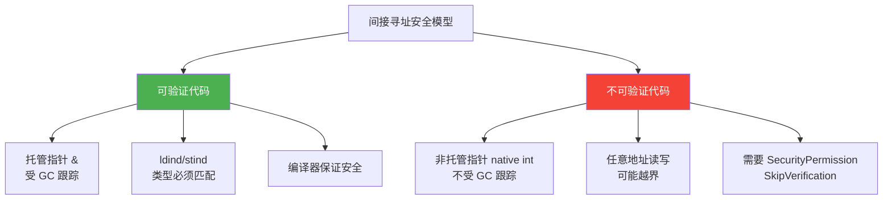

# 间接寻址

> 间接寻址是 IL 中最接近底层的内存操作 —— 通过地址直接读写内存。它是 `unsafe` 代码、`ref` 操作和互操作的基础，也是理解 .NET 内存模型的钥匙。

## 指令总览

```mermaid
graph TD
    A[间接寻址] --> B[读取 ldind]
    A --> C[写入 stind]
    A --> D[前缀指令]

    B --> B1["ldind.i1 (int8 → int32)"]
    B --> B2["ldind.u1 (unsigned int8)"]
    B --> B3["ldind.i2 (int16 → int32)"]
    B --> B4["ldind.u2 (unsigned int16)"]
    B --> B5["ldind.i4 (int32)"]
    B --> B6["ldind.u4 (unsigned int32)"]
    B --> B7["ldind.i8 (int64)"]
    B --> B8["ldind.r4 (float32)"]
    B --> B9["ldind.r8 (float64)"]
    B --> B10["ldind.i (native int)"]
    B --> B11["ldind.ref (object reference)"]

    C --> C1["stind.i1"]
    C --> C2["stind.i2"]
    C --> C3["stind.i4"]
    C --> C4["stind.i8"]
    C --> C5["stind.r4"]
    C --> C6["stind.r8"]
    C --> C7["stind.ref"]

    D --> D1["volatile. (内存排序)"]
    D --> D2["unaligned. (非对齐访问)"]

    style B fill:#4CAF50,color:#fff
    style C fill:#FF9800,color:#fff
    style D fill:#9C27B0,color:#fff
```



## ldind —— 间接读取

从给定地址读取值并压入评估栈。地址类型为 `native int` 或托管指针 `&`。

**栈行为**：`..., address → ..., value`

| 指令 | 读取类型 | 栈上结果类型 | 说明 |
|------|----------|-------------|------|
| `ldind.i1` | int8 | int32 | 有符号字节，符号扩展 |
| `ldind.u1` | unsigned int8 | int32 | 无符号字节，零扩展 |
| `ldind.i2` | int16 | int32 | 有符号短整，符号扩展 |
| `ldind.u2` | unsigned int16 | int32 | 无符号短整，零扩展 |
| `ldind.i4` | int32 | int32 | 32位整数 |
| `ldind.u4` | unsigned int32 | int32 | 无符号32位（零扩展到64位环境） |
| `ldind.i8` | int64 | int64 | 64位整数 |
| `ldind.r4` | float32 | float64 | 单精度，扩展为双精度 |
| `ldind.r8` | float64 | float64 | 双精度 |
| `ldind.i` | native int | native int | 平台相关整数 |
| `ldind.ref` | object reference | object reference | 对象引用 |

::: important
`ldind` 读取后会进行**类型提升**：小于 32 位的类型会扩展到 32 位（有符号用符号扩展，无符号用零扩展），`float32` 会扩展为 `float64`。这是 IL 评估栈的设计规则 —— 栈上只有 `int32`、`int64`、`float64`、`native int`、`object ref` 五种类型。
:::

## stind —— 间接写入

将值写入给定地址。

**栈行为**：`..., address, value → ...`

| 指令 | 写入类型 | 说明 |
|------|----------|------|
| `stind.i1` | int8 | 写入 1 字节 |
| `stind.i2` | int16 | 写入 2 字节 |
| `stind.i4` | int32 | 写入 4 字节 |
| `stind.i8` | int64 | 写入 8 字节 |
| `stind.r4` | float32 | 写入 4 字节浮点 |
| `stind.r8` | float64 | 写入 8 字节浮点 |
| `stind.ref` | object reference | 写入对象引用 |

::: warning
`stind` 没有无符号变体（没有 `stind.u4` 等），因为写入时字节宽度由指令确定，有符号/无符号只影响读取时的扩展方式。
:::

## volatile. 前缀

`volatile.` 是一个前缀指令，修饰紧随其后的 `ldind` 或 `stind`，确保：

1. **读取**：不从缓存读取，直接从主内存加载
2. **写入**：立即刷新到主内存
3. **排序**：不被 CPU 或编译器重排到其他 `volatile` 操作之外

```il
// volatile 读取
volatile.
ldind.i4

// volatile 写入
volatile.
stind.ref
```

::: important
IL 的 `volatile.` 前缀对应 C# 的 `volatile` 关键字。但两者语义略有不同：
- C# `volatile` 只能修饰特定类型的字段
- IL `volatile.` 可以修饰任何 `ldind`/`stind` 操作

`volatile.` 确保的是**获取-释放（acquire-release）语义**，而非顺序一致性。
:::

## unaligned. 前缀

`unaligned.` 前缀修饰紧随其后的间接访问指令，表示地址可能未按自然边界对齐。

```il
unaligned. 1     // 1 字节对齐（完全不对齐）
ldind.i4

unaligned. 2     // 2 字节对齐
stind.i8

unaligned. 4     // 4 字节对齐
ldind.r8
```

| 对齐值 | 含义 |
|--------|------|
| `1` | 无对齐要求 |
| `2` | 2 字节对齐 |
| `4` | 4 字节对齐 |

::: warning
`unaligned.` 主要用于与非托管结构体互操作时，某些结构体可能使用 `Pack=1` 等非自然对齐。在 ARM 等对严格对齐的平台上，非对齐访问可能触发硬件异常。x86/x64 平台通常容忍非对齐访问，但性能下降。
:::

## C# unsafe 代码 ↔ IL 映射

### 指针读写

```csharp
unsafe void PointerExample()
{
    int value = 42;
    int* ptr = &value;

    *ptr = 100;           // stind.i4
    int read = *ptr;      // ldind.i4

    byte* bptr = (byte*)ptr;
    byte b = *bptr;       // ldind.u1
    *bptr = 0xFF;         // stind.i1
}
```

```il
.method private hidebysig static void PointerExample() cil managed
{
  .maxstack 2
  .locals init (
    [0] int32 value,
    [1] int32* ptr,
    [2] int32 read,
    [3] uint8* bptr,
    [4] uint8 b
  )

  // int value = 42;
  IL_0000: ldc.i4.s     42
  IL_0002: stloc.0

  // int* ptr = &value;
  IL_0003: ldloca.s     value
  IL_0005: stloc.1

  // *ptr = 100;
  IL_0006: ldloc.1          // 加载指针（地址）     栈: [ptr]
  IL_0007: ldc.i4.s     100 //                       栈: [ptr, 100]
  IL_0009: stind.i4         // *ptr = 100            栈: []

  // int read = *ptr;
  IL_000a: ldloc.1          // 加载指针              栈: [ptr]
  IL_000b: ldind.i4         // 读取 *ptr             栈: [*ptr]
  IL_000c: stloc.2

  // byte* bptr = (byte*)ptr;
  IL_000d: ldloc.1
  IL_000e: stloc.3          // 指针类型转换（IL 层面仅改变类型）

  // byte b = *bptr;
  IL_000f: ldloc.3          //                       栈: [bptr]
  IL_0010: ldind.u1         // 读取无符号字节        栈: [byte值]
  IL_0011: stloc.s b

  // *bptr = 0xFF;
  IL_0013: ldloc.3          //                       栈: [bptr]
  IL_0014: ldc.i4     255   //                       栈: [bptr, 0xFF]
  IL_0019: stind.i1         // 写入 1 字节           栈: []

  IL_001a: ret
}
```

### volatile 字段访问

```csharp
class VolatileExample
{
    private volatile int flag;

    public void Set() { flag = 1; }
    public int Get() { return flag; }
}
```

```il
// Set: flag = 1
IL_0000: ldarg.0                      // this
IL_0001: ldc.i4.1                     // 值 = 1
IL_0002: volatile.                    // ← volatile 前缀
IL_0003: stind.i4                     // 间接写入

// Get: return flag
IL_0000: ldarg.0                      // this
IL_0001: volatile.                    // ← volatile 前缀
IL_0002: ldind.i4                     // 间接读取
IL_0003: ret
```

### fixed 语句

```csharp
fixed (int* p = &array[0])
{
    *p = 42;
}
```

```il
// fixed 语句的 IL 本质：pinning 句柄
.locals init ([0] int32[] array, [1] int32* p)

// fixed (int* p = &array[0])
IL_0000: ldloc.0                          // 加载数组
IL_0001: ldc.i4.0                         // 索引 0
IL_0002: ldelema [mscorlib]System.Int32   // 获取元素地址
IL_0007: stloc.1                          // p = &array[0]

// *p = 42
IL_0008: ldloc.1
IL_0009: ldc.i4.s     42
IL_000b: stind.i4
```

## 安全性考量



::: important
可验证的 IL 对间接寻址有严格限制：
1. 地址必须是有效的托管指针（通过 `ldloca`、`ldarga`、`ldelema` 等获取）
2. 读写类型必须与地址的类型签名一致
3. 不能对同一个地址同时持有 GC 引用和非 GC 引用

违反这些规则会导致验证失败。`unsafe` 代码跳过验证，但需要 `SecurityPermission`。
:::

## ldind 与 ldfld 的区别

| 对比 | `ldind` | `ldfld` |
|------|---------|---------|
| 输入 | 任意地址 | 对象引用 + 字段元数据 |
| 类型安全 | 依赖指令后缀（`i4`/`r8` 等） | 由字段元数据保证 |
| 可验证性 | 需要地址类型匹配 | 始终可验证 |
| 使用场景 | unsafe 指针操作 | 普通字段访问 |

## 参考文档

- [OpCodes.Ldind_I4](https://learn.microsoft.com/en-us/dotnet/api/system.reflection.emit.opcodes.ldind_i4)
- [OpCodes.Stind_I4](https://learn.microsoft.com/en-us/dotnet/api/system.reflection.emit.opcodes.stind_i4)
- [OpCodes.Volatile](https://learn.microsoft.com/en-us/dotnet/api/system.reflection.emit.opcodes.volatile)
- [OpCodes.Unaligned](https://learn.microsoft.com/en-us/dotnet/api/system.reflection.emit.opcodes.unaligned)
- [ECMA-335 III.4.1 - ldind](https://ecma-international.org/publications-and-standards/standards/ecma-335/)
- [ECMA-335 III.4.1 - stind](https://ecma-international.org/publications-and-standards/standards/ecma-335/)

## 面试要点

1. **ldind 的类型提升**：小于 32 位的类型读取后会扩展到 32 位（有符号符号扩展，无符号零扩展），`float32` 扩展为 `float64`。这是评估栈类型系统的核心规则。

2. **volatile. 是前缀不是独立指令**：它修饰紧随其后的 `ldind`/`stind`，提供获取-释放语义。C# 的 `volatile` 关键字编译后在 IL 中就是 `volatile.` 前缀。

3. **托管指针 vs 非托管指针**：`ldind`/`stind` 可以操作两种指针。托管指针（`&`）受 GC 跟踪，非托管指针（`native int`）不受。理解这个区别对内存安全至关重要。

4. **stind 没有无符号变体**：写入时不区分有符号/无符号，因为字节宽度由指令确定，有符号性只影响读取时的扩展方式。

5. **unsafe 代码的本质**：C# 的 `unsafe` 在 IL 层面就是使用 `ldind`/`stind` 通过 `native int` 指针直接操作内存，跳过类型验证。这解释了为什么 `unsafe` 代码需要特殊权限。
