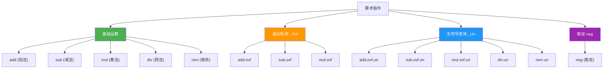
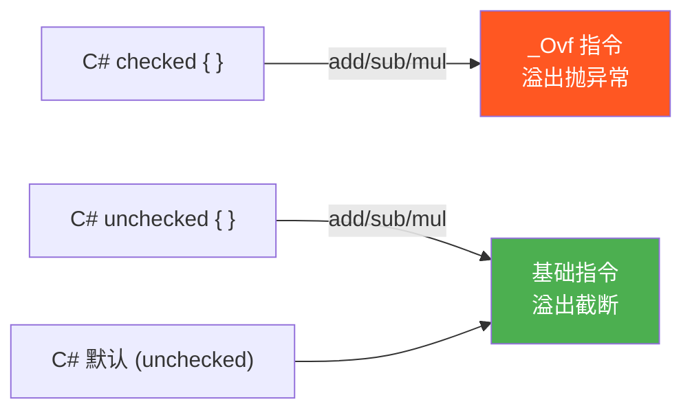

# 算术运算

> IL 提供完整的算术指令集，包括基础四则运算、取余、取反，以及溢出检测变体。`checked`/`unchecked` 上下文在 IL 中直接对应不同的指令选择。

## 指令总览



## 基础运算

所有基础算术指令遵循相同的栈行为：

**栈行为**：`..., value1, value2 → ..., result`（双目） | `..., value → ..., result`（单目 neg）

```
add / sub / mul / div / rem:

  ┌─────────┐
  │ value2  │  ← 弹出
  ├─────────┤
  │ value1  │  ← 弹出
  ├─────────┤         ┌─────────┐
  │  旧内容  │   →    │ result  │  ← 压入
  └─────────┘         └─────────┘
```

| 指令 | 操作 | 操作码 (hex) | 说明 |
|------|------|-------------|------|
| `add` | value1 + value2 | 0x58 | 整数/浮点通用 |
| `sub` | value1 - value2 | 0x59 | |
| `mul` | value1 × value2 | 0x5A | |
| `div` | value1 / value2 | 0x5B | 整数截断向零，浮点按 IEEE 754 |
| `rem` | value1 % value2 | 0x5D | 余数符号与被除数相同 |
| `neg` | -value | 0x65 | 单目取反 |

## 溢出检测变体 (_Ovf)

`_Ovf` 后缀的指令在溢出时抛出 `OverflowException`：

| 指令 | 操作码 (hex) | 溢出检测 |
|------|-------------|----------|
| `add.ovf` | 0xD6 | 有符号加法溢出 |
| `add.ovf.un` | 0xD7 | 无符号加法溢出 |
| `sub.ovf` | 0xD8 | 有符号减法溢出 |
| `sub.ovf.un` | 0xD9 | 无符号减法溢出 |
| `mul.ovf` | 0xDA | 有符号乘法溢出 |
| `mul.ovf.un` | 0xDB | 无符号乘法溢出 |

::: important
`add.ovf` 检测的是**有符号**溢出。例如 `int32` 范围是 -2,147,483,648 ~ 2,147,483,647，超过此范围则抛异常。`add.ovf.un` 将操作数视为无符号数检测溢出，即结果超过 0xFFFFFFFF 时抛异常。
:::

## 无符号变体 (_Un)

`_Un` 后缀用于无符号除法和取余：

| 指令 | 操作码 (hex) | 说明 |
|------|-------------|------|
| `div.un` | 0x5C | 无符号除法 |
| `rem.un` | 0x5E | 无符号取余 |

::: tip
注意区分 `_Ovf.un` 和 `_Un`：
- `_Ovf.un`：溢出检测的无符号版本（add/sub/mul）
- `_Un`（无 `.ovf`）：无符号运算本身（div/rem）

除法和取余没有溢出问题，所以没有 `div.ovf`。
:::

## checked/unchecked 与 IL 的映射

这是 C# 程序员最需要理解的核心映射：



```csharp
checked
{
    int x = int.MaxValue;
    int y = x + 1;  // 抛出 OverflowException
}
```

```il
.locals init ([0] int32 x, [1] int32 y)

// int x = int.MaxValue;
IL_0000: ldc.i4     0x7FFFFFFF
IL_0005: stloc.0

// int y = x + 1;   (checked)
IL_0006: ldloc.0
IL_0007: ldc.i4.1
IL_0008: add.ovf          // ← 注意：add.ovf 而非 add
IL_0009: stloc.1
```

对比 `unchecked`：

```csharp
unchecked
{
    int x = int.MaxValue;
    int y = x + 1;  // y = -2147483648 (溢出截断)
}
```

```il
// int y = x + 1;   (unchecked)
IL_0006: ldloc.0
IL_0007: ldc.i4.1
IL_0008: add              // ← 基础 add，不检测溢出
IL_0009: stloc.1
```

## 除零行为

| 操作数类型 | 被零除行为 |
|-----------|-----------|
| 整数 `div` | 抛出 `DivideByZeroException` |
| 整数 `rem` | 抛出 `DivideByZeroException` |
| 浮点 `div` | 产生 `+Infinity` / `-Infinity` / `NaN`（不抛异常） |
| 浮点 `rem` | 产生 `NaN`（不抛异常） |

::: warning
整数除零和浮点除零的行为完全不同。整数除零是致命错误，浮点除零是合法运算（结果为无穷大或 NaN）。这是 IEEE 754 浮点标准的规定。
:::

## 整数与浮点运算差异

```csharp
int a = 7, b = 2;
Console.WriteLine(a / b);   // 3 (整数截断，向零)
Console.WriteLine(a % b);   // 1 (余数符号与被除数相同)

double x = 7.0, y = 2.0;
Console.WriteLine(x / y);   // 3.5 (浮点精确)
Console.WriteLine(x % y);   // 1.0 (浮点取余)
```

```il
// a / b (整数除法)
IL_0000: ldloc.0          // a
IL_0001: ldloc.1          // b
IL_0002: div              // 整数 div → 截断向零

// a % b (整数取余)
IL_0003: ldloc.0
IL_0004: ldloc.1
IL_0005: rem              // 整数 rem

// x / y (浮点除法)
IL_0006: ldloc.2          // x (float64)
IL_0007: ldloc.3          // y (float64)
IL_0008: div              // 同一个 div 指令，浮点时行为不同

// x % y (浮点取余)
IL_0009: ldloc.2
IL_000a: ldloc.3
IL_000b: rem              // 同一个 rem 指令
```

::: tip
IL 的 `add`/`sub`/`mul`/`div`/`rem` **不区分整数和浮点** —— 同一个操作码同时服务于两种类型。运算语义由操作数类型决定。这是栈式虚拟机的设计哲学：指令只描述操作，类型由数据携带。
:::

## 完整指令码表

| 操作码 (hex) | 指令 | 字节数 | 栈行为 | 说明 |
|-------------|------|--------|--------|------|
| 0x58 | `add` | 1 | 2 → 1 | 加法 |
| 0xD6 | `add.ovf` | 1 | 2 → 1 | 有符号加法（溢出检测） |
| 0xD7 | `add.ovf.un` | 1 | 2 → 1 | 无符号加法（溢出检测） |
| 0x59 | `sub` | 1 | 2 → 1 | 减法 |
| 0xD8 | `sub.ovf` | 1 | 2 → 1 | 有符号减法（溢出检测） |
| 0xD9 | `sub.ovf.un` | 1 | 2 → 1 | 无符号减法（溢出检测） |
| 0x5A | `mul` | 1 | 2 → 1 | 乘法 |
| 0xDA | `mul.ovf` | 1 | 2 → 1 | 有符号乘法（溢出检测） |
| 0xDB | `mul.ovf.un` | 1 | 2 → 1 | 无符号乘法（溢出检测） |
| 0x5B | `div` | 1 | 2 → 1 | 除法 |
| 0x5C | `div.un` | 1 | 2 → 1 | 无符号除法 |
| 0x5D | `rem` | 1 | 2 → 1 | 取余 |
| 0x5E | `rem.un` | 1 | 2 → 1 | 无符号取余 |
| 0x65 | `neg` | 1 | 1 → 1 | 取反 |

## 完整示例：checked 算术

```csharp
public static int SafeMultiply(int a, int b)
{
    checked
    {
        int product = a * b;
        int sum = product + a;
        int diff = product - b;
        return sum / diff;
    }
}
```

```il
.method public hidebysig static int32 SafeMultiply(int32 a, int32 b) cil managed
{
  .maxstack 2
  .locals init ([0] int32 product, [1] int32 sum, [2] int32 diff)

  // int product = a * b;     (checked)
  IL_0000: ldarg.0
  IL_0001: ldarg.1
  IL_0002: mul.ovf          // ← 溢出检测乘法

  IL_0003: stloc.0

  // int sum = product + a;   (checked)
  IL_0004: ldloc.0
  IL_0005: ldarg.0
  IL_0006: add.ovf          // ← 溢出检测加法

  IL_0007: stloc.1

  // int diff = product - b;  (checked)
  IL_0008: ldloc.0
  IL_0009: ldarg.1
  IL_000a: sub.ovf          // ← 溢出检测减法

  IL_000b: stloc.2

  // return sum / diff;
  IL_000c: ldloc.1
  IL_000d: ldloc.2
  IL_000e: div              // 除法无溢出问题，无需 _Ovf
  IL_000f: ret
}
```

::: important
注意 `div` 没有 `.ovf` 变体 —— 除法不会溢出（整数最小值除以 -1 的情况除外，这是硬件层面的特殊案例，CLR 会检测并抛出 `OverflowException`）。`rem` 同理。
:::

## neg 取反

```csharp
int x = 42;
int y = -x;   // neg
```

```il
// int y = -x;
IL_0000: ldloc.0
IL_0001: neg               // 单目取反：0 - value
IL_0002: stloc.1
```

**栈行为**：`..., value → ..., result`

::: tip
`neg` 等价于 `0 - value`。对于有符号整数最小值（如 `int.MinValue = -2147483648`），`neg` 的结果仍然是 `-2147483648`（溢出截断），不会抛异常。如需检测此情况，应使用 `sub.ovf` 配合 `ldc.i4.0`。
:::

## 参考文档

- [OpCodes.Add](https://learn.microsoft.com/en-us/dotnet/api/system.reflection.emit.opcodes.add)
- [OpCodes.Add_Ovf](https://learn.microsoft.com/en-us/dotnet/api/system.reflection.emit.opcodes.add_ovf)
- [OpCodes.Sub](https://learn.microsoft.com/en-us/dotnet/api/system.reflection.emit.opcodes.sub)
- [OpCodes.Mul](https://learn.microsoft.com/en-us/dotnet/api/system.reflection.emit.opcodes.mul)
- [OpCodes.Div](https://learn.microsoft.com/en-us/dotnet/api/system.reflection.emit.opcodes.div)
- [OpCodes.Rem](https://learn.microsoft.com/en-us/dotnet/api/system.reflection.emit.opcodes.rem)
- [OpCodes.Neg](https://learn.microsoft.com/en-us/dotnet/api/system.reflection.emit.opcodes.neg)
- [ECMA-335 III.4 - Arithmetic](https://ecma-international.org/publications-and-standards/standards/ecma-335/)

## 面试要点

1. **checked 编译为 _Ovf 指令**：C# 的 `checked` 上下文使编译器生成 `add.ovf` / `sub.ovf` / `mul.ovf`，溢出时抛出 `OverflowException`。默认 `unchecked` 生成基础指令，溢出截断。

2. **整数除零 vs 浮点除零**：整数除零抛 `DivideByZeroException`，浮点除零返回 `Infinity` / `NaN`。这是 IEEE 754 标准规定。

3. **IL 不区分整数/浮点指令**：`add` 同时处理整数和浮点加法，类型由操作数决定。这是栈式 VM 的设计哲学。

4. **div/rem 没有 _Ovf 变体**：除法不会溢出（除了 `int.MinValue / -1` 的特殊边界情况），所以不存在 `div.ovf`。

5. **_Ovf.un 与 _Un 的区别**：`add.ovf.un` 是对无符号数的溢出检测，`div.un` 是无符号除法运算本身。前者是安全变体，后者是语义变体。
