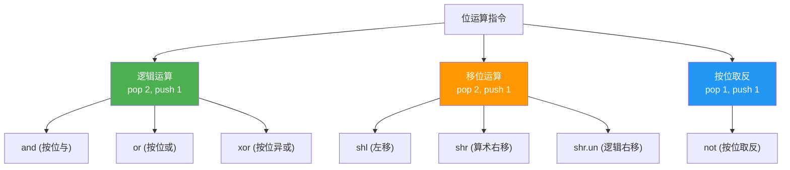
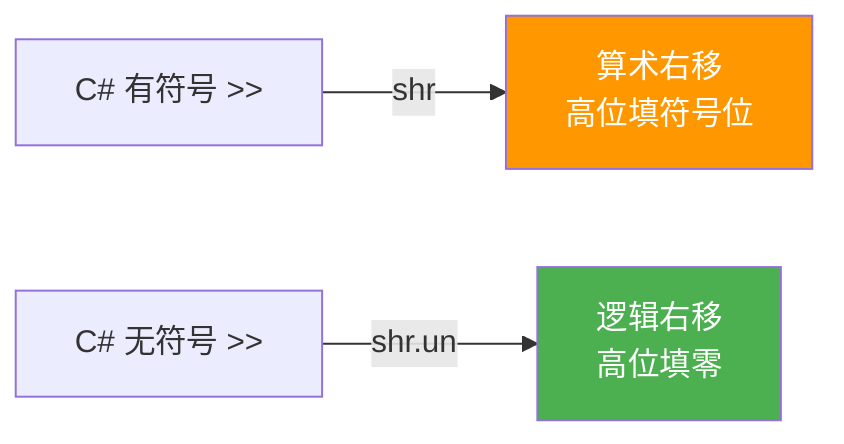
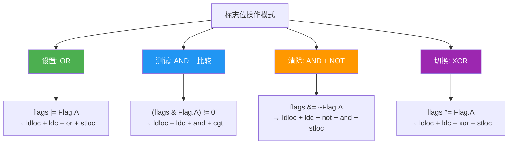

# 位运算

> 位运算在系统编程、协议解析、标志位操作中不可或缺。IL 提供完整的位运算指令集，与 C# 的位运算符一一对应。

## 指令总览



## 逻辑运算

### and —— 按位与

**栈行为**：`..., value1, value2 → ..., result`

对两个值逐位执行与运算。常用于：掩码提取、标志位判断。

| 指令 | 操作码 (hex) | C# 运算符 |
|------|-------------|----------|
| `and` | 0x5F | `&` |

```
示例：0xABCD & 0x00FF = 0x00CD

  1010 1011 1100 1101    (0xABCD)
& 0000 0000 1111 1111    (0x00FF)
= 0000 0000 1100 1101    (0x00CD)
```

### or —— 按位或

**栈行为**：`..., value1, value2 → ..., result`

| 指令 | 操作码 (hex) | C# 运算符 |
|------|-------------|----------|
| `or` | 0x60 | `|` |

### xor —— 按位异或

**栈行为**：`..., value1, value2 → ..., result`

| 指令 | 操作码 (hex) | C# 运算符 |
|------|-------------|----------|
| `xor` | 0x61 | `^` |

xor 的经典用途：翻转特定位、不借助临时变量交换两个值。

### not —— 按位取反

**栈行为**：`..., value → ..., result`

| 指令 | 操作码 (hex) | C# 运算符 |
|------|-------------|----------|
| `not` | 0x66 | `~` |

::: important
`not` 是唯一一个单目位运算指令（pop 1, push 1），其他都是双目（pop 2, push 1）。
:::

## 移位运算

### shl —— 左移

**栈行为**：`..., value, shiftCount → ..., result`

将 `value` 向左移动 `shiftCount` 位，低位补零。

| 指令 | 操作码 (hex) | C# 运算符 |
|------|-------------|----------|
| `shl` | 0x62 | `<<` |

### shr —— 算术右移（符号保留）

**栈行为**：`..., value, shiftCount → ..., result`

将 `value` 向右移动 `shiftCount` 位，高位用**符号位**填充。

| 指令 | 操作码 (hex) | C# 运算符 |
|------|-------------|----------|
| `shr` | 0x63 | `>>` |

### shr.un —— 逻辑右移（零填充）

**栈行为**：`..., value, shiftCount → ..., result`

将 `value` 向右移动 `shiftCount` 位，高位补**零**。

| 指令 | 操作码 (hex) | C# 运算符 |
|------|-------------|----------|
| `shr.un` | 0x64 | 无直接对应（C# 对无符号类型用 `>>`） |



::: tip
C# 的 `>>` 运算符根据操作数类型自动选择：有符号类型用 `shr`，无符号类型用 `shr.un`。编译器根据类型信息做出选择，开发者无需关心。
:::

## 移位计数限制

IL 移位指令对移位数量有明确限制：

| 值类型 | 有效移位范围 |
|--------|-------------|
| `int32` / `native int` | 低 5 位 (0~31) |
| `int64` | 低 6 位 (0~63) |

```csharp
int x = 1 << 33;  // 等价于 1 << 1 = 2，因为 33 & 31 = 1
```

```il
IL_0000: ldc.i4.1
IL_0001: ldc.i4     33
IL_0006: shl         // 实际移位 = 33 & 0x1F = 1
```

## C# 运算符 ↔ IL 指令映射

| C# 运算符 | IL 指令 | 栈行为 | 说明 |
|-----------|---------|--------|------|
| `a & b` | `and` | pop 2, push 1 | 按位与 |
| `a \| b` | `or` | pop 2, push 1 | 按位或 |
| `a ^ b` | `xor` | pop 2, push 1 | 按位异或 |
| `~a` | `not` | pop 1, push 1 | 按位取反 |
| `a << n` | `shl` | pop 2, push 1 | 左移 |
| `a >> n`（有符号） | `shr` | pop 2, push 1 | 算术右移 |
| `a >> n`（无符号） | `shr.un` | pop 2, push 1 | 逻辑右移 |

::: warning
C# 的布尔逻辑运算符 `&&` 和 `||` **不**对应 `and` / `or`！它们是短路运算，涉及条件分支。只有 `&` 和 `|` 才对应 IL 的 `and` / `or`。
:::

## 标志位操作模式

### 定义标志位枚举

```csharp
[Flags]
public enum Permissions
{
    None    = 0b_0000,
    Read    = 0b_0001,
    Write   = 0b_0010,
    Execute = 0b_0100,
    All     = Read | Write | Execute  // 0b_0111
}
```

### 标志位操作的 IL 对照

```csharp
Permissions perm = Permissions.Read | Permissions.Write;   // 设置标志
bool canRead = (perm & Permissions.Read) != 0;             // 测试标志
perm = perm & ~Permissions.Write;                           // 清除标志
perm = perm ^ Permissions.Execute;                          // 切换标志
```

```il
.locals init ([0] valuetype Permissions perm, [1] bool canRead)

// Permissions perm = Permissions.Read | Permissions.Write;
IL_0000: ldc.i4.1                    // Read = 0b0001
IL_0001: ldc.i4.2                    // Write = 0b0010
IL_0002: or                          // 0b0001 | 0b0010 = 0b0011
IL_0003: stloc.0

// bool canRead = (perm & Permissions.Read) != 0;
IL_0004: ldloc.0                     // 0b0011
IL_0005: ldc.i4.1                    // Read = 0b0001
IL_0006: and                         // 0b0011 & 0b0001 = 0b0001
IL_0007: ldc.i4.0
IL_0008: cgt                         // 比较 > 0，结果为 0 或 1
IL_000a: stloc.1

// perm = perm & ~Permissions.Write;
IL_000b: ldloc.0                     // 0b0011
IL_000c: ldc.i4.2                    // Write = 0b0010
IL_000d: not                         // ~0b0010 = 0b...1101
IL_000e: and                         // 0b0011 & 0b...1101 = 0b0001
IL_000f: stloc.0

// perm = perm ^ Permissions.Execute;
IL_0010: ldloc.0                     // 0b0001
IL_0011: ldc.i4.4                    // Execute = 0b0100
IL_0012: xor                         // 0b0001 ^ 0b0100 = 0b0101
IL_0013: stloc.0
```

### 标志位操作速查



## 位掩码提取示例

```csharp
// 从 ARGB 颜色值中提取各通道
uint argb = 0xFF804020;   // Alpha=FF, R=80, G=40, B=20

byte alpha = (byte)(argb >> 24);          // 0xFF
byte red   = (byte)((argb >> 16) & 0xFF); // 0x80
byte green = (byte)((argb >> 8) & 0xFF);  // 0x40
byte blue  = (byte)(argb & 0xFF);         // 0x20
```

```il
.locals init (
    [0] unsigned int32 argb,
    [1] unsigned int8 alpha,
    [2] unsigned int8 red,
    [3] unsigned int8 green,
    [4] unsigned int8 blue
)

// uint argb = 0xFF804020;
IL_0000: ldc.i4     0xFF804020
IL_0005: stloc.0

// byte alpha = (byte)(argb >> 24);
IL_0006: ldloc.0
IL_0007: ldc.i4     24
IL_000c: shr.un         // 无符号右移（逻辑右移）
IL_000d: conv.u1        // 截断为 byte
IL_000e: stloc.1

// byte red = (byte)((argb >> 16) & 0xFF);
IL_000f: ldloc.0
IL_0010: ldc.i4     16
IL_0015: shr.un
IL_0016: ldc.i4     0xFF
IL_001b: and           // 掩码提取
IL_001c: conv.u1
IL_001d: stloc.2

// byte green = (byte)((argb >> 8) & 0xFF);
IL_001e: ldloc.0
IL_001f: ldc.i4     8
IL_0024: shr.un
IL_0025: ldc.i4     0xFF
IL_002a: and
IL_002b: conv.u1
IL_002c: stloc.3

// byte blue = (byte)(argb & 0xFF);
IL_002d: ldloc.0
IL_002e: ldc.i4     0xFF
IL_0033: and
IL_0034: conv.u1
IL_0035: stloc.s blue
```

::: important
注意 `shr.un` 的使用。对于 `uint`（无符号），C# 的 `>>` 编译为 `shr.un`（逻辑右移，高位填零）。如果错误使用 `shr`（算术右移），高位可能被填 1 导致结果错误。
:::

## 完整指令码表

| 操作码 (hex) | 指令 | 字节数 | 栈行为 | 说明 |
|-------------|------|--------|--------|------|
| 0x5F | `and` | 1 | 2 → 1 | 按位与 |
| 0x60 | `or` | 1 | 2 → 1 | 按位或 |
| 0x61 | `xor` | 1 | 2 → 1 | 按位异或 |
| 0x66 | `not` | 1 | 1 → 1 | 按位取反 |
| 0x62 | `shl` | 1 | 2 → 1 | 左移 |
| 0x63 | `shr` | 1 | 2 → 1 | 算术右移（符号扩展） |
| 0x64 | `shr.un` | 1 | 2 → 1 | 逻辑右移（零扩展） |

## 参考文档

- [OpCodes.And](https://learn.microsoft.com/en-us/dotnet/api/system.reflection.emit.opcodes.and)
- [OpCodes.Or](https://learn.microsoft.com/en-us/dotnet/api/system.reflection.emit.opcodes.or)
- [OpCodes.Xor](https://learn.microsoft.com/en-us/dotnet/api/system.reflection.emit.opcodes.xor)
- [OpCodes.Not](https://learn.microsoft.com/en-us/dotnet/api/system.reflection.emit.opcodes.not)
- [OpCodes.Shl](https://learn.microsoft.com/en-us/dotnet/api/system.reflection.emit.opcodes.shl)
- [OpCodes.Shr](https://learn.microsoft.com/en-us/dotnet/api/system.reflection.emit.opcodes.shr)
- [OpCodes.Shr_Un](https://learn.microsoft.com/en-us/dotnet/api/system.reflection.emit.opcodes.shr_un)
- [ECMA-335 III.4 - Bitwise](https://ecma-international.org/publications-and-standards/standards/ecma-335/)

## 面试要点

1. **C# >> 运算符的两种 IL 映射**：有符号类型 `>>` 编译为 `shr`（算术右移），无符号类型 `>>` 编译为 `shr.un`（逻辑右移）。这是编译器根据类型信息做出的选择。

2. **&& 和 & 的本质区别**：`&&` 是短路逻辑与，需要条件分支；`&` 是按位与，对应 IL `and` 指令。面试中常以此考察运算符理解深度。

3. **标志位操作四模式**：设置（OR）、测试（AND + 比较）、清除（AND + NOT）、切换（XOR）。这是位操作最常考的知识点。

4. **移位计数截断**：`shl`/`shr` 只使用移位计数的低 5 位（int32）或低 6 位（int64），即 `1 << 33` 等于 `1 << 1`。这与 C# 规范一致。

5. **not 的单目特性**：`not` 是唯一的单目位运算指令，其他都是双目。这在评估栈操作上有差异（pop 1 vs pop 2）。
