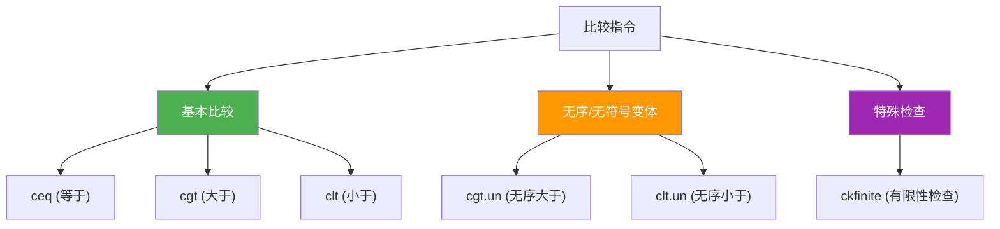
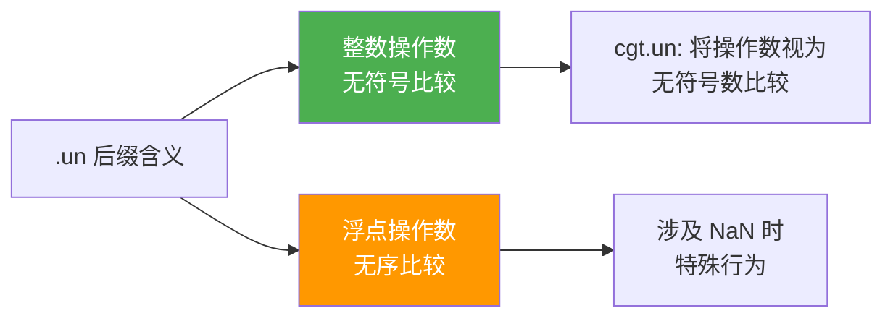

# 比较指令

> 比较指令是控制流的基石。它们比较栈上的两个值，将结果（0 或 1）压入栈，为后续的条件分支提供判断依据。浮点 NaN 的特殊行为是最容易踩的坑。

## 指令总览



## 基本比较指令

所有比较指令将结果作为 `int32`（0 或 1）压入评估栈：

**栈行为**：`..., value1, value2 → ..., result`

| 指令 | 操作码 (hex) | 结果 = 1 的条件 | 结果 = 0 的条件 |
|------|-------------|----------------|----------------|
| `ceq` | 0xFE 0x01 | value1 == value2 | value1 != value2 |
| `cgt` | 0xFE 0x02 | value1 > value2 | value1 <= value2 |
| `clt` | 0xFE 0x03 | value1 < value2 | value1 >= value2 |

```
ceq 示例：比较 5 和 3

  ┌─────────┐
  │    3    │  value2  ← 弹出
  ├─────────┤
  │    5    │  value1  ← 弹出
  ├─────────┤         ┌─────────┐
  │  旧内容  │   →    │    0    │  5 != 3 → 结果为 0
  └─────────┘         └─────────┘
```

::: important
比较指令**不直接跳转**！它们只产生 0 或 1，需要配合 `brtrue`/`brfalse` 才能实现条件分支。这是 IL 与 x86 指令集的重要区别 —— x86 的 `cmp` 设置标志位后直接 `jcc` 跳转，IL 则将布尔值压栈。
:::

## 无序/无符号变体 (.un)

| 指令 | 操作码 (hex) | 说明 |
|------|-------------|------|
| `cgt.un` | 0xFE 0x02 | 无序/无符号大于 |
| `clt.un` | 0xFE 0x04 | 无序/无符号小于 |

`.un` 后缀有两个含义，取决于操作数类型：



## 浮点 NaN 比较陷阱

这是比较指令中**最容易出错**的部分。NaN（Not a Number）参与比较时，规则与直觉不同：

### IEEE 754 规则

| 比较表达式 | NaN 作为操作数的结果 |
|-----------|-------------------|
| `NaN == x` | **false** |
| `NaN != x` | **true** |
| `NaN < x` | **false** |
| `NaN > x` | **false** |
| `NaN == NaN` | **false** |

::: warning
**NaN 不等于任何值，包括它自己！** 这是 IEEE 754 的核心规则，也是 IL 比较指令中 `.un` 变体存在的主要原因。
:::

### IL 中 NaN 的处理

```
浮点比较的三种结果：
  - 大于 (greater than)
  - 小于 (less than)
  - 无序 (unordered) ← 当任一操作数为 NaN 时
```

| 指令 | 有序时结果 | 无序时结果 |
|------|-----------|-----------|
| `ceq` | 正常比较 | 0（false） |
| `cgt` | 正常比较 | 0（false） |
| `clt` | 正常比较 | 0（false） |
| `cgt.un` | 正常比较 | **1（true）** |
| `clt.un` | 正常比较 | 0（false） |

::: important
`cgt.un` 在无序情况下返回 1 —— 这意味着 `cgt.un` 等价于"大于 **或** 无序"。这个特性有一个巧妙用途：**检测 NaN**！

`cgt.un` + `ldc.i4.0` + `ceq` = 检测是否为 NaN（C# 的 `float.IsNaN`）。
:::

### NaN 检测的 IL 实现

```csharp
bool IsNaN(float f) => float.IsNaN(f);
```

```il
.method public hidebysig static bool IsNaN(float32 f) cil managed
{
  .maxstack 3

  // float.IsNaN 的 IL 实现
  IL_0000: ldarg.0          // 加载 f
  IL_0001: ldarg.0          // 再次加载 f
  IL_0002: ceq              // f == f ?
  IL_0004: ldc.i4.0         // 0
  IL_0005: ceq              // (f == f) == 0 → 即 f != f → NaN
  IL_0007: ret
}
```

::: tip
NaN 检测的原理：`f == f` 对于正常值返回 1，对于 NaN 返回 0（因为 NaN 不等于自身）。所以 `(f == f) == 0` 为真即表示 f 是 NaN。这是 IL 层面最优雅的 NaN 检测方式。
:::

### 浮点比较的 C# 到 IL 映射

```csharp
double a = 1.0, b = double.NaN;

bool equal = a == b;      // ceq
bool notEqual = a != b;   // ceq + ldc.i4.0 + ceq
bool greater = a > b;     // cgt
bool less = a < b;        // clt
bool greaterOrEqual = a >= b;  // clt + ldc.i4.0 + ceq
bool lessOrEqual = a <= b;     // cgt + ldc.i4.0 + ceq
```

```il
// a == b
IL_0000: ldloc.0         // a
IL_0001: ldloc.1         // b
IL_0002: ceq              // NaN → 0 (false) ✓

// a != b
IL_0000: ldloc.0
IL_0001: ldloc.1
IL_0002: ceq
IL_0004: ldc.i4.0
IL_0005: ceq              // NaN → 1 (true) ✓

// a > b
IL_0000: ldloc.0
IL_0001: ldloc.1
IL_0002: cgt              // NaN → 0 (false) ✓

// a >= b (= !(a < b))
IL_0000: ldloc.0
IL_0001: ldloc.1
IL_0002: clt              // a < b ?
IL_0004: ldc.i4.0
IL_0005: ceq              // 取反 → !(a < b)
```

::: warning
注意 `>=` 的实现方式：IL **没有** `cge` 指令！`a >= b` 编译为 `!(a < b)`，即 `clt` + 取反。同理 `a <= b` 是 `!(a > b)` = `cgt` + 取反。

这是因为 ECMA-335 只定义了 `ceq`/`cgt`/`clt` 三种基本比较，其余通过组合实现。
:::

## ckfinite —— 有限性检查

**栈行为**：`..., value → ..., value`

如果 `value` 是 NaN 或 Infinity，抛出 `ArithmeticException`；否则将原值压回栈。

```csharp
double EnsureFinite(double d)
{
    if (double.IsInfinity(d) || double.IsNaN(d))
        throw new ArithmeticException();
    return d;
}
```

```il
.method private hidebysig static float64 EnsureFinite(float64 d) cil managed
{
  .maxstack 1

  IL_0000: ldarg.0
  IL_0001: ckfinite         // 不是有限数则抛 ArithmeticException
  IL_0003: ret
}
```

::: tip
`ckfinite` 不改变栈上的值 —— 它只是检查，通过后原样压回。这使它可以方便地插入到计算链中。
:::

## C# 运算符 ↔ IL 映射总表

| C# 运算符 | IL 指令序列 | 说明 |
|-----------|-----------|------|
| `a == b` | `ceq` | |
| `a != b` | `ceq` + `ldc.i4.0` + `ceq` | 等于取反 |
| `a > b` | `cgt` | |
| `a < b` | `clt` | |
| `a >= b` | `clt` + `ldc.i4.0` + `ceq` | 小于取反 |
| `a <= b` | `cgt` + `ldc.i4.0` + `ceq` | 大于取反 |

::: important
记住：IL 中没有 `cge` 和 `cle`！`>=` 和 `<=` 都是通过取反实现的。这个设计减少了指令数量，代价是多一条指令（`ldc.i4.0` + `ceq`）。
:::

## 整数比较示例

```csharp
bool IsPositive(int x) => x > 0;
bool IsNegative(int x) => x < 0;
bool IsZero(int x) => x == 0;
```

```il
// bool IsPositive(int x) => x > 0;
.method public hidebysig static bool IsPositive(int32 x) cil managed
{
  .maxstack 2
  IL_0000: ldarg.0
  IL_0001: ldc.i4.0
  IL_0002: cgt              // x > 0 → 0 或 1
  IL_0004: ret
}

// bool IsNegative(int x) => x < 0;
.method public hidebysig static bool IsNegative(int32 x) cil managed
{
  .maxstack 2
  IL_0000: ldarg.0
  IL_0001: ldc.i4.0
  IL_0002: clt              // x < 0 → 0 或 1
  IL_0004: ret
}

// bool IsZero(int x) => x == 0;
.method public hidebysig static bool IsZero(int32 x) cil managed
{
  .maxstack 2
  IL_0000: ldarg.0
  IL_0001: ldc.i4.0
  IL_0002: ceq              // x == 0 → 0 或 1
  IL_0004: ret
}
```

## 参考文档

- [OpCodes.Ceq](https://learn.microsoft.com/en-us/dotnet/api/system.reflection.emit.opcodes.ceq)
- [OpCodes.Cgt](https://learn.microsoft.com/en-us/dotnet/api/system.reflection.emit.opcodes.cgt)
- [OpCodes.Cgt_Un](https://learn.microsoft.com/en-us/dotnet/api/system.reflection.emit.opcodes.cgt_un)
- [OpCodes.Clt](https://learn.microsoft.com/en-us/dotnet/api/system.reflection.emit.opcodes.clt)
- [OpCodes.Clt_Un](https://learn.microsoft.com/en-us/dotnet/api/system.reflection.emit.opcodes.clt_un)
- [OpCodes.Ckfinite](https://learn.microsoft.com/en-us/dotnet/api/system.reflection.emit.opcodes.ckfinite)
- [ECMA-335 III.4 - Comparison](https://ecma-international.org/publications-and-standards/standards/ecma-335/)

## 面试要点

1. **比较指令不跳转**：`ceq`/`cgt`/`clt` 只产生 0 或 1 压栈，不直接控制分支。需要配合 `brtrue`/`brfalse` 才能实现 if 判断。

2. **没有 cge 和 cle**：`>=` 编译为 `clt` + 取反，`<=` 编译为 `cgt` + 取反。这是 ECMA-335 的设计选择 —— 用 3 条基本指令 + 取反覆盖所有比较。

3. **NaN 的诡异行为**：`NaN == NaN` 为 false，`NaN != NaN` 为 true。这是 IEEE 754 的硬性规定，IL 严格遵循。NaN 检测用 `!(f == f)` 即 `ceq` + 取反。

4. **cgt.un 的双重含义**：对整数是无符号比较，对浮点是"大于或无序"（unordered）。后者使得 `cgt.un` 可以辅助检测 NaN。

5. **ckfinite 不改变值**：它检查有限性，通过后原值压栈。可以插入计算链中做运行时守卫。
