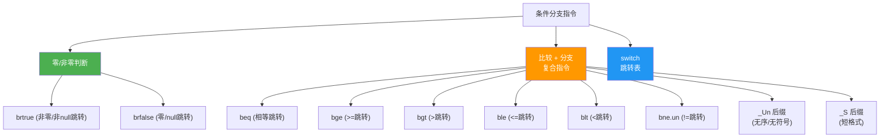
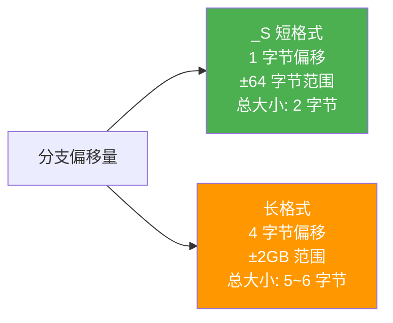
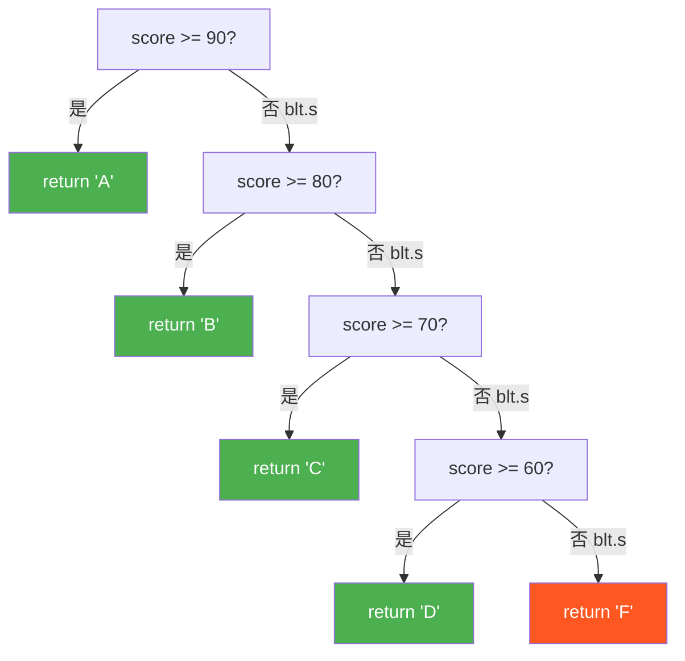
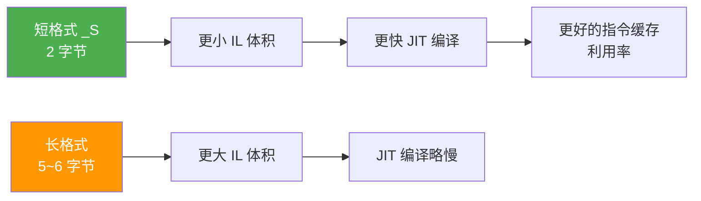

# 条件分支

> 条件分支是程序逻辑的核心。IL 提供了丰富的条件跳转指令，从简单的零/非零判断到复合比较分支，再到 switch 跳转表。理解短格式与长格式的选择，以及 C# 控制流到 IL 分支的映射，是读懂 IL 控制流的关键。

## 指令总览



## brtrue / brfalse —— 零/非零判断

最常用的条件分支，根据栈顶值是否为零决定是否跳转。

**栈行为**：`..., value → ...`

| 指令 | 短格式 | 操作码 (hex) | 跳转条件 |
|------|--------|-------------|----------|
| `brtrue` | `brtrue.s` | 0x3A / 0x2C | value != 0 (或非 null) |
| `brfalse` | `brfalse.s` | 0x3B / 0x2D | value == 0 (或 null) |

::: important
`brtrue`/`brfalse` 是唯一**消耗栈顶值**的分支指令。执行后，被判断的值从栈上移除。其他比较分支指令（`beq`/`bgt` 等）也是消耗栈顶两个值。
:::

### 常见用法

```csharp
// 空值检查
if (obj != null) { ... }     // ldloc + brfalse (反向跳转)

// 布尔判断
if (flag) { ... }            // ldloc + brfalse (反向跳转)

// 比较结果判断
if (a > b) { ... }           // cgt + brfalse (反向跳转)
```

## 比较分支复合指令

这些指令将**比较 + 条件跳转**合并为一条指令，比 `ceq` + `brtrue` 更高效。

**栈行为**：`..., value1, value2 → ...`

| 指令 | 短格式 | 跳转条件 | 操作码 (hex) |
|------|--------|----------|-------------|
| `beq` | `beq.s` | value1 == value2 | 0x3C / 0x2E |
| `bge` | `bge.s` | value1 >= value2 | 0x3E / 0x2F |
| `bgt` | `bgt.s` | value1 > value2 | 0x40 / 0x30 |
| `ble` | `ble.s` | value1 <= value2 | 0x42 / 0x31 |
| `blt` | `blt.s` | value1 < value2 | 0x44 / 0x32 |
| `bne.un` | `bne.un.s` | value1 != value2 (无序/无符号) | 0x33 / 0xFE 0x04 |

### 无序/无符号变体

| 指令 | 短格式 | 说明 |
|------|--------|------|
| `bge.un` | `bge.un.s` | 无序时也跳转（浮点 NaN 场景） |
| `bgt.un` | `bgt.un.s` | |
| `ble.un` | `ble.un.s` | |
| `blt.un` | `blt.un.s` | |
| `bne.un` | `bne.un.s` | 不等于或无序时跳转 |

::: tip
`bne.un` 是最常用的无序变体，因为 C# 的 `!=` 运算符编译为 `bne.un`（或 `ceq` + `brtrue`），确保 `NaN != x` 返回 true。其他 `_Un` 变体主要用于无符号整数比较。
:::

## 短格式 vs 长格式



| 对比项 | 短格式 `_S` | 长格式 |
|--------|------------|--------|
| 偏移字节数 | 1 字节 (int8) | 4 字节 (int32) |
| 跳转范围 | -128 ~ +127 字节 | ±2GB |
| 总指令大小 | 2 字节 | 5~6 字节 |
| JIT 优化 | 更小 IL → 更快编译 | 无特殊 |

::: important
C# 编译器在 **Release 模式**下总是优先使用短格式。只有当跳转目标超出短格式范围时才使用长格式。Debug 模式下由于额外的 NOP 指令，可能更多使用长格式。
:::

## C# if/else → IL 映射

### 简单 if

```csharp
if (x > 0)
{
    Console.WriteLine("positive");
}
```

```il
// if (x > 0)
IL_0000: ldarg.0          // 加载 x
IL_0001: ldc.i4.0         // 0
IL_0002: ble.s IL_0009    // x <= 0 则跳到末尾（反向逻辑！）

// Console.WriteLine("positive");
IL_0004: ldstr         "positive"
IL_0009: call          void [mscorlib]System.Console::WriteLine(string)

// if 结束
IL_0009: ...
```

::: warning
注意 C# 的 `if (x > 0)` 编译为 IL 的 `ble`（小于等于跳转），而非 `bgt`（大于跳转）。这是因为 IL 编译器使用**反向逻辑** —— 条件**不满足**时跳过 if 块。这在初学时容易混淆。
:::

### if/else

```csharp
if (x > 0)
    Console.WriteLine("positive");
else
    Console.WriteLine("non-positive");
```

```il
IL_0000: ldarg.0
IL_0001: ldc.i4.0
IL_0002: ble.s IL_0009       // x <= 0 → 跳到 else

// if 块
IL_0004: ldstr         "positive"
IL_0009: call          void [mscorlib]System.Console::WriteLine(string)
IL_000e: br.s IL_0017       // 跳过 else 块

// else 块
IL_0010: ldstr         "non-positive"
IL_0015: call          void [mscorlib]System.Console::WriteLine(string)

// 结束
IL_0017: ...
```

### if/else if/else 链

```csharp
public static string Classify(int score)
{
    if (score >= 90)
        return "A";
    else if (score >= 80)
        return "B";
    else if (score >= 70)
        return "C";
    else if (score >= 60)
        return "D";
    else
        return "F";
}
```

```il
.method public hidebysig static string Classify(int32 score) cil managed
{
  .maxstack 2

  // if (score >= 90)
  IL_0000: ldarg.0
  IL_0001: ldc.i4.s     90
  IL_0003: blt.s        IL_000c        // score < 90 → 下一条件

  //     return "A";
  IL_0005: ldstr        "A"
  IL_000a: ret

  // else if (score >= 80)
  IL_000c: ldarg.0
  IL_000d: ldc.i4.s     80
  IL_000f: blt.s        IL_0018        // score < 80 → 下一条件

  //     return "B";
  IL_0011: ldstr        "B"
  IL_0016: ret

  // else if (score >= 70)
  IL_0018: ldarg.0
  IL_0019: ldc.i4.s     70
  IL_001b: blt.s        IL_0024        // score < 70 → 下一条件

  //     return "C";
  IL_001d: ldstr        "C"
  IL_0022: ret

  // else if (score >= 60)
  IL_0024: ldarg.0
  IL_0025: ldc.i4.s     60
  IL_0027: blt.s        IL_0030        // score < 60 → else

  //     return "D";
  IL_0029: ldstr        "D"
  IL_002e: ret

  // else return "F";
  IL_0030: ldstr        "F"
  IL_0035: ret
}
```

分支结构图解：



## switch 语句 → IL 映射

C# 的 `switch` 语句在 IL 中有两种实现方式：

### 连续整数 → switch 跳转表

```csharp
switch (day)
{
    case 1: return "Mon";
    case 2: return "Tue";
    case 3: return "Wed";
    case 4: return "Thu";
    case 5: return "Fri";
    default: return "Weekend";
}
```

```il
IL_0000: ldarg.0                // day
IL_0001: ldc.i4.1               // 基准偏移
IL_0002: sub                    // day - 1（使索引从 0 开始）
IL_0003: switch (
    IL_0010,    // case 1: 0 → Mon
    IL_0017,    // case 2: 1 → Tue
    IL_001e,    // case 3: 2 → Wed
    IL_0025,    // case 4: 3 → Thu
    IL_002c     // case 5: 4 → Fri
)
// default:
IL_000f: ldstr        "Weekend"
IL_0014: ret

// case 1: return "Mon";
IL_0010: ldstr        "Mon"
IL_0015: ret

// case 2: return "Tue";
IL_0017: ldstr        "Tue"
IL_001c: ret

// ...以此类推
```

::: tip
`switch` IL 指令是一个跳转表：索引从 0 开始，跳转到对应位置。C# 编译器会自动减去最小 case 值使索引从 0 开始。跳转表是 O(1) 查找，比 if/else 链更高效。
:::

### 非连续值 → 多个 beq

```csharp
switch (code)
{
    case 10: return "A";
    case 100: return "B";
    case 1000: return "C";
    default: return "D";
}
```

```il
// 非连续值，编译器退化为 beq 序列
IL_0000: ldarg.0
IL_0001: ldc.i4.s     10
IL_0003: beq.s        IL_0010        // code == 10

IL_0005: ldarg.0
IL_0006: ldc.i4.s     100
IL_0008: beq.s        IL_0017        // code == 100

IL_000a: ldarg.0
IL_000b: ldc.i4       1000
IL_0010: beq.s        IL_001e        // code == 1000

// default
IL_0012: ldstr        "D"
IL_0017: ret

// case 10
IL_0010: ldstr        "A"
IL_0015: ret

// ...
```

## Null 检查模式

C# 中两种常见的 null 判断方式，IL 编译结果不同：

### 模式 1：brtrue / brfalse

```csharp
if (obj != null) { ... }
```

```il
IL_0000: ldloc.0          // obj
IL_0001: brfalse.s IL_0008  // null (0) 则跳转

// if 块
```

### 模式 2：ceq + brfalse

```csharp
if (obj == null) { ... }
```

```il
IL_0000: ldloc.0          // obj
IL_0001: ldnull           // null
IL_0002: ceq              // obj == null → 0 或 1
IL_0004: brfalse.s IL_000b  // 结果为 0 (不等于) 则跳转

// if 块
```

::: tip
两种模式编译结果不同：`!=` 使用直接的 `brtrue`/`brfalse`，而 `==` 可能使用 `ldnull` + `ceq` + `brfalse`。但 JIT 会将两者优化为相同的机器码。
:::

## 性能考量：短格式 vs 长格式



::: important
短格式的实际性能优势**非常微小**，因为 JIT 编译后的机器码不受 IL 指令大小影响。主要好处是减小 IL 体积，加速加载和 JIT 编译速度。不要为了"优化"而手写 `_S` 变体 —— 让编译器决定。
:::

## 参考文档

- [OpCodes.Brtrue](https://learn.microsoft.com/en-us/dotnet/api/system.reflection.emit.opcodes.brtrue)
- [OpCodes.Brfalse](https://learn.microsoft.com/en-us/dotnet/api/system.reflection.emit.opcodes.brfalse)
- [OpCodes.Beq](https://learn.microsoft.com/en-us/dotnet/api/system.reflection.emit.opcodes.beq)
- [OpCodes.Bge](https://learn.microsoft.com/en-us/dotnet/api/system.reflection.emit.opcodes.bge)
- [OpCodes.Bgt](https://learn.microsoft.com/en-us/dotnet/api/system.reflection.emit.opcodes.bgt)
- [OpCodes.Blt](https://learn.microsoft.com/en-us/dotnet/api/system.reflection.emit.opcodes.blt)
- [OpCodes.Bne_Un](https://learn.microsoft.com/en-us/dotnet/api/system.reflection.emit.opcodes.bne_un)
- [OpCodes.Switch](https://learn.microsoft.com/en-us/dotnet/api/system.reflection.emit.opcodes.switch)
- [ECMA-335 III.4 - Branch](https://ecma-international.org/publications-and-standards/standards/ecma-335/)

## 面试要点

1. **C# if 编译为反向跳转**：`if (x > 0)` 编译为 `ble`（小于等于跳转），跳过 if 块。条件满足时顺序执行，不满足时跳走。这是 IL 编译器的通用策略。

2. **brtrue/brfalse 与 beq/bgt 等的区别**：前者只判断栈顶一个值（零/非零），后者弹出两个值进行比较并跳转，是"比较+分支"的复合指令。

3. **短格式 _S 的偏移范围**：1 字节有符号偏移 = -128 ~ +127 字节。超出范围时编译器自动使用长格式。大多数方法内的分支都在短格式范围内。

4. **switch 的两种 IL 实现**：连续整数 case 用 `switch` 跳转表（O(1)查找），非连续 case 退化为多个 `beq`（线性查找）。C# 7+ 的模式匹配 switch 会更复杂。

5. **bne.un 与 NaN**：C# 的 `!=` 使用 `bne.un` 而非简单的 `beq` 取反，是因为 `bne.un` 在浮点无序（NaN）情况下也会跳转，确保 `NaN != x` 为 true。

6. **分支指令消耗栈值**：所有分支指令（`brtrue`/`brfalse`/`beq`/`bgt` 等）执行后，被比较的值从栈上移除。这与比较指令 `ceq`/`cgt` 不同（后者将结果压栈）。
