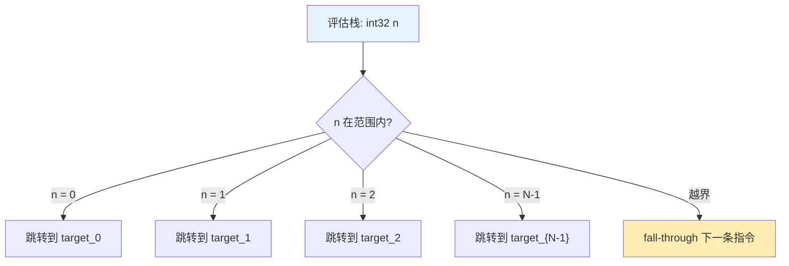
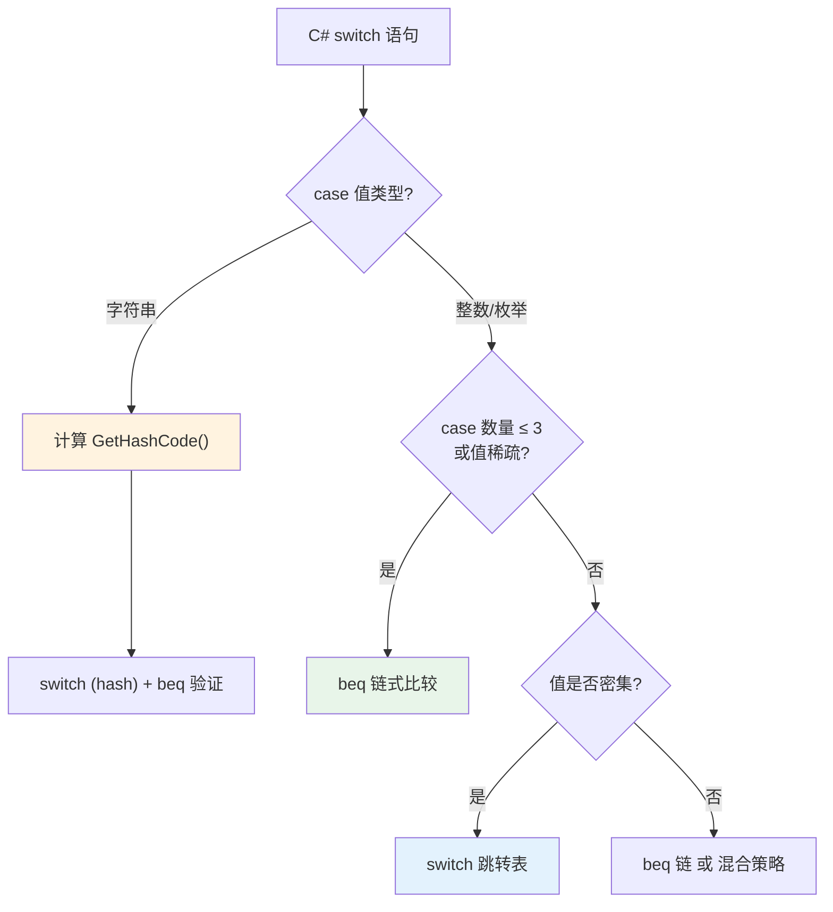

# 无条件跳转与 Switch

条件分支依据比较结果决定是否跳转，而**无条件跳转**则直接改变执行路径。`switch` 指令更是将跳转表化为一行 IL，实现 O(1) 的多路分发。

::: tip 核心要点
C# 的 `switch` 语句在 IL 层有多种编译策略：小范围用 `beq` 链、大密集范围用 `switch` 跳转表、字符串用哈希查找。理解这些策略，才能写出对 JIT 友好的代码。
:::

---

## 一、br 与 br.s —— 无条件跳转

### 1.1 指令对比

| 指令 | 全称 | 偏移量大小 | 跳转范围 | 适用场景 |
|------|------|-----------|---------|---------|
| `br` | Branch | 4 字节（int32） | ±2GB | 远距离跳转 |
| `br.s` | Branch Short | 1 字节（int8） | ±127 字节 | 近距离跳转 |

- `br target`：无条件跳转到 `target` 标签
- `br.s target`：短格式，编码更紧凑，JIT 会自动将 `br.s` 提升为 `br`（若目标超出范围）

### 1.2 C# 示例

```csharp
static void GotoExample()
{
    goto Label;
    Console.WriteLine("不会执行");
Label:
    Console.WriteLine("跳转目标");
}
```

对应 IL：

```il
IL_0000: br.s IL_0006        // goto Label — 短跳转
IL_0002: ldstr "不会执行"
IL_0007: call Console::WriteLine
IL_000c: br.s IL_0012        // 跳过后面的代码
IL_000e: ldstr "跳转目标"
IL_0013: call Console::WriteLine
IL_0018: ret
```

::: warning 注意
`br` / `br.s` **不能**用于跳出 `try` 块！在受保护区域（protected region）内必须使用 `leave` / `leave.s` 指令。
:::

---

## 二、leave 指令 —— 退出受保护区域

### 2.1 为什么不能用 br？

`try-catch-finally` 是结构化异常处理（SEH）区域，CLR 要求退出这些区域时必须正确清理栈帧。`br` 仅仅是跳转，不触发清理逻辑，因此**被禁止**在 `try` 块内使用。

| 指令 | 用途 | 偏移量 |
|------|------|--------|
| `leave target` | 退出 try/catch/finally，跳转到 target | 4 字节 |
| `leave.s target` | 短格式 | 1 字节 |

`leave` 的行为：
1. 清空当前评估栈
2. 如果在 `try` 块内，通知 CLR 退出受保护区域
3. 跳转到目标标签

### 2.2 C# 示例

```csharp
static void LeaveExample()
{
    try
    {
        Console.WriteLine("try");
        return;             // 编译为 leave，而非 br
    }
    finally
    {
        Console.WriteLine("finally");
    }
}
```

对应 IL（简化）：

```il
.try
{
    IL_0000: ldstr "try"
    IL_0005: call Console::WriteLine
    IL_000a: leave.s IL_001a    // return → leave.s 跳出 try
} // end .try
finally
{
    IL_000f: ldstr "finally"
    IL_0014: call Console::WriteLine
    IL_0019: endfinally
} // end finally
IL_001a: ret
```

---

## 三、switch 指令 —— 跳转表

### 3.1 指令格式

```il
switch (N)
    target_0
    target_1
    ...
    target_N-1
```

- 从评估栈弹出一个 `int32` 值 `n`
- 若 `0 <= n < N`，跳转到 `target_n`
- 若 `n < 0` 或 `n >= N`，执行 `switch` 的下一条指令（即 fall-through）

### 3.2 跳转表结构



::: important switch 的性能特征
`switch` 指令本质是一个**索引跳转表**，时间复杂度 O(1)。但跳转表的大小与 case 数量线性相关，稀疏的 case 值会浪费空间。
:::

---

## 四、C# switch 的三种编译策略

C# 编译器根据 case 的类型和分布，选择不同的 IL 编码方式：

### 4.1 小范围整数 → beq 链

case 数量少（通常 ≤ 3）或值不连续时，编译为 `beq`/`bne.un` 链：

```csharp
static int SmallSwitch(int x)
{
    switch (x)
    {
        case 1: return 10;
        case 100: return 20;
        case 1000: return 30;
        default: return 0;
    }
}
```

```il
IL_0000: ldarg.0
IL_0001: ldc.i4.1
IL_0002: beq.s IL_000a      // x == 1?

IL_0004: ldarg.0
IL_0005: ldc.i4.s 100
IL_0007: beq.s IL_000e      // x == 100?

IL_0009: ldarg.0
IL_000a: ldc.i4 1000
IL_000f: beq.s IL_0012      // x == 1000?

IL_0011: ldc.i4.0
IL_0012: ret                // default
```

### 4.2 大密集范围 → switch 跳转表

case 数量多且值密集时，编译器生成 `switch` 指令：

```csharp
static int DenseSwitch(int x)
{
    switch (x)
    {
        case 0: return 100;
        case 1: return 200;
        case 2: return 300;
        case 3: return 400;
        case 4: return 500;
        case 5: return 600;
        default: return 0;
    }
}
```

```il
IL_0000: ldarg.0
IL_0001: switch (6)
    IL_000a     // case 0
    IL_000f     // case 1
    IL_0014     // case 2
    IL_0019     // case 3
    IL_001e     // case 4
    IL_0023     // case 5
IL_0028: ldc.i4.0
IL_0029: ret                // default

IL_000a: ldc.i4.s 100
IL_000c: ret
IL_000f: ldc.i4.s 200
IL_0011: ret
IL_0014: ldc.i4.s 300
IL_0016: ret
IL_0019: ldc.i4.s 400
IL_001b: ret
IL_001e: ldc.i4.s 500
IL_0020: ret
IL_0023: ldc.i4.s 600
IL_0025: ret
```

### 4.3 字符串 switch → 哈希查找

字符串不能直接作为 `switch` 的索引，编译器会生成哈希值比较：

```csharp
static int StringSwitch(string s)
{
    switch (s)
    {
        case "apple": return 1;
        case "banana": return 2;
        case "cherry": return 3;
        default: return 0;
    }
}
```

编译器生成的 IL 大致等价于：

```csharp
// 编译器内部生成的代码（简化）
static int StringSwitch(string s)
{
    if (s == null) goto default;
    int hash = s.GetHashCode();
    switch (hash)
    {
        case 0x5E1F6B:  // "apple".GetHashCode()
            if (s == "apple") return 1;
            goto default;
        case 0x1C7E3F:  // "banana".GetHashCode()
            if (s == "banana") return 2;
            goto default;
        case 0x2A8D4C:  // "cherry".GetHashCode()
            if (s == "cherry") return 3;
            goto default;
        default:
            return 0;
    }
}
```

::: warning 字符串 switch 的双重检查
哈希值可能碰撞，所以先用 `switch` 按 hash 分发，再用 `beq` 做**字符串相等性验证**。C# 编译器确保结果正确，但 IL 比整数 switch 复杂得多。
:::

### 4.4 编译策略选择流程



---

## 五、switch vs if-else 链性能对比

### 5.1 理论分析

| 特性 | if-else 链 | switch 跳转表 |
|------|-----------|--------------|
| 时间复杂度 | O(n) — 逐个比较 | O(1) — 索引查找 |
| 空间开销 | 无额外空间 | 跳转表（N 个目标地址） |
| 最优 case | 第一个匹配 | 任意 case 等价 |
| 最差 case | 最后一个匹配 | 等价 |

### 5.2 实际考量

- **少量 case**（≤ 3）：`beq` 链与 `switch` 差异不大，JIT 可能将 `switch` 也优化为比较链
- **密集 case**（5+）：`switch` 跳转表的 CPU 分支预测更友好
- **稀疏 case**：跳转表浪费空间，编译器可能回退到二分搜索 + `beq`
- **JIT 优化**：JIT 编译器可能将 `beq` 链重构为跳转表，反之亦然

::: tip 性能建议
写代码时优先选择语义最清晰的写法（通常就是 `switch`），让编译器和 JIT 去做优化。手动拆分 `switch` 为 `if-else` 链通常适得其反。
:::

---

## 六、完整示例：5+ case 的 switch IL 输出

```csharp
using System;

class Program
{
    static string GetDayName(int day)
    {
        switch (day)
        {
            case 1: return "Monday";
            case 2: return "Tuesday";
            case 3: return "Wednesday";
            case 4: return "Thursday";
            case 5: return "Friday";
            case 6: return "Saturday";
            case 7: return "Sunday";
            default: return "Invalid";
        }
    }
}
```

对应 IL（`ildasm` 输出，简化）：

```il
.method private hidebysig static string GetDayName(int32 day) cil managed
{
    .maxstack 2
    .locals init (string V_0)

    IL_0000: ldarg.0
    IL_0001: ldc.i4.1
    IL_0002: sub                // day - 1，将范围从 1..7 映射到 0..6
    IL_0003: switch (7)
        IL_0013     // case 0 → Monday
        IL_001b     // case 1 → Tuesday
        IL_0023     // case 2 → Wednesday
        IL_002b     // case 3 → Thursday
        IL_0033     // case 4 → Friday
        IL_003b     // case 5 → Saturday
        IL_0043     // case 6 → Sunday
    IL_004b: ldstr "Invalid"
    IL_0050: ret                // default

    IL_0013: ldstr "Monday"
    IL_0018: ret
    IL_001b: ldstr "Tuesday"
    IL_0020: ret
    IL_0023: ldstr "Wednesday"
    IL_0028: ret
    IL_002b: ldstr "Thursday"
    IL_0030: ret
    IL_0033: ldstr "Friday"
    IL_0038: ret
    IL_003b: ldstr "Saturday"
    IL_0040: ret
    IL_0043: ldstr "Sunday"
    IL_0048: ret
}
```

::: important 编译器优化细节
注意 `ldc.i4.1` + `sub`：编译器自动将 case 值 1..7 减 1，映射到 0..6，这样跳转表索引从 0 开始，无需浪费第 0 个槽位。
:::

---

## 七、指令速查表

| 指令 | 操作码 | 栈行为 | 说明 |
|------|--------|--------|------|
| `br` | 0x38 | … → … | 无条件跳转（4 字节偏移） |
| `br.s` | 0x2B | … → … | 无条件跳转（1 字节偏移） |
| `switch` | 0x45 | …, int32 → … | 跳转表 |
| `leave` | 0xDD | 清空评估栈 → … | 退出受保护区域 |
| `leave.s` | 0xDE | 清空评估栈 → … | 退出受保护区域（短格式） |

---

## 八、面试要点

::: tip 面试高频问题
1. **C# switch 编译成 IL 的三种策略是什么？**
   - 少量/稀疏整数 → `beq` 链式比较；大量密集整数 → `switch` 跳转表；字符串 → `GetHashCode()` + `switch` + `beq` 验证

2. **为什么不能在 try 块内使用 br 跳出？**
   - `br` 不触发受保护区域的清理逻辑，必须用 `leave`，确保 `finally` 块得以执行

3. **switch 指令的时间复杂度是多少？**
   - O(1)，基于索引的跳转表直接寻址

4. **字符串 switch 的双重检查机制是什么？**
   - 先用 `GetHashCode()` 做 `switch` 分发，再用 `beq`（字符串相等）验证，防止哈希碰撞

5. **br 和 br.s 的区别？**
   - 偏移量大小不同（4 字节 vs 1 字节），`br.s` 编码更紧凑但跳转范围有限，JIT 会自动处理提升

6. **switch 和 if-else 链的性能差异？**
   - `switch` 跳转表 O(1)，`if-else` 链 O(n)；但少量 case 差异不大，JIT 可能做进一步优化
:::

---

## 参考资料

- [OpCodes.Br Field](https://learn.microsoft.com/en-us/dotnet/api/system.reflection.emit.opcodes.br)
- [OpCodes.Br_S Field](https://learn.microsoft.com/en-us/dotnet/api/system.reflection.emit.opcodes.br_s)
- [OpCodes.Switch Field](https://learn.microsoft.com/en-us/dotnet/api/system.reflection.emit.opcodes.switch)
- [OpCodes.Leave Field](https://learn.microsoft.com/en-us/dotnet/api/system.reflection.emit.opcodes.leave)
- [ECMA-335 Partition III - Control transfer](https://ecma-international.org/publications-and-standards/standards/ecma-335/)
