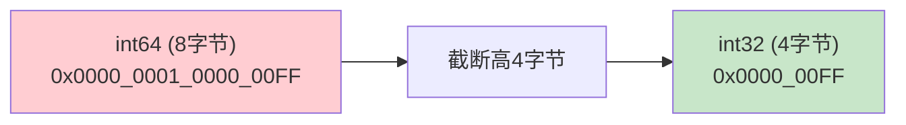
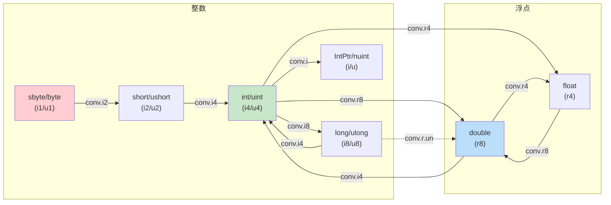

# 数值转换

.NET 的数值类型有 11 种之多（从 `byte` 到 `double`），它们之间的转换全部由 `conv.*` 系列指令完成。理解这些指令，才能看清 C# 隐式/显式转换的本质，以及溢出检查的代价。

::: tip 核心要点
C# 的隐式转换 → 无溢出检查的 `conv.*`；`checked` 块中的显式转换 → `conv.ovf.*`。大类型转小类型的截断行为由 IL 层决定，与语言无关。
:::

---

## 一、conv 指令家族

### 1.1 整数转换指令

| 指令 | 目标类型 | C# 类型 | 操作码 |
|------|---------|---------|--------|
| `conv.i1` | int8（有符号） | `sbyte` | 0x67 |
| `conv.i2` | int16（有符号） | `short` | 0x68 |
| `conv.i4` | int32（有符号） | `int` | 0x69 |
| `conv.i8` | int64（有符号） | `long` | 0x6A |
| `conv.u1` | unsigned int8 | `byte` | 0xD2 |
| `conv.u2` | unsigned int16 | `ushort` | 0xD1 |
| `conv.u4` | unsigned int32 | `uint` | 0x6B |
| `conv.u8` | unsigned int64 | `ulong` | 0x6C |

### 1.2 浮点转换指令

| 指令 | 目标类型 | C# 类型 | 操作码 |
|------|---------|---------|--------|
| `conv.r4` | float32 | `float` | 0x6D |
| `conv.r8` | float64 | `double` | 0x6E |
| `conv.r.un` | float（从无符号整数） | — | 0x76 |

### 1.3 平台相关转换指令

| 指令 | 目标类型 | 说明 | 操作码 |
|------|---------|------|--------|
| `conv.i` | native int（有符号） | `IntPtr`，32/64 位平台不同 | 0xD3 |
| `conv.u` | native int（无符号） | `UIntPtr`/`nuint` | 0xE0 |

::: important conv.r.un 的特殊用途
`conv.r.un` 专门处理**无符号整数到浮点数**的转换。普通 `conv.r4`/`conv.r8` 会先将无符号整数当作有符号数再转浮点，对于大数（如 `0x80000000` 以上）会得到错误结果。`conv.r.un` 确保无符号语义正确。
:::

---

## 二、溢出检查变体 —— conv.ovf.*

### 2.1 指令一览

`conv.ovf.*` 在转换时检查是否溢出，若溢出则抛出 `OverflowException`。共有 16 个变体：

| 目标类型 | 有符号 | 无符号 |
|---------|--------|--------|
| int8 | `conv.ovf.i1` (0xB3) | `conv.ovf.u1` (0xB4) |
| int16 | `conv.ovf.i2` (0xB5) | `conv.ovf.u2` (0xB6) |
| int32 | `conv.ovf.i4` (0xB7) | `conv.ovf.u4` (0xB8) |
| int64 | `conv.ovf.i8` (0xB9) | `conv.ovf.u8` (0xBA) |
| native int | `conv.ovf.i` (0xD4) | `conv.ovf.u` (0xD5) |
| unsigned → float | — | `conv.ovf.r.un` (0xDB) |

### 2.2 conv vs conv.ovf 对比

```
conv.i4    → 直接截断，不检查溢出，永远成功
conv.ovf.i4 → 检查溢出，超出范围抛 OverflowException
```

```csharp
long big = 0x1_0000_0000L; // 4294967296，超过 int32 范围

// unchecked（默认）：截断
int truncated = (int)big;       // conv.i4 → 结果为 0

// checked：溢出检查
checked
{
    int overflow = (int)big;    // conv.ovf.i4 → 抛出 OverflowException
}
```

---

## 三、截断行为 —— 大类型转小类型

### 3.1 截断规则

大类型 → 小类型的转换，直接**丢弃高位**：



### 3.2 C# 示例

```csharp
int i = 0x12345678;
short s = (short)i;        // conv.i2 → 0x5678（截断高16位）

long l = 0x1_0000_0000L;
int j = (int)l;            // conv.i4 → 0x00000000（截断高32位）
```

对应 IL：

```il
// int → short
IL_0000: ldc.i4 0x12345678
IL_0005: conv.i2              // 截断为 int16

// long → int
IL_0006: ldc.i8 0x100000000
IL_000f: conv.i4              // 截断为 int32
```

::: warning 有符号转换的符号扩展
`conv.i1`/`conv.i2` 将结果视为有符号数。截断后再扩展回 `int32` 时，CLR 会做**符号扩展**：最高位为 1 则高位全部填 1。例如 `0xFF` 截断为 `i1` 后扩展回 `i4` 为 `0xFFFFFFFF`（即 -1）。
:::

---

## 四、Native Int (IntPtr) 处理

### 4.1 conv.i 与 conv.u

`native int` 的大小取决于运行平台：
- 32 位进程：4 字节（等同 `int32`/`uint32`）
- 64 位进程：8 字节（等同 `int64`/`uint64`）

```csharp
IntPtr ptr = new IntPtr(0x1234);     // conv.i
nuint uptr = (nuint)0x1234;          // conv.u
```

### 4.2 指针算术中的应用

```csharp
unsafe void PointerArithmetic(int* p, int offset)
{
    int* q = p + offset;
    // 编译为：
    // ldarg.0        (加载 p)
    // conv.i         (转为 native int)
    // ldarg.1        (加载 offset)
    // conv.i         (转为 native int)
    // sizeof int     (4)
    // mul            (offset * 4)
    // add            (p + offset * 4)
    // conv.u         (转回指针)
}
```

---

## 五、C# 隐式/显式转换与 conv 指令映射

### 5.1 隐式转换（安全，不丢失精度）

```csharp
short s = 100;
int i = s;              // conv.i4 — short → int，安全提升
float f = i;            // conv.r4 — int → float
double d = f;           // conv.r8 — float → double
```

IL 输出：

```il
IL_0000: ldc.i4.s 100
IL_0002: conv.i4              // short → int（实际上 ldloc.s 已带类型）
IL_0003: conv.r4              // int → float
IL_0004: conv.r8              // float → double
```

### 5.2 显式转换（可能丢失精度或溢出）

```csharp
double d = 3.14;
int i = (int)d;             // conv.i4 — 浮点 → 整数，截断小数

long l = 0xFF_FF_FF_FF_L;
uint u = (uint)l;           // conv.u4 — long → uint，截断高位

byte b = (byte)u;           // conv.u1 — uint → byte，截断高位
```

IL 输出：

```il
IL_0000: ldc.r8 3.14
IL_0009: conv.i4              // double → int

IL_000a: ldc.i4 0xFFFFFFFF
IL_000f: conv.u4              // long → uint

IL_0010: conv.u1              // uint → byte
```

### 5.3 checked 上下文

```csharp
checked
{
    int big = 0x7FFFFF00;
    byte b = (byte)big;       // conv.ovf.u1 → OverflowException!
}
```

IL 输出：

```il
IL_0000: ldc.i4 0x7FFFFF00
IL_0005: conv.ovf.u1         // 检查是否溢出 → 抛出 OverflowException
```

---

## 六、浮点转换的特殊情况

### 6.1 整数 → 浮点：精度丢失

```csharp
long l = (1L << 53) + 1;    // 9007199254740993
double d = l;                // conv.r8 → 9007199254740992（丢失最低位）
```

`double` 只有 53 位尾数，超过 53 位的 `long` 会丢失精度。

### 6.2 浮点 → 整数：特殊值处理

| 浮点值 | conv 结果 | conv.ovf 结果 |
|--------|----------|--------------|
| NaN | 0 | OverflowException |
| +Infinity | 实现定义 | OverflowException |
| -Infinity | 实现定义 | OverflowException |
| 超出目标范围 | 截断 | OverflowException |

::: warning 浮点转整数的未定义行为
ECMA-335 规定：浮点数转整数时，若值超出目标类型范围，结果是**未指定的**（unspecified）。不同 CLR 版本、不同平台可能给出不同结果。务必使用 `conv.ovf.*` 或提前检查范围。
:::

---

## 七、转换关系总图



---

## 八、指令速查表

| 指令 | 操作码 | 栈行为 | 说明 |
|------|--------|--------|------|
| `conv.i1` | 0x67 | …, value → …, int8 | 转为 sbyte |
| `conv.i2` | 0x68 | …, value → …, int16 | 转为 short |
| `conv.i4` | 0x69 | …, value → …, int32 | 转为 int |
| `conv.i8` | 0x6A | …, value → …, int64 | 转为 long |
| `conv.u1` | 0xD2 | …, value → …, uint8 | 转为 byte |
| `conv.u2` | 0xD1 | …, value → …, uint16 | 转为 ushort |
| `conv.u4` | 0x6B | …, value → …, uint32 | 转为 uint |
| `conv.u8` | 0x6C | …, value → …, uint64 | 转为 ulong |
| `conv.r4` | 0x6D | …, value → …, float32 | 转为 float |
| `conv.r8` | 0x6E | …, value → …, float64 | 转为 double |
| `conv.i` | 0xD3 | …, value → …, native int | 转为 IntPtr |
| `conv.u` | 0xE0 | …, value → …, native uint | 转为 UIntPtr |
| `conv.r.un` | 0x76 | …, uint → …, float | 无符号整数转浮点 |

---

## 九、面试要点

::: tip 面试高频问题
1. **C# 隐式转换和显式转换在 IL 层的区别？**
   - 本质都是 `conv.*` 指令；区别在于隐式转换是安全的（不会溢出/丢失精度），显式转换可能截断

2. **conv 和 conv.ovf 的区别？**
   - `conv` 直接截断不检查；`conv.ovf` 检查溢出，超出范围抛 `OverflowException`；对应 C# 的 `unchecked`/`checked` 上下文

3. **long 转 int 时高位怎么处理？**
   - 直接截断高 32 位，保留低 32 位；在 checked 上下文中如果值超出 int 范围则抛异常

4. **conv.r.un 的用途是什么？**
   - 将无符号整数转为浮点数，避免大数被误当作有符号数导致转换结果错误

5. **浮点转整数时溢出会怎样？**
   - `conv.*`：结果未指定（ECMA-335）；`conv.ovf.*`：抛出 `OverflowException`

6. **native int 在 32 位和 64 位上的行为差异？**
   - 32 位进程中等同 int32，64 位进程中等同 int64；`conv.i`/`conv.u` 根据平台自动选择大小
:::

---

## 参考资料

- [OpCodes.Conv_I1 Field](https://learn.microsoft.com/en-us/dotnet/api/system.reflection.emit.opcodes.conv_i1)
- [OpCodes.Conv_Ovf_I4 Field](https://learn.microsoft.com/en-us/dotnet/api/system.reflection.emit.opcodes.conv_ovf_i4)
- [OpCodes.Conv_R_Un Field](https://learn.microsoft.com/en-us/dotnet/api/system.reflection.emit.opcodes.conv_r_un)
- [OpCodes.Conv_I Field](https://learn.microsoft.com/en-us/dotnet/api/system.reflection.emit.opcodes.conv_i)
- [ECMA-335 Partition III - Numeric conversions](https://ecma-international.org/publications-and-standards/standards/ecma-335/)
