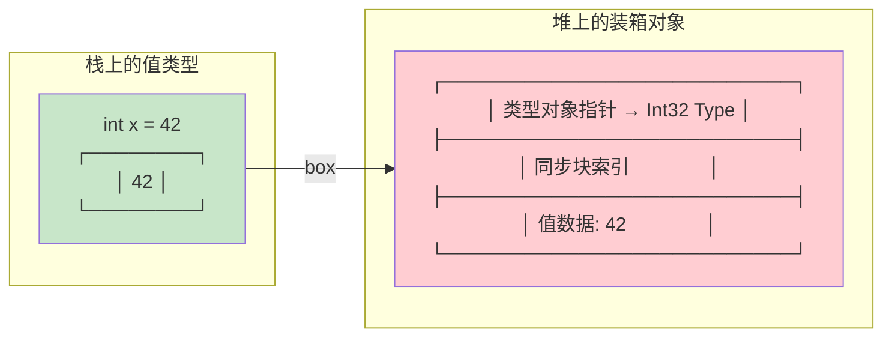

# 装箱与拆箱

装箱（Boxing）和拆箱（Unboxing）是 .NET 中值类型与引用类型之间的桥梁。看似简单的一行 C# 代码，背后可能隐藏着堆分配和 GC 压力。

::: warning 性能警示
每次 `box` 都会在托管堆上分配内存！在高频路径上（如循环、热方法），装箱是常见的性能杀手。泛型是消除装箱的最佳手段。
:::

---

## 一、box 指令 —— 值类型装箱

### 1.1 指令行为

`box valueTokenType`：
1. 在托管堆上分配内存（包含类型对象指针 + 同步块索引 + 值类型数据）
2. 将值类型的字段复制到堆上的新对象中
3. 将对象引用压入评估栈

```csharp
int x = 42;
object o = x;    // box — 值类型 → 引用类型
```

```il
IL_0000: ldc.i4.s 42
IL_0002: stloc.0          // int x = 42
IL_0003: ldloc.0
IL_0004: box [mscorlib]System.Int32    // 装箱！
IL_0009: stloc.1          // object o = boxed int
```

### 1.2 装箱内存布局



::: important 装箱开销
- **堆分配**：每次 `box` 都在 GC 堆上分配，触发 GC 扫描
- **内存膨胀**：32 位 +8 字节（类型对象指针 + 同步块），64 位 +16 字节
- **数据复制**：值类型字段从栈复制到堆
- **间接访问**：后续访问需要拆箱或接口分发
:::

---

## 二、unbox 与 unbox.any —— 拆箱

### 2.1 unbox —— 获取托管指针

`unbox valueType`：
- 从评估栈弹出对象引用
- 验证对象是否为指定值类型的装箱实例
- 将**托管指针**（managed pointer，指向堆上的值数据部分）压入栈

关键：`unbox` 返回的是**指针**，不是值！要读取值还需 `ldobj`。

### 2.2 unbox.any —— 直接获取值

`unbox.any valueType`：
- 等价于 `unbox` + `ldobj`
- 直接将值压入评估栈
- **C# 拆箱语法 `(int)o` 编译为 `unbox.any`**

### 2.3 指令对比

| 指令 | 返回类型 | C# 对应 | 常见场景 |
|------|---------|---------|---------|
| `unbox` | 托管指针（&） | 无直接对应 | 修改装箱值、泛型约束 |
| `unbox.any` | 值本身 | `(T)o` | C# 拆箱转型 |

### 2.4 C# 示例

```csharp
object o = 42;
int x = (int)o;    // unbox.any — 拆箱
```

```il
IL_0000: ldc.i4.s 42
IL_0002: box [mscorlib]System.Int32
IL_0007: stloc.0          // object o = 42（装箱）

IL_0008: ldloc.0
IL_0009: unbox.any [mscorlib]System.Int32   // 拆箱！
IL_000e: stloc.1          // int x = 42
```

### 2.5 unbox 指针的用途

```csharp
// C# 无法直接写出 unbox（返回指针），但 ILGenerator 可以
// 以下伪代码展示 unbox + ldobj 的等价操作

// unbox.any Int32 等价于：
// unbox Int32
// ldobj Int32
```

::: warning 拆箱不是 box 的逆操作
- `box`：分配堆内存 + 复制数据（创建新对象）
- `unbox.any`：验证类型 + 复制值数据（不分配堆内存）
- 拆箱只复制值，不分配堆内存，因此比装箱开销小得多
:::

---

## 三、常见装箱陷阱

### 3.1 enum.ToString()

```csharp
enum Color { Red, Green, Blue }

// 内部实现：value.ToString()
// ToString() 是虚方法，值类型调用需要装箱！
Color c = Color.Red;
string name = c.ToString();   // 内部会 box（某些情况 JIT 可能优化）
```

### 3.2 ArrayList / 旧式集合

```csharp
var list = new ArrayList();
for (int i = 0; i < 10000; i++)
{
    list.Add(i);   // 每次 Add 都 box！10000 次堆分配
}
```

```il
IL_000a: ldloc.1
IL_000b: ldloc.2
IL_000c: box [mscorlib]System.Int32    // 每次循环都装箱
IL_0011: callvirt ArrayList::Add
```

### 3.3 Dictionary\<int, object\>

```csharp
var dict = new Dictionary<int, object>();
dict[1] = 42;     // key 不装箱（泛型），value 装箱（object）
```

### 3.4 接口分发

```csharp
interface IPlayable { void Play(); }
struct Music : IPlayable
{
    public void Play() { /* ... */ }
}

Music m = new Music();
IPlayable p = m;    // box! 值类型 → 接口引用 = 装箱
p.Play();           // 通过装箱对象调用
```

```il
IL_0000: ldloca.s m
IL_0002: initobj Music
IL_0008: ldloc.0
IL_0009: box Music            // 装箱为接口引用
IL_000e: stloc.1
IL_000f: ldloc.1
IL_0010: callvirt IPlayable::Play
```

::: tip 避免接口装箱
使用 `constrained.` 前缀调用值类型接口方法可以避免装箱。C# 编译器在泛型约束调用时会自动使用此优化：
```csharp
void Play<T>(T item) where T : IPlayable
{
    item.Play();   // constrained. callvirt — 不装箱！
}
```
:::

---

## 四、泛型消除装箱

### 4.1 ArrayList vs List\<int\>

```csharp
// ArrayList — 每次装箱
var arrayList = new ArrayList();
arrayList.Add(42);    // box Int32

// List<int> — 无装箱
var list = new List<int>();
list.Add(42);         // 直接存储，无 box 指令
```

List\<int\> 的 IL：

```il
IL_0000: ldloc.0
IL_0001: ldc.i4.s 42
IL_0003: callvirt List`1<int32>::Add(int32)   // 无 box！
```

### 4.2 性能基准

```csharp
using System.Diagnostics;
using System.Collections;

// Benchmark: 1,000,000 次操作
const int N = 1_000_000;

// ArrayList（装箱）
var sw = Stopwatch.StartNew();
var al = new ArrayList();
for (int i = 0; i < N; i++) al.Add(i);
sw.Stop();
Console.WriteLine($"ArrayList: {sw.ElapsedMilliseconds}ms");

// List<int>（无装箱）
sw.Restart();
var list = new List<int>();
for (int i = 0; i < N; i++) list.Add(i);
sw.Stop();
Console.WriteLine($"List<int>: {sw.ElapsedMilliseconds}ms");
```

典型结果：

| 集合类型 | 时间 | GC 次数 | 原因 |
|---------|------|---------|------|
| ArrayList | ~150ms | 多次 Gen0/Gen1 | 100 万次 box 分配 |
| List\<int\> | ~15ms | 几乎无 | 无堆分配 |

::: important 泛型的核心价值
泛型不仅是类型安全，更是**消除装箱/拆箱**的最重要手段。`List<int>` 的内部数组直接存储 int 值，无需包装为对象。
:::

---

## 五、C# 隐式装箱 vs 显式拆箱

### 5.1 隐式装箱场景

```csharp
// 1. 值类型赋值给 object
object o = 42;                    // box

// 2. 值类型赋值给接口
IComparable c = 42;               // box

// 3. 值类型传入 object 参数
Console.WriteLine("{0}", 42);     // box（旧式格式化）

// 4. 枚举的 Format/ToString
DayOfWeek day = DayOfWeek.Monday;
string name = string.Format("{0}", day);  // box
```

### 5.2 显式拆箱

```csharp
object o = 42;
int x = (int)o;                   // unbox.any

// 拆箱到不同类型 = 先拆箱再转换
object o2 = 42L;
int y = (int)(long)o2;            // unbox.any Int64 + conv.i4
```

### 5.3 IL 对比

```il
// 隐式装箱
IL_0000: ldc.i4.s 42
IL_0002: box [mscorlib]System.Int32

// 显式拆箱
IL_0007: ldloc.0
IL_0008: unbox.any [mscorlib]System.Int32

// 拆箱 + 转换
IL_000d: ldloc.1
IL_000e: unbox.any [mscorlib]System.Int64
IL_0013: conv.i4
```

---

## 六、Nullable 的装箱

### 6.1 特殊规则

`Nullable<T>` 的装箱行为很特殊：

```csharp
int? a = 42;
object o = a;      // 装箱为 Int32（不是 Nullable<Int32>！）

int? b = null;
object o2 = b;     // 装箱为 null 引用（不是空对象！）
```

```il
// int? a = 42; object o = a;
IL_0000: ldloca.s a
IL_0002: call Nullable`1<int32>::get_HasValue
IL_0007: brfalse.s IL_0015
IL_0009: ldloca.s a
IL_000b: call Nullable`1<int32>::get_Value
IL_0010: box [mscorlib]System.Int32        // 装箱为 Int32
IL_0015: br.s IL_001a

// int? b = null; object o2 = b;
IL_0015: ldnull                              // 直接为 null
IL_001a: stloc.1
```

::: tip Nullable 装箱规则
- `HasValue = true` → 装箱为底层值类型（T）
- `HasValue = false` → 装箱为 `null` 引用
- 永远不会装箱为 `Nullable<T>` 类型的对象
:::

---

## 七、指令速查表

| 指令 | 操作码 | 栈行为 | 说明 |
|------|--------|--------|------|
| `box` | 0x8C | …, value → …, objRef | 值类型装箱为对象引用 |
| `unbox` | 0x79 | …, objRef → …, managedPtr | 获取装箱值的托管指针 |
| `unbox.any` | 0xA5 | …, objRef → …, value | 拆箱获取值（C# 拆箱转型） |

---

## 八、面试要点

::: tip 面试高频问题
1. **装箱和拆箱分别在 IL 层对应什么指令？**
   - 装箱 → `box`；拆箱 → `unbox.any`（C# 的 `(T)o` 语法）

2. **unbox 和 unbox.any 的区别？**
   - `unbox` 返回托管指针（指向堆上值数据），需要配合 `ldobj` 读取；`unbox.any` 直接返回值，等于 `unbox` + `ldobj`

3. **装箱的性能开销有哪些？**
   - 堆分配 + GC 压力 + 内存膨胀（+8/16 字节开销）+ 数据复制 + 缓存不友好

4. **如何检测代码中的装箱？**
   - 使用 `dotnet-trace` / `PerfView` 查看 GC 分配；用 SharpLab 查看 IL 中是否有 `box` 指令

5. **泛型如何消除装箱？**
   - 泛型为每个值类型生成专用代码，直接操作值，无需包装为 object；`List<int>` 内部是 `int[]`

6. **Nullable 的装箱有什么特殊？**
   - 有值时装箱为底层类型 T（不是 `Nullable<T>`），null 时装箱为 null 引用；拆箱回来需要用 `Nullable<T>` 的特殊处理

7. **值类型通过接口调用方法为什么需要装箱？**
   - 接口引用必须是堆上的对象引用，值类型在栈上无法直接作为接口引用；`constrained.` 前缀可以在泛型中避免此装箱
:::

---

## 参考资料

- [OpCodes.Box Field](https://learn.microsoft.com/en-us/dotnet/api/system.reflection.emit.opcodes.box)
- [OpCodes.Unbox Field](https://learn.microsoft.com/en-us/dotnet/api/system.reflection.emit.opcodes.unbox)
- [OpCodes.Unbox_Any Field](https://learn.microsoft.com/en-us/dotnet/api/system.reflection.emit.opcodes.unbox_any)
- [Boxing and Unboxing - C# Programming Guide](https://learn.microsoft.com/en-us/dotnet/csharp/programming-guide/types/boxing-and-unboxing)
- [ECMA-335 Partition III - Boxing and unboxing](https://ecma-international.org/publications-and-standards/standards/ecma-335/)
