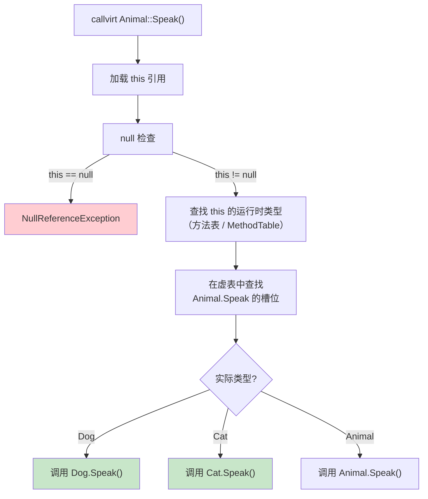
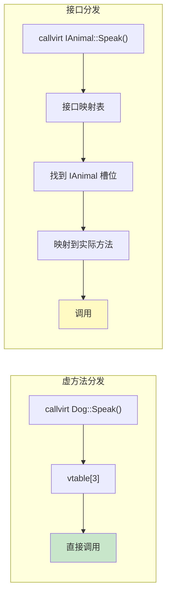

# call 与 callvirt

.NET IL 有两种方法调用指令：`call` 和 `callvirt`。看似简单的二选一，背后却隐藏着 C# 编译器的一个重要设计决策——**为什么 C# 对非虚实例方法也使用 callvirt？**

::: tip 核心要点
- `call`：直接调用，无 null 检查，无虚分发
- `callvirt`：虚分发 + null 检查
- C# 编译器对**所有实例方法**默认使用 `callvirt`（即使非虚），目的是自动进行 null 检查
:::

---

## 一、call 指令 —— 直接调用

### 1.1 指令行为

`call methodDescr`：
1. 按方法描述符直接调用目标方法
2. **不做 null 检查**（如果 `this` 为 null，方法体可能访问非法内存）
3. **不做虚分发**（总是调用指定的方法，不查虚表）

### 1.2 适用场景

| 场景 | 原因 |
|------|------|
| 静态方法调用 | 无 `this`，无需 null 检查 |
| 值类型方法调用 | 值类型不可能为 null，无需检查 |
| `base.Method()` | 明确要求调用基类版本，跳过虚分发 |
| 非虚方法（编译器选择） | 无需虚分发 |
| 结构体构造函数 | 值类型语义 |

### 1.3 示例

```csharp
static void StaticCall()
{
    Console.WriteLine("hello");  // call（静态方法）
}
```

```il
IL_0000: ldstr "hello"
IL_0005: call [mscorlib]System.Console::WriteLine(string)
IL_000a: ret
```

---

## 二、callvirt 指令 —— 虚调用

### 2.1 指令行为

`callvirt methodDescr`：
1. 从评估栈获取 `this` 引用
2. **检查 `this` 是否为 null**，若为 null 抛出 `NullReferenceException`
3. 根据 `this` 的**实际运行时类型**查找方法（虚分发）

### 2.2 虚分发机制



### 2.3 虚表（vtable）结构

每个引用类型都有方法表（MethodTable），其中虚方法按槽位排列：

```
Dog 类型的方法表（简化）：
┌─────┬────────────────────────────┐
│ 槽位 │ 方法                       │
├─────┼────────────────────────────┤
│  0  │ Object.Equals()            │  ← 继承自 Object
│  1  │ Object.GetHashCode()       │
│  2  │ Object.ToString()          │
│  3  │ Animal.Speak() → Dog.Speak()│  ← 被覆写
│  4  │ Dog.Fetch()                │  ← Dog 新增
└─────┴────────────────────────────┘
```

`callvirt Animal::Speak()` → 查找槽位 3 → 找到 `Dog.Speak()` → 调用

---

## 三、C# 编译器的关键选择：非虚方法也用 callvirt

### 3.1 令人意外的 IL

```csharp
class MyClass
{
    public void NormalMethod() { }     // 非虚方法

    public virtual void VirtualMethod() { }

    public void CallBoth()
    {
        NormalMethod();      // 你以为会编译为 call？
        VirtualMethod();     // 当然编译为 callvirt
    }
}
```

实际 IL：

```il
IL_0000: ldarg.0           // 加载 this
IL_0001: callvirt instance void MyClass::NormalMethod()    // callvirt！
IL_0006: ldarg.0           // 加载 this
IL_0007: callvirt instance void MyClass::VirtualMethod()   // callvirt
IL_000c: ret
```

::: important C# 编译器的设计决策
C# 编译器对**所有实例方法调用**（无论是否虚方法）都使用 `callvirt`，原因是为了**自动进行 null 检查**。如果用 `call` 调用非虚方法，`this` 为 null 时不会立即报错，而是延迟到方法内部访问成员时才崩溃，调试更困难。
:::

### 3.2 null 行为对比

```csharp
class Foo
{
    public void NonVirtual() { }          // 无成员访问

    public static void Test()
    {
        Foo f = null;
        f.NonVirtual();                   // C# 输出：NullReferenceException
    }
}
```

如果编译为 `call`：

```il
// 假设 C# 使用 call
IL_0000: ldloc.0          // this = null
IL_0001: call instance void Foo::NonVirtual()
// 方法体为空，不访问任何成员 → 不会崩溃！
// null 引用被静默忽略
```

实际编译为 `callvirt`：

```il
// 实际 IL
IL_0000: ldloc.0          // this = null
IL_0001: callvirt instance void Foo::NonVirtual()
// callvirt 的 null 检查立即触发 → NullReferenceException
```

### 3.3 何时 C# 使用 call

| 场景 | 指令 | 原因 |
|------|------|------|
| 静态方法 | `call` | 无 this |
| 值类型实例方法 | `call` | 值类型不可能为 null |
| `base.Method()` | `call` | 明确跳过虚分发 |
| 构造函数链 | `call` | 对象尚未完全构造 |
| 普通实例方法 | `callvirt` | null 检查 |

---

## 四、接口分发

### 4.1 接口调用机制

接口方法调用比虚方法调用多一步：需要先在类型的方法表中查找接口映射。

```csharp
interface IAnimal { void Speak(); }
class Dog : IAnimal { public void Speak() { /* ... */ } }

IAnimal a = new Dog();
a.Speak();   // callvirt IAnimal::Speak() — 接口分发
```

```il
IL_0000: ldloc.0
IL_0001: callvirt instance void IAnimal::Speak()
```

### 4.2 接口分发 vs 虚方法分发

| 特性 | 虚方法分发 | 接口分发 |
|------|-----------|---------|
| 查找方式 | 直接通过 vtable 槽位 | 需要接口映射表查找 |
| 性能 | 更快（固定偏移） | 稍慢（额外映射步骤） |
| 多继承 | 单继承 vtable | 接口可多实现 |



---

## 五、性能对比

### 5.1 call vs callvirt 开销

| 操作 | `call` | `callvirt` |
|------|--------|-----------|
| null 检查 | 无 | 有（1 次比较） |
| 虚表查找 | 无 | 有（虚方法：1 次间接寻址；接口：2+ 次） |
| 分支预测 | 完美（总是同一目标） | 不确定（取决于实际类型） |
| 内联可能性 | 高 | 虚方法：低；非虚方法：JIT 可能去虚化 |

### 5.2 JIT 优化：去虚化（Devirtualization）

JIT 编译器可以分析出 `callvirt` 的实际目标类型，将其转换为直接调用（等效于 `call`），从而允许内联：

```csharp
// JIT 可能去虚化的场景
Dog d = new Dog();
d.Speak();   // callvirt → JIT 知道实际类型是 Dog → 去虚化 → 内联
```

---

## 六、base.Method() —— 强制使用 call

```csharp
class Animal
{
    public virtual void Speak() => Console.WriteLine("Animal");
}

class Dog : Animal
{
    public override void Speak()
    {
        base.Speak();    // 编译为 call，非 callvirt
        Console.WriteLine("Dog");
    }
}
```

```il
.method public hidebysig virtual instance void Speak() cil managed
{
    IL_0000: ldarg.0
    IL_0001: call instance void Animal::Speak()    // call！跳过虚分发
    IL_0006: ldstr "Dog"
    IL_000b: call Console::WriteLine(string)
    IL_0010: ret
}
```

::: warning base 调用的陷阱
`base.Method()` 使用 `call` 跳过虚分发，**直接调用基类方法**。这意味着如果基类方法又调用了自身的虚方法，会重新触发虚分发，可能产生无限递归。
:::

---

## 七、完整示例：call vs callvirt null 行为

```csharp
using System;

class Program
{
    class Foo
    {
        public void Normal() { }              // 非虚，无成员访问
        public virtual void Virtual() { }     // 虚方法，无成员访问
    }

    static void Main()
    {
        Foo f = null;

        try { f.Normal(); }    // callvirt → NullReferenceException
        catch (NullReferenceException) { Console.WriteLine("Normal: NRE"); }

        try { f.Virtual(); }   // callvirt → NullReferenceException
        catch (NullReferenceException) { Console.WriteLine("Virtual: NRE"); }
    }
}
```

如果用 IL 手写 `call` 版本：

```il
// 手写 IL：使用 call 调用非虚方法
ldloc.0                         // this = null
call instance void Foo::Normal()
// 不会崩溃！方法体为空，null 被忽略
```

::: tip 这就是 C# 选择 callvirt 的原因
用 `call` 调用空对象上的方法，如果方法不访问成员，**不会报错**。C# 编译器认为这是不安全的，所以一律使用 `callvirt` 确保在调用点就检测 null。
:::

---

## 八、指令速查表

| 指令 | 操作码 | 栈行为 | null 检查 | 虚分发 |
|------|--------|--------|----------|--------|
| `call` | 0x28 | …, arg1, …, argN → … | 无 | 无 |
| `callvirt` | 0x6F | …, this, arg1, …, argN → … | 有 | 有（虚/接口方法） |

---

## 九、面试要点

::: tip 面试高频问题
1. **call 和 callvirt 的区别？**
   - `call`：直接调用，无 null 检查，无虚分发；`callvirt`：虚分发 + null 检查

2. **为什么 C# 对非虚实例方法也使用 callvirt？**
   - 为了自动 null 检查，确保 `this` 为 null 时立即抛出 `NullReferenceException`，而不是静默执行或延迟崩溃

3. **base.Method() 使用哪种调用指令？**
   - 使用 `call`，跳过虚分发，直接调用基类实现

4. **接口分发和虚方法分发的区别？**
   - 虚方法：直接通过 vtable 槽位寻址，O(1)；接口：需要接口映射表查找，多一次间接寻址

5. **JIT 如何优化 callvirt？**
   - 去虚化（Devirtualization）：当 JIT 能确定实际类型时，将 `callvirt` 转为直接调用，从而允许内联

6. **值类型方法调用使用哪种指令？**
   - `call`，因为值类型不可能为 null，无需 null 检查；且值类型没有虚表（除继承自 Object 的虚方法外）
:::

---

## 参考资料

- [OpCodes.Call Field](https://learn.microsoft.com/en-us/dotnet/api/system.reflection.emit.opcodes.call)
- [OpCodes.Callvirt Field](https://learn.microsoft.com/en-us/dotnet/api/system.reflection.emit.opcodes.callvirt)
- [Method invocation - ECMA-335 Partition III](https://ecma-international.org/publications-and-standards/standards/ecma-335/)
- [C# Compiler and callvirt for instance methods](https://learn.microsoft.com/en-us/dotnet/csharp/language-reference/language-specification/expressions)
