# calli 与尾调用

`calli` 是 IL 中最灵活的调用指令——通过函数指针间接调用。`tail.` 前缀则为递归优化打开了大门。二者结合，让 .NET 具备了函数式编程的核心能力。

::: tip 核心要点
- `calli`：通过函数指针间接调用，C# 9 的 `delegate*` 和 `unmanaged` 函数指针都编译为 `calli`
- `tail.`：尾调用优化前缀，将递归转为循环，防止栈溢出
:::

---

## 一、calli 指令 —— 间接调用

### 1.1 指令行为

`calli callingConvention`：
1. 从评估栈弹出函数指针（native int 或托管函数指针）
2. 按指定的调用约定（calling convention）调用目标
3. 将返回值压入栈

### 1.2 调用约定

| 调用约定 | 说明 | 关键字 |
|---------|------|--------|
| Managed | 默认 .NET 托管调用 | `managed`（默认） |
| Unmanaged Cdecl | C 调用约定，调用者清理栈 | `unmanaged[Cdecl]` |
| Unmanaged StdCall | Windows API 标准调用 | `unmanaged[Stdcall]` |
| Unmanaged ThisCall | C++ 成员函数调用 | `unmanaged[Thiscall]` |
| Unmanaged FastCall | 寄存器传参 | `unmanaged[Fastcall]` |

### 1.3 栈布局

调用前评估栈的状态：

```
托管 calli:
  …, arg1, arg2, …, argN, ftn → …

非托管 calli:
  …, arg1, arg2, …, argN, ftn → …
  （ftn 为 native int，指向非托管代码地址）
```

---

## 二、C# 函数指针（delegate*）与 calli

### 2.1 托管函数指针

C# 9 引入 `delegate*` 语法，编译为 `calli`：

```csharp
unsafe static int Add(int a, int b) => a + b;

static void ManagedCalli()
{
    delegate*<int, int, int> fptr = &Add;
    int result = fptr(3, 4);    // 编译为 calli managed
}
```

```il
.method private hidebysig static void ManagedCalli() cil managed
{
    .maxstack 3
    .locals init (delegate*<int32, int32, int32> V_0)

    IL_0000: ldftn int32 Program::Add(int32, int32)
    IL_0006: stloc.0              // fptr = &Add

    IL_0007: ldc.i4.3
    IL_0008: ldc.i4.4
    IL_0009: ldloc.0              // 加载函数指针
    IL_000a: calli int32 (int32, int32)    // calli！托管调用
    IL_0010: pop
    IL_0011: ret
}
```

### 2.2 非托管函数指针

```csharp
unsafe static void UnmanagedCalli()
{
    // 声明非托管函数指针
    delegate* unmanaged[Stdcall]<int, int, int> fptr = ...;

    int result = fptr(3, 4);     // calli unmanaged stdcall
}
```

```il
.method private hidebysig static void UnmanagedCalli() cil managed
{
    .maxstack 3

    IL_0000: ldc.i4.3
    IL_0001: ldc.i4.4
    IL_0002: ldloc.0             // 函数指针 (native int)
    IL_0003: calli unmanaged stdcall int32 (int32, int32)
    IL_0008: pop
    IL_0009: ret
}
```

### 2.3 calli 与 P/Invoke 的对比

| 特性 | `calli` (delegate*) | P/Invoke (`DllImport`) |
|------|---------------------|----------------------|
| 调用方式 | 运行时指定函数地址 | 编译时绑定函数名 |
| 灵活性 | 高（动态选择目标） | 低（固定目标） |
| 栈帧 | 无 P/Invoke 栈帧 | 有 P/Invoke 栈帧（用于异常映射） |
| 性能 | 更快（少一层包装） | 稍慢（额外异常处理层） |
| 安全性 | 需要 `unsafe` | 不需要 `unsafe` |

::: warning calli 的安全要求
`calli` 要求 `unsafe` 上下文，因为函数指针可以指向任意地址，没有类型安全保证。错误的目标地址会导致未定义行为甚至进程崩溃。
:::

---

## 三、tail. 前缀 —— 尾调用优化

### 3.1 什么是尾调用

当一个方法的**最后操作**是调用另一个方法并直接返回其结果时，当前方法的栈帧不再需要，可以复用：

```csharp
// 尾调用：Sum 的最后操作是调用 Sum 自身
static int Sum(int n, int acc)
{
    if (n <= 0) return acc;
    return Sum(n - 1, acc + n);    // 尾递归
}
```

### 3.2 tail. 前缀的用法

`tail.` 必须紧跟在 `call`/`callvirt`/`calli` 之前：

```il
tail.
call int32 Program::Sum(int32, int32)
ret
```

语义：
1. 当前方法的栈帧可以被丢弃
2. 被调用方法返回时，直接返回给当前方法的调用者
3. 防止递归导致的栈溢出

### 3.3 C# 与 tail. 的关系

::: important C# 编译器不生成 tail. 前缀！
C# 编译器不会自动在尾递归处插入 `tail.`。F# 编译器则会自动生成。C# 中需要手写 IL 或使用 `ILGenerator` 来使用 `tail.`。
:::

### 3.4 tail. 的约束

| 约束 | 说明 |
|------|------|
| 必须在最后 | `tail.` 后面只能跟 `call`/`callvirt`/`calli` + `ret` |
| 不能有异常处理 | 调用方不能在受保护区域内 |
| 不能有安全检查 | 不适合需要 `SecurityException` 的场景 |
| JIT 可能忽略 | `tail.` 是**提示**而非**命令**，JIT 有权忽略 |

::: warning tail. 不是保证
CLR 规范明确指出 `tail.` 是优化提示，JIT 可以忽略。在 64 位 .NET Framework 上 JIT 较少忽略，但在 32 位和 .NET Core/5+ 上，JIT 可能因为各种原因不执行尾调用优化。
:::

---

## 四、F# 风格递归与 tail.call IL

### 4.1 F# 尾递归示例

```fsharp
// F# 代码
let rec sum n acc =
    if n <= 0 then acc
    else sum (n - 1) (acc + n)    // 尾递归

// F# 编译器自动生成 tail. 前缀
```

对应 IL（简化）：

```il
.method public static int32 sum(int32 n, int32 acc) cil managed
{
    .maxstack 8

    IL_0000: ldarg.0
    IL_0001: ldc.i4.0
    IL_0002: ble.s IL_000a       // n <= 0 → 返回 acc

    // 尾递归调用
    IL_0004: ldarg.0
    IL_0005: ldc.i4.1
    IL_0006: sub                 // n - 1
    IL_0007: ldarg.1
    IL_0008: ldarg.0
    IL_0009: add                 // acc + n
    IL_000a: tail.
    IL_000b: call int32 Program::sum(int32, int32)
    IL_0010: ret

    IL_000a: ldarg.1
    IL_000b: ret
}
```

### 4.2 递归 vs 尾调用优化对比

```mermaid
flowchart TD
    subgraph 无尾调用优化
        A1["sum(3, 0)"] --> A2["sum(2, 3)"]
        A2 --> A3["sum(1, 5)"]
        A3 --> A4["sum(0, 6)"]
        A4 --> A5["返回 6"]
        A5 --> A6["ret → sum(1,5)"]
        A6 --> A7["ret → sum(2,3)"]
        A7 --> A8["ret → sum(3,0)"]
    end

    subgraph 有尾调用优化
        B1["sum(3, 0)"] --> B2["sum(2, 3)"]
        B2 --> B3["sum(1, 5)"]
        B3 --> B4["sum(0, 6)"]
        B4 --> B5["直接返回 6 给调用者"]
    end

    style A8 fill:#FFCDD2
    style B5 fill:#C8E6C9
```



::: tip 尾调用的本质
尾调用将递归转化为**循环**。每次递归调用复用当前栈帧，栈深度始终为 O(1)，无论递归多深都不会栈溢出。
:::

---

## 五、C# 中的尾调用替代方案

由于 C# 编译器不生成 `tail.`，在 C# 中处理深递归需要手动优化：

### 5.1 手动转为循环

```csharp
// 递归版本（可能栈溢出）
static int SumRecursive(int n, int acc)
{
    if (n <= 0) return acc;
    return SumRecursive(n - 1, acc + n);
}

// 循环版本（栈安全）
static int SumIterative(int n, int acc)
{
    while (n > 0)
    {
        acc += n;
        n--;
    }
    return acc;
}
```

### 5.2 使用 ILGenerator 手写 tail.

```csharp
var dm = new DynamicMethod("TailSum", typeof(int),
    new[] { typeof(int), typeof(int) });

var il = dm.GetILGenerator();
var labelReturn = il.DefineLabel();

// if (n <= 0) goto return_acc
il.Emit(OpCodes.Ldarg_0);
il.Emit(OpCodes.Ldc_I4_0);
il.Emit(OpCodes.Ble_S, labelReturn);

// tail. call Sum(n - 1, acc + n)
il.Emit(OpCodes.Ldarg_0);
il.Emit(OpCodes.Ldc_I4_1);
il.Emit(OpCodes.Sub);
il.Emit(OpCodes.Ldarg_1);
il.Emit(OpCodes.Ldarg_0);
il.Emit(OpCodes.Add);
il.Emit(OpCodes.Tailcall);              // tail. 前缀
il.Emit(OpCodes.Call, dm);              // 递归调用自身
il.Emit(OpCodes.Ret);

il.MarkLabel(labelReturn);
il.Emit(OpCodes.Ldarg_1);
il.Emit(OpCodes.Ret);
```

---

## 六、calli 与委托的内部对比

### 6.1 委托调用 vs calli

```csharp
// 委托调用
Func<int, int, int> del = (a, b) => a + b;
int r1 = del(3, 4);     // callvirt Invoke

// 函数指针调用
delegate*<int, int, int> fptr = &Add;
int r2 = fptr(3, 4);    // calli
```

| 特性 | 委托 (delegate) | 函数指针 (delegate*) |
|------|-----------------|---------------------|
| 调用指令 | `callvirt Invoke` | `calli` |
| 间接层级 | 委托对象 → Invoke → 目标 | 直接调用函数指针 |
| 分配 | 委托对象在堆上 | 无堆分配（仅指针） |
| 可变性 | 可更换目标 | 固定目标 |
| 闭包 | 支持（捕获变量） | 不支持 |

::: important delegate* 的性能优势
`delegate*` 避免了委托对象的堆分配和 `Invoke` 虚方法调用，直接通过 `calli` 跳转到目标函数。在高频调用场景下性能优势显著。
:::

---

## 七、指令速查表

| 指令 | 操作码 | 栈行为 | 说明 |
|------|--------|--------|------|
| `calli` | 0x29 | …, args, ftn → …, retval | 通过函数指针间接调用 |
| `tail.` | 0xFE 0x09 | （前缀） | 尾调用优化提示 |

---

## 八、面试要点

::: tip 面试高频问题
1. **calli 和 call 的区别？**
   - `call` 通过方法描述符直接调用；`calli` 通过栈上的函数指针间接调用，支持动态目标

2. **C# 9 的 delegate* 编译成什么 IL？**
   - 托管 `delegate*` → `ldftn` + `calli managed`；非托管 `delegate* unmanaged` → `calli unmanaged [convention]`

3. **tail. 前缀的作用？**
   - 提示 JIT 执行尾调用优化：丢弃当前栈帧，直接将返回值传给调用者，防止递归栈溢出

4. **tail. 是保证还是提示？**
   - 是提示，JIT 可以忽略。约束包括：不能在异常处理块内、必须是方法的最后操作

5. **C# 编译器会生成 tail. 吗？**
   - 不会。F# 编译器会自动在尾递归处生成 `tail.`。C# 中需手写 IL 或使用 `ILGenerator`

6. **delegate* 相比 delegate 的性能优势？**
   - 无堆分配（仅指针）、直接 `calli` 调用（跳过 `Invoke` 虚方法）、更低延迟
:::

---

## 参考资料

- [OpCodes.Calli Field](https://learn.microsoft.com/en-us/dotnet/api/system.reflection.emit.opcodes.calli)
- [OpCodes.Tailcall Field](https://learn.microsoft.com/en-us/dotnet/api/system.reflection.emit.opcodes.tailcall)
- [Function pointers - C# 9 Feature](https://learn.microsoft.com/en-us/dotnet/csharp/language-reference/unsafe-code#function-pointers)
- [ECMA-335 Partition III - Method calls](https://ecma-international.org/publications-and-standards/standards/ecma-335/)
