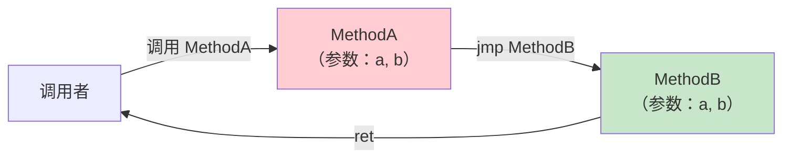

# ret 与 jmp

`ret` 是每个方法的终点——将控制权交还调用者。`jmp` 则是方法的"传送门"——将控制权完全转交给另一个方法，永不回头。

::: tip 核心要点
- `ret`：从方法返回，返回值在评估栈顶
- `jmp`：跳转到另一个方法，当前栈帧被丢弃，目标方法直接返回给原始调用者
- `jmp` 永远不会返回到调用者——因为它**替代**了当前方法
:::

---

## 一、ret 指令 —— 方法返回

### 1.1 指令行为

`ret`：
1. 如果方法有返回值：从评估栈弹出返回值，传递给调用者
2. 如果方法返回 `void`：评估栈必须为空
3. 将控制权交还调用者

### 1.2 返回值规则

| 方法返回类型 | ret 前栈状态 | 要求 |
|-------------|-------------|------|
| `void` | 空 | 栈必须为空 |
| 值类型 | 一个值类型值 | 类型必须匹配方法签名 |
| 引用类型 | 一个对象引用 | 类型必须兼容 |
| `native int` | 一个 native int | 平台相关大小 |

### 1.3 C# 示例

```csharp
static int Add(int a, int b)
{
    return a + b;
}
```

```il
.method private hidebysig static int32 Add(int32 a, int32 b) cil managed
{
    .maxstack 2
    IL_0000: ldarg.0       // 加载 a
    IL_0001: ldarg.1       // 加载 b
    IL_0002: add           // a + b
    IL_0003: ret           // 返回栈顶值
}
```

void 方法：

```csharp
static void Greet(string name)
{
    Console.WriteLine($"Hello, {name}");
}
```

```il
.method private hidebysig static void Greet(string name) cil managed
{
    .maxstack 8
    IL_0000: ldstr "Hello, "
    IL_0005: ldarg.0
    IL_0006: string::Concat(string, string)
    IL_000b: call Console::WriteLine(string)
    IL_0010: ret           // void 返回，栈为空
}
```

### 1.4 多个 ret 点

C# 的多个 `return` 语句编译为多个 `ret` 指令：

```csharp
static string Classify(int x)
{
    if (x < 0) return "negative";
    if (x == 0) return "zero";
    return "positive";
}
```

```il
IL_0000: ldarg.0
IL_0001: ldc.i4.0
IL_0002: bge.s IL_0008

IL_0004: ldstr "negative"
IL_0009: ret                // 第一个 return

IL_0008: ldarg.0
IL_0009: ldc.i4.0
IL_000a: bne.un.s IL_0011

IL_000c: ldstr "zero"
IL_0011: ret                // 第二个 return

IL_0011: ldstr "positive"
IL_0016: ret                // 第三个 return
```

---

## 二、ret 与受保护区域

### 2.1 不能在 try 块内直接 ret

`ret` **不能**出现在 `try` 块内。必须先通过 `leave` 指令退出受保护区域，然后再 `ret`。

```csharp
static int TryReturn()
{
    try
    {
        return 42;       // 不是 ret，而是 leave + ret
    }
    finally
    {
        Console.WriteLine("finally");
    }
}
```

```il
.method private hidebysig static int32 TryReturn() cil managed
{
    .maxstack 1
    .locals init (int32 V_0)

    .try
    {
        IL_0000: ldc.i4.s 42
        IL_0002: stloc.0           // 保存返回值
        IL_0003: leave.s IL_000f   // leave！不是 ret
    } // end .try
    finally
    {
        IL_0008: ldstr "finally"
        IL_000d: call Console::WriteLine(string)
        IL_0012: endfinally
    } // end finally

    IL_000f: ldloc.0               // 加载返回值
    IL_0010: ret                   // ret 在 try 块外
}
```

::: important 为什么 try 内不能 ret？
`ret` 会立即返回调用者，跳过 `finally` 块的执行。CLR 要求 `finally` 必须执行，因此在 `try` 内的 `return` 被编译为 `leave`（确保 finally 执行），然后在 try 块外 `ret`。
:::

---

## 三、jmp 指令 —— 方法跳转

### 3.1 指令行为

`jmp method`：
1. **丢弃当前方法的整个栈帧**（评估栈清空、局部变量释放）
2. 将当前方法的**参数**直接传递给目标方法
3. 控制权转交给目标方法
4. 目标方法返回时，**直接返回给当前方法的调用者**（跳过当前方法）



### 3.2 jmp 的约束

| 约束 | 说明 |
|------|------|
| 签名必须匹配 | 目标方法的参数类型必须与当前方法完全一致 |
| 评估栈必须为空 | `jmp` 前评估栈不能有任何值 |
| 不能有返回值处理 | 当前方法不处理目标方法的返回值 |
| 不能在受保护区域 | 与 `ret` 相同，不能在 try/catch/finally 内 |
| 目标方法直接返回给调用者 | 当前方法从调用链中消失 |

### 3.3 jmp vs tail.call

| 特性 | `jmp` | `tail. call` |
|------|-------|-------------|
| 当前栈帧 | 完全丢弃 | 优化复用 |
| 目标方法签名 | 必须与当前方法一致 | 可以不同 |
| 参数来源 | 直接复用当前方法的参数 | 重新压入栈 |
| 返回给谁 | 调用者的调用者 | 当前方法的调用者 |
| 能否返回到当前方法 | 不能 | 不能（tail） |
| 典型场景 | 互操作包装 | 递归优化 |

::: warning jmp 的罕见性
`jmp` 在实际代码中极少使用。C# 编译器从不生成 `jmp`。它主要用于手写 IL 的互操作包装器——当一个方法仅仅是另一个方法的"代理"时。
:::

---

## 四、jmp 的实际应用：互操作包装

### 4.1 场景：API 转发包装

假设你有一个内部 API 需要暴露为公共 API，方法签名完全相同：

```csharp
// C# 代码（逻辑上等价于 jmp）
public static void PublicApi(int x, string s)
{
    InternalApi(x, s);    // 普通调用
}

private static void InternalApi(int x, string s)
{
    Console.WriteLine($"{x}: {s}");
}
```

如果用手写 IL 的 `jmp`：

```il
// 公共 API 方法
.method public hidebysig static void PublicApi(int32 x, string s) cil managed
{
    .maxstack 0

    // 直接跳转，无需调用+返回
    // 参数 x 和 s 自动传递给 InternalApi
    jmp void Program::InternalApi(int32, string)
    // 没有 ret！控制权已转交
}
```

对比普通调用：

```il
.method public hidebysig static void PublicApi(int32 x, string s) cil managed
{
    .maxstack 2

    IL_0000: ldarg.0
    IL_0001: ldarg.1
    IL_0002: call void Program::InternalApi(int32, string)
    IL_0007: ret
}
```

### 4.2 jmp 的性能优势

`jmp` 省去了：
- `ldarg` 指令（参数自动传递）
- `call` + `ret` 的栈帧管理
- 当前方法的栈帧分配与销毁

在极端高频的转发场景下，`jmp` 比普通调用更快，但实际差异微乎其微。

---

## 五、ret 的验证规则

### 5.1 栈状态验证

CLR 在验证阶段（verification）会检查 `ret` 前的评估栈状态：

```csharp
// 合法：返回 int
static int ReturnInt()
{
    return 42;
    // 栈：int32 → 匹配方法签名 ✓
}

// 非法：类型不匹配（验证失败）
// 以下 IL 不会被验证通过：
// .method static int32 Bad() { ldstr "hello"; ret }  // string ≠ int32 ✗
```

### 5.2 void 方法的栈检查

```csharp
static void DoWork()
{
    Console.WriteLine("working");
    // 栈为空 → void 返回 ✓
}
```

如果 `void` 方法在 `ret` 时栈非空，CLR 验证会失败：

```il
// 非法 IL！void 方法不能有返回值
.method static void BadVoid()
{
    .maxstack 1
    ldc.i4 42
    ret       // 验证失败：栈上有值但方法返回 void
}
```

### 5.3 多路径返回的一致性

```csharp
static int MultiPath(bool flag)
{
    if (flag) return 1;    // 路径1：栈顶为 int32
    return 0;              // 路径2：栈顶为 int32
    // 所有路径到达 ret 时，栈顶类型必须一致 ✓
}
```

---

## 六、指令速查表

| 指令 | 操作码 | 栈行为 | 说明 |
|------|--------|--------|------|
| `ret` | 0x2A | 返回值 → （弹出返回值给调用者） | 从方法返回 |
| `jmp` | 0x27 | 无（评估栈必须为空） | 跳转到另一方法 |

---

## 七、面试要点

::: tip 面试高频问题
1. **ret 指令的栈状态要求？**
   - 有返回值的方法：栈顶必须是匹配类型的返回值；void 方法：栈必须为空

2. **为什么不能在 try 块内使用 ret？**
   - `ret` 会跳过 `finally` 块，违反 CLR 的结构化异常处理保证；必须先用 `leave` 退出受保护区域

3. **jmp 和 tail.call 的区别？**
   - `jmp`：丢弃当前栈帧，参数自动传递，目标方法签名必须匹配，直接返回给调用者的调用者
   - `tail. call`：优化复用栈帧，参数需要压栈，签名可以不同，返回给当前方法的调用者

4. **C# 编译器会生成 jmp 吗？**
   - 不会。`jmp` 只在手写 IL 或 `ILGenerator` 中使用，主要用于方法转发包装

5. **jmp 的典型使用场景？**
   - 互操作包装器：当一个方法仅仅是另一个签名相同方法的代理，`jmp` 消除了不必要的调用开销

6. **多个 return 语句在 IL 中如何体现？**
   - 每个 `return` 对应一个 `ret` 指令，CLR 验证所有路径到达 `ret` 时栈状态一致
:::

---

## 参考资料

- [OpCodes.Ret Field](https://learn.microsoft.com/en-us/dotnet/api/system.reflection.emit.opcodes.ret)
- [OpCodes.Jmp Field](https://learn.microsoft.com/en-us/dotnet/api/system.reflection.emit.opcodes.jmp)
- [ECMA-335 Partition III - Method return and transfer](https://ecma-international.org/publications-and-standards/standards/ecma-335/)
