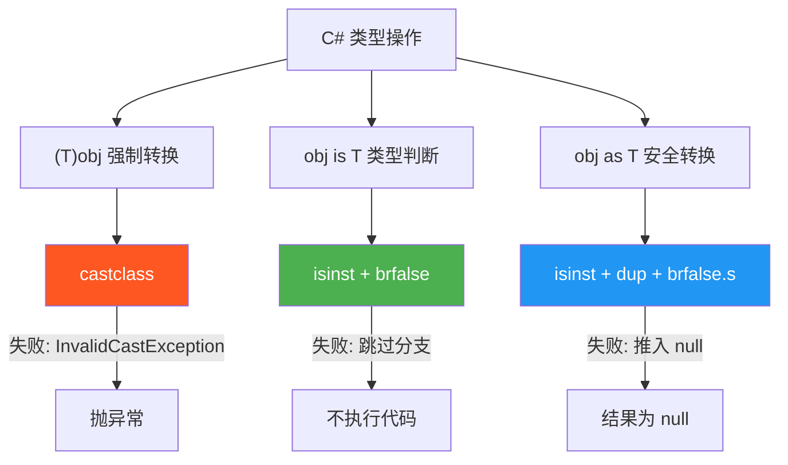
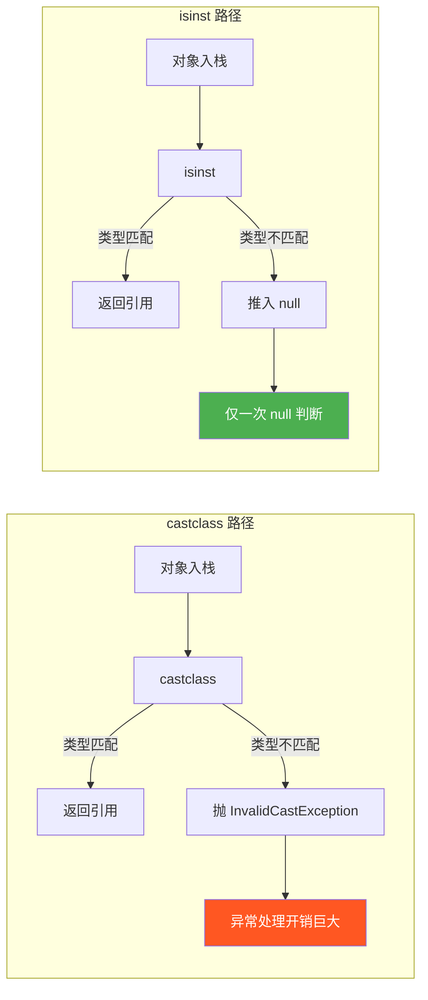

# 类型测试：castclass 与 isinst

> C# 的 `is`、`as` 和强制类型转换，在 IL 层只映射到两条指令：**castclass** 和 **isinst**。理解它们的差异，是避免 `InvalidCastException` 和写出高性能类型检查代码的关键。



## 一、castclass —— 强制类型转换

`castclass` 将对象引用转换为指定类型。如果对象不是目标类型（或其派生类型），抛出 `InvalidCastException`。

### 1.1 指令格式

| 项目 | 说明 |
|------|------|
| 指令 | `castclass <type>` |
| 栈行为 | 弹出对象引用 → 推入转换后的引用 |
| 异常 | `InvalidCastException`（类型不匹配）、`NullReferenceException`（null 引用不做类型检查，直接通过） |

### 1.2 C# 强制转换 → castclass

```csharp
object obj = "hello";
string str = (string)obj;  // 强制转换
```

```il
// C# 编译结果
IL_0000: ldstr "hello"
IL_0005: stloc.0         // obj = "hello"
IL_0006: ldloc.0         // 加载 obj
IL_0007: castclass [mscorlib]System.String  // 强制转换
IL_000c: stloc.1         // str = 结果
```

::: tip null 通过 castclass 不抛异常
`castclass` 对 `null` 引用直接返回 `null`，不会触发类型检查。这与 C# 语义一致：`(string)null` 是合法的。
:::

## 二、isinst —— 类型实例测试

`isinst` 测试对象是否为指定类型的实例。如果类型匹配，推入对象引用；如果不匹配，推入 `null`。**绝不抛异常**。

### 2.1 指令格式

| 项目 | 说明 |
|------|------|
| 指令 | `isinst <type>` |
| 栈行为 | 弹出对象引用 → 推入对象引用或 null |
| 异常 | 无 |

### 2.2 C# `is` 运算符 → isinst + brfalse

```csharp
object obj = "hello";
if (obj is string)
{
    Console.WriteLine("是字符串");
}
```

```il
IL_0000: ldstr "hello"
IL_0005: stloc.0
IL_0006: ldloc.0
IL_0007: isinst [mscorlib]System.String
IL_000c: brfalse.s IL_001b    // 如果 null，跳过 if 块
IL_000e: ldstr "是字符串"
IL_0013: call void [mscorlib]System.Console::WriteLine(string)
IL_001b: // if 块结束
```

### 2.3 C# `as` 运算符 → isinst

```csharp
object obj = "hello";
string str = obj as string;  // 安全转换，失败返回 null
```

```il
IL_0000: ldstr "hello"
IL_0005: stloc.0
IL_0006: ldloc.0
IL_0007: isinst [mscorlib]System.String  // 匹配返回引用，不匹配返回 null
IL_000c: stloc.1
```

::: important is vs as 的 IL 视角
C# 的 `is` 和 `as` 都使用 `isinst` 指令，区别仅在于后续处理：
- `is`：`isinst` + `brfalse`（判断后丢弃结果）
- `as`：`isinst`（直接使用结果）
:::

## 三、模式匹配的 IL 实现

### 3.1 类型模式：`obj is T x`

C# 7.0 引入的类型模式匹配，本质上就是 `isinst` + 条件分支 + 存储变量：

```csharp
object obj = "hello";
if (obj is string s)
{
    Console.WriteLine(s.Length);
}
```

```il
IL_0000: ldstr "hello"
IL_0005: stloc.0
IL_0006: ldloc.0
IL_0007: isinst [mscorlib]System.String
IL_000c: stloc.1         // s = isinst 结果（匹配时为引用，不匹配时为 null）
IL_000d: ldloc.1
IL_000e: brfalse.s IL_001d  // if (s == null) 跳过
IL_0010: ldloc.1
IL_0011: callvirt instance int32 [mscorlib]System.String::get_Length()
IL_0016: call void [mscorlib]System.Console::WriteLine(int32)
IL_001d: // if 块结束
```

### 3.2 属性模式与递归模式

更复杂的模式匹配在 IL 层被分解为多步 `isinst` + 字段访问 + 条件判断：

```csharp
// C# 属性模式
if (obj is string { Length: > 5 } s)
{
    Console.WriteLine(s);
}
```

```il
// 等效 IL 逻辑：
// 1. isinst String → 判断是否为 string
// 2. 如果是 → ldloc + callvirt get_Length()
// 3. ldc.i4.5 + cgt → 判断 Length > 5
// 4. 全部满足 → 执行 if 块
```

## 四、性能对比：castclass vs isinst



| 对比项 | castclass | isinst |
|--------|-----------|--------|
| 失败时行为 | 抛 `InvalidCastException` | 推入 `null` |
| 失败开销 | 极大（异常栈展开） | 极小（一次比较） |
| 适用场景 | 确信类型正确时 | 不确定类型时 |
| C# 对应 | `(T)obj` | `obj is T`、`obj as T` |

::: warning 避免用 try/catch + castclass 做类型检查
```csharp
// 反模式：用异常做流程控制
try { var s = (string)obj; /* 使用 s */ }
catch (InvalidCastException) { /* 不是 string */ }

// 正确做法：用 isinst（即 is/as）
var s = obj as string;
if (s != null) { /* 使用 s */ }
```
抛异常的开销是 `isinst` 的 **数百倍以上**，绝不能用于流程控制。
:::

## 五、接口与数组的类型测试

### 5.1 接口类型测试

接口的类型测试比类更复杂，因为接口是隐式实现的，JIT 需要遍历接口映射表：

```csharp
object obj = new List<int>();
bool isEnumerable = obj is IEnumerable<int>;  // isinst IEnumerable`1
bool isDisposable = obj is IDisposable;        // isinst IDisposable
```

```il
IL_0000: newobj instance void class [mscorlib]System.Collections.Generic.List`1<int32>::.ctor()
IL_0005: stloc.0
IL_0006: ldloc.0
IL_0007: isinst class [mscorlib]System.Collections.Generic.IEnumerable`1<int32>
IL_000c: ldnull
IL_000d: cgt.un         // (isinst result != null) → bool
IL_000f: stloc.1
IL_0010: ldloc.0
IL_0011: isinst class [mscorlib]System.IDisposable
IL_0016: ldnull
IL_0017: cgt.un
IL_0019: stloc.2
```

### 5.2 数组协变与类型测试

```csharp
object[] arr = new string[3];
arr[0] = 42;  // 运行时抛 ArrayTypeMismatchException！
```

```il
// stelem.ref 包含运行时类型检查
IL_0000: ldc.i4.3
IL_0001: newarr [mscorlib]System.String  // 创建 string[]
IL_0006: stloc.0
IL_0007: ldloc.0
IL_0008: ldc.i4.0
IL_0009: ldc.i4.s 42
IL_000b: box [mscorlib]System.Int32     // 装箱为 object
IL_0010: stelem.ref                      // 运行时检查：int 不是 string → 异常！
```

::: warning 数组协变的隐患
`string[]` 可以隐式转换为 `object[]`（协变），但 `stelem.ref` 会执行运行时类型检查。如果存入类型不匹配的元素，会抛出 `ArrayTypeMismatchException`。这是数组协变的设计缺陷，泛型集合不存在此问题。
:::

## 六、完整示例：三种类型操作对比

```csharp
using System;

public class Animal { public string Name => "Animal"; }
public class Dog : Animal { public void Bark() => Console.WriteLine("Woof!"); }

public class TypeTest
{
    public static void CastExample(object obj)
    {
        // 强制转换 —— 失败抛异常
        Dog dog = (Dog)obj;
        dog.Bark();
    }

    public static void AsExample(object obj)
    {
        // 安全转换 —— 失败返回 null
        Dog dog = obj as Dog;
        if (dog != null)
            dog.Bark();
    }

    public static void IsExample(object obj)
    {
        // 类型判断 + 模式匹配
        if (obj is Dog dog)
            dog.Bark();
    }
}
```

```il
// CastExample —— castclass
.method public static void CastExample(object obj) cil managed
{
    ldarg.0
    castclass Dog              // 失败 → InvalidCastException
    callvirt instance void Dog::Bark()
    ret
}

// AsExample —— isinst
.method public static void AsExample(object obj) cil managed
{
    ldarg.0
    isinst Dog                 // 失败 → 推入 null
    stloc.0                   // dog = 结果
    ldloc.0
    brfalse.s IL_END          // if (dog == null) 跳过
    ldloc.0
    callvirt instance void Dog::Bark()
    IL_END: ret
}

// IsExample —— isinst + 模式匹配
.method public static void IsExample(object obj) cil managed
{
    ldarg.0
    isinst Dog                 // 类型测试
    stloc.0                   // dog = 结果
    ldloc.0
    brfalse.s IL_END          // if (dog == null) 跳过
    ldloc.0
    callvirt instance void Dog::Bark()
    IL_END: ret
}
```

::: tip AsExample 和 IsExample 的 IL 几乎相同
C# 的 `obj as T` + `if (x != null)` 和 `obj is T x` 编译出的 IL 代码几乎一致。编译器在 `is` 模式匹配中做了和 `as` 等价的优化，不会重复做两次类型检查。
:::

## 七、指令速查表

| C# 语法 | IL 指令 | 失败行为 |
|---------|---------|---------|
| `(T)obj` | `castclass T` | `InvalidCastException` |
| `obj is T` | `isinst T` + `brfalse` | 推入 null，跳过分支 |
| `obj as T` | `isinst T` | 推入 null |
| `obj is T x` | `isinst T` + `stloc` + `brfalse` | 推入 null，存入变量，跳过 |
| `obj is T { Prop: P } x` | `isinst T` + 字段访问 + 条件链 | 多步判断 |

> **参考文档**：[OpCodes.Castclass](https://learn.microsoft.com/en-us/dotnet/api/system.reflection.emit.opcodes.castclass) | [OpCodes.Isinst](https://learn.microsoft.com/en-us/dotnet/api/system.reflection.emit.opcodes.isinst)

---

## 面试技巧

1. **`is` 和 `as` 的底层区别？** —— 它们底层都用 `isinst`，区别仅在后续消费方式：`is` 做布尔判断，`as` 直接使用引用。C# 7 的 `is T x` 模式匹配和 `as` 的 IL 几乎一样。

2. **`castclass` 和 `isinst` 的核心区别？** —— `castclass` 失败抛异常，`isinst` 失败推入 null。性能差异巨大，绝不能用 `try/catch + castclass` 代替 `isinst` 做类型检查。

3. **为什么 `(string)null` 不抛异常？** —— `castclass` 对 null 引用直接通过，不做类型检查。这是 IL 规范定义的行为。

4. **数组协变为什么会抛 `ArrayTypeMismatchException`？** —— `string[]` 可以转为 `object[]`，但 `stelem.ref` 在存储时会做运行时类型检查。这是数组协变的已知设计问题，泛型 `List<T>` 不存在此问题。

5. **模式匹配的 IL 实现原理？** —— 类型模式 `is T x` 等价于 `isinst` + `stloc` + `brfalse`；属性模式在此基础上增加字段访问和条件判断链。编译器不会对同一对象做重复的 `isinst`。
