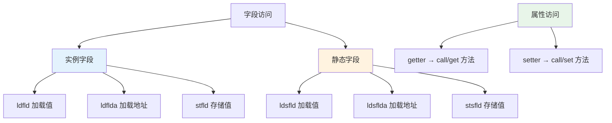
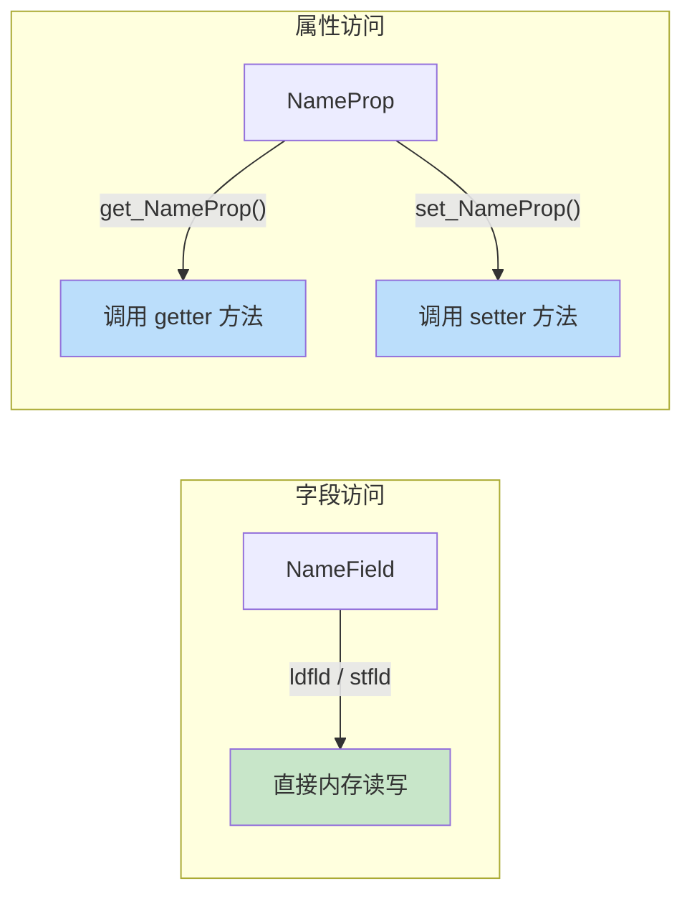

# 字段访问：ldfld / stfld / ldsfld / stsfld

> C# 的字段访问在 IL 中有 6 条专用指令，而属性访问本质上是方法调用。理解这个区别，才能看懂反编译后的字段与属性操作。



## 一、实例字段指令

### 1.1 ldfld —— 加载实例字段值

`ldfld` 从对象中加载指定字段的值。需要先将对象引用压入栈。

| 项目 | 说明 |
|------|------|
| 指令 | `ldfld <field>` |
| 栈行为 | 弹出对象引用 → 推入字段值 |
| 异常 | `NullReferenceException`（对象为 null） |

```csharp
public class Person
{
    public string Name;

    public string GetName()
    {
        return Name;  // ldfld
    }
}
```

```il
.method public instance string GetName() cil managed
{
    ldarg.0                    // 加载 this
    ldfld string Person::Name  // 加载 this.Name
    ret
}
```

### 1.2 ldflda —— 加载实例字段地址

`ldflda` 推入字段的**托管指针**（`&`），用于将字段作为 `ref` 参数传递或获取 `Span`。

```csharp
public class Data
{
    public int Value;

    public void Increment()
    {
        Interlocked.Increment(ref Value);  // 需要 ldflda
    }
}
```

```il
.method public instance void Increment() cil managed
{
    ldarg.0                       // 加载 this
    ldflda int32 Data::Value      // 加载 &this.Value
    call int32 [mscorlib]System.Threading.Interlocked::Increment(int32&)
    pop
    ret
}
```

::: tip ldfld vs ldflda
- `ldfld` 推入字段的**值**（副本），修改不影响原字段
- `ldflda` 推入字段的**地址**（指针），通过地址可直接修改原字段
- C# 的 `ref` 参数、`in` 参数、`out` 参数都需要 `ldflda`
:::

### 1.3 stfld —— 存储到实例字段

```csharp
public class Person
{
    public string Name;

    public void SetName(string name)
    {
        Name = name;  // stfld
    }
}
```

```il
.method public instance void SetName(string name) cil managed
{
    ldarg.0                     // 加载 this（目标对象）
    ldarg.1                     // 加载 name（值）
    stfld string Person::Name   // this.Name = name
    ret
}
```

::: important stfld 的栈顺序
`stfld` 的栈顺序是：**先压对象引用，再压值**。即 `stfld` 从栈顶弹出值，再弹出对象引用。C# 代码 `a.b = c` 编译为 `ldarg.a` → `ldarg.c` → `stfld b`。
:::

## 二、静态字段指令

### 2.1 ldsfld —— 加载静态字段值

```csharp
public class Config
{
    public static int MaxRetries = 3;

    public static int GetMax()
    {
        return MaxRetries;  // ldsfld
    }
}
```

```il
.method public static int32 GetMax() cil managed
{
    ldsfld int32 Config::MaxRetries  // 不需要 this
    ret
}
```

### 2.2 ldsflda —— 加载静态字段地址

```csharp
public static void IncrementCounter()
{
    Interlocked.Increment(ref Config.MaxRetries);  // ldsflda
}
```

```il
.method public static void IncrementCounter() cil managed
{
    ldsflda int32 Config::MaxRetries  // &Config.MaxRetries
    call int32 [mscorlib]System.Threading.Interlocked::Increment(int32&)
    pop
    ret
}
```

### 2.3 stsfld —— 存储到静态字段

```csharp
public static void SetMax(int value)
{
    Config.MaxRetries = value;  // stsfld
}
```

```il
.method public static void SetMax(int32 value) cil managed
{
    ldarg.0                           // 加载 value
    stsfld int32 Config::MaxRetries   // Config.MaxRetries = value
    ret
}
```

::: tip 静态字段无需对象引用
`ldsfld`、`ldsflda`、`stsfld` 不需要对象引用在栈上，因为静态字段属于类型本身，不属于任何实例。
:::

## 三、属性 vs 字段的 IL 差异

```csharp
public class Person
{
    public string NameField;           // 字段
    public string NameProp { get; set; }  // 属性

    public void Access()
    {
        // 字段访问 → ldfld / stfld
        NameField = "Alice";
        var f = NameField;

        // 属性访问 → call getter / setter 方法
        NameProp = "Alice";
        var p = NameProp;
    }
}
```

```il
.method public instance void Access() cil managed
{
    // NameField = "Alice"  —— 字段赋值
    ldarg.0
    ldstr "Alice"
    stfld string Person::NameField

    // f = NameField  —— 字段读取
    ldarg.0
    ldfld string Person::NameField
    pop

    // NameProp = "Alice"  —— 属性赋值（调用 setter）
    ldarg.0
    ldstr "Alice"
    call instance void Person::set_NameProp(string)

    // p = NameProp  —— 属性读取（调用 getter）
    ldarg.0
    call instance string Person::get_NameProp()
    pop

    ret
}
```



::: important 属性本质是方法
IL 中不存在"属性访问指令"。属性的 `get` / `set` 是普通方法，编译为 `call` 或 `callvirt`。自动属性的幕后字段由编译器生成（如 `<NameProp>k__BackingField`）。
:::

## 四、volatile 字段

C# 的 `volatile` 关键字在 IL 中通过字段元数据标记和 `volatile.` 前缀指令实现。

### 4.1 volatile 字段声明

```csharp
public class VolatileExample
{
    private volatile bool _stopped;

    public void Stop() => _stopped = true;
    public bool IsStopped => _stopped;
}
```

```il
.field private volatile bool _stopped

.method public instance void Stop() cil managed
{
    ldarg.0
    ldc.i4.1
    stfld bool VolatileExample::_stopped   // stfld 本身无变化，volatile 在元数据中
    ret
}

.method public instance bool get_IsStopped() cil managed
{
    ldarg.0
    ldfld bool VolatileExample::_stopped   // ldfld 本身无变化
    ret
}
```

### 4.2 volatile. 前缀指令

当通过间接方式（`ldind.*` / `stind.*`）访问 volatile 字段时，需要 `volatile.` 前缀：

```il
// volatile. 前缀确保读写屏障
volatile. ldfld int32 MyClass::_field
volatile. stfld int32 MyClass::_field
```

::: warning volatile 的 IL 含义
`volatile.` 前缀告诉 CLR：此读/写操作不能被重排。它保证：
- **读取**：后续读/写不能提前到此读取之前
- **写入**：之前的读/写不能推迟到此写入之后

这不等同于 C++ 的 volatile（C++ volatile 只防止编译器优化，不提供内存屏障）。CLR 的 volatile 语义更强。
:::

## 五、静态字段初始化与 beforefieldinit

### 5.1 静态构造器的影响

```csharp
// 类型 A：有显式静态构造器
public class TypeA
{
    public static readonly int Value;
    static TypeA() { Value = 42; }  // 显式静态构造器
}

// 类型 B：无显式静态构造器（beforefieldinit）
public class TypeB
{
    public static readonly int Value = 42;  // 内联初始化，无显式静态构造器
}
```

```il
// TypeA —— 无 beforefieldinit 标记
.class public TypeA
{
    .field public static initonly int32 Value
    .method private static void .cctor() cil managed
    {
        ldc.i4.s 42
        stsfld int32 TypeA::Value
        ret
    }
}

// TypeB —— 有 beforefieldinit 标记
.class public beforefieldinit TypeB
{
    .field public static initonly int32 Value
    .method private static void .cctor() cil managed
    {
        ldc.i4.s 42
        stsfld int32 TypeB::Value
        ret
    }
}
```

::: tip beforefieldinit 的性能意义
- **无 beforefieldinit**（有显式静态构造器）：JIT 每次访问静态字段前都要检查静态构造器是否已执行
- **有 beforefieldinit**（无显式静态构造器）：JIT 可以更自由地决定何时触发静态构造器，减少检查开销

如果不需要精确控制静态初始化时机，**不要写显式静态构造器**，让编译器生成 `beforefieldinit` 标记。
:::

## 六、ref 字段的 IL 表示

C# 11 引入的 `ref` 字段在 IL 中使用托管指针类型：

```csharp
public ref struct RefWrapper
{
    private ref int _value;  // ref 字段

    public RefWrapper(ref int value)
    {
        _value = ref value;  // ldflda + stfld（ref 语义）
    }

    public ref int GetRef() => ref _value;  // 返回 ref
}
```

```il
.class public sequential sealed beforefieldinit RefWrapper
    extends [mscorlib]System.ValueType
{
    .field private int32& _value     // int32& = 托管指针

    .method public instance void .ctor(int32& 'value') cil managed
    {
        ldarg.0
        ldarg.1                       // 加载 ref value
        stfld int32& RefWrapper::_value  // 存储指针
        ret
    }

    .method public instance int32& GetRef() cil managed
    {
        ldarg.0
        ldflda int32 RefWrapper::_value  // 加载字段地址（ref 返回）
        ret
    }
}
```

## 七、完整示例：所有字段指令

```csharp
public class FieldDemo
{
    private int _instanceField;
    private static int s_staticField;

    public void InstanceAccess()
    {
        _instanceField = 10;              // stfld
        int v = _instanceField;           // ldfld
        Interlocked.Increment(ref _instanceField); // ldflda
    }

    public static void StaticAccess()
    {
        s_staticField = 20;              // stsfld
        int v = s_staticField;           // ldsfld
        Interlocked.Increment(ref s_staticField); // ldsflda
    }
}
```

```il
.method public instance void InstanceAccess() cil managed
{
    // _instanceField = 10
    ldarg.0
    ldc.i4.s 10
    stfld int32 FieldDemo::_instanceField

    // v = _instanceField
    ldarg.0
    ldfld int32 FieldDemo::_instanceField
    pop

    // Interlocked.Increment(ref _instanceField)
    ldarg.0
    ldflda int32 FieldDemo::_instanceField
    call int32 [mscorlib]System.Threading.Interlocked::Increment(int32&)
    pop

    ret
}

.method public static void StaticAccess() cil managed
{
    // s_staticField = 20
    ldc.i4.s 20
    stsfld int32 FieldDemo::s_staticField

    // v = s_staticField
    ldsfld int32 FieldDemo::s_staticField
    pop

    // Interlocked.Increment(ref s_staticField)
    ldsflda int32 FieldDemo::s_staticField
    call int32 [mscorlib]System.Threading.Interlocked::Increment(int32&)
    pop

    ret
}
```

## 八、指令速查表

| 指令 | 全称 | 操作 | 栈需求 |
|------|------|------|--------|
| `ldfld` | Load Field | 加载实例字段值 | 对象引用 |
| `ldflda` | Load Field Address | 加载实例字段地址 | 对象引用 |
| `stfld` | Store Field | 存储到实例字段 | 对象引用 + 值 |
| `ldsfld` | Load Static Field | 加载静态字段值 | 无 |
| `ldsflda` | Load Static Field Address | 加载静态字段地址 | 无 |
| `stsfld` | Store Static Field | 存储到静态字段 | 值 |

> **参考文档**：[OpCodes.Ldfld](https://learn.microsoft.com/en-us/dotnet/api/system.reflection.emit.opcodes.ldfld) | [OpCodes.Stfld](https://learn.microsoft.com/en-us/dotnet/api/system.reflection.emit.opcodes.stfld) | [OpCodes.Ldsfld](https://learn.microsoft.com/en-us/dotnet/api/system.reflection.emit.opcodes.ldsfld) | [OpCodes.Stsfld](https://learn.microsoft.com/en-us/dotnet/api/system.reflection.emit.opcodes.stsfld) | [OpCodes.Ldflda](https://learn.microsoft.com/en-us/dotnet/api/system.reflection.emit.opcodes.ldflda) | [OpCodes.Ldsflda](https://learn.microsoft.com/en-us/dotnet/api/system.reflection.emit.opcodes.ldsflda)

---

## 面试技巧

1. **字段访问和属性访问的 IL 区别？** —— 字段用 `ldfld`/`stfld` 直接读写内存；属性用 `call`/`callvirt` 调用 getter/setter 方法。属性本质是语法糖。

2. **`ldfld` 和 `ldflda` 的区别？** —— `ldfld` 推入字段值的副本，`ldflda` 推入字段的托管指针。`ref`/`in`/`out` 参数需要 `ldflda`。

3. **`beforefieldinit` 是什么？** —— 类型元数据标记，表示静态构造器可提前执行。无显式静态构造器的类自动获得此标记，JIT 可减少静态初始化检查开销。

4. **`volatile` 在 IL 层如何实现？** —— 字段元数据标记为 `volatile`，间接访问时使用 `volatile.` 前缀指令提供读写屏障。CLR 的 volatile 比 C++ volatile 语义更强。

5. **`stfld` 的栈顺序为什么是先对象后值？** —— 因为 `stfld` 从栈顶开始弹出：先弹值，再弹对象引用。这和 C# 的赋值语义 `obj.field = value` 编译时的压栈顺序（先压 obj，再压 value）一致。
