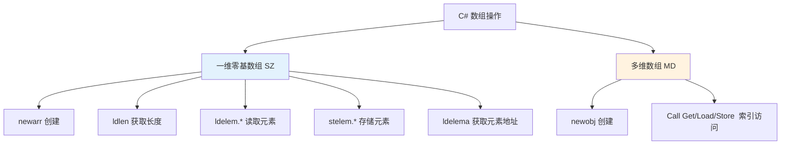
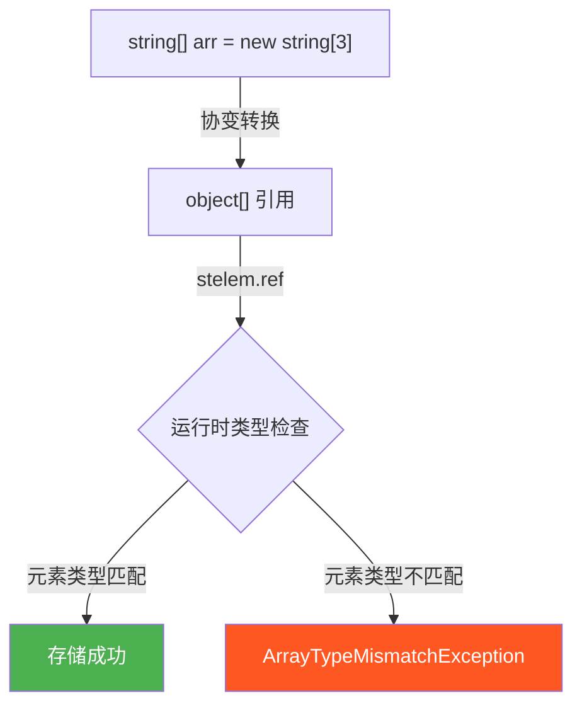
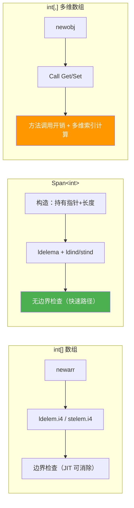

# 数组操作：newarr / ldelem.* / stelem.*

> 一维零基数组（SZ 数组）在 IL 中有专用指令，而多维数组则退化为方法调用。理解这一边界，是看懂数组操作 IL 的关键。



## 一、newarr —— 创建一维零基数组

`newarr` 创建一个元素为零的一维零基数组（SZ 数组）。

| 项目 | 说明 |
|------|------|
| 指令 | `newarr <elementType>` |
| 栈行为 | 弹出元素数量 → 推入数组引用 |
| 异常 | `OutOfMemoryException`、`OverflowException`（负数长度） |

```csharp
int[] numbers = new int[5];
string[] names = new string[3];
```

```il
// int[] numbers = new int[5]
IL_0000: ldc.i4.5
IL_0001: newarr [mscorlib]System.Int32    // 创建 int[5]
IL_0006: stloc.0

// string[] names = new string[3]
IL_0007: ldc.i4.3
IL_0008: newarr [mscorlib]System.String   // 创建 string[3]
IL_000d: stloc.1
```

::: tip newarr 的零初始化
`newarr` 创建的数组所有元素自动初始化为零（值类型为 0/null，引用类型为 null）。这由 CLR 保证，无需额外清零操作。
:::

## 二、ldlen —— 获取数组长度

```csharp
int[] arr = new int[10];
int length = arr.Length;  // ldlen
```

```il
IL_0000: ldloc.0          // 加载 arr
IL_0001: ldlen            // 推入数组长度（native int）
IL_0002: conv.i4          // 转换为 int32
IL_0003: stloc.1          // length = 结果
```

::: important ldlen 返回 native int
`ldlen` 推入的是 `native int`，在赋值给 `int` 变量时需要 `conv.i4` 转换。对于超大数组（超过 2^31-1 个元素），需要 `conv.i8`。
:::

## 三、ldelem.* —— 读取数组元素

`ldelem.*` 是一组指令，根据元素类型选择具体变体：

| 指令 | 元素类型 | 说明 |
|------|---------|------|
| `ldelem.i1` | `sbyte`/`byte` | 加载 1 字节整数 |
| `ldelem.i2` | `short`/`ushort` | 加载 2 字节整数 |
| `ldelem.i4` | `int`/`uint` | 加载 4 字节整数 |
| `ldelem.i8` | `long`/`ulong` | 加载 8 字节整数 |
| `ldelem.r4` | `float` | 加载单精度浮点 |
| `ldelem.r8` | `double` | 加载双精度浮点 |
| `ldelem.ref` | 引用类型 | 加载对象引用 |
| `ldelem.u1` | `byte` | 加载无符号字节 |
| `ldelem.u2` | `ushort`/`char` | 加载无符号短整数 |
| `ldelem.u4` | `uint` | 加载无符号整数 |

```csharp
int[] arr = { 10, 20, 30 };
int val = arr[1];  // ldelem.i4
```

```il
IL_0000: ldloc.0          // 加载 arr
IL_0001: ldc.i4.1         // 加载索引 1
IL_0002: ldelem.i4        // arr[1] → 推入 20
IL_0003: stloc.1
```

### 3.1 ldelema —— 获取元素地址

```csharp
int[] arr = { 1, 2, 3 };
ref int first = ref arr[0];  // ldelema
Interlocked.Increment(ref arr[0]);  // ldelema
```

```il
// ref int first = ref arr[0]
IL_0000: ldloc.0
IL_0001: ldc.i4.0
IL_0002: ldelema [mscorlib]System.Int32  // 推入 &arr[0]
IL_0007: stloc.1

// Interlocked.Increment(ref arr[0])
IL_0008: ldloc.0
IL_0009: ldc.i4.0
IL_000a: ldelema [mscorlib]System.Int32  // 推入 &arr[0]
IL_000f: call int32 [mscorlib]System.Threading.Interlocked::Increment(int32&)
```

::: tip ldelema vs ldelem
- `ldelem.*` 推入元素的**值**（副本）
- `ldelema` 推入元素的**地址**（托管指针），用于 `ref` 参数、`Span<T>` 构造等
:::

## 四、stelem.* —— 存储数组元素

| 指令 | 元素类型 |
|------|---------|
| `stelem.i1` | `sbyte`/`byte` |
| `stelem.i2` | `short`/`ushort` |
| `stelem.i4` | `int`/`uint` |
| `stelem.i8` | `long`/`ulong` |
| `stelem.r4` | `float` |
| `stelem.r8` | `double` |
| `stelem.ref` | 引用类型 |

```csharp
int[] arr = new int[3];
arr[0] = 42;       // stelem.i4
arr[1] = 100;      // stelem.i4

string[] names = new string[2];
names[0] = "Alice"; // stelem.ref
```

```il
// arr[0] = 42
IL_0000: ldloc.0          // 加载 arr
IL_0001: ldc.i4.0         // 加载索引 0
IL_0002: ldc.i4.s 42      // 加载值 42
IL_0004: stelem.i4        // arr[0] = 42

// names[0] = "Alice"
IL_0005: ldloc.1          // 加载 names
IL_0006: ldc.i4.0         // 加载索引 0
IL_0007: ldstr "Alice"    // 加载值
IL_000c: stelem.ref       // names[0] = "Alice"
```

::: important stelem.ref 的运行时类型检查
`stelem.ref` 存储引用类型元素时，会执行**数组协变类型检查**。如果元素类型与数组声明类型不匹配，抛出 `ArrayTypeMismatchException`。
:::

## 五、多维数组：方法调用而非指令

多维数组**不使用** `newarr`/`ldelem`/`stelem`，而是调用数组类型的特殊方法：

```csharp
int[,] matrix = new int[3, 4];       // 调用 newobj
matrix[1, 2] = 99;                    // 调用 Set 方法
int val = matrix[1, 2];              // 调用 Get 方法
int len = matrix.Length;             // 调用 get_Length
```

```il
// int[,] matrix = new int[3, 4]
IL_0000: ldc.i4.3
IL_0001: ldc.i4.4
IL_0002: newobj instance void int32[0...,0...]::.ctor(int32, int32)

// matrix[1, 2] = 99
IL_0007: ldloc.0
IL_0008: ldc.i4.1
IL_0009: ldc.i4.2
IL_000a: ldc.i4.s 99
IL_000c: call instance void int32[0...,0...]::Set(int32, int32, int32)

// val = matrix[1, 2]
IL_0011: ldloc.0
IL_0012: ldc.i4.1
IL_0013: ldc.i4.2
IL_0014: call instance int32 int32[0...,0...]::Get(int32, int32)

// len = matrix.Length
IL_0019: ldloc.0
IL_001a: call instance int32 int32[0...,0...]::get_Length()
```

::: warning 一维数组 vs 多维数组的性能差距
- 一维零基数组：`ldelem.i4` / `stelem.i4` 是 JIT 内联的极简指令
- 多维数组：`Get` / `Set` 方法调用有额外开销（参数传递、方法调用、多维索引计算）

性能敏感场景应使用**交错数组**（`int[][]`）而非多维数组（`int[,]`）。
:::

## 六、数组协变的陷阱

```csharp
object[] arr = new string[3];  // 协变：string[] → object[]
arr[0] = 42;                   // 编译通过！运行时抛异常
```

```il
// object[] arr = new string[3]
IL_0000: ldc.i4.3
IL_0001: newarr [mscorlib]System.String
IL_0006: stloc.0             // 类型为 string[]，但引用类型为 object[]

// arr[0] = 42
IL_0007: ldloc.0
IL_0008: ldc.i4.0
IL_0009: ldc.i4.s 42
IL_000b: box [mscorlib]System.Int32
IL_0010: stelem.ref           // 运行时检查：int 不是 string → ArrayTypeMismatchException!
```



::: important 为什么 stelem.ref 需要运行时检查？
因为 `string[]` 可以协变为 `object[]`，编译器无法在编译期知道数组元素的实际类型。`stelem.ref` 必须在运行时验证存储的元素是否与数组实际元素类型兼容。这是数组协变的设计缺陷，泛型 `List<T>` 不存在此问题。
:::

## 七、Span\<T\> 与数组的 IL 差异

`Span<T>` 不是数组，它是一个包含指针和长度的值类型，通过 `ldelema` + `ldind` 实现零拷贝访问：

```csharp
int[] arr = new int[] { 1, 2, 3 };
Span<int> span = arr;           // 构造 Span（持有 arr 指针 + 长度）
int val = span[1];              // ldelema + ldind.i4（无边界检查的快速路径）
span[1] = 99;                   // ldelema + stind.i4
```

```il
// Span<int> span = arr
IL_0000: ldloc.0               // 加载 arr
IL_0001: call valuetype [mscorlib]System.Span`1<int32> [mscorlib]System.Span`1<int32>::op_Implicit(int32[])

// int val = span[1]（简化表示）
// span 的索引器内部使用 Unsafe.Add + ldind.i4
IL_0006: ldloc.1
IL_0007: ldc.i4.1
IL_0008: call instance int32& valuetype [mscorlib]System.Span`1<int32>::get_Item(int32)
IL_000d: ldind.i4               // 从地址直接读取

// span[1] = 99
IL_000e: ldloc.1
IL_000f: ldc.i4.1
IL_0010: call instance int32& valuetype [mscorlib]System.Span`1<int32>::get_Item(int32)
IL_0015: ldc.i4.s 99
IL_0017: stind.i4               // 直接写入地址
```



::: tip Span\<T\> 为什么更快？
1. `Span<T>` 索引器通过 `Unsafe.Add` 计算指针偏移，无需方法调用
2. 无 `stelem.ref` 的协变类型检查
3. 不在堆上分配，无 GC 压力
4. JIT 对 `Span<T>` 有专门的优化路径
:::

## 八、指令速查表

| 指令 | 操作 | 栈行为 |
|------|------|--------|
| `newarr <type>` | 创建 SZ 数组 | 弹出长度 → 推入数组引用 |
| `ldlen` | 获取数组长度 | 弹出数组 → 推入 native int |
| `ldelem.<type>` | 读取元素 | 弹出数组+索引 → 推入值 |
| `ldelema <type>` | 获取元素地址 | 弹出数组+索引 → 推入指针 |
| `stelem.<type>` | 存储元素 | 弹出数组+索引+值 |

> **参考文档**：[OpCodes.Newarr](https://learn.microsoft.com/en-us/dotnet/api/system.reflection.emit.opcodes.newarr) | [OpCodes.Ldlen](https://learn.microsoft.com/en-us/dotnet/api/system.reflection.emit.opcodes.ldlen) | [OpCodes.Ldelem_I4](https://learn.microsoft.com/en-us/dotnet/api/system.reflection.emit.opcodes.ldelem_i4) | [OpCodes.Stelem_I4](https://learn.microsoft.com/en-us/dotnet/api/system.reflection.emit.opcodes.stelem_i4) | [OpCodes.Ldelema](https://learn.microsoft.com/en-us/dotnet/api/system.reflection.emit.opcodes.ldelema) | [OpCodes.Stelem_Ref](https://learn.microsoft.com/en-us/dotnet/api/system.reflection.emit.opcodes.stelem_ref)

---

## 面试技巧

1. **一维数组和多维数组的 IL 区别？** —— 一维零基数组使用 `newarr`/`ldelem`/`stelem` 专用指令；多维数组使用 `newobj` 构造和 `Get`/`Set` 方法调用。专用指令性能更优。

2. **`stelem.ref` 为什么有运行时类型检查？** —— 数组协变允许 `string[]` 转为 `object[]`，编译器无法确保存入的元素类型与数组实际元素类型一致。`stelem.ref` 必须做运行时检查，不匹配则抛 `ArrayTypeMismatchException`。

3. **`Span<T>` 和数组的 IL 差异？** —— `Span<T>` 通过指针偏移 + `ldind`/`stind` 直接访问内存，无 `stelem.ref` 的类型检查开销，也无方法调用开销。JIT 还有针对 `Span<T>` 的优化路径。

4. **`ldlen` 返回什么类型？** —— 返回 `native int`，赋值给 `int` 需 `conv.i4`。这是为了支持超大数组场景。

5. **`ldelema` 的用途？** —— 获取数组元素的托管指针，用于 `ref` 参数传递（如 `Interlocked.Increment`）、`ref` 返回、`Span<T>` 构造等需要传递地址的场景。
