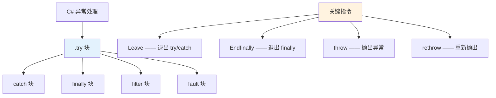
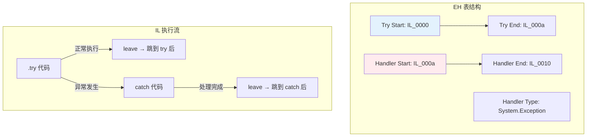
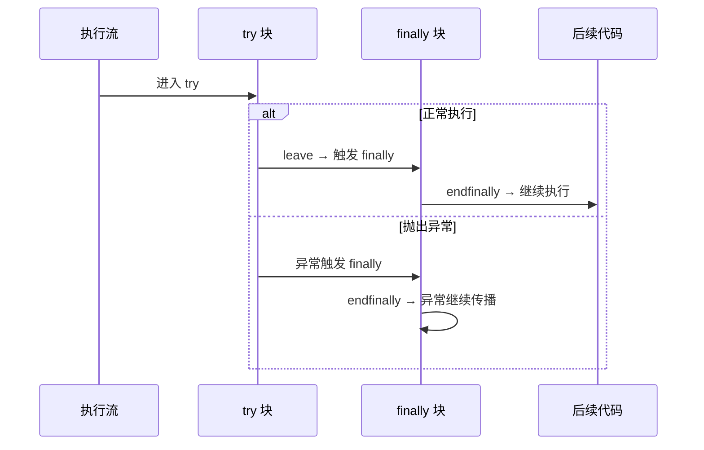
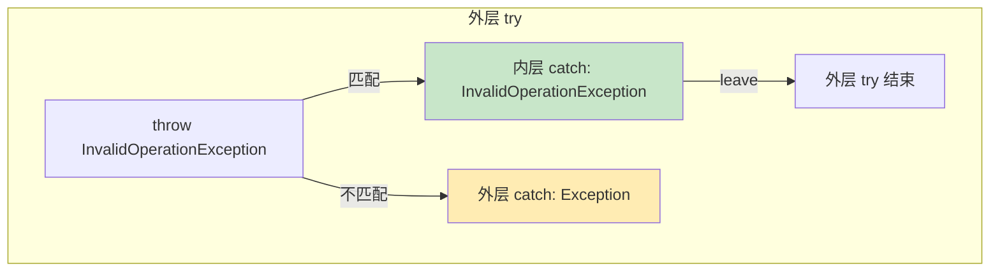

# try/catch/finally —— IL 异常块结构

> C# 的 try/catch/finally 在 IL 中变成了 EH 表（异常处理表）+ Leave/Endfinally 指令。理解 IL 的异常结构，是读懂反编译代码和调试异常问题的关键。



## 一、IL 异常处理结构概览

IL 不使用 C# 风格的大括号嵌套，而是通过**EH 表**（Exception Handler Table）声明受保护区域和处理程序：

```il
.method private static void Demo() cil managed
{
    .try
    {
        // 受保护代码
        leave.s IL_AFTER_TRY     // 退出 try 块
    }
    catch [mscorlib]System.Exception
    {
        // 异常处理代码
        leave.s IL_AFTER_CATCH   // 退出 catch 块
    }
    IL_AFTER_TRY:
    IL_AFTER_CATCH:
    // 后续代码
}
```



## 二、Leave 指令 —— 退出 try/catch 块

### 2.1 为什么不能用 br？

::: important EH 边界限制
`br`（分支指令）**不能跨越 EH 边界**。从 try 块或 catch 块跳出到外部代码，必须使用 `leave` 或 `leave.s`。`leave` 会执行以下操作：
1. 弹出当前 EH 区域内的所有局部变量
2. 通知 CLR 退出当前受保护区域
3. 如果有 finally 块，确保 finally 先执行
:::

```csharp
try
{
    Console.WriteLine("In try");
    // 正常退出 → leave
}
catch (Exception ex)
{
    Console.WriteLine("In catch");
    // 处理完 → leave
}
Console.WriteLine("After try/catch");
```

```il
.method private static void Demo() cil managed
{
    .try
    {
        ldstr "In try"
        call void [mscorlib]System.Console::WriteLine(string)
        leave.s IL_AFTER_CATCH    // 退出 try，跳到 catch 后面
    }
    catch [mscorlib]System.Exception
    {
        // CLR 自动将异常对象推入栈顶
        callvirt instance string [mscorlib]System.Exception::get_Message()
        call void [mscorlib]System.Console::WriteLine(string)
        leave.s IL_AFTER_CATCH    // 退出 catch，跳到 catch 后面
    }
    IL_AFTER_CATCH:
    ldstr "After try/catch"
    call void [mscorlib]System.Console::WriteLine(string)
    ret
}
```

## 三、异常对象在 catch 中的传递

进入 catch 块时，CLR **自动将异常对象引用推入栈顶**，无需显式加载：

```csharp
try
{
    throw new InvalidOperationException("error");
}
catch (InvalidOperationException ex)
{
    Console.WriteLine(ex.Message);  // ex 由 CLR 自动推入栈
}
```

```il
.try
{
    ldstr "error"
    newobj instance void [mscorlib]System.InvalidOperationException::.ctor(string)
    throw                           // 抛出异常
}
catch [mscorlib]System.InvalidOperationException
{
    // 栈顶已经是异常对象（CLR 自动推入）
    callvirt instance string [mscorlib]System.Exception::get_Message()
    call void [mscorlib]System.Console::WriteLine(string)
    leave.s IL_END
}
IL_END:
ret
```

::: tip catch 块中异常对象是隐式参数
C# 的 `catch (Exception ex)` 中 `ex` 不是方法参数，而是 CLR 在进入 catch 块时自动推入栈的。如果你在 catch 中不使用异常对象（如 `catch { ... }`），IL 中仍然会推入异常引用，只是用 `pop` 丢弃。
:::

## 四、finally 块 —— Endfinally

finally 块使用 `endfinally` 指令退出：

```csharp
try
{
    Console.WriteLine("In try");
}
finally
{
    Console.WriteLine("In finally");  // 无论如何都会执行
}
```

```il
.try
{
    ldstr "In try"
    call void [mscorlib]System.Console::WriteLine(string)
    leave.s IL_AFTER_FINALLY     // 退出 try → 触发 finally
}
finally
{
    ldstr "In finally"
    call void [mscorlib]System.Console::WriteLine(string)
    endfinally                    // 退出 finally
}
IL_AFTER_FINALLY:
ret
```



::: warning finally 块的异常传播
`endfinally` 不是简单地"返回"。如果 finally 是因为异常而触发的，`endfinally` 会继续传播该异常。如果 finally 中抛出新异常，原异常会被替换。
:::

## 五、try/catch/finally 组合

```csharp
try
{
    Console.WriteLine("In try");
}
catch (InvalidOperationException ex)
{
    Console.WriteLine("In catch: " + ex.Message);
}
finally
{
    Console.WriteLine("In finally");
}
```

```il
.method private static void FullDemo() cil managed
{
    .try
    {
        .try
        {
            ldstr "In try"
            call void [mscorlib]System.Console::WriteLine(string)
            leave.s IL_BEFORE_FINALLY
        }
        catch [mscorlib]System.InvalidOperationException
        {
            ldstr "In catch: "
            ldloc.0                   // ex（CLR 自动推入）
            callvirt instance string [mscorlib]System.Exception::get_Message()
            call string [mscorlib]System.String::Concat(string, string)
            call void [mscorlib]System.Console::WriteLine(string)
            leave.s IL_BEFORE_FINALLY
        }
        IL_BEFORE_FINALLY:
        leave.s IL_AFTER_ALL
    }
    finally
    {
        ldstr "In finally"
        call void [mscorlib]System.Console::WriteLine(string)
        endfinally
    }
    IL_AFTER_ALL:
    ret
}
```

::: important try/catch/finally 的 IL 嵌套结构
C# 的 `try/catch/finally` 在 IL 中编译为**嵌套的两层 .try**：
- 外层：`.try { ... } finally { ... }`
- 内层：`.try { ... } catch { ... }`

这是因为 IL 规范要求 catch 和 finally 不能在同一个 .try 块中并列。理解这个嵌套关系，是读懂反编译代码的关键。
:::

## 六、嵌套 try 块

```csharp
try
{
    try
    {
        throw new InvalidOperationException("inner");
    }
    catch (InvalidOperationException)
    {
        Console.WriteLine("Inner catch");
    }
}
catch (Exception)
{
    Console.WriteLine("Outer catch");
}
```

```il
.method private static void NestedTry() cil managed
{
    .try
    {
        .try
        {
            ldstr "inner"
            newobj instance void [mscorlib]System.InvalidOperationException::.ctor(string)
            throw
        }
        catch [mscorlib]System.InvalidOperationException
        {
            pop                               // 丢弃异常对象
            ldstr "Inner catch"
            call void [mscorlib]System.Console::WriteLine(string)
            leave.s IL_INNER_END
        }
        IL_INNER_END:
        leave.s IL_OUTER_END
    }
    catch [mscorlib]System.Exception
    {
        pop
        ldstr "Outer catch"
        call void [mscorlib]System.Console::WriteLine(string)
        leave.s IL_OUTER_END
    }
    IL_OUTER_END:
    ret
}
```



## 七、throw vs rethrow

```csharp
try
{
    throw new InvalidOperationException();  // throw：抛出新异常
}
catch (Exception ex)
{
    throw;     // rethrow：重新抛出当前异常，保留原始栈跟踪
    // throw ex;  // throw：重置栈跟踪！
}
```

```il
.try
{
    newobj instance void [mscorlib]System.InvalidOperationException::.ctor()
    throw                   // throw：抛出栈顶的异常对象
}
catch [mscorlib]System.Exception
{
    // throw; 的 IL：
    rethrow                 // 重新抛出当前异常，保留堆栈

    // throw ex; 的 IL：
    // ldloc.0
    // throw               // 抛出 ex 变量，重置堆栈
}
```

::: warning throw vs rethrow 的关键区别
- `throw`：抛出栈顶异常对象，**重置堆栈跟踪**的起点
- `rethrow`：重新抛出当前正在处理的异常，**保留原始堆栈跟踪**

在 catch 块中，`throw;` 编译为 `rethrow`，`throw ex;` 编译为 `ldloc + throw`。调试时务必使用 `throw;` 保留完整堆栈。
:::

## 八、指令速查表

| 指令 | 作用 | 使用场景 |
|------|------|---------|
| `leave <target>` | 退出 try/catch 并跳转 | try 或 catch 块的正常退出 |
| `leave.s <target>` | 退出 try/catch（短跳转） | 跳转偏移量 < 256 |
| `endfinally` | 退出 finally 块 | finally 块的结尾 |
| `throw` | 抛出栈顶异常对象 | 主动抛出异常 |
| `rethrow` | 重新抛出当前异常 | catch 中保留堆栈的重新抛出 |

| IL 结构 | 说明 |
|---------|------|
| `.try { ... } catch <type> { ... }` | catch 块 |
| `.try { ... } finally { ... }` | finally 块 |
| EH 表 | 方法的元数据，记录受保护区域和处理程序映射 |

> **参考文档**：[OpCodes.Leave](https://learn.microsoft.com/en-us/dotnet/api/system.reflection.emit.opcodes.leave) | [OpCodes.Endfinally](https://learn.microsoft.com/en-us/dotnet/api/system.reflection.emit.opcodes.endfinally) | [OpCodes.Throw](https://learn.microsoft.com/en-us/dotnet/api/system.reflection.emit.opcodes.throw) | [OpCodes.Rethrow](https://learn.microsoft.com/en-us/dotnet/api/system.reflection.emit.opcodes.rethrow)

---

## 面试技巧

1. **IL 中 try/catch/finally 为什么是嵌套结构？** —— IL 规范不允许 catch 和 finally 并列在同一个 .try 中。`try/catch/finally` 编译为外层 `.try + finally`，内层 `.try + catch`。

2. **Leave 和 br 的区别？** —— `br` 不能跨越 EH 边界。`leave` 会正确通知 CLR 退出当前 EH 区域，并确保 finally 块先执行。

3. **catch 块中异常对象从哪来？** —— CLR 进入 catch 块时自动将异常引用推入栈顶。这不是方法参数，是 EH 机制的隐式行为。

4. **throw 和 rethrow 的 IL 区别？** —— `throw` 抛出栈顶对象，重置堆栈跟踪起点；`rethrow` 重新抛出当前异常，保留原始堆栈。C# 的 `throw;` 编译为 `rethrow`，`throw ex;` 编译为 `ldloc + throw`。

5. **finally 块中的 endfinally 做了什么？** —— 如果 finally 因异常触发，`endfinally` 继续传播异常；如果正常触发，继续执行 leave 后的代码。finally 中抛出新异常会替换原异常。
