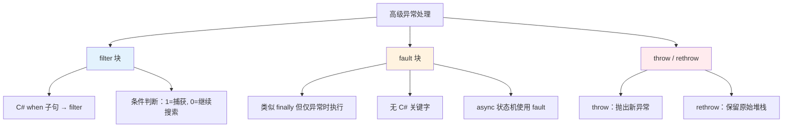
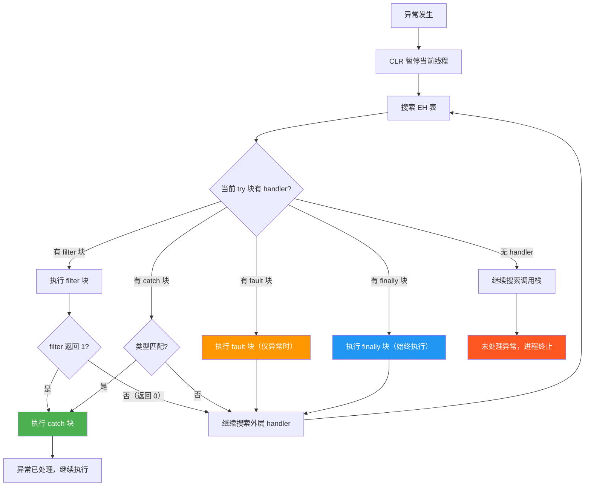
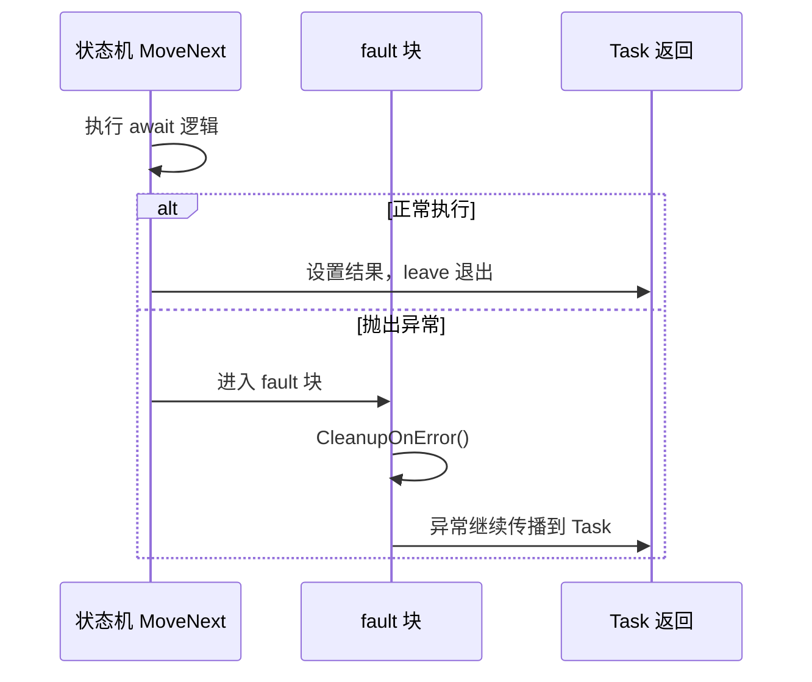
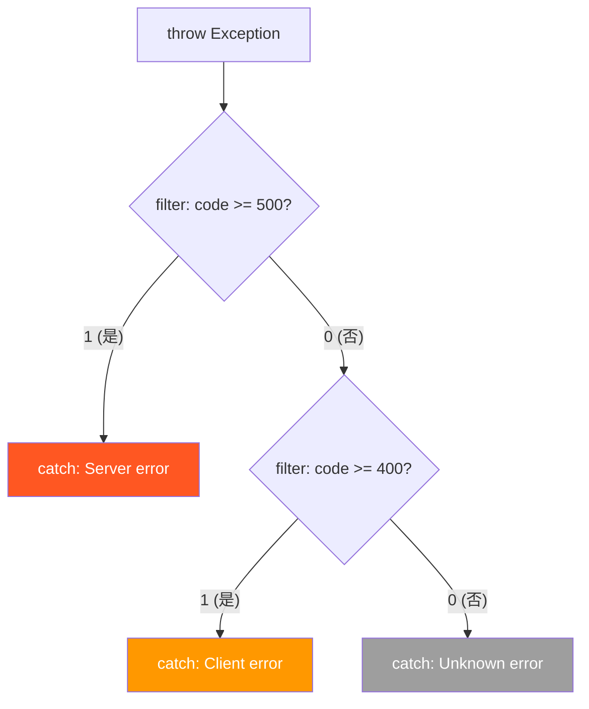

# filter 与 fault —— 高级异常处理

> IL 的 filter 和 fault 块在 C# 中没有直接对应的关键字（除 `when` 子句映射 filter），但它们是 async/await 状态机的基石。理解它们，才能读懂异步方法的异常处理 IL。



## 一、异常分派流程

在深入 filter 和 fault 之前，先理解 CLR 的完整异常分派机制：



## 二、filter 块 —— 异常过滤器

### 2.1 filter 的工作原理

filter 块允许在决定是否捕获异常之前执行**任意条件判断**：

1. CLR 将异常对象推入栈顶
2. 执行 filter 块中的代码
3. `endfilter` 指令推入结果：**1 = 捕获异常，0 = 继续搜索**
4. 如果返回 1，执行 catch 块；如果返回 0，CLR 继续搜索下一个 handler

### 2.2 C# when 子句 → filter

C# 6.0 引入的 `when` 子句直接映射为 IL filter 块：

```csharp
try
{
    throw new HttpRequestException("503");
}
catch (HttpRequestException ex) when (ex.Message.Contains("503"))
{
    Console.WriteLine("Service unavailable: " + ex.Message);
}
catch (HttpRequestException ex)
{
    Console.WriteLine("Other HTTP error: " + ex.Message);
}
```

```il
.try
{
    ldstr "503"
    newobj instance void [mscorlib]System.HttpRequestException::.ctor(string)
    throw
}
filter
{
    // 栈顶是异常对象（CLR 自动推入）
    dup                             // 复制异常引用
    callvirt instance string [mscorlib]System.Exception::get_Message()
    ldstr "503"
    call bool [mscorlib]System.String::Contains(string)
    endfilter                       // 推入 1(true) 或 0(false)
}
{   // catch 块（仅当 filter 返回 1 时执行）
    // 栈顶仍然是异常对象
    callvirt instance string [mscorlib]System.Exception::get_Message()
    ldstr "Service unavailable: "
    call string [mscorlib]System.String::Concat(string, string)
    call void [mscorlib]System.Console::WriteLine(string)
    leave.s IL_END
}
catch [mscorlib]System.HttpRequestException
{
    callvirt instance string [mscorlib]System.Exception::get_Message()
    ldstr "Other HTTP error: "
    call string [mscorlib]System.String::Concat(string, string)
    call void [mscorlib]System.Console::WriteLine(string)
    leave.s IL_END
}
IL_END:
ret
```

::: important filter 块与 catch 块的区别
- **普通 catch**：CLR 检查异常类型是否匹配
- **filter catch**：CLR 先推入异常对象，执行 filter 块中的代码，根据 `endfilter` 的返回值决定是否捕获

filter 块中可以执行任意代码（包括方法调用、字段访问），这使得 VB.NET 的 `Catch ... When ...` 语法成为可能。C# 6.0 的 `when` 子句是 C# 对此特性的首次使用。
:::

### 2.3 filter 的调试价值

```csharp
// 利用 when 子句在调试时不捕获特定异常
catch (Exception ex) when (IsDebuggerAttached())
{
    // 仅在调试器附加时捕获
    Debugger.Break();
}

static bool IsDebuggerAttached() => Debugger.IsAttached;
```

::: tip when 子句的副作用
`when` 条件（即 filter 块）中的代码如果抛出异常，CLR 会**捕获该异常并视为 filter 返回 0**（即不捕获原始异常），然后继续搜索下一个 handler。这是 filter 的安全机制。
:::

## 三、fault 块 —— 仅异常时执行的 finally

### 3.1 fault 的工作原理

fault 块与 finally 块类似，但**仅在异常发生时执行**，正常退出 try 块时不执行：

| 块类型 | 正常退出时 | 异常退出时 |
|--------|-----------|-----------|
| finally | **执行** | **执行** |
| fault | **不执行** | **执行** |

### 3.2 C# 中没有 fault 关键字

C# 没有直接对应 fault 块的语法，但编译器在特定场景生成 fault 块：

```csharp
// C# 无法直接写 fault 块，但 IL 中存在
// 伪代码概念：
// try { ... }
// fault { /* 仅异常时执行 */ }
```

::: warning fault 块的执行后行为
fault 块执行完毕后，异常**继续传播**（与 finally 相同）。fault 块不能"吞掉"异常，它只能在异常传播前执行清理代码。
:::

### 3.3 async/await 状态机中的 fault 块

async 方法的状态机大量使用 fault 块来处理异常清理：

```csharp
public async Task<int> GetDataAsync()
{
    var client = new HttpClient();
    try
    {
        var response = await client.GetAsync("https://api.example.com/data");
        return await response.Content.ReadAsIntAsync();
    }
    finally
    {
        client.Dispose();
    }
}
```

编译器生成的状态机 IL 中，异常清理逻辑使用 fault 块：

```il
// 简化的状态机异常处理结构
.class nested private sealed beforefieldinit StateMachine
    extends [mscorlib]System.Runtime.CompilerServices.AsyncTaskMethodBuilder`1<int32>
{
    .method private void MoveNext() cil managed
    {
        .try
        {
            // 状态机逻辑：await、回调、状态转换
            // ...
            leave.s IL_NORMAL_EXIT
        }
        fault
        {
            // 异常清理：释放资源、重置状态
            ldarg.0
            call instance void StateMachine::CleanupOnError()
            endfault
        }
        IL_NORMAL_EXIT:
        ret
    }
}
```



::: important 为什么 async 用 fault 而不是 finally？
状态机的 `MoveNext` 方法需要区分正常完成和异常完成：
- **正常完成**：设置 Task 结果，不需要清理
- **异常完成**：需要清理状态、释放资源、将异常传递给 Task

fault 块恰好满足"仅异常时执行"的需求，而 finally 会在正常退出时也执行不必要的清理逻辑。编译器选择 fault 是精确语义的体现。
:::

## 四、throw 与 rethrow 详解

### 4.1 throw —— 抛出新异常

```csharp
throw new InvalidOperationException("error");
```

```il
ldstr "error"
newobj instance void [mscorlib]System.InvalidOperationException::.ctor(string)
throw    // 弹出异常对象，开始异常分派
```

`throw` 弹出栈顶异常对象，重置堆栈跟踪的起始点为新抛出位置。

### 4.2 rethrow —— 重新抛出当前异常

```csharp
catch (Exception ex)
{
    Log(ex);
    throw;  // rethrow：保留原始堆栈
}
```

```il
catch [mscorlib]System.Exception
{
    // 栈顶是异常对象
    call void Logger::Log(class [mscorlib]System.Exception)
    rethrow   // 重新抛出当前异常，不修改堆栈跟踪
}
```

### 4.3 对比表

| 操作 | C# 语法 | IL 指令 | 堆栈跟踪 |
|------|---------|---------|---------|
| 抛出新异常 | `throw new Ex()` | `newobj + throw` | 从 throw 位置开始 |
| 重新抛出 | `throw;` | `rethrow` | **保留原始** |
| 重新抛出变量 | `throw ex;` | `ldloc + throw` | **从 throw 位置重新开始** |

::: warning 永远不要用 throw ex
`throw ex;` 会重置堆栈跟踪，丢失原始异常发生位置的信息。在 catch 块中始终使用 `throw;`（即 `rethrow`）来保留完整的堆栈跟踪。
:::

## 五、endfilter 指令

`endfilter` 结束 filter 块，必须推入一个 int32 值：

- **1 (nonzero)**：捕获异常，执行 catch 块
- **0**：不捕获异常，CLR 继续搜索下一个 handler

```il
filter
{
    // 判断条件
    ldloc ex                           // 加载异常对象
    callvirt instance string System.Exception::get_Message()
    ldstr "expected"
    call bool System.String::Contains(string)
    ldc.i4.0
    ceq                                // 取反：如果包含则 0，否则 1
    ldc.i4.0
    ceq                                // 再取反：包含则 1，否则 0
    endfilter                          // 推入结果
}
```

::: tip filter 块的限制
- filter 块中不能使用 `leave` 指令
- filter 块必须以 `endfilter` 结束
- filter 块中抛出的异常会被 CLR 捕获，视为 filter 返回 0
:::

## 六、完整示例：when 子句的 IL

```csharp
using System;

public class FilterDemo
{
    public static void Process(int code)
    {
        try
        {
            throw new Exception($"Error code: {code}");
        }
        catch (Exception ex) when (code >= 500)
        {
            Console.WriteLine($"Server error: {ex.Message}");
        }
        catch (Exception ex) when (code >= 400)
        {
            Console.WriteLine($"Client error: {ex.Message}");
        }
        catch (Exception ex)
        {
            Console.WriteLine($"Unknown error: {ex.Message}");
        }
    }
}
```

```il
.method public static void Process(int32 code) cil managed
{
    .try
    {
        ldstr "Error code: "
        ldarg.0
        box [mscorlib]System.Int32
        call string [mscorlib]System.String::Concat(object, object)
        newobj instance void [mscorlib]System.Exception::.ctor(string)
        throw
    }
    filter
    {
        ldarg.0
        ldc.i4 500
        clt.un                        // code < 500 ?
        ldc.i4.0
        ceq                           // !(code < 500) = code >= 500
        endfilter                     // 返回 1 或 0
    }
    {
        callvirt instance string [mscorlib]System.Exception::get_Message()
        ldstr "Server error: "
        call string [mscorlib]System.String::Concat(string, string)
        call void [mscorlib]System.Console::WriteLine(string)
        leave.s IL_END
    }
    filter
    {
        ldarg.0
        ldc.i4 400
        clt.un
        ldc.i4.0
        ceq                           // code >= 400
        endfilter
    }
    {
        callvirt instance string [mscorlib]System.Exception::get_Message()
        ldstr "Client error: "
        call string [mscorlib]System.String::Concat(string, string)
        call void [mscorlib]System.Console::WriteLine(string)
        leave.s IL_END
    }
    catch [mscorlib]System.Exception
    {
        callvirt instance string [mscorlib]System.Exception::get_Message()
        ldstr "Unknown error: "
        call string [mscorlib]System.String::Concat(string, string)
        call void [mscorlib]System.Console::WriteLine(string)
        leave.s IL_END
    }
    IL_END:
    ret
}
```



## 七、指令速查表

| 指令 | 作用 | 使用场景 |
|------|------|---------|
| `filter` | 开始异常过滤块 | C# `when` 子句 |
| `endfilter` | 结束 filter 块，推入 1 或 0 | filter 块结尾 |
| `fault` | 开始 fault 块（仅异常时执行） | async 状态机、异常清理 |
| `throw` | 抛出栈顶异常对象 | 主动抛出异常 |
| `rethrow` | 重新抛出当前异常 | 保留堆栈跟踪的重新抛出 |

| C# 语法 | IL 映射 |
|---------|---------|
| `catch (Ex ex) when (cond)` | `filter { cond; endfilter } { handler }` |
| `catch (Ex ex)` | `catch Ex { handler }` |
| `finally { ... }` | `finally { ... endfinally }` |
| `throw;` | `rethrow` |
| `throw ex;` | `ldloc + throw` |

> **参考文档**：[OpCodes.Filter](https://learn.microsoft.com/en-us/dotnet/api/system.reflection.emit.opcodes.filter) | [OpCodes.Endfilter](https://learn.microsoft.com/en-us/dotnet/api/system.reflection.emit.opcodes.endfilter) | [OpCodes.Fault](https://learn.microsoft.com/en-us/dotnet/api/system.reflection.emit.opcodes.fault) | [OpCodes.Throw](https://learn.microsoft.com/en-us/dotnet/api/system.reflection.emit.opcodes.throw) | [OpCodes.Rethrow](https://learn.microsoft.com/en-us/dotnet/api/system.reflection.emit.opcodes.rethrow)

---

## 面试技巧

1. **C# 的 `when` 子句在 IL 中如何实现？** —— 编译为 `filter` 块。filter 块执行条件判断，`endfilter` 返回 1 表示捕获异常，返回 0 表示继续搜索下一个 handler。

2. **fault 块和 finally 块的区别？** —— finally 在正常退出和异常退出时**都执行**；fault **仅在异常退出时执行**。C# 没有 fault 关键字，但 async 状态机的 MoveNext 方法使用 fault 做异常清理。

3. **为什么 async 状态机用 fault 而不用 finally？** —— 状态机需要区分正常完成（设置 Task 结果）和异常完成（清理状态 + 传播异常）。fault 仅在异常时触发，避免正常路径的不必要清理。

4. **filter 块中抛出异常会怎样？** —— CLR 会捕获 filter 中的异常，视为 filter 返回 0（不捕获原始异常），然后继续搜索下一个 handler。这是安全机制。

5. **`throw;` 和 `throw ex;` 的 IL 区别？** —— `throw;` 编译为 `rethrow`，保留原始堆栈跟踪；`throw ex;` 编译为 `ldloc + throw`，重置堆栈起点。始终使用 `throw;` 保留调试信息。
