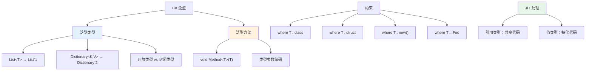
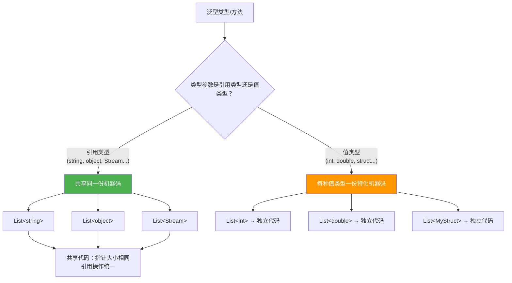

# 泛型类型与方法 —— IL 中的泛型编码

> 泛型是 .NET 2.0 的核心特性。在 IL 层面，泛型通过反引号（backtick）记法编码类型参数数量，约束以元数据形式存储。理解这些编码，才能读懂泛型代码的反编译输出。



## 一、泛型类型的 IL 编码

### 1.1 反引号记法（Backtick Notation）

IL 使用反引号 + 参数数量来编码泛型类型：

| C# 语法 | IL 编码 | 说明 |
|---------|---------|------|
| `List<T>` | `List`1` | 1 个类型参数 |
| `Dictionary<TKey, TValue>` | `Dictionary`2` | 2 个类型参数 |
| `Tuple<T1, T2, T3>` | `Tuple`3` | 3 个类型参数 |
| `Func<T1, T2, TResult>` | `Func`3` | 3 个类型参数 |

```csharp
// C# 代码
List<int> intList = new List<int>();
Dictionary<string, int> dict = new Dictionary<string, int>();
```

```il
// IL 中的泛型类型引用
IL_0000: newobj instance void class [mscorlib]System.Collections.Generic.List`1<int32>::.ctor()
IL_0005: stloc.0

IL_0006: newobj instance void class [mscorlib]System.Collections.Generic.Dictionary`2<string, int32>::.ctor()
IL_000b: stloc.1
```

::: important 反引号是类型名称的一部分
`List`1` 和 `List` 是不同的类型。反引号后面的数字表示泛型参数的**数量**（arity），这是 IL 元数据中区分不同泛型实例化的关键。
:::

### 1.2 封闭类型 vs 开放类型

| 概念 | 说明 | 示例 |
|------|------|------|
| 开放类型（Open） | 类型参数未指定 | `List<>`、`Dictionary<,>` |
| 封闭类型（Closed） | 类型参数已指定 | `List<int>`、`Dictionary<string, int>` |

```csharp
Type openType = typeof(List<>);           // 开放类型
Type closedType = typeof(List<int>);      // 封闭类型

Console.WriteLine(openType.Name);         // List`1
Console.WriteLine(closedType.Name);       // List`1
Console.WriteLine(openType.IsGenericTypeDefinition);  // True
Console.WriteLine(closedType.IsGenericTypeDefinition); // False
```

```il
// typeof(List<>) → 开放类型
IL_0000: ldtoken class [mscorlib]System.Collections.Generic.List`1<!0>
IL_0005: call class [mscorlib]System.Type [mscorlib]System.Type::GetTypeFromHandle(valuetype [mscorlib]System.RuntimeTypeHandle)

// typeof(List<int>) → 封闭类型
IL_000a: ldtoken class [mscorlib]System.Collections.Generic.List`1<int32>
IL_000f: call class [mscorlib]System.Type [mscorlib]System.Type::GetTypeFromHandle(valuetype [mscorlib]System.RuntimeTypeHandle)
```

::: tip IL 中的 `!0` 和 `!!0`
- `!0` 表示泛型**类型**的第 1 个参数（如 `List<T>` 中的 `T`）
- `!!0` 表示泛型**方法**的第 1 个参数
- 编号从 0 开始：`!0`、`!1`、`!2`... 对应 `T1`、`T2`、`T3`...
:::

## 二、泛型方法的 IL 编码

### 2.1 泛型方法声明

```csharp
public class Utils
{
    public static T Identity<T>(T value)
    {
        return value;
    }

    public static T Default<T>()
    {
        return default(T);
    }
}
```

```il
.class public Utils
{
    // T Identity<T>(T value)
    .method public static !!0 Identity<([mscorlib]System.Object) T>(!!0 value) cil managed
    {
        ldarg.0         // 加载 value
        ret             // 返回 value
    }

    // T Default<T>()
    .method public static !!0 Default<([mscorlib]System.Object) T>() cil managed
    {
        // default(T) 的实现：
        // 引用类型 → ldnull
        // 值类型 → initobj / 零初始化局部变量
        ldloca.s V_0     // 局部变量地址
        initobj !!T      // 初始化为默认值
        ldloc.0          // 加载默认值
        ret
    }
}
```

### 2.2 泛型方法调用

```csharp
string result = Utils.Identity<string>("hello");
int defaultInt = Utils.Default<int>();
```

```il
// Utils.Identity<string>("hello")
IL_0000: ldstr "hello"
IL_0005: call !!0 Utils::Identity<string>(!!0)
IL_000a: stloc.0

// Utils.Default<int>()
IL_000b: call !!0 Utils::Default<int32>()
IL_0010: stloc.1
```

::: tip 泛型方法调用的类型参数
调用泛型方法时，IL 需要指定具体的类型参数（如 `<string>`、`<int32>`）。JIT 根据这些类型参数生成对应的机器码。
:::

## 三、泛型约束的 IL 表示

### 3.1 约束类型一览

| C# 约束 | IL 表示 | 含义 |
|---------|---------|------|
| `where T : class` | `(class) T` | T 必须是引用类型 |
| `where T : struct` | `(valuetype) T` | T 必须是值类型 |
| `where T : new()` | `.ctor()` | T 必须有无参构造函数 |
| `where T : IFoo` | `IFoo` | T 必须实现 IFoo 接口 |
| `where T : BaseClass` | `BaseClass` | T 必须继承 BaseClass |

### 3.2 多约束泛型方法

```csharp
public class Repository
{
    public static T Create<T>() where T : class, IEntity, new()
    {
        var instance = new T();
        instance.Id = Guid.NewGuid();
        return instance;
    }
}

public interface IEntity
{
    Guid Id { get; set; }
}
```

```il
.class public Repository
{
    .method public static !!0 Create<
        (class,     // where T : class
         class IEntity,  // where T : IEntity
         .ctor)     // where T : new()
        T>() cil managed
    {
        // var instance = new T()
        // 编译器对 new() 约束使用 Activator.CreateInstance
        call !!0 [mscorlib]System.Activator::CreateInstance<!!T>()
        dup
        // instance.Id = Guid.NewGuid()
        call valuetype [mscorlib]System.Guid [mscorlib]System.Guid::NewGuid()
        callvirt instance void IEntity::set_Id(valuetype [mscorlib]System.Guid)
        ret
    }
}
```

### 3.3 约束的完整示例

```csharp
public class Container<T> where T : struct, IComparable<T>
{
    private T _value;

    public Container(T value)
    {
        _value = value;
    }

    public bool IsGreaterThan(T other)
    {
        return _value.CompareTo(other) > 0;
    }
}
```

```il
.class public valuetype Container`1<
    (valuetype,     // where T : struct
     class [mscorlib]System.IComparable`1<!!0>)  // where T : IComparable<T>
    T>
    extends [mscorlib]System.ValueType
{
    .field private !0 _value     // !0 = 第 1 个类型参数 T

    .method public instance void .ctor(!0 value) cil managed
    {
        ldarg.0
        ldarg.1
        stfld !0 Container`1<!0>::_value
        ret
    }

    .method public instance bool IsGreaterThan(!0 other) cil managed
    {
        ldarg.0
        ldfld !0 Container`1<!0>::_value    // this._value
        ldarg.1                               // other
        // constrained. callvirt —— 下一章详解
        constrained. !!T
        callvirt instance int32 class [mscorlib]System.IComparable`1<!!0>::CompareTo(!0)
        ldc.i4.0
        cgt                                    // > 0 ?
        ret
    }
}
```

## 四、JIT 如何处理泛型



### 4.1 引用类型共享代码

所有引用类型参数共享同一份 JIT 编译的机器码，因为引用类型的变量大小相同（一个指针）：

```csharp
List<string> stringList = new List<string>();   // JIT 生成代码 A
List<object> objectList = new List<object>();    // 复用代码 A
List<Stream> streamList = new List<Stream>();    // 复用代码 A
```

### 4.2 值类型特化代码

每种值类型参数触发独立的 JIT 编译，因为值类型大小不同、内存布局不同：

```csharp
List<int> intList = new List<int>();         // JIT 生成代码 B1
List<double> doubleList = new List<double>(); // JIT 生成代码 B2
List<long> longList = new List<long>();       // JIT 生成代码 B3
```

::: warning 值类型泛型的代码膨胀
每个值类型泛型实例化都会产生独立的机器码。过度使用值类型泛型（如大量不同的 `struct` 组合）可能导致代码膨胀（code bloat），增加内存占用和 JIT 编译时间。
:::

### 4.3 JIT 处理总结

| 场景 | JIT 行为 | 示例 |
|------|---------|------|
| `List<string>` | 共享代码（所有 ref 类型） | 与 `List<object>` 共享 |
| `List<int>` | 独立代码 | int32 特化 |
| `List<double>` | 独立代码 | float64 特化 |
| `List<MyStruct>` | 独立代码 | MyStruct 特化 |
| `List<Nullable<int>>` | 独立代码 | 值类型嵌套也是特化 |

## 五、类型参数编码速查

| 符号 | 含义 | 示例 |
|------|------|------|
| `` `N `` | 泛型类型有 N 个参数 | `` List`1 ``、`` Dictionary`2 `` |
| `!N` | 类型参数第 N+1 个 | `!0` = T, `!1` = U |
| `!!N` | 方法参数第 N+1 个 | `!!0` = TMethod |
| `<...>` | 封闭泛型实例化 | `List<int32>` |

> **参考文档**：[OpCodes.Call](https://learn.microsoft.com/en-us/dotnet/api/system.reflection.emit.opcodes.call) | [System.Type.IsGenericType](https://learn.microsoft.com/en-us/dotnet/api/system.type.isgenerictype) | [ECMA-335 II.9.4 Generics](https://ecma-international.org/publications-and-standards/standards/ecma-335/)

---

## 面试技巧

1. **IL 中泛型类型如何编码？** —— 使用反引号记法：`` `N `` 表示 N 个类型参数。如 `List<T>` → `List`1`，`Dictionary<K,V>` → `Dictionary`2`。

2. **`!0` 和 `!!0` 的区别？** —— `!N` 引用泛型**类型**的第 N+1 个参数，`!!N` 引用泛型**方法**的第 N+1 个参数。

3. **开放类型和封闭类型的区别？** —— 开放类型是未指定参数的泛型定义（如 `List<>`），封闭类型是已指定参数的实例化（如 `List<int>`）。只有封闭类型可以实例化。

4. **JIT 如何处理泛型？** —— 引用类型共享同一份机器码（因为指针大小相同），值类型每种参数生成独立代码（因为大小和布局不同）。这是性能和代码大小的权衡。

5. **泛型约束在 IL 中如何表示？** —— 约束存储在方法签名的类型参数声明中。`class` 约束标记为引用类型，`struct` 标记为值类型，`new()` 标记为 `.ctor`，接口/基类约束直接列出类型。
