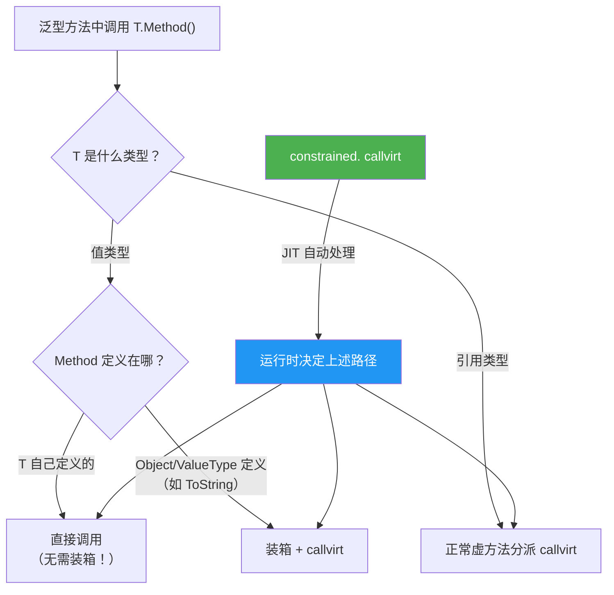
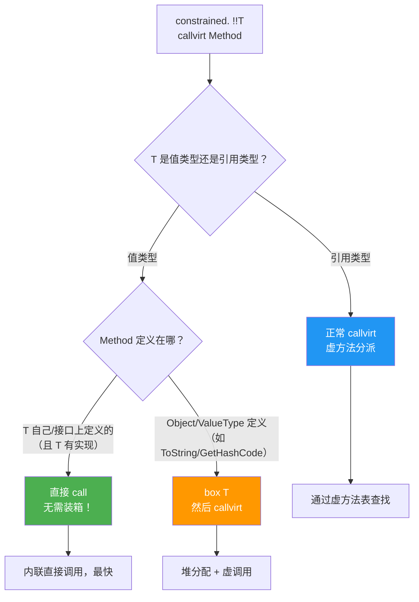
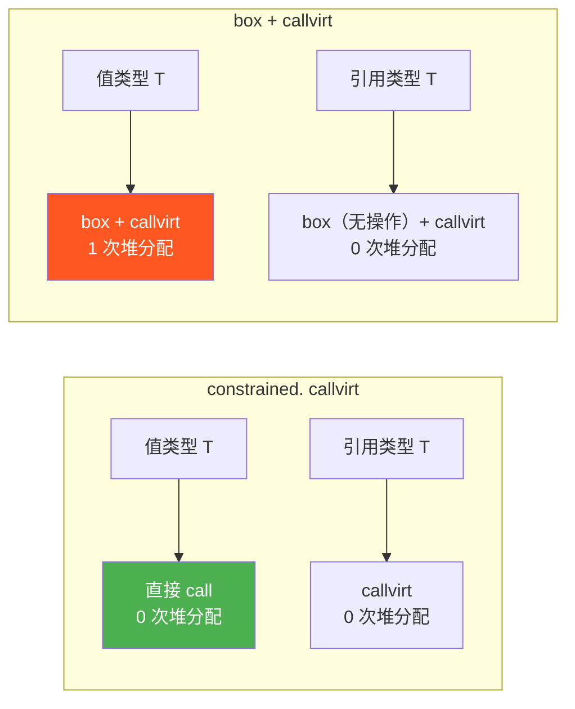

# 约束调用 —— constrained. 前缀指令

> `constrained.` 是 IL 中最精巧的前缀指令之一。它解决了泛型类型参数上调用虚方法的分派难题——让 JIT 在运行时决定是直接调用还是虚调用，避免不必要的装箱。



## 一、问题：泛型类型参数上的虚调用

### 1.1 核心困境

在泛型方法中，`T` 可以是值类型也可以是引用类型。对 `T` 调用虚方法时，IL 面临两难：

```csharp
interface IPrintable
{
    void Print();
}

void Display<T>(T value) where T : IPrintable
{
    value.Print();  // 如何编译？
}
```

**问题分析**：

| T 的类型 | 正确的调用方式 | 错误的调用方式 |
|----------|--------------|--------------|
| 引用类型 | `callvirt IPrintable.Print` | `call`（跳过虚分派） |
| 值类型（T 自己实现的） | `call T.Print`（直接调用） | `callvirt`（需要装箱） |
| 值类型（Object 定义的） | `box T` + `callvirt` | 直接 `call`（跳过虚分派） |

::: important 为什么值类型不能用 callvirt？
`callvirt` 要求栈顶是对象引用（托管堆上的指针）。值类型在栈上内联存储，不是对象引用。要 `callvirt`，必须先 `box`，但装箱会分配堆内存，性能损失巨大。

而值类型的方法实现是**非虚的**（sealed），可以直接 `call`，无需虚分派。
:::

### 1.2 错误方案：总是 box + callvirt

```il
// 反面教材：总是装箱
ldarg.0
box !!T                      // 装箱！堆分配！
callvirt instance void IPrintable::Print()
```

这保证了正确性，但对值类型引入了不必要的装箱开销。

### 1.3 错误方案：总是 call

```il
// 反面教材：总是直接调用
ldarg.0
call instance void !!T::Print()   // 引用类型跳过虚分派！
```

这对引用类型是错误的——跳过了虚方法分派，无法实现多态。

## 二、解决方案：constrained. + callvirt

`constrained.` 前缀指令让 JIT 在运行时做出正确选择：

```il
// 正确方案：constrained. + callvirt
ldarg.0
constrained. !!T              // 告诉 JIT：T 是泛型参数
callvirt instance void IPrintable::Print()
```

### 2.1 constrained. 的分派规则

JIT 看到 `constrained. callvirt` 后，根据 T 的实际类型执行不同路径：



| T 的类型 | 方法来源 | JIT 行为 | 是否装箱 |
|----------|---------|---------|---------|
| 值类型 | T 自己的方法 | 直接 `call` | 否 |
| 值类型 | 接口方法（T 实现） | 直接 `call` | 否 |
| 值类型 | Object 的方法（如 ToString） | `box` + `callvirt` | 是 |
| 引用类型 | 任何 | 正常 `callvirt` | 否 |

::: tip constrained. 对值类型接口调用的优化
这是 `constrained.` 最重要的优化：值类型通过接口调用方法时，**不需要装箱**。JIT 直接调用值类型的方法实现，性能等同于非泛型代码。
:::

## 三、C# 编译器如何使用 constrained.

### 3.1 接口约束方法调用

```csharp
public interface ICalculator
{
    int Compute(int x);
}

public struct Adder : ICalculator
{
    public int Compute(int x) => x + 1;
}

public class Processor
{
    public static int Process<T>(T calc, int x) where T : ICalculator
    {
        return calc.Compute(x);  // constrained. callvirt
    }
}
```

```il
.method public static int32 Process<
    (class ICalculator) T  // where T : ICalculator
>(!!T calc, int32 x) cil managed
{
    ldarga.s calc           // 加载 calc 的地址（值类型用 ldarga，不是 ldarg）
    ldarg.1                 // 加载 x
    constrained. !!T        // 约束前缀
    callvirt instance int32 ICalculator::Compute(int32)
    ret
}
```

::: important 为什么用 ldarga 而不是 ldarg？
对于值类型，`constrained. callvirt` 需要**值类型的地址**来直接调用方法（不装箱）。`ldarga` 推入托管指针，满足直接调用的需求。对于引用类型，`ldarga` 推入引用的地址，`callvirt` 仍然可以正确解引用。
:::

### 3.2 对比：无 constrained. 的装箱版本

```csharp
// 手动装箱版本（低效）
public static int ProcessBoxed<T>(T calc, int x) where T : ICalculator
{
    ICalculator boxed = calc;  // 装箱！
    return boxed.Compute(x);
}
```

```il
.method public static int32 ProcessBoxed<
    (class ICalculator) T
>(!!T calc, int32 x) cil managed
{
    ldarg.0
    box !!T                       // 装箱！堆分配！
    ldarg.1
    callvirt instance int32 ICalculator::Compute(int32)
    ret
}
```

### 3.3 性能对比



| 方式 | 值类型堆分配 | 引用类型堆分配 | 值类型调用方式 |
|------|------------|--------------|--------------|
| `constrained. callvirt` | 0 | 0 | 直接调用 |
| `box + callvirt` | 1 | 0 | 装箱后虚调用 |

::: warning 永远不要手动装箱泛型参数
```csharp
// 反模式：手动装箱
ICalculator c = calc;  // 对值类型产生装箱
c.Compute(x);          // callvirt

// 正确做法：让编译器用 constrained.
calc.Compute(x);       // constrained. callvirt，值类型零装箱
```
:::

## 四、Object 方法的 constrained. 调用

值类型继承自 `System.Object` 的虚方法（如 `ToString`、`GetHashCode`、`Equals`）需要特殊处理：

```csharp
public static string GetString<T>(T value)
{
    return value.ToString();  // 如果 T 是值类型，需要装箱吗？
}
```

```il
.method public static string GetString<T>(!!T value) cil managed
{
    ldarga.s value           // 加载地址
    constrained. !!T
    callvirt instance string [mscorlib]System.Object::ToString()
    ret
}
```

JIT 的实际行为：

| T 的类型 | JIT 行为 | 原因 |
|----------|---------|------|
| `int` | `box int32` + `callvirt Object.ToString()` | `int.ToString()` 是 Object 上的虚方法，需要通过虚方法表调用 |
| `string` | 直接 `callvirt Object.ToString()` | 引用类型正常虚分派 |
| 自定义 struct（重写 ToString） | `box MyStruct` + `callvirt Object.ToString()` | 值类型重写 Object 方法仍需通过虚方法表 |

::: important 值类型调用 Object 虚方法仍需装箱
`constrained.` 只是在**值类型调用自己或接口上的方法时**避免装箱。调用 `Object.ToString()` / `Object.GetHashCode()` / `Object.Equals()` 等虚方法时，值类型仍然需要装箱，因为这些方法需要通过虚方法表分派。

但 `constrained.` 的 `box` 是 JIT 内部的，比手动 `box + callvirt` 更高效（JIT 可以优化掉某些情况）。
:::

## 五、完整示例：泛型方法中的多种 constrained. 场景

```csharp
using System;

public interface IMeasurable
{
    int Size { get; }
}

public struct Point : IMeasurable
{
    public int X, Y;
    public int Size => sizeof(int) * 2;

    public override string ToString() => $"({X}, {Y})";
}

public class Shape : IMeasurable
{
    public virtual int Size => 0;
    public override string ToString() => "Shape";
}

public class GenericDemo
{
    // 场景1：接口方法调用
    public static int GetSize<T>(T item) where T : IMeasurable
    {
        return item.Size;  // constrained. callvirt
    }

    // 场景2：Object 虚方法调用
    public static string GetText<T>(T item)
    {
        return item.ToString();  // constrained. callvirt (可能装箱)
    }

    // 场景3：接口 + Object 方法
    public static string Describe<T>(T item) where T : IMeasurable
    {
        return $"{item.Size}: {item.ToString()}";
    }
}
```

```il
// GetSize<T> —— 接口方法：constrained. 避免装箱
.method public static int32 GetSize<(class IMeasurable) T>(!!T item) cil managed
{
    ldarga.s item
    constrained. !!T
    callvirt instance int32 IMeasurable::get_Size()
    ret
}

// GetText<T> —— Object 方法：值类型仍可能装箱
.method public static string GetText<T>(!!T item) cil managed
{
    ldarga.s item
    constrained. !!T
    callvirt instance string [mscorlib]System.Object::ToString()
    ret
}

// Describe<T> —— 两种 constrained. 调用
.method public static string Describe<(class IMeasurable) T>(!!T item) cil managed
{
    // item.Size
    ldarga.s item
    constrained. !!T
    callvirt instance int32 IMeasurable::get_Size()

    // item.ToString()
    ldarga.s item
    constrained. !!T
    callvirt instance string [mscorlib]System.Object::ToString()

    // 格式化拼接
    call string [mscorlib]System.String::Format(string, object, object)
    ret
}
```


## 六、constrained. 的其他用途

### 6.1 Equals 调用

```csharp
public static bool AreEqual<T>(T a, T b)
{
    return a.Equals(b);  // constrained. callvirt
}
```

```il
.method public static bool AreEqual<T>(!!T a, !!T b) cil managed
{
    ldarga.s a
    ldarg.1
    constrained. !!T
    callvirt instance bool [mscorlib]System.Object::Equals(object)
    ret
}
```

### 6.2 枚举的 constrained. 调用

```csharp
public static string GetName<T>(T enumValue) where T : struct, Enum
{
    return enumValue.ToString();  // constrained. + callvirt
}
```

枚举类型是值类型，`ToString()` 定义在 `Enum` 类上（继承自 Object），因此 JIT 会对枚举进行装箱。

## 七、指令速查表

| 指令/前缀 | 作用 | 栈行为 |
|-----------|------|--------|
| `constrained. <type>` | 修饰后续 `callvirt`，约束调用方式 | 不改变栈 |
| `callvirt` (被 constrained. 修饰) | 根据类型选择直接调用或虚分派 | 同普通 callvirt |

| 场景 | JIT 行为 |
|------|---------|
| 值类型 + 接口方法 | 直接 `call`（不装箱） |
| 值类型 + Object 虚方法 | `box` + `callvirt` |
| 引用类型 + 任何虚方法 | 正常 `callvirt` |

> **参考文档**：[OpCodes.Constrained](https://learn.microsoft.com/en-us/dotnet/api/system.reflection.emit.opcodes.constrained) | [OpCodes.Callvirt](https://learn.microsoft.com/en-us/dotnet/api/system.reflection.emit.opcodes.callvirt) | [ECMA-335 III.2.1 constrained. prefix](https://ecma-international.org/publications-and-standards/standards/ecma-335/)

---

## 面试技巧

1. **`constrained.` 解决了什么问题？** —— 泛型类型参数 T 上调用虚方法时，值类型需要直接 call（避免装箱），引用类型需要 callvirt（虚分派）。`constrained. + callvirt` 让 JIT 在运行时根据 T 的实际类型选择正确的调用方式。

2. **`constrained.` 对值类型调用接口方法有何优化？** —— 值类型通过 `constrained. callvirt` 调用接口方法时，JIT 直接 `call` 值类型的方法实现，**不需要装箱**。这是泛型接口调用的关键性能优化。

3. **值类型调用 `ToString()` 为什么仍需装箱？** —— `ToString()` 是 `Object` 上的虚方法，需要通过虚方法表分派。值类型没有独立的虚方法表，必须先装箱到堆上才能进行虚分派。但 `constrained.` 使 JIT 尽可能优化此过程。

4. **`constrained. callvirt` 中为什么用 `ldarga` 而不是 `ldarg`？** —— 值类型需要地址来做直接调用（`call` 需要指针），`ldarga` 推入托管指针。对引用类型，`ldarga` 推入引用的地址，`callvirt` 仍可正确解引用。

5. **手动装箱泛型参数有什么问题？** —— `ICalculator c = calc;` 对值类型会产生装箱，每次调用都有堆分配。应让编译器使用 `constrained.` 模式，值类型零装箱，引用类型正常虚分派。
