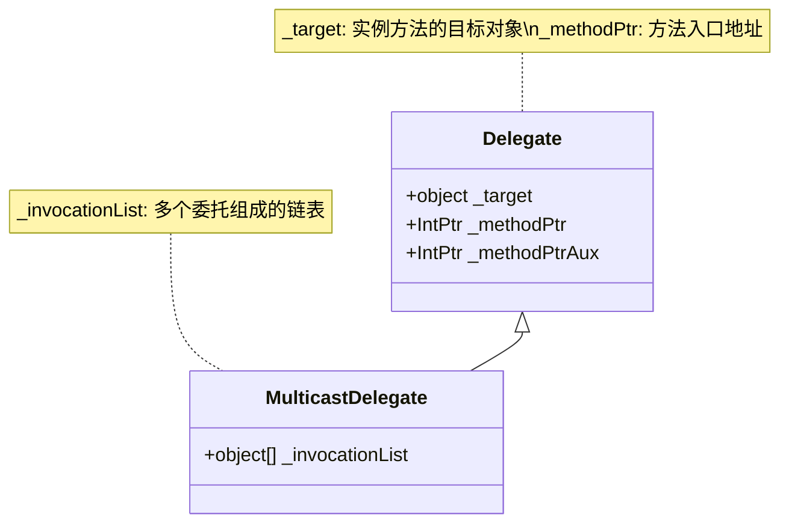
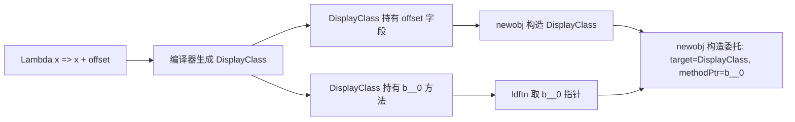
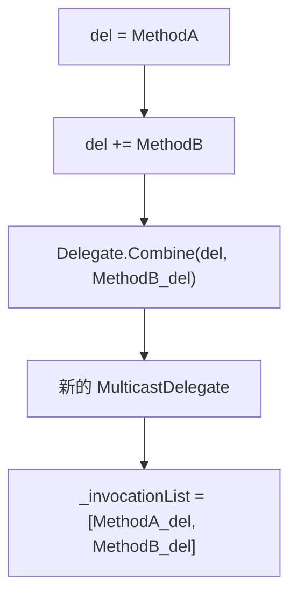

# 委托 IL 结构

> 委托在 IL 层是「对象 + 函数指针」对。理解 ldftn/ldvirtftn 如何取出方法指针、newobj 如何构造委托实例，是掌握事件、回调和 .NET 5+ 函数指针的基石。

## 一、委托的本质

在 C# 中，委托看起来像类型安全的函数签名，但 IL 层面它是一个持有两个字段的对象：



| 字段 | 含义 |
|------|------|
| `_target` | 实例方法的目标对象（静态方法为 null） |
| `_methodPtr` | 方法入口的本地指针（native int） |
| `_invocationList` | 多播委托链（仅 MulticastDelegate） |

::: tip 核心认知
委托 = **目标对象** + **方法指针**。C# 编译器通过 `ldftn`/`ldvirtftn` 取指针，再 `newobj` 构造委托实例，这条管线是固定的。
:::

## 二、ldftn 与 ldvirtftn

### 2.1 ldftn —— 取静态/非虚方法指针

`ldftn` 将方法的**本地代码入口地址**（native int）压入求值栈：

```csharp
// C#
static void StaticMethod() { }
var del = new Action(StaticMethod);
```

```il
// IL
ldftn        void Program::StaticMethod()
newobj       instance void [System.Runtime]System.Action::.ctor(object, nativeint)
```

**执行流程**：
1. `ldftn` → 将 `StaticMethod` 的入口地址压栈
2. `newobj Action(object, nativeint)` → 构造委托，第一个参数为 null（静态方法无目标），第二个参数为方法指针

### 2.2 ldvirtftn —— 取虚方法指针

`ldvirtftn` 需要先压入目标对象，运行时根据对象的实际类型做虚方法分派后，将最终入口地址压栈：

```csharp
// C#
class Foo {
    public virtual void Bar() { }
}
var foo = new Foo();
var del = new Action(foo.Bar);
```

```il
// IL
ldloc.0               // 加载 foo 实例
ldvirtftn     instance void Foo::Bar()
newobj        instance void [System.Runtime]System.Action::.ctor(object, nativeint)
```

::: warning ldftn vs ldvirtftn
- `ldftn`：不查虚表，直接取声明方法的入口（静态方法、非虚方法）
- `ldvirtftn`：查虚表，取实际实现的入口（虚方法、重写方法）
- **两者取到的都是 native int，指向 JIT 编译后的本地代码**，而非元数据 token
:::

## 三、委托创建的三种模式

### 3.1 静态方法委托

```csharp
// C#
static int Add(int a, int b) => a + b;
var del = new Func<int, int, int>(Add);
```

```il
// IL
ldnull                        // 静态方法：_target = null
ldftn       int32 Program::Add(int32, int32)
newobj      instance void [System.Runtime]System.Func`3<int32, int32, int32>::.ctor(object, nativeint)
stloc.0
```

### 3.2 实例方法委托

```csharp
// C#
class Calculator {
    public int Add(int a, int b) => a + b;
}
var calc = new Calculator();
var del = new Func<int, int, int>(calc.Add);
```

```il
// IL
ldloc.0                              // 加载 calc 实例
ldvirtftn    instance int32 Calculator::Add(int32, int32)
newobj       instance void [System.Runtime]System.Func`3<int32, int32, int32>::.ctor(object, nativeint)
```

**关键区别**：实例方法时，`ldloc` 先把对象压栈作为 `newobj` 的第一个参数（_target），`ldvirtftn` 取出方法指针作为第二个参数。

### 3.3 Lambda 与闭包

```csharp
// C#
int offset = 10;
Func<int, int> del = x => x + offset;
```

编译器生成**显示类（Display Class）**来捕获变量：

```csharp
// 编译器生成的类（近似）
private sealed class <>c__DisplayClass0_0 {
    public int offset;
    internal int <Main>b__0(int x) => x + this.offset;
}
```

```il
// IL
newobj       instance void Program/'<>c__DisplayClass0_0'::.ctor()
stloc.1                              // 存储 display class 实例
ldloc.1
ldc.i4.s    10
stfld       int32 Program/'<>c__DisplayClass0_0'::offset   // 捕获变量
ldloc.1
ldftn       instance int32 Program/'<>c__DisplayClass0_0'::'<Main>b__0'(int32)
newobj      instance void [System.Runtime]System.Func`2<int32, int32>::.ctor(object, nativeint)
```



::: important 闭包的代价
每个 Lambda 闭包都会生成一个 Display Class，导致：
1. 额外的堆分配（Display Class 实例）
2. 额外的间接访问（通过 `_target` 访问捕获变量）
3. 如果捕获了局部变量，该变量生命周期被延长
:::

### 3.4 三种模式对比

| 模式 | _target | 方法指针获取 | 额外分配 |
|------|---------|-------------|---------|
| 静态方法 | null | ldftn | 仅委托实例 |
| 实例方法 | 目标对象 | ldvirtftn | 仅委托实例 |
| Lambda 闭包 | DisplayClass 实例 | ldftn | 委托 + DisplayClass |

## 四、多播委托：+= 与 -=

C# 的 `+=` 和 `-=` 实际调用 `Delegate.Combine` 和 `Delegate.Remove`：

```csharp
// C#
Action del = MethodA;
del += MethodB;       // Delegate.Combine
del -= MethodA;       // Delegate.Remove
```

```il
// IL —— del += MethodB
ldloc.0
ldftn       void Program::MethodB()
newobj      instance void [System.Runtime]System.Action::.ctor(object, nativeint)
call        class [System.Runtime]System.Delegate [System.Runtime]System.Delegate::Combine(class [System.Runtime]System.Delegate, class [System.Runtime]System.Delegate)
castclass   class [System.Runtime]System.Action
stloc.0
```



::: warning 多播委托的返回值
`MulticastDelegate` 按顺序调用链上的每个委托，但只返回**最后一个**委托的返回值。如果需要收集所有返回值，需使用 `GetInvocationList()` 手动遍历。
:::

## 五、事件的 IL 结构

事件在 IL 中由三个部分组成：

1. **Event 元数据**：名称、类型、关联方法
2. **add_XXX 方法**：调用 `Delegate.Combine`
3. **remove_XXX 方法**：调用 `Delegate.Remove`

```csharp
// C#
public event EventHandler<string> OnMessage;
```

```il
// IL —— 编译器生成的 add/remove 方法
.method public hidebysig specialname instance void add_OnMessage(
    class [System.Runtime]System.EventHandler`1<string> value) cil managed
{
    ldarg.0                                          // this
    ldarg.1                                          // value
    call class [System.Runtime]System.Delegate
         [System.Runtime]System.Delegate::Combine(
             class [System.Runtime]System.Delegate,
             class [System.Runtime]System.Delegate)
    castclass class [System.Runtime]System.EventHandler`1<string>
    stfld class [System.Runtime]System.EventHandler`1<string> Program::OnMessage
    ret
}

.method public hidebysig specialname instance void remove_OnMessage(
    class [System.Runtime]System.EventHandler`1<string> value) cil managed
{
    ldarg.0
    ldarg.1
    call class [System.Runtime]System.Delegate
         [System.Runtime]System.Delegate::Remove(
             class [System.Runtime]System.Delegate,
             class [System.Runtime]System.Delegate)
    castclass class [System.Runtime]System.EventHandler`1<string>
    stfld class [System.Runtime]System.EventHandler`1<string> Program::OnMessage
    ret
}
```

::: tip 线程安全的事件
C# 编译器默认生成的 `add_`/`remove_` 使用 `Interlocked.CompareExchange` 保证线程安全。字段声明 `public event EventHandler<string> OnMessage;` 背后是完整的线程安全实现。
:::

## 六、C# 函数指针（delegate*）

.NET 5+ 引入了 `delegate*` —— 不分配委托对象的函数指针，直接通过 `calli` 指令调用：

```csharp
// C#
unsafe static int Add(int a, int b) => a + b;

delegate*<int, int, int> fp = &Add;
int result = fp(1, 2);   // calli，无委托分配
```

```il
// IL
ldftn       int32 Program::Add(int32, int32)
stloc.0                     // 存储为 native int
ldloc.0
ldc.i4.1
ldc.i4.2
calli       int32(native int, int32, int32)   // 间接调用，无委托分配
```

### 委托 vs delegate* 对比

| 特性 | delegate | delegate* |
|------|----------|-----------|
| 分配 | 堆对象（含 _target + _methodPtr） | 仅 native int 栈值 |
| 调用指令 | callvirt Invoke() | calli |
| 类型安全 | 编译期检查签名 | 编译期检查签名 |
| 可存储 | 任意位置 | 需要 unsafe 上下文 |
| 实例方法 | 自动绑定 _target | 需手动传递目标 |
| GC | 可追踪 | 不可追踪 |

::: important calli 的性能优势
`calli` 跳过了委托的 `Invoke` 方法，直接通过函数指针调用，省去了：
1. 委托对象的堆分配
2. `callvirt` 的虚方法分派
3. `_target` 的间接访问

在高频调用场景下（如 ECS 框架的消息分发），`delegate*` + `calli` 可以带来显著性能提升。
:::

## 七、完整示例：三种委托创建模式

```csharp
using System;

class Program
{
    static void StaticMethod() => Console.WriteLine("Static");

    void InstanceMethod() => Console.WriteLine("Instance");

    static void Main()
    {
        // 模式1：静态方法
        Action a1 = StaticMethod;

        // 模式2：实例方法
        var p = new Program();
        Action a2 = p.InstanceMethod;

        // 模式3：Lambda 闭包
        string msg = "Lambda";
        Action a3 = () => Console.WriteLine(msg);
    }
}
```

```il
// ===== 模式1：静态方法 =====
ldnull
ldftn       void Program::StaticMethod()
newobj      instance void [System.Runtime]System.Action::.ctor(object, nativeint)

// ===== 模式2：实例方法 =====
ldloc.0                     // p 实例
ldvirtftn   instance void Program::InstanceMethod()
newobj      instance void [System.Runtime]System.Action::.ctor(object, nativeint)

// ===== 模式3：Lambda 闭包 =====
newobj       instance void Program/'<>c__DisplayClass0_0'::.ctor()
stloc.2
ldloc.2
ldstr        "Lambda"
stfld        string Program/'<>c__DisplayClass0_0'::msg
ldloc.2
ldftn        instance void Program/'<>c__DisplayClass0_0'::<Main>b__0()
newobj       instance void [System.Runtime]System.Action::.ctor(object, nativeint)
```

## 参考资料

| 资料 | 说明 |
|------|------|
| [OpCodes.Ldftn](https://learn.microsoft.com/en-us/dotnet/api/system.reflection.emit.opcodes.ldftn) | ldftn 指令官方文档 |
| [OpCodes.Ldvirtftn](https://learn.microsoft.com/en-us/dotnet/api/system.reflection.emit.opcodes.ldvirtftn) | ldvirtftn 指令官方文档 |
| [OpCodes.Newobj](https://learn.microsoft.com/en-us/dotnet/api/system.reflection.emit.opcodes.newobj) | newobj 指令官方文档 |
| [OpCodes.Calli](https://learn.microsoft.com/en-us/dotnet/api/system.reflection.emit.opcodes.calli) | calli 间接调用指令 |
| [Delegate 类](https://learn.microsoft.com/en-us/dotnet/api/system.delegate) | 委托基类文档 |
| [MulticastDelegate 类](https://learn.microsoft.com/en-us/dotnet/api/system.multicastdelegate) | 多播委托文档 |
| [Function pointers](https://learn.microsoft.com/en-us/dotnet/csharp/language-reference/unsafe-code#function-pointers) | C# delegate* 官方文档 |

## 面试要点

1. **委托的 IL 本质是什么？** 委托是 `object + native int` 对：_target 指向目标对象（静态方法为 null），_methodPtr 指向方法的本地代码入口。

2. **ldftn 和 ldvirtftn 的区别？** `ldftn` 直接取声明方法的入口地址，不查虚表；`ldvirtftn` 先根据对象实际类型查虚表，取最终实现的入口地址。

3. **Lambda 闭包为什么有额外分配？** 编译器为每个闭包生成 DisplayClass，捕获的变量作为 DisplayClass 的字段，Lambda 方法作为 DisplayClass 的实例方法。这导致一次额外的堆分配。

4. **多播委托的 += 在 IL 层如何实现？** 通过 `Delegate.Combine` 静态方法合并两个委托，返回新的 MulticastDelegate，其 `_invocationList` 包含所有委托。

5. **delegate* 相比 delegate 有什么性能优势？** `delegate*` 是 native int 栈值，不需要堆分配委托对象，调用使用 `calli` 而非 `callvirt Invoke()`，省去间接分派和对象分配。

6. **事件的 add/remove 方法做了什么？** `add_` 调用 `Delegate.Combine` 将新委托追加到调用链，`remove_` 调用 `Delegate.Remove` 从调用链移除委托。两者默认使用 `Interlocked.CompareExchange` 保证线程安全。
