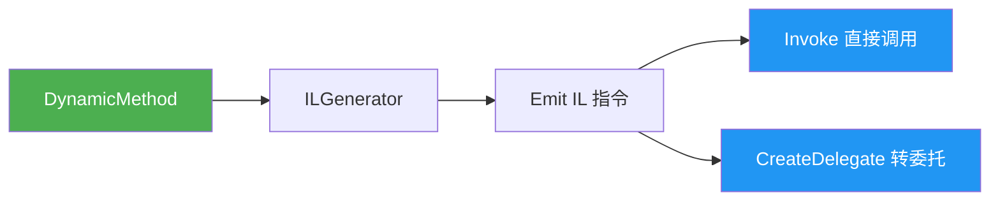
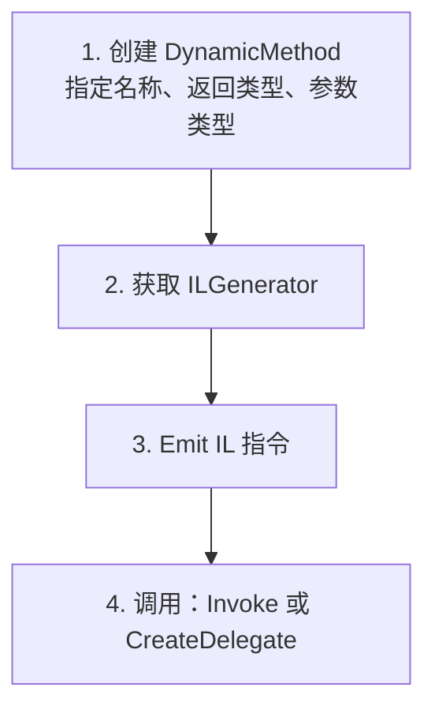
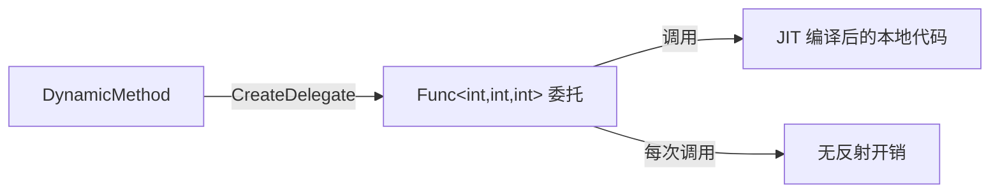

# DynamicMethod

> DynamicMethod 是 .NET 轻量级动态代码生成方案：无需定义完整的程序集和类型，直接在运行时创建方法体并执行。理解它是掌握 System.Reflection.Emit 的第一步。

## 一、什么是 DynamicMethod

`DynamicMethod` 允许你在运行时通过 Emit IL 指令创建方法，无需构建完整的 Assembly → Module → Type 层级。



| 特性 | DynamicMethod | 完整 DynamicAssembly |
|------|-------------|---------------------|
| 最小创建单元 | 单个方法 | 完整类型 |
| 是否可保存 | 否 | 是（RunAndSave） |
| GC 回收 | 方法不再使用后可回收 | Assembly 不可卸载（.NET 9 前） |
| 可见性跳过 | 支持 skipVisibility | 需单独处理 |
| 调试支持 | 无 | 可生成 PDB |

::: tip 何时选择 DynamicMethod
- 只需要动态创建一个方法 → **DynamicMethod**
- 需要动态创建完整类型（含字段、属性、多个方法）→ **DynamicAssembly**
- 需要持久化到磁盘 → **DynamicAssembly**
:::

## 二、基本用法

### 2.1 创建动态方法的四步流程



### 2.2 示例：动态创建加法方法

```csharp
using System;
using System.Reflection;
using System.Reflection.Emit;

// 第1步：创建 DynamicMethod
var method = new DynamicMethod(
    "Add",                          // 方法名
    typeof(int),                    // 返回类型
    new[] { typeof(int), typeof(int) }, // 参数类型
    restrictedSkipVisibility: true  // 跳过可见性检查
);

// 第2步：获取 ILGenerator
ILGenerator il = method.GetILGenerator();

// 第3步：Emit IL 指令
il.Emit(OpCodes.Ldarg_0);       // 加载第一个参数
il.Emit(OpCodes.Ldarg_1);       // 加载第二个参数
il.Emit(OpCodes.Add);           // 相加
il.Emit(OpCodes.Ret);           // 返回结果

// 第4步：调用
int result = (int)method.Invoke(null, new object[] { 3, 5 });
Console.WriteLine(result);  // 输出：8
```

对应的 IL：

```il
.method public static int32 Add(int32, int32) cil managed
{
    ldarg.0
    ldarg.1
    add
    ret
}
```

### 2.3 示例：调用 Console.WriteLine

```csharp
var method = new DynamicMethod(
    "SayHello",
    typeof(void),
    Type.EmptyTypes
);

ILGenerator il = method.GetILGenerator();
il.Emit(OpCodes.Ldstr, "Hello from DynamicMethod!");
il.Emit(OpCodes.Call, typeof(Console).GetMethod("WriteLine", new[] { typeof(string) })!);
il.Emit(OpCodes.Ret);

method.Invoke(null, null);  // 输出：Hello from DynamicMethod!
```

::: warning 方法引用的获取
`Emit(OpCodes.Call, ...)` 的第二个参数需要 `MethodInfo`、`ConstructorInfo` 或 `FieldInfo`。务必确保反射获取的方法信息不为 null，否则运行时抛 `ArgumentNullException`。
:::

## 三、通过 CreateDelegate 调用

`Invoke` 使用反射调用，每次都有开销。`CreateDelegate` 生成强类型委托，后续调用零反射开销：

```csharp
// 创建加法方法（同上）
var method = new DynamicMethod("Add", typeof(int), new[] { typeof(int), typeof(int) });
ILGenerator il = method.GetILGenerator();
il.Emit(OpCodes.Ldarg_0);
il.Emit(OpCodes.Ldarg_1);
il.Emit(OpCodes.Add);
il.Emit(OpCodes.Ret);

// 创建委托
var addFunc = (Func<int, int, int>)method.CreateDelegate(typeof(Func<int, int, int>));

// 后续调用零反射开销
Console.WriteLine(addFunc(3, 5));   // 8
Console.WriteLine(addFunc(10, 20)); // 30
```



::: important CreateDelegate vs Invoke
- `Invoke`：每次调用都经过反射，有参数装箱/拆箱开销
- `CreateDelegate`：仅创建时有反射开销，后续调用与普通委托一样快

**高频调用场景务必使用 CreateDelegate。**
:::

## 四、匿名宿主与可见性跳过

### 4.1 skipVisibility 参数

DynamicMethod 关联到一个**宿主类型**，决定其可以访问哪些成员：

```csharp
// 构造函数签名之一
public DynamicMethod(string name, Type returnType, Type[] parameterTypes,
    Type restrictedSkipVisibility);  // 宿主类型

public DynamicMethod(string name, Type returnType, Type[] parameterTypes,
    bool restrictedSkipVisibility);   // 是否跳过可见性
```

| 参数 | 行为 |
|------|------|
| `restrictedSkipVisibility: false` | 只能访问公开成员 |
| `restrictedSkipVisibility: true` | 可访问非公开成员（private/protected） |
| 指定宿主类型 | 以该类型的权限访问成员 |

### 4.2 访问私有成员示例

```csharp
class SecretHolder
{
    private int _secret = 42;
}

var method = new DynamicMethod(
    "GetSecret",
    typeof(int),
    new[] { typeof(SecretHolder) },
    typeof(SecretHolder)   // 宿主类型：以 SecretHolder 的权限访问
);

ILGenerator il = method.GetILGenerator();
il.Emit(OpCodes.Ldarg_0);
il.Emit(OpCodes.Ldfld, typeof(SecretHolder).GetField("_secret",
    BindingFlags.Instance | BindingFlags.NonPublic)!);
il.Emit(OpCodes.Ret);

var getter = (Func<SecretHolder, int>)method.CreateDelegate(
    typeof(Func<SecretHolder, int>));

var holder = new SecretHolder();
Console.WriteLine(getter(holder));  // 输出：42
```

::: warning 安全注意
`restrictedSkipVisibility: true` 或指定宿主类型会绕过访问修饰符检查。这可能在部分信任环境中引发安全问题。在完全信任代码中使用即可。
:::

## 五、性能对比

```mermaid
graph LR
    A[直接调用] -->|基线| B[~0ns]
    C[委托调用] -->|1次间接| D[~2ns]
    E[DynamicMethod + CreateDelegate] -->|等同委托| F[~2ns]
    G[DynamicMethod + Invoke] -->|反射开销| H[~80ns]
    I[MethodInfo.Invoke] -->|完整反射| J[~120ns]
    K[Expression.Compile] -->|编译开销大] L[运行时~2ns]

    style A fill:#4CAF50,color:#fff
    style C fill:#4CAF50,color:#fff
    style E fill:#4CAF50,color:#fff
```

| 方式 | 首次开销 | 每次调用开销 | 灵活性 |
|------|---------|------------|--------|
| 直接调用 | 无 | 最低 | 无 |
| DynamicMethod + CreateDelegate | 中 | 低 | 高 |
| DynamicMethod + Invoke | 低 | 高（反射） | 高 |
| MethodInfo.Invoke | 低 | 高（反射） | 中 |
| Expression.Compile | 高（编译） | 低 | 中 |

::: tip 性能建议
1. **一次性调用**：用 `Invoke`（省去创建委托的开销）
2. **高频调用**：用 `CreateDelegate`（后续调用无反射开销）
3. **极简场景**：DynamicMethod 比 Expression.Compile 更轻量
:::

## 六、局限性

| 局限 | 说明 |
|------|------|
| 无调试支持 | 无法在 DynamicMethod 中设断点或查看局部变量 |
| 无泛型方法 | DynamicMethod 本身不能是泛型方法 |
| 无持久化 | 不能保存到磁盘 |
| 无类型上下文 | 不属于任何类型，不能访问 this |
| 异常处理受限 | 可以 emit try/catch，但调试困难 |

## 七、完整示例：动态字符串格式化器

```csharp
using System;
using System.Reflection;
using System.Reflection.Emit;

// 目标：动态生成方法，将 Person 对象格式化为字符串
// 等效 C#：(Person p) => $"{p.Name} is {p.Age} years old"

class Person
{
    public string Name { get; set; } = "";
    public int Age { get; set; }
}

static class DynamicFormatter
{
    public static Func<Person, string> CreateFormatter()
    {
        var method = new DynamicMethod(
            "FormatPerson",
            typeof(string),
            new[] { typeof(Person) },
            restrictedSkipVisibility: true
        );

        ILGenerator il = method.GetILGenerator();

        // 等效于：string.Concat(p.Name, " is ", p.Age.ToString(), " years old")
        // 简化：string.Format("{0} is {1} years old", p.Name, p.Age)

        il.Emit(OpCodes.Ldstr, "{0} is {1} years old");
        il.Emit(OpCodes.Ldarg_0);
        il.Emit(OpCodes.Callvirt, typeof(Person).GetProperty("Name")!.GetGetMethod()!);
        il.Emit(OpCodes.Ldarg_0);
        il.Emit(OpCodes.Callvirt, typeof(Person).GetProperty("Age")!.GetGetMethod()!);
        il.Emit(OpCodes.Box, typeof(int));   // Age 是值类型，需要装箱
        il.Emit(OpCodes.Call, typeof(string).GetMethod("Format",
            new[] { typeof(string), typeof(object), typeof(object) })!);
        il.Emit(OpCodes.Ret);

        return (Func<Person, string>)method.CreateDelegate(
            typeof(Func<Person, string>));
    }
}

// 使用
var formatter = DynamicFormatter.CreateFormatter();
var person = new Person { Name = "Alice", Age = 30 };
Console.WriteLine(formatter(person));  // Alice is 30 years old
```

## 参考资料

| 资料 | 说明 |
|------|------|
| [DynamicMethod 类](https://learn.microsoft.com/en-us/dotnet/api/system.reflection.emit.dynamicmethod) | 官方 API 文档 |
| [OpCodes 枚举](https://learn.microsoft.com/en-us/dotnet/api/system.reflection.emit.opcodes) | IL 指令集文档 |
| [ILGenerator 类](https://learn.microsoft.com/en-us/dotnet/api/system.reflection.emit.ilgenerator) | IL 生成器文档 |
| [ECMA-335 Partition III](https://ecma-international.org/publications-and-standards/standards/ecma-335/) | CIL 指令集规范 |

## 面试要点

1. **DynamicMethod 和 MethodInfo.Invoke 有什么区别？** DynamicMethod 可以在运行时生成全新的方法体，而 MethodInfo.Invoke 只能调用已存在的方法。性能上，DynamicMethod + CreateDelegate 调用无反射开销。

2. **什么时候用 DynamicMethod 而不是 Expression.Compile？** DynamicMethod 更底层、更轻量，适合需要精细控制 IL 的场景（如调用 ldarg、精确控制装箱等）。Expression.Compile 更高层、更安全，适合简单的表达式编译。

3. **skipVisibility 的作用？** 允许 DynamicMethod 访问非公开成员（private/protected）。实现原理是将 DynamicMethod 关联到一个有访问权限的宿主类型，JIT 在编译时跳过可见性检查。

4. **DynamicMethod 能否保存到磁盘？** 不能。DynamicMethod 是轻量级的，不生成持久化的程序集。如果需要保存，应使用 AssemblyBuilder。

5. **DynamicMethod 的 GC 回收机制？** DynamicMethod 不属于任何 Assembly，当其委托引用不再被持有时，方法体可以被 GC 回收（不同于 DynamicAssembly 的不可卸载限制）。
