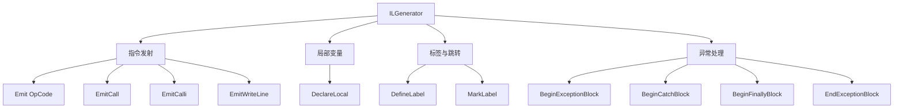

# ILGenerator 详解

> ILGenerator 是动态发射 IL 的核心 API。从 Emit 的各种重载，到标签控制流、异常处理块，掌握 ILGenerator 就是掌握用代码写代码的能力。

## 一、ILGenerator 概览

`ILGenerator` 提供了一组方法，让你在运行时逐条发出 IL 指令：



## 二、Emit 方法重载

### 2.1 常用重载一览

| 重载 | 用途 | 示例 |
|------|------|------|
| `Emit(OpCode)` | 无操作数指令 | `Emit(OpCodes.Ret)` |
| `Emit(OpCode, int)` | 整数操作数 | `Emit(OpCodes.Ldc_I4, 42)` |
| `Emit(OpCode, string)` | 字符串操作数 | `Emit(OpCodes.Ldstr, "hello")` |
| `Emit(OpCode, Type)` | 类型操作数 | `Emit(OpCodes.Newobj, ctor)` |
| `Emit(OpCode, MethodInfo)` | 方法操作数 | `Emit(OpCodes.Call, methodInfo)` |
| `Emit(OpCode, FieldInfo)` | 字段操作数 | `Emit(OpCodes.Ldfld, fieldInfo)` |
| `Emit(OpCode, LocalBuilder)` | 局部变量操作数 | `Emit(OpCodes.Ldloc, local)` |
| `Emit(OpCode, Label)` | 跳转目标 | `Emit(OpCodes.Br, label)` |
| `Emit(OpCode, SignatureHelper)` | 调用签名 | 用于 calli |
| `Emit(OpCode, ConstructorInfo)` | 构造器操作数 | `Emit(OpCodes.Newobj, ctor)` |

### 2.2 使用示例

```csharp
ILGenerator il = method.GetILGenerator();

// 无操作数
il.Emit(OpCodes.Ret);

// 整数操作数
il.Emit(OpCodes.Ldc_I4, 42);         // ldc.i4 42
il.Emit(OpCodes.Ldc_I4_S, (short)10); // ldc.i4.s 10（短格式）

// 字符串操作数
il.Emit(OpCodes.Ldstr, "Hello");      // ldstr "Hello"

// 类型操作数
il.Emit(OpCodes.Box, typeof(int));    // box [mscorlib]System.Int32
il.Emit(OpCodes.Castclass, typeof(string)); // castclass [mscorlib]System.String

// 方法操作数
il.Emit(OpCodes.Call, typeof(Console).GetMethod("WriteLine", new[] { typeof(string) })!);
```

::: tip ldc.i4 vs ldc.i4.s
- `ldc.i4`：4 字节操作数，可表示 -2^31 到 2^31-1
- `ldc.i4.s`：1 字节有符号操作数，可表示 -128 到 127，更紧凑
- `ldc.i4.0` 到 `ldc.i4.8`、`ldc.i4.m1`：零操作数短格式，只占 1 字节

Emit 时传入 `int` 自动选择 `ldc.i4`，传入 `short` 会使用 `ldc.i4.s`。
:::

## 三、EmitCall 与 EmitCalli

### 3.1 EmitCall —— 可变参数方法调用

`EmitCall` 用于调用可变参数（varargs）方法：

```csharp
// 调用 Console.WriteLine 的 varargs 版本
// public static void WriteLine(string format, object arg0, object arg1)
MethodInfo writeLine = typeof(Console).GetMethod("WriteLine",
    new[] { typeof(string), typeof(object), typeof(object) })!;

il.Emit(OpCodes.Ldstr, "{0} + {1}");
il.Emit(OpCodes.Ldstr, "A");
il.Emit(OpCodes.Ldstr, "B");
il.EmitCall(OpCodes.Call, writeLine, null);  // 非可变参数时第三个参数传 null
```

### 3.2 EmitCalli —— 间接函数调用

`EmitCalli` 发出 `calli` 指令，通过函数指针间接调用：

```csharp
// calli unmanaged stdcall int32(int32, int32)
il.Emit(OpCodes.Ldftn, typeof(Program).GetMethod("Add", BindingFlags.Static | BindingFlags.NonPublic)!);
il.EmitCalli(OpCodes.Calli, CallingConvention.StdCall, typeof(int), new[] { typeof(int), typeof(int) });
```

::: warning EmitCall vs Emit(Call)
- 普通方法调用用 `Emit(OpCodes.Call, methodInfo)` 或 `Emit(OpCodes.Callvirt, methodInfo)`
- **varargs 方法**必须用 `EmitCall`
- **函数指针调用**用 `EmitCalli`
- 不要混淆三种调用方式
:::

## 四、DeclareLocal —— 局部变量

```csharp
// 声明局部变量
LocalBuilder localInt = il.DeclareLocal(typeof(int));        // int
LocalBuilder localStr = il.DeclareLocal(typeof(string));     // string
LocalBuilder localObj = il.DeclareLocal(typeof(object));     // object

// 使用局部变量
il.Emit(OpCodes.Ldc_I4, 42);
il.Emit(OpCodes.Stloc, localInt);    // 存储
il.Emit(OpCodes.Ldloc, localInt);    // 加载
```

`DeclareLocal` 有一个可选参数 `pinned`：

```csharp
// 固定局部变量（阻止 GC 移动）
LocalBuilder pinnedBuf = il.DeclareLocal(typeof(byte[]), pinned: true);
```

::: important pinned 局部变量
`pinned: true` 声明的局部变量在 GC 中被固定，不会被移动。这在与非托管代码互操作时使用（类似 C# 的 `fixed` 语句）。使用完毕后必须将 `null` 存入该变量以解除固定。
:::

## 五、DefineLabel / MarkLabel —— 控制流标签

标签是 IL 跳转的目标。**先定义标签，后标记位置**：

```csharp
Label loopStart = il.DefineLabel();
Label loopEnd = il.DefineLabel();

// 跳转到标签
il.Emit(OpCodes.Br, loopStart);

// 标记标签位置
il.MarkLabel(loopStart);
```

::: warning 标签使用规则
1. 必须先用 `DefineLabel()` 创建标签
2. 可以在 `MarkLabel` 之前使用 `Emit(Br, label)` 引用标签（前向引用）
3. 每个 Label 必须且只能 `MarkLabel` 一次
4. 未标记的标签会导致 `InvalidOperationException`
:::

## 六、异常处理

### 6.1 异常处理 API

| 方法 | 作用 |
|------|------|
| `BeginExceptionBlock()` | 开始 try 块，返回 Label（异常块结束位置） |
| `BeginCatchBlock(Type)` | 开始 catch 块，指定捕获的异常类型 |
| `BeginFinallyBlock()` | 开始 finally 块 |
| `BeginFaultBlock()` | 开始 fault 块（异常时执行，不捕获） |
| `EndExceptionBlock()` | 结束异常处理块 |

### 6.2 try/catch 示例

```csharp
Label endExBlock = il.BeginExceptionBlock();

// try 块
il.Emit(OpCodes.Ldstr, "Trying...");
il.Emit(OpCodes.Call, typeof(Console).GetMethod("WriteLine", new[] { typeof(string) })!);
il.Emit(OpCodes.Ldstr, "danger");
il.Emit(OpCodes.Throw);   // 主动抛出

// catch 块
il.BeginCatchBlock(typeof(Exception));
il.Emit(OpCodes.Call, typeof(Console).GetMethod("WriteLine", new[] { typeof(string) })!);
il.Emit(OpCodes.Pop);     // 弹出 catch 栈上的异常对象

il.EndExceptionBlock();
```

等效 C#：

```csharp
try
{
    Console.WriteLine("Trying...");
    throw "danger";  // 简化示意
}
catch (Exception ex)
{
    Console.WriteLine(ex);  // 简化：实际 catch 栈上是 Exception 引用
}
```

### 6.3 try/finally 示例

```csharp
Label endExBlock = il.BeginExceptionBlock();

// try 块
il.Emit(OpCodes.Ldstr, "In try");
il.Emit(OpCodes.Call, typeof(Console).GetMethod("WriteLine", new[] { typeof(string) })!);

// finally 块
il.BeginFinallyBlock();
il.Emit(OpCodes.Ldstr, "In finally");
il.Emit(OpCodes.Call, typeof(Console).GetMethod("WriteLine", new[] { typeof(string) })!);

il.EndExceptionBlock();
```

## 七、BeginScope / EndScope

`BeginScope` 和 `EndScope` 为调试器定义词法作用域，用于局部变量的可见性范围：

```csharp
il.BeginScope();
LocalBuilder temp = il.DeclareLocal(typeof(int));
// ... 使用 temp ...
il.EndScope();
```

::: tip 何时使用 Scope
仅在需要为动态方法生成调试符号时使用。大多数 DynamicMethod 场景不需要，因为 DynamicMethod 不支持 PDB 生成。在 DynamicAssembly + TypeBuilder 场景中更有用。
:::

## 八、EmitWriteLine —— 便捷方法

`EmitWriteLine` 是一个便捷方法，等价于 `ldstr` + `Console.WriteLine`：

```csharp
il.EmitWriteLine("Hello!");  // 等价于：
// il.Emit(OpCodes.Ldstr, "Hello!");
// il.Emit(OpCodes.Call, typeof(Console).GetMethod("WriteLine", new[] { typeof(string) })!);
```

也支持输出局部变量：

```csharp
LocalBuilder num = il.DeclareLocal(typeof(int));
il.EmitWriteLine(num);  // 输出局部变量的值
```

## 九、UsingNamespace

`UsingNamespace` 声明在当前动态方法中使用的命名空间，影响局部变量的类型解析：

```csharp
il.UsingNamespace("System.Collections.Generic");
```

在 DynamicMethod 中较少使用，在 DynamicAssembly 的 TypeBuilder 中用于解析局部变量类型。

## 十、完整示例：for 循环 + try/catch

以下示例完全通过 ILGenerator 构建一个 for 循环（0 到 9），循环体内包含 try/catch：

```csharp
using System;
using System.Reflection;
using System.Reflection.Emit;

var method = new DynamicMethod(
    "LoopWithTryCatch",
    typeof(void),
    Type.EmptyTypes
);

ILGenerator il = method.GetILGenerator();

// 局部变量
LocalBuilder i = il.DeclareLocal(typeof(int));      // 循环变量
LocalBuilder ex = il.DeclareLocal(typeof(Exception)); // catch 中的异常

// 标签
Label loopStart = il.DefineLabel();
Label loopCondition = il.DefineLabel();
Label loopEnd = il.DefineLabel();

// i = 0
il.Emit(OpCodes.Ldc_I4_0);
il.Emit(OpCodes.Stloc, i);

// ---- 循环开始 ----
il.MarkLabel(loopStart);

// try 块
Label endExBlock = il.BeginExceptionBlock();

// Console.WriteLine(i)
il.Emit(OpCodes.Ldloc, i);
il.Emit(OpCodes.Box, typeof(int));
il.Emit(OpCodes.Call, typeof(Console).GetMethod("WriteLine", new[] { typeof(object) })!);

// i++
il.Emit(OpCodes.Ldloc, i);
il.Emit(OpCodes.Ldc_I4_1);
il.Emit(OpCodes.Add);
il.Emit(OpCodes.Stloc, i);

// 模拟可能的异常
il.Emit(OpCodes.Ldloc, i);
il.Emit(OpCodes.Ldc_I4, 5);
il.Emit(OpCodes.Bne_Un_S, loopCondition);  // i != 5 则跳转
il.Emit(OpCodes.Ldstr, "five!");
il.Emit(OpCodes.Newobj, typeof(Exception).GetConstructor(new[] { typeof(string) })!);
il.Emit(OpCodes.Throw);

// catch 块
il.BeginCatchBlock(typeof(Exception));
il.Emit(OpCodes.Stloc, ex);
il.Emit(OpCodes.Ldstr, "Caught: ");
il.Emit(OpCodes.Ldloc, ex);
il.Emit(OpCodes.Callvirt, typeof(Exception).GetProperty("Message")!.GetGetMethod()!);
il.Emit(OpCodes.Call, typeof(string).GetMethod("Concat", new[] { typeof(string), typeof(string) })!);
il.Emit(OpCodes.Call, typeof(Console).GetMethod("WriteLine", new[] { typeof(string) })!);

il.EndExceptionBlock();

// ---- 循环条件 ----
il.MarkLabel(loopCondition);
il.Emit(OpCodes.Ldloc, i);
il.Emit(OpCodes.Ldc_I4, 10);
il.Emit(OpCodes.Blt_S, loopStart);  // i < 10 → 继续

il.Emit(OpCodes.Ret);

var action = (Action)method.CreateDelegate(typeof(Action));
action();
```

等效 C#：

```csharp
for (int i = 0; i < 10; i++)
{
    try
    {
        Console.WriteLine(i);
        if (i == 5) throw new Exception("five!");
    }
    catch (Exception ex)
    {
        Console.WriteLine("Caught: " + ex.Message);
    }
}
```

输出：

```
0
1
2
3
4
Caught: five!
6
7
8
9
```

## 参考资料

| 资料 | 说明 |
|------|------|
| [ILGenerator 类](https://learn.microsoft.com/en-us/dotnet/api/system.reflection.emit.ilgenerator) | 官方 API 文档 |
| [ILGenerator.Emit](https://learn.microsoft.com/en-us/dotnet/api/system.reflection.emit.ilgenerator.emit) | Emit 方法重载文档 |
| [ILGenerator.EmitCall](https://learn.microsoft.com/en-us/dotnet/api/system.reflection.emit.ilgenerator.emitcall) | EmitCall 方法文档 |
| [ILGenerator.EmitCalli](https://learn.microsoft.com/en-us/dotnet/api/system.reflection.emit.ilgenerator.emitcalli) | EmitCalli 方法文档 |
| [LocalBuilder 类](https://learn.microsoft.com/en-us/dotnet/api/system.reflection.emit.localbuilder) | 局部变量构建器文档 |
| [OpCodes 枚举](https://learn.microsoft.com/en-us/dotnet/api/system.reflection.emit.opcodes) | IL 指令集完整参考 |

## 面试要点

1. **ILGenerator.Emit 有哪些常用重载？** 主要有无操作数（Ret）、整数操作数（Ldc_I4）、字符串操作数（Ldstr）、类型操作数（Box/Castclass）、方法操作数（Call/Callvirt）、字段操作数（Ldfld/Stfld）、标签操作数（Br）等。

2. **DefineLabel 和 MarkLabel 的关系？** `DefineLabel` 声明一个标签（可前向引用），`MarkLabel` 在 IL 流中标记该标签的实际位置。每个标签必须且只能标记一次。

3. **EmitCall 和 Emit(OpCodes.Call) 的区别？** `EmitCall` 专用于 varargs 方法和间接调用；普通方法调用用 `Emit(OpCodes.Call, methodInfo)` 即可。

4. **如何在 ILGenerator 中实现 try/catch？** `BeginExceptionBlock` 开始 try 块，`BeginCatchBlock(type)` 开始 catch 块，`EndExceptionBlock` 结束。catch 入口时异常对象已在栈顶。

5. **DeclareLocal 的 pinned 参数有什么用？** 声明固定的局部变量，阻止 GC 移动该引用指向的对象，用于与非托管代码互操作。使用完毕后需将 null 存入以解除固定。
