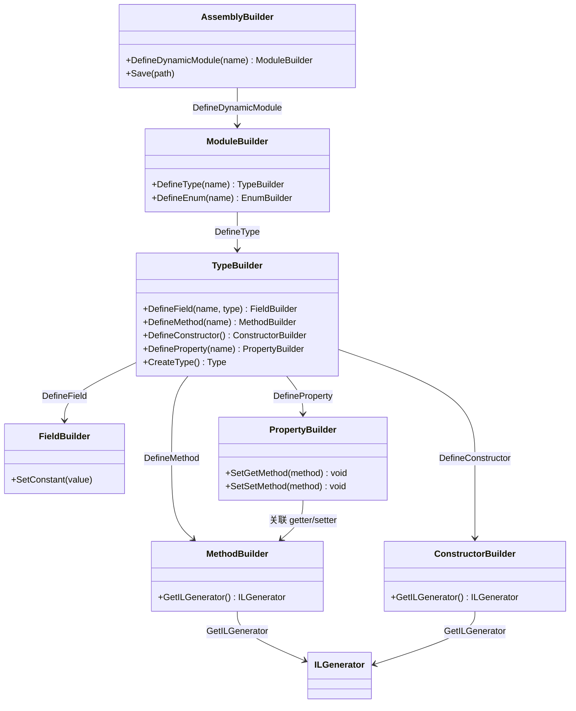
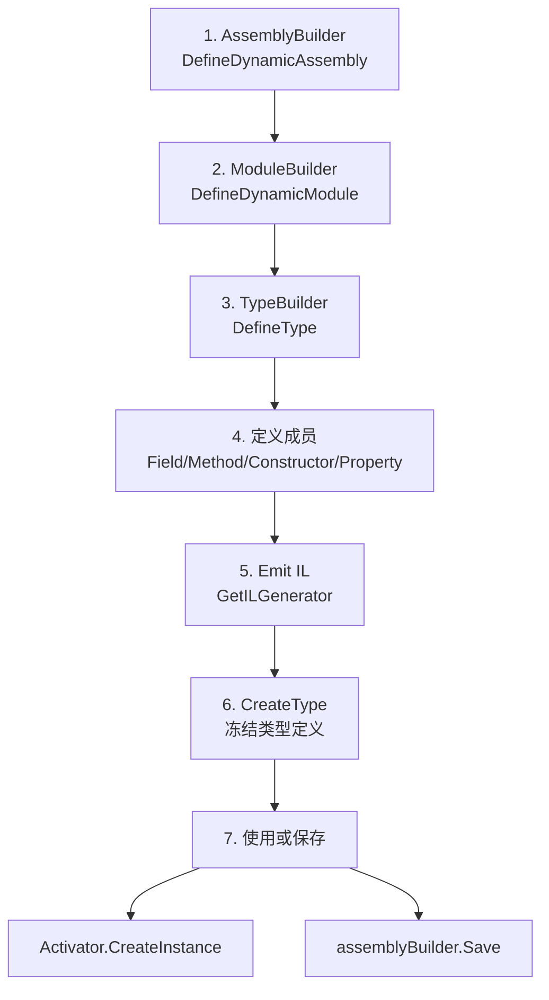

# DynamicAssembly

> DynamicAssembly 让你在运行时构建完整的程序集：从 AssemblyBuilder 到 ModuleBuilder、TypeBuilder，再到 MethodBuilder/FieldBuilder/PropertyBuilder——掌握这条 Builder 链条，就掌握了 .NET 元编程的完整能力。

## 一、Builder 层级结构

动态程序集的构建遵循严格的层级关系：



::: tip 构建顺序
必须自顶向下构建：Assembly → Module → Type → Members → IL → CreateType。`CreateType()` 之后，类型被冻结，不能再添加成员。
:::

## 二、完整构建流程



### 2.1 最简示例：动态类型

```csharp
using System;
using System.Reflection;
using System.Reflection.Emit;

// 第1步：创建程序集
AssemblyName asmName = new AssemblyName("MyDynamicAssembly");
AssemblyBuilder asmBuilder = AssemblyBuilder.DefineDynamicAssembly(asmName, AssemblyBuilderAccess.Run);

// 第2步：创建模块
ModuleBuilder modBuilder = asmBuilder.DefineDynamicModule("MyModule");

// 第3步：创建类型
TypeBuilder typeBuilder = modBuilder.DefineType("Greeter", TypeAttributes.Public | TypeAttributes.Class);

// 第4步：定义方法
MethodBuilder sayHello = typeBuilder.DefineMethod(
    "SayHello",
    MethodAttributes.Public,
    typeof(void),
    Type.EmptyTypes
);

// 第5步：Emit IL
ILGenerator il = sayHello.GetILGenerator();
il.Emit(OpCodes.Ldstr, "Hello from dynamic type!");
il.Emit(OpCodes.Call, typeof(Console).GetMethod("WriteLine", new[] { typeof(string) })!);
il.Emit(OpCodes.Ret);

// 第6步：创建类型
Type greeterType = typeBuilder.CreateType()!;

// 第7步：使用
object instance = Activator.CreateInstance(greeterType)!;
greeterType.GetMethod("SayHello")!.Invoke(instance, null);
// 输出：Hello from dynamic type!
```

## 三、构建字段与属性

### 3.1 定义字段

```csharp
// 定义私有字段
FieldBuilder nameField = typeBuilder.DefineField(
    "_name",
    typeof(string),
    FieldAttributes.Private
);
```

### 3.2 定义属性

属性在 IL 层是元数据 + 一对 get/set 方法：

```csharp
// 定义属性
PropertyBuilder nameProp = typeBuilder.DefineProperty(
    "Name",
    PropertyAttributes.None,
    typeof(string),
    Type.EmptyTypes
);

// 定义 get 方法
MethodBuilder getName = typeBuilder.DefineMethod(
    "get_Name",
    MethodAttributes.Public | MethodAttributes.SpecialName | MethodAttributes.HideBySig,
    typeof(string),
    Type.EmptyTypes
);
ILGenerator getIl = getName.GetILGenerator();
getIl.Emit(OpCodes.Ldarg_0);         // this
getIl.Emit(OpCodes.Ldfld, nameField);
getIl.Emit(OpCodes.Ret);

// 定义 set 方法
MethodBuilder setName = typeBuilder.DefineMethod(
    "set_Name",
    MethodAttributes.Public | MethodAttributes.SpecialName | MethodAttributes.HideBySig,
    typeof(void),
    new[] { typeof(string) }
);
ILGenerator setIl = setName.GetILGenerator();
setIl.Emit(OpCodes.Ldarg_0);         // this
setIl.Emit(OpCodes.Ldarg_1);          // value
setIl.Emit(OpCodes.Stfld, nameField);
setIl.Emit(OpCodes.Ret);

// 关联属性与方法
nameProp.SetGetMethod(getName);
nameProp.SetSetMethod(setName);
```

## 四、构建构造器

```csharp
ConstructorBuilder ctor = typeBuilder.DefineConstructor(
    MethodAttributes.Public | MethodAttributes.HideBySig | MethodAttributes.SpecialName,
    CallingConventions.Standard,
    new[] { typeof(string) }  // 参数：string name
);

ILGenerator ctorIl = ctor.GetILGenerator();
// base..ctor()
ctorIl.Emit(OpCodes.Ldarg_0);  // this
ctorIl.Emit(OpCodes.Call, typeof(object).GetConstructor(Type.EmptyTypes)!);
// this._name = name
ctorIl.Emit(OpCodes.Ldarg_0);  // this
ctorIl.Emit(OpCodes.Ldarg_1);  // name
ctorIl.Emit(OpCodes.Stfld, nameField);
ctorIl.Emit(OpCodes.Ret);
```

## 五、构建接口

```csharp
// 定义接口
TypeBuilder ifaceBuilder = modBuilder.DefineType(
    "IGreeter",
    TypeAttributes.Public | TypeAttributes.Interface | TypeAttributes.Abstract
);

// 接口方法（无方法体）
ifaceBuilder.DefineMethod(
    "Greet",
    MethodAttributes.Public | MethodAttributes.Abstract | MethodAttributes.Virtual,
    typeof(string),
    Type.EmptyTypes
);

Type ifaceType = ifaceBuilder.CreateType()!;
```

## 六、构建枚举

```csharp
EnumBuilder enumBuilder = modBuilder.DefineEnum(
    "Color",
    TypeAttributes.Public,
    typeof(int)
);

enumBuilder.DefineLiteral("Red", 0);
enumBuilder.DefineLiteral("Green", 1);
enumBuilder.DefineLiteral("Blue", 2);

Type colorType = enumBuilder.CreateType()!;
```

## 七、构建泛型类型

```csharp
TypeBuilder listBuilder = modBuilder.DefineType("MyList", TypeAttributes.Public);

// 定义泛型参数 T
GenericTypeParameterBuilder[] genericParams = listBuilder.DefineGenericParameters("T");

// 使用泛型参数 T 定义字段
// private T[] _items;
FieldBuilder itemsField = listBuilder.DefineField(
    "_items",
    genericParams[0].MakeArrayType(),  // T[]
    FieldAttributes.Private
);

// 定义方法：T GetItem(int index)
MethodBuilder getItem = listBuilder.DefineMethod(
    "GetItem",
    MethodAttributes.Public,
    genericParams[0],           // 返回类型：T
    new[] { typeof(int) }       // 参数：int index
);

ILGenerator getIl = getItem.GetILGenerator();
getIl.Emit(OpCodes.Ldarg_0);              // this
getIl.Emit(OpCodes.Ldfld, itemsField);    // _items
getIl.Emit(OpCodes.Ldarg_1);              // index
getIl.Emit(OpCodes.Ldelem_Ref);           // _items[index]
getIl.Emit(OpCodes.Ret);

Type listType = listBuilder.CreateType()!;
```

::: warning 泛型类型的 CreateType
调用 `CreateType()` 之前，必须确保所有泛型参数已被定义。`CreateType()` 之后，泛型类型定义被冻结，但可以通过 `MakeGenericType` 创建具体化的封闭类型。
:::

## 八、持久化程序集

### 8.1 .NET 9+ 的 AssemblyBuilder.Save

.NET 9 引入了可持久化的 `AssemblyBuilder`，通过 `PersistedAssemblyBuilder`：

```csharp
// .NET 9+
var asmName = new AssemblyName("SavedAssembly");
var asmBuilder = new PersistedAssemblyBuilder(asmName, typeof(object).Assembly);

ModuleBuilder mod = asmBuilder.DefineDynamicModule("MainModule");
// ... 定义类型、方法 ...

Type t = typeBuilder.CreateType()!;

// 保存到磁盘
using var stream = File.Create("SavedAssembly.dll");
asmBuilder.Save(stream);  // .NET 9+ API
```

### 8.2 .NET Framework 的 RunAndSave

```csharp
// .NET Framework only
var asmBuilder = AppDomain.CurrentDomain.DefineDynamicAssembly(
    new AssemblyName("SavedAssembly"),
    AssemblyBuilderAccess.RunAndSave,
    "C:\\Output"     // 输出目录
);

ModuleBuilder mod = asmBuilder.DefineDynamicModule("MainModule", "SavedAssembly.dll");
// ... 定义类型、方法 ...

typeBuilder.CreateType();
asmBuilder.Save("SavedAssembly.dll");  // 保存到磁盘
```

### 8.3 .NET Core 3.x - 8 的替代方案

.NET Core 3.x 到 .NET 8 期间，`AssemblyBuilder.Save` 不可用。替代方案：

| 方案 | 说明 |
|------|------|
| [Mono.Cecil](https://github.com/jbevain/cecil) | 直接操作 IL 并保存程序集 |
| [System.Reflection.Metadata](https://learn.microsoft.com/en-us/dotnet/api/system.reflection.metadata) | 低级元数据 API，手动构建 |
| [NLua](https://github.com/NLua/NLua) 等 | 通过脚本引擎生成 |

::: important 版本差异总结
- .NET Framework：`AssemblyBuilderAccess.RunAndSave` + `Save()` 可用
- .NET Core 3.x - 8：`Save()` 不可用，需第三方库
- .NET 9+：`PersistedAssemblyBuilder` + `Save(stream)` 可用
:::

## 九、完整示例：动态 DTO 类型

构建一个运行时动态的 DTO 类型，包含属性和构造器：

```csharp
using System;
using System.Reflection;
using System.Reflection.Emit;

// 目标：动态构建以下 C# 类的等价物
// public class PersonDto {
//     public string Name { get; set; }
//     public int Age { get; set; }
//     public PersonDto(string name, int age) { Name = name; Age = age; }
//     public override string ToString() => $"{Name} is {Age}";
// }

static Type BuildPersonDto(ModuleBuilder mod)
{
    TypeBuilder tb = mod.DefineType("PersonDto", TypeAttributes.Public | TypeAttributes.Class);

    // ---- 字段 ----
    FieldBuilder nameField = tb.DefineField("<Name>k__BackingField", typeof(string), FieldAttributes.Private);
    FieldBuilder ageField = tb.DefineField("<Age>k__BackingField", typeof(int), FieldAttributes.Private);

    // ---- Name 属性 ----
    PropertyBuilder nameProp = tb.DefineProperty("Name", PropertyAttributes.None, typeof(string), null);

    MethodBuilder getName = tb.DefineMethod("get_Name",
        MethodAttributes.Public | MethodAttributes.SpecialName | MethodAttributes.HideBySig,
        typeof(string), null);
    ILGenerator getIl = getName.GetILGenerator();
    getIl.Emit(OpCodes.Ldarg_0);
    getIl.Emit(OpCodes.Ldfld, nameField);
    getIl.Emit(OpCodes.Ret);

    MethodBuilder setName = tb.DefineMethod("set_Name",
        MethodAttributes.Public | MethodAttributes.SpecialName | MethodAttributes.HideBySig,
        typeof(void), new[] { typeof(string) });
    ILGenerator setIl = setName.GetILGenerator();
    setIl.Emit(OpCodes.Ldarg_0);
    setIl.Emit(OpCodes.Ldarg_1);
    setIl.Emit(OpCodes.Stfld, nameField);
    setIl.Emit(OpCodes.Ret);

    nameProp.SetGetMethod(getName);
    nameProp.SetSetMethod(setName);

    // ---- Age 属性 ----
    PropertyBuilder ageProp = tb.DefineProperty("Age", PropertyAttributes.None, typeof(int), null);

    MethodBuilder getAge = tb.DefineMethod("get_Age",
        MethodAttributes.Public | MethodAttributes.SpecialName | MethodAttributes.HideBySig,
        typeof(int), null);
    ILGenerator getAgeIl = getAge.GetILGenerator();
    getAgeIl.Emit(OpCodes.Ldarg_0);
    getAgeIl.Emit(OpCodes.Ldfld, ageField);
    getAgeIl.Emit(OpCodes.Ret);

    MethodBuilder setAge = tb.DefineMethod("set_Age",
        MethodAttributes.Public | MethodAttributes.SpecialName | MethodAttributes.HideBySig,
        typeof(void), new[] { typeof(int) });
    ILGenerator setAgeIl = setAge.GetILGenerator();
    setAgeIl.Emit(OpCodes.Ldarg_0);
    setAgeIl.Emit(OpCodes.Ldarg_1);
    setAgeIl.Emit(OpCodes.Stfld, ageField);
    setAgeIl.Emit(OpCodes.Ret);

    ageProp.SetGetMethod(getAge);
    ageProp.SetSetMethod(setAge);

    // ---- 构造器 ----
    ConstructorBuilder ctor = tb.DefineConstructor(
        MethodAttributes.Public | MethodAttributes.HideBySig | MethodAttributes.SpecialName,
        CallingConventions.Standard,
        new[] { typeof(string), typeof(int) });

    ILGenerator ctorIl = ctor.GetILGenerator();
    ctorIl.Emit(OpCodes.Ldarg_0);
    ctorIl.Emit(OpCodes.Call, typeof(object).GetConstructor(Type.EmptyTypes)!);
    ctorIl.Emit(OpCodes.Ldarg_0);
    ctorIl.Emit(OpCodes.Ldarg_1);
    ctorIl.Emit(OpCodes.Call, setName);     // this.Name = name
    ctorIl.Emit(OpCodes.Ldarg_0);
    ctorIl.Emit(OpCodes.Ldarg_2);
    ctorIl.Emit(OpCodes.Call, setAge);      // this.Age = age
    ctorIl.Emit(OpCodes.Ret);

    // ---- ToString ----
    MethodBuilder toString = tb.DefineMethod("ToString",
        MethodAttributes.Public | MethodAttributes.Virtual,
        typeof(string), Type.EmptyTypes);

    ILGenerator toStrIl = toString.GetILGenerator();
    // string.Format("{0} is {1}", Name, Age)
    toStrIl.Emit(OpCodes.Ldstr, "{0} is {1}");
    toStrIl.Emit(OpCodes.Ldarg_0);
    toStrIl.Emit(OpCodes.Call, getName);
    toStrIl.Emit(OpCodes.Ldarg_0);
    toStrIl.Emit(OpCodes.Call, getAge);
    toStrIl.Emit(OpCodes.Box, typeof(int));
    toStrIl.Emit(OpCodes.Call, typeof(string).GetMethod("Format",
        new[] { typeof(string), typeof(object), typeof(object) })!);
    toStrIl.Emit(OpCodes.Ret);

    return tb.CreateType()!;
}

// 使用
var asmName = new AssemblyName("DynamicDtoAssembly");
var asmBuilder = AssemblyBuilder.DefineDynamicAssembly(asmName, AssemblyBuilderAccess.Run);
ModuleBuilder mod = asmBuilder.DefineDynamicModule("MainModule");

Type personDtoType = BuildPersonDto(mod);
object dto = Activator.CreateInstance(personDtoType, "Alice", 30)!;
Console.WriteLine(dto.ToString());  // Alice is 30
```

## 参考资料

| 资料 | 说明 |
|------|------|
| [AssemblyBuilder 类](https://learn.microsoft.com/en-us/dotnet/api/system.reflection.emit.assemblybuilder) | 动态程序集构建器 |
| [ModuleBuilder 类](https://learn.microsoft.com/en-us/dotnet/api/system.reflection.emit.modulebuilder) | 动态模块构建器 |
| [TypeBuilder 类](https://learn.microsoft.com/en-us/dotnet/api/system.reflection.emit.typebuilder) | 动态类型构建器 |
| [MethodBuilder 类](https://learn.microsoft.com/en-us/dotnet/api/system.reflection.emit.methodbuilder) | 动态方法构建器 |
| [FieldBuilder 类](https://learn.microsoft.com/en-us/dotnet/api/system.reflection.emit.fieldbuilder) | 动态字段构建器 |
| [PropertyBuilder 类](https://learn.microsoft.com/en-us/dotnet/api/system.reflection.emit.propertybuilder) | 动态属性构建器 |
| [ConstructorBuilder 类](https://learn.microsoft.com/en-us/dotnet/api/system.reflection.emit.constructorbuilder) | 动态构造器构建器 |
| [PersistedAssemblyBuilder](https://learn.microsoft.com/en-us/dotnet/api/system.reflection.emit.persistedassemblybuilder) | .NET 9+ 可持久化程序集构建器 |
| [ECMA-335 Partition II](https://ecma-international.org/publications-and-standards/standards/ecma-335/) | 元数据与程序集格式规范 |

## 面试要点

1. **DynamicMethod 和 DynamicAssembly 的区别？** DynamicMethod 只能创建单个方法，不生成类型和程序集，不能保存到磁盘。DynamicAssembly 可以创建完整的类型（含字段、属性、方法），.NET 9+ 可以保存到磁盘。

2. **CreateType() 之前和之后有什么区别？** `CreateType()` 之前，可以继续添加字段、方法、属性等成员。`CreateType()` 之后，类型被冻结，任何修改都会抛异常。**必须在 CreateType 之前完成所有成员定义和 IL 发射。**

3. **如何在动态类型中定义属性？** 属性 = PropertyBuilder + get 方法 + set 方法。先定义 FieldBuilder 存储数据，再定义 get/set MethodBuilder 读写字段，最后用 `SetGetMethod`/`SetSetMethod` 关联到 PropertyBuilder。

4. **.NET Core 为什么不能保存动态程序集？** .NET Core 重构了 AssemblyBuilder 的实现，移除了 Save 支持。.NET 9 通过 `PersistedAssemblyBuilder` 重新引入了该功能。.NET Core 3.x - 8 期间需使用 Mono.Cecil 等第三方库。

5. **动态构建泛型类型的关键步骤？** 先用 `DefineGenericParameters` 定义泛型参数，获取 `GenericTypeParameterBuilder`，然后在定义字段和方法的返回类型/参数类型时使用该 builder。`CreateType()` 创建的是开放泛型类型，需 `MakeGenericType` 封闭后才能实例化。
