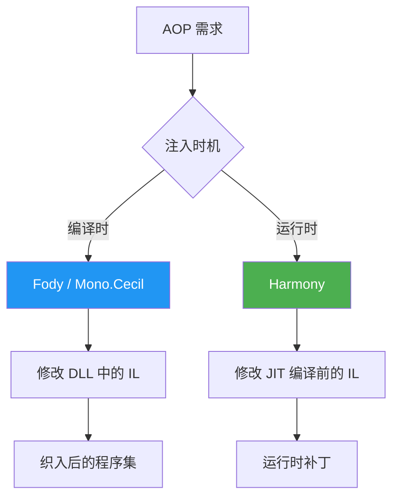
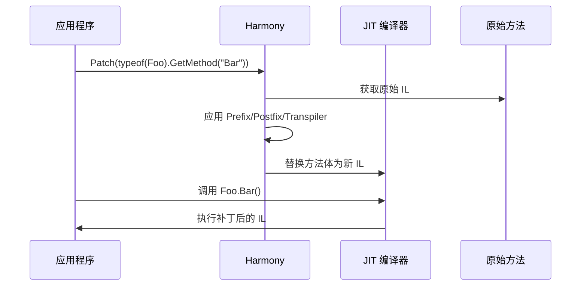
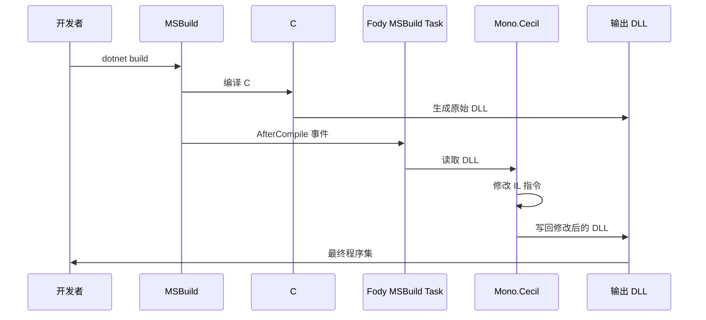

# AOP 与 IL 注入

> AOP（面向切面编程）在 .NET 中通过 IL 操作实现：编译时用 Fody 织入，运行时用 Harmony 补丁。理解 IL 注入原理，就能在不修改源码的情况下改变程序行为。

## 一、AOP 与 IL 注入概览



| 方案 | 时机 | 原理 | 适用场景 |
|------|------|------|---------|
| Fody | 编译时 | MSBuild 任务 → Mono.Cecil 修改 IL → 写回 DLL | 日志、属性通知、参数校验 |
| Harmony | 运行时 | JIT 编译前替换方法体 | 游戏模组、运行时补丁 |
| Mono.Cecil | 编译时/运行时 | 直接读写 IL 元数据 | 自定义织入器 |

## 二、Harmony —— 运行时 IL 补丁

### 2.1 Harmony 工作原理

Harmony 在 JIT 编译方法之前替换其方法体，实现运行时补丁：



### 2.2 Prefix 补丁

Prefix 在原始方法之前执行：

```csharp
using HarmonyLib;

// 目标类（不可修改的第三方代码）
public class ExpensiveCalculator
{
    public int Compute(int x, int y) => x + y;
}

// Prefix 补丁
[HarmonyPatch(typeof(ExpensiveCalculator), "Compute")]
public class ComputePrefixPatch
{
    static void Prefix(int x, int y)
    {
        Console.WriteLine($"[Prefix] Compute called with x={x}, y={y}");
    }
}

// 应用补丁
var harmony = new Harmony("com.example.patch");
harmony.PatchAll();
```

### 2.3 Postfix 补丁

Postfix 在原始方法之后执行：

```csharp
[HarmonyPatch(typeof(ExpensiveCalculator), "Compute")]
public class ComputePostfixPatch
{
    static void Postfix(int x, int y, int __result)
    {
        Console.WriteLine($"[Postfix] Compute({x}, {y}) = {__result}");
    }
}
```

### 2.4 Transpiler —— IL 级修改

Transpiler 直接操作方法的 IL 指令序列，是最强大的补丁方式：

```csharp
using System.Collections.Generic;
using System.Linq;
using System.Reflection;
using System.Reflection.Emit;
using HarmonyLib;

// 目标方法
public class Logger
{
    public void Log(string message) => Console.WriteLine(message);
}

// Transpiler：在 Log 方法中插入时间戳
[HarmonyPatch(typeof(Logger), "Log")]
public class LogTranspilerPatch
{
    static IEnumerable<CodeInstruction> Transpiler(IEnumerable<CodeInstruction> instructions)
    {
        var codes = new List<CodeInstruction>(instructions);

        // 在第一条指令前插入：Console.Write(DateTime.Now + ": ")
        var insertAt = 0;  // 插入位置

        var newInstructions = new List<CodeInstruction>
        {
            // DateTime.Now
            new CodeInstruction(OpCodes.Call,
                typeof(DateTime).GetProperty("Now")!.GetGetMethod()),
            // DateTime.Now + ": "
            new CodeInstruction(OpCodes.Ldstr, ": "),
            new CodeInstruction(OpCodes.Call,
                typeof(string).GetMethod("Concat",
                    new[] { typeof(string), typeof(string) })!),
            // Console.Write(DateTime.Now + ": ")
            new CodeInstruction(OpCodes.Call,
                typeof(Console).GetMethod("Write",
                    new[] { typeof(string) })!),
        };

        codes.InsertRange(insertAt, newInstructions);
        return codes.AsEnumerable();
    }
}
```

等效的 IL 变化：

```il
; 原始 IL
ldarg.1
call        void [System.Console]System.Console::WriteLine(string)
ret

; 补丁后 IL
call        valuetype [System.Runtime]System.DateTime::get_Now()
ldstr       ": "
call        string [System.Runtime]System.String::Concat(string, string)
call        void [System.Console]System.Console::Write(string)
ldarg.1
call        void [System.Console]System.Console::WriteLine(string)
ret
```

::: important Transpiler 的核心 API
- `CodeInstruction.OpCode`：指令操作码
- `CodeInstruction.operand`：操作数（MethodInfo、FieldInfo 等）
- `codes.FindIndex(...)` / `codes.InsertRange(...)`：定位和插入
- `HarmonyLib.CodeMatch` / `HarmonyLib.CodeMatcher`：更高级的模式匹配
:::

## 三、Fody —— 编译时 IL 织入

### 3.1 Fody 工作原理

Fody 作为 MSBuild 任务在编译后执行，通过 Mono.Cecil 修改 IL，然后写回 DLL：



### 3.2 集成 Fody

```xml
<!-- .csproj -->
<ItemGroup>
    <PackageReference Include="Fody" Version="6.*" PrivateAssets="all" />
    <PackageReference Include="PropertyChanged.Fody" Version="4.*" PrivateAssets="all" />
</ItemGroup>
```

```xml
<!-- FodyWeavers.xml -->
<Weavers xmlns:xsi="http://www.w3.org/2001/XMLSchema-instance">
    <PropertyChanged />
</Weavers>
```

### 3.3 PropertyChanged.Fody

自动为属性实现 `INotifyPropertyChanged`：

```csharp
// C# 源码（织入前）
public class ViewModel : INotifyPropertyChanged
{
    public event PropertyChangedEventHandler PropertyChanged;

    public string Name { get; set; }
    public int Age { get; set; }
}
```

Fody 织入后，`Name` 的 setter 变为：

```il
; 织入后的 set_Name IL
ldarg.0
ldarg.1
call        instance void ViewModel::set_Name(string)  ; 递归？不，Fody 用字段
; 实际实现：
ldarg.0
ldarg.1
stfld       string ViewModel::<Name>k__BackingField
ldarg.0
ldstr       "Name"
callvirt    instance void ViewModel::OnPropertyChanged(string)
ret
```

等效 C#：

```csharp
// 织入后的等效代码
public string Name
{
    get => _name;
    set
    {
        if (_name != value)
        {
            _name = value;
            OnPropertyChanged(nameof(Name));
        }
    }
}
```

### 3.4 常用 Fody 织入器

| 织入器 | 功能 | IL 变更 |
|--------|------|---------|
| PropertyChanged | 自动属性变更通知 | setter 中插入 `OnPropertyChanged` 调用 |
| MethodTimer | 方法耗时统计 | 方法入口/出口插入计时 IL |
| NullGuard | 参数/null 检查 | 方法入口插入 `brtrue` 判断 |
| MethodDecorator | 方法拦截 | 方法入口插入 before/after 调用 |
| Costura | 嵌入依赖为资源 | 修改 Assembly resolve 逻辑 |
| Obfuscator | 代码混淆 | 重命名符号、加密字符串 |

### 3.5 MethodTimer.Fody 示例

```csharp
// 织入前
[Time]
public void ExpensiveOperation()
{
    Thread.Sleep(1000);
}
```

```il
; 织入后 IL（简化）
; 方法入口
call        valuetype [System.Runtime]System.Diagnostics.Stopwatch::StartNew()
stloc.0                             ; stopwatch

; 原始方法体
ldc.i4      1000
call        void [System.Threading]System.Threading.Thread::Sleep(int32)

; 方法出口
ldloc.0
callvirt    instance void [System.Runtime]System.Diagnostics.Stopwatch::Stop()
ldloc.0
callvirt    instance int64 [System.Runtime]System.Diagnostics.Stopwatch::get_ElapsedMilliseconds()
; ... 格式化并输出耗时
ret
```

## 四、Mono.Cecil —— IL 操作底层库

Mono.Cecil 是 Fody 的底层引擎，可以直接读写 .NET 程序集的元数据和 IL：

```csharp
using Mono.Cecil;
using Mono.Cecil.Cil;

// 读取程序集
var assembly = AssemblyDefinition.ReadAssembly("MyApp.dll");

// 遍历所有类型
foreach (var type in assembly.MainModule.Types)
{
    foreach (var method in type.Methods)
    {
        if (method.Body == null) continue;

        // 遍历 IL 指令
        foreach (var instr in method.Body.Instructions)
        {
            Console.WriteLine($"  IL_{instr.Offset:X4}: {instr.OpCode.Name} {instr.Operand}");
        }
    }
}

// 修改方法：在方法入口插入日志
var targetMethod = assembly.MainModule.Types
    .First(t => t.Name == "Calculator")
    .Methods.First(m => m.Name == "Compute");

var ilProcessor = targetMethod.Body.GetILProcessor();
var firstInstr = targetMethod.Body.Instructions[0];

// 插入：Console.WriteLine("Entering Compute")
var writeLineRef = assembly.MainModule.ImportReference(
    typeof(Console).GetMethod("WriteLine", new[] { typeof(string) })!);
var ldstr = ilProcessor.Create(OpCodes.Ldstr, "Entering Compute");
var call = ilProcessor.Create(OpCodes.Call, writeLineRef);

ilProcessor.InsertBefore(firstInstr, ldstr);
ilProcessor.InsertBefore(firstInstr, call);

// 保存修改
assembly.Write("MyApp_patched.dll");
```

## 五、安全考虑

### 5.1 IL 注入可以绕过访问修饰符

```csharp
// 通过 IL 注入访问 private 成员
// 正常 C# 不允许，但 IL 层没有访问限制
var privateField = ilProcessor.Create(OpCodes.Ldfld,
    type.Fields.First(f => f.IsPrivate));
```

::: warning 安全风险
- IL 注入可以访问任何成员（private、internal、protected）
- 绕过访问修饰符检查可能导致意外的耦合和稳定性问题
- 混淆后的程序集注入时需注意名称变化
- 生产环境使用 IL 注入需要充分的测试和代码审查
:::

### 5.2 PDB 不匹配问题

IL 织入后，PDB（调试符号）中的行号与源码不再对应：

```
源码行 10 → 织入前 IL 偏移 0x000A
源码行 10 → 织入后 IL 偏移 0x0018（前面插入了额外 IL）
```

解决方案：
1. 使用 Fody 时，部分织入器会更新 PDB
2. 使用 dnSpy 调试织入后的 DLL
3. 在 CI 中保存织入后的 DLL 和 PDB 用于诊断

## 六、调试织入代码

### 6.1 常见问题

| 问题 | 原因 | 解决方案 |
|------|------|---------|
| 断点不命中 | PDB 与织入后 IL 不匹配 | 使用 dnSpy 设断点 |
| 行号偏移 | 织入插入 IL 导致行号错位 | 保存织入后的 PDB |
| NullReferenceException | 织入代码引用了空对象 | 检查织入器的 operand 是否正确解析 |
| InvalidProgramException | 织入的 IL 栈不平衡 | 用 ilasm/peverify 验证 |

### 6.2 验证 IL 正确性

```bash
# 使用 peverify 检查程序集
peverify MyApp_patched.dll

# 使用 ildasm 查看 IL
ildasm MyApp_patched.dll /out:output.il
```

## 参考资料

| 资料 | 说明 |
|------|------|
| [Harmony 官方文档](https://harmony.pardeike.net/) | Harmony 运行时补丁库 |
| [Fody 官方文档](https://github.com/Fody/Fody) | Fody 编译时织入框架 |
| [Mono.Cecil](https://github.com/jbevain/cecil) | IL 操作底层库 |
| [PropertyChanged.Fody](https://github.com/Fody/PropertyChanged) | 属性变更通知织入器 |
| [MethodTimer.Fody](https://github.com/Fody/MethodTimer) | 方法计时织入器 |
| [OpCodes 枚举](https://learn.microsoft.com/en-us/dotnet/api/system.reflection.emit.opcodes) | IL 指令集参考 |

## 面试要点

1. **Harmony 和 Fody 的核心区别？** Harmony 在运行时修改 JIT 编译前的 IL，不需要重新编译；Fody 在编译时修改 DLL 中的 IL，是构建流程的一部分。Harmony 适合运行时补丁（如游戏模组），Fody 适合编译时织入（如 INPC）。

2. **Transpiler 是什么？** Transpiler 是 Harmony 中最强大的补丁方式，直接接收原始方法的 IL 指令序列，返回修改后的指令序列。可以实现任意 IL 级别的修改。

3. **Fody 的构建管线是怎样的？** MSBuild 编译 C# → 生成 DLL → Fody MSBuild Task 触发 → Mono.Cecil 读取 DLL → 修改 IL → 写回 DLL。整个流程对开发者透明。

4. **IL 注入的安全风险？** IL 层没有访问修饰符的概念，注入代码可以访问 private/internal 成员。此外，织入后 PDB 与源码不再对应，调试困难。生产环境需要充分测试。

5. **如何调试织入后的代码？** 使用 dnSpy 打开织入后的 DLL，在 IL 级别设断点。注意 PDB 行号可能与源码不匹配。也可以用 `peverify` 验证织入后 IL 的正确性。
