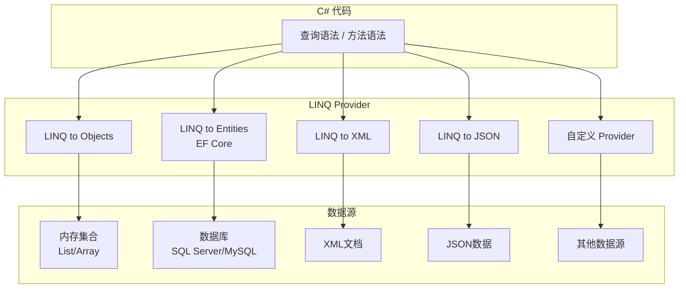
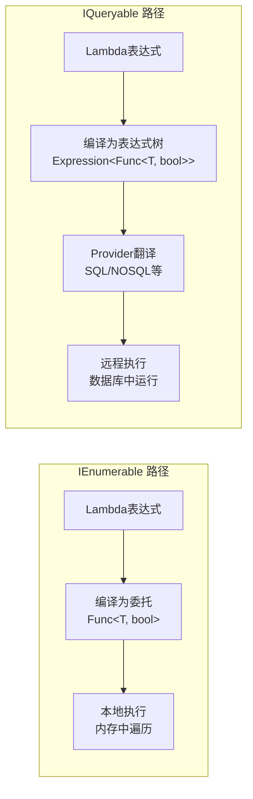

# LINQ 是什么

## 一、LINQ的定义与价值

**LINQ**（Language-Integrated Query，语言集成查询）是C# 3.0引入的核心特性，它将查询能力直接集成到编程语言中，让开发者用统一的语法操作各种数据源。

### 统一查询，一套语法走天下

LINQ的核心理念：**不管数据来自哪里，查询方式都一样**。

```csharp
// 查询内存集合
var results = from p in products
              where p.Price > 100
              select p.Name;

// 查询数据库（EF Core）
var results = from p in db.Products
              where p.Price > 100
              select p.Name;

// 查询XML
var results = from p in XElement.Load("products.xml").Elements("Product")
              where (decimal)p.Element("Price") > 100
              select (string)p.Element("Name");
```

三种不同的数据源，查询语法完全一致——这就是LINQ的威力。

### 传统方式 vs LINQ

```csharp
// 需求：找出价格大于100的活跃商品，按名称排序

// ❌ 传统方式：循环 + if + 临时集合
var result = new List<string>();
foreach (var product in products)
{
    if (product.Price > 100 && product.IsActive)
    {
        result.Add(product.Name);
    }
}
result.Sort();

// ✅ LINQ方式：声明式，一行表达意图
var result = products
    .Where(p => p.Price > 100 && p.IsActive)
    .OrderBy(p => p.Name)
    .Select(p => p.Name);
```

**LINQ的优势**：

| 维度 | 传统方式 | LINQ |
|------|----------|------|
| 代码量 | 多行循环+条件 | 一条链式调用 |
| 可读性 | 需要理解循环逻辑 | 声明式，直述意图 |
| 可维护性 | 修改需改动循环结构 | 修改只需调整操作符 |
| 复用性 | 每次重写循环 | 操作符自由组合 |

### LINQ架构



## 二、LINQ的两大语法形式

LINQ提供两种等价的语法形式来编写查询。

### 查询语法（Query Syntax）

类似SQL的声明式语法，以 `from` 开头，以 `select` 或 `group` 结尾。

```csharp
var result = from p in products
             where p.Price > 100
             orderby p.Name
             select p.Name;
```

### 方法语法（Method Syntax）

基于扩展方法和Lambda表达式的链式调用，也叫流畅语法（Fluent Syntax）。

```csharp
var result = products
    .Where(p => p.Price > 100)
    .OrderBy(p => p.Name)
    .Select(p => p.Name);
```

### 完整对比

| 维度 | 查询语法 | 方法语法 |
|------|----------|----------|
| 关键字 | from, where, select, orderby, group, join | 扩展方法 + Lambda |
| 风格 | 声明式，类似SQL | 链式调用，函数式 |
| 可读性 | 复杂join/group更清晰 | 简单链式更紧凑 |
| 覆盖范围 | 部分操作符 | 全部操作符 |
| 编译结果 | 编译器翻译为方法语法 | 直接编译 |
| IDE支持 | 一般 | 优秀（智能提示、类型推断） |

::: warning 部分操作只有方法语法
以下操作**没有**对应的查询语法关键字，必须使用方法语法：

- 聚合：`Count`, `Sum`, `Average`, `Min`, `Max`, `Aggregate`
- 分区：`Take`, `Skip`, `TakeWhile`, `SkipWhile`
- 元素：`First`, `FirstOrDefault`, `Last`, `Single`, `ElementAt`
- 转换：`ToList`, `ToArray`, `ToDictionary`
- 判断：`Any`, `All`, `Contains`
- 其他：`Zip`, `Reverse`
:::

### 推荐原则

- **简单筛选**：查询语法更直观
- **链式操作**：方法语法更流畅
- **混合使用**：是常态，不必拘泥

```csharp
// 混合使用：查询语法 + 方法语法
var result = (from p in products
              where p.IsActive
              select p)
             .OrderByDescending(p => p.Sales)
             .Take(10);
```

## 三、LINQ的核心类型

LINQ建立在两个核心接口之上：`IEnumerable<T>` 和 `IQueryable<T>`。

### IEnumerable<T> — LINQ to Objects

操作内存中的集合，所有LINQ运算符在 `System.Linq.Enumerable` 静态类中实现。

```csharp
List<int> numbers = new() { 1, 2, 3, 4, 5 };

// Where的参数是 Func<int, bool> —— 委托
var evens = numbers.Where(n => n % 2 == 0);
// 编译后实际调用 Enumerable.Where(numbers, n => n % 2 == 0)
```

### IQueryable<T> — 远程数据源

操作远程数据源（如数据库），运算符在 `System.Linq.Queryable` 静态类中实现。

```csharp
// EF Core中的DbSet<T>实现IQueryable<T>
DbSet<Product> products = db.Products;

// Where的参数是 Expression<Func<int, bool>> —— 表达式树
var evens = products.Where(p => p.Price > 100);
// 表达式树被翻译为SQL：SELECT * FROM Products WHERE Price > 100
```

### 执行流程对比



### 关键区别

| 维度 | IEnumerable<T> | IQueryable<T> |
|------|----------------|---------------|
| 命名空间 | System.Linq.Enumerable | System.Linq.Queryable |
| 参数类型 | `Func<T, bool>` | `Expression<Func<T, bool>>` |
| 执行位置 | 本地内存 | 远程数据源 |
| 查询翻译 | 无，直接执行委托 | 翻译为SQL等查询语言 |
| 适用场景 | 内存集合 | EF Core数据库查询 |
| 过滤时机 | 全部加载后过滤 | 在数据源端过滤 |

::: danger 混用陷阱
在EF Core中，如果在 `IQueryable` 链中调用了 `AsEnumerable()` 或 `ToList()`，后续的 `Where` 就会在内存中执行而非数据库端，可能导致全表加载！

```csharp
// ❌ 错误：先ToList加载全部，再在内存中过滤
var result = db.Products.ToList().Where(p => p.Price > 100);

// ✅ 正确：在数据库端过滤
var result = db.Products.Where(p => p.Price > 100).ToList();
```
:::

## 四、延迟执行（Deferred Execution）

LINQ查询在**定义时不执行，遍历时才执行**——这是LINQ最重要的行为特征。

### 行为演示

```csharp
var numbers = new List<int> { 1, 2, 3, 4, 5 };

// 定义查询 —— 此时并不执行
var query = numbers.Where(n => n > 2);

// 修改数据源
numbers.Add(6);
numbers.Add(7);

// 遍历时才执行，能看到新添加的6和7
foreach (var n in query)
{
    Console.WriteLine(n); // 输出：3, 4, 5, 6, 7
}
```

### 延迟执行的好处

**1. 组合查询**

```csharp
var query = db.Products.AsQueryable();

// 根据条件动态组合
if (!string.IsNullOrEmpty(keyword))
    query = query.Where(p => p.Name.Contains(keyword));

if (minPrice.HasValue)
    query = query.Where(p => p.Price >= minPrice.Value);

// 所有条件在遍历时才组合为一条SQL执行
var result = query.ToList();
```

**2. 流水线处理**

```csharp
// 查询可以像流水线一样层层叠加
var query = products
    .Where(p => p.IsActive)       // 过滤
    .Select(p => new { p.Name, p.Price })  // 投影
    .OrderBy(x => x.Price);       // 排序

// 不消耗额外内存，遍历时一次性处理
```

### 延迟执行的陷阱

```csharp
var query = numbers.Where(n => n > 2);

// ⚠️ 每次遍历都重新执行查询！
Console.WriteLine(query.Count());  // 第1次遍历
foreach (var n in query) { }      // 第2次遍历
var list = query.ToList();        // 第3次遍历

// 如果查询涉及数据库，就是3次SQL查询
```

### 强制立即执行

以下操作会触发立即执行：

```csharp
// 转换为集合
var list = query.ToList();       // 立即执行，返回List<T>
var array = query.ToArray();     // 立即执行，返回T[]

// 获取单个值
int count = query.Count();       // 立即执行，返回int
var first = query.First();       // 立即执行，返回T

// 判断操作
bool any = query.Any();          // 立即执行，返回bool
```

## 五、标准查询运算符概览

LINQ提供了50多个标准查询运算符，按功能分类如下：

### 筛选

| 运算符 | 说明 |
|--------|------|
| `Where` | 按条件筛选元素 |
| `OfType` | 按类型筛选元素 |
| `Cast` | 将元素转换为指定类型 |

### 投影

| 运算符 | 说明 |
|--------|------|
| `Select` | 将每个元素投影为新形式 |
| `SelectMany` | 将序列的序列展平为一维序列 |

### 排序

| 运算符 | 说明 |
|--------|------|
| `OrderBy` | 升序排序 |
| `OrderByDescending` | 降序排序 |
| `ThenBy` | 第二升序排序 |
| `ThenByDescending` | 第二降序排序 |
| `Reverse` | 反转序列顺序 |

### 分组

| 运算符 | 说明 |
|--------|------|
| `GroupBy` | 按键值分组 |
| `ToLookup` | 立即执行分组，创建一键多值字典 |

### 聚合

| 运算符 | 说明 |
|--------|------|
| `Count` | 计数 |
| `Sum` | 求和 |
| `Average` | 平均值 |
| `Min` | 最小值 |
| `Max` | 最大值 |
| `Aggregate` | 自定义聚合 |

### 连接

| 运算符 | 说明 |
|--------|------|
| `Join` | 内连接 |
| `GroupJoin` | 分组连接（左外连接） |
| `Zip` | 按位置合并两个序列 |

### 集合

| 运算符 | 说明 |
|--------|------|
| `Union` | 并集 |
| `Intersect` | 交集 |
| `Except` | 差集 |
| `Concat` | 连接 |
| `Distinct` | 去重 |

### 分区

| 运算符 | 说明 |
|--------|------|
| `Skip` | 跳过前N个 |
| `Take` | 取前N个 |
| `SkipWhile` | 跳过满足条件的元素 |
| `TakeWhile` | 取满足条件的元素 |

### 元素

| 运算符 | 说明 |
|--------|------|
| `First` | 第一个元素 |
| `FirstOrDefault` | 第一个或默认值 |
| `Last` | 最后一个元素 |
| `LastOrDefault` | 最后一个或默认值 |
| `Single` | 唯一元素 |
| `SingleOrDefault` | 唯一元素或默认值 |
| `ElementAt` | 指定位置元素 |
| `ElementAtOrDefault` | 指定位置或默认值 |

### 生成

| 运算符 | 说明 |
|--------|------|
| `Range` | 生成整数范围 |
| `Repeat` | 生成重复值 |
| `Empty` | 生成空序列 |
| `DefaultIfEmpty` | 空序列替换为默认值 |

### 转换

| 运算符 | 说明 |
|--------|------|
| `ToArray` | 转为数组 |
| `ToList` | 转为列表 |
| `ToDictionary` | 转为字典 |
| `ToLookup` | 转为一键多值查找表 |
| `ToHashSet` | 转为HashSet |
| `AsEnumerable` | 转为IEnumerable（强制Enumerable实现） |
| `AsQueryable` | 转为IQueryable（包装为Queryable） |

### 判断

| 运算符 | 说明 |
|--------|------|
| `Any` | 是否存在满足条件的元素 |
| `All` | 是否所有元素都满足条件 |
| `Contains` | 是否包含指定元素 |
| `SequenceEqual` | 两个序列是否相等 |

## 六、使用LINQ的前提

### 引入命名空间

```csharp
// .NET 5及之前需要手动引入
using System.Linq;

// .NET 6+ 使用隐式引用（Implicit Usings），自动引入
// 在项目文件中：<ImplicitUsings>enable</ImplicitUsings>
```

### 数据源要求

数据源必须实现 `IEnumerable<T>` 或 `IQueryable<T>` 接口：

```csharp
// ✅ 这些都实现IEnumerable<T>，可以直接使用LINQ
List<int> list = new() { 1, 2, 3 };
int[] array = { 1, 2, 3 };
HashSet<string> set = new() { "a", "b" };
Dictionary<string, int> dict = new();

// ✅ 字符串也是IEnumerable<char>
var chars = "Hello".Where(c => char.IsUpper(c));

// ❌ 非泛型集合不直接支持，需要先OfType或Cast
ArrayList arrayList = new() { 1, "hello", 2.5 };
var ints = arrayList.OfType<int>(); // 筛选出int类型
```

### 匿名类型与var

LINQ查询常返回匿名类型，必须使用 `var` 接收：

```csharp
// 匿名类型——编译器自动生成类型
var result = products.Select(p => new
{
    p.Name,
    p.Price,
    DiscountPrice = p.Price * 0.9
});

// result的类型是 IEnumerable<匿名类型>，无法显式声明
// 只能用var
foreach (var item in result)
{
    Console.WriteLine($"{item.Name}: {item.Price} -> {item.DiscountPrice}");
}
```

::: tip 匿名类型的局限
匿名类型的作用域限于方法内部，不能作为方法返回值。如果需要跨方法传递，请定义具名类型（DTO、record等）。
:::
