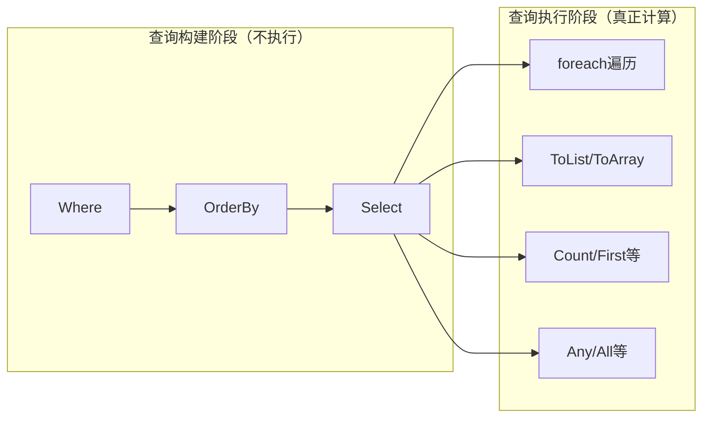

# 延迟执行与立即执行

## 一、延迟执行的原理

### 迭代器模式与yield return

LINQ的延迟执行基于C#的**迭代器模式**。当调用 `Where`、`Select` 等操作时，方法并不会立即遍历数据源，而是返回一个**迭代器对象**，只有在遍历时才逐个处理元素。

```csharp
// Where的简化实现——使用yield return
public static IEnumerable<T> Where<T>(this IEnumerable<T> source, Func<T, bool> predicate)
{
    foreach (var item in source)
    {
        if (predicate(item))
        {
            yield return item;  // 延迟返回，不是一次性计算
        }
    }
}
```

`yield return` 的关键特性：
- 调用方法时**不执行方法体**
- 返回一个迭代器对象
- 每次调用 `MoveNext()` 才执行到下一个 `yield return`
- 实现了"按需计算"的惰性求值

### 查询构建 vs 查询执行



```csharp
// 构建阶段——什么都没执行
var query = products
    .Where(p => p.Price > 100)    // 返回迭代器
    .OrderBy(p => p.Name)          // 返回迭代器
    .Select(p => p.Name);          // 返回迭代器

// Console.WriteLine("到这里，上面的筛选、排序都没执行");

// 执行阶段——真正遍历数据源
foreach (var name in query)        // 此刻才执行
{
    Console.WriteLine(name);
}
```

## 二、延迟执行的行为演示

### 示例1：定义查询后修改数据源

```csharp
var numbers = new List<int> { 1, 2, 3, 4, 5 };

// 定义查询
var query = numbers.Where(n => n > 2);

// 修改数据源
numbers.Add(6);
numbers.Remove(1);

// 遍历查询——能看到修改后的数据
Console.WriteLine(string.Join(", ", query));
// 输出：3, 4, 5, 6  （6是新加的，1被移除但不影响>2的条件）
```

::: warning 延迟执行意味着查询使用的是数据源的"当前状态"
查询定义时只记录了"要做什么"，执行时才去看数据源"现在是什么"。数据源在定义和执行之间的任何变化都会反映在结果中。
:::

### 示例2：每次遍历都重新执行查询

```csharp
var numbers = new List<int> { 1, 2, 3 };
var query = numbers.Where(n =>
{
    Console.WriteLine($"判断 {n}");
    return n > 1;
});

Console.WriteLine("=== 第一次遍历 ===");
foreach (var n in query) { }  // 输出：判断1, 判断2, 判断3

Console.WriteLine("=== 第二次遍历 ===");
foreach (var n in query) { }  // 又输出：判断1, 判断2, 判断3
```

每次 `foreach` 都重新遍历数据源，重新执行Lambda——这是延迟执行的直接后果。

### 示例3：多次遍历的性能问题

```csharp
// ❌ 危险：3次数据库查询
var query = db.Orders.Where(o => o.Year == 2024);

int count = query.Count();          // 第1次SQL
var first = query.First();          // 第2次SQL
var list = query.ToList();          // 第3次SQL

// ✅ 正确：一次查询，多次使用
var list = db.Orders.Where(o => o.Year == 2024).ToList();
int count = list.Count;
var first = list.First();
```

## 三、哪些操作是延迟执行的

返回 `IEnumerable<T>` 或 `IOrderedEnumerable<T>` 的操作都是延迟执行的：

| 类别 | 操作 |
|------|------|
| 筛选 | `Where`, `OfType`, `Cast` |
| 投影 | `Select`, `SelectMany` |
| 排序 | `OrderBy`, `OrderByDescending`, `ThenBy`, `ThenByDescending`, `Reverse` |
| 分组 | `GroupBy` |
| 连接 | `Join`, `GroupJoin`, `Zip` |
| 集合 | `Concat`, `Union`, `Intersect`, `Except`, `Distinct` |
| 分区 | `Skip`, `Take`, `SkipWhile`, `TakeWhile` |
| 转换 | `AsEnumerable`, `AsQueryable`, `DefaultIfEmpty` |

::: tip 记忆法则
**返回集合的 = 延迟执行，返回单值/新类型的 = 立即执行**
:::

## 四、哪些操作是立即执行的

返回单个值或新集合类型的操作会立即执行：

| 类别 | 操作 |
|------|------|
| 聚合 | `Count`, `Sum`, `Average`, `Min`, `Max`, `Aggregate` |
| 元素 | `First`, `FirstOrDefault`, `Last`, `LastOrDefault`, `Single`, `SingleOrDefault`, `ElementAt`, `ElementAtOrDefault` |
| 判断 | `Any`, `All`, `Contains`, `SequenceEqual` |
| 转换 | `ToArray`, `ToList`, `ToDictionary`, `ToLookup`, `ToHashSet` |

```csharp
// 这些操作立即执行，不需要foreach
int count = products.Count();                              // 立即
decimal total = products.Sum(p => p.Price);                // 立即
var first = products.First(p => p.Id == 1);                // 立即
bool any = products.Any(p => p.Stock == 0);                // 立即
var list = products.ToList();                              // 立即
var dict = products.ToDictionary(p => p.Id);               // 立即
```

## 五、延迟执行的陷阱

### 陷阱1：在循环中多次枚举

```csharp
// ❌ 性能杀手：内层查询被重复执行
var categories = products.Select(p => p.Category).Distinct();
foreach (var cat in categories)
{
    // 每次循环都重新执行Where，遍历整个products
    var catProducts = products.Where(p => p.Category == cat);
    Console.WriteLine($"{cat}: {catProducts.Count()}");
}

// ✅ 优化：先缓存数据
var productsList = products.ToList();
var categories = productsList.Select(p => p.Category).Distinct();
foreach (var cat in categories)
{
    var catProducts = productsList.Where(p => p.Category == cat);
    Console.WriteLine($"{cat}: {catProducts.Count()}");
}
```

### 陷阱2：捕获循环变量的闭包问题

```csharp
// ❌ 闭包陷阱（C# 5.0之前的行为，现代C#已修复foreach但for仍有问题）
var filters = new List<Func<int, bool>>();
for (int i = 0; i < 5; i++)
{
    filters.Add(n => n > i);  // 捕获的是变量i，不是i的值
}

// 所有filter都用 i=5 来判断
var result = new[] { 1, 2, 3, 4, 5, 6 }.Where(filters[0]);
// 期望：n > 0，实际：n > 5（因为i最终是5）

// ✅ 修复：在循环内创建局部变量
for (int i = 0; i < 5; i++)
{
    int captured = i;
    filters.Add(n => n > captured);
}
```

### 陷阱3：异常在遍历时才抛出

```csharp
// 定义查询时不报错
var query = numbers.Select(n => 100 / n);  // 如果n=0会除零

// 异常在遍历时才出现
foreach (var item in query)  // 此刻才抛出DivideByZeroException
{
    Console.WriteLine(item);
}

// 这使得bug难以定位——定义和异常发生在不同位置
```

### 陷阱4：查询中包含副作用

```csharp
int counter = 0;
var query = products.Select(p =>
{
    counter++;  // ⚠️ 副作用！每次遍历都会执行
    return p.Name;
});

// 第一次遍历
foreach (var name in query) { }
Console.WriteLine(counter);  // 输出产品数量

// 第二次遍历
foreach (var name in query) { }
Console.WriteLine(counter);  // 输出产品数量×2！

// ✅ 避免在LINQ中写副作用
```

## 六、何时用ToList()强制执行

### 需要多次遍历时

```csharp
// ❌ 多次遍历同一查询
var query = expensiveQuery.Where(...);
var count = query.Count();
var list = query.ToList();

// ✅ 一次执行，多次使用
var list = expensiveQuery.Where(...).ToList();
var count = list.Count;
```

### 需要立即获得结果时

```csharp
// 需要在方法返回前确定结果
public List<Product> GetActiveProducts()
{
    return _db.Products
        .Where(p => p.IsActive)
        .ToList();  // 必须ToList，否则DbContext可能已释放
}
```

### 数据源可能变化时

```csharp
// 在多线程环境中，数据源可能在查询执行前变化
var snapshot = sharedList.Where(p => p.IsValid).ToList();
// 使用snapshot而非query，避免并发修改
```

### 性能关键路径上

```csharp
// 高频调用的热路径，避免重复计算
private List<Product> _cached;

public List<Product> GetProducts()
{
    _cached ??= _db.Products.Where(p => p.IsActive).ToList();
    return _cached;
}
```

### 不要无脑ToList

```csharp
// ❌ 不必要的ToList——破坏了流式处理
var result = products
    .Where(p => p.IsActive)
    .ToList()           // 多余！立即加载全部数据
    .Where(p => p.Price > 100)
    .ToList()           // 又多余！
    .Select(p => p.Name)
    .ToList();          // 还是多余！

// ✅ 让延迟执行发挥作用
var result = products
    .Where(p => p.IsActive && p.Price > 100)
    .Select(p => p.Name)
    .ToList();           // 只在最终需要时ToList
```

::: tip ToList的时机
只在以下时刻调用 `ToList`：
1. 查询的**最终消费点**——需要将结果传给其他方法时
2. 需要**多次访问**结果时
3. 数据源可能**发生变化**时
4. 使用了**EF Core**且需要脱离DbContext时
:::

## 七、IQueryable的延迟执行

### 表达式树的延迟翻译

`IQueryable<T>` 的延迟执行与 `IEnumerable<T>` 有本质区别：

```csharp
// IEnumerable：每次遍历在内存中执行委托
IEnumerable<Product> ieQuery = products.Where(p => p.Price > 100);
// 参数类型：Func<Product, bool>
// 执行方式：遍历products，对每个元素调用委托

// IQueryable：每次遍历触发SQL生成和数据库查询
IQueryable<Product> iqQuery = db.Products.Where(p => p.Price > 100);
// 参数类型：Expression<Func<Product, bool>>
// 执行方式：表达式树 → SQL → 数据库执行
```

### EF Core中的延迟执行

```csharp
// 定义查询——不执行SQL
var query = db.Products
    .Where(p => p.Price > 100)
    .OrderBy(p => p.Name)
    .Select(p => new { p.Id, p.Name, p.Price });

// 以下操作触发SQL执行
foreach (var item in query) { }    // 触发SELECT
var list = query.ToList();         // 触发SELECT
int count = query.Count();         // 触发SELECT COUNT
```

生成的SQL大致如下：

```sql
SELECT [p].[Id], [p].[Name], [p].[Price]
FROM [Products] AS [p]
WHERE [p].[Price] > 100.0
ORDER BY [p].[Name]
```

### 与IEnumerable延迟执行的本质区别

| 维度 | IEnumerable | IQueryable |
|------|-------------|------------|
| 延迟内容 | 延迟遍历（本地计算） | 延迟翻译+执行（远程计算） |
| 执行代价 | 内存中遍历，代价低 | 生成SQL+网络IO，代价高 |
| 多次遍历 | 重复遍历内存 | 重复查询数据库！ |
| 优化建议 | 按需ToList | 务必ToList避免重复SQL |

```csharp
// ⚠️ IQueryable的延迟执行更危险——重复查询数据库
var query = db.Products.Where(p => p.IsActive);

// 这会导致3次SQL查询！
var count = query.Count();      // SELECT COUNT(*) FROM Products WHERE IsActive=1
var first = query.First();      // SELECT TOP 1 ... FROM Products WHERE IsActive=1
var list = query.ToList();      // SELECT ... FROM Products WHERE IsActive=1

// ✅ 一次查询搞定
var list = db.Products.Where(p => p.IsActive).ToList();
var count = list.Count;
var first = list[0];
```

## 总结

| 要点 | 说明 |
|------|------|
| 延迟执行 | 查询定义时不执行，遍历时才执行 |
| 立即执行 | 返回单值或新集合的操作立即执行 |
| IEnumerable延迟 | 延迟内存遍历 |
| IQueryable延迟 | 延迟SQL生成和数据库查询 |
| ToList时机 | 多次使用、需要快照、脱离DbContext时 |
| 避免陷阱 | 多次枚举、闭包、副作用、延迟异常 |
