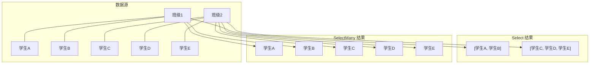

# Select 与 SelectMany

## 一、Select — 投影

`Select` 是LINQ中最基础的投影操作，它将集合中的每个元素**转换**为新形式——可以提取属性、构建匿名类型、执行计算。

### 基本用法：提取属性

```csharp
// 从每个元素中提取单个属性
var names = products.Select(p => p.Name);

// 等价的查询语法
var names = from p in products
            select p.Name;
```

### 匿名类型投影

```csharp
// 构建包含多个字段的匿名类型
var result = products.Select(p => new
{
    p.Name,
    p.Price,
    IsExpensive = p.Price > 1000
});

// 使用record构建具名类型（推荐用于跨方法传递）
var result = products.Select(p => new ProductSummary(
    p.Name,
    p.Price,
    p.Price > 1000
));

public record ProductSummary(string Name, decimal Price, bool IsExpensive);
```

### 索引重载

`Select` 提供带索引的重载，可以获取元素在序列中的位置：

```csharp
// Select((item, index) => ...)
var result = products.Select((p, index) => new
{
    Rank = index + 1,
    p.Name,
    p.Price
});

// 输出：
// Rank=1, Name=鼠标, Price=99
// Rank=2, Name=键盘, Price=299
// ...
```

::: info 索引从0开始
`Select` 的索引参数从0开始，如需显示序号请加1。注意：`Where` 也有索引重载，但排序后索引可能不符合预期。
:::

### 业务场景

#### 场景1：DTO转换（Entity → DTO）

```csharp
// 数据层实体
public class ProductEntity
{
    public int Id { get; set; }
    public string Name { get; set; }
    public decimal Price { get; set; }
    public int CategoryId { get; set; }
    public bool IsDeleted { get; set; }
    public DateTime CreatedAt { get; set; }
}

// API返回DTO
public class ProductDto
{
    public int Id { get; set; }
    public string Name { get; set; }
    public string PriceDisplay { get; set; }
}

// Entity → DTO 转换
var dtos = products
    .Where(p => !p.IsDeleted)
    .Select(p => new ProductDto
    {
        Id = p.Id,
        Name = p.Name,
        PriceDisplay = $"¥{p.Price:N2}"
    })
    .ToList();
```

#### 场景2：下拉列表数据

```csharp
// 前端下拉列表需要 { value, text } 格式
var options = categories.Select(c => new
{
    Value = c.Id.ToString(),
    Text = $"{c.Name} ({c.ProductCount})"
}).ToList();

// 返回结果：
// [{ Value: "1", Text: "电子产品 (156)" }, { Value: "2", Text: "服装 (89)" }, ...]
```

#### 场景3：数据脱敏

```csharp
// 用户列表脱敏——邮箱中间用*替代
var safeUsers = users.Select(u => new
{
    u.Id,
    u.Name,
    MaskedEmail = MaskEmail(u.Email),
    u.Role
});

string MaskEmail(string email)
{
    var parts = email.Split('@');
    if (parts.Length != 2) return "***";
    var name = parts[0];
    var masked = name.Length <= 2
        ? name[0] + "***"
        : name[0] + new string('*', name.Length - 2) + name[^1];
    return $"{masked}@{parts[1]}";
}
// 输入：zhang@example.com → z***g@example.com
// 输入：ab@test.com → a***@test.com
```

## 二、SelectMany — 扁平化投影

`SelectMany` 是LINQ中最容易被忽视但最强大的操作之一——它处理**一对多**关系，将嵌套集合"展平"为一维序列。

### 核心概念

```csharp
// Select：一对一时，结果一一对应
// 每个班级 → 班级名称（一个值）
var names = classes.Select(c => c.Name);
// 结果：["一班", "二班", "三班"]

// Select：一对多时，结果是集合的集合
// 每个班级 → 学生列表（多个值）
var studentGroups = classes.Select(c => c.Students);
// 结果：IEnumerable<List<Student>> —— 嵌套的集合！

// SelectMany：一对多时，直接展平为一维
var allStudents = classes.SelectMany(c => c.Students);
// 结果：IEnumerable<Student> —— 扁平的集合！
```

### Select vs SelectMany 结果对比



### 四种重载详解

#### 重载1：SelectMany(collectionSelector)

最基本的形式——只指定如何获取子集合：

```csharp
// 每个班级的所有学生
var allStudents = classes.SelectMany(c => c.Students);

// 查询语法等价：多个from子句
var allStudents = from c in classes
                  from s in c.Students
                  select s;
```

#### 重载2：SelectMany(collectionSelector, resultSelector)

最强大的形式——展平的同时保留父元素信息：

```csharp
// 展平学生，同时保留班级信息
var result = classes.SelectMany(
    c => c.Students,                    // 子集合选择器
    (classItem, student) => new         // 结果选择器
    {
        ClassName = classItem.Name,
        StudentName = student.Name,
        student.Score
    }
);

// 查询语法等价
var result = from c in classes
             from s in c.Students
             select new { ClassName = c.Name, StudentName = s.Name, s.Score };
```

#### 重载3：带索引的重载

```csharp
// 带索引的collectionSelector
var result = classes.SelectMany(
    (c, classIndex) => c.Students.Select(s => new
    {
        ClassIndex = classIndex,
        ClassName = c.Name,
        StudentName = s.Name
    })
);
```

#### 重载4：完整重载

```csharp
// 带索引的collectionSelector + resultSelector
var result = classes.SelectMany(
    (c, classIndex) => c.Students,      // 带索引的子集合选择器
    (c, student) => new                 // 结果选择器
    {
        c.Name,
        StudentName = student.Name
    }
);
```

### 业务场景

#### 场景1：订单→订单明细的展平（一对多）

```csharp
// 需求：获取所有订单明细的扁平列表
public class Order
{
    public int OrderId { get; set; }
    public string Customer { get; set; }
    public List<OrderDetail> Details { get; set; }
}

public class OrderDetail
{
    public string ProductName { get; set; }
    public int Quantity { get; set; }
    public decimal UnitPrice { get; set; }
}

// 展平：保留订单信息 + 明细信息
var flatDetails = orders.SelectMany(
    o => o.Details,
    (order, detail) => new
    {
        order.OrderId,
        order.Customer,
        detail.ProductName,
        detail.Quantity,
        Subtotal = detail.Quantity * detail.UnitPrice
    }
);

// 输出示例：
// { OrderId: 1, Customer: "张三", ProductName: "鼠标", Quantity: 2, Subtotal: 198 }
// { OrderId: 1, Customer: "张三", ProductName: "键盘", Quantity: 1, Subtotal: 299 }
// { OrderId: 2, Customer: "李四", ProductName: "显示器", Quantity: 1, Subtotal: 2999 }
```

#### 场景2：部门→员工→技能的展平（多层级）

```csharp
// 需求：获取所有员工的技能列表
var allSkills = departments
    .SelectMany(d => d.Employees)
    .SelectMany(e => e.Skills)
    .Distinct();

// 保留部门+员工+技能的完整信息
var skillReport = departments.SelectMany(
    d => d.Employees,
    (dept, emp) => new { Dept = dept.Name, Emp = emp.Name, emp.Skills }
).SelectMany(
    x => x.Skills,
    (x, skill) => new { x.Dept, x.Emp, Skill = skill }
);

// 输出示例：
// { Dept: "研发部", Emp: "王五", Skill: "C#" }
// { Dept: "研发部", Emp: "王五", Skill: "SQL" }
// { Dept: "研发部", Emp: "赵六", Skill: "Java" }
```

#### 场景3：文章→标签的展平（多对多）

```csharp
// 需求：获取所有文章的标签列表，附带文章标题
var articleTags = articles.SelectMany(
    a => a.Tags,
    (article, tag) => new { article.Title, Tag = tag }
);

// 统计每个标签的文章数
var tagCounts = articles
    .SelectMany(a => a.Tags)
    .GroupBy(tag => tag)
    .Select(g => new { Tag = g.Key, Count = g.Count() })
    .OrderByDescending(x => x.Count);
```

## 三、Select与SelectMany对比

| 维度 | Select | SelectMany |
|------|--------|------------|
| 关系类型 | 一对一（或一对集合） | 一对多 |
| 返回结果 | 一一对应的序列 | 展平的序列 |
| 嵌套 | 可能产生嵌套集合 | 始终是扁平序列 |
| 查询语法等价 | `select` 子句 | 多个 `from` 子句 |
| 典型用途 | 属性提取、类型转换 | 子集合展开、一对多关联 |
| 结果数量 | 等于源序列长度 | 可能多于源序列长度 |

### 何时用哪个

```csharp
// ✅ 用Select：一对一转换
products.Select(p => p.Name)                    // 每个商品→一个名字
products.Select(p => new ProductDto { ... })    // 每个实体→一个DTO

// ✅ 用SelectMany：一对多展平
orders.SelectMany(o => o.Details)               // 每个订单→多个明细
articles.SelectMany(a => a.Tags)                // 每篇文章→多个标签

// ❌ 错误：Select返回嵌套集合
orders.Select(o => o.Details)  // 返回 List<List<OrderDetail>>，通常不是你想要的
```

## 四、高级技巧

### SelectMany实现笛卡尔积

```csharp
var colors = new[] { "红", "蓝" };
var sizes = new[] { "S", "M", "L" };

// 笛卡尔积：所有颜色×尺寸组合
var combinations = colors.SelectMany(
    c => sizes,
    (color, size) => $"{color}-{size}"
);

// 结果：红-S, 红-M, 红-L, 蓝-S, 蓝-M, 蓝-L
```

### SelectMany + Distinct去重

```csharp
// 获取所有文章的不重复标签
var uniqueTags = articles
    .SelectMany(a => a.Tags)
    .Distinct()
    .OrderBy(t => t)
    .ToList();
```

### SelectMany实现交叉连接（Cross Join）

```csharp
// 交叉连接：所有学生×所有课程的组合
var enrollments = students.SelectMany(
    s => courses,
    (student, course) => new Enrollment
    {
        StudentId = student.Id,
        CourseId = course.Id
    }
);

// 查询语法等价
var enrollments = from s in students
                  from c in courses
                  select new Enrollment { StudentId = s.Id, CourseId = c.Id };
```

### 嵌套SelectMany处理多层一对多

```csharp
// 公司 → 部门 → 员工 → 项目
var allProjects = companies
    .SelectMany(c => c.Departments)         // 展平部门
    .SelectMany(d => d.Employees)            // 展平员工
    .SelectMany(e => e.Projects)             // 展平项目
    .DistinctBy(p => p.Id)                   // 按项目ID去重
    .ToList();

// 保留完整层级信息
var projectReport = companies.SelectMany(
    c => c.Departments,
    (company, dept) => new { Company = company.Name, Dept = dept }
).SelectMany(
    x => x.Dept.Employees,
    (x, emp) => new { x.Company, DeptName = x.Dept.Name, Emp = emp }
).SelectMany(
    x => x.Emp.Projects,
    (x, project) => new
    {
        x.Company,
        x.DeptName,
        Employee = x.Emp.Name,
        Project = project.Name
    }
);
```

## 五、StackOverflow常见问题

### Q1：Select vs SelectMany怎么选？

**A**：看你的数据结构——如果源元素的属性是集合，且你需要的是集合里的元素（而不是集合本身），就用 `SelectMany`。

```csharp
// 要名字 → Select
products.Select(p => p.Name);

// 要订单的所有商品 → SelectMany
orders.SelectMany(o => o.Items);
```

### Q2：SelectMany后如何保留父元素信息？

**A**：使用 `resultSelector` 重载，这是最常见的需求：

```csharp
// ❌ 丢失了订单信息
var items = orders.SelectMany(o => o.Details);

// ✅ 保留订单+明细信息
var items = orders.SelectMany(
    o => o.Details,
    (order, detail) => new { order.OrderId, order.Customer, detail.ProductName }
);
```

### Q3：空集合的SelectMany处理

**SelectMany` 自动跳过空集合，不会产生null或异常：

```csharp
var orders = new[]
{
    new Order { OrderId = 1, Details = new List<Detail> { ... } },
    new Order { OrderId = 2, Details = new List<Detail>() },  // 空明细
    new Order { OrderId = 3, Details = null }                   // null明细
};

// ⚠️ 如果Details可能为null，需要防御性处理
var items = orders
    .Where(o => o.Details != null)
    .SelectMany(o => o.Details);

// 或使用空集合替代
var items = orders
    .SelectMany(o => o.Details ?? Enumerable.Empty<Detail>());
```

## 总结

| 要点 | 说明 |
|------|------|
| Select | 一对一投影，提取/转换属性 |
| SelectMany | 一对多展平，将嵌套集合变为一维 |
| resultSelector | SelectMany保留父元素信息的关键 |
| 查询语法等价 | 多个from子句 = SelectMany |
| 空集合处理 | SelectMany自动跳过，null需防御 |
