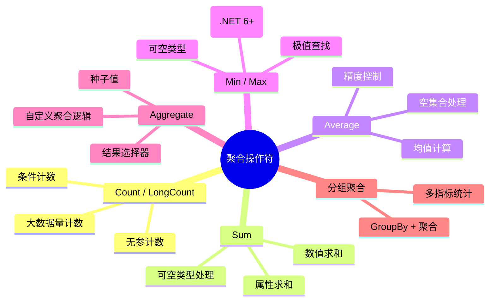
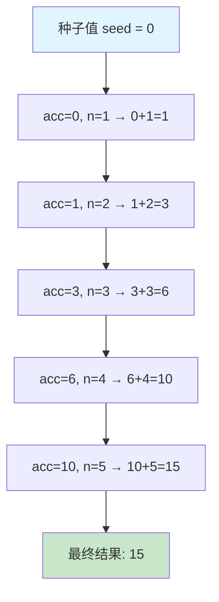

# 聚合操作符

聚合操作符将集合中的多个元素"压缩"为一个单一结果，是数据分析的核心工具。从简单的计数到复杂的自定义聚合，LINQ 提供了完整的工具链。



## 一、Count / LongCount — 计数

### 基本用法

`Count()` 返回集合中元素的数量，是最常用的聚合操作符之一。

```csharp
// 无参版本：返回集合总元素数
var numbers = new[] { 1, 2, 3, 4, 5 };
int total = numbers.Count();  // 5

// 条件计数：返回满足谓词的元素数
int evenCount = numbers.Count(n => n % 2 == 0);  // 2
```

### LongCount — 大数据量计数

当集合元素数量可能超过 `int.MaxValue`（约 21 亿）时，使用 `LongCount` 返回 `long` 类型：

```csharp
// 大数据量场景
IEnumerable<int> bigRange = Enumerable.Range(1, int.MaxValue);
long count = bigRange.LongCount();  // 2147483647L

// 条件 LongCount
long evenBig = bigRange.LongCount(n => n % 2 == 0);
```

> 实际开发中 `LongCount` 使用较少，但在大数据分析、日志处理等场景下不可忽视。

### 性能注意：Count() vs Any()

判断集合是否包含元素时，`Any()` 比 `Count() > 0` 更高效：

```csharp
// 不推荐：Count() 需要遍历整个集合
if (orders.Count() > 0) { ... }

// 推荐：Any() 只需判断是否存在至少一个元素
if (orders.Any()) { ... }

// 条件判断同理
if (orders.Any(o => o.Status == "Pending")) { ... }  // 找到即停
if (orders.Count(o => o.Status == "Pending") > 0) { ... }  // 全部遍历
```

| 方式 | 时间复杂度 | 适用场景 |
|------|-----------|---------|
| `Count() > 0` | O(n) | 需要知道具体数量 |
| `Any()` | O(1) 或 O(n)* | 仅判断是否存在 |

> `*` 对于 `ICollection<T>` 实现（如 `List<T>`），`Count()` 是 O(1) 操作，因为可直接读取 `Count` 属性。但对于 `IQueryable`（EF Core），`Any()` 翻译为 `EXISTS` 子查询，仍然更优。

### 业务场景

```csharp
// 1. 统计各状态订单数量
var orders = GetOrders();
var statusCounts = orders
    .GroupBy(o => o.Status)
    .Select(g => new
    {
        Status = g.Key,
        Count = g.Count()
    })
    .ToList();
// 输出示例：
// { Status = "Pending", Count = 12 }
// { Status = "Shipped", Count = 45 }
// { Status = "Completed", Count = 128 }

// 2. 分页查询总记录数
int pageSize = 20;
int totalCount = dbContext.Products.Count();
int totalPages = (int)Math.Ceiling((double)totalCount / pageSize);

// 3. 条件计数：活跃用户数
int activeUserCount = users.Count(u =>
    u.LastLoginTime >= DateTime.Now.AddDays(-30) &&
    u.IsEnabled);
```

## 二、Sum — 求和

### 数值类型求和

```csharp
int[] scores = { 85, 92, 78, 95, 88 };
int totalScore = scores.Sum();  // 438

decimal[] prices = { 19.99m, 29.50m, 5.00m };
decimal total = prices.Sum();  // 54.49m
```

### 可空类型求和

`Sum` 对可空数值类型自动忽略 `null` 值：

```csharp
int?[] nullableNumbers = { 1, null, 3, null, 5 };
int sum = nullableNumbers.Sum();  // 9（null 被忽略）

// 等价于
int sum2 = nullableNumbers.Where(n => n.HasValue).Sum(n => n.Value);  // 9
```

> 这是 `Sum` 的内置行为，无需手动过滤 `null`。但如果全部元素都是 `null`，`Sum` 返回 `0`，不是 `null`。

### 属性求和

```csharp
// 对集合中对象的某个属性求和
decimal totalAmount = orders.Sum(o => o.Amount);

// 链式调用
decimal shippedTotal = orders
    .Where(o => o.Status == "Shipped")
    .Sum(o => o.Amount);
```

### 业务场景

```csharp
// 1. 订单总金额
decimal totalRevenue = orders.Sum(o => o.TotalAmount);

// 2. 部门薪资总额
var deptSalary = employees
    .GroupBy(e => e.Department)
    .Select(g => new
    {
        Department = g.Key,
        TotalSalary = g.Sum(e => e.Salary)
    });

// 3. 库存价值汇总
decimal inventoryValue = products
    .Sum(p => p.Price * p.StockQuantity);
```

## 三、Average — 平均值

### 基本用法

```csharp
int[] scores = { 85, 92, 78, 95, 88 };
double average = scores.Average();  // 87.6

// 属性求均值
double avgPrice = products.Average(p => p.Price);
```

### 可空类型处理

```csharp
double?[] nullableScores = { 85.0, null, 92.0, null, 78.0 };
double? avg = nullableScores.Average();  // 85.0（null 被忽略）

// 非空元素的平均值
double? avg2 = nullableScores
    .Where(n => n.HasValue)
    .Average();  // 85.0
```

### 精度注意：decimal vs double

`Average` 的返回类型取决于输入类型：

```csharp
// int/long → double
int[] ints = { 1, 2, 3 };
double avgInt = ints.Average();  // 2.0 (double)

// decimal → decimal
decimal[] decs = { 1.5m, 2.5m, 3.0m };
decimal avgDec = decs.Average();  // 2.333... (decimal)

// 金额计算务必用 decimal
var orderAvg = orders.Average(o => o.Amount);  // decimal → decimal
```

> 金融计算场景下，优先使用 `decimal` 类型以保证精度。`double` 的浮点误差在累积后可能产生显著偏差。

### 业务场景

```csharp
// 1. 客单价计算
decimal avgOrderValue = orders.Average(o => o.TotalAmount);

// 2. 平均处理时长
double avgProcessHours = tasks
    .Where(t => t.CompletedAt != null)
    .Average(t => (t.CompletedAt - t.CreatedAt).Value.TotalHours);

// 3. 绩效评分
decimal avgRating = reviews.Average(r => r.Rating);
```

## 四、Min / Max — 极值

### 基本用法

```csharp
int[] numbers = { 5, 3, 9, 1, 7 };
int min = numbers.Min();  // 1
int max = numbers.Max();  // 9

// 属性极值
decimal cheapest = products.Min(p => p.Price);
decimal expensive = products.Max(p => p.Price);
```

### 可空类型处理

```csharp
int?[] nullable = { 5, null, 3, null, 9 };
int? minVal = nullable.Min();  // 3
int? maxVal = nullable.Max();  // 9

// 全部为 null 时
int?[] allNull = { null, null };
int? minAll = allNull.Min();  // null
```

### Min/Max 获取完整对象

`Min()` 和 `Max()` 只返回极值本身，不返回包含该值的完整对象。要获取完整对象有两种方式：

```csharp
// 方式一：OrderBy + First（兼容性好）
var cheapestProduct = products.OrderBy(p => p.Price).First();
var expensiveProduct = products.OrderByDescending(p => p.Price).First();

// 方式二：MinBy / MaxBy（.NET 6+，推荐）
var cheapestProduct2 = products.MinBy(p => p.Price);
var expensiveProduct2 = products.MaxBy(p => p.Price);

// 多个相同极值时，MinBy/MaxBy 返回第一个
var firstHighest = products.MaxBy(p => p.Price);  // 若有多个最高价，返回第一个
```

| 方式 | 优点 | 缺点 |
|------|------|------|
| `OrderBy + First` | 兼容所有 .NET 版本 | 需要完整排序，O(n log n) |
| `MinBy / MaxBy` | 只遍历一次，O(n) | 需要 .NET 6+ |

> `MinBy` / `MaxBy` 的性能优势在大数据量下尤其明显，因为不需要排序操作。

### 业务场景

```csharp
// 1. 最高/最低价商品
var cheapest = products.MinBy(p => p.Price);
var priciest = products.MaxBy(p => p.Price);

// 2. 最早/最晚订单
var earliest = orders.MinBy(o => o.CreatedAt);
var latest = orders.MaxBy(o => o.CreatedAt);

// 3. 绩效最优员工
var topPerformer = employees.MaxBy(e => e.PerformanceScore);
```

## 五、Aggregate — 自定义聚合

`Aggregate` 是最灵活的聚合操作符，可以实现所有其他聚合操作符的功能，也可用于实现自定义的聚合逻辑。

### 基本用法

```csharp
// 带种子值的版本：Aggregate(seed, func)
int sum = new[] { 1, 2, 3, 4, 5 }
    .Aggregate(0, (acc, n) => acc + n);  // 15

// 无种子值版本：第一个元素作为初始值
int product = new[] { 1, 2, 3, 4, 5 }
    .Aggregate((acc, n) => acc * n);  // 120
```

### 执行流程



### 带结果选择器的版本

```csharp
// Aggregate(seed, func, resultSelector)
string result = new[] { 1, 2, 3, 4, 5 }
    .Aggregate(
        seed: new StringBuilder(),
        func: (sb, n) => sb.Append(n).Append(","),
        resultSelector: sb => sb.ToString().TrimEnd(','));
// result = "1,2,3,4,5"
```

### 用 Aggregate 实现其他聚合

```csharp
// 实现 Sum
int sum = numbers.Aggregate(0, (acc, n) => acc + n);

// 实现 Count
int count = numbers.Aggregate(0, (acc, _) => acc + 1);

// 实现字符串拼接
string joined = words.Aggregate((a, b) => $"{a}, {b}");
```

> 虽然可以用 `Aggregate` 实现其他聚合，但优先使用专用的聚合操作符，因为语义更清晰。

### 业务场景

```csharp
// 1. 构建 CSV 字符串
string csv = products
    .Aggregate(
        new StringBuilder("Name,Price\n"),
        (sb, p) => sb.AppendLine($"{p.Name},{p.Price}"),
        sb => sb.ToString());

// 2. 树形结构构建
var tree = flatList
    .Aggregate(
        new Dictionary<string, List<Node>>(),
        (dict, item) =>
        {
            if (!dict.ContainsKey(item.ParentId))
                dict[item.ParentId] = new List<Node>();
            dict[item.ParentId].Add(item);
            return dict;
        });

// 3. 复杂统计逻辑：加权平均
decimal weightedAvg = scores
    .Aggregate(
        (TotalWeight: 0m, WeightedSum: 0m),
        (acc, s) => (acc.TotalWeight + s.Weight, acc.WeightedSum + s.Value * s.Weight),
        acc => acc.WeightedSum / acc.TotalWeight);
```

## 六、分组聚合（GroupBy + 聚合）

分组聚合是 LINQ 中最经典的数据分析模式，将 `GroupBy` 与聚合操作符组合使用，实现 SQL `GROUP BY` 的等价功能。

### 经典模式

```csharp
var result = orders
    .GroupBy(o => o.Status)
    .Select(g => new
    {
        Status = g.Key,           // 分组键
        Count = g.Count(),        // 每组计数
        TotalAmount = g.Sum(o => o.Amount),  // 每组求和
        AvgAmount = g.Average(o => o.Amount) // 每组均值
    });
```

### 业务场景

```csharp
// 1. 按月统计销售额
var monthlySales = orders
    .GroupBy(o => new { o.OrderDate.Year, o.OrderDate.Month })
    .Select(g => new
    {
        Year = g.Key.Year,
        Month = g.Key.Month,
        TotalSales = g.Sum(o => o.Amount),
        OrderCount = g.Count(),
        AvgOrderValue = g.Average(o => o.Amount)
    })
    .OrderBy(x => x.Year).ThenBy(x => x.Month);

// 2. 按部门统计人数和薪资
var deptStats = employees
    .GroupBy(e => e.Department)
    .Select(g => new
    {
        Department = g.Key,
        HeadCount = g.Count(),
        TotalSalary = g.Sum(e => e.Salary),
        AvgSalary = g.Average(e => e.Salary),
        MinSalary = g.Min(e => e.Salary),
        MaxSalary = g.Max(e => e.Salary)
    });

// 3. 按产品分类统计销售排名
var categoryRank = orderDetails
    .GroupBy(d => d.Product.Category)
    .Select(g => new
    {
        Category = g.Key,
        TotalSales = g.Sum(d => d.Quantity * d.UnitPrice),
        ProductCount = g.Select(d => d.ProductId).Distinct().Count()
    })
    .OrderByDescending(x => x.TotalSales);
```

### 多聚合组合：一次分组多个统计指标

```csharp
// 同时获取多个统计指标
var comprehensiveStats = orders
    .GroupBy(o => o.Region)
    .Select(g => new
    {
        Region = g.Key,
        OrderCount = g.Count(),
        TotalRevenue = g.Sum(o => o.Amount),
        AvgOrderValue = g.Average(o => o.Amount),
        MaxOrder = g.Max(o => o.Amount),
        MinOrder = g.Min(o => o.Amount),
        FirstOrderDate = g.Min(o => o.CreatedAt),
        LastOrderDate = g.Max(o => o.CreatedAt)
    });
```

### 查询语法中的分组聚合

```csharp
// 查询语法更接近 SQL 风格
var query = from o in orders
            group o by o.Status into g
            select new
            {
                Status = g.Key,
                Count = g.Count(),
                TotalAmount = g.Sum(o => o.Amount)
            };
```

## 七、StackOverflow 常见问题

### 1. Count() vs Any() 性能

```csharp
// 问题：判断集合是否有元素，该用 Count() > 0 还是 Any()？

// 分析：
// - List<T>：Count() 是 O(1)，Any() 也是 O(1)，差别不大
// - IEnumerable<T>（非 ICollection）：Count() 是 O(n)，Any() 是 O(1)
// - IQueryable (EF Core)：Count() 翻译为 SELECT COUNT(*)，Any() 翻译为 EXISTS
//   EXISTS 通常比 COUNT(*) 更高效，因为数据库引擎可以在找到第一条匹配后停止

// 结论：始终优先使用 Any()
if (items.Any()) { ... }          // 最佳实践
if (items.Count() > 0) { ... }    // 不推荐
```

### 2. Sum 空集合返回 0 而非 null

```csharp
// 空集合的 Sum 返回 0，不是 null
int[] empty = Array.Empty<int>();
int sum = empty.Sum();  // 0

decimal[] emptyDecimals = Array.Empty<decimal>();
decimal decSum = emptyDecimals.Sum();  // 0m

// 这意味着无法通过 Sum 的返回值判断集合是否为空
// 如果需要区分"空集合"和"和为0"，需额外判断
decimal total = orders.Where(o => o.Status == "Cancelled").Sum(o => o.Amount);
bool hasCancelledOrders = orders.Any(o => o.Status == "Cancelled");
```

### 3. Average 空集合抛异常

```csharp
// 空集合调用 Average 会抛出 InvalidOperationException
int[] empty = Array.Empty<int>();
double avg = empty.Average();  // 抛出 InvalidOperationException: Sequence contains no elements

// 安全写法
double safeAvg = empty.Any() ? empty.Average() : 0;

// 或者使用 DefaultIfEmpty
double safeAvg2 = empty.DefaultIfEmpty(0).Average();

// EF Core 中，数据库聚合函数对空集合返回 NULL，C# 侧需要注意类型匹配
```

### 4. Aggregate 误用导致的性能问题

```csharp
// 问题：用 Aggregate 进行字符串拼接
string result = items.Aggregate("", (acc, item) => acc + "," + item.Name);
// 每次 + 都创建新字符串，时间复杂度 O(n²)

// 正确做法：使用 StringBuilder
string result = items
    .Aggregate(
        new StringBuilder(),
        (sb, item) => sb.Append(item.Name).Append(','),
        sb => sb.ToString().TrimEnd(','));

// 或者直接使用 string.Join
string result = string.Join(",", items.Select(i => i.Name));
```

### 5. 聚合操作符在 EF Core 中的 SQL 翻译

```csharp
// Count → SELECT COUNT(*)
var count = dbContext.Users.Count();

// Count(predicate) → SELECT COUNT(*) WHERE ...
var activeCount = dbContext.Users.Count(u => u.IsActive);

// Sum → SELECT SUM(...)
var total = dbContext.Orders.Sum(o => o.Amount);

// Average → SELECT AVG(...)
var avg = dbContext.Orders.Average(o => o.Amount);

// Min/Max → SELECT MIN/MAX(...)
var min = dbContext.Products.Min(p => p.Price);

// GroupBy + 聚合 → GROUP BY
var stats = dbContext.Orders
    .GroupBy(o => o.Status)
    .Select(g => new
    {
        Status = g.Key,
        Count = g.Count(),
        Total = g.Sum(o => o.Amount)
    });
// 翻译为: SELECT Status, COUNT(*), SUM(Amount) FROM Orders GROUP BY Status
```

## 操作符速查表

| 操作符 | 返回类型 | 空集合行为 | 典型用途 |
|--------|---------|-----------|---------|
| `Count()` | `int` | 返回 `0` | 计数 |
| `LongCount()` | `long` | 返回 `0L` | 大数据量计数 |
| `Sum()` | 数值类型 | 返回 `0` | 求和 |
| `Average()` | `double`/`decimal` | **抛异常** | 求均值 |
| `Min()` | 元素类型 | **抛异常** | 最小值 |
| `Max()` | 元素类型 | **抛异常** | 最大值 |
| `MinBy()` | 元素类型 | **抛异常** | 最小值对应对象 |
| `MaxBy()` | 元素类型 | **抛异常** | 最大值对应对象 |
| `Aggregate()` | 自定义 | **抛异常** | 自定义聚合 |

> 对于会抛异常的操作符，空集合场景下请使用 `DefaultIfEmpty()` 或先调用 `Any()` 判断。
