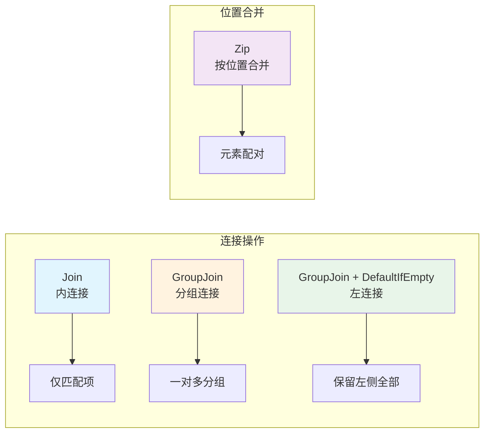
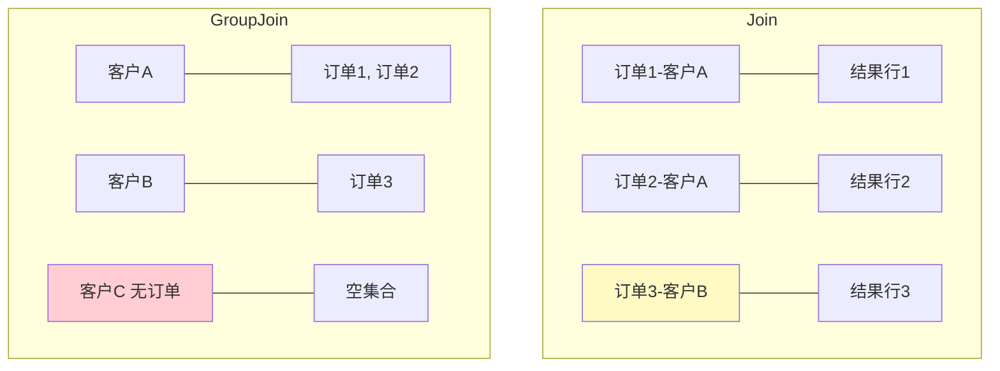
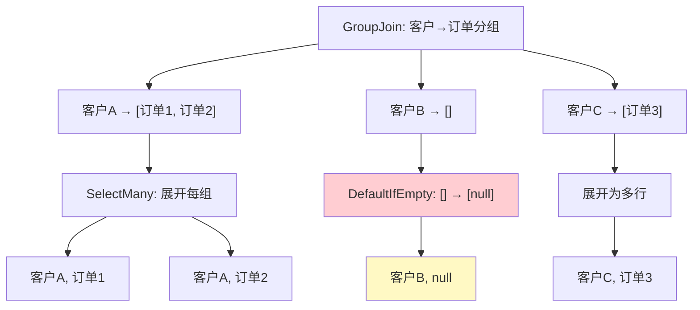
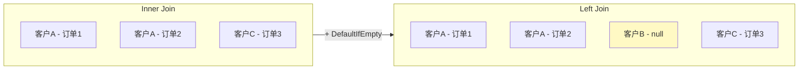
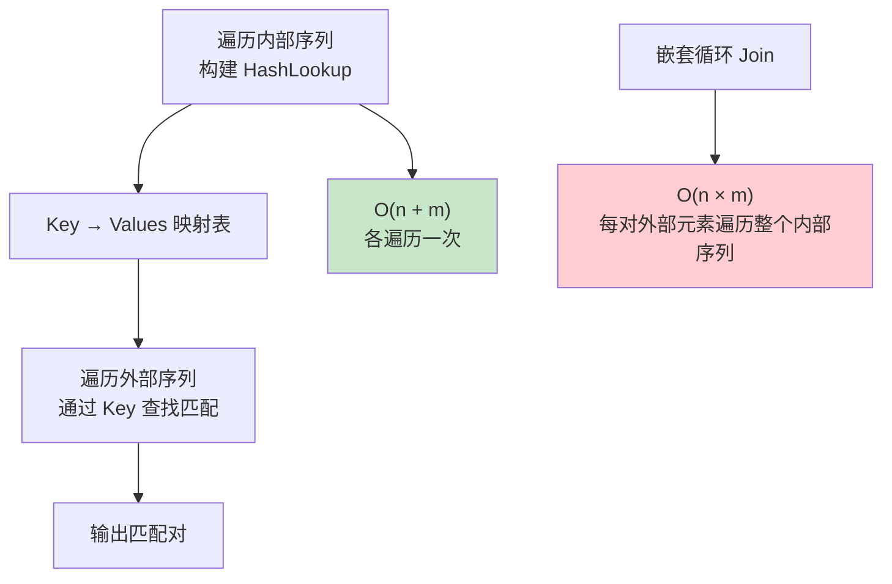

# Join 与 GroupJoin

连接（Join）是 LINQ 中处理多数据源关联的核心能力，等价于 SQL 中的 JOIN 操作。`Join` 实现内连接，`GroupJoin` 实现分组连接（左连接的基础），`Zip` 按位置合并序列。



## 一、Join — 内连接（Inner Join）

### 方法语法

```csharp
// Join(inner, outerKeySelector, innerKeySelector, resultSelector)
var result = customers.Join(
    orders,
    customer => customer.Id,       // 外键选择器
    order => order.CustomerId,       // 内键选择器
    (customer, order) => new         // 结果选择器
    {
        CustomerName = customer.Name,
        OrderId = order.Id,
        OrderAmount = order.Amount
    });
```

参数说明：

| 参数 | 说明 |
|------|------|
| `inner` | 要连接的内部序列 |
| `outerKeySelector` | 外部序列的键选择器 |
| `innerKeySelector` | 内部序列的键选择器 |
| `resultSelector` | 从匹配对创建结果的函数 |

### 查询语法

```csharp
var result = from c in customers
             join o in orders on c.Id equals o.CustomerId
             select new
             {
                 CustomerName = c.Name,
                 OrderId = o.Id,
                 OrderAmount = o.Amount
             };
```

> 查询语法的 `join...on...equals` 更加直观，尤其适合多表连接。

### 等值连接限制

LINQ Join **只支持等值连接**（`equals`），不支持 `>=`、`<=` 等非等值条件：

```csharp
// 支持：等值连接
join o in orders on c.Id equals o.CustomerId

// 不支持：非等值连接
// join o in orders on c.Id >= o.CustomerId  // 编译错误

// 非等值连接的替代方案：交叉连接 + Where
var result = from c in customers
             from o in orders
             where c.Id == o.CustomerId && o.Amount > 100
             select new { c.Name, o.Amount };
```

### 业务场景

```csharp
// 1. 订单 + 客户信息关联
var orderDetails = orders
    .Join(customers,
        o => o.CustomerId,
        c => c.Id,
        (o, c) => new
        {
            OrderId = o.Id,
            CustomerName = c.Name,
            CustomerPhone = c.Phone,
            OrderAmount = o.Amount
        });

// 2. 员工 + 部门信息关联
var employeeInfo = employees
    .Join(departments,
        e => e.DeptId,
        d => d.Id,
        (e, d) => new
        {
            EmployeeName = e.Name,
            DepartmentName = d.Name,
            e.Salary
        });

// 3. 商品 + 分类信息关联
var productWithCategory = products
    .Join(categories,
        p => p.CategoryId,
        c => c.Id,
        (p, c) => new
        {
            ProductName = p.Name,
            CategoryName = c.Name,
            p.Price
        });
```

## 二、GroupJoin — 分组连接（Left Join 基础）

`GroupJoin` 类似 SQL 的 LEFT JOIN，但结果中对右侧的匹配项进行了分组，形成一对多的层级结构。

### 方法语法

```csharp
var result = departments.GroupJoin(
    employees,
    dept => dept.Id,               // 外键
    emp => emp.DeptId,              // 内键
    (dept, empGroup) => new         // 结果选择器：empGroup 是 IEnumerable<Employee>
    {
        Department = dept.Name,
        Employees = empGroup.ToList(),
        EmployeeCount = empGroup.Count()
    });
```

### 查询语法

```csharp
var result = from d in departments
             join e in employees on d.Id equals e.DeptId into empGroup
             select new
             {
                 Department = d.Name,
                 Employees = empGroup,
                 EmployeeCount = empGroup.Count()
             };
```

> 注意 `join...into` 语法——这是查询语法中 `GroupJoin` 的标志，`into` 后的变量就是分组集合。

### 与 Join 的区别

| 特性 | Join | GroupJoin |
|------|------|-----------|
| 关系类型 | 一对一/多对一 | 一对多 |
| 结果形态 | 扁平（每个匹配一行） | 嵌套（右侧分组） |
| 无匹配项 | 排除 | 保留（空分组） |
| 类比 SQL | INNER JOIN | LEFT JOIN + GROUP BY |



### 业务场景

```csharp
// 1. 部门 + 员工列表（一对多）
var deptWithEmployees = departments
    .GroupJoin(employees,
        d => d.Id,
        e => e.DeptId,
        (d, emps) => new
        {
            Department = d.Name,
            Employees = emps.Select(e => e.Name).ToList()
        });
// { Department = "技术部", Employees = ["张三", "李四"] }
// { Department = "市场部", Employees = ["王五"] }
// { Department = "行政部", Employees = [] }  // 无员工也保留

// 2. 客户 + 订单列表（一对多）
var customerOrders = customers
    .GroupJoin(orders,
        c => c.Id,
        o => o.CustomerId,
        (c, orders) => new
        {
            Customer = c.Name,
            Orders = orders.ToList(),
            OrderCount = orders.Count()
        });

// 3. 商品 + 评价列表（一对多）
var productReviews = products
    .GroupJoin(reviews,
        p => p.Id,
        r => r.ProductId,
        (p, reviews) => new
        {
            Product = p.Name,
            Reviews = reviews.ToList(),
            AvgRating = reviews.Any() ? reviews.Average(r => r.Rating) : 0
        });
```

## 三、左连接（Left Join）实现

LINQ 没有直接的 Left Join 操作符，但可以通过 `GroupJoin` + `DefaultIfEmpty` 实现。

### 完整代码示例

```csharp
// 方法语法
var leftJoin = customers
    .GroupJoin(orders,
        c => c.Id,
        o => o.CustomerId,
        (c, orderGroup) => new { Customer = c, Orders = orderGroup })
    .SelectMany(
        x => x.Orders.DefaultIfEmpty(),  // 空分组替换为 null
        (x, o) => new
        {
            x.Customer.Name,
            OrderId = o?.Id,             // 无订单时为 null
            OrderAmount = o?.Amount       // 无订单时为 null
        });

// 查询语法（更直观）
var leftJoin2 = from c in customers
                join o in orders on c.Id equals o.CustomerId into orderGroup
                from o in orderGroup.DefaultIfEmpty()  // 关键：DefaultIfEmpty
                select new
                {
                    CustomerName = c.Name,
                    OrderId = (int?)o.Id,
                    OrderAmount = (decimal?)o.Amount
                };
```

### 执行流程



### 业务场景

```csharp
// 1. 所有客户及其订单（含未下单客户）
var customerAllOrders = from c in customers
                        join o in orders on c.Id equals o.CustomerId into orderGroup
                        from o in orderGroup.DefaultIfEmpty()
                        select new
                        {
                            c.Name,
                            OrderId = o != null ? o.Id : (int?)null,
                            OrderAmount = o != null ? o.Amount : (decimal?)null,
                            HasOrders = o != null
                        };

// 2. 所有部门及员工（含空部门）
var deptAllEmployees = from d in departments
                       join e in employees on d.Id equals e.DeptId into empGroup
                       from e in empGroup.DefaultIfEmpty()
                       select new
                       {
                           Department = d.Name,
                           EmployeeName = e != null ? e.Name : "（无员工）",
                           IsVacant = e == null
                       };
```

### Inner Join vs Left Join 结果对比



## 四、Zip — 拉链合并

`Zip` 按位置将两个序列的元素配对合并，类似拉链的齿合。

### 基本用法

```csharp
// 两个序列按索引配对
string[] names = { "张三", "李四", "王五" };
int[] scores = { 85, 92, 78 };

var result = names.Zip(scores, (name, score) => $"{name}: {score}");
// ["张三: 85", "李四: 92", "王五: 78"]

// 长度不同时，以较短的序列为准
int[] extra = { 1, 2, 3, 4, 5 };
var result2 = names.Zip(extra, (n, i) => $"{n}-{i}");
// ["张三-1", "李四-2", "王五-3"] — 只取到较短的 names 的长度
```

### .NET 6 新增：三序列 Zip

```csharp
// .NET 6+ 支持三个序列的 Zip
string[] names = { "张三", "李四", "王五" };
int[] scores = { 85, 92, 78 };
string[] grades = { "B", "A", "C" };

var result = names.Zip(scores, grades);
// 返回 IEnumerable<(string First, int Second, string Third)>
// [("张三", 85, "B"), ("李四", 92, "A"), ("王五", 78, "C")]
```

### 业务场景

```csharp
// 1. 表头 + 表数据合并
string[] headers = { "姓名", "成绩", "等级" };
string[] values = { "张三", "85", "B" };
var row = headers.Zip(values, (h, v) => $"{h}: {v}");
// ["姓名: 张三", "成绩: 85", "等级: B"]

// 2. 两组数据对比
var oldPrices = products.Select(p => p.OldPrice).ToList();
var newPrices = products.Select(p => p.NewPrice).ToList();
var changes = oldPrices.Zip(newPrices, (old, @new) => new
{
    OldPrice = old,
    NewPrice = @new,
    ChangeRate = (@new - old) / old
});
```

## 五、多表连接

### 多个 Join 链式调用

```csharp
// 方法语法：链式 Join
var result = orders
    .Join(orderDetails, o => o.Id, od => od.OrderId, (o, od) => new { o, od })
    .Join(products, x => x.od.ProductId, p => p.Id, (x, p) => new { x.o, x.od, p })
    .Join(categories, x => x.p.CategoryId, c => c.Id, (x, c) => new
    {
        OrderId = x.o.Id,
        ProductName = x.p.Name,
        CategoryName = c.Name,
        Quantity = x.od.Quantity,
        UnitPrice = x.od.UnitPrice
    });
```

### 查询语法多 join 更清晰

```csharp
// 查询语法：多表连接更直观
var result = from o in orders
             join od in orderDetails on o.Id equals od.OrderId
             join p in products on od.ProductId equals p.Id
             join c in categories on p.CategoryId equals c.Id
             select new
             {
                 OrderId = o.Id,
                 ProductName = p.Name,
                 CategoryName = c.Name,
                 Quantity = od.Quantity,
                 UnitPrice = od.UnitPrice,
                 LineTotal = od.Quantity * od.UnitPrice
             };
```

> 多表连接时，查询语法的可读性远优于方法语法。推荐优先使用查询语法。

### 业务场景：订单 + 明细 + 商品 + 分类 四表关联

```csharp
// 完整的订单报表查询
var orderReport = from o in dbContext.Orders
                  join od in dbContext.OrderDetails on o.Id equals od.OrderId
                  join p in dbContext.Products on od.ProductId equals p.Id
                  join c in dbContext.Categories on p.CategoryId equals c.Id
                  where o.OrderDate >= DateTime.Today.AddDays(-30)
                  select new OrderReportItem
                  {
                      OrderId = o.Id,
                      OrderDate = o.OrderDate,
                      CustomerName = o.Customer.Name,
                      ProductName = p.Name,
                      CategoryName = c.Name,
                      Quantity = od.Quantity,
                      UnitPrice = od.UnitPrice,
                      LineTotal = od.Quantity * od.UnitPrice
                  };
```

## 六、Join 的性能优化

### Hash Lookup 机制

LINQ 的 `Join` 内部使用 Hash Lookup（哈希查找），时间复杂度为 **O(n + m)**，远优于嵌套循环的 O(n × m)：



### 嵌套循环 vs LINQ Join

```csharp
// 反模式：嵌套循环 Join（O(n × m)）
var result = from c in customers
             from o in orders
             where c.Id == o.CustomerId
             select new { c.Name, o.Amount };

// 推荐：使用 Join（O(n + m)）
var result = from c in customers
             join o in orders on c.Id equals o.CustomerId
             select new { c.Name, o.Amount };
```

> 看起来结果相同，但 `Join` 内部的 Hash Lookup 使得性能差距在数据量大时非常显著。1 万条 × 1 万条的嵌套循环需要 1 亿次比较，而 `Join` 只需要约 2 万次查找。

### 大数据量 Join 的内存考虑

```csharp
// Join 需要将内部序列全部加载到内存中构建 Hash 表
// 如果内部序列非常大，可能导致内存压力

// 优化策略：
// 1. 先 Filter 再 Join
var result = activeCustomers  // 先过滤
    .Join(recentOrders, ...);  // 再 Join

// 2. 小表做内部序列（被加载到 Hash 的那个）
var result = customers         // 小表（外部）
    .Join(orders, ...);        // 大表（内部） — Hash 表基于 orders 构建
// 注意：LINQ Join 会将 inner 序列加载到内存，因此 inner 应该是较小的集合

// 3. 使用 IQueryable 让数据库执行 Join
var result = dbContext.Orders       // 数据库侧执行
    .Join(dbContext.Customers, ...); // 翻译为 SQL JOIN
```

### IQueryable 中 Join 的 SQL 翻译

```csharp
// EF Core 中的 Join 翻译
var query = from o in dbContext.Orders
            join c in dbContext.Customers on o.CustomerId equals c.Id
            where o.Amount > 100
            select new { o.Id, c.Name, o.Amount };

// 生成的 SQL：
// SELECT [o].[Id], [c].[Name], [o].[Amount]
// FROM [Orders] AS [o]
// INNER JOIN [Customers] AS [c] ON [o].[CustomerId] = [c].[Id]
// WHERE [o].[Amount] > 100.0

// GroupJoin 的翻译
var query2 = from c in dbContext.Customers
             join o in dbContext.Orders on c.Id equals o.CustomerId into orders
             select new { c.Name, OrderCount = orders.Count() };

// 生成的 SQL：
// SELECT [c].[Name], COUNT([o].[Id]) AS [OrderCount]
// FROM [Customers] AS [c]
// LEFT JOIN [Orders] AS [o] ON [c].[Id] = [o].[CustomerId]
// GROUP BY [c].[Name]
```

> 在 IQueryable 场景下，Join 由数据库引擎执行，无需担心内存中的 Hash 表大小问题。

## 操作符速查表

| 操作符 | 类型 | SQL 等价 | 结果形态 |
|--------|------|---------|---------|
| `Join` | 内连接 | INNER JOIN | 扁平（每个匹配一行） |
| `GroupJoin` | 分组连接 | LEFT JOIN + GROUP BY | 嵌套（右侧分组） |
| `GroupJoin + DefaultIfEmpty` | 左连接 | LEFT JOIN | 扁平（含 null） |
| `Zip` | 位置合并 | 无 | 按索引配对 |

## 方法语法 vs 查询语法选择建议

| 场景 | 推荐 | 原因 |
|------|------|------|
| 单表 Join | 方法语法 | 简洁直观 |
| 多表 Join | 查询语法 | 多 `join` 更清晰 |
| Left Join | 查询语法 | `into` + `DefaultIfEmpty` 更自然 |
| Zip | 方法语法 | 查询语法无对应写法 |
