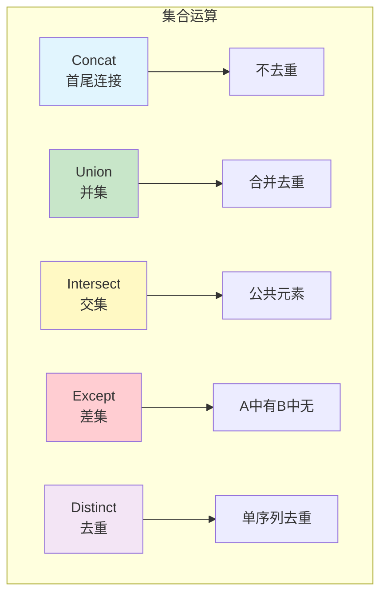
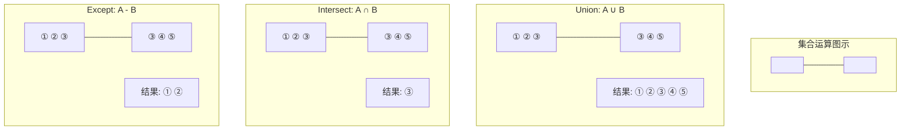

# 集合运算

集合运算操作符对两个序列进行数学集合论运算，包括并集、交集、差集、连接和去重。它们是处理多数据源合并、数据对比、差异分析的核心工具。



## 一、Concat — 连接

`Concat` 将两个序列首尾相连，保留所有元素（包括重复项）。

### 基本用法

```csharp
int[] first = { 1, 2, 3 };
int[] second = { 3, 4, 5 };

var result = first.Concat(second);
// [1, 2, 3, 3, 4, 5] — 保留重复的 3
```

### 与 Union 的区别

```csharp
// Concat：不去重，保留所有元素
var concatResult = first.Concat(second);   // [1, 2, 3, 3, 4, 5]

// Union：去重，只保留唯一元素
var unionResult = first.Union(second);     // [1, 2, 3, 4, 5]
```

| 特性 | Concat | Union |
|------|--------|-------|
| 结果元素 | 全部保留 | 去重后保留 |
| 重复项 | 保留 | 去除 |
| 等价 SQL | UNION ALL | UNION |
| 性能 | 更快（无需去重比较） | 较慢（需哈希比较去重） |

### 业务场景

```csharp
// 1. 多数据源合并
var allProducts = electronicProducts
    .Concat(clothingProducts)
    .Concat(foodProducts);
// 不同类目商品合并展示，可能有同名商品

// 2. 分页数据追加
var page1 = dbContext.Products.OrderBy(p => p.Id).Take(20);
var page2 = dbContext.Products.OrderBy(p => p.Id).Skip(20).Take(20);
var combined = page1.Concat(page2);  // 合并两页数据

// 3. 缓存 + 数据库数据合并
var cachedItems = cache.GetRecentItems();
var dbItems = dbContext.Items.Where(i => !cachedItems.Any(c => c.Id == i.Id));
var allItems = cachedItems.Concat(dbItems);
```

## 二、Union — 并集

`Union` 合并两个序列并去除重复元素，等价于数学上的并集运算。

### 基本用法

```csharp
int[] setA = { 1, 2, 3, 4 };
int[] setB = { 3, 4, 5, 6 };

var union = setA.Union(setB);
// [1, 2, 3, 4, 5, 6] — 3 和 4 只出现一次
```

### 自定义相等比较器

对于引用类型，`Union` 默认使用引用相等。若要按属性值比较，需提供自定义比较器：

```csharp
// 自定义比较器
public class UserComparer : IEqualityComparer<User>
{
    public bool Equals(User x, User y) => x.Id == y.Id;
    public int GetHashCode(User obj) => obj.Id.GetHashCode();
}

// 使用自定义比较器
var allUsers = domesticUsers.Union(foreignUsers, new UserComparer());
// 按 Id 去重，即使 Name 不同也视为相同
```

### .NET 6+：UnionBy

```csharp
// .NET 6 新增 UnionBy，按指定属性去重
var allUsers = domesticUsers.UnionBy(foreignUsers, u => u.Id);
// 等价于使用自定义比较器，但更简洁
```

### 业务场景

```csharp
// 1. 多来源用户合并去重
var allUsers = appUsers.UnionBy(webUsers, u => u.Email);
// 不同渠道注册的用户，按邮箱去重合并

// 2. 标签合并
var allTags = article1.Tags.Union(article2.Tags).Union(article3.Tags);
// 多篇文章标签合并，相同标签只保留一个

// 3. 多日期范围的价格取并集
var allAvailableDates = summerPrices.Keys
    .Union(winterPrices.Keys)
    .Union(holidayPrices.Keys);
```

## 三、Intersect — 交集

`Intersect` 返回两个序列中都存在的元素（公共元素）。

### 基本用法

```csharp
int[] setA = { 1, 2, 3, 4, 5 };
int[] setB = { 3, 4, 5, 6, 7 };

var intersection = setA.Intersect(setB);
// [3, 4, 5] — 只保留两者都有的
```

### 自定义比较器

```csharp
// 按部门名称求交集
var commonDepts = deptA.Intersect(deptB, new DeptNameComparer());

// .NET 6+: IntersectBy
var commonUsers = groupA.IntersectBy(groupB.Select(u => u.Email), u => u.Email);
```

### 业务场景

```csharp
// 1. 共同好友
var mutualFriends = userA.Friends.IntersectBy(userB.Friends, f => f.UserId);

// 2. 权限交集（取共同权限）
var commonPermissions = adminPermissions.Intersect(userPermissions);
// 两个角色共同拥有的权限

// 3. 库存对比（两仓库都有哪些商品）
var sharedProducts = warehouseAProducts
    .IntersectBy(warehouseBProducts.Select(p => p.Sku), p => p.Sku);
```

## 四、Except — 差集

`Except` 返回在第一个序列中但不在第二个序列中的元素。

### 基本用法

```csharp
int[] setA = { 1, 2, 3, 4, 5 };
int[] setB = { 3, 4, 5, 6, 7 };

var difference = setA.Except(setB);
// [1, 2] — 只保留 A 中有但 B 中没有的
```

### 自定义比较器

```csharp
// .NET 6+: ExceptBy
var removedItems = oldList.ExceptBy(newList.Select(x => x.Id), x => x.Id);
```

### 顺序敏感性

```csharp
// Except 是不对称的：A.Except(B) ≠ B.Except(A)
int[] a = { 1, 2, 3 };
int[] b = { 2, 3, 4 };

a.Except(b);  // [1] — A 有 B 无
b.Except(a);  // [4] — B 有 A 无

// 对称差集（A 或 B 中有但不同时在两者中）
var symmetricDiff = a.Except(b).Concat(b.Except(a));
// [1, 4]
```

### 业务场景

```csharp
// 1. 新增用户（新列表 - 旧列表）
var newUsers = currentUsers.ExceptBy(previousUsers.Select(u => u.Id), u => u.Id);

// 2. 流失用户（旧列表 - 新列表）
var churnedUsers = previousUsers.ExceptBy(currentUsers.Select(u => u.Id), u => u.Id);

// 3. 权限差异（角色A有但角色B没有的权限）
var extraPermissions = roleAPermissions.Except(roleBPermissions);

// 4. 待删除的记录（数据库中存在但新数据中不存在）
var toDelete = existingRecords.ExceptBy(newData.Select(d => d.Key), r => r.Key);
```

## 五、Distinct — 去重

`Distinct` 从序列中去除重复元素，只保留每个唯一值的第一次出现。

### 基本去重

```csharp
int[] numbers = { 1, 2, 2, 3, 3, 3, 4 };
var unique = numbers.Distinct();
// [1, 2, 3, 4]
```

### 自定义比较器

```csharp
// .NET 6 之前：需要自定义 IEqualityComparer
public class ProductByNameComparer : IEqualityComparer<Product>
{
    public bool Equals(Product x, Product y) => x.Name == y.Name;
    public int GetHashCode(Product obj) => obj.Name.GetHashCode();
}

var uniqueByName = products.Distinct(new ProductByNameComparer());
```

### .NET 6+：DistinctBy

```csharp
// .NET 6 新增 DistinctBy，按指定属性去重
var uniqueByCategory = products.DistinctBy(p => p.CategoryId);
// 每个分类只保留第一个产品

var uniqueByEmail = users.DistinctBy(u => u.Email);
// 每个邮箱只保留一个用户
```

### 业务场景

```csharp
// 1. 标签去重
var uniqueTags = allArticles
    .SelectMany(a => a.Tags)
    .Distinct();

// 2. 按属性去重（保留每组第一个）
var latestPerUser = logs
    .OrderByDescending(l => l.Timestamp)
    .DistinctBy(l => l.UserId);
// 每个用户只保留最新一条日志

// 3. 分类去重
var categories = products
    .Select(p => p.Category)
    .Distinct()
    .OrderBy(c => c);
```

## 六、集合运算对比

### 对比表

| 运算 | 描述 | 是否去重 | SQL 等价 | 结果集 |
|------|------|---------|---------|--------|
| `Concat` | 首尾连接 | 否 | UNION ALL | A + B（含重复） |
| `Union` | 并集 | 是 | UNION | A ∪ B |
| `Intersect` | 交集 | 是 | INTERSECT | A ∩ B |
| `Except` | 差集 | 是 | EXCEPT | A - B |
| `Distinct` | 单序列去重 | 是 | SELECT DISTINCT | A 的唯一值 |

### 维恩图



### 性能特征

```csharp
// 所有集合运算（除 Concat）内部使用 Hash Set 实现去重
// 时间复杂度：O(n + m) 用于构建和查找

// Concat: O(n + m) — 简单连接，无需比较
// Union: O(n + m) — 构建哈希集 + 去重查找
// Intersect: O(n + m) — 构建哈希集 + 交集查找
// Except: O(n + m) — 构建哈希集 + 差集查找
// Distinct: O(n) — 构建哈希集
```

## 七、StackOverflow 常见问题

### 1. Distinct 按属性去重

```csharp
// 问题：如何按对象的某个属性去重？

// .NET 6+：直接使用 DistinctBy
var unique = items.DistinctBy(x => x.Key);

// .NET 6 之前：三种方式

// 方式一：自定义 IEqualityComparer（最规范）
public class KeyComparer : IEqualityComparer<Item>
{
    public bool Equals(Item x, Item y) => x.Key == y.Key;
    public int GetHashCode(Item obj) => obj.Key.GetHashCode();
}
var unique = items.Distinct(new KeyComparer());

// 方式二：GroupBy + First（最常用）
var unique = items.GroupBy(x => x.Key).Select(g => g.First());

// 方式三：MoreLINQ 的 DistinctBy（需引入第三方库）
var unique = items.DistinctBy(x => x.Key);  // MoreLINQ
```

### 2. Except 的顺序敏感性

```csharp
// 问题：Except 的结果为什么和预期不同？

// Except 是不对称操作
var a = new[] { 1, 2, 3 };
var b = new[] { 2, 3, 4 };

a.Except(b);  // [1] — A 中有但 B 中没有
b.Except(a);  // [4] — B 中有但 A 中没有

// 记忆：A.Except(B) = "A 减去 B"，类比减法方向

// 对称差集
var symDiff = a.Except(b).Concat(b.Except(a));  // [1, 4]
```

### 3. 大集合的集合运算性能

```csharp
// 问题：两个大集合做 Intersect/Except 很慢怎么办？

// 原因：LINQ 集合运算需要将其中一个序列完整加载到 HashSet
// 两个各 100 万元素的集合做 Intersect，至少需要 100 万元素的 HashSet 内存

// 优化策略：

// 1. 小集合做内部序列（被加载到 HashSet 的那个）
var result = smallCollection.Intersect(largeCollection);
// 而不是 largeCollection.Intersect(smallCollection)
// 注意：LINQ 实现是先将 inner 加载到 HashSet，然后遍历 outer
// 所以实际上应该把小集合放前面

// 2. 先过滤再运算
var result = activeUsers
    .Where(u => u.LastLogin > DateTime.Now.AddDays(-30))
    .Intersect(premiumUsers);

// 3. 数据库端运算（IQueryable）
var result = dbContext.Users
    .Where(u => u.IsActive)
    .Select(u => u.Email)
    .Intersect(
        dbContext.Subscribers.Select(s => s.Email));
// 翻译为 SQL INTERSECT，在数据库端执行
```

### 4. 引用类型的集合运算

```csharp
// 问题：为什么两个"相同"的对象在 Intersect/Except 中不被认为相等？

var user1 = new User { Id = 1, Name = "张三" };
var user2 = new User { Id = 1, Name = "张三" };
var listA = new[] { user1 };
var listB = new[] { user2 };

listA.Intersect(listB);  // 空！因为引用不同

// 解决方案：
// 1. 使用自定义比较器
listA.Intersect(listB, new UserComparer());

// 2. 使用 By 后缀方法（.NET 6+）
listA.IntersectBy(listB.Select(u => u.Id), u => u.Id);

// 3. 使用记录类型（record）
record User(int Id, string Name);  // record 基于值相等
var user1 = new User(1, "张三");
var user2 = new User(1, "张三");
// user1.Equals(user2) == true
```

## .NET 6 By 后缀方法一览

| 原方法 | .NET 6 新增 | 用途 |
|--------|------------|------|
| `Distinct` | `DistinctBy` | 按属性去重 |
| `Union` | `UnionBy` | 按属性并集 |
| `Intersect` | `IntersectBy` | 按属性交集 |
| `Except` | `ExceptBy` | 按属性差集 |
| `MinBy` | `MinBy` | 按属性取最小值对象 |
| `MaxBy` | `MaxBy` | 按属性取最大值对象 |

> `By` 后缀方法大幅简化了按属性进行集合运算的代码，是 .NET 6 的重要改进。升级到 .NET 6 后，优先使用这些方法替代自定义 `IEqualityComparer`。
