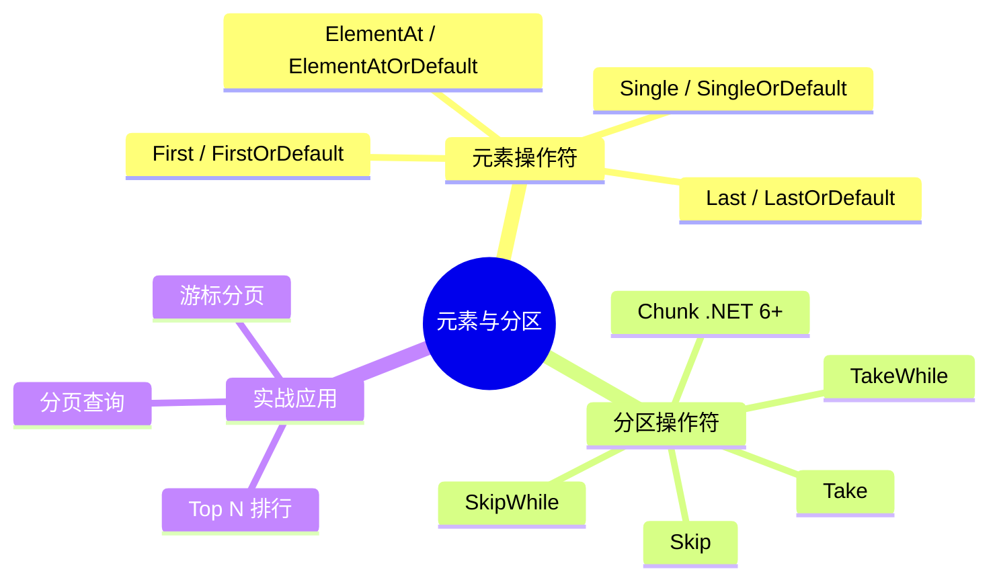
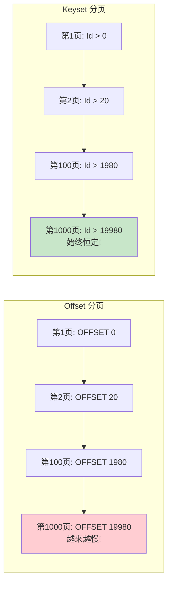

# 元素与分区操作符

元素操作符从序列中提取单个元素，分区操作符截取序列的子集。它们是数据访问和分页查询的基础工具。



## 一、元素操作符

### 1. First / FirstOrDefault — 获取第一个元素

#### 无参版本：取序列第一个元素

```csharp
int[] numbers = { 5, 3, 8, 1, 9 };

int first = numbers.First();            // 5
int firstDefault = Array.Empty<int>().FirstOrDefault();  // 0（default(int)）
```

#### 带条件版本：取满足条件的第一个元素

```csharp
int[] numbers = { 5, 3, 8, 1, 9 };

int firstEven = numbers.First(n => n % 2 == 0);  // 8
int firstNegative = numbers.FirstOrDefault(n => n < 0);  // 0（不存在满足条件的元素）
```

#### First vs FirstOrDefault

```csharp
// First：序列为空时抛出 InvalidOperationException
int[] empty = Array.Empty<int>();
int val = empty.First();  // 抛出异常！

// FirstOrDefault：序列为空时返回 default(T)
int val2 = empty.FirstOrDefault();  // 0（int 的默认值）

// 引用类型的 default 是 null
string? name = emptyStrings.FirstOrDefault();  // null

// 自定义默认值
int val3 = empty.FirstOrDefault();  // 0
int val4 = empty.DefaultIfEmpty(-1).First();  // -1
```

| 操作 | 空序列 | 有元素 |
|------|--------|--------|
| `First()` | 抛 `InvalidOperationException` | 返回第一个 |
| `FirstOrDefault()` | 返回 `default(T)` | 返回第一个 |

#### 业务场景

```csharp
// 获取最新一条记录
var latestOrder = orders
    .OrderByDescending(o => o.CreatedAt)
    .FirstOrDefault();

// 查找第一个满足条件的项
var pendingOrder = orders
    .FirstOrDefault(o => o.Status == "Pending");

// EF Core 中按 ID 查找（推荐 FirstOrDefault 而非 Single）
var user = await dbContext.Users
    .FirstOrDefaultAsync(u => u.Id == userId);
```

### 2. Last / LastOrDefault — 获取最后一个元素

与 `First` / `FirstOrDefault` 完全对称，只是取序列末尾的元素。

```csharp
int[] numbers = { 5, 3, 8, 1, 9 };

int last = numbers.Last();                // 9
int lastEven = numbers.Last(n => n % 2 == 0);  // 8
int lastDefault = Array.Empty<int>().LastOrDefault();  // 0

// 注意：对于 IEnumerable<T>，Last 需要遍历整个序列
// 如果是 IList<T>（如 List<T>），Last 是 O(1) 操作
// EF Core 中，Last 会翻译为 ORDER BY ... DESC LIMIT 1
```

> `Last` 需要遍历到序列末尾，对 `IEnumerable<T>` 的时间复杂度为 O(n)。如果只需要最后一个元素且序列很长，考虑使用 `OrderByDescending(...).First()` 优化（在 IQueryable 中尤其重要）。

### 3. Single / SingleOrDefault — 获取唯一元素

`Single` 严格要求序列中有且仅有一个元素（或一个满足条件的元素），超过一个时抛异常。

```csharp
int[] oneItem = { 42 };
int[] twoItems = { 1, 2 };
int[] empty = Array.Empty<int>();

// 无参版本
oneItem.Single();          // 42 ✓
twoItems.Single();         // 抛异常：序列包含多个元素
empty.Single();            // 抛异常：序列为空

// 带条件版本
int[] numbers = { 1, 3, 5, 8 };
numbers.Single(n => n % 2 == 0);     // 8 ✓（只有一个偶数）
numbers.Single(n => n > 3);          // 抛异常：5 和 8 都满足，超过一个
numbers.SingleOrDefault(n => n > 10); // 0（没有满足条件的元素）

// SingleOrDefault
oneItem.SingleOrDefault();        // 42 ✓
twoItems.SingleOrDefault();       // 抛异常：序列包含多个元素
empty.SingleOrDefault();          // 0（default）
```

#### 元素操作符异常对照

| 操作 | 空序列 | 一个元素 | 多个元素 |
|------|--------|---------|---------|
| `Single()` | 抛异常 | 返回元素 | 抛异常 |
| `SingleOrDefault()` | 返回 `default` | 返回元素 | 抛异常 |
| `First()` | 抛异常 | 返回元素 | 返回第一个 |
| `FirstOrDefault()` | 返回 `default` | 返回元素 | 返回第一个 |

#### 业务场景

```csharp
// 按 ID 查找唯一记录
var config = dbContext.Settings
    .SingleOrDefault(s => s.Key == "MaxRetryCount");

// 配置项查找（预期只有一个）
var adminRole = roles
    .Single(r => r.Name == "Admin");

// 验证唯一性（利用 Single 的严格性）
try
{
    var user = users.Single(u => u.Email == email);
    // 如果有多个相同邮箱的用户，Single 会抛异常，起到验证作用
}
catch (InvalidOperationException)
{
    // 发现数据异常：存在重复邮箱
    logger.LogWarning("发现重复邮箱: {Email}", email);
}
```

### 4. ElementAt / ElementAtOrDefault — 按索引获取

```csharp
string[] names = { "张三", "李四", "王五", "赵六" };

names.ElementAt(0);     // "张三"
names.ElementAt(2);     // "王五"
names.ElementAt(10);    // 抛 ArgumentOutOfRangeException

names.ElementAtOrDefault(10);  // null（string 的 default）

// .NET 6+：支持 Index 语法（从末尾计数）
names.ElementAt(^1);    // "赵六"（最后一个）
names.ElementAt(^2);    // "王五"（倒数第二个）

// ElementAtOrDefault 同样支持
names.ElementAtOrDefault(^5);  // null（超出范围）
```

#### 业务场景

```csharp
// 排行榜取第 N 名
var thirdPlace = leaderboard
    .OrderByDescending(s => s.Score)
    .ElementAtOrDefault(2);  // 第 3 名（索引从 0 开始）

// 获取枚举值
var status = (OrderStatus)Enum.GetValues(typeof(OrderStatus))
    .ElementAt(index);

// 轮询策略：按索引取下一个服务器
var server = servers.ElementAt(currentIndex % servers.Length);
```

### 元素操作符完整对比表

| 操作 | 空序列 | 单元素 | 多元素 | 带条件 | 返回类型 |
|------|--------|--------|--------|--------|---------|
| `First()` | 抛异常 | 返回 | 返回首个 | 支持 | `T` |
| `FirstOrDefault()` | `default` | 返回 | 返回首个 | 支持 | `T?` |
| `Last()` | 抛异常 | 返回 | 返回末个 | 支持 | `T` |
| `LastOrDefault()` | `default` | 返回 | 返回末个 | 支持 | `T?` |
| `Single()` | 抛异常 | 返回 | **抛异常** | 支持 | `T` |
| `SingleOrDefault()` | `default` | 返回 | **抛异常** | 支持 | `T?` |
| `ElementAt(i)` | 越界抛异常 | - | - | 不支持 | `T` |
| `ElementAtOrDefault(i)` | `default` | - | - | 不支持 | `T?` |

## 二、分区操作符

### 1. Take — 取前 N 个

```csharp
int[] numbers = { 1, 2, 3, 4, 5, 6, 7, 8, 9, 10 };

var first3 = numbers.Take(3);       // [1, 2, 3]
var first100 = numbers.Take(100);    // [1, 2, ..., 10]（不超过序列长度不报错）

// 带条件的 Take 在 SkipWhile/TakeWhile 中处理
```

#### .NET 6+：Take(Range)

```csharp
// 支持 C# Range 语法
var middle = numbers.Take(3..6);     // [4, 5, 6]（索引 3 到 5）
var last3 = numbers.Take(^3..);      // [8, 9, 10]（最后 3 个）
var range = numbers.Take(2..5);      // [3, 4, 5]

// 等价于
var middle2 = numbers.Skip(3).Take(3);
```

#### 业务场景

```csharp
// Top N 排行榜
var top10 = products
    .OrderByDescending(p => p.SalesCount)
    .Take(10);

// 最新 N 条记录
var recentOrders = orders
    .OrderByDescending(o => o.CreatedAt)
    .Take(20);

// 随机推荐
var recommendations = products
    .OrderBy(_ => Guid.NewGuid())  // 随机排序
    .Take(5);
```

### 2. Skip — 跳过前 N 个

```csharp
int[] numbers = { 1, 2, 3, 4, 5, 6, 7, 8, 9, 10 };

var skip3 = numbers.Skip(3);    // [4, 5, 6, 7, 8, 9, 10]
var skip100 = numbers.Skip(100); // []（超过序列长度返回空序列，不报错）
```

#### 业务场景

```csharp
// 跳过已处理记录
var unprocessed = allRecords
    .Skip(processedCount);

// 分页查询
var page2 = items
    .OrderBy(i => i.Id)
    .Skip(20)     // 跳过第一页
    .Take(20);    // 取第二页
```

### 3. TakeWhile — 条件取

从序列开头取元素，**直到遇到第一个不满足条件的元素时停止**（之后即使有满足条件的也不再取）。

```csharp
int[] numbers = { 2, 4, 6, 8, 1, 3, 5, 7 };

var result = numbers.TakeWhile(n => n % 2 == 0);
// [2, 4, 6, 8] — 遇到 1 时停止，后面的奇数不会被取

// 注意区别
var where = numbers.Where(n => n % 2 == 0);
// [2, 4, 6, 8] — 本例结果相同，但逻辑完全不同

// TakeWhile 遇到第一个不满足的就停止
int[] numbers2 = { 2, 4, 1, 6, 8 };
var takeResult = numbers2.TakeWhile(n => n % 2 == 0);  // [2, 4] — 遇到 1 停止
var whereResult = numbers2.Where(n => n % 2 == 0);      // [2, 4, 6, 8] — 过滤所有偶数
```

> `TakeWhile` 不是"过滤"，而是"从头取直到条件不满足"。它与 `Where` 的区别类似于"连续"与"全局"的区别。

#### 业务场景

```csharp
// 取连续合格的数据（遇到不合格就停止）
var consecutivePassing = testResults
    .TakeWhile(r => r.IsPassing);

// 取温度上升的连续时段
var risingTemps = hourlyTemps
    .TakeWhile((t, i) => i == 0 || hourlyTemps[i - 1] <= t);

// 从日志开头取到第一个错误之前
var normalLogs = logs
    .TakeWhile(l => l.Level != "Error");
```

### 4. SkipWhile — 条件跳

从序列开头跳过元素，**直到遇到第一个不满足条件的元素时停止跳过**，之后全部返回。

```csharp
int[] numbers = { 1, 3, 5, 2, 4, 6, 1 };

var result = numbers.SkipWhile(n => n % 2 != 0);
// [2, 4, 6, 1] — 跳过 1, 3, 5，遇到 2 后全部返回

// 与 TakeWhile 互补
// TakeWhile: 取连续满足的 → [1, 3, 5]
// SkipWhile: 跳过连续满足的 → [2, 4, 6, 1]
```

#### 业务场景

```csharp
// 跳过前导无效数据
var validRecords = rawData
    .SkipWhile(r => r.Status == "Initializing");

// 跳过排序后的前缀（已排序时跳过小于阈值的）
var highValueItems = items
    .OrderBy(i => i.Value)
    .SkipWhile(i => i.Value < threshold);

// 跳过文件头部的注释行
var codeLines = fileLines
    .SkipWhile(l => l.StartsWith("//"));
```

### 5. Chunk (.NET 6+) — 分块

`Chunk` 将序列分割为固定大小的块，每块是一个数组。

```csharp
int[] numbers = { 1, 2, 3, 4, 5, 6, 7, 8, 9, 10 };

var chunks = numbers.Chunk(3);
// [[1,2,3], [4,5,6], [7,8,9], [10]] — 最后一块可能不足 3 个

// 空序列
var emptyChunks = Array.Empty<int>().Chunk(3);  // 空序列（不包含任何块）
```

#### 业务场景

```csharp
// 批量处理：每次处理 100 条
foreach (var batch in orders.Chunk(100))
{
    await ProcessBatchAsync(batch);
}

// 分批写入数据库
foreach (var chunk in largeDataset.Chunk(1000))
{
    await dbContext.BulkInsertAsync(chunk);
    await dbContext.SaveChangesAsync();
}

// 分批发送通知
foreach (var group in recipients.Chunk(50))
{
    await notificationService.SendBatchAsync(group);
}
```

> `Chunk` 是 .NET 6 的重要新增，替代了之前需要手动实现的分批逻辑，代码更简洁、意图更清晰。

## 三、分页实现

### 经典分页：Skip + Take

```csharp
// 分页查询核心公式
int page = 2;       // 当前页码（从 1 开始）
int pageSize = 20;  // 每页大小

var pagedData = items
    .OrderBy(i => i.Id)
    .Skip((page - 1) * pageSize)  // 跳过前面页的数据
    .Take(pageSize);               // 取当前页的数据

// 封装为分页方法
public static IEnumerable<T> GetPage<T>(
    this IEnumerable<T> source,
    int page,
    int pageSize)
{
    return source
        .Skip((page - 1) * pageSize)
        .Take(pageSize);
}
```

### 分页 + 总数

```csharp
// 同时获取分页数据和总记录数
public class PagedResult<T>
{
    public List<T> Items { get; set; } = new();
    public int TotalCount { get; set; }
    public int Page { get; set; }
    public int PageSize { get; set; }
    public int TotalPages => (int)Math.Ceiling((double)TotalCount / PageSize);
    public bool HasPrevious => Page > 1;
    public bool HasNext => Page < TotalPages;
}

// 使用示例
var query = dbContext.Products.Where(p => p.IsActive);
var totalCount = await query.CountAsync();
var items = await query
    .OrderBy(p => p.Id)
    .Skip((page - 1) * pageSize)
    .Take(pageSize)
    .ToListAsync();

var result = new PagedResult<Product>
{
    Items = items,
    TotalCount = totalCount,
    Page = page,
    PageSize = pageSize
};
```

### EF Core 中的分页

```csharp
// EF Core 分页查询（翻译为 OFFSET ... FETCH 或 LIMIT/OFFSET）
var paged = await dbContext.Orders
    .Where(o => o.Status == "Completed")
    .OrderByDescending(o => o.CreatedAt)
    .Skip((page - 1) * pageSize)
    .Take(pageSize)
    .ToListAsync();

// 生成的 SQL（SQL Server）：
// SELECT * FROM Orders
// WHERE Status = 'Completed'
// ORDER BY CreatedAt DESC
// OFFSET 20 ROWS FETCH NEXT 20 ROWS ONLY
```

### 性能考虑：Skip 大偏移量的问题

```csharp
// 问题：Skip 在大偏移量时性能下降
// Skip(100000).Take(20) → 数据库仍需扫描前 100000 行再跳过

// 偏移量 vs 查询时间（典型表现）
// Skip(0)      → 10ms
// Skip(1000)   → 15ms
// Skip(10000)  → 50ms
// Skip(100000) → 500ms
// Skip(1000000)→ 5000ms+
```

### 替代方案：Keyset Pagination（游标分页）

```csharp
// Keyset Pagination：基于上一页最后一条记录的键值继续查询
// 优点：无论翻到第几页，查询时间都恒定

// 第一页
var firstPage = await dbContext.Orders
    .OrderBy(o => o.Id)
    .Take(20)
    .ToListAsync();

// 下一页：基于上一页最后一条的 Id
int lastId = firstPage.Last().Id;
var nextPage = await dbContext.Orders
    .Where(o => o.Id > lastId)  // 关键：用 Where 代替 Skip
    .OrderBy(o => o.Id)
    .Take(20)
    .ToListAsync();

// 生成的 SQL：
// SELECT * FROM Orders WHERE Id > 20 ORDER BY Id LIMIT 20
// 无论 id 多大，都走索引，时间恒定
```



| 分页方式 | 优点 | 缺点 | 适用场景 |
|---------|------|------|---------|
| Offset 分页 | 支持跳页、总数展示 | 大偏移量慢 | 页码小、需要总数 |
| Keyset 分页 | 性能恒定、不受页码影响 | 不支持跳页、无法获取总数 | 无限滚动、大数据量 |

## 四、StackOverflow 常见问题

### 1. First vs Single 选择

```csharp
// 问题：查询单条记录时用 First 还是 Single？

// 分析：
// First — 返回第一个匹配项，即使有多条也不报错
// Single — 严格要求只有一条匹配，多条时抛异常

// 按主键查询：理论上只有一条，但用 Single 更安全
var user = await dbContext.Users.SingleAsync(u => u.Id == userId);
// 如果因为数据问题出现重复 ID，Single 会抛异常，帮助发现问题

// 按非唯一键查询：用 First
var firstOrder = await dbContext.Orders.FirstAsync(o => o.CustomerId == custId);
// 一个客户可能有多个订单

// 经验法则：
// - 如果业务上"应该只有一条" → 用 Single（加一道安全校验）
// - 如果业务上"可能有多条" → 用 First + OrderBy 确定取哪条
// - EF Core 中按主键查询，推荐 Single 或 First 均可
//   性能无差异（都翻译为 SELECT ... LIMIT 1 或 WHERE Id = @p0）
```

### 2. FirstOrDefault 返回 null vs default

```csharp
// 问题：FirstOrDefault 返回的是 null 还是 default？

// 引用类型：default 是 null
string? name = names.FirstOrDefault();  // null

// 值类型：default 是类型的默认值（0, false 等）
int number = numbers.FirstOrDefault();  // 0
DateTime date = dates.FirstOrDefault();  // 0001-01-01

// 问题：0 是"集合中没有元素"还是"第一个元素就是 0"？
int[] zeros = { 0 };
int[] empty = Array.Empty<int>();
zeros.FirstOrDefault();  // 0
empty.FirstOrDefault(); // 0 — 无法区分！

// 解决方案：
// 1. 使用可空值类型
int? result = empty.Cast<int?>().FirstOrDefault();  // null
// 2. 先判断 Any
if (numbers.Any())
{
    int first = numbers.First();  // 安全
}
// 3. 自定义哨兵值
int result = numbers.DefaultIfEmpty(-1).First();  // -1 表示空
```

### 3. 分页查询的性能优化

```csharp
// 问题：分页查询在页码很大时非常慢，如何优化？

// 1. 使用 Keyset 分页（见上文）

// 2. 限制最大页码
int maxPage = 100;
if (page > maxPage) return Enumerable.Empty<T>();

// 3. 使用缓存（首页数据缓存）
if (page == 1)
{
    return await cache.GetOrCreateAsync("products_page_1", async _ =>
        await query.Take(pageSize).ToListAsync());
}

// 4. 避免 Count + Skip/Take 两次查询
// 不推荐：两次数据库查询
var total = await query.CountAsync();
var items = await query.Skip(skip).Take(take).ToListAsync();

// 可用但非标准：某些数据库支持 CTE 一次获取
// SQL Server: COUNT(*) OVER()
// PostgreSQL: window function
```

### 4. Skip(0) 是否安全

```csharp
// Skip(0) 是安全的，返回原序列的等价序列
var result = numbers.Skip(0);  // 等价于 numbers

// EF Core 优化：Skip(0) 在生成的 SQL 中被忽略
var query = dbContext.Users.Skip(0).Take(10);
// 生成: SELECT * FROM Users LIMIT 10（无 OFFSET）

// Take(0) 也是安全的，返回空序列
var empty = numbers.Take(0);  // 空序列

// 动态分页时无需特殊处理 page=1 的情况
var data = query
    .Skip((page - 1) * pageSize)  // page=1 时 Skip(0)，安全
    .Take(pageSize);
```

### 5. TakeWhile / SkipWhile 的常见陷阱

```csharp
// 陷阱：期望全局过滤，但实际只看连续前缀
int[] numbers = { 1, 2, 10, 3, 20, 4 };

// 错误理解：取所有小于 10 的数
var wrong = numbers.TakeWhile(n => n < 10);
// 实际结果: [1, 2] — 遇到 10 就停了，后面的 3, 4 不会被取

// 正确做法：用 Where 进行全局过滤
var correct = numbers.Where(n => n < 10);
// [1, 2, 3, 4]

// TakeWhile/SkipWhile 的正确使用场景：
// 有序序列的前缀操作
var sorted = new[] { 1, 2, 3, 5, 8, 13, 21 };
var lessThan10 = sorted.TakeWhile(n => n < 10);  // [1, 2, 3, 5, 8]
// 因为已排序，TakeWhile 等价于"取所有小于 10 的"
```

## 操作符速查表

| 操作符 | 类别 | 空集合行为 | 越界行为 | 典型用途 |
|--------|------|-----------|---------|---------|
| `First` | 元素 | 抛异常 | - | 取第一个 |
| `FirstOrDefault` | 元素 | `default` | - | 安全取第一个 |
| `Last` | 元素 | 抛异常 | - | 取最后一个 |
| `LastOrDefault` | 元素 | `default` | - | 安全取最后一个 |
| `Single` | 元素 | 抛异常 | - | 取唯一（严格） |
| `SingleOrDefault` | 元素 | `default` | - | 安全取唯一 |
| `ElementAt` | 元素 | - | 抛异常 | 按索引取 |
| `ElementAtOrDefault` | 元素 | - | `default` | 安全按索引取 |
| `Take` | 分区 | 返回空 | 返回全部 | 取前 N 个 |
| `Skip` | 分区 | 返回空 | 返回空 | 跳过前 N 个 |
| `TakeWhile` | 分区 | 返回空 | - | 条件取前缀 |
| `SkipWhile` | 分区 | 返回空 | - | 条件跳前缀 |
| `Chunk` | 分区 | 返回空 | - | 分块处理 |
